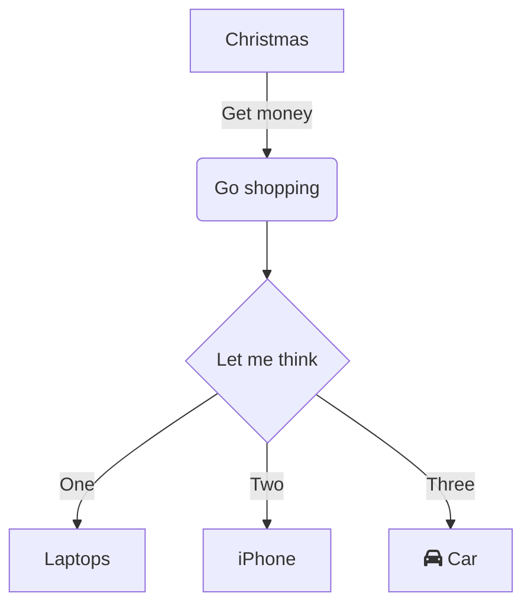

# dev

creation

**Created:** 2025.02.10

**Items:** 117

---

# RUST的WEB开发真的能用于生产吗？ 寅默

**Author:** 寅默  
**Bio:** Arcaea 业余玩家  
**Avatar:**   
**Author URL:** https://www.zhihu.com/people/91e368b65e10774073343ac5cda9a462  
**Published:** 2025.08.27 20:12:28  
**Updated:** 2025.08.29 10:45:36  
**Question:** https://www.zhihu.com/question/638114508  
**Question Created:** 2024.01.05 08:23:53  
**Question Updated:** 2024.01.05 08:23:53  
**Votes:** 450  
**Comments:** 106  
**Type:** answer  

怎么这么多答主连 rust web 没写过就来评价啊...... 我说实话，说 rust web 还要考虑很多生命周期纯属就是没写过的...... 在 rust web 框架下写 crud 能涉及到生命周期的一般也就只有你想要在结构体里面放&str，以及一些框架特质内容（很少）， 否则根本就不会遇到需要手动注明生命周期问题。

我个人写过了超过 2w 行的 rust web 后端，我学校（HITSZ）的计算机学院的交作业平台后端完全出自我手，这个交作业平台的后端使用的是 rust rocket 框架，前端使用 vue，采用前后端分离思想构建。我和前端的同学一起合作完成。架构上，数据库采用 mariadb，文件存储使用 minio s3 服务（s3 rust 有 sdk 可以直接用）。这个交作业平台之前后端是 django，但是这几年开始频繁暴雷，在作业的 ddl 经常卡死了，暂时的解决方案是四小时重启一次。所以我接手之后重写了整个后端，解决了性能和稳定性问题之后，还加了一些给管理员用的新功能，总用时还不到半个月。

代码量大概在 7000 行 rust。另外我还有一个开源项目在写[https://github.com/YinMo19/Arcaea_server_rs](https://link.zhihu.com/?target=https%3A//github.com/YinMo19/Arcaea_server_rs)这个项目大概已经写了 1w6 行的rust。我想我对这个话题（crud 的 rust 后端）是有发言权的。因为我学校的这个项目不能放出来，所以我下面的演示就基于这个 1w6 行的后端来展示。

说完我的经历之后，简单说说我对 rust 写 web 后端的理解。我最熟悉的框架是 rocket。另外我还熟悉 django 框架。这也没什么，如果我连 django 都看不懂，那么前文说的重写自然也就无从谈起。django 框架我并不喜欢，但是我还是吸收了不少后端的范式，对怎么做后端也有了自己的见解。

rocket 框架我个人挺推荐用的。简单，好写，性能完全够用。虽然 rocket 在一众恐怖性能的 rust web 框架中并不突出，但是写起来简单又好使。根据题主的自述，我个人很推荐先学习这个框架。从我了解来看，大部分的 rust web 框架其实都从 rocket 中吸取了不少的经验，尤其是路由宏系统，actix-web 早期使用 actor 模型需要较大的学习成本，但是最近的版本支持了路由宏之后和 rocket 就很像了。

学习了 rocket 之后上手其他框架都不会太难。我没有系统学习过actix，但是一眼就知道上面这段代码是什么意思。我相信你学习了 rocket 之后也能做到。

说完框架的选择，我讲讲一些偏技术细节的事情。只是想喷写 rust 低效的人可以走了，这段对你们没什么好看的。

上面已经讲到了路由宏系统，这里的路由宏系统 rocket 可以说独树一帜。他的设计思路最早据说（从论坛上看到的，不知道真假）是从 flask 借鉴的。写过 flask 就知道，他利用 blueprint 可以直接在函数上注明一个装饰器来作为路由路口，然后可以直接匹配所有满足这样样式的路由，通过这个函数来直接处理并返回。我相信你能看懂下面的逻辑是怎样的。

rocket 的路由系统和这个是差不多的。

他使用 rust 的宏系统做到了一件非常有意义的事情。你可以看到#[get("/hello/<name>")]这样的路由放在函数前，那么这个函数就必须要有这个 name 的参数。这件事是在编译时确认的，你没写就 pass 不了编译。并且你写了 name 的类型之后，请求在匹配到这个路由会自动检查类型，按照图中的案例，如果你请求了 /hello/haha/a/b/ 那么根本就进入不到这个路由，因为他会检查第二个参数 age 一定是一个 u8，cool 一定是一个 bool。

这个系统的路由安全，直接 pass 了一大堆的请求注入。你在别的框架中必须先明显的判断用户输入的 name 是一个 name 你的 age 是一个数字，你的 cool 是一个 bool。但是这个框架你只需要把类型先标注好了，那么剩下的事情不用你操心。上面那段 python 版本的代码用 rust 写是这样的

由于实现的代码结构可能不太一样，因此你可能只能借鉴一下（python 版本和 rust 版本的写法区别）。python 代码中的 @auth_required 是一个用来校验请求来自 已登录用户 的请求守卫，在我的 rust 版本中对应参数中的 auth: Authguard（为什么写一个参数就可以实现请求守护，你往下看就知道了）

就这样一个函数，就实现了一个 endpoint。经典的 crud web 服务就是这样，对一个端点发送请求，然后收到这个请求之后解析参数，然后对数据库做查询和处理，然后处理数据之后返回回去。整一个流程从宏那边解析参数进来，然后操作操作之后直接通过函数返回值返回回去，没有任何难度的地方（一直在讲生命周期的人到底写没写过我很怀疑。）异步之类的事情，框架都帮你完成了，你从来就不需要考虑这种问题。你是写业务的人不是写框架的人，你只需要懂得在 fn 前面写个 async，调用的时候加一个 await，这就够你 crud 写的了。

既然是 crud，那么肯定要操作数据库。我个人在 django 中写 orm 的印象并不好。可能是因为写序列化器的语法有点奇怪，也有可能是因为模型定义在类里面看上去过于动态，语法冗杂，总之我在开发 django的的时候总是被迫停下来查路由 permission check 文档（用的 django restframwork）,查 orm 文档，以及思考怎么写 orm 的 filter 才能不会出现一行代码好几次查询。怎么才能让查询更高效。更多时候我心中已经有一个构思，我知道我需要联什么表获取什么信息查什么内容，我心中已经有很接近 sql 的查询了，但是我为了迁就 orm 系统就必须去用 orm object 获取整个对象的完整信息再 filter 我需要的内容。

虽然这样说可能有点狂，但是我对 orm 的理解是这样的，如果我能写出 orm 的代码，那么我就能知道其背后代表的 sql 语句是什么。阅读 django 的入门教程你就会发现，解释 orm 的语义需要靠它实际上会产生什么 sql，也就是说不存在不懂怎么操作数据库但是就是会写 orm 的情况。那我为啥不直接 raw sql 起手？我不需要任何的定义模型的奇怪序列化器，也不需要与任何框架相关的奇怪 filter，我只是想写一条 sql 查询查到我想要的东西。我知道你肯定想喷了，orm 怎么怎么好，但是请看下一段。

rust 的 sqlx 框架相对别的语言都没有的一个最大的优点，是利用 rust 的宏机制实现编译期检查 sql 语句的正确性。他会在编译期连接一个真实的数据库，通过模拟代码中使用的 sql 来判断语句正确性。几乎可以这样说，只要能通过编译，那么写出来的 sql 语句就没有语法错误（但是性能/正确性两说，这些烂了谁也救不了）。另外一个最神奇的功能是，他会根据你 sql 语句来查询数据库获取数据库中这个字段的数据类型，然后自动给返回值赋值为一个结构体，你可以直接访问你写在 raw sql 里面的字段名作为结构体元素名。这在别的语言是很少见的，请认真看下面这段代码

stamina_info 被赋值为一个 Record 类型，下面就可以直接使用里面元素 `stamina_info.max_stamina_ts, stamina_info.stamina` 。上面说过，这两个字段的类型通过数据库中的字段类型来确定。如果数据库中的初始定义类型没有指定非 null，那么这个字段则会被自动解析为 `Option<T>`。这也算强类型的好处，因为在 python 中可能就得

使用 `x[0], x[1]` 这样的下表来借代每个返回值，对于长一些的查询语句就不太友好了，并且对于空值的处理有时候也会疏忽，可阅读性在这里反而 rust 会更高一些。

但是这里也需要声明，不喜欢 orm 是我个人的风格，事实上在 rust 生态中的 seaorm 和 diesel 也非常优秀。尤其是 diesel，它也能实现编译期检查生成的 sql 的正确性。

seaorm 没有编译期检查查询正确性，它更强调动态构建查询，实现 compile time check 有点强人所难了。但是你自己保证正确性本就是除了 rust 以外绝大多数语言都需要的事情，这里也不应视为缺点。总而言之，rust 的类型系统的严谨性能够保证不会出现你可能担心的操作数据库困难问题，而 rocket 框架本身的设计理念也支持你选择任何的你喜欢的数据库处理框架。

> The goal is for functionality like templating, sessions, ORMs, and so on to be implemented entirely outside of Rocket while maintaining a first-class feel and experience. Indeed, crates like[rocket_dyn_templates](https://link.zhihu.com/?target=https%3A//api.rocket.rs/v0.5/rocket_dyn_templates/)and[rocket_db_pools](https://link.zhihu.com/?target=https%3A//api.rocket.rs/v0.5/rocket_db_pools/)do just this. As a result, Rocket is neither "bare-bones" nor is it a kitchen sink for all possible features.
> 我们的目标是让模板、会话、ORM 等功能完全在 Rocket 之外实现，同时保持一流的体验。事实上，像[rocket_dyn_templates](https://link.zhihu.com/?target=https%3A//api.rocket.rs/v0.5/rocket_dyn_templates/)和[rocket_db_pools](https://link.zhihu.com/?target=https%3A//api.rocket.rs/v0.5/rocket_db_pools/)这样的 crate 正是如此。因此，Rocket 既不是“精简版”，也不是包罗万象的多功能库。

[https://rocket.rs/guide/v0.5/faq/#faq](https://link.zhihu.com/?target=https%3A//rocket.rs/guide/v0.5/faq/%23faq)

另外一个不错的点是错误类型。使用 thiserror 库可以实现很优秀的错误类型管理。只需要实现统一返回类型，并实现了每种可能出现的 error 到自定义 error 的 From 方法，那么使用起来就非常轻松。只需要在代码里面抛问号，错误就会留给框架自动序列化为特定的 json 丢回去给前端，这些所有内容都是可预见的，并且易于实现的。例如上面的案例中数据库查询最后 `.await?` 在失败的时候会抛出 `sqlx::Error`，而

既然已经实现了 From 方法，在可能错误的地方直接丢问号就行，错误自动就会序列化成我想要的模样。这也是强类型的一种好处吧。

最后是一个关于鉴权的内容。这是 rocket 提供的 auth 方案，他通过实现请求守卫的方式来进行所有需要对请求头的解析操作以及鉴权操作。这是一个非常有意思的点，因为实际上这样在使用上非常方便。

图中就是一个请求守卫的实现。我没截全，但是大概能让你知道我在干嘛。我只需要定义一个结构体，然后实现请求守卫。实现请求守卫实际上就是从 header里面获取一些信息，然后该怎么解析怎么解析，该查询查询，然后根据信息判断能否通过这个守卫。这里是上文说的除了想在结构体里面放 &str之外需要写生命周期的地方，但是别怕，整个项目也就请求守卫这里需要写了，你先直接去抄文档里面的实例代码的函数结构，然后换掉里面的实现。要是实在不会写问 ai，他能帮你写出来的。

例如上面是一个我已经实现了的对已登录用户的可访问守卫，那么对于任何仅仅能让用户访问的 api，只需要在路由函数的参数中加上这个守卫就自动可以完成这个功能。

还是从代码来看例子吧。你看看这个函数做了什么。所有 post 到符合 /me/character/<character_id>/exp 结构的请求就会走这个函数。比如你 post 请求了 /me/character/12/exp ，那么看到了 auth这个参数你就知道，如果你的请求头没有合法的 user token，那么你也进入不到这个函数。剩下的三个参数我想到这里我也可以作解释了。第三个参数自然是请求路由中的character_id，而 request 则是 post 的 data 数据。是的，请求守卫也可以帮你判断 post 表单的数据是否符合要求。你可以看到实际上也是一个 derive 了 FromForm 的结构体，也就是 post 这个表单你还需要确保你的 data 必须满足这样的格式 amount: 13 ，才会进入到这个路由进行处理。

又比如一些路由需要获取客户端 ip 和一些从 header 解析的信息，专门实现这种请求守卫之后直接在需要的函数参数中调用即可。这点和 python 的装饰器有点类似，不过这是 rust 的 rocket 框架的宏提供的功能，实际上就是给一个结构体实现对应的方法，框架定义了 trait 帮你自动执行，虽然解释起来很简单，但是每次写的时候都会觉得很优雅。这里就不放图了，想看随便找个 rocket 写的项目应该都有。

最后谈谈大家最喜欢黑的，写起来很慢。我上面说了 7k 行的代码我在两周之内开发完成，虽然是基于 django 版本的重写，但是速度也不慢了。我是怎么做到的？首先，我可以大量使用 ai。如果你没使用过 claude code，我推荐你试试。目前的 agent 模式可以像负反馈调节一样，先写出大概，然后自动去编译，然后根据编译的错误来修复他写的代码。因为上面我说的，sql 本身也在编译 check 以内，你不需要担心 ai 写的 sql 是有问题的（你只要大概看一下是哪个逻辑，你不用担心 ai 写了 typo，因为假如任何错误，字段名错了，或者语法错了，那么整个 rust 程序就过不了编译）。这反而是最适合 ai 的内容，因为假如 python 你用 sqlite3 来进行数据库操作，那么 ai 无法检查他写的内容是不是对的（假如不进行测试）他甚至无法发现一些基础的错误。让 ai 写 rust 能保证你能过编译基本就能跑的不错，性能几乎也不需要担心。剩下的就是我人做检查和逻辑补充和测试。已经有 rust 编译器的首轮检查，让我只需要关注逻辑。你也说了只是写 crud，复杂的业务逻辑也并不是什么 rocket science，无非都是对数据库查询做的上层抽象，看懂了检查其实不慢。

最后就是你关注的分布式。我不知道你对分布式系统了解多少，分布式最重要的就是实现一个无状态的服务。典型的无状态系统的例子，每次请求带上完整的鉴权信息的 jwt，这样均衡负载无论分配流量到哪个后端，都能通过同一个数据库来进行你服务的处理。于是只需要搞个集群，每一个服务器都跑一样的后端服务，然后找个抗打的机器部署一个反代负载均衡到你的集群就能完成。但是我建议你在初期只需要先实现无状态的服务，然后等你写熟练了之后（也等你的服务真的有那么多人在用了），你再去对应的升级。

并且你可能并不需要很多的服务器，因为 rocket 框架写出来的性能基本上已经有保证了，你可能只需要不多的服务器就能完成任务。你后期可能想要搞点 actor 模型，那么到时候再去学习 actix 吧，它的性能又会上一个台阶。

如果你想问有没有比较大的项目真的用 rust 写后端，那么你可以看看 discord，他们用 rust 重写了原本的 go 后端，“只是重写了逻辑，也没有进行任何特别的性能调优，就已经和之前之前调优后的 go 版本性能一致，并且还不会有 gc 导致的延迟峰值”。

最后我还是想问一句，为什么我写 crud 的 rust 后端写的又快又好？我真不理解那些日日黑 rust 写东西很慢的，心智负担很大，很难学很难写的人...... 如果你想和我辩论，那么请你确保你真的写过 rust 后端再来和我辩论吧。不过我认为你真写过了，那么你会同意我的观点的。rust 的编译器确实很需要 battle，但是那些都是你的错误，你不解决，他不报错那就是运行时的错，web 服务上线之后出错难受还是你现在和 rustc battle 难受？如果你连最基本的 borrow checker 给你爆了，那么完善的提示都有了还不会修然后再喷 rust，那么你写其他语言能写好我是不信的（

然后还有说 rust 编译很慢的，好吧我不得不承认 rust 编译是要点时间不假，但是你对编译了解多少？rust的程序编译主要分为两块。一块是你自己写的代码，一块是别人写好的代码。耗时的部分分两部分，一部分是所有 crate 的编译，一部分是这些 crate 编译完 link 的时间。例如你使用 rocket 框架 sqlx 以及一些好使的库，那么大概你就会在编译到时候发现你依赖 300 到 400 个 crate。这些 crate 在编译的时候如果不存在相互依赖的关系就能够并行编译。基本上在编译的时候是能跑满所有核心的。为什么target文件夹那么大？因为这 300 个 crate 编译完之后就会把动态链接库 rlib 文件留着，然后之后你再编译，你只需要编译你自己写的代码，因为别人写的那块根本就没动，所以不需要重新编译。也就是第一次编译的耗时是 “编译所有依赖+编译你写的代码+把所有 link 起来作为一个 big binary”。对于我这样的1w6 行的项目完整的从头 release 模式编译也就大概需要 40s，这还是我用了 sqlx，这个会在编译期 check 数据库的框架。真的很久么（？

现在正在假如你正在开发中，那么比如说我修改了一些内容，那么编译实际上只是进行了 “重新编译你的代码（因为改了），整个 binary 需要重新 link”，这件事根本就不太耗时，正常开发使用 debug 模式编译更快，因为不需要做大量的优化，link 时间会短不少。我的电脑是 macbook pro， m4 pro 24g ，debug 模式完整编译 16s，改动编译 2s。我的电脑算是比较新，可能确实比较快，不过在 linux 上的 intel i7 以上的芯片编译速度其实也差不到哪里去。下面是 release 改动之后编译的案例，即使是优化开满了的 release 也只需要 10s。

作为一个新人从 0 开始写一个 web 服务，考虑怎么去优化编译时间应该是你写了5万行以上的代码再去考虑的事了。现在先考虑怎么写出来能跑吧，编译时间不是什么大问题的（当然编译要快最简单的方法是换个好点的电脑（雾

如果你想看看开发较大型 rust 后端的代码库，我这里毛遂自荐[https://github.com/YinMo19/Arcaea_server_rs](https://link.zhihu.com/?target=https%3A//github.com/YinMo19/Arcaea_server_rs)，也就是上面的代码截图的出处。如果你认可它，不妨点个 star 吧，谢谢你！

如果你有任何 rocket 框架和 sqlx 的疑问，欢迎评论区提出你的问题。我虽然不敢自称master rust，但是对这两个框架勉强还算熟悉，欢迎友好讨论。

AFTER: 关于评论区经常问的问题补充：

- axum 怎么样？除了 rocket 还推荐什么框架？

很多时候 web 后端是一种一通百通的东西。在你不懂后端开发的时候你学第一个框架注定是痛苦的，这是任何框架都无法避免的。你会接触到很多新的东西，你可能以前完全没接触过相关的知识或者技巧。但是一旦你学会了任何一门语言实现的任何一个框架（当然我这里学会的门槛可能比较高，如果你认为你写了个 demo 就算是学会了，那我觉得你还没学会）那么你学习剩下的框架将会变得简单。你会不自觉的建立映射，这相当于我学过框架的什么，什么新的东西应该怎么理解，我应该怎么组织我的代码，什么样的查询是高效的......

axum 是 tokio 官方开发的后端，而 actix-web 则是各大后端框架性能 benchmark 长居高位的高性能框架。加上 rocket 这个对开发者友好的，他们三个组成了整个 rust 后端最大的一块。除此之外，包括 salvo（题主提到的）ntex（比 actix 更高性能的），以及不少比较少使用的框架也都是不错的可选项。他们很多都是新的框架，吸收了前辈们的优势，避开了前辈们的问题，因此也都是不错的选择。但是正因为新，生态可能还没那么完全。

如果你想学习关于 actix-web 的成熟案例，这是一个非常优美且高性能的网络粘贴板，使用 actix-web 和 askama 模板制作。因为网络粘贴板本身的前端元素并不多，所以作者直接手写了大部分原生前端内容，如果你对 askama 不了解，你可以类比为一个类型安全的 jinja2。模板代码中嵌入的后端元素会在编译期校验，所以你不用担心模板会写出锅。

你可以在[https://pub.microbin.eu/](https://link.zhihu.com/?target=https%3A//pub.microbin.eu/)中试试这个网络粘贴板，挺好玩的，自建非常简单，下载二进制然后找个 systemctl 跑起来就完事。当然，无论是什么框架，写一个 pastebin 类型的小网站都是一个非常合适且非常有成就感的小任务。rocket 框架的教程也是给了这样的案例[https://rocket.rs/guide/v0.5/pastebin/#pastebin-tutorial](https://link.zhihu.com/?target=https%3A//rocket.rs/guide/v0.5/pastebin/%23pastebin-tutorial)，欢迎你去看看。

最后说到 axum，axum 的中间键可以使用 tower 生态内的东西，当然 actix 更早，本身具有更多成熟的相关库可以使用。至于我推荐的 rocket，

它是一个已经成熟的框架，在 0.5 版本很好的支持了 async，目前虽然更新的少，但是这也算是其稳定的表现，至少使用上是没问题的。

2. rust 适合写前端吗？

让我说，这需要看框架。我个人也写过不少 rust 相关的其他内容，包括 cli 工具（用 clap 解析实在是太舒服），包括爬虫（reqwest 也很好使），也包括科学计算（数值多变元常微分方程），加解密（openssl 有完善的binding，通过 ffi 到 c 写的内容，api 是优雅的，实现完全是 c），但是我尝试写前端的感受是这东西真的需要看框架。

我试过 yew ，dioxus 和 tauri，前俩我都不是很喜欢。尤其是 dioxus，

dioxus 的rsx 宏试图使用类似于 jsx 的模板代码，但是我觉得这完全不需要。前端语言的一个特性就是不能像后端语言一样控制缩进。后端代码如果需要多层嵌套，总是能找到方法使用函数的抽象来避免过多层次的嵌套，但是前端**就是会**产生这么多的嵌套。因为一个 web 的层级就是有这么复杂，写过 ui 就知道 ui 是三维的。xy 定位 ui 的位置，而 z 则是定位层级。相当于 ps 中的蒙版一层层的覆盖。html 标签很多时候就是会那样层层嵌套，这是不可避免的。linus 大师说的三层嵌套以上就应该重构代码，这适用于大多数后端语言，但是对前端语言就不太适用，这没办法，所以你的复杂的 html 转换成 rsx 标签之后，你放在 rust 里面也会嵌套很多。更重要的一件事是，rsx 宏内的代码没办法享受到 ide 给的详尽的语法提示，而且对前端框架，比如 vue/react 的支持也不见的有。

相较之下，tauri支持所有前端语言，而逻辑给到 rust 或者 js，让熟悉 js 的开发者写 js，熟悉 rust 的开发者写 rust，一次开发至少可以给到四端（web mac win linux，安卓和 ios 目前文档上是支持的，但是我没试过不敢评价）这是一个不错的选择。

目前使用 tauri 的项目，我觉得最经典的是 腾讯元宝。你可以在腾讯元宝的开源条款中找到 tauri

[用户规则中心](https://link.zhihu.com/?target=https%3A//rule.tencent.com/rule/202503180003%23%3A~%3Atext%3D5.%2520tauri%252Dplugin%252Dglobal%252Dshortcut)

利益无关，公正评价元宝的 ui 就是很漂亮。虽然早期公式支持一般，但是目前来看整个软件用起来很舒服，包括快速启动，也包括 ui 相应速度。如果你没用过，你可以试试，他支持免费的 deepseek ，总之我平时有事没事经常用元宝问问题。tauri 的开源项目已经不少了，假如你是一个熟练前端开发者，不需要你懂 rust 你也可以 tauri 开发，如果你懂 rust 那就更合适了。

3. 为啥使用 mariadb？为啥不用 mysql/pgsql？

为啥不用这类问题，实属个人偏好。如果你了解过 mariadb 你就会知道，mariadb 和 mysql 其实是同一样东西。他们几乎完全的一致，无论是接口，语法还是使用。在 sqlx 中操作 mariadb 的类型标注也是写的 MySql，你在上面，下面看到的我贴的代码中的类型标注都能看到 MySql 的字眼，所以问我为啥不用 mysql/pgsql实际上是一个假命题。

那为啥不用 mysql 用 mariadb？因为 mysql 是之前 mariadb 作者卖出去给公司的项目，他觉得对这个项目已经没有掌控力了，于是作者用自己的女儿 maria 的名字重新开了一个 fork 出来，这个项目叫做 mariadb。所以你问我为啥选 mariadb，那就是因为我想用 mysql，但是我觉得 mariadb 更开源，仅此而已。哪一天我想切换到 mysql，我只需要把数据库连接换掉就行了，不存在什么壁垒。

4. rocket 没有中间键？rocket 对 auth 没支持，支持不好？

这个纯属污蔑。rocket，中文名叫火箭，他的中间键叫做 fairing，中文是整流罩。什么是整流罩？整流罩简单理解就是套在火箭上的外壳，保护火箭的一层皮。rocket 框架中的整流罩实际上就是其他框架的中间键，用来处理所有还没进入路由的请求。你只需要给一个 struct 实现 Fairing trait，然后在火箭启动的时候挂一个整流罩就完事了。

你看到了 build 后面的 attach 了吗？

你管这叫做没有中间键？上面的 auth guard 其实也是一种整流罩，只是它是 on_request 的callback，这记载于文档：

但是这些概念对于新手来说可能还是过于高深了，我在这里也不过多描述。说没有 better-auth 就判定为难堪大用的，我怕是需要给出反对的一票。

rust 的设计模式是组合由于集成。经典的鸡鸭企鹅理论认为，假如你对鸡鸭进行抽象，他们都有翅膀都能飞，于是你写一个 class 叫做鸟，于是鸡鸭都是鸟这个类的子类。他们的方法都是从鸟这里继承，例如飞行方法，但是现在你要把企鹅也从鸟这里继承（企鹅是鸟类），他就没有这个飞行方法。你看，甚至还不需要菱形继承到这里就出问题了。

更合适的处理方法应该是鸡鸭都是实现了各种方法的和。方法作为最小元，而以实现的属性的和作为这个设计理念。例如鸡鸭是实现了飞行，走等等方法的和，而企鹅则是实现了走以及其他运动方法的和。

一个最简单的案例函数你可以这样写

这是一个典型的泛型案例，也是一个绝佳的解释组合和集成的案例。一个参数应该是满足一些特质的和，而不是从一个更大的东西继承来的。以这个角度解释为什么 rust 没有像 better-auth 这样的内容，因为 rust 它不是从一个巨大的组件库里面继承一些实现，而应该使用 jwt，oauth2，argon2这样的库组合起来的，你只需把这些组件写入 rocket 的 fairing，这就是你需要的系统。

---

# 我对自己Vibe Coding出的代码越来越心虚怎么办？ KingsZNHONE

**Author:** KingsZNHONE  
**Bio:** 人和代码有一个能跑就行 blog.zangai.family  
**Avatar:**   
**Author URL:** https://www.zhihu.com/people/50f70fca088a2bd01d05cc6140a83ddc  
**Published:** 2026.04.15 13:42:56  
**Updated:** 2026.04.18 19:58:22  
**Question:** https://www.zhihu.com/question/2027688857169045486  
**Question Created:** 2026.04.15 10:04:56  
**Question Updated:** 2026.04.15 10:04:56  
**Votes:** 953  
**Comments:** 137  
**Type:** answer  

省流:没有被人类专家逐行review过的代码，都是赛博玩具

涉及到数据库，缓存，消息队列，金融支付的复杂webapi项目，少review一行都是给未来的p0生产事故埋雷。是准备让PM当介错人还是人和代码只要有一个能跑就行，选一个吧。

以我现在带领的项目举例，目前接近80w行代码，6个云原生微服务+3个前端。服务的编排，数据表的的关系设计，一次数据库读取该不该加缓存，在什么时机主动失效缓存确保一致性，接口入参和返回体结构，消息总线的处理流水线，都得我先设计好框架，让ai干体力活往里填代码。生成出来简单的函数随便看两眼就过。关键的业务处理路径，直接化身肉编器，在脑内生成数据对request到response的全路径进行仿真分析，感觉没问题了才会接受AI写的代码。

越复杂的项目，ai越容易在架构层埋一个大雷，有时候看起来的局部最优解，并不是整个系统的全局最优解。这种需要结合项目结构，语言框架特性，业务运营需求，团队综合能力的高维宏观设计能力，AI还得再沉淀沉淀。

vibe coding不是生产力，是一对一沉浸式编程体验课，AI老师在线开编。如果发现自己看不懂ai写的代码了，那么赶紧停下来补基本功，不然项目会逐渐克苏鲁化，变成左右脑互搏的不可名状之物，再也没有人类能够驯服这依托答辩，直到把所有试图使用或者修改的人直接炸飞清空san值，留下无法修复的精神创伤。

上个月有一天，我突然察觉到自己已经好久没有写具体的函数实现了，突然有点害怕自己丢掉手写代码的能力。就关掉AI对话框，花了几个小时写了一个service class。写完以后我释然了，基本功没有因为高强度vibe coding退化一点，因为天天review代码，天天跟AI讨论设计模式，古法编程的过程中依然思路清晰格式优雅，就是慢了点。

血肉苦弱，键盘和鼠标只会拖慢我产出代码的速度，copilot启动！记得刚学代码的时候有看过前辈说，多读别人写的代码是快速提升水平的方式。这几个月跟着ai学到了很多漂亮的写法和范式，每天都有新收获。

和ai一起写代码是一个取长补短的过程，人类专家需要在ai过于发散的的时候，把ai约束到项目规范中。在ai钻进局部最优陷阱的时候，给AI一个正确的方向继续推进项目。AI发挥超高速的输出，降低架构试错成本，迭代速度变快。

另外和臭棋篓子下棋，水平也会变烂，有能力的话还是多用一用好模型，用好了能大幅度拓展自己的边界。像qwen3.5这种级别的模型，给我的感觉是一个刚毕业能够熟练总结文档资料实习生，有不熟悉的东西问一问，可以了解一个大概情况。sonnet是一个大厂毕业经验丰富的CRUD调包侠，可以完成我布置的各种业务功能。opus是在架构设计方面都有深刻见解的资深工程师，可以和我在复杂架构决策的时候进行深入讨论。

每个水平都有一个能当老师的模型，直到什么时候发现这个模型有点笨笨的解决不了你的问题的时候，就该换更高级的模型了。

最后小心别买到掺假的opus4.6 token

闲得无聊再多说两句

[Vibe Coding正在迅速发展，以科研为导向的计算机学生还需要去学习如何逐行敲代码吗？](https://www.zhihu.com/question/1992677838369882144/answer/2028525907938227279?share_code=1llHr0yusorkT&utm_psn=2028924228104102168)

---

# 分析完 Claude Code 51 万行源码后，我用 950 行 Python 重现了它的核心功能设计 何宇峰

**Author:** 何宇峰  
**Bio:** 月之暗面 Kimi AI Agent 工程师  
**Avatar:**   
**Author URL:** https://www.zhihu.com/people/6735729ee5904c9b736a4f68c0678d09  
**Published:**   
**Updated:**   
**Question:**   
**Question Created:**   
**Question Updated:**   
**Votes:** 399  
**Comments:** 17  
**Type:** article  

前几天 Claude Code 源码泄露之后，本知乎小透明写了第一篇专栏来分析，意外火了（17万阅读，6000收藏）。私信问我最多的两类问题：

一类是”所以 Claude Code 的核心到底怎么实现的？有没有 Python 版的参考实现？我想在其基础上做自己的 Coding Agent。”

另一类是”搞不到 Anthropic 的 API，Kimi/Gemini/DeepSeek 能不能跑在 Claude Code 上？”

这篇算是交作业了。

我基于最精华、最泛用、最易于二次开发的原则，将Claude Code的51万行代码中的核心功能设计，用950行 Python 代码重写了一遍，项目叫**CoreCoder**（之前叫 NanoCoder，因为发现跟另一个项目重名所以改名成了 CoreCoder ），GitHub 上完全开源：

[he-yufeng/CoreCoder](https://link.zhihu.com/?target=https%3A//github.com/he-yufeng/CoreCoder)

## 先看效果

它会自己读代码、做精准编辑（每次改动输出 unified diff 让你看清改了什么）、跑命令验证、搜索代码库。跟 Claude Code 一样的工作流，但模型你自己选。

$ CoreCoder -m kimi-k2.5

You > 读一下 main.py，修掉拼错的 import

  > read_file(file_path='main.py')
  > edit_file(file_path='main.py', old_string='from utils import halper',
              new_string='from utils import helper')

--- a/main.py
+++ b/main.py
@@ -1,4 +1,4 @@
-from utils import halper
+from utils import helper

修好了，halper → helper。

## 这不是又一个 Claude Code 克隆

得先把定位说清楚。市面上已经有 Claw-Code（12 万+ star 的完整 Python/Rust 重写）、Aider、Cline 这些成熟工具。如果你只是想要一个能用的 AI 编程助手，直接用它们就好，CoreCoder 不跟它们抢这个位置。

CoreCoder 做的事情不太一样。

打个比方：想学 GPT 的训练过程，你大概不会上来就读 Megatron-LM 的几十万行代码。你会先看 Andrej Karpathy 的 nanoGPT——用三百来行代码把核心训练循环讲清楚。看完之后你就知道 GPT 是怎么回事了，然后你 fork 一份，加自己的数据集跑实验，或者在上面改出自己的架构。

**CoreCoder 对 AI 编程 Agent 的意义，就是 nanoGPT 对 Transformer 训练的意义。**

51 万行的 Claude Code，核心逻辑我提炼成了 950 行 Python。每个文件一屏能看完。你 fork 下来，花一个下午读完，就能理解一个生产级 AI 编程 Agent 的全部核心设计。然后在这 1300 行的基础上加你自己的东西：接入你公司的内部 API、加一个代码审查工具、改成支持你们的私有模型，或者单纯拿来做 AI Agent 课程的教学素材。

1300 行代码，全部是从 Claude Code 源码里验证过的设计模式。不是我自己拍脑袋想的架构，是 Anthropic 在 51 万行的生产系统里跑过、用数据验证过的东西。

## 51 万行里哪些是”承重墙”

读完 Claude Code 全部源码，我觉得真正”承重”的设计模式就 7 个。剩下几十万行是 UI 渲染（React + Ink）、MCP 协议适配、OAuth 认证、Skill 插件系统、那个有趣的宠物系统之类的。有意思，但不是一个编程 Agent 的核心。

以下是我提炼出来的 7 个模式，以及为什么它们重要。

## 1. 搜索替换式编辑

这可能是 Claude Code 对 AI 编程工具领域最大的单点贡献。

让 LLM 编辑代码，行业里试过很多方案。行号补丁？LLM 记不住行号，上下文压缩之后更对不上。整文件重写？500 行文件改 2 行也得全部重新生成，token 费用爆炸而且 LLM 复制长文本时经常悄悄丢行。输出 unified diff 格式？@@行号经常算错，需要很复杂的容错解析。

Claude Code 的做法很简单：LLM 给出一段精确的文本片段（old_string）和替换内容（new_string）。约束只有一条——old_string 必须在文件中**恰好出现一次**。

0 次 = LLM 记错了文件内容，让它重新读文件。多于 1 次 = 给的上下文不够，让它多包含几行来消除歧义。只有恰好 1 次的情况才执行替换。

一个约束，干掉了一整类的编辑 bug。CoreCoder 完整实现了这个模式，每次编辑后还会输出 unified diff，你能清楚看到改了什么。

## 2. Agent 工具循环 + 并行执行

核心循环本身很简单：用户说话 → 调 LLM → LLM 说要用工具就执行 → 结果喂回 LLM → 重复，直到 LLM 只返回文本。每个 AI Agent 底层都是这个。

但 Claude Code 有个精妙的优化：StreamingToolExecutor（530 行），在模型**还没说完**的时候就开始执行前面的工具。模型流式吐出第一个工具调用的参数，那个工具立刻开始跑，不等后面的内容。多个只读工具（读文件、grep）并行执行，有副作用的（写文件、bash）独占。

用过 Claude Code 的人应该有体感——它”想”完之后开始干活的速度特别快。这是原因之一。

CoreCoder 用了简化版：等全部 tool_calls 返回后，用 ThreadPoolExecutor 并行跑。没有流式解析那么极致，但多工具并行的收益保住了。

## 3. 三层上下文压缩

128K token 听起来很多，十几轮工具调用就快满了。一个npm test的输出可能就好几千 token。

Claude Code 不是简单截断旧消息，而是用四层渐进策略：

- 裁噪声：grep 返回 500 行结果但模型只用了 3 行？剩下 497 行保留头尾、删中间
- LLM 摘要：调一次模型把旧对话压成一段话，结果缓存起来下次复用
- 硬压缩：只留最近几轮 + 一段总结，其他全删
- 后台自动触发：用户无感

不同信息有不同的”保质期”——工具输出几轮后就没用了，但用户的需求描述整个会话都要保留。按保质期分级处理。CoreCoder 实现了前三层。

## 4. 子代理生成

复杂任务拆给独立 Agent 处理，各有自己的上下文窗口。一个有意思的设计决策：子 Agent 不能再创建子 Agent，防递归爆炸。

Claude Code 的 AgentTool 有 1397 行。CoreCoder 实现了核心逻辑，50 行。

## 5. 危险命令拦截

rm -rf /、fork bomb、curl | bash这些在执行前就被拦下来。

## 6. 会话持久化

/save存盘，corecoder -r session_id恢复。长任务可以随时中断、改天继续。

## 7. 系统提示词动态组装

不是写死的字符串。根据工作目录、OS、可用工具列表实时拼接。在不同项目里 Agent 的行为是不一样的。

## 怎么用

安装一行：

pip install corecoder

选你的模型，任何 OpenAI 兼容 API 都行：

# Kimi K2.5
export OPENAI_API_KEY=你的key OPENAI_BASE_URL=https://api.moonshot.ai/v1
corecoder -m kimi-k2.5

# Claude Opus 4.6（通过 OpenRouter）
export OPENAI_API_KEY=你的key OPENAI_BASE_URL=https://openrouter.ai/api/v1
corecoder -m anthropic/claude-opus-4-6

# DeepSeek V3
export OPENAI_API_KEY=你的key OPENAI_BASE_URL=https://api.deepseek.com
corecoder -m deepseek-chat

# GPT-5 / Qwen 3.5 / Ollama 本地模型... 都行

也可以当 Python 库用：

from corecoder import Agent, LLM

llm = LLM(model="kimi-k2.5", api_key="...", base_url="https://api.moonshot.ai/v1")
agent = Agent(llm=llm)
response = agent.chat("找出项目里所有 TODO 注释")

想加自定义工具的话大概 20 行代码，继承一个Tool基类就行。

## 谁适合用

**想搞懂 AI 编程 Agent 原理的开发者。**1300 行，每个文件一屏看完。比读 51 万行源码或者看第三方教程效率高。

**想自己造轮子的团队。**Fork 下来就是一个完整的起点。加 MCP 支持、加权限系统、换成你们公司的内部模型，比从零开始快一个量级。我见过的最小的、完整可运行的编程 Agent 实现。

**做 AI Agent 方向的研究者和学生。**每个核心设计模式都有可运行的代码，带着代码理解论文和架构设计，比看流程图强。

**编程 Agent 的开发者。**Kimi K2.5、GLM5、MiniMax M2.7、Gemini 3.1 Pro 等大模型的 coding 能力已经很强了，缺一个好用的 Agent 壳来驱动它们。CoreCoder 就是这个壳。

如果你只是想要一个开箱即用的 AI 编程助手日常用，Claude Code、Cursor 或者 Aider 更适合。CoreCoder 的价值在于**你能读懂它、改造它、在上面造出自己的东西**。

## 配套导读

代码之外，我还写了一套 7 篇的 Claude Code 架构导读，每篇围绕一个核心设计模式展开：

- 从 51 万行说起：技术栈、目录结构、十大设计哲学
- 1729 行的 while(true)：Agent 核心循环的全部细节
- 让 AI 安全地改你的代码：工具系统和搜索替换编辑
- 有限窗口，无限任务：四层上下文压缩的工程权衡
- 边想边做：StreamingToolExecutor 如何让工具执行零延迟
- 当一个 Claude 不够用：多 Agent 协作系统的三种模式
- Feature Flag 背后的秘密：44 个未发布功能（KAIROS、Buddy 宠物系统、Voice Mode……）

导读也在 GitHub 上：

[he-yufeng/CoreCoder/tree/main/article](https://link.zhihu.com/?target=https%3A//github.com/he-yufeng/CoreCoder/tree/main/article)

## 最后

51 万行源码的核心设计，1300 行 Python 复刻。7 个工具，33 个测试全过。

代码全在 GitHub 上，fork 了随便改：

**GitHub：**

[he-yufeng/CoreCoder](https://link.zhihu.com/?target=https%3A//github.com/he-yufeng/NanoCoder)

觉得有用的话请给个 Star，这对我很重要。

---

# 记一个vibe开发小app的感受 两边际

**Author:** 两边际  
**Bio:** 希望付出恰到好处的努力  
**Avatar:**   
**Author URL:** https://www.zhihu.com/people/6431c0cbd483f778732c55b317b025e3  
**Published:**   
**Updated:**   
**Question:**   
**Question Created:**   
**Question Updated:**   
**Votes:** 2  
**Comments:** 0  
**Type:** article  

前天突发奇想, 想要做一个控制app使用时间的时尚小垃圾, 你懂的, 就是那种会把你直接踢下去不让你看b站的那种. 当然实际功能肯定要丰富一些, 在我一开始的设想里面, 是使用工作量来换取时间, 比如说在某个app待多长时间/提交多少文字, 才能成功兑换一些使用时间, 但是后来还是只取了第一个, 把上传文字/图片做成了可选项, 当然这是因为很多东西不能按文字量来计工作量, 比如说把计算复杂性作业写完了, 把毕业论文初稿赶出来了, 难道要把这些文本都粘贴到提交栏里面吗, 听起来像是什么邪恶的打卡办公软件... (以上说的两件事我都还没做完, 啊哈哈...)

先简单介绍一下这个app的功能吧, 毕竟它不是我想说的重点, 介绍完赶紧去吐槽vibe coding(超级想吐槽).

- 管理app使用时长, 每日有一个基础时长, 然后可以凭你喜欢加入对应的包名去管理(包名在应用详情里就可以看, 比如说b站是tv.danmaku.bili, 知乎则是com.zhihu.android), 需要无障碍权限和使用情况访问权限, 最好也把电源计划改成无限制.
- 也可以创建一些任务来获取时间, 一部分是计时任务, 即你在某个app呆了多长时间就会触发奖励, 比如背单词软件/看书软件之类的, 另一部分是提交任务, 你可以提交一些材料获得时长(当然这不是强制的, 你也可以不要求任何材料来获取时间, 但是我当然没有办法拦住所有投机取巧的办法, 倒不如说我自己就倾向于投机取巧, 网瘾少年是这样的).
- 没了, 硬要说还有个小统计环节.
- 目前没有在我手机以外的任何地方测试过, 而且我自己测试的也不是很多, 所以...用不了的话我可能只能提供情绪价值(呃呃呃
- 地址为two2sides/Moment, 本事没有名字起得还挺大, 但是还没有写readme, 感觉好麻烦(嫌弃

好了, 这就是全部的功能了, 我一开始计划一下午+半晚上就把它做出来, 毕竟只是如此简单的功能, 现在的vibe coding应该毫无压力...吧? 在第一天我确实是如此想的.

首先要说到一些细枝末节的东西, 这是第一次用android studio开发app, 之前也用过maui框架, 在vs里面开发, 整体还是比较舒适的, 因为那个app没有什么平台相关的功能, maui本身跨平台, 所以windows版本跑一跑,看没有问题基本就确实没有了(除了ui相关的), 但是android studio就得搞个安卓虚拟机, 不过好在也可以adb, 这意味着我可以先折腾自己的鼠鸡来验证, 而且安装超级快(毕竟只是一个小app), debug的时候编译也特别快.

说一说模型相关的问题吧,

- 一开始它自带了一个聊天栏, 要登陆咕噜咕噜账号, 我还登录不上去, 后来发现是要在设置里面配一下代理端口, 这倒是没毛, 但是配完之后虽然可以登录了, 我明明没勾需要认证, 却老给我弹一个需要输入账号密码的框框, 不知道是何意味,,, 但是后来莫名其妙又没有这个问题了,,,
- 终于能用自带的聊天了, 快来试一试吧! 等等, 怎么是gemini?(不是gemini才奇怪吧这可是谷歌)
- 但是gemini写代码真的好烂啊啊啊啊, 老是理解错我的意图就不说了, 让它改个东西也不怎么按我的说法来, 当然也可能是因为默认给了我免费模型的原因...
- 突发奇想, 我不是有无敌的copilot pro吗? 赶紧回归我香香软软的claude opus 4.6吧.
- 装上插件.
- 我opus呢
- 我opus呢😭😭😭
- 赶紧问一问ai, 原来是扫码微软把学生权益给砍了, 现在只有haiku这档模型了. 因为前两天没写代码还没发现.
- 我恨微软,,,
- 凑合用用gpt 5.3 codex吧, 听说gpt的codex做得还不错.
- "产品与技术规划", "黑名单扣时链路已通", "表结构与页面闭环", "落地核心页面", "提交材料页面并接通 DAO"
- 不是哥们, 你哪个大厂来的?
- 这种跟写周报一样的文风是哪里来的... 算了, 能干活就行.
- 能干是能干, 但是总感觉有点听不懂他说话喵.
- 好像能用了...吗?

行吧, 确实是一下午+半晚上就搓出来了, 正当我以为开发差不多可以结束的时候, 它却给我当头一棒,造成了高额伤害并获得了等额的格挡值(塔p真的是).

两天内我遇到的问题包括:

- 你计时怎么这么慢啊? 半个小时才计几分钟?
- 哦, 原来是每次计时是安排一个postDelayed(1000), 但是要是我不调度你你不炸了吗?十秒调度你一回, 就十秒只能算一秒, 那就改成拿真实时间减去上回统计吧, ez!

- 我要你在提交的文本那里渲染markdown, 怎么插入图片你真的就显示[图片]啊?
- 原来是渲染失败默认原文本了, 那你改改吧.
- 什么叫一打开有图的详情页面就闪退了?
- 原来是依赖缺了这个库...

- 怎么耗时用完了又不踢出app了?
- 原来是踢回桌面用的是startActivity(HOME), 后台会被限制, 改成performGlobalAction(GLOBAL_ACTION_HOME), 而且得知打开app是靠事件类型分支, 统一改成拿包名触发就稳定了.

- 为什么有的时候部分app还是不计时?
- 插了很多日志, 才发现是在使用app的时候, 任何时候比如触发了向上滑动/向下滑动/等等你意识不到的行为, 都会让当前前台应用变成com.miui.home这一类应用(我是红米turbo4), 而最愚蠢的是, ai判断前台应用是靠无障碍告知前台app的切换, 因为未知原因一旦中途切换为com.miui.home, 记录的前台应用就永远回不到原app了, 自然就不计时, 只能偶尔记上两秒.
- 这里是ai最愚蠢的地方(重复两遍了), 因为app使用计时根本就不应该使用无障碍, 系统提供了UsageEvent, 可以直接获取最近一段时间的app使用情况, 用无障碍看前台app计时根本就是not even wrong, ai使用它只是因为路径依赖: 踢出app的时候需要实时踢出, 无障碍可以立即拿到前台应用变化的信息然后执行踢出, ai就接着这个部分用它计时了, 但是计时没有实时性的要求, 使用usage event统计才对.
- 但这里就是另一个问题了, ai在改架构这一块非常让人无语, 我已经明确了只需要改计时逻辑, 不需要改拦截逻辑, 先是没改对, 后来确实改对了, 用了一段时间发现有另一个更搞笑的bug, 它把踢出应用依赖的部分也变成usage event了, 而这个的实时性没有很好, 可能每隔半分钟才更新一次, 导致会一直重复踢出动作, 反映到手机上就是不管做任何操作都直接回到主页, 如果是更严重一些的bug, 可能直接导致我无限被硬控在主页了😑

最后解决了这样那样的问题, 已经花了有两天多了, 和我一开始预想的一下午+半晚上已经相去甚远, 但是这确实是一个没那么复杂的东西, 如果不涉及和系统交互的那一部分, 可能确实不会有什么bug. 我在看了很多关于vibe coding的内容之后, 也有一些模糊的感觉, 那就是

- vibe coding本质上确实只是一个信道, 把自然语言转换成计算机语言, 而自然语言的高模糊性一定会使得这个过程出现种种意外, 除非你做的工作都是信息上来说概率最大的部分.
- ai也是某种性质的压缩, 因此做的人越少, ai的表现就越差, 记事本, 待办这一类几乎不会出错, 但涉及到小小的踢出应用, 应用计时, ai就已经开始有点胡说八道的倾向了, 可见的未来里(保守一点按照我研究生毕业前, 也就是三年内吧), 在小众领域ai应该还是打不过人类.

最后的最后, 塔二真好玩喵, 自从塔二发售, 我都好长时间没有上终末地了(而且感觉终末地越玩越无聊, sad), 不过今天回去把洛茜抽了(小保底拉满了), 但是没抽出专武(榨干了),,, 还是回去塔了, 另外, 最近推了下变态监狱感觉也很不错, 不过还没有推到真结局, 而且打完两条线之后忽然档没了, 难道我是正版游戏受害者?

---

# 一个炫压抑的想法如何使我陷入疯狂 两边际

**Author:** 两边际  
**Bio:** 希望付出恰到好处的努力  
**Avatar:**   
**Author URL:** https://www.zhihu.com/people/6431c0cbd483f778732c55b317b025e3  
**Published:**   
**Updated:**   
**Question:**   
**Question Created:**   
**Question Updated:**   
**Votes:** 285  
**Comments:** 70  
**Type:** article  

在本篇专栏, 你将看到:

- 人类历史最大最恶的炫压抑事件(并没有).
- 为什么南人不应该用钕号(认真).
- 为什么AI这么好用, 要被替代了(恐惧).

事情的起因是这样的:

大家想必都知道一个叫做[[http://aicu.cc](https://link.zhihu.com/?target=http%3A//aicu.cc)]([https://aicu.cc](https://link.zhihu.com/?target=https%3A//aicu.cc))的网站, 这个由au开发的查成分网站一直屹立不倒, 尽管大家都使用它来查成分... 然而前两天在上面查了几回自己和自己身边的人之后, 一个压抑的想法逐渐在我大脑里生长起来.

简单来说, 笔者是一个喜欢在bb空间发小作文的人类, 之所以不发在丘丘空间而是bb空间是有理由的: 丘丘空间不熟的人太多, 我也懒得分组, bb空间的话, 想视奸我的人也不会太麻烦, 同时让对我不感兴趣的人肯定看不见(听起来有点自我意识过剩)(这里提到了视奸就不得不摇你们去听[情绪姐姐的视奸]([https://www.bilibili.com/video/BV1V4v4BpEr9/](https://link.zhihu.com/?target=https%3A//www.bilibili.com/video/BV1V4v4BpEr9/))了)

总而言之, 我在思考, 这个世界上会不会存在另一个人类和我有着类似的想法, 而且还是一个香香软软糯糯可可爱爱的美少女,,, 尽管实际概率应该甚至低于我自己以后变成香香软软糯糯可可爱爱的美少女的概率, 我依然决定一试(人在炫压抑的想法上总是行动力爆高).

开始的想法是: 爬取关注了特定up主的人 -> 对每个人进行动态爬取 -> 筛选出动态发的多的 -> 用jieba/便宜大模型判断此人性格/特征 -> Done!

之后我就制定了一个简单的计划并付诸了实践, 耗时不到两天, 这两天我做的事情大概有:

1. 找到一个爬取b站动态的仓库并clone下来: [bili_dynamic_spy]([https://github.com/GowayLee/bili_dynamic_spy](https://link.zhihu.com/?target=https%3A//github.com/GowayLee/bili_dynamic_spy)), 和很多star的[bilibili-API-collect]([https://github.com/SocialSisterYi/bilibili-API-collect](https://link.zhihu.com/?target=https%3A//github.com/SocialSisterYi/bilibili-API-collect)). 然后注册个小号, 获取到SESSDATA等cookie信息, 基本工作基本就完成了.

2. 爆改一波, 原来的仓库功能不太完善, 而且只能捕获转发动态, 纯文字动态和文字+图片动态都没办法获取具体内容, 看了返回json发现根本没有相关内容, 研究一波才发现现在b站的那部分动态都划分到opus里面了, 要换个接口.

3. 试图增加一个爬取up主粉丝的功能, 然而啊b根本不给看粉丝, 公开api只能爬到两三百个, 完全不够. 想到可以在有特征的视频里爬取评论, 也可以拿到相当多的uid. 实践.

4. 一波和b站风控的斗智斗勇(然而我没什么办法, 把request_interval调整到10s才稳定不触发-352(风控)).

5. 添加一些配置项, 比如爬取评论数量, 爬取动态深度, 一些筛选项(比如性别女, 动态大于若干条, 等级之类很无聊的条件). AI干这事真方便(感慨).

6. 发现我的爬取速度根本不需要大模型分析, 人肉就看完了,,,

以上都并不重要. 重要的事**爬出来的东西**,,,

我在先试图在一个旮旯给木视频: [事素晴日]([https://www.bilibili.com/video/BV1dWgezcEhC/](https://link.zhihu.com/?target=https%3A//www.bilibili.com/video/BV1dWgezcEhC/))下面找, 然而无功而返,,, 为数不多爬到的都是南人(绝望), 为什么(哽咽), 男人要用女号(痛哭)!

然后事某个败犬女主mad的视频, 依然没有太多情报, 而且还挖掘出若干味大熏的男大,,, 可以说见到了物种的多样性, 包括但不限于:

-发了五百多条针砭时弊, 指点江山的动态的键盘政治家, 而且要把互骂的评论同步到动态(为什么,,,)

- 刻板印象的笔电男大(well, actually, 我自己也是物理意义上的笔电男大, 但是... 这里要指的是某种精神风貌, like 黑猴文化输出, 热衷于讨论斩杀线, 当然我不打算深入这个话题, 只是我觉得专注于分享自己日常生活的样子会更让人愿意接近, 我高中的时候也喜欢讨论一些宏大问题, 然而现在看到以前的发言... 确实有点はずかしい)

- 全部都是转发抽奖的哥们(这个我倒是没意见, 但是我每十秒只能请求一页动态, 看到几百条抽奖动态无疑是一种巨大的打击, 意味着我要把自己的爬虫浪费在一个用户上若干分钟,,,)

- 高强度转发佛光视频, 你可能不理解是什么意思, 其实就是"转发你会xx日之内交好运"此类视频, 恐怖的事, 他竟然从23年开始转发到至今, 应该是看见一个就转一个, 保守估计一千条,,, 他身上的愿力恐怕已经不可估量了, 南无三...

- 为什么你们男生都要把自己性别设置为女哼啊啊啊啊啊(暴怒).

听起来过程可能不太美好, 不过我其实也获得了一些positive的能量的:

我看到一个先天性心脏病的孩子, 一直觉得自己命不久矣, 在25年中旬讲自己要去做手术了, 觉得自己会死在那里, 可喜可贺的是, 他现在依然活跃. 他的置顶动态是一条祝福所有看到动态的人幸福的发言.

发现很多原神玩家(我不玩), 虽然很多人都会说"万元申万的", 但是我看到大部分的人都只是在动态里表达自己的感情, 而且攻击力也不强, 比起笔电男大和鉴证大师, 还是...(擦汗)

一个可能是刻板印象的东西, 女性似乎整体戾气确实比男性低一些,,,

well, 我又换了一个目标视频, 没错, 就是:
[【芙莉莲/静止系MAD】想不想看花海盛开]([https://www.bilibili.com/video/BV1c3411K7Mt/](https://link.zhihu.com/?target=https%3A//www.bilibili.com/video/BV1c3411K7Mt/))

接下来就可以见证我压抑的巅峰了.

我竟然**确实**,**真的**找到一个我觉得**性格很好**的同人女. 当然, 我不能透露太多信息, 但是从她的动态来看, 她的**情绪很稳定**, 看的作品和我有相当一部分的重合(当然女生一般比较喜欢磕cp, 看偶像梦幻祭之类的, 这就和男生看偶像大师没太大区别, 当然可以接受,,, 顺便, 我是真的喜欢牢广) ,乐于分享, 有一点点**文学特质**.

天呐这简直就是...

这实际上不是最巧合的, 最巧合的是, 她的IP**也在江苏**, 当然我不是江苏人, 只是在这里上学, 但是这已经非常巧合. 除此之外, 我查了aicu.cc, 她在18年提到, 她是04年生人, 根据我的推测, 她比我小一级, 这意味着...?

这其实只意味着我是个随便开别人盒的坏东西(是的), 但这些巧合让我不得不思考一个问题: 我是不是有可能, 开诚布公地开启一段对话, 或者甚至隐瞒这件事开始和她接触???

这种很讨厌的纠结让我凌晨四五点都没睡着觉(其实平时也可能这个点还醒着), 如果没有任何动作, 我做前面的一切的意义何在? 浪费自己的时间吗? 只是视奸别人的bb空间? 可是如果做出了行动, 我该以什么面貌面对此人? 我该如何承受可能的后果? 而且以我的聊天技术,,,

然后我问了Gemini, 不出意料地, 他不支持这个行为:

(好像把自己盒开了, 不过没所谓了)
我倒确实觉得第二点我没那么害怕:

而gemini的回复是:

不过整体, 我觉得还是有道理的, 所以, 哎, 那就放弃吧, 我凭借自己的毅力, 阻止了一次对于那位女生的性骚扰, 我真是伟大(迫真).

但是(话锋一转).

大家可以试一试呀! 有想要视奸不特定陌生人然后搭讪然后网恋然后结婚然后幸福地生活一辈子(?)的, 欢迎使用我的项目:

[https://github.com/two2sides/bili_findU](https://link.zhihu.com/?target=https%3A//github.com/two2sides/bili_findU)

安装完虚拟环境, 把cookie放到config.json里就可以使用了!(我不确定会不会缺几个包, 如果出问题可以求助ai嘛, claude现在真的很厉害了) 虽然在bb空间发自己想法的人肯定都是很奇怪的人, 但是如果你和我一样, 那么也可以试一试.

我又幻想了, 幻想有美少女看到这篇文章然后折服于我的幽默风趣,主动私信我要加我QQ......

(封面的nagi桑和内容没有半毛钱关系)

---

# Zhihu on Obsidian: 重拾知乎创作的乐趣 东瓜瓜瓜瓜

**Author:** 东瓜瓜瓜瓜  
**Bio:** 我只给知乎遗风点赞  
**Avatar:**   
**Author URL:** https://www.zhihu.com/people/d4586603716886fa5fc050e8dd5db0e5  
**Published:**   
**Updated:**   
**Question:**   
**Question Created:**   
**Question Updated:**   
**Votes:** 667  
**Comments:** 137  
**Type:** article  

## 为什么要开发Zhihu on Obsidian?

众所周知，由于知乎编辑器糟糕的编辑体验，使得包括楼主在内的一众写数学文章的创作者们对它深恶痛绝。知乎编辑器的糟糕之处包括但不限于：

- Firefox 下 bug 频出，编辑光标与预览甚至可能不在一个页面上
- iOS 的 Safari 下卡得基本不能用
- 手机端想编辑数学公式？没门
- markdown 复制到编辑器发现无法识别
- 数学公式如果是行内，要一个个点插入公式

因此[@牛岱](https://www.zhihu.com/people/b50644ff6e611664f9518847da1d2e05)写了VSCode插件[Zhihu on VSCode](https://zhuanlan.zhihu.com/p/106057556)解决了这个问题，这也是本插件的灵感来源。楼主曾经也是 Zhihu VSCode 插件的用户。但是很可惜，插件原作者在2021年就进入了佛系维护的状态，并于2024年9月正式宣布停更。

在此期间我用它发了好几篇知乎文章，深感这玩意的好使和知乎编辑器的无药可救。但是由于知乎网页端在不断更新，这个插件在2024年10月就不能用了，表现为登录不上去的状态。

与此同时，我有一篇**约3W字，10W字符的，充满LaTeX公式**的时间序列文章[1]想在知乎发布，以知乎编辑器的尿性，我的鼠标恐怕点冒烟都插入不了这么多公式。

所以不如自己做一个新的？Obsidian 对我来说是完美的写作平台，可拓展性也很好，不如就做一个Zhihu on Obsidian好了。

## 核心功能介绍

## 二维码登录

安装插件后，只要在obsidian内唤出命令面板，输入Zhihu: Web login即可看到二维码

打开知乎app扫描后，点击确认登录即可。登录成功后，可以在设置页面看到你的头像和名称

这样就算登录成功了。

## 发布文章和回答

Zhihu on Obsidian 最核心的功能是允许你在 Obsidian 内发布知乎文章或回答。发布文章非常简单，直接用命令面板输入Zhihu: Create new article，就可以新建一个知乎文章，插件会自动帮你填好文章的草稿链接。

在新建的文章内，可以看到文章的标题、话题和标签都是以文章**属性(Frontmatter)**进行存储的。通过修改属性，你可以轻松地自定义文章，正如在知乎网页端一样自如。

添加好话题之后就可以愉快地写文章了。如果想要发布，就在命令面板键入Zhihu: publish current article, 即可**一键发布文章**。Zhihu on Obsidian的目标是：**文章在Obsidian内是什么样子，发布出来就是什么样子**。

同样地，要创建回答，只需在命令面板键入Zhihu: Create new answer，这时候插件会要求输入问题的链接，输入链接后即可成功创建回答草稿。

接下来就和发布文章一样了，在命令面板键入Zhihu: publish current answer就可以发布回答。发布回答后插件会自动生成回答链接，点击链接就可以直达回答。但要注意的是，**如果你已经回答过了一个问题，是不能创建第二个的回答的**，这时候你需要手动将你的回答链接放在zhihu-link属性中，再次发布就是更新回答了。

## 预览文章

怕写的文章在 Obsidian 内好好的，发布后可能排版出问题？可以使用Zhihu: Preview current article命令预览当前的文章，插件会弹出一个窗口，这个窗口中就是预览的文章了。

预览后再发布，就再也不用担心排版错乱的问题了。

## 浏览知乎

Zhihu on Obsidian不仅仅可以用来写文章、写回答，它可以浏(mo)览(yu)首页推荐和关注。只要点击左侧栏知乎图标，点击推荐或关注即可**直接在 Obsidian 内查看**，你看过的所有回答和文章都会永久地保存在本地，再也不怕知识的荒原了！

## 与 Obsidian 完美结合的语法

Zhihu on Obsidian还有其他提升编辑体验的语法，能和 Obsidian 语法完美结合。

## 图片

担心文章有很多图片，会不会发布很麻烦？这当然是不存在的了！只要在文章或回答内插入图片，插件会自动帮你完成获取图片、上传知乎的步骤。

对于本地图片，推荐使用 Obsidian 的专属图片语法：

![[image path|caption]]

而对于在线图片，一样可以一键上传到知乎，推荐使用markdown图片语法：

比如，![[har3.jpg|自定义备注]]的结果就是

## @知友

在Obsidian内，你只需要按下@键即可触发艾特知友界面，回车选中知友，点击知友链接即可到达主页。

@链接的格式是[@用户名](知友主页 "member_mention + hash")其中的 hash 是链接是否可以正常显示的关键。

## 链接卡片模式

链接想要变成更美观的卡片模式？非常简单，你只需要在[name](link)链接的括号内加入"card"即可。就像这样

[Github](https://github.com/ "card")

发布后就是卡片链接了

## 添加文章封面

想要美观的封面装饰文章？你甚至不用离开Obsidian！

只需要在property(属性)中添加zhihu-cover条目，选择你的图片，发布后即可看到文章封面。通过这个功能，你甚至可以上传知乎网页端传不了的GIF封面。

## 标注块

插件同样支持 Obsidian 的标注块发布到知乎，只是没有了标注块美观的风格...比如在 Obsidian 内是这样的标注块：

发布后：

## 其他有意思的功能

## Mermaid 流程图

Obsidian 原生支持 Mermaid 语法，所以无须任何配置即可将 mermaid 图片发布到知乎：

发布效果：

## Typst 模式

楼主作为一位 Typst 忠实粉丝+布道者，开发的插件怎么能只支持传统的 LaTeX 呢？

> 人生苦短，我用 Typst。

要使用 Typst 模式，需要电脑上有 Typst 命令行软件，并且安装了 Typst 渲染插件（因为插件只负责发布逻辑，不负责渲染你看到的 Typst），这里推荐

[Typsidian： 不只是一个新的Typst渲染的obsidian插件](https://zhuanlan.zhihu.com/p/1936210614520361485)

然后在设置中开启 Typst 模式（默认是关闭的）：

然后添加 Typst 的路径。点击刷新按钮，如果左侧出现了 Typst 版本，说明配置成功，路径有效。

接下来就可以愉快地写 Typst 了：

**行间公式发布效果：**

$$
f(z_0) = 1/(2 pi upright(i)) integral.cont_C f(z)/(z - z_0) dif z
$$
$$
sum_(k = 1)^n 1/k = ln n + gamma + O(1/n)
$$
$$
op("Attention")(Q, K, V) = op("softmax")((Q K^T)/sqrt(d_k)) V
$$

**行内公式发布效果**：

Let $f:[a,b] to bb(R)$ be Riemann integrable.
Let $F:[a,b] to bb(R)$ be $F(x)= int_a^x f(t) dif t$.
Then $F$ is continuous, and at all $x$ such that $f$ is continuous at $x$,
$F$ is differentiable at $x$ with $F'(x)=f(x)$.

**你甚至可以借助 Typst 画类似 TikZ 的图**：

要了解更多有关 Typst 设置和发布的内容，可以戳文档：

[知乎 Obsidian 插件文档：Typst 模式](https://link.zhihu.com/?target=https%3A//zhihu.melonhu.cn/docs/syntax/typst)

## 剪藏知乎文章

Obsidian + 知乎 可以擦出什么火花？插件支持剪藏知乎文章、回答、问题和想法。只需要输入Zhihu: Open link，然后输入你想要剪藏的知乎内容的链接，这份内容就永远留在你的电脑中了。

当然，插件还支持批量打开链接，支持自定义目录存储：

如果插件对你有帮助，不如随手在GitHub点个星星⭐吧，一个星星就可以让楼主高兴一整天！

[Zhihu Obsidian: Github](https://link.zhihu.com/?target=https%3A//github.com/zimya/zhihu_obsidian)

如果想查看安装步骤、更多登录方式、更多插件语法，可以参考**插件文档**：

[知乎 Obsidian 插件: 重拾知乎创作的乐趣](https://link.zhihu.com/?target=https%3A//zhihu.melonhu.cn/)

> 本文由[Zhihu on Obsidian](https://zhuanlan.zhihu.com/p/1901622331102696374)创作并发布

---

# 上传的 GIF 都会膨胀10倍? 浅谈某乎后端负优化 东瓜瓜瓜瓜

**Author:** 东瓜瓜瓜瓜  
**Bio:** 我只给知乎遗风点赞  
**Avatar:**   
**Author URL:** https://www.zhihu.com/people/d4586603716886fa5fc050e8dd5db0e5  
**Published:**   
**Updated:**   
**Question:**   
**Question Created:**   
**Question Updated:**   
**Votes:** 563  
**Comments:** 86  
**Type:** article  

你是否知道，在某乎上传的每一个GIF都会被“优化”成10倍大小？

经常摸鱼的知友们可能会观察到一个现象：在一些有很多 GIF 图片的文章/回答中，手机通常会非常卡——评论打不开、图片加载不出来、点赞列表更是不用想了。

整个 App 会处于一个“无响应“的状态，划拉半天才加载出几个图片。一看网络上下行，嚯，**一下子给我干满带宽了。**

不信的话可以试试看下面的回答，给手机上点强度：

[猫和老鼠 GIF 合集](https://www.zhihu.com/question/48846342/answer/1972432979247755738)

除了手机端优化太差以外，罪魁祸首想必大家都已经猜到了，**就是这些 GIF**。

我是怎么发现的呢，昨天给插件做了一个离线保存文章/回答的功能，然后用我的一篇文章[1]测试了一下，发现——好家伙，一篇文章的图片居然有200MB？要知道我的整个笔记库都没有200MB。高达数十MB的 GIF 随处可见，从哪里搞来的这么大的 GIF？而且更要命的是，这些 GIF 与我本地的 GIF 内容、大小完全一致。**我拼了老命调各种参数压缩的 GIF，体积转手就被翻了13倍。**

这就非常有意思了。

客观上讲，GIF 本身是一个很差的格式[2]。这个发明于1987年的格式除了能动以外一无是处，早就不能顺应时代潮流了。尤其是在互联网时代，任何Bit的压缩都至关重要。

而 GIF 的压缩率远远不如 MP4。比如同样帧率、同样分辨率、同样色彩的 MP4 转成 GIF，**体积往往会膨胀10倍，甚至极端情况下50倍以上**（动作很多，画面细腻）。

所以早在2010年就有 GIF 的上位替代格式——WebP 格式的存在。WebP 由于各种算法的先进性，体积通常只有 GIF 的10%，但就是浏览器兼容性不是很好，动态的 WebP 要在2020年后才被各大浏览器广泛支持[3]。

但是！问题来了，人家 GIF 虽然已经被扫进了历史垃圾堆，但是能流行这么久也不是吃素的。现代软件在生成 GIF 的时候，都会使用一种叫**帧差分**的技术。要知道，GIF 的每一帧都有自己的宽高、偏移和透明度。这就允许 GIF 编码器记录上一帧和当前帧之间的差异，然后生成一个局部帧，解码器在播放的时候就可以把局部帧“盖”在上一帧上，让它动起来的同时又不占更多体积。

帧差分技术可以大大减小 GIF 体积，尤其是像屏幕录制这样，有大量重复像素的画面。大部分情况下，GIF 只需要处理一些鼠标移动的帧就行了。这就是为什么我可以把高清的屏幕录制 GIF 压缩到小于3MB。

那么我们可以自然地猜到，这些 GIF 之所以这么大，因为它**全部都是全屏重绘，没有一帧局部帧**。为了验证这个猜想，我做了一个对比：一边是132KB的原始 GIF，一边是上传到云端然后膨胀到1.2MB的 GIF。然后用 Pillow 分析了一下每一帧对于上一帧重复像素的比例。

结果非常的 Amazing 啊：

可以明显地看到，我本地的 GIF 被优化了——除了第一帧是全量帧（全屏绘制）以外，其他都是局部帧。

**而的 GIF 居然全都是全量帧，没有一丝一毫的优化**

。在像素、尺寸一样的情况下，体积膨胀这么多倍也就很合理了。

可见平台后端对于每一个 GIF 图片都进行了**深度的负优化**，具体流程可能是这样的：拿到原始 GIF -> 开始拆解，拆成一张张PNG -> 加水印或者其他处理 -> 将一组 PNG 转成 WebP 和我们拿到的 GIF。

像 GIF 这样的历史遗留产物，某平台不仅当成宝，还要史上加史。**如果 WebP 是 4k 全彩显示屏，那么 GIF 就是《哈利·波特》中能动的报纸，某平台就是把一沓这样的报纸用502胶水粘在一起给你。**这样的后端可能几年前就开始运行了，不知道浪费了多少用户宝贵的流量，让手机卡顿了多少秒。

说实话，我想破头皮都不知道为什么后端会采取这样的策略

如果是加水印，那么跟据帧差分的策略，只需要在第一帧写入水印就行了。即使是背景在动的半透明水印，也只需要水印所在的矩形变成差分区域，并不会增加多少体积（10%顶天了）。更何况文中的 GIF 中都不存在水印（因为我把水印关了），照样膨胀10倍。

如果是兼容老设备：那就更说不通了。帧差分的 GIF 早在1989年就已经被写入了标准[4]，那时候浏览器还初具雏形。等到 Netscape 和 IE 竞争的那个年代浏览器早就对动态的帧差分 GIF 有完善的支持[5]，**那时候还没出生呢**。

最后只有一种可能——

It is something...

> 本文由[Zhihu on Obsidian](https://zhuanlan.zhihu.com/p/1901622331102696374)创作并发布

---

# 我把网站迁移到 cf，省了几万块 艾逗笔

**Author:** 艾逗笔  
**Bio:** 公众号@艾逗笔 
有逻辑的脑子万里挑一。  
**Avatar:**   
**Author URL:** https://www.zhihu.com/people/97ee0bcdba71e0e78e468953a4c1219e  
**Published:**   
**Updated:**   
**Question:**   
**Question Created:**   
**Question Updated:**   
**Votes:** 436  
**Comments:** 26  
**Type:** article  

## 前言

在上一篇文章讲到，[我做了一个 AI 搜索引擎](https://link.zhihu.com/?target=https%3A//idoubi.cc/posts/ai-search-engine/)，部署在 Vercel，每个月几十万访问量。

前几天登录 Vercel 看了一下账单，好家伙！！！一个月给我干到了 5000 多刀的支出，合计人民币 3 万 7 千多元。

按理来说几十万的月访问量也不算大，这个服务器支出费用属实有点高了。

感觉很心疼，一下子对 Vercel 爱不起来了。研究了两天，把部署在 Vercel 的服务迁移到了 AWS 和 Cloudflare，世界变得美好了，谨以此文纪念之。

## 为什么要用 Vercel

在这篇文章：[出海第一周，我的 GPTs 导航站 了](https://link.zhihu.com/?target=https%3A//idoubi.cc/posts/my-gpts-works-project/)讲到，去年 11 月，我开始做独立出海项目，当时做的 GPTs 导航站，第一次用到了 Vercel 进行部署。

使用 Vercel 部署，主要图的是方便。

- Vercel 集成了 Github 做 CI/CD，代码提交到 Github 自动发布上线，可以滚动更新，回退版本，DevOps 相当便利；
- Vercel 内置域名服务，为你部署的每个项目，生成一个：xxx.vercel.app 的子域名，可以公网访问，方便新项目快速上线 Demo 版本；
- Vercel 可以指定分支部署项目，为每一次部署生成一个独立的访问地址，方便正式上线前进行调试和验证，还支持团队协作，划线评论；
- Vercel 集成了很多常用的功能，比如网站访问统计 / 页面性能分析 / 服务运行日志 / 环境变量管理 / 防火墙等，还支持存储套件，比如文件存储 / Postgres 数据存储 / KV 等；

最最关键的一点，Vercel 和流行全栈开发框架 nextjs 同属于一家公司，对 nextjs 项目支持非常到位。Vercel 模板中心有大量使用 nextjs 开发的模板，生态做的很完善：开发框架 + 模板组件 + 运维部署一条龙服务，刚接触全栈开发的朋友，简直不要太爱。

## Vercel 有哪些坑

Vercel 最大的坑，是收费太贵了。

首先，免费版本只能部署 Github 个人项目，如果你的项目是放在某个组织下面，要在 Vercel 部署，就必须要升级成团队版，20 美金 / 月。

普通账户，在云函数的响应时间方面也有所限制。默认 10s 超时，最大可配置 60s，升级到 Pro 版本，默认 15s 超时，最大可配置 300s。如果不升级，请求 OpenAI 的 dall-e-3 生成图片，很容易就超时了。

export const maxDuration = 60; // This function can run for a maximum of 60 seconds
export const dynamic = 'force-dynamic';
 
export function GET(request: Request) {
  return new Response('Vercel', {
    status: 200,
  });
}

就算花 20 美金升级到了 Pro 版本，很多功能依然受限制。Vercel 几乎每项功能都是单独计费的，比如网页统计 Analytics，给一定的免费额度，访问量大一点就得付钱。比如数据存储，也是按照存储空间和访问流量计费的，计费规则一大堆，给你搞得迷迷糊糊，到了月初再给你出个账单，“惊喜值”拉满。

云函数调用是最大的支出，按流量计费：$0.18 / 1 GB Hrs。

如果你在 nextjs 项目中使用了 nextjs 的 Image 组件：

import Image from 'next/image'
 
export default function Page() {
  return (
    <Image
      src="/profile.png"
      width={500}
      height={500}
      alt="Picture of the author"
    />
  )
}

Vercel 会帮你做图片裁剪，做 CDN 加速，对于图片型网站，体验是好了，但是这个费用，也是很大的一块支出，妥妥的”羊毛出在羊身上“。

别人给你提供了便利的服务，你就应该给别人交钱，这句话是没啥毛病。但是仔细想想，Vercel 本质上是 AWS 的一个套壳，你部署在 Vercel 上的网站，实际上是 Vercel 帮你部署在了 AWS 上，比起你自己在 AWS 买个 EC2 机器，部署若干个服务，Vercel 的费用高出不少，想想好像有点不太厚道。

天下苦 Vercel 久矣，是时候寻找其他的部署方案了。

## 有哪些可替代的部署方案

部署 nextjs 项目，除了 Vercel 之外，还有很多可替代的部署方案。包括跟 Vercel 类似的云部署平台，开源的部署方案，自建服务器部署以及使用 Cloudflare Pages 部署几种。

- 跟 Vercel 类似的云部署平台

- Netlify：这是Vercel的直接竞争对手，提供类似的功能。Netlify还额外提供每个站点每月1000个已识别的活跃用户和站点分析。（月访问2.7M）
- Railway：这个平台可以部署大部分项目，包括Docker容器。它支持项目内Dockerfile和公开打包好的docker镜像，但不支持docker-compose。(月访问1.5M)
- Zeabur：与Railway类似，可以部署多种项目类型，包括Docker容器。（月访问59.9K）
- Render：另一个流行的云部署平台，提供类似Vercel的服务。（月访问1.6M）
- Firebase：这是Google提供的一个平台，可用于部署和托管web应用。（月访问16.4M）
- Heroku：虽然它的定位略有不同，但Heroku也是一个受欢迎的应用部署平台。（月访问1.9M）

- 开源部署方案

- Coolify： 这是一个引人注目的开源项目，旨在成为Heroku、Netlify和Vercel等流行平台的自托管替代方案。Coolify提供了一系列功能来简化应用程序部署过程。（27.7k star）
- Dokku： Dokku是一个轻量级的开源PaaS（平台即服务）实现。它可以让你在自己的服务器上创建类似Heroku的环境，支持多种编程语言和框架。（26.5k star）
- SST：SST是一个用于构建全栈无服务器应用的框架，专注于无服务器架构和AWS生态系统。（21.2k star）
- Dokploy：Dokploy是一个开源的部署平台，旨在成为Vercel、Netlify和Heroku的替代方案。（5.2k star）

- 自建服务器部署

- 买台服务器，安装宝塔面板，部署 nextjs 项目
- 买台服务器，安装 pm2 做进程管理，部署 nextjs 项目
- 买台服务器，安装 docker，使用容器部署 nextjs 项目
- 买台服务器，使用 minikube 或 k3s 自建 K8S 集群，部署 nextjs 项目
- 在 xx 云上面买托管的 K8S 集群，部署 nextjs 项目

- 使用 Cloudflare Pages 部署

Cloudflare 的定位为一家全球性的互联网基础设施提供商，提供了一系列的网络安全和性能优化服务，包括内容分发网络(CDN)、DDoS防护、SSL/TLS加密、DNS管理等。Cloudflare Workers（serverless计算平台）和Cloudflare Pages 可以用来部署 nextjs 应用。

以上几种方案，都可以用来替代 Vercel 部署 nextjs 项目，至于要选择哪一个，关键要考虑两点：服务费用和运维复杂度。

我选择从 Vercel 迁移，主要是为了降低成本，最关心的是费用问题，所以不会再选择其他云部署平台和托管的 K8S 集群，而是选择成本相当较低的自建服务器部署和 Cloudflare 的托管方案。

我实践了以下 3 种部署方案，分享一下具体的部署步骤。

## 在云服务器上用 pm2 部署 nextjs 项目

在 AWS 上购买一台 4c8g 的 EC2 服务器，选择 Ubuntu 操作系统，使用 pm2 做进程管理，部署 nextjs 项目。

- 先确保安装了 nodejs 和 npm，并使用 pnpm 作为 nextjs 项目的依赖管理工具

npm install -g pnpm

- 安装 pm2 做进程管理

npm install -g pm2

- 在项目根目录下安装依赖，构建输出产物

pnpm install
pnpm build

- 使用 pm2 启动服务

pm2 start pnpm --name sorafm -- start --port 8015

- 使用 nginx 做反向代理

先确保安装和启动了 nginx：

sudo apt install nginx
sudo systemctl start nginx

为 nextjs  项目创建 nginx 配置：

sudo vi /etc/nginx/conf/sorafm.conf

server {
    listen 80;

    location / {
        proxy_pass http://127.0.0.1:8015/;
        proxy_set_header Host $http_host;
        proxy_set_header X-Real-IP $remote_addr;
        proxy_set_header X-Forwarded-For $proxy_add_x_forwarded_for;
        proxy_set_header X-Forwarded-Proto $scheme;
    }

    error_log /var/log/nginx/sorafm.error;
}

nginx 重载新的网站配置：

sudo nginx -s reload

- DNS 解析域名到服务器的公网 ip

在 DNS 控制台添加一条 A 记录，指向服务器的公网 ip，比如我这里使用的是子域名：sorafm.trys.ai

等解析生效后，就可以通过：http://sorafm.trys.ai访问 nextjs 项目了。

- 配置 https 访问

可以在 Ubuntu 安装 certbot 生成域名证书：

sudo apt update
sudo apt install certbot python3-certbot-nginx

为新域名生成新的证书，并使用 https 访问

sudo certbot --nginx -d sorafm.trys.ai

配置完成后，就可以通过：https://sorafm.trys.ai安全访问 nextjs 项目了。

## 在云服务器上用 Docker 部署 nextjs 项目

同样是使用 Ubuntu 云服务器，使用 pm2 部署 nextjs 更简单直接，轻量级部署，服务资源占用少。使用 docker 部署，系统隔离性更好，更方便移植，适用于微服务架构。

要使用 docker 部署 nextjs 应用，先确保在服务器安装好了 docker，再来改造 nextjs 项目

- 修改项目根目录下的 next.config.mjs，使用 standalone 模式输出编译产物

/** @type {import('next').NextConfig} */
const nextConfig = {
  output: "standalone",
};

export default nextConfig;

- 在 deploy 文件夹下新建 Dockerfile 文件，写入 docker 镜像构建内容

FROM node:18-alpine AS base

# Install dependencies only when needed
FROM base AS deps
RUN apk add --no-cache libc6-compat && yarn global add pnpm

WORKDIR /app

# Install dependencies based on the preferred package manager
COPY package.json pnpm-lock.yaml* ./
RUN pnpm i --frozen-lockfile

# Rebuild the source code only when needed
FROM deps AS builder

WORKDIR /app

# Install dependencies based on the preferred package manager
COPY . .
RUN pnpm build

# Production image, copy all the files and run next
FROM base AS runner
WORKDIR /app

RUN addgroup --system --gid 1001 nodejs && \
    adduser --system --uid 1001 nextjs && \
    mkdir .next && \
    chown nextjs:nodejs .next

COPY --from=builder /app/public ./public
COPY --from=builder --chown=nextjs:nodejs /app/.next/standalone ./
COPY --from=builder --chown=nextjs:nodejs /app/.next/static ./.next/static

USER nextjs

EXPOSE 8080

ENV NODE_ENV production

ENV PORT 8080
ENV HOSTNAME "0.0.0.0"

# server.js is created by next build from the standalone output
CMD ["node", "server.js"]

- 在项目根目录下新建 .dockerignore 文件，写入构建镜像时要忽略的内容

.next
.vercel
.vscode
data
debug
node_modules

- 开始构建 docker 镜像

sudo docker build -f deploy/Dockerfile -t sorafm:latest .

- 使用 docker 运行服务

sudo docker run -itd -p 127.0.0.1:8014:8080 --restart=always sorafm:latest

服务运行成功后，再通过 nginx 配置公网访问，DNS 解析公网域名，certbot 配置 https 证书，这三个步骤跟上面使用 pm2 部署 nextjs 的方案一致。

> 具体改造点参考：[https://github.com/all-in-aigc/sorafm/commit/63802c832bf9a26dfe93e0964876c918c7132af2](https://link.zhihu.com/?target=https%3A//github.com/all-in-aigc/sorafm/commit/63802c832bf9a26dfe93e0964876c918c7132af2)
> 

## 使用 Cloudflare 部署 nextjs

上述两种方案：使用 pm2 和使用 docker 部署 nextjs 应用，需要先有一台服务器。

如果不想买服务器，而是通过托管的方式部署 nextjs 项目，可以选择 Cloudflare Pages，几乎免费的云部署方案。

按照 Cloudflare 的官方文档，使用 Cloudflare Pages 部署 nextjs 项目，主要的步骤：

- 安装部署依赖

pnpm add -D @cloudflare/next-on-pages

- 在项目根目录创建一个配置文件 wrangler.toml

name = "sorafm"
compatibility_date = "2024-07-29"
compatibility_flags = ["nodejs_compat"]
pages_build_output_dir = ".vercel/output/static"

- 更新 next.config.mjs 文件

import { setupDevPlatform } from "@cloudflare/next-on-pages/next-dev";

/** @type {import('next').NextConfig} */
const nextConfig = {};

if (process.env.NODE_ENV === "development") {
  await setupDevPlatform();
}

export default nextConfig;

- 修改服务端路由运行时

对所有的 api 路由文件 route.ts 和所有的页面路由文件 page.tsx 都添加一行代码，指定使用 edge 运行时：

export const runtime = "edge";

- 修改 package.json 文件，添加编译指令

"pages:build": "npx @cloudflare/next-on-pages",
"preview": "pnpmb pages:build && wrangler pages dev",
"deploy": "pnpm pages:build && wrangler pages deploy"

- 在项目根目录通过命令行部署项目到 Cloudflare Pages

npm run deploy

在第一次运行 deploy 命令时，需要填写项目名称，跳转 Cloudflare 进行授权验证等。

发布完成后，就可以在 Cloudflare Workers and Pages 管理后台看到项目了：

跟 Vercel 一样，Cloudflare 也为发布的项目生成一个子域名：xxx.pages.dev，部署成功可直接公网访问，方便项目快速上线验证。

## 使用 Cloudflare 部署 nextjs 项目需要注意的点

- Cloudflare 部署 nextjs 项目，只支持 edge 运行时

首先，我们使用thinkany.ai来搜一下什么是 nodejs 的 edge 运行时：

要把 nextjs 项目部署到 Cloudflare，我们需要在项目中修改每一个 route.ts 和 page.tsx 文件，加一行代码显式指定使用 edge 运行时：

export const runtime = "edge";

- Cloudflare 部署 nextjs 项目，需要改造 pg 客户端

如果 nextjs 项目用到了 postgres 数据库，客户端连接使用的是 pg 这个包，是不支持 edge 运行时的

import { Pool } from "pg";

我们需要更换一个支持 edge 运行时的 postgres 客户端，比如 neon，把操作 postgres 数据库的逻辑改成这样：

import { neon } from '@neondatabase/serverless';

async function getData() {
  const sql = neon(process.env.DATABASE_URL);
  const response = await sql`SELECT version()`;
  return response[0].version;
}

如果是原生的 postgres 数据库，这种改造是 OK 的，部署到 Cloudflare 也没问题。

如果数据库用的是 supabase，这种方案就行不通，原因是 neon 并不兼容 supabase。我们需要使用 supabase 官方客户端进行改造：

import { createClient } from "@supabase/supabase-js";

export function getSupabaseClient() {
  const client = createClient(
    process.env.SUPABASE_URL || "",
    process.env.SUPABASE_ANON_KEY || ""
  );

  return client;
}

@supabase/supabase-js是支持 edge 运行时的，改造完可以部署到 Cloudflare，但是我遇到了一个问题，就是这个客户端不支持select * from xxx order by random()随机排序操作。

- Cloudflare 部署 nextjs 项目，需要改造对 fs / http 等 nodejs API 的依赖

因为 edge 运行时不支持 fs / http 这种 nodejs API，所有依赖这两个 API 的逻辑都需要改造：

比如读取本地文件的逻辑：

const data = fs.readFileSync(dataFile, "utf8");

依赖了 fs API，edge 运行时不支持，可以改成用 fetch API 读取远端文件。

比如google-one-tap这个 npm 包，依赖了 axios 请求 google 登录 API，而 axios 依赖 http API，不兼容 edge 运行时，我们只能把这个 npm 拉到本地，再把对应的 http 请求换成 fetch API。

> 具体改造点可以参考：[https://github.com/all-in-aigc/sorafm/compare/main...feature/deploy-to-cloudflare](https://link.zhihu.com/?target=https%3A//github.com/all-in-aigc/sorafm/compare/main...feature/deploy-to-cloudflare)
> 

## Cloudflare 有哪些可白嫖的真香服务

Cloudflare 提供了很多常用的网站管理服务，其中大部分功能都有免费的使用额度，对于小网站而言，白嫖就够了。

- DNS 解析

我们对 Cloudflare 使用最多的场景，可能就是 DNS 解析了。

Cloudflare 的 DNS 服务被认为是世界上最快的 DNS 解析器之一，平均响应时间为 11 毫秒，覆盖超过 330 座城市。这种快速的 DNS 解析可以提高网站的整体访问速度。

比如在 namecheap / godaddy 这些平台注册的域名，我们可以选择接入到 Cloudflare 做 DNS 解析。

- 安全防护

Cloudflare 可以帮助提升网站的安全性。

比如可以给网站开启交互式验证，拒绝机器模拟请求，防止网站 API 被盗刷。

还可以配置 DDoS 防护，配置防火墙，拦截非法请求。

可以对指定访问路径配置速率限制，设置 ip 黑/白名单等。

- Workers and Pages

可以把一些静态网站，比如个人博客 / landing page 之类的站点，托管到 Cloudflare Pages，

可以使用 Cloudflare Workers 部署定时程序 / 脚本 / API Proxy 等。

甚至可以托管 nextjs 之类的全栈应用，非常方便，且费用很低。

- D1

可以使用 Cloudflare D1 来替代 supabase，做云数据库托管，比起 Vercel Postgres 之类的数据库方案，费用要低不少。

就是不清楚，Cloudflare 有没有提供数据迁移服务，如果能一键把 supabase 的数据迁移到 D1 就好了。

- R2

可以使用 Cloudflare R2 代替 AWS S3 做文件存储，搭建自己的图床，存储网站的图片文件。

Cloudflare 兼容 AWS S3 的存储 API，还提供了一键迁移工具，使用起来非常方便，存储费用也很低。

我已经把 aiwallpaper.shop / aicover.design / gpts.works 几个项目的图片都迁移到 R2 了。

Cloudflare 上面还有很多实用的服务，我还没有探索完全，就不一一列举了。难怪大家都说 Cloudflare（cf）是赛博菩萨，服务好用，又让白嫖，真的太香。

## 总结

本文用实际的例子介绍了把 nextjs 项目从 Vercel 迁移到 Cloudflare 的全过程。

拥抱赛博菩萨 Cloudflare（cf），节省好几万的服务成本。

感谢 「1024 全栈开发社群」成员 @Deniffer 和 @7 提供的建议，我们这个群的技术讨论氛围真好。

> 欢迎新朋友加入[「1024 全栈开发社群」](https://link.zhihu.com/?target=https%3A//idoubi.cc/posts/my-ai-course-in-2024/)，跟艾逗笔一起学全栈开发，让你的创意更快落地成产品。
> 

---

# 我跑通了全球收付款的流程 艾逗笔

**Author:** 艾逗笔  
**Bio:** 公众号@艾逗笔 
有逻辑的脑子万里挑一。  
**Avatar:**   
**Author URL:** https://www.zhihu.com/people/97ee0bcdba71e0e78e468953a4c1219e  
**Published:**   
**Updated:**   
**Question:**   
**Question Created:**   
**Question Updated:**   
**Votes:** 746  
**Comments:** 30  
**Type:** article  

## 前言

上周去韩国旅游，在首尔吃美食，坐在咖啡店写代码，Coding Anywhere，感觉很棒。

期间消费，用的是一张 ZA Bank 的 VISA 卡，几乎没怎么用现金。

这张卡里的钱，是我做出海 SaaS 产品一年以来的收入。

以前听别人做跨境电商，做出海 SaaS，可以面向全球用户收款，当时觉得很羡慕。

当自己终于跑通了全球收付款的流程之后，逐渐体会到了这里面的快乐。

在裸辞成为自由职业者之前，我副业做过一段时间的小程序业务，对接的微信支付，面向国内用户收款。

做过国内业务的朋友应该清楚，要对互联网产品实现商业化，一般需要注册一个公司主体，然后开通对公银行账户，再开通微信支付 / 支付宝之类的第三方收款渠道。

给自己的业务产品对接第三方支付平台，用户在线支付的钱，进入到微信支付 / 支付宝的商业账户，再提现到公司的对公账户。此为完整的收款流程。

从公司对公账户，以发工资或者借贷的形式，把钱发到员工银行卡，或者转账到法人账户。可以理解为个人对收款资金的消费途径。

随着 AI 的爆发，国内备案政策收紧，国内业务越来越难做，很多人选择出海。

出海的第一步，要搞定全球收款的问题，需要有一个账户，接受全球用户的付款。

如果做的是出海 SaaS 产品，收款消费流程跟国内业务的流程基本一致，只是企业主体 / 对公账户 / 第三方支付平台 / 提现转账的对象有所不同。

用一张图来表示出海 SaaS 业务的收款 / 消费流程如下：

拆解成两个核心链路：

- 如何全球收款
- 如何消费收款账户内的资金

来详细讲解我是如何跑通全球收付款流程的。

## 如何全球收款

## 1. 注册一个境外公司

开通全球收款渠道之前，需要有一个境外主体。开通境外主体的方式很多，如果人在境外，操作起来会比较方便。如果人在境内，可以选择代理网站注册，或者淘宝代注册的方案。

境外主体注册地，可以根据实际需求选择，如果没有特别的要求，可以选择注册英国或美国公司。

- 淘宝找代理，代注册美国公司

这种方案我没有实践过，身边有些朋友走的是此方案，淘宝找个代理，交 2000 多元人民币，2 个礼拜左右，可以注册下来一个美国公司。

- 使用代理网站，自助注册英国公司

我选择的是此方案，自助注册英国公司，相对来说较为简单。

使用以下代理网站，创建账户，扫描护照，全流程在网站上完成，会收到邮件验证资料。注册费用在几十刀，顺利的话，一个多礼拜可以注册下来。

[https://www.1stformations.co.uk/](https://link.zhihu.com/?target=https%3A//www.1stformations.co.uk/)

可以根据网站上的指引进行注册，或者搜一下注册教程。

## 2. 申请一张境外手机卡

很多地方需要验证境外手机号，所以需要申请一张境外手机卡，在境内可以正常接收短信验证的就行。

在淘宝搜索“giffgaff”，购买一张英国手机卡，邮寄到家后，进入官网激活。

[https://www.giffgaff.com/](https://link.zhihu.com/?target=https%3A//www.giffgaff.com/)

在官网买最低的套餐即可，大概在 6 英镑每月。

激活之后，就可以在境内接收全球各类产品的短信验证了。

## 3. 开通境外银行账户

- 使用 Wise 开通对公账户

在第 1 步注册成功英国公司后，邮件会收到英国公司的注册资料，包括主体名 / 主体营业号 / 主体地址等信息。

拿这些信息，在 Wise 申请开通英国银行账户。

[https://wise.com/](https://link.zhihu.com/?target=https%3A//wise.com/)

从 2023 年底开始，Wise 政策收紧，英国公司开通对公账户需要等待，我差不多花了 1 个月，才被允许开通对公账户，现在可能会更难开，需要多试。

- 使用万里汇开通对公账户

如果 Wise 限制英国公司开户，可以把万里汇作为备选方案。万里汇是阿里巴巴旗下的产品，开户相对会容易一些。

[https://www.worldfirst.com/uk/](https://link.zhihu.com/?target=https%3A//www.worldfirst.com/uk/)

无论 Wise 还是万里汇，开通成功后，你的英国公司就拥有了一个企业对公账户。可以选择不同的币种开通不同的账户。

比如你可以选择开通一个美元账户，一个英镑账户，一个欧元账户，用于外币收款。

## 4. 开通第三方支付平台收款商户

在开通企业对公账户成功之后，你就可以去申请第三方支付平台商户了。首选 Stripe。

[https://stripe.com/](https://link.zhihu.com/?target=https%3A//stripe.com/)

在 Stripe 新建商户，需要填写公司基本信息，法人姓名 / 地址，公司开展的业务说明等信息。

一个 Stripe 账户，可以开通多个收款商户，可以复用同一个主体信息。如果你的业务产品线比较多，可以创建多个 Stripe 商户，为每个产品对接一个 Stripe 商户，减少鸡蛋放在同一个篮子的风险。

有公司主体和对公账户的前提下，创建 Stripe 商户一般很快就能审核通过。有可能会要求你上传地址证明文件，直接用公司的注册地址就行。

除了 Stripe，也有其他一些第三方支付平台可以作为备选，比如：

- Lemon Squeezy
- Payoneer
- Paddle

选择适合你的支付平台，按照官网指引操作，可以多开几个放着，以备不时之需。

## 5. 通过 SaaS 产品收款

通过前面四个步骤，你已经开通了境外主体和境外银行账户，并且有了第三方支付平台收款商户。

接下来，就可以在你的 SaaS 产品中，对接第三方支付平台的收款 API，接收全球用户的付款了。

一个 Web 类型的 SaaS 产品，要实现对用户收款，一般会创建一个 Pricing 页面，列出几个付费套餐和对应的权益，如果用户认可你的服务，就会选择付费购买。

Stripe 支持订阅支付模式，用户输入自己的信用卡卡号订阅服务，每个月扣款日自动扣款，就相当于国内的小米电视会员按月订阅，免密代扣模式。

但是微信支付开通免密代扣的门槛非常高，Stripe 则简单多了。

在你的 SaaS 产品中，优先选择按月 / 按年的订阅支付方案，可以有效增加收入（相比于一次性付费）。

下载 Stripe 手机 App，开启接收通知，每当有用户在你的 SaaS 产品付费，你就会收到通知。

## 6. 资金提现

当你使用第三方支付平台收款一段时间后，你的第三方支付商户账户中，就会有一定的资金积累。

你可以选择将资金提现到你的境外银行账户中。一般需要选择提现的币种，设置成按时 / 按金额自动提现，或者手动提现。

第三方平台会在扣除掉一定的手续费之后，把资金转账到你公司的对公银行账户。这个过程涉及到跨境转账，换汇 / 清算等流程，耗时稍微有点久，一般在 3-5 个工作日，提现的资金才会到账。可以在 Wise 网页版，查看账户余额和提现记录。

至此，全球收款的流程就走完了。你可以开展你的 SaaS 业务，面向全球市场，找到目标用户，让用户喜欢你的产品，并为之付费。

所有的收入，都会进入到你在境外的对公银行账户中。

## 如何消费收款账户内的资金

前面几个步骤，讲完了全球收款的完整流程。如果业务开展顺利的话，你的境外对公银行账户会有一定的资金积累。

接下来，就可以考虑如何消费这些资金了。

消费的方式有很多种，最常见的几种消费方案：

- 使用境外对公银行账户的钱，购买商品 / 服务
- 境外对公账户的钱，转到境外个人账户，在境外消费
- 境外对公账户的钱，转到境外个人账户，绑定微信支付，在境内消费
- 境外对公账户的钱，转到境外个人账户，再转到境内个人账户，在境内消费

## 1. 使用境外对公银行账户的钱，购买商品 / 服务

Wise 除了可以开通企业对公账户之外，也支持开通个人账户。

企业 Wise 账户，可以为法人或者团队，开通多张物理卡或数字卡。

数字卡可以直接绑定到 Apple 钱包进行消费，或者在线支付 SaaS 产品，比如 ChatGPT / Claude 的会员订阅服务等。

Wise 的物理卡我申请了邮寄，一直没收到。但是 Wise 的数字卡，我已经用来支付常用的境外服务，比如 OpenRouter / Serper 这些。

对于 SaaS 业务的一些开销，通过数字卡支付，直接从 Wise 对公账户扣除了，省去了转入转出的麻烦。

## 2. 境外对公账户对钱，转到境外个人账户，在境外消费

对于出国旅游这类场景，我们可能希望把境外对公账户的钱，转账到个人银行卡，直接在境外线下消费。

首先，需要申请境外的个人银行卡。这里推荐三个方案：

- 新加坡华侨银行（OCBC）

人在境内，下载 OCBC 银行 App，在线申请，一周内可以开通个人银行账户。可以选择邮寄实体卡，但是境内收件走的是平邮，可能会收不到。

我至今还未收到 OCBC 实体卡，但不影响在  OCBC App 内在线消费。

- 中国银行香港（BOCHK）

需要去香港办理，如果去银行柜台办理，需要准备各种资料，比如富途的投资记录，银行流水等，有可能会被拒绝开户。（我 9 月份去香港中国银行柜台办理被拒了）

另一种稳妥的方式是，人在香港，连上香港 Wifi，下载 BOCHK App，在线申请，快速开通个人银行账户。

然后再去柜台补个签名，就可以正常使用了。

在柜台请他们修改邮寄实体卡的方式，寄挂号信。（即使改了邮寄方式，在境内也有可能收不到实体卡。我至今未收到T_T，但不影响银行账户的使用）

- 众安银行（ZA Bank）

申请比较简单，人在香港，连上香港 Wifi，下载 ZA Bank App，在线申请，快速开通个人银行账户。

在 App 申请邮寄实体卡，在境内三天左右就可以收到。

除了以上三种方案，还有朋友会去香港开通汇丰银行账户，我没试过就不做过多阐述。

有条件的情况，建议多开几家银行账户，以备后续使用。

以上任意一家银行账户，都能接收 Wise 对公账户转账，Wise 会自动进行换汇，扣除一定的手续费，资金转账实时到账。

以上开通的境外银行账户，可以在线支付各类 SaaS 产品。也可以选择实体卡消费，既能刷卡支付，也支持 ATM 取现。

如果在境外使用 ZA Bank 实体卡消费，需要在 ZA Bank App 开启海外旅游选项。

## 3. 境外对公账户的钱，转到境外个人账户，绑定微信支付，在境内消费

境外习惯信用卡支付，而在境内大家更喜欢微信 / 支付宝支付。

如果习惯使用微信支付，可以在微信搜索框输入“香港钱包开通”，进入自助开通页面，选择“绑定香港发行的银行账户”，绑定上面开通的中银香港卡，就可以开通香港钱包。

在微信支付服务页，切换钱包地区，选择“香港钱包”，可以用于常用场景的支付，比如在线购买机票 / 火车票，美团点外卖，瑞幸喝咖啡等。境内消费的大部分场景，香港钱包都支持。

稍微遗憾的是，香港钱包绑定 ZA Bank，需要验证香港身份证，如果我们没有香港身份证，只能绑定中银香港卡，再把 ZA Bank 的钱转到中银香港卡，通过香港钱包在微信消费。

## 4. 境外对公账户的钱，转到境外个人账户，再转到境内个人账户，在境内消费

可能有人会有这类需求，需要用境内银行卡扣房贷，想把境外个人账户的钱，转到境内银行卡。

这个方案我没有实践过，但是看中银香港 App，有一个“中银快汇”的功能，可以转账到境内银行卡。另外还有一个“开户易”功能，支持汇款到广东省内中国银行的同名账户。

如果使用 ZA Bank 或者其他香港银行账户，可以通过“熊猫速汇”之类的产品，汇款到境内银行卡。

有需求的朋友，可以自行尝试。

## 没有境外银行账户，如何给境外产品付款

如果你还没有境外银行账户，但是需要给 ChatGPT / Claude 之类的产品付款，以订阅他们的会员服务。

你可以选择申请虚拟信用卡。

推荐使用 WildCard 这个产品，不仅支持虚拟信用卡，还提供虚拟手机号用于接收验证短信，以及安全的网络环境解决风控问题。

可以使用我这个推荐链接：

[https://bewildcard.com/i/IDOUBI](https://link.zhihu.com/?target=https%3A//bewildcard.com/i/IDOUBI)

注册 WildCard 服务，申请一张虚拟信用卡，使用支付宝充值，然后就可以给各类境外 SaaS 产品付费了。

## 总结

通过这篇文章，介绍了我这一年来做境外 SaaS 业务，从全球收款，到全球消费的完整流程。踩了不少坑，也总结了很多宝贵的经验，希望对即将开始做出海业务的朋友有所帮助。

秉持 Build in Public 的理念，同步一下我这一年来做 SaaS 业务的收入情况。

一年来的累计收入不到 1 万美元。

MRR(月度经常性收入) 最近突破了 1 千美元。

之前做 ThinkAny 这个项目的时候，有段时间 token 消耗和服务器流量费用特别高，一直在用境内的个人信用卡支付开销。境外收款账户里的钱属于纯收入，没有覆盖支出，算上成本的话，谈不上赚到钱，一年下来整体收支平衡。

虽然跟身边其他做出海业务的朋友相比，我的这点收入微不足道，但是对我个人而言，算是迈出了出海的第一步，收款 / 消费流程闭环，积累了很多认知，也增加了我对出海业务的信心。

接下来，我会继续优化我的 SaaS 产品，寻找目标用户，努力实现收入增长，争取早日达成 MRR 1 万美元的目标。

## 最后

如果你想开始做出海 SaaS 业务，可以参考本文先搞定全球收款链路。

如果你不知道如何做出一个 SaaS 产品，可以看一下我开源的这几个项目，有完整的 SaaS 产品模版，支持 Stripe 支付，可以一键部署，快速上线跑通收款流程。

[https://github.com/all-in-aigc](https://link.zhihu.com/?target=https%3A//github.com/all-in-aigc)

如果你不太懂技术，想要学习全栈开发。可以选择加入我的“1024 全栈开发社群”，我在群里分享了几个项目的全栈开发过程，包括如何完成项目的前后端开发，如何实现 UI 组件，如何对接 AI 能力，如何做数据存储，如何支持支付收款等技术细节。也许会对你有帮助。

[https://1024.pagen.io](https://link.zhihu.com/?target=https%3A//1024.pagen.io/)

> 祝大家早日出海，全球收款，大浪淘金。
> 

---

# 我的 Vibe Coding 项目 艾逗笔

**Author:** 艾逗笔  
**Bio:** 公众号@艾逗笔 
有逻辑的脑子万里挑一。  
**Avatar:**   
**Author URL:** https://www.zhihu.com/people/97ee0bcdba71e0e78e468953a4c1219e  
**Published:**   
**Updated:**   
**Question:**   
**Question Created:**   
**Question Updated:**   
**Votes:** 248  
**Comments:** 16  
**Type:** article  

最近三个月，我用 Claude Code Vibe Coding 了几个项目，非常有意思，写篇文章记录一下。

## WorkAny

[workany.ai](https://link.zhihu.com/?target=https%3A//workany.ai/)

在上一篇文章[Vibe Coding 一周，我做了个桌面 Agent](https://link.zhihu.com/?target=https%3A//idoubi.ai/blog/vibe-coding-workany)写到，我第一次尝试全自动 Vibe Coding，发布了我的第一个 Agent 项目 WorkAny。

断断续续在迭代 WorkAny，修复了一些用户反馈的问题，Github 仓库 star 涨到了 1.4k。

WorkAny 最初的版本基于 Claude Agent SDK 实现 Agent Runtime，依赖本地的 Claude Code，任务处理比较慢，还经常遇到一些模型不兼容的问题。

最近一段时间尝试了接入 DeepAgents、Pi 作为 Claude Agent SDK 的替代方案，效果始终不太理想，需要定制的工具很多，不能做到像 Claude Agent SDK 一样开箱即用。

这周把 WorkAny 的 Agent Runtime 换成了自己写的 Open Agent SDK，运行流畅了，好多问题也解决了。

## WorkAny Bot

[workany.bot](https://link.zhihu.com/?target=https%3A//workany.bot/)

2 月份的时候，OpenClaw 特别火，掀起了全民养虾热潮，主要的需求和痛点是：

- 大家都在玩，很好奇，我也想试试
- 不敢在自己电脑跑，担心隐私和安全风险
- 不懂技术，搞不了虚拟机，折腾不来云服务器
- 希望长时间待机，但没预算，不想买 Mac Mini
- 不想学怎么配模型、Skills，只想开箱即用

我花了一个周末的时间，发布了 WorkAny Bot，提供 OpenClaw 云端托管服务。

用户不需要关心技术，只需要点几下Next，付费开通服务，马上得到一个xxx.workany.bot地址，打开就能看到 OpenClaw 的页面，接入到自己的 im 软件，开始养虾。

WorkAny Bot 给不想自己折腾的用户提供了便利，让部分人快速用上了 OpenClaw。但在使用过程中，体验还是比不上在自己电脑上部署 OpenClaw。

云端的 Bot 在浏览器自动化、配置工具、定时任务等方面有很多限制，使用起来不够流畅。

## ClawHost

[clawhost.me](https://link.zhihu.com/?target=https%3A//clawhost.me/)

我把 WorkAny Bot 背后的 OpenClaw 托管方案整理出来开源了。

这套方案的核心依赖 K8S 集群，在每个 Pod 部署一个 OpenClaw 实例，通过 PVC 挂载磁盘，对 .openclaw 目录进行持久化存储。

ClawHost 提供一个简单的管理面板，管理员创建 App 和 Bot，对外提供 Restful API，第三方 App 通过 API 创建 Bot 和管理 Bot 内配置。

熟悉 K8S 运维的人可以使用这个方案，做自己的 OpenClaw 托管服务。企业可以私有化部署，挂载内部 Skills，为员工统一配置企业版龙虾。

## ChatClaw

[chatclaw.im](https://link.zhihu.com/?target=https%3A//chatclaw.im/)

我觉得 OpenClaw 自带的 Web UI 有点丑。

功能很多，配置很杂，改起来很麻烦。而且对话的体验很不好。

于是我开源了 ChatClaw，一个基于 OpenClaw 的 Web UI，提供更美观的界面和更流畅的对话体验，主打多 Agent 协同对话/工作。

最近 OPC（一人公司） 很火，ChatClaw 从 OPC 的角度设计了整体架构：

OPC -> Companies -> Teams -> Agents -> Tasks

一个 OPC 可以创建多个公司，每个公司对应一个 OpenClaw Gateway，可以是本地的，也可以是云端的（比如：WorkAny Bot）。

ChatClaw 的本质是一个 Web UI，只做界面交互，不做业务逻辑。依赖的是 OpenClaw 提供的 Agent Runtime，相当于给你的龙虾换个壳子。前提是，你得有自己的 OpenClaw。

## CoRich

1 月份的时候，我想做一个开源版本的桌面 Agent，对标 Cowork。

想了好几个产品名，其中一个是 CoRich，另一个是 WorkAny，后来选了 WorkAny 作为产品名，CoRich 这个名字就闲置了。

最近 Slack 被爆出批量删除中国团队账户，不允许中国公司使用了。

然后我就很想做个 Agent 版本的 Slack，让人与 AI 可以协同工作，共同完成任务。

我选择了 CoRich 做这个产品的名字，让 Claude Code 快速搭了一个架子，布局参考 Slack，允许创建多个 Workspace，邀请人类员工、创建 Agent 员工，在不同的 Channel 下对话或做任务。

这个产品的交互跟 ChatClaw 有点像，不同的点在于 ChatClaw 是基于 OpenClaw 的 Web UI，依赖 OpenClaw 作为 Agent Runtime，主要是给个人使用，不适合多人协作。

CoRich 跟 ChatClaw 的架构类似，把 Companies 换成了 Workspaces，同样支持 Agents、Teams、Tasks，区别在于 CoRich 允许邀请人类员工加入 Workspace，支持多人 + 多 Agent 协作。

目前，CoRich 还属于 Demo 阶段，还需要点时间完善基本功能。

## FastClaw

[fastclaw.ai](https://link.zhihu.com/?target=https%3A//fastclaw.ai/)

我做了近两个月的 OpenClaw 托管服务，部署在阿里云国际站的 K8S 集群上，一个月接近 5k 美金的部署成本。

我分析了一下，部署成本高的原因主要有几点：

- OpenClaw 是单租户架构，我需要为每个用户单独用一个 Pod 隔离部署，挂载独立的存储空间
- OpenClaw 需要至少 1G 的运行内存，在 K8S 部署，每个 Pod 的 memory_limit 不能低于 4G，不然很容易 OOM
- OpenClaw 针对一些复杂类任务（比如：写代码），会开独立的子进程去执行，进程开销很大。
- OpenClaw 启动依赖网关初始化、插件加载等多个串行步骤，从启动到可用需要 15-30 秒，没办法做到秒级启动。如果要保证用户云端的 Bot 一直在线，Pod 需要常驻，对于不经常使用的 Bot，是一种资源浪费

所以我得出的结论是，OpenClaw 是针对个人使用场景设计的助理类 Agent，不适合云端部署的多租户场景。上面提到的 CoRich 这种需要多人协作的产品，用 OpenClaw 做底层的 Agent Runtime 肯定不行。

于是我决定自己做一个 Agent 底层框架（操作系统）。

我开源了 FastClaw，定位是一个更好的 OpenClaw-Like Agent OS。

- 使用 Go 实现，单二进制分发（5MB），运行零依赖，秒级启动
- 运行时内存占用 ~20M，约为 OpenClaw 内存占用的 1/7
- 约 3000 行代码实现 OpenClaw 的核心功能，二次开发更简单
- 以 RPC 进程通信的方式运行插件，隔离风险，插件挂了不影响主进程，解决 OpenClaw Gateway 容易挂的问题
- 引入数据库实现持久化存储，用户会话隔离，天然适用云原生多租户部署场景
- 可视化引导安装，上手门槛更低。管理后台 Web UI 更清晰、操作更友好

除了架构方面的优化和对云端多租户场景的适配，FastClaw 选择尽可能兼容 OpenClaw 的协议和生态：

- fastclaw.json 配置文件，采用跟 openclaw.json 一样的数据结构
- 支持 OpenClaw 的 plugins，支持 ClawHub 的 skills 等
- 跟 OpenClaw 类似的方式实现 memory、context、tools 等核心功能

目前的情况是，FastClaw 堆了很多功能，但是还没来得及完整测试。

有来自社区的开发者贡献了几个 FastClaw 插件，还没来得及整合，还需要时间打磨功能、发展生态。

## WeClaw

[weclaw.im](https://link.zhihu.com/?target=https%3A//weclaw.im/)

半个月前，一向封闭的微信开放了 ClawBot 一级入口，允许用户接入自己的 OpenClaw，在微信 ClawBot 对话使用。

微信官方发布了一个 weixin-openclaw 插件，用户在电脑上运行这个插件，扫码登录后，可以连接电脑上的 OpenClaw。

我的工作电脑上没有安装 OpenClaw，但是我想通过微信 ClawBot 连接我电脑上的 Claude Code 做任务。

于是我开源了 WeClaw，定位是连接微信 ClawBot 与桌面 Agent 的桥接器。

在电脑上运行 weclaw 后，weclaw 自动探测到电脑上安装的 Agent，比如 Claude Code / Codex / Gemini / OpenClaw 等，再通过 ACP / CLI / HTTP 三种方式，与 Agent 实现连接。

用户可以在微信 ClawBot 通过自定义指令切换 Agent 对话，可以把消息同时发给多个 Agent。

有个高频使用 weclaw 的朋友给我看了他的一个工作流，挺有意思的：

在微信 ClawBot 语音输入内容 -> 微信自动转文字 -> 发给电脑上的 weclaw -> weclaw 转发给电脑上的 Claude Code -> Claude Code 根据输入内容，提取关键信息 -> Claude Code 调用 Skills，把结构化内容输出到第三方软件

WeClaw 这个项目的价值在于，你可以在微信 ClawBot 连接任何你常用的 Agent，定制指令实现自定义工作流。

## AnyClaw

[anyclaw.tools](https://link.zhihu.com/?target=https%3A//anyclaw.tools/)

有了 WeClaw 之后，我日常会通过微信 ClawBot 查很多信息，做很多任务。

只靠大模型的能力，很多任务实际上是不太容易完成的。

为了补充大模型挂载外部信息的能力，这两年出来了很多解决方案，比如 RAG / MCP / Skills 等。

Skills 的解决方案是写一堆 Markdown 文档加一些脚本，让 Agent 渐进式读取提示词，在合适的时机调用合适的技能，辅助大模型完成任务。

Skills 比起 MCP 是一个很大的创新，不需要把一堆工具在每次对话都塞进模型上下文，节约了 Token。

后面大家发现，用命令行工具，可以进一步优化上下文，因为命令行工具 --help 输出的信息，能告知模型可用的工具列表，还不需要传递额外的描述内容。

于是，很多厂商又从开放 Skills 转成了开放 CLI 工具。

我开源了 AnyClaw，定位是给 Agent 用的技能补充包。

这个项目主要想做三件事：

- 做转换器。把互联网上的 OpenAPI Schema / 自定义的脚本、Pipeline / 网站 / 桌面 App 等，一键转换成 CLI 工具
- 做扩展坞。输入是 CLI，输出是 MCP / Skills，让不同类型的 Agent 都能理解工具，在合适的时机自动发现并调用工具
- 做工具箱。把常用的工具收集起来，放到工具箱，让 Agent 可以搜索、安装、调用工具

比如我针对域名搜索场景写了个query-domains工具，通过 anyclaw 命令三步调用：

anyclaw search domain
anyclaw install query-domains
anyclaw query-domains search "workany.ai"

除了 anyclaw 内置的工具，你还可以添加第三方仓库提供的工具，比如：

anyclaw repo add https://github.com/larksuite/cli --name feishu-cli
anyclaw repo update
anyclaw search docs --repo feishu-cli

把 AnyClaw 自身的 SKILL.md 发给 Claude Code，然后就可以通过 WeClaw 给 Claude Code 发消息，调用 AnyClaw 内置的工具查信息了。

AnyClaw 目前对于工具的编写、转换、导入等功能已经比较完整了。工具箱内置的工具还比较少，还需要时间积累，也需要发展生态，通过社区的力量集成更多的工具。

## ClawRouter

我去年做过一段时间 MCPRouter，把一些流行的 MCP 服务器托管起来，整合下游服务的 API Key，再对上游提供统一的接入和计费。

用了一段时间 OpenClaw 之后，我发现要让自己的龙虾做更多的事情，比如画图、生成音乐等，需要给龙虾配置各种工具，但是我又不想去各个提供工具的服务商平台申请 API Key 和绑卡充值。

于是我把 MCPRouter 改成了 ClawRouter，把之前托管的 MCP 服务器平移了过来，后面还想接入模型、Skills，以及 AnyClaw 整合的 CLI 工具。

ClawRouter 的定位是 Tools 版本的 OpenRouter。

目前 ClawRouter 整合的工具还不够多，还在内部测试，没有发布上线。

## Clawork

玩过一段时间 MoltBook，Agent 自由社交，非常前沿。有人觉得 Web 4.0 要来了，Agent 互联网已开启。

于是我在想，既然 Agent 能自由社交，Agent 是不是也可以自由交易。

我给我的 Agent 配置了最贵的模型和最好的工具，我的 Agent 能够高效完成各类复杂的任务，但是我的成本消耗也很大。

如果我的 Agent 可以在网上接单，帮助其他人实现他们的一些需求，是不是既创造了价值，又能赚到钱，帮助我平摊成本。

于是我做了 Clawork，定位是 Agent 众包平台。可以由人类，或者人类的 Agent 在平台上发布任务，设置预算。

其他人的 Agent 可以通过接口发现任务，竞标做任务，完成任务后可以获得对应的 Token 报酬。

人类在平台提现，把 Agent 赚到的 Token 换成现金提取出来。

Clawork 可以先做成 Agent 版本的 Upwork，走竞标模式。后面可以往 Agent 版本的 Uber 方向发展，做平台派单模式。

有交易的平台，就会有很大的商业价值。我很看好这个方向，但是又感觉有点太超前，不太容易落地。

Clawork 初期的核心功能已经完成，本地测试跑通了完整的双边交易流程，但是还有一些问题没有想明白，所以还没有发布上线。

## ClawBaby

最近一段时间看到了很多有意思的桌宠项目，有的跑在 Dock 栏上，有的跑在刘海屏上，还有的在桌面上跑来跑去。

最近 Claude Code 推出了一个/buddy指令，可以在 Claude Code 对话框添加一个桌宠。

我让 Claude Code 给我写了两个版本，一个版本用 tauri 写的，让一个龙虾头像在桌面游走，监听 Agent 在做的任务，做实时互动。另一个版本用 Swift 写的，跑在 Mac 的刘海屏，可以投喂、互动，就像是在玩宠物养成游戏。

单纯觉得这类项目好玩，谈不上多有价值，反正也不需要我花什么时间，顺手就让 Claude Code 做了。

## Open Agent SDK

本周 AI 行业有个大事件，Claude Code 源码泄露了。

Twitter 上有一波人用 AI 去分析 Claude Code 的源码，再写成解读文章，拿到了很多流量。

另一波人选择在 Claude Code 源码基础上补齐工具链，做成可直接运行的开源版 Claude Code，吸引了很多关注。

我选择了在 Claude Code 源码基础上，抽出来一个 SDK，用于替换 Claude Agent SDK

使用 claude-agent-sdk 做过 Agent 产品的都知道，其本质是在 claude code 的基础上套了一层壳，做成 sdk 给第三方接入，可以加速 Agent 产品的开发，但是弊端也很明显：

- claude-agent-sdk 依赖 claude code，而 claude code 是不开源的，一切都是黑盒调用，出了问题你没法修
- claude-agent-sdk 接到的 query，需要创建 claude code 进程去处理，开销很大，不适合云端规模化调用

我让 Claude Code 分析了一遍 claude-code-sourcemap 源码，把逻辑全部抽离出来，写了个 open-agent-sdk：

- 完全兼容 claude-agent-sdk 的接口形式，只需换个包名即可快速替换
- 完全开源，你可以接入到你的 Agent 后做定制化修改，不再是黑盒调用
- 函数调用，不依赖本地 cli 进程，没有额外的开销，云端 Agent 高并发不愁

使用 open-agent-sdk 的一个调用示例：

import { createAgent } from '@codeany/open-agent-sdk';

const agent = createAgent({
  apiType: 'openai-completions',
  model: 'gpt-4o',
  apiKey: 'sk-...',
  baseURL: 'https://api.openai.com/v1',
});

const result = await agent.prompt('What files are in this project?');
console.log(result.text);

帖子发出去之后，反响特别好，拿到了 321k 访问，Github 仓库一周涨了 2k star，真神奇。

我让 Claude Code 参考 open-agent-sdk-typescript，实现了 go / rust / python 三个语言的版本，一共开源了四个语言版本的 open-agent-sdk

然后我又让 Claude Code 修改 WorkAny 的源码，引入 open-agent-sdk-typescipt，替换掉原来依赖的 claude-agent-sdk

在 WorkAny 跑了几个任务，响应很快，效果很好。用自己的 SDK 实现了 Agent Runtime 功能，不再依赖 Claude Code，哪里不爽改哪里。

## CodeAny

[codeany.ai](https://link.zhihu.com/?target=https%3A//codeany.ai/)

泄露出来的 Claude Code 源码有近 50 万行代码，除了 Agent 运行逻辑，还有很多周边代码值得学习和研究。

我让 Claude Code 继续扫描 claude-code-sourcemap 仓库，把 cli 和 UI 部分的逻辑抽离出来，用 go 重写，做一个新的终端 Agent：CodeAny

在 CodeAny 引入了 open-agent-sdk-go 作为 Agent Runtime

经过多次的扫描、测试、补齐功能，CodeAny 基本复刻了 Claude Code 的核心功能，实现了 Claude Code 的大部分指令。

在 CodeAny 接入 OpenRouter 上的 xiaomi-mimo 模型，响应速度非常快，跑了几个任务，效果还不错。

比起 Claude Code，CodeAny 的运行速度更快，内存占用更低，而且完全开源，可以定制功能。继续迭代，也许能逐步替代掉 Claude Code，作为日常使用的 Coding 工具。

## CCOnline

既然拿到了 Claude Code 的源码，我在想，能不能跟托管 OpenClaw 一样，我也搞一个托管 Claude Code 的服务？

于是我做了 CCOnline，定位是一个跑在云端的 Claude Code，内置模型 + Skills，帮助用户完成一些日常的任务。

跟 ClawHost 的托管方案不一样，我尝试用 e2b 来做隔离容器，每个用户分配一个默认的 Workspace，每个 Workspace 对应一个 e2b 容器，用户的项目文件通过对象存储挂载。

比起 K8S Pod 的隔离方案，e2b 隔离性更好，毫秒级启动，无需常驻，运维方便。也许成本会比用 K8S Pod 的方案低。

CCOnline 目前还在技术实验阶段，我没想明白纯云端的 Claude Code 有什么价值，目标群体和使用场景分别是什么。

## 总结

用一个表格整理了以上提到的几个项目

这些项目全部由 Claude Code 完成，我负责提需求、测试、再提需求，未参与过代码编写工作，总体投入时间不多。

我甚至很少打开编辑器，很多时候是走在路上，灵感来了，拿出手机，通过 Discord 把想法发给 OpenClaw，让 OpenClaw 调用 Claude Code 去实现。

等有时间打开电脑，我再去验收一下，有不满意的地方，再发消息给 OpenClaw 让他指挥 Claude Code 去修改。

全自动 Vibe Coding 近三个月，我有几点很深的感触：

1.我的编程习惯彻底被颠覆了，角色定位也发生了很大的变化。我不再把自己当做一个程序员，而是项目经理 + 系统架构师 + 测试工程师。

2.AI 治好了我的强迫症和代码洁癖，我不再关注代码，只关注实现的功能完整性。

3.AI 变得智能了，我的效率更高了，但是注意力更加不集中了。同时开很多个窗口做不同的项目，没有把哪个项目做得特别好

4.测试资源极度缺乏，AI 做得很快，但是我没有足够的时间去验收，也不知道功能完不完整，有没有什么 bug

5.用 AI 复刻一个项目变得极度容易，我不明白这个时代产品的护城河在哪里

6.技术落地的能力差异被 AI 彻底抹平，擅长搞流量和商业变现的能力变得极其重要

7.知识面的广度和架构设计能力，是这个时代重要且稀缺的能力

8.我时常感到迷茫，不知道做这些所谓“产品”的意义在哪里

也许控制注意力，在一个方向持续做深，才是正确的事情。

> Attention is all you need.
> 

---

#  余命数

**Author:** 余命数  
**Bio:** 个人主页 https://rikka.moe  
**Avatar:**   
**Author URL:** https://www.zhihu.com/people/772aba33cdc0ea9eefb025921675491a  
**Published:**   
**Updated:**   
**Question:**   
**Question Created:**   
**Question Updated:**   
**Votes:**   
**Comments:** 0  
**Type:** pin  

[object Object],[object Object],[object Object],[object Object]

---

# 重新起航 | 在线学习软件Yaru测试版更新 余命数

**Author:** 余命数  
**Bio:** 个人主页 https://rikka.moe  
**Avatar:**   
**Author URL:** https://www.zhihu.com/people/772aba33cdc0ea9eefb025921675491a  
**Published:**   
**Updated:**   
**Question:**   
**Question Created:**   
**Question Updated:**   
**Votes:** 12  
**Comments:** 3  
**Type:** article  

## 前言

我逐渐发现，自己或许陷入了过度设计，过早地在服务器等方面投入太多，而看似并没解决什么问题。

因此，近些日子我一直在做减法，包括服务器到期后不再续费（也有一部分原因是，我没精力学习如何运维服务器了），也删除了许多本来要规划的功能，继续保持开发。

## 题库

一次性把全部题库里的题目全清空了，因为之前导入的题目的数据，因为不停更新的缘故，都太脏了。回填似乎还不如重头开始精细导入。

持续开发和完善练习功能

## 学习模块

最近实在没什么时间，又得学习、又得翻新，还得开发软件，所以还没什么时候编课程。

## 下载

**软件官网：**

[https://chronorise.com/](https://link.zhihu.com/?target=https%3A//chronorise.com/)

可以在里面下载客户端，或是网页在线体验。

[https://web.chronorise.com/](https://link.zhihu.com/?target=https%3A//web.chronorise.com/)

目前支持的平台有：Android、Windows、Linux。

## 反馈问题

欢迎反馈你遇到的问题，以及你所期望的功能，或者是建议。

## 一些补充

余命数的想法 - 知乎

[一些补充](https://www.zhihu.com/pin/2021001126615458357)

---

# 专注于web版开发和建设 | Yaru 余命数

**Author:** 余命数  
**Bio:** 个人主页 https://rikka.moe  
**Avatar:**   
**Author URL:** https://www.zhihu.com/people/772aba33cdc0ea9eefb025921675491a  
**Published:**   
**Updated:**   
**Question:**   
**Question Created:**   
**Question Updated:**   
**Votes:** 21  
**Comments:** 2  
**Type:** article  

[要不要把App开发砍了，全面转向web建设](https://zhuanlan.zhihu.com/p/2021215131439302033)

## 前言

根据今天的决定，以后只有在用户数量足够、且软件开发进度达到下一阶段后，才会重新打包 Android、Windows 和 Linux 的客户端安装包。在此之前，请使用浏览器访问 Web 版本。

因为软件使用的是Flutter框架开发，所以理论上写一次就可以同时给全平台设备用，包括Web浏览器。所以web和软件功能一样。

**不过目前软件还处于早期开发阶段，每次发布新版本，在快速迭代的背景下稍显繁琐了，每次更新和发布一次新版本，都得花一个多小时编译、打包然后发布，使用者一直下载和更新也比较麻烦，所以以后决定暂停发布客户端安装包了，打开浏览器就能直接用了。**

## 如果还是习惯客户端...

多亏了Chrome，现在可以在无论Android手机还是iOS设备上，将网页整成应用程序，具体如下：

## 第一步，拥有Chrome；

## 第二步，打开网页版

看看哪个你加载得比较快：

主要版本：[https://web.chronorise.com/](https://link.zhihu.com/?target=https%3A//web.chronorise.com/)

镜像版本：[https://web.hk.chronorise.com/](https://link.zhihu.com/?target=https%3A//web.hk.chronorise.com/)

点击右上角三个点，点击添加到主屏幕，点击安装即可。

iOS同理，效果还是不错的。

## 好处

其中一个最大的好处就是省去了跨平台调试的时间，有些人问为何没有iOS版本，原因有二，其一是我没有mac电脑和iPhone；其二就是上架软件到App store一年需要八百块购买开发者账号（我一个月的零花钱）。

还有一个好处就是以后更新，我可以直接部署即可，用户也不需要去下载软件，然后安装更新了，之后都是静默更新，并且会放出更新日志:)

## 加载不出来网页？

因为web版就相当于把app塞进网页，所以初次加载需要一段时间，看见白屏等待一会即可。

因为服务器位于国外与中国香港，所以加载也有一些延迟，当然好处就是我可能省去每个月的服务器钱，目前我还没什么固定收入，因此省点钱花在正确的地方还是好事。

## 遇到问题？

如果在使用web版的时候发现任何问题，或者有任何意见，欢迎：

- 知乎私信；
- 发邮件；
- 在论坛里回复我；
- 私聊我QQ。

谢谢各位

---

# 近况与重新起航 余命数

**Author:** 余命数  
**Bio:** 个人主页 https://rikka.moe  
**Avatar:**   
**Author URL:** https://www.zhihu.com/people/772aba33cdc0ea9eefb025921675491a  
**Published:**   
**Updated:**   
**Question:**   
**Question Created:**   
**Question Updated:**   
**Votes:** 35  
**Comments:** 4  
**Type:** article  

发现自己似乎好久没上来更新了，主要是发现知乎推荐给我的文章，我都不怎么感兴趣。但是即使我没太活跃，近期日子也依旧有许多人来加我，以及询问我软件的情况，让我甚是欣慰。于是打算来说明一下近期在做什么事。

## 写书

当然，书还在继续写，用业余的时间写，不过没有之前那一天写几个小时那么勤奋，不过每天也在坚持写一点。

目前在写的并非原本那一千多页的大册子；却是我新开的一个新系列，名仍叫「数学之旅」，但采用新的组织方式，每个模块和知识点单出一个分卷和小册子。好处显而易见，让更多读者不会因为看到如此巨大的部头，望而却步；一卷页数少点，降低读者的心智负担，颇有益处。另一则好处是，或许可以每个分册都卖一次，可以赚多点钱，恰如我在[写了一千页的书，还是想放弃了（兼发布最后一个版本）](https://zhuanlan.zhihu.com/p/2003908009299035882)里提到的。但是写书本身也赚不到什么钱，所以我觉得能提高影响力，让更多人知道，也挺好的。

目前先写第一册，也就是「函数与导数」，我也改动了很多次，因为我每次都觉得还不够太完美，不过目前看来，大部分内容都会和原本一致，但是会在编排上改动，以及改正一些已知的错误。

## 软件

软件本来是我在去年十二月份就开始立项开发的，但直到上个月我才突然想到，软件做出来上架不了软件市场如何办。若无法以个体身份上架软件市场，分发渠道就少了一项，且期望用户下载、安装再到打开软件的链条太长，大部分人现在连看个短视频，都得开面容通过点头、吐舌来滑（iPhone 17）。

因此，我觉得不如专项开发Web端。但是写着Web端后我发现，既然我都开发Web端了，那还用Flutter干嘛，不如直接写原生Web程序了。于是，我让AI把我所有用Dart写的代码都翻译到TypeScript去了，后端不变，只用改前端即可，目前看来，效果还是不错的。只是许多细节和功能还要完善。

日后若要开发原生客户端，那恐怕就是套壳网页加一些原生的交互功能了，不会再折腾换技术栈了。

新的UI我还是很喜欢的，当然这个设计灵感不是我的，是另一名小伙伴热心开源分享给我的。

可以打开网页

[点我打开](https://link.zhihu.com/?target=https%3A//web.chronorise.com)

## 常见问题

## 怎么下载你的书

现在我时不时收到的消息就是，链接过期了，但是这部分人宁愿私信问我，也不宁愿看我置顶的文章。所以我在这里直接放链接了。

跳转到这个文章

[写了一千页的书，还是想放弃了（兼发布最后一个版本）](https://zhuanlan.zhihu.com/p/2003908009299035882)

在目录里找到**下载**章节

然后，你在这里可以选择下载有水印版，或者去爱发电购买无水印版，内容无区别：

点击就能下载。

## 软件呢？

打开网页

[https://web.chronorise.com](https://link.zhihu.com/?target=https%3A//web.chronorise.com)

就可以在线体验。

---

#  余命数

**Author:** 余命数  
**Bio:** 个人主页 https://rikka.moe  
**Avatar:**   
**Author URL:** https://www.zhihu.com/people/772aba33cdc0ea9eefb025921675491a  
**Published:**   
**Updated:**   
**Question:**   
**Question Created:**   
**Question Updated:**   
**Votes:**   
**Comments:** 3  
**Type:** pin  

[object Object],[object Object],[object Object]

---

# 为什么有的程序员一聊到Vibe Coding让 “文科生”接触到了编程会“破防”？ 万有引妮

**Author:** 万有引妮  
**Bio:** 行到水穷处，坐看云起时。  
**Avatar:**   
**Author URL:** https://www.zhihu.com/people/10457988f6f1132d4b04b1c8de53f85d  
**Published:** 2026.04.01 11:59:59  
**Updated:** 2026.04.01 11:59:59  
**Question:** https://www.zhihu.com/question/2012896324622775081  
**Question Created:** 2026.03.05 14:24:41  
**Question Updated:** 2026.03.05 14:24:41  
**Votes:** 1322  
**Comments:** 222  
**Type:** answer  

今天刚处理一个烂摊子，公司的云服务器重启之后nginx失效了。我大概复盘了一下是这样的：

某个产品经理要给客户展示一个html页面，没有后端，他查询ai，ai告诉他用nginx转发到html文件，他照做了。后面没管。

然而这位产品经理不知道的是，我们的云服务器统一用docker管理nginx，而ai教他用命令行安装nginx。nginx默认的80端口已经被docker占用了，报错之后ai让他检查防火墙，他没有进入portal检查，而是就这么华丽丽地装上了firewall-cmd。

到这还没有问题，他没把80端口ban了而是换了个端口我算他还有点底线。问题就在于服务器重启之后，firewall-cmd先启动了，把所有端口都ban了，nginx当然也失效了。但是没有人知道这台机器上还装了firewall，nginx容器是正常的，大家纷纷以为服务挂了搁那猛猛restart呢。最后我上去发现localhost能连上但是外部连不上，在怀疑重启换了EIP之后才想到可能是firewall的问题……

为什么产品经理能进云服务器呢，因为+2一拍脑子说ai这么厉害，产品经理也应该转全栈。部分产品经理已经开始写代码了，但是连git都不会用，都是用的ide自带的git。ai每次都让他建立新的本地branch，他也照做，但是又不会merge，所以远端一堆奇形怪状的branch，开发进去之后两眼一黑。

哦对了，云服务器为什么重启呢？因为某个大聪明产品不小心暴露了云服务器密钥，对方心想，这可不安全了，于是更新了密钥，而更新密钥需要重启服务器……

+1直接气的大骂前任+1，因为对方懒得管IAM子账号的细分权限，直接给了完全权限……

---

# 如何远程连接宿舍的 Linux 机器？ Tommy 祖

**Author:** Tommy 祖  
**Bio:** 永忆江湖归白发，欲回天地入扁舟  
**Avatar:**   
**Author URL:** https://www.zhihu.com/people/c937e012f70cac535c8cb66e825d452c  
**Published:** 2026.02.08 18:39:25  
**Updated:** 2026.02.08 18:39:25  
**Question:** https://www.zhihu.com/question/615106024  
**Question Created:** 2023.08.01 20:29:08  
**Question Updated:** 2023.08.01 20:29:08  
**Votes:** 109  
**Comments:** 22  
**Type:** answer  

tailscale, tailscale, tailscale, 神中神

这是我的四台电脑. 最左边那个联想平常放柜子里吃灰(因为电池坏了), 一般就用那个桌子上的假苹果(其实是鸡哥核显)和MacBook.

跟题主一摸一样的, 我也得考虑在MacBook上跑深度学习. 并且我拉过来一套18年的源码, pytorch0.4, mac上根本装不了. 再加上两台机子也得同步, 我就整了一个服务器

并且跟题主一模一样, 我们校园网也是动态ip. 所以直接无脑tailscale局域网打洞. mac更简单, apt安装就可以.

我在我的Linux服务器(EnumaElish, avalon是wsl) 安装了nextcloud. 然后把zotero的同步放在nextcloud上了 (这样我在手机上也能看文献了(划去))

然后把若干文件也放了上去. 现在比起跑代码, 这台服务器作为同步盘的功能重要的多了. 非常方便, 超级方便, 并且0成本.

有点跑题了, 总之就这样吧.

---

# github初学者怎么学习使用github? jajdbfn

**Author:** jajdbfn  
**Bio:**   
**Avatar:**   
**Author URL:** https://www.zhihu.com/people/cdb170489bb952c8d0b510f5ee767439  
**Published:** 2026.05.13 23:46:49  
**Updated:** 2026.05.13 23:46:49  
**Question:** https://www.zhihu.com/question/1888393969676837382  
**Question Created:** 2025.03.27 00:56:47  
**Question Updated:** 2025.03.27 00:56:47  
**Votes:** 10  
**Comments:** 0  
**Type:** answer  

最近做了一个小项目 GitTok，想解决一个很朴素的问题：GitHub 上好项目很多，但发现成本太高。

我们平时找项目，要么看 GitHub Trending，要么靠关键词搜索，要么刷别人整理的列表。问题是这些方式都偏“主动搜索”，不太适合碎片时间随便看看。

所以我把 GitHub 仓库做成了一个竖向信息流：像刷短视频一样上下滑动浏览开源项目。

GitTok 目前可以做这些事：

- 上下滑动浏览 GitHub 仓库

- 自动读取 README，生成中文摘要

- 展示项目图片、语言、stars、topics、更新时间

- 支持 star、收藏、关注作者、不感兴趣反馈

- 支持站内评论，也能对接 GitHub Discussions

在线体验：

[https://gittok.onrender.com/](https://link.zhihu.com/?target=https%3A//gittok.onrender.com/)

GitHub：

[https://github.com/Mad12345-qw/gittok](https://link.zhihu.com/?target=https%3A//github.com/Mad12345-qw/gittok)

这个项目不是想替代 GitHub 搜索，而是补一个“发现”入口。

搜索适合“我知道我要找什么”，但很多时候我们只是想用碎片时间看看最近有什么有意思的工具、框架、库、AI 项目或者开发者作品。

GitTok 想做的是：让开发者每天刷 5 分钟，就能发现几个值得收藏的开源项目。

技术栈目前是：

- Next.js 14

- TypeScript

- Tailwind CSS

- NextAuth

- Prisma

- PostgreSQL

- Redis

- GitHub REST / GraphQL API

推荐部分现在还在早期，主要基于语言、topics、stars、停留时长、收藏、关注、不感兴趣等信号做排序。后面想继续优化“最近增长很快的小项目”和更个性化的推荐。

现在最想听大家反馈几个问题：

1. 这种“像刷短视频一样刷 GitHub 仓库”的方式是否真的有用？

2. 中文 README 摘要是否降低了理解成本？

3. 推荐流里你希望增加哪些筛选维度？比如语言、主题、star 增长、新项目、AI 工具、前端工具等。

4. 移动端滑动、收藏、star、评论、分享链路是否顺手？

反馈 issue：

[https://github.com/Mad12345-qw/gittok/issues/3](https://link.zhihu.com/?target=https%3A//github.com/Mad12345-qw/gittok/issues/3)

如果你也觉得这个方向有意思，欢迎体验、star、提 issue，也欢迎把你觉得值得推荐的开源项目丢给我。

---

# Python如何解析不规则json？ 子非鱼

**Author:** 子非鱼  
**Bio:** 码农，北漂，科幻爱好者  
**Avatar:**   
**Author URL:** https://www.zhihu.com/people/9aca791b9055c67e01874fe353f151f2  
**Published:** 2025.10.16 16:14:12  
**Updated:** 2025.10.16 16:14:12  
**Question:** https://www.zhihu.com/question/63595433  
**Question Created:** 2017.08.08 17:40:47  
**Question Updated:** 2017.08.09 10:15:23  
**Votes:** 1099  
**Comments:** 55  
**Type:** answer  

这个开源库已经快3k star了，看来被大模型输出的非法json折磨的人真是不少。

[https://github.com/mangiucugna/json_repair/](https://link.zhihu.com/?target=https%3A//github.com/mangiucugna/json_repair/)

---

# 不会写代码没有美术的游戏策划，用 Codex+Godot 半天开发了一个动作肉鸽 Paranoia

**Author:** Paranoia  
**Bio:** AI时代的古法写作匠人|意义是做出来的  
**Avatar:**   
**Author URL:** https://www.zhihu.com/people/def4d72a5850debb5eed2200d9dcbc40  
**Published:**   
**Updated:**   
**Question:**   
**Question Created:**   
**Question Updated:**   
**Votes:** 1100  
**Comments:** 147  
**Type:** article  

前段时间、codex接入GPT-Image-2后，我感觉到这下AI开发游戏的时机成熟了：**我作为一个策划，可以不用自己搞美术资源、不用写代码，全流程AI开发一个游戏了**。经过我的实践，半天就跑通了，但我也有很多经验和总结分享。

先看效果，这不是生成的图片，看UI就知道很多地方没切好。但其实也能证明：**AI做了一套从进游戏到打怪升级、BOSS战的完整肉鸽动作游戏demo，还有局外养成**。

## 一 开发流程简述

下面讲讲我是怎么做的。

先定开发基本计划：2d游戏+godot。原因在于尝试了3d方案，发现现在还是不可行，然后2d游戏+ai,godot是当前比较好的方向。

有上图这个表，就给codex定好了约束，这里面我给出第一条判断：

**0 基础的人最大的优势，是没法自己撸代码，反而被迫先把决策定清楚**。

然后，就是建立项目的目录，这是给ai看的任务清单：

beastecho_pack/Codex/
├── 00_MASTER_PROMPT.md         总控提示词
├── 01_FIRST_PLAYABLE.md        第一版可玩原型
├── 02_COMBAT_FEEL.md           战斗手感增强
├── 03_ROGUELIKE_BUILD.md       肉鸽流派
├── 04_LOOT_AND_META.md         掉落和局外养成
├── 05_IMAGE_ASSET_TASKS.md     美术资产
└── VALIDATION_CHECKLIST.md     验收清单

由于上下文限制，就算codex能压缩会话，丢失必然会有。所以在本地做好任务库，非常重要。

比如00_MASTER_PROMPT.md长这样（节选）：

你正在开发 Godot 4.6.2 项目《代号：动物末世》。请先阅读：
1. README.md
2. Docs/01_GAME_DESIGN_BRIEF.md
3. Docs/02_SYSTEM_SPEC.md
4. Data/*.json

你的任务不是自由发挥做一个新游戏，而是在现有设计约束内，
把项目逐步实现成可运行原型。

强制要求：
- 使用 Godot 4.x 和 GDScript。
- 所有数值优先来自 Data/*.json。
- 先保证可运行，再逐步增强表现。
- 不要一次性重写全部目录。
- 每次提交都要说明改了哪些文件、实现了什么、如何验证。
- 发现设计不清楚时，先在 Docs/OPEN_QUESTIONS.md 记录，
  不要擅自改核心方向。

注意最后那条 “不要擅自改核心方向”。我加这一条之前，Codex 干过一次让我崩溃的事——它觉得我设计的护盾爆裂技能”逻辑上不太合理”，自己把它删了换成了一个新技能。从那之后我就要求它：**有疑问就写到 OPEN_QUESTIONS.md，等我决策，不能擅动**。

OPEN_QUESTIONS——这个其实很有用，也就是问题清单给我专门列出来，不用等我一个个回答，我有空了，一次性回答完。而且所有沟通历史都在项目内。

然后就是和ai对话，写具体的文档，让ai生成资源。这里面的核心是一组skill：

> [https://github.com/0x0funky/agent-sprite-forge](https://link.zhihu.com/?target=https%3A//github.com/0x0funky/agent-sprite-forge)
> 直接丢给AI，ai就可以去安装了

---

# 如何在知乎使用动态头像 Archimon

**Author:** Archimon  
**Bio:** 应羞怕见  
**Avatar:**   
**Author URL:** https://www.zhihu.com/people/a5ce393673ecc1dfc8dae1b91871fbcf  
**Published:**   
**Updated:**   
**Question:**   
**Question Created:**   
**Question Updated:**   
**Votes:** 1324  
**Comments:** 601  
**Type:** article  

大家如果在web端或者app端的点赞列表中看到我的头像的话，将会看到的是一个动图的效果。具体效果如下：

## web端实现效果：

## app端效果

根据app端的版本不同，生效的部分也不相同。就本人的版本(10.91.0)而言，仅在点赞列表中生效。app端用户可以点击本文的点赞列表查看其他复现成功人员的效果。也可以参照此效果：

## 实现方式

## 原理分析

知乎可以实现动态头像的核心原因在于知乎头像的显示时是直接从图床中加载头像文件，实际上并不会根据文件名进行类型检查。换句话说，虽然在上传时会强行指定为png/jpg格式，但是我们只需要保证上传内容是一个具有自明性的动图，那么知乎的web端实际上就能直接根据图片的内容正确地解析并显示出来。

考虑到知乎对于GIF的支持方式实际上也是借助webp格式，所以只需要我们在上传头像时能够上传一个文件内容为『**完整的webp格式**』的文件即可。

**但这一点并不能依靠简单的修改后缀名实现**。简单来说，知乎在上传头像的时候实际上会在点击保存时，实际上会调用『HTMLCanvasElement.prototype.toBlob』，这相当于只截取了上传文件的第一帧，并只将截取后的转换为Blob对象。所谓的Blob对象简单来说就是一个二进制数据块。之后再上传到图床的数据实际上就是此处的Blob对象中的内容。这样就会导致即使你修改了后缀名，实际上也不能上传完整的webp文件，而只能上传其第一帧。

那么，我们可以怎么做呢？

知道以上原理之后，实现就很简单了。实际上我们**只需要替换上传的Blob对象就行**。

有一个颇为邪道的实现方式是这样的：首先把webp文件传为base64的纯文本格式，然后再通过F12加载一个js脚本，从而实现把『HTMLCanvasElement.prototype.toBlob』上传数据替换为我们的webp文件。具体方式如下：

## 具体步骤

## 1，选择自己感兴趣的gif头像，并将其转化为webp格式。

转为webp格式主要是为了降低GIF文件的体积。这一步可以借助在线工具实现，比如：

[GIF到WebP转换器](https://link.zhihu.com/?target=https%3A//www.freeconvert.com/zh/gif-to-webp)

## 2，将webp格式的文件转化为base64格式。

我们知道图片的源文件一般都是个纯二进制文件，而base64则相当于直接将二进制文件用直接的64进制的纯文本来表示，这在很多不便上传二进制的场合，base64格式可以起到用纯文本传输图片/动图的作用。这一步主要是为了下一步中上传文件的方便。

这一点我们也可以借助在线工具实现：

[webp 2 base64](https://link.zhihu.com/?target=https%3A//base64.guru/converter/encode/image/webp)

## 3，借助以下脚本，将知乎网页提取的首帧替换为第二步转换的base64数据

这一步具体来说需要这么做：首先将以下脚本中data:image/webp;base64,XXXXXXXX的XXXXXXXX部分替换为第二步中的『base64文本』。需要注意的复制粘贴的时候不要把后面的";也包含进去，这里的"是和前面成对出现的，不能缺失。

接着在借助base64ToBlob将动图数据转化为Blob对象，**从而实现我们的偷梁换柱**。

具体脚本如下：

// 1. 定义转换函数（将 Base64 转为原生 Blob）functionbase64ToBlob(base64){varparts=base64.split(';base64,');varcontentType=parts[0].split(':')[1];varraw=window.atob(parts[1]);varrawLength=raw.length;varuInt8Array=newUint8Array(rawLength);for(vari=0;i<rawLength;++i){uInt8Array[i]=raw.charCodeAt(i);}returnnewBlob([uInt8Array],{type:contentType});}// 2. 准备你的动图数据（填入你的长字符串）varmyRawData="data:image/webp;base64,XXXXXXXX";varmyBlob=base64ToBlob(myRawData);// 3. 替换 Blob 返回值（不使用 fetch，直接返回对象）HTMLCanvasElement.prototype.toBlob=function(callback,type){console.log("  拦截成功！已绕过 CSP 发送原始动图二进制流...");callback(myBlob);};// 4. 兼容旧版调用HTMLCanvasElement.prototype.toDataURL=function(){returnmyRawData;};

处理好脚本后，打开web端的『我的主页』，然后按F12 ,再在console中粘贴后的脚本，**再按回车**。

具体来说，就是在下图**粘贴以上内容，再按回车键**：

如果是第一次进行以上操作的话，还需要按浏览器提示输入对应的同意命令：

比如，这里的『allow pasting』。

这样，我们就能将上传的图片转变成完整的webp文件，从而实现动态头像。

## 4，最后，完成了上述准备工作后，我们再按正常的方式更换头像，就能得到动态头像了。

我们知道，第三步的实际功能是将常规流程中生成的Blob对象替换为我们选择的动图生成的Blob对象，并将其上传到知乎的图床。但这一步并没有实现主动上传，所以我们还需要借助常规换头像的流程来进行**『借鸡下蛋』**。

也就是进行一个常规的换头像流程。随便上传任意一张图片都可以，因为都会被替换为base64文件的对应内容。

## 常见问题答疑：

## Q1： 如何解决

Uncaught SyntaxError: Invalid or unexpected token

大概率是替换data:image/webp;base64,XXXXXXXX的XXXXXXXX的时候把这一行最后的";删除了，在行末补上对应的引号和分号即可。这里的"是和前面成对出现的，不能缺失。

## Q2： 如何解决

The string to be decoded is not correctly encoded

这主要是因为data:image/webp;base64,XXXXXXXX的前面指定数据类型的『data:image/webp;base64,』删掉了，恢复即可。

## Q3：是否只能用来换头像

根据评论区[@起名困难症晚期](https://www.zhihu.com/people/62428be2df8fa8491be55064dffb601f)，此方法还可以用来修改主页封面图片：

[https://www.zhihu.com/video/2032872414426707115](https://link.zhihu.com/?target=https%3A//www.zhihu.com/video/2032872414426707115)

## ps：知乎是否会修正这一替换方式？

某种意义上来说，这实际上是知乎图床的一个漏洞。对于我们上传的base64文件，知乎图床内部是否存在对于文件安全性的检查都是未知的。尤其是是作为头像，绝大多数其他用户都需要访问的情况下很容易成为一个可能的安全隐患。

从这个角度来说，知乎还是需要对于上传文件进行进一步的检查的。

但，我想说的是另外一点：既然知乎图床支持webp文件，那么到底为什么不愿意开放动态头像呢？

这一点在技术上完全不存在问题。

如果要修上传文件的bug的话，增加进一步校验之类的方式，我觉得于此同时还是应该**官方开放动态头像**。

---

# 记录一下首次被攻击 ZZTJ

**Author:** ZZTJ  
**Bio:** 欢迎常来读通鉴  
**Avatar:**   
**Author URL:** https://www.zhihu.com/people/4b72c7836a5bca4fa25465d35c54c0da  
**Published:**   
**Updated:**   
**Question:**   
**Question Created:**   
**Question Updated:**   
**Votes:** 327  
**Comments:** 89  
**Type:** article  

昨晚跑步回来，扫了眼控制台，无意间发现元刊本的访问量有点奇怪。

元刊本不在阅读主线上，这数据太高了，我记得上次看也就一万出头。

再看详情，果然有问题，如下图，红色箭头是我发现的时间点，从昨天下午到晚上十点，它的访问频率一直远超正常范围。

这不是被攻击就是被爬了。

于是赶紧登进服务器查日志，一看：

**IP 216.238.79.299 还在不停刷元刊本。**

具体是谁不知道，但必须先止血，封了ip再说。

效果立竿见影，访问量很快下来了。

不过这只是临时办法，我相信对ta来说，换ip并不麻烦——但总之我要先去洗澡，身上还是跑步回来的一身汗。

然后正式开始捉虫。

**第一步，固定证据。**

我把**IP 216.238.79.299**的活动从日志中拉了出来，汇总后得出如下结果：

可以看到，一个下午内，ta访问了：

- 378次摘要
- 1648卷次纪事本末
- 3653章次读通鉴论
- 1413次年份
- 583次人物信息
- 3703次元刊本
- 以及其它大量的尝试……

基本上把主要内容抓了个遍。

我发现的时候，ta大概正处于收尾工作，处理最后也是最重的元刊本——元刊本是高清图片，每张3M左右，哪怕只是存下来也要30多G。

好家伙，ta是要全站复刻啊。

**第二步，寻找线索。**

统计虽然刻画了行为，但依然定位不到ta是谁。

因为我没ip和用户的关系。

只能继续去日志里扒线索。

这时大概晚上十一点，我看的眼睛都花了，终于万花丛中一点绿，找到了ta的一条注册记录！

还好元刊本要登录才可看，所以要想爬数据，必须先注册。

而且注册有时间记录，我可以去数据库中去反查。

于是大喜。

然而，事情没想的那么简单。

1.日志时间是nginx打的，数据库时间是后台打的，两者不完全相等。一般来说这不是问题，读通鉴不热门，很少有多个用户同一分钟注册。
2.但好巧不巧，我前一天刚在小众软件上做了自荐，小众软件会把自荐内容同步到其他海外社交媒体，所以那一分钟内，居然有两个注册。

对我来说，读通鉴的每一个用户都来之不易，误伤的不要，不能全封。

况且，我确实非常好奇ta到底是谁。

**第三步，请君入瓮。**

前面提过，读通鉴的一些内容需鉴权，只不过nginx配置不全，没把令牌打出来。所以我想，何不来个请君入瓮——调整nginx配置，打印ip+令牌，然后解封，等ta上门：

**IP 216.238.79.299 ，**欢迎再次光临。

这时凌晨12点多，我睡意全无，一边盯着控制台，一边想今夜ta是否还会再来。

还好ta没让我失望。

1点左右，流量又上去了，而且比之前还猛。

ta来了！

激动的心，颤抖的手，我立即去扒日志，终于拿了那个令牌：

Bearer eyJhbGciOi......

解码：

username = xxoo

这名字……服了，一看就是来干我的。

怒封之。

到此，捉虫工作完毕。

客观来说，xxoo保持了基本礼仪，只是单线程遍历，抓了些数据，消耗了些流量，但没有饱和攻击，战如春秋，符合周礼。

特此致谢。

**接下来，亡羊补牢。**

这分两部分，一是nginx的异常限流，一是服务端的实时检测。

nginx的配置不复杂，过去是我懒没做，limit rate + burst就能解决大部分问题，比如对人，10分钟一卷纪事本末算超快，但对爬虫来说这不可接受。

配完后三点多，窗外已有鸟叫，我爬上床，一夜无事到天明。

然后起床后，今天又花了大半天功夫，做了服务端的实时检测。

我给它起了个名字——门神，现在已上线，以后如果有人异常访问大量内容（比如10分钟读了100卷），就会被我的门神抓住，关到小黑屋。

**如有误伤（概率非常小），请尽快跟我联系……**

最后，还是呼吁一下，读通鉴的服务器很小，我也不是网络安全专家。希望大家克己复礼，读读通鉴就好，爬通鉴的不要。

欢迎大家来读：[dutongjian.com](https://link.zhihu.com/?target=https%3A//www.dutongjian.com/)

---

# 我的第一个 Linux 内核补丁：从一个 TCP Listener 的 Bug 说起 swananan

**Author:** swananan  
**Bio:** 个人博客: https://jt26wzz.com/  
**Avatar:**   
**Author URL:** https://www.zhihu.com/people/d6c014b101d716ff39498167285df2e2  
**Published:**   
**Updated:**   
**Question:**   
**Question Created:**   
**Question Updated:**   
**Votes:** 354  
**Comments:** 17  
**Type:** article  

**TL;DR**: 这篇博客记录了我第一次给 Linux 内核贡献 Bugfix 补丁的全过程，全文可以划分成三个部分：第一部分记录我是怎么发现这个 TCP Listener 的 Bug，第二部分详细记录了我给内核提交的补丁的完整过程和心得总结，第三部分分享了我对开源社区运作新的理解，包括和商业化组织里面工作的不同，以及如何更好的参与开源社区，如何利用开源社区让个人得到成长。

## 前言

首先声明，本篇博客全部由本人手敲，没有任何 LLM 参与，这倒不是我反感 LLM 生成的文章（毕竟 LLM 只是工具，作者才是赋予文章灵魂的人）。而是我觉得写这篇博客会为我带来极大的乐趣，我只是不想让 LLM 抢走我的快乐。

一般来说， 在 Linux 应用层做开发的，或多或少，都看过一些 Linux 内核实现细节的资料。这里，一直存在一个说法，就是说对于**研究 Linux 内核的人，有读者和写者的两种角色定位**，所谓读者，是在阅读内核源码的时候，注意力更多的是集中在用户态可能遇到的系统问题上，即怎么让用户态的系统编程实现的更合理高效。换而言之，读者了解 Linux 内核，不是为了掌握每个实现细节去做内核态开发，而是为了提升自己解决系统级别问题的能力。

而我虽然一直在 Linux 环境下相关的系统编程开发工作，但一直更多的只是半个阅读者。比如我在好多年前参加校招的时候，就一直在玩一个**假装**我和 Linux Epoll 源码实现细节很熟的游戏😂，由于玩的比较成功，当时百发百中，一个月不到就结束了校招。当然，也可能那时候还是程序员的黄金时代吧，毕竟现在听说最近几年校招真的是卷的飞起。

话扯远了，再简单回顾一下整个过程，大概历时一周时间，从 Bug 发现、修复、发出补丁、来回三轮邮件 review 讨论，终于我的第一个[Linux 内核 Bugfix 补丁](https://link.zhihu.com/?target=https%3A//git.kernel.org/pub/scm/linux/kernel/git/torvalds/linux.git/commit/%3Fid%3D3864c6ba1e041bc75342353a70fa2a2c6f909923)被成功合并到 Linux-7.1-rc1。当我看到邮件，说代码会被合入主线的时候，整个人内心都是非常喜悦的，大概就像是打守望先锋，枪枪爆头，拿下五杀，还没有被奇怪的队友抢走全场最佳。这期间，哪怕切尔西联赛五连败，告别下赛季欧冠资格，也没有冲走我的喜悦（不过我这段时间会尽量不接触足球，避免受伤）。

我当然知道，给 Linux 内核贡献代码并不是一件特别稀罕的事情，更别说只是一个小小的 Bugfix。甚至有的大佬读书的时候，可能就已经是核心贡献者了。但是这件事情对于我来说，依然有着特殊的意义，毕竟我只是内核的业余读者，一直都在应用层讨饭吃。这次可以给 TCP Listener 贡献 bugfix，至少代表着以前 TCP 源码走马观花式的阅读并没有浪费，也算是有所斩获😉。

回到正题，我接下来想聊一聊，在整个过程中，我是如何发现这个尘封了五年的 Bug，以及第一次在内核纯邮件开源协作过程中的一些手忙脚乱的经历，特别是最近在参与开源社区的时候，感受到了和在商业化公司里面写代码的区别。并且得感谢好几位大佬，在整个过程中对我的帮助，**让我感觉到了真正的开源精神，希望自己后面也能把这样的精神传递下去，这也是我写这篇博客的源动力**。

## Bug 是怎么发现的

## TCP Listener 断流问题

现在，我开始正式回顾这个 bug 到底是怎么被我发现的。如果从头说起，这得回顾到好多年前的时候，我和组里大哥在出差（一次大故障之后的封闭开发）。在住的酒店到园区的上班路上，大哥突然跟我说了一句：**你知道 TCP Listener 实现有一个 Bug 吗**。我当时一脸黑人问号，线上稳定性问题都解决了吗，用户那边线上质量 PK 我们排名第一了吗，公司活了 102 年吗，为什么突然跟我聊这个。但我没忍住好奇心，还是开口询问，到底是啥问题。毕竟，我怎么感觉每次功能出 bug 都是我的问题，内核从来都是无懈可击。

大哥微微一笑，跟我说：TCP Listener 如果被关闭后又重新打开， 在大流量场景下，极小部分新请求会挂掉。说的更具体点，这些小部分请求就是没完成三次握手的半连接请求，以及挂在 accept queue 里面没有被应用层 accept 走的全连接请求。这些请求都会随着被关闭的 TCP Listener 销毁流程一起被干掉。

我瞬间领悟，整半天，还是我们线上业务问题。正经人家，谁会在服务过程中，把线上的 TCP Listener 关闭又打开，这不是标准的 nginx 无损热更新流程嘛。而且 nginx 都是尽量确保老进程的 Listener fd 被继承到新进程，只有我们当时自己实现的 Tengine Reuseport 功能才会干这个事情。

于是，我立刻说，这不是使用方式不对吗，而且 Tengine Reuseport 已经修复了这个问题，现在都是通过 fd 继承的方式，来确保底层的 TCP Listener 不被销毁。大哥反驳我说，问题还是存在的，市面上有很多服务端都是用 systemd 管理的，nginx 这种 fork 继承的解决方案很难直接套用的。**换句话说，这种问题，就不应该让应用层来处理**。

聊完这个话题，我坐到工位上，顺手翻了一翻内核 TCP Listener 销毁的源代码，满足下好奇心。这其实已经是我对技术追求的极限了😈，再摸鱼就要背绩效指标了。我当时也没想过有其他人关注这个问题吗，内核社区那边有人知道吗，我更没有闲情逸致去问大哥，为什么不去开源社区把这个 bug 给修掉。我都能预判到大哥肯定会一脸嫌弃的说：开源社区给我发钱吗，我帮他修，我还想搞钱换套大房子。

嗯，大家都在为生活拼尽全力，可以参考我的 github 主页，在我刚工作的前五年，基本上没有任何代码提交，全部时间都奉献给了我上家公司。当然，我现在 github 提交活跃，不是说我财富自由了，只是我发现没钱日子也能过，还是狗命要紧。开源写写代码，对我来说，就像是中年人的业余爱好，比如说钓鱼（没什么经济价值，全是精神满足），甚至比最近新出的红色沙漠吸引力还大一些。

## 内核社区的解决方案：TCP Listener Migration

直到最近，我闲来无事，正在给[aya](https://link.zhihu.com/?target=https%3A//github.com/aya-rs/aya)开源社区做[reuseport eBPF 功能支持](https://link.zhihu.com/?target=https%3A//github.com/aya-rs/aya/pull/1499)。关于我为什么做这件事情，一方面是之前写的博客 （[Learning eBPF the Hard Way: 从 nginx eBPF 的实现说起](https://link.zhihu.com/?target=https%3A//jt26wzz.com/posts/0012-learning-ebpf-the-hard-way/)）里面提及了 sk_reuseport eBPF 实现，然后我看了 Cloudflare 开源的[udpgrm](https://link.zhihu.com/?target=https%3A//github.com/cloudflare/udpgrm)项目，手痒想用 Rust 写一写，结果发现 aya 居然还没有支持这个功能。另外一方面，是感觉 aya 社区对代码质量要求特别高，提 PR 后会有非常严格的 review，对于提升我 Rust 和 eBPF 水平帮助很大，所以想在 aya 社区多提交些代码。

当我在做这个功能的时候，突然发现 BPF_PROG_TYPE_SK_REUSEPORT eBPF 还额外支持了[migrating_sk](https://link.zhihu.com/?target=https%3A//docs.ebpf.io/linux/program-type/BPF_PROG_TYPE_SK_REUSEPORT/%23sk-and-migrating_sk)能力。我当时本能的感觉，这个 eBPF 程序是不是为了解决 Listener 关闭会导致新请求断流的问题。于是翻到了对应的[内核补丁](https://link.zhihu.com/?target=https%3A//lwn.net/Articles/854578/)以及[YouTube 方案演讲](https://link.zhihu.com/?target=https%3A//www.youtube.com/watch%3Fv%3D7mTH9AHVFvw)相关资料，发现果然如此。

原来内核大概在五年前已经解决了这类问题，专门针对 Reuseport Listener Group 的场景做优化。当 Group 里面的某个 TCP Listener 被关闭后，里面的半连接和没被应用层 accept 的全连接，都会转移到同一个 Reuseport Group 里面其他还活着的 Listener 上面去。另外，更方便的一点是，还和 eBPF 结合起来，允许开发者在 TCP Listener Migration 的一瞬间，编写 eBPF 程序自行选择应该发给哪个 TCP Listener。这个自主选择权，对很多业务场景都非常重要，比如说，希望让某些特定的 TCP 连接根据某些业务属性被转发到某个特定的进程上面去，变得非常轻松。

## 感谢一次严格的代码 review

既然这样，我就快马加鞭干完了 aya reuseport eBPF 功能开发，而且还特意为 TCP Listener Migration 专门设计了一个 e2e 测试：Listener A 和 Listener B 同时开启 Reuseport，bind 在相同的地址和端口，然后 Listener A 和 B 同时开始监听，客户端 connect 成功，eBPF Reuseport 程序强制请求命中 Listener A，但是 Listen A 没有去 accept 这个新请求，然后让 Listener A 关闭。这个时候，Listener B 可以成功 accept 到原来的 TCP 连接，同时 eBPF Migration 程序也可以成功触发。

Time ───────────────────────────────────────────────────────────────▶

  Listener A     SO_REUSEPORT ─ bind ─ listen ─ selected by eBPF ─ close
                                        ▲
                                        │
  Listener B     SO_REUSEPORT ─ bind ─ listen ──────────────────── accept()
                                        │                            ▲
                                        │                            │
  Client                              connect() ─ succeeds ────────-─┘
                                        │
                                        ▼
  Kernel        reuseport group ─ run eBPF ─ choose A ─ A closes ─ migrate to B

一切都是那么完美，除了我在 e2e 测试里面，没有使用 Tokio，直接使用了阻塞式的 sleep(10ms) + 非阻塞 accept 轮询的方式。虽然这些代码是 LLM 写的😂，但是我也是出了大力，认真监工，反复调整了很多代码细节。**唯独没反应过来阻塞式的轮询逻辑确实有点丑陋**，可能我平时写 C 写多了，总是感觉测试代码用用阻塞加轮询也非可厚非，毕竟 C 里面要加这些玩意，还挺麻烦的，得网络库一通塞。忽略了 Rust 里面 Tokio 生态在写这些场景的时候，其实非常简单易用。

我代码其实已经反复打磨了很多次，但是 PR 还是得到了 29 个 comments，其中就包括上面这条，不要阻塞式的 sleep。所以，我现在还是反思自己不够 Rustacean，平时只能做开源时候搞搞 Rust，现在还都是 LLM 代劳生成代码，使用强度还是不够，得多练习多思考才行。

但当我反手切换成 Tokio 的时候，我发现测试用例执行失败了，一直 await 卡死在 Listener B accept 异步执行的过程中。这个诡异的现象引起了我的注意，我去翻了下[Tokio accept 的实现细节](https://link.zhihu.com/?target=https%3A//github.com/tokio-rs/tokio/blob/dc0f72816290074463a91e4fb479768b3fee453d/tokio/src/net/tcp/listener.rs%23L163-L171)，发现 Tokio 是先把 Listen fd 加入事件循环中，等待可读事件触发，再去 accept（当然正经的异步非阻塞 accept 都是这么实现的）。

由于测试稳定复现失败，我就直接跑了一下 strace，就很轻松的缩小了问题排查的范围。原来是 Tokio epoll 里面 Listen B 的可读事件一直没有被触发，这个让我非常奇怪。**难道是 TCP Listener Migration 的过程中，把目标 Listener 的可读事件给丢了吗**。

这个时候，就只能去翻内核代码了，不过这个也比较好找，这里是[半连接迁移](https://link.zhihu.com/?target=https%3A//github.com/torvalds/linux/blob/master/net/ipv4/inet_connection_sock.c%23L1024-L1056)的逻辑，考虑到半连接还没有完成三次握手，所以半连接只需要 Migration 到新的 Listener 即可，不需要考虑可读事件 notify 的问题，因为还有后续的 syn-ack 报文来触发真正的可读事件。但是在[全连接迁移](https://link.zhihu.com/?target=https%3A//github.com/torvalds/linux/blob/028ef9c96e96197026887c0f092424679298aae8/net/ipv4/inet_connection_sock.c%23L1488)的逻辑里面，内核也只是 Migration 请求到给新的 Listener，没有去触发新的 Listener 可读事件。至此，已经初步判断这是内核实现 TCP Migration 的时候，遗漏了可读事件通知。

于是，在我 PR 里面写下了整个问题的来龙去脉，但是我不太确定要不要给 Linux 内核提补丁，毕竟之前没提过。这时候，aya 社区的 maintainer Tamir 回复我说，这个看起来确实是一个内核 Bug，他可以来指导我怎么给内核提补丁。我当时看到回复就很兴奋，感觉被鼓舞到了，于是就赶忙开始准备要提交给 Linux 内核的补丁。

## 给 Linux 提补丁的全过程

## Cover Letter

首先，我得准备我人生第一个 Linux 内核补丁，先发给 Tamir，让大佬帮我先掌掌眼。但是在这之前，我还是得仔细阅读一下[Linux 贡献者指南](https://link.zhihu.com/?target=https%3A//www.kernel.org/doc/html/latest/process/submitting-patches.html)。虽然 LLM 可以帮我代劳很多事情，但是我还是不太放心 LLM，担心被它把事情搞砸。有些事情，我睁一只眼闭一只眼让 LLM 瞎搞就算了，但是，我毕竟知道 Linux 内核是一个非常严肃的开源社区，我可不想冒着被 LLM 把事情搞砸的风险。这就像是去别人家做客一样，要先熟悉对方的规矩。

所幸，[Linux 贡献者指南](https://link.zhihu.com/?target=https%3A//www.kernel.org/doc/html/latest/process/submitting-patches.html)写的非常友好，首先我能看到的是在正式编写 Bugfix patch 之前，我们需要完成 Cover Letter 编写。所谓 Cover Letter，其实就是描述你的动机，你为什么要提交这些代码改动，场景是什么样的。这些，其实对于工作过一段时间的人，都是轻车熟路。而且内核社区还给了很友好的[文档指导](https://link.zhihu.com/?target=https%3A//www.kernel.org/doc/html/latest/process/submitting-patches.html%23describe-your-changes)，我觉得 Cover Letter 是补丁系列的灵魂，如果 Cover Letter 写的有问题，比如说问题场景根本站不住脚，那后面的代码改动更是毫无价值。

有了这些帮助，我很快写好了我的 Cover Letter，当然我也从现有的[Cover Letter](https://link.zhihu.com/?target=https%3A//lore.kernel.org/)里面快速学习了社区里面都是怎么写的。虽然，TCP Listener fd 可以很容易被后进来的请求给唤醒，从而拿到可读事件，这也是这么多年没有发现的原因。但这依然是一个问题，所以我们肯定是需要 fix 掉的。

然后我把 Cover Letter 发给 Tamir，大佬很快回复了我，给了我两条建议。第一条是，在 Cover Letter 里面，不要涉及 Rust 的概念，以内核社区 C 语义来描述问题里面的技术细节，另外也不要在背景里面提及外界的项目，只专注于问题本身。

我觉得这个提醒非常关键，因为我平时写 PR 内容时候，就跟写博客一样，喜欢多扯两句，特别是加点问题的背景，讲一讲我是在用什么的场景下遇到的（**因为我可能觉得作者也喜欢了解一下自己的作品在什么情况下被使用的**）。在平时的开源项目之类可能还行，但是在 Linux 内核这么严肃的开源社区，就不合适了，毕竟全世界都在用 Linux 内核。所以尽量只描述问题和场景，而不是讲述故事背景，不然会有一种让人觉得你在打广告的感觉。

另外一个则是大佬提醒我，从原理上看，不仅仅在非阻塞的场景下，Listener B 会丢失读事件。如果是阻塞使用 accept 的情况下，即 Listener B 一开始进行阻塞式 accept，哪怕 Migration 给 Listener B 转移了新的请求，**但是 Listener B 依然会阻塞等待 accept，而不是被唤醒拿到结果，毕竟 notify ready 事件丢失了**。我一经提醒，发现这个讲的非常有道理，原来我太激动还漏掉了一个场景，我快速的写代码测试了一下，果然如此。于是连忙把 Cover Letter 里面的场景描述给丰富了一下。

经过大佬的帮助，我的第一版 Cover Letter 顺利出炉，地址在[这里](https://link.zhihu.com/?target=https%3A//lore.kernel.org/netdev/20260418041633.691435-1-jt26wzz%40gmail.com/)。

## 正式开始编写补丁

其实我这个补丁就是经典的 One-Line Fix，所以我本来以为这里工作量会比较小。唯一让我有点担忧是，Linux 内核的开发会不会很繁琐。但让我比较惊奇的一点是 Linux 项目开发体验很好，使用 Codex 可以很丝滑的把 QEMU 环境搭建好。比我现在公司里面项目丝滑多了，毕竟是全世界都在参与的开源项目，各种流程细节都打磨的很完善。

接下来就是测试了，给开源项目提 bugfix 不加测试，就像是第一次去老丈人家里，你手里只提了雪碧和可乐，虽然可能不会被吊，但是印象分肯定下去了。这种错误，我肯定不能犯，正常来说，这种 Bugfix 的测试，应该加在老功能的测试里面。但是我翻了翻，发现 TCP Listener Migration 测试放在了 bpf 的目录下面，这让我心里有点犯嘀咕。于是干脆另起炉灶，自己在 net 的 selftest 目录下面哼次哼次搞了半天，整了两个独立的测试，分别覆盖了上文中的两个场景。

话说回来，既然不只是 One-Line Fix，毕竟写了那么多测试代码，那就得仔细研究 Linux 的[代码风格要求](https://link.zhihu.com/?target=https%3A//docs.kernel.org/process/coding-style.html%23codingstyle)了。以前没有 AI，我刚毕业时候研究 nginx 代码风格，一方面有文档总结，另外一方面拿不准就去翻老代码去研究类似的情况应该怎么写。现在有了 AI，但是我还是不敢全信 AI，所以还是得一点一点按老方法去扣细节，防止有漏网之鱼。

说实话，用 C 代码写这些测试覆盖，真的很容易写的又臭又长。这是我第一次完成的[测试补丁](https://link.zhihu.com/?target=https%3A//lore.kernel.org/netdev/20260418041633.691435-3-jt26wzz%40gmail.com/)，极度冗长。特别是 accept 阻塞式的场景的测试用例，写起来是真的麻烦，哪怕有 AI 也得反复推敲细节。

## 发出补丁前的检查事项

接下来就是发出补丁了，在发出补丁之前，Linux 内核还贴心的准备好了[检查事项文档](https://link.zhihu.com/?target=https%3A//docs.kernel.org/process/submit-checklist.html)。果然，代码风格和补丁格式的要求全部都工具化了，这个我倒是一点也不意外，每个成熟的社区都会有这些。

因为这是发送给网络子系统的补丁系列，还需要参考网络子系统的额外[要求文档](https://link.zhihu.com/?target=https%3A//www.kernel.org/doc/html/latest/process/maintainer-netdev.html)，我觉得这个也非常重要。**除了 Linux 内核社区的要求之外，每个子系统都有各自积累下来独有的要求**。就比如说，网络子系统代码风格对变量的声明有着额外的[要求](https://link.zhihu.com/?target=https%3A//www.kernel.org/doc/html/latest/process/maintainer-netdev.html%23local-variable-ordering-reverse-xmas-tree-rcs)，名字还挺有意思的：反向圣诞树。

最后就是按照内核文档的提示，使用脚本把需要发送邮件的大佬们都扫出来，然后用命令行 git send-email 来发送邮件了。说实话，我第一次发送邮件，大概磨了有半个小时，反复检测补丁内容。另外一方面，发送邮件的工具也有点不太适应，虽然我很喜欢命令行的工作流，但是 git send-email 还是过于 old-school，我还是蛮担心出问题的。我反复 dry-run 了好多次，最后才下定决心，把邮件给发出去。

## 老派的纯邮件代码 review

## review 过程回顾

邮件发完，就等大佬们的回复就好了。我这个邮件由于是修复的 TCP Listener Migration 的一个小问题，所以邮件当天就得到了该功能作者 Kuniyuki Iwashima 本人的[回复](https://link.zhihu.com/?target=https%3A//lore.kernel.org/netdev/CAAVpQUDV952gd7RW_U_-HE1tUNFZb-PxuKaFdm0m3HzOvN%2BiFw%40mail.gmail.com/)。大佬对问题本身没有提出什么意见，只是让我把测试调整一下，去复用 TCP Listener Migration 现有的测试。

果然，我当时的预感是对的，我乌七八糟写了那么多测试代码，只为了覆盖这两个边缘场景，肯定是有问题的，性价比太低了。还是得在已有的测试里面去做改动才合适。嗯，我当时也算是偷懒了，没有去仔细阅读原来测试用例细节是怎么写的。只是看到在 bpf 目录下面，就武断以为是用不上的，得自己从头写测试。

另外，关于测试的代码，Tamir 还给了我一条[Review 建议](https://link.zhihu.com/?target=https%3A//lore.kernel.org/netdev/CAJ-ks9%3DFKMoczH%2BZ%3DGQ7C40T42%3DzdknYzzHCa8UVFOtq2H69cw%40mail.gmail.com/)。大概是 GCC 编译器的黑魔法，可以实现 C 自定义类型的析构函数。不过，Kuniyuki Iwashima 说为了保证测试代码的一致性，不建议这次引入这个特性。我事后研究了下，发现这套黑魔法，大概是最近几年才在内核被使用的，所以 TCP Listener Migration 的测试里面没有使用，算是一个有趣的小插曲。

## Use After Free

不过，话说回来，虽然这个问题其实影响面很小，毕竟新流量可以取代可读事件，让应用层服务可以正常运行下去。不过随着 Eric 的一封[Review 邮件](https://link.zhihu.com/?target=https%3A//lore.kernel.org/netdev/CANn89iJOfDB%2B5oORjWPbP7Z1SyqUhMzVR8u8i%2B8P8MPDgg_EGA%40mail.gmail.com/)到来，事情发生了新的变化。大佬直接指出，这段逻辑之前就存在Use After free的 Bug，但并不是我的新增代码逻辑改动引入的。

我当时就有点懵逼，我只是访问了代码里面本来就存在并且也被会访问的 nsk 变量。我本来以为代码只是漏调用了 sk_data_ready，万万没想到，对 nsk 变量的访问，居然还存在 UAF 的风险。自我反省一下，我还是把这次 Bugfix 当做一个顺手而为之的事情，并没有切换角色，去真正审视相关代码的实现细节。换句话说，我还是把自己当做是读者，没有去真正理解全盘逻辑（其实好像我也没有必要反思，我本来就不是内核开发者😂）。

## sk 的生命周期和 RCU Lock

还好 Eric 非常 nice 的把他的修复代码补丁也附在了邮件里面，这样我至少不会两眼一抹黑，可以去根据修复来反推，到底哪里引入了 UAF 的风险。说实在话，**这是我要从内核读者的身份，开始尝试转变偏向写者的身份了**。因为从修复上来看，**很明显我需要去理解 sk 的生命周期，以及内核 RCU Lock 的机制**，才能把问题搞明白。在以前，我阅读内核代码的时候，对于纯粹的读者来说，这些都是对于用户态来说不重要的实现细节，我每次都是直接跳过去了。

其实我对 sk 生命周期的理解非常粗浅：大概就是**内核的 sk 的生命周期是通过引用计数来管理的**，比如说每个应用层的 fd 都可以代表一次引用计数加一，当应用层 fd 都被 close 完，那底层的 sk 引用计数归零，那么就要走销毁流程。至于多进程的竞态条件啊什么的，我完全没有去考虑过这些细节。

所以，我一开始看代码就认为，这个reuseport_migrate_sock其实是保证了 nsk 的引用计数大于 1 的，毕竟里面主动去给 nsk 引用计数加一，而没有减一的操作。讲道理，nsk 指向的内存应该是有保障的才对。但是我看到大佬给的补丁里面，在inet_csk_reqsk_queue_add访问 nsk 之前就加上了 RCU Lock 保护。那我理解，应该是inet_reqsk_clone这个调用破坏了 nsk 的生命周期保证。我仔细研究了一下inet_reqsk_clone的使用，这里面没有对 nsk 引用计数的任何改动，只是把 nsk 拷贝给了 nreq->rsk_listener。**这有点像是 Rust 里面的 move 语义**，即 nsk 这个栈变量自己不再负责维护引用计数，也就是不再对该内存负责，虽然之前是 nsk 亲手做的加一。而 nreq->rsk_listener 承接了这块 sk 内存的责任，负责对这个 sk 后续进行引用计数减一的职责。**但是 C 语言还能访问 nsk 这件事情，就体现了 Rust 酷炫的地方**。

而inet_csk_reqsk_queue_add又亲手把 nreq 给 publish 出去，这意味着其他 CPU 有机会来消费这个已经完成三次握手的 nreq，并且可以顺手关闭对应的 Listen，让 nsk 指向被释放的内存。所以，Use After Free的问题区间就出现了，即在上图中已经真正修复代码的红框部分。为了方便理解，我让 LLM 画了下面的流程图，这样可以看得更清晰。

Time   Code path                                          sk_refcnt   nsk owner
──────────────────────────────────────────────────────────────────────────────────

T0     循环开始                                                N       -
       nsk 还没有被当前上下文持有

       ┌──────────────────────────────────────────────────────────────┐
       │ 唯一一次对 nsk->sk_refcnt 的 inc 发生在 reuseport 选择路径里      │
       └──────────────────────────────────────────────────────────────┘

T1     nsk = reuseport_migrate_sock(sk, child, NULL)          N+1     local nsk

       reuseport_migrate_sock()
         ├─ rcu_read_lock()
         ├─ refcount_inc_not_zero(&nsk->sk_refcnt)
         ├─ rcu_read_unlock()
         └─ return nsk

T2     nreq = inet_reqsk_clone(req, nsk)                      N+1     local nsk

       inet_reqsk_clone()
         ├─ alloc nreq
         ├─ memcpy(sock_common header)
         ├─ nreq->rsk_listener = nsk
         │    这里只是普通指针赋值，不会 inc nsk->sk_refcnt
         └─ return nreq

T3     refcount_set(&nreq->rsk_refcnt, 1)                     N+1   rsk_listener

       操作的是 nreq 自己的 rsk_refcnt，
       和 nsk->sk_refcnt 没有直接关系。

T4     inet_csk_reqsk_queue_add(nsk, nreq, child)             N+1   rsk_listener

       inet_csk_reqsk_queue_add()
         ├─ spin_lock(rskq_lock)
         ├─ if (nsk->sk_state != TCP_LISTEN)
         │    └─ forget path
         ├─ else
         │    ├─ 链入 nsk->icsk_accept_queue
         │    └─ sk_acceptq_added(nsk)
         ├─ spin_unlock(rskq_lock)
         └─ return child

       到这里，当前上下文不再额外持有 nsk；
       nsk 的那次 refcount_inc_not_zero() 现在只由 nreq->rsk_listener 承担。

─────────────────────────────── UAF window ───────────────────────────────

T5     __NET_INC_STATS(sock_net(nsk), ...)
       READ_ONCE(nsk->sk_data_ready)(nsk)

       这两处都会裸访问 nsk。

       但此时栈上的 nsk 已经没有独立引用。
       如果另一颗 CPU 先走到 T6/T7，把 nreq 释放并最终 sock_put(nsk)，
       那么这里继续解引用 nsk 就可能踩到 UAF。

──────────────────────────── async release path ───────────────────────────

T6     另一颗 CPU 触发释放路径

       Path A: 用户态 accept(nsk_fd)
         ├─ reqsk_queue_remove(queue)
         ├─ 拿到 nreq
         └─ reqsk_put(nreq)
              ├─ refcount_dec_and_test(&nreq->rsk_refcnt): 1 -> 0
              └─ __reqsk_free(nreq)
                   ├─ sock_put(nreq->rsk_listener)
                   │    这是对应 T1 的 dec
                   └─ kmem_cache_free(nreq)

       Path B: 同一个 reuseport group 中，nsk 自己也在 listen_stop
         ├─ 遍历自己的 accept queue
         ├─ inet_child_forget()
         └─ reqsk_put(nreq)
              └─ 最终同样走到 sock_put(nreq->rsk_listener)

T7     如果 T6 的 sock_put() 让 nsk->sk_refcnt 归零：

       __sk_free(nsk)

现在还有一个问题，**就是 UAF 临界区明明在 If 判断的里面，为什么 RCU Lock 为什么放在外边，这不是错误的扩大了锁的区域吗**。想要理解这个修复方案，还需要理解 RCU 的核心实现机制。RCU 本质上不是锁，而是一种延迟释放的生命周期保证，确保访问对象的内存哪怕是引用计数清零了，也可以被安全访问，当然如果有写操作，还是得自己去加锁保护之类的。

早期的实现是，当前 CPU 执行到 RCU Lock 的逻辑时，则不会主动放弃当前逻辑流的执行（比如说一次调度引发的上下文中断）。也就是 RCU Lock 到 Unlock 的区间内，CPU 会持续一直执行完毕，才会有机会被重新调度。另外一方如果是要做 RCU Free 的代码逻辑，会异步等待执行 Free 逻辑，异步等待的标准是当前所有 CPU 都完成了一次调度，再进行内存 Free。这个设计的好处是，**RCU 读方和释放方，都不需要知道各自访问的内存是什么，只引入一点延迟释放的时间开销，就可以确保读方不需要引入真正的锁，就达到访问内存安全的目的**。这个设计，让我有点惊为天人，感觉真的有东西。而且这套机制其实应用层也能用上，希望哪天能遇到个类似的场景，来感受下。（注：上面说的是非可被抢占式 RCU 的原理，至于现在内核应该是使用可被抢占式的 RCU 实现，考虑到我不是内核开发者，我就不继续研究了，真的学不过来了）。

紧接着，既然 RCU Lock 不是真正意义上的锁，那么它的临界区就不能像锁那么小。而是**需要在被保护对象存在被释放风险之前，就得加 RCU Lock 来保护**。在我们这个场景里面，就是在inet_csk_reqsk_queue_add把 nreq publish 之前，就得 Lock 保护起来。不然一旦 nreq 暴露给其他 CPU，那么就存在被释放的风险，在那个时候再去用 RCU 保护，就为时已晚。

这里面还存在一个小细节，就是 TCP Listener 的内存得是通过 RCU 释放的，这套保护机制才能生效，不然也是白给。而我查了下，看起来 TCP 协议栈里面为了提升性能，很早就引入了[相关改动](https://link.zhihu.com/?target=https%3A//git.kernel.org/torvalds/c/a4298e4522d6)，让 TCP Listener 和 UDP socket 的 lookup 路径可以不使用 socket_hold 这种引用计数来保证访问内存安全，而是通过 RCU Lock 无锁保护来提升性能。

当我把这些整明白，已经好几个小时过去了 = =||，当然这些时间的付出，完全是值得的，虽然有些细节会忘，但是我觉得 RCU 的原理机制我一时半会是忘不掉了，这个设计真的好巧妙。于是，我赶快回复邮件，把我的理解，在[邮件](https://link.zhihu.com/?target=https%3A//lore.kernel.org/netdev/CALgi0XnEePV0WukxhkYr5-anFRTAQFMEGKOGX7pHa-g%2B56O37w%40mail.gmail.com/)里面言简意赅的回复了一遍，然后大佬们都没有回复。本来按照我的理解，没有回复，就代表我理解对了😉。但是我在写博客的过程中，经过上面的仔细梳理，发现我的邮件回复里面，存在着一个表达不够清晰的地方，即没有写明白，是inet_reqsk_clone把 nsk 的所有权转移给了 rsk_listener，而inet_csk_reqsk_queue_add只是负责把 rsk_listener 暴露出去。

## 流程结束后的总结

说实话，这是我第一次参与全邮件代码提交的工作流，以前发邮件基本都是技术讨论，很少直接在邮件里面进行代码 Review 的。这里，我实际体验下来，感觉还挺难把握 Review 的节奏的，打个比方，Reviewer 评论了，你回复了。你是立刻提交新补丁，还是说要等一等其他 Reviewer 的建议。

这里，我把我研读内核贡献者文档的心得体会再写一下，当然不保证都对，尽量都给出处：

- 心态要好，不急不躁 (出处)
- Reviewer 的评论必须回复 (出处)
- 需要保持克制，说话得确保有信息量，不耽误 Reviewer 者的时间
- 新的补丁要 24 小时之后发出，防止还有其他 Reviewer 有新的 comment，这是网络子系统的要求
- Reviewer 不说话，大概率说明是认可的，当然也有可能是没看（这个是我自己猜测的😂）

这里面，我觉得还有一个比较重要的事情，Review 的关键节点是什么。比如说，在 github PR 里面，有need work或者approved这样的状态，一目了然。那内核邮件 review 工作流里，有什么标志性的事件能判断 review 进展的。其实[内核文档](https://link.zhihu.com/?target=https%3A//www.kernel.org/doc/html/latest/process/submitting-patches.html%23using-reported-by-tested-by-reviewed-by-suggested-by-and-fixes)里面已经说的很清晰了，有几个标识，Reviewed-by代表 approve 的意思，如果 maintainer 邮件回复这个，就说明已经通过了。另外还有一个特别需要注意的问题，[文档](https://link.zhihu.com/?target=https%3A//www.kernel.org/doc/html/latest/process/submitting-patches.html%23tagging-people-requires-permission)也明确说了，只有Reported-by和Suggested-by才不需要对方许可，其他标记必须由对方本人邮件确认，才能添加。比如说，Eric 和 Kuniyuki 都在邮件里面给我发过代码 diff 细节，这种算是大佬给我喂饭吃了，我的理解我就可以加个Suggested by标签。

还剩下一些注意事项的话，我觉得就是一轮 Review 结束之后，需要重新发送完整的新版本补丁。特别需要注意的是，新版本补丁的 Cover Letter 里面需要注明修改了什么东西，方便 Reviewer 看。

[内核文档](https://link.zhihu.com/?target=https%3A//www.kernel.org/doc/html/latest/process/submitting-patches.html%23developer-s-certificate-of-origin-1-1)写了发送补丁需要使用真名，因为需要Signed-Off-by，不接受匿名。还有一个比较蛋疼的地方，就是除了发送完整补丁系列用 git send-email 以外。Review 讨论过程中 ，可以随便用普通的邮箱软件，不过需要注意的是，发送要用 plain text 模式，不要用富文本。另外，用 gmail 的时候，记得改一下自己的邮箱用户名。我的上勾拳网名，永远挂在了邮件列表里面，咳咳，还好没有起一些奇奇怪怪的用户名。上勾拳，相信每个安娜玩家看到都会微微一笑吧。

关于整个内核补丁提交的过程，我把我想到的细节都写了下来，有点啰里啰嗦的，可能会破坏阅读体验。但是，这是我刻意这么做的，只是想分享一下经历，希望能帮助到可能和我有相同需要的人，毕竟我这次提交的过程中，得到了大佬们的无私帮助，想把开源的精神传承下去。

## 关于开源社区的感悟

## Linux 内核社区的 patch 文化

其实，我以前只是有所耳闻，内核社区全部都是以补丁的形式进行代码提交，可能一个很大的功能，会被拆分成很多个小补丁，甚至被分成好几个系列分批提交。我其实一开始没有感觉到这个做法的好处，而且在我这次补丁提交完成之后，我也很难有什么切身的体会。**我倒也可以直面内心，不怕承认一个事实，虽然工作了八年多，但平时在公司里面搬砖，都是力大砖飞**。不管有 AI 帮忙的时候还是很多年前，很多时候都是一个大功能一个 PR，里面 commit 寥寥无几，只要能稳定上线，不出故障，实现业务价值拿到 KPI，就是好代码。

但是我最近在 aya 社区进行了多次代码提交，让我对 commit 拆分的做法有了一些简单的感悟。我头两次提 PR 的时候，PR 描述里面写的比较认真，但是 commit message 就是一行话寥寥带过。Tamir 特别分享了一篇文章给我（[how to write a git commit message](https://link.zhihu.com/?target=https%3A//chris.beams.io/git-commit%23seven-rules)），我才意识到 commit message 的重要性，但是还没有悟到，commit 的拆分也是核心灵魂之一。

后来，我断断续续在 aya 社区提交了一些 PR，其中有的 PR 大概有上百个 comment，持续了数个月之久。由于时间跨度长，给 Reviewer 带来了比较大的负担，这才让我认识到 commit 拆分的第一个好处：**合理的 patch 拆分和提交，可以极大的降低 Reviewer 的心智负担**。很多专业的 Reviewer 都是按照 commit 的维度按顺序去阅读代码的。**正所谓与人方便与己方便，想要获得高质量的 Review，就得想办法降低 Reviewer 的心智负担**。

紧接着的好处是，在把大功能拆分成多个独立的 patch 的过程中，可以提升对当前功能设计与实现的理解，甚至包括对整体项目的理解。除了这些理解的提升，我觉得对工程能力的提升也至关重要。因为把大功能拆接成各种独立 patch 的过程中，确保这些 patch 都可以被独立的理解，测试以及 Review，本身就在培养着自己的工程能力，逼着自己把事情想清楚，每一个 patch 都只做一件事情。特别是一些前置 patch 是重构或者抽象了某些中间层，为最后核心功能落地打下基础。

还有一个很重要的点在于，这种实现方式可以降低维护成本。想必大家都听过或者使用过git bisect的功能，这个其实就是在问题可以稳定重现的情况下，通过自动化脚本的方式，不断二分法切换 commit 来构建版本，测试看问题是否重现，直到找到引入 regression 的 commit 是哪一个。**但是如果一个 commit 有几千行，那找到了又有什么意义呢**？这几千行代码中，可能有 95% 的都是值得保留的，这个时候直接 revert 掉代码的成本就很高。需要人工来努力排查，到底是哪处改动引入了问题。更进一步的说，git bisect要求项目历史树上，每一个 commit 都是自洽，并且可以独立运行的状态，这个要求其实绝大部分项目都很难达到。

## 开源社区和商业组织的区别

我觉得商业组织或者说以盈利为目的的公司，不管有着什么样的愿景来吹得天花乱坠，最关键的一件事情是保证赚到钱让自己活下去（当然最近 OpenAI 和马斯克在打官司 🤣)。而开源社区我觉得更多的是怎么保证代码被长期维护下去，而且有一个很重要的点是，开源社区里面，可能每一次贡献者都是一个陌生人，这里存在着信任关系的问题（毕竟开源社区恶意 PR 的事情也不少见），这对维护者来说，有着额外的精力耗费。

如果是一个公司内部，同事之间都会有默认信任，哪怕可能有的人准备要离职了，也基本会保持自己的专业度，毕竟江湖很小，做人留一线，日后好相见。也不用担心同事往代码里面塞后门，毕竟还有刑法来兜底。

突然又想起以前被鞭子抽的日子，每周二周四都凌晨发版本。发版前，有的同事反手掏出个几千行的 C 代码 PR 让我 review。PR 里面要么是数十个 commit 信息模糊的提交，要么是 squash 成了一个超大的 commit，那种感觉真是酸爽。我一般只能快速看一下影响面和功能正确性等问题，至于很多细节的东西，完全照顾不过来。组织运作的形式就是这样，我如果跟他们较真代码风格或者某些可维护性之类的东西，那基本是自讨苦吃，毕竟业务永远是第一位的。突然想起以前组里大哥夜里三点钟合并代码、早上六点钟发布功能，上午九点钟确定有问题，开始回滚，整个过程行云流水，一气呵成。我自己有几个出严重 Bug 的代码，每次看 commit，也都是在凌晨提交的。

另外，还有一点，就是公司里面，总是会考虑组织上人员的兜底，换句话说，一个合格的小组，应该是走了谁，都可以正常运转下去才对，实在不行还能多开几次 knowledge transfer 😂。而很多开源社区，我觉得很难做到这一点，所以开源社区需要对代码的可读性和可维护性有更高的要求，一个代码或者一个 commit，应该让一个素不相识的人，在若干年后，也能快速接手起来。

## AI 真的利好开源吗

在我去年写的博客（[两个月重度使用 AI Code Agent：普通一线程序员的思考和感想](https://link.zhihu.com/?target=https%3A//jt26wzz.com/posts/0013-ai-coding/)）里面，我认为 AI 是完全利好开源，那时候我还没有明白开源社区也是一种公开的组织形式。但现在我开始有了一点点不同的想法：大概就是 LLM 降低了代码生成和项目参与的门槛，但是项目维护者的负担开始变得越来越沉重，甚至可以说是 LLM 向 github 和开源维护者发起的 DDoS 攻击。

不过需要澄清的一点是，我不是在反对 LLM 工具的使用，相反我左手 Codex 右手 Claude Code，每天都在高强度使用，越用越开心。但是一个长久运行的开源社区强调的是代码的可维护性，能够让许多维护者顺利完成接力跑。当然有人会说 LLM 自己写代码，LLM 自己维护自己修，嗯，我觉得这个观点我不想去辩驳。但我觉得，一个长期维护的项目这么搞，以 LLM 存在的随机性和上下文限制，没有一些拥有工程品味和真正长期记忆的维护者，最后的结局肯定是：迭代变得越来越困难，修一个 Bug 牵一发动全身，维护不下去之后然后开始漫漫重写/重构之路。

我这里再次反思我使用 LLM 的方式，虽然我以前给开源社区贡献代码，虽然说没有在 Vibe Coding，还是很细致的反复思考和测试，确保了功能代码的正确性。但是我没有对代码实现细节有着更高的要求，比如上文里面那一个轮询 sleep 的操作，就不是很美观。另外，很多时候，代码写的很粗糙，特别是测试相关的代码。我觉得这些问题，我需要正视起来，特别是代码、注释以及 commit 如何具备更丰富、更精准的信息量，多去思考**怎么和 LLM 进行 co-developing**把代码写得更容易维护一些。

## 如何参与开源以及个人成长

我之前一直在 github 上面写我自己的一人项目来自娱自乐，其实很少参加真正的开源社区协作。但是我感觉我可能开始慢慢领悟到开源社区应该怎么混了，其实关键要诀和在公司混基本是一样的，就四个字：建立信任。更具体一点，不仅要诀类似，甚至方法论都很接近。到了新公司，肯定是熟悉组织规则和价值观，用自己专业技能去解决团队目前面临的问题，先从小事做起，不断熟悉整个团队的流程和节奏，建立起初步的信任，然后再开始思考怎么更好的发挥自己的特长和价值。嗯，一个团队中的业务骨干就这么快速成长出来了。

而开源社区也是一样，不能上来就提一些大功能的 PR，先从小的 PR 开始，熟悉社区的代码风格和节奏。先为社区解决一些可能维护者没有时间处理的小痛点，再慢慢图谋大事。这个过程，感觉就是用真心换真心，维护者也是可以感受到贡献者付出的努力的。

另外，我觉得有一个特别关键的点在于，需要积极参与社区方案讨论以及代码 Review。其实这话是说给我自己听的，我还没有参与过开源社区的代码 Review，得切记不能埋头只顾着干功能，而是多参与维护性的事务，其实反而能学到更多东西。这个领悟，还是我去翻了 Kuniyuki 大佬的博客发现的，虽然是一篇[日文博客](https://link.zhihu.com/?target=https%3A//kuniyu.jp/ja/blog/8/)，但是在 LLM 的帮助下，我还是领悟到了精髓。**就是 Review 代码对于开源社区来说，比提交代码更重要**。

这感觉其实也和个人成长息息相关，我在我自己的第一篇博客里面写了，我会把多动手去实践当做成为一个更好的程序员的必经之路。现在我觉得，多去参与开源社区，多去获得一些高质量的互动，也是成长之路必不可少的。虽然我已经离国内程序员 35 岁大限之日没几个年头了，并且现在 AI 来势汹汹，可能很多人觉得研究技术本身已经没有什么意义了，但是我依然觉得程序员是个挺有意思的职业，并且希望能 （//指挥 LLM）写代码写到退休。

---

# 这是我希望的知乎 梨梨喵

**Author:** 梨梨喵  
**Bio:** 甜甜哒  
**Avatar:**   
**Author URL:** https://www.zhihu.com/people/49853b5bbe3e07118680d87c1606309f  
**Published:**   
**Updated:**   
**Question:**   
**Question Created:**   
**Question Updated:**   
**Votes:** 317  
**Comments:** 54  
**Type:** article  

脚本在Greasyfork[zhihu-simplification](https://link.zhihu.com/?target=https%3A//greasyfork.org/zh-CN/scripts/37157-zhihu-simplification)安裝.

这是我的知乎主页

只有第一条是我关注的话题的内容, 剩下的全是热门内容和你可能感兴趣的内容, 但是这些内容我都不感兴趣啊, 更过分的是我关注的人的动态完全消失了.

主页上的内容也是乱七八糟的, 我对Live, 付费咨询, 电子书什么的一点都不感兴趣. 真的不希望再见到这些东西出现了.

写了个Tampermonkey脚本把知乎主页暴力简化了一下, 主要改动的有几个:

- 去广告
- 屏蔽所有的你可能感兴趣的内容与热门内容
- 屏蔽Live, 电子书店, 付费咨询等图标及入口
- 去除动态里的分享按钮
- 将顶部导航栏的写文章与草稿移至右侧
- 去除顶部话题入口, 把搜索框文字改成"搜索知乎..."
- 去除服务中心和一些链接

这些是我几乎很少会需要甚至永远不会用到的东西, 没必要出现, 改动之后的主页是这样的:

这样舒服多了.

真的我想想不明白为什么我的主页上完全没有了我关注的人的动态, 我关注的话题的动态也见不到了, 真的我已经很久很久没有简答过我主页上出现数学, 编程语言等的话题的内容了, 全是热门内容和你可能感兴趣. 将这些屏蔽之后我的主页很多时候是空白的, 根本没有内容, 就算这样也好, 没有就不看了.

现在我已经不对知乎的推送寄予任何希望了, 有空就自己点开关注的人的主页里面看动态, 手动轮询. 移动端要修改界面太麻烦, 我只好卸载客户端了.

脚本的代码如下, 粘贴进Tampermonkey就可以用啦: (脚本有更新啦, 請看[这是我希望的知乎(第二弹)](https://zhuanlan.zhihu.com/p/32140537))

// ==UserScript==// @name         zhihu-simplification// @namespace// @version      1.0// @description  a simplification version of zhihu homepage// @author       Rika// @match        *://*.zhihu.com/*// @grant        none// ==/UserScript==constblock_keyword=["你可能感兴趣","热门内容","广告",];constblock_check_regex=newRegExp(block_keyword.map(k=>'(?:'+k+')').join('|'));(function(){letadd_li=(function(container,icon,text,url,number){leta=document.createElement("a");letspan=document.createElement("span");letli=document.createElement("li");icon.setAttribute("style","height:16px;width:16px;padding-left:1px;padding-right:1px;");span.innerText=text;a.className="Button TopstorySideBar-navLink Button--plain";span.className="TopstorySideBar-navText";li.className="TopstorySideBar-navItem";a.appendChild(icon);a.appendChild(span);a.href=url;if(number){letn=document.createElement("span");n.className="TopstorySideBar-navNumber";n.innerText=number;a.appendChild(n);}li.appendChild(a);container.appendChild(li);});letmove_TopstoryHeader_nav_element=(function(){document.querySelector("div.TopstoryHeader").parentElement.hidden=true;constul=document.querySelector("ul.TopstorySideBar-navList");constwrite=document.querySelector("a[href$=\"//zhuanlan.zhihu.com/write\"] svg").cloneNode(true);add_li(ul,write,"写文章","//zhuanlan.zhihu.com/write");constpaper=document.querySelector("a[href$=\"/question\"] svg").cloneNode(true);constdraft_number=document.querySelector("a.TopstoryHeader-rightItem[href$=\"/draft\"]").innerText.match(/\d+/)[0];add_li(ul,paper,"草稿","/draft",draft_number);});move_TopstoryHeader_nav_element();constmainFrame=document.querySelector(".TopstoryMain");conststicky=document.querySelector("div.Sticky");document.querySelector("a.AppHeader-navItem[href$=\"/topic\"]").hidden=true;document.querySelector("div.SearchBar-input.Input-wrapper.Input-wrapper--grey input").placeholder='搜索知乎…';sticky.querySelectorAll("div.Sticky > *:not(:nth-child(2))").forEach(e=>{e.hidden=true;});sticky.querySelectorAll(".TopstorySideBar-couponItem,.TopstorySideBar-serviceItem,.TopstorySideBar-copyrightItem,.TopstorySideBar-publicEditItem").forEach(e=>{e.hidden=true;});letob_mainFrame=newMutationObserver(function(mutations){try{mainFrame.querySelectorAll("div.Card.TopstoryItem").forEach(e=>{if(e.innerText.match(block_check_regex)){e.hidden=true;}letshare=e.querySelector("div.Popover.ShareMenu.ContentItem-action");if(share){share.setAttribute("style","margin:0;");[...share.children].forEach(inner=>inner.hidden=true);}});}catch(e){console.log(e);}});letob_sticky=newMutationObserver(function(mutations){try{mutations.forEach(mutation=>{mutation.addedNodes.forEach(e=>{if(e.tagName!='SPAN')e.hidden=true;});});}catch(e){console.log(e);}});ob_mainFrame.observe(mainFrame,{attributes:true,childList:true,});ob_sticky.observe(sticky,{subtree:true,childList:true,});}());

如果还有什么不想见到的关键字想要屏蔽的可以在block_keyword里添加, 比如来自某个特定用户的动态或带有某个关键字的问题, 可以用正则表达式喔, 是不是很方便呀.

constblock_keyword=["你可能感兴趣","热门内容","广告",];

另外我还会配合AD block来使用, 对知乎的屏蔽规则是:

www.zhihu.com##A[class="Button TopstorySideBar-navLink Button--plain"][href="/coupon"]
www.zhihu.com##A[class="Button TopstorySideBar-navLink Button--plain"][href="/community"]
www.zhihu.com##A[class="Button TopstorySideBar-navLink Button--plain"][href="/copyright"]
www.zhihu.com##A[class="Button TopstorySideBar-navLink Button--plain"][href="/watch"]
www.zhihu.com##FOOTER[class="Footer"]
www.zhihu.com##DIV[class="Sticky"] div:first-child
www.zhihu.com##DIV[class="Sticky is-fixed"] div:first-child
www.zhihu.com##A[class="AppHeader-navItem"][href="/topic"]
www.zhihu.com##DIV[class="TopstoryHeader"]

终于世界都清静了.

---

# 一个浮点数逆向破解 Claude 订阅真实额度 yeekal

**Author:** yeekal  
**Bio:** 关于Robotics, AI, Technology  
**Avatar:**   
**Author URL:** https://www.zhihu.com/people/24a51425ffd45f82c081eb463107aa61  
**Published:**   
**Updated:**   
**Question:**   
**Question Created:**   
**Question Updated:**   
**Votes:** 236  
**Comments:** 28  
**Type:** article  

Anthropic的claude订阅计划里，从没有告诉用户他们 Pro / Max 5× / Max 20× 的真实额度到底是多少，不同的订阅只有一个倍率值。

Claude 使用的进度条也只会显示使用百分比，看不到任何精确数字。

这本来也没引起谁的注意。毕竟，大多数人不会去深究一个进度条能告诉你的信息

但有人注意到了。

开发者 shellac 发现：当你打开浏览器的开发者工具，抓取 Claude 后台的/usage接口返回值时，会得到一个**奇怪的高精度浮点数**——比如0.16327272727272726，精确到了小数点后 17 位。

这看似只是一个普通的进度数字。但恰恰是这个小数点后 17 位，撕开了 Claude 订阅隐藏额度的大门。

shellac 沿着这串数字往下挖，愣是从一个17位小数点挖出了官方从未公开的真实数据。

## 核心发现：不同订阅的真实额度

先上数据，这是作者逆向工程出来的**真实额度限制**.

订阅层级5小时额度(credits)每周额度(credits)价格Pro550,000(1×)5,000,000(1×)20$Max 5×3,300,000(6×)41,666,700(8.33×)100$Max 20×11,000,000(20×)83,333,300(16.67×)200$

如果把订阅换算成 API 等效价值：

订阅层级价格月额度（credits）Opus-rate tokensAPI 等效价值Pro20$21.7M32.5M in or 6.5M out163 $(8.1×)Max 5×100$180.6M270.9M in or 54.2M out1,354$ (13.5×)Max 20×200$361.1M541.7M in or 108.3M out2,708$ (13.5×)

从以上数据可以看出

- Max 5×：官方说 5×，实际给的是 6 倍（5小时）到 8.33 倍（每周），性价比最高
- Max 20×：官方说 20×，但每周只给了 16.67 倍，几乎打了 8 折

**用订阅，比直接调用 API 便宜 8~14 倍。**

因为作者发现 Claude 的**缓存读取在订阅中是免费的**，而在 API 中要收取 10% 的输入费用。这意味着：

- 冷缓存：订阅便宜 13.5 倍
- 热缓存（反复读缓存的场景）：订阅便宜可达 36.7 倍

所以网上有人说 200美金的Max版订阅实际可用到1w美金的api价值调用真不是吹嘘的。

表格中的credits是什么？这只是一个计量单位，为了统一不同模型的使用量的。作者甚至给出了它的计算公式：

> credits_used = ceil(input_tokens × f_i + output_tokens × f_o)

Modelf_i: Input credits/tokenf_o: Output credits/tokenHaiku2⁄15 = 0.133…10⁄15 = 2⁄3 = 0.666…Sonnet6⁄15 = 2⁄5 = 0.430⁄15 = 2Opus10⁄15 = 2⁄3 = 0.666…50⁄15 = 10⁄3 = 3.333…

我来简单解释一下,不同模型价格不同，为了统一到同一个计量单位，在计算每个模型的输入和输出价格的时候会乘以一个系数，f_i对应每输入token数的系数,f_o对用输出token系数。

表格中的数字看起来没什么规则。不过它的数值精确反映了模型间的价格比例关系：

- 输出价格是输入的5倍
- Opus 价格是 Haiku价格的5倍
- Opus价格是 Sonnet 的 5⁄3 倍

整体来看作者逆向出来的数据还是比较可信的。不过 shellac 逆向的过程更是让人惊叹。

## 怎么发现的：一场「浮点数考古」

这部分聊聊技术原理，我尽量让它听得懂。

## 突破口：那个「未舍入」的浮点数

Claude进度条背后，调用了一个/usage的内部接口。这个接口返回的 JSON 里，有一个是 Usage Ratio。

关键来了：这个 Usage 是**未经过四舍五入的高精度浮点数**。

官方给你看的进度条是「约等于 16%」，但是接口的返回值是这样的：

0.16327272727272726

这是什么呢？作者意识到，API 返回的这个浮点数，在业务逻辑上等于

换句话说，**这是一个分数，只是被「翻译」成了浮点数。**

## 3.2 浮点数 = 被「压缩」的分数

因为系统的计费/扣减单位（无论是 Token 还是内部 Credit）和总额度一定都是整数，所以这个由于计算而产生的浮点数，本质上是一个有理数（分数）。如果我们能把这个浮点数精准还原成原来的分数，那么分母就会暴露总额度上限的相关信息。

比如0.16327272727272726，它一定是某个分数的近似值。

如果你能把这个浮点数**还原成最简分数**，会发生什么？

比如还原后得到449/2750。这个 2750，意味着真实总额度一定是 2750 的倍数。

> **分母 = 真实额度上限的可能性。**

## Stern-Brocot 树：数字界的「二分查找」

问题来了：怎么从浮点数还原最简分数？

这就用到数学里一个优雅的工具——**Stern-Brocot 树**。

你可以把它理解成：一棵包含**所有正有理数**的「数字树」。通过二分搜索，你可以高效地在这棵树的无限的「叶子」中，找到唯一落在浮点数区间[L, U)内的那个最简分数。

> 就像你在一个无限大的数字字典里，用「翻页」的方式快速定位到那一页。

在这个场景里，由于小数精确到第17位，所以精度步长设置为最后一位(~10^-17)

针对浮点数0.16327272727272726，作者测试了 69 步，找到了449/2750，验证后发现**完全吻合**。

step 00: left=0/1 right=∞ mediant=1 -> mediant ≥ U, move left
step 01: left=0/1 right=1/1 mediant=1/2 -> mediant ≥ U, move left
step 02: left=0/1 right=1/2 mediant=1/3 -> mediant ≥ U, move left
step 03: left=0/1 right=1/3 mediant=1/4 -> mediant ≥ U, move left
step 04: left=0/1 right=1/4 mediant=1/5 -> mediant ≥ U, move left
step 05: left=0/1 right=1/5 mediant=1/6 -> mediant ≥ U, move left
step 06: left=0/1 right=1/6 mediant=1/7 -> mediant < L, move right
step 07: left=1/7 right=1/6 mediant=2/13 -> mediant < L, move right
step 08: left=2/13 right=1/6 mediant=3/19 -> mediant < L, move right
... 57 more steps ...
step 66: left=8/49 right=417/2554 mediant=425/2603 -> mediant ≥ U, move left
step 67: left=8/49 right=425/2603 mediant=433/2652 -> mediant ≥ U, move left
step 68: left=8/49 right=433/2652 mediant=441/2701 -> mediant ≥ U, move left
step 69: left=8/49 right=441/2701 mediant=449/2750 -> HIT

## LCM: 拼图的最后一块

但还没完。

因为分子分母在相除时**可能被约分**，所以一个分数推导出来的分母（比如 2750），可能只是真实总额度的**一个因数**，而不是总额度本身。

比如： 449⁄2750 和 11401⁄75000 均可通分至分母为 3,300,000 的分数

怎么办？

**多次采样，取最小公倍数（LCM）。**

- 在不同额度消耗阶段，调用 API 获取不同的浮点数
- 把每个浮点数还原成最简分数，得到一系列分母
- 求这些分母的 LCM

一开始，LCM 会不断跳跃变大。但在几次之后，数字就不再变了。

**这个最终稳定下来的数字，就是 Claude 真实的额度上限。**

## 最后

claude的订阅模式似乎开了一个不好的头，现在大家的coding plan几乎都不会公布真实限额，导致大家用起来像抓瞎一样。根据shellac 的发现，我们对claude的真实额度有了更清晰的认知。

海外模型对国内的封锁，催生了国内大批量的中转站服务，从这里面也可以看出中转站的盈利模式。他们使用批量MAX 账号套取coding plan额度，然后以api倍率的形式卖给用户，只要控制好倍率比例关系，这个生意就稳赚不赔。比如Max对应13.5倍api价值，那么他们以10倍api价值卖出去还能保留3.5倍api的利润。这还只是没有计算缓存的情况。这也解释了为什么中转站会比官方的直连api要便宜很多以及他们打着1人民币换1美金额度api的底气。

还有一个思考，claude的api真实成本到底是多少？在”商人都是逐利的”假设下，如果大家的订阅都是顶满格使用，再假设即便在这个场景下Anthropic也不会亏损，考虑到MAX订阅等于13.5倍api价值，那么现有的api真实成本应该在当前定价的十三分之一以内。当然这样计算似乎太暴力了，也有种说法是现在的coding plan，那些没有用满额度的用户才是赚钱的地方，这些没有用完的剩余额度会补贴高级订阅的满格消耗额度，同时产生盈余。

这只是一个粗浅的想法，大家觉得呢？

## 参考

- suspiciously precise floats, or, how I got Claude’s real limits
- 阿里云 coding plan
- 腾讯云 coding plan

[原博客链接](https://link.zhihu.com/?target=https%3A//yeekal.com/ai/claude-ai-subscription-limits-reverse-engineered/)

---

# 独立游戏是否是只有前1%的天才才可以成功的行业？ 落花

**Author:** 落花  
**Bio:** 独立游戏“天隙”制作人  
**Avatar:**   
**Author URL:** https://www.zhihu.com/people/9fad9ee1508a0ce2a95310bec24f4c2f  
**Published:** 2026.04.12 22:09:12  
**Updated:** 2026.04.20 19:38:08  
**Question:** https://www.zhihu.com/question/2017604550131999606  
**Question Created:** 2026.03.18 14:13:30  
**Question Updated:** 2026.03.18 14:13:30  
**Votes:** 240  
**Comments:** 103  
**Type:** answer  

经历相关，不请自来。

先声明，本文不是小说，是真实经历，稍有演义。

看一下我的签名就知道，本人确实制作过一款“不成功”的游戏。

至今这款游戏还在STEAM上挂着，45个评价，褒贬不一。

实事求是，这个“褒贬不一”是真实的反映。

我可不是来宣传推广的。

所以，看到我这篇文章的读者，**请不要去买！**

我挂在那儿只是**纪念**。

**先说起因吧**

本人在做独立游戏之前，不是游戏行业从业者。

那为什么去跨行业呢？

原因是我写的一部连载了一年多还算热门的小说遭遇了下架。

刚开始写的时候没问题，很快就冲到了板块前三，然后排行榜的位置一直没有掉下去。

然而，政策突变，被“咔嚓”了。

本人并不是靠码字吃饭，写作只是业余爱好。写了这么久也挣了点散碎银两，本来应该一笑了之。

然而，母亲大人那里我没法交代。

我母亲是语文老师，从小一直严格的培养我写作，总觉得我在文学上应该有所成就。

不过本人走的却是理工路线，混迹IT，文采只用在了PPT的花哨上。

直到这部小说稍微火了，有出版社都来谈出版的事宜。

要出纸质书啦，母亲非常开心。

不料风云突变，小说被下架，出版的事儿自然黄了。

插一句，出版社的人还是比较负责的，毕竟接触了那么久。人家给出了中肯的修改意见，首先得符合审查要求，这样才可能有一搏。

但粗算一下，至少要重写50%以上的内容，而且主题都要变了。

像我这么傲气之人，怎么可能大改来破坏心目中的圣殿？宁可烂在手里。

说到做到，这部小说目前依然静静地躺在我的硬盘深处。

版权还在，不改不投。

但是母亲那里却不知道，我不敢跟她说，一直在拖。

风云又变了一次，母亲在等书“出版”的时候突发疾病去世了。

我悲伤之余，愤恨不已。

MA的，既然下架，我就上架一个没审查的平台。

那就是STEAM。

以上发生在2016年到2017年间，真实事件真实发生。

**然后说入坑**

本人小的时候，经历过街机时代。

那年头没手机，电视也就是那几个台。

所以街机厅、台球厅是当年玩耍得好去处，当然也伴随着暴力。

经历过那个年代的老登们都知道我在说什么。

也许是过于怀旧，我想做的游戏就是一个类似于街机《三国志》（也有叫“吞食天地”）那样的游戏。

当时的我想，都2017年了，高清“复刻”一个三十多年前的游戏这还不简单吗？

事实证明，我真的想简单了。

当然了，出于理工男的严谨，我找了当时几个知名手游公司的项目负责人或高工吃饭。

席间描述了一下我的理想，得到的回答都很统一。

“不是联网不用氪金的话，简单，放手去做。”

注意，此处有伏笔。

然后我又请教预算和时间。

得到的数字都差不多，一年开发，几人团队，两百万以内。

我没房贷没车贷，闲钱能覆盖，这不是问题。

我很放心。

此处又有伏笔。

那就干起来，我信心满满。

**开始招人**

由于我想做的是高清“复刻”三十年前的横板过关游戏，而且诸位程序大佬都说简单，那自然加大美术的投入。

毕竟这是个看脸、看卖相的时代。

于是我做的第一件事，就是从知名游戏公司挖来了首席美工。

这是我觉得整个项目中，我做的最正确的一件事。

用了三寸不烂之舌，成功地让他降了工资，但降得不是太多。

给了他最高权限，让他组建团队，放手去干。

直到最后，美术团队都没让我失望。

然后，我就犯错了。

程序这一块，我不懂，轻信了大佬们的说词，找了一个工作只两年的程序员。

朋友介绍过来的，我相信能力没有问题。

面试的时候，我就问了一个问题。

“你最爱玩的动作游戏叫什么名字？”

答曰：“鬼泣4。”

于是我找到这个游戏。

他拿起手柄，坐下。

前几关的评价都是“ssss”。

“很好，你可以来上班了。”

我认为，只有对游戏热爱才能有动力，才有可能把游戏做好。

这也成为我公司入职的先决条件。

平心而论，这位程序员做的对得起他的工资。

但是按照一个整体项目来说，他的能力远远不够。

他做的火柴人DEMO，粗看像模像样，但是暗藏着很多雷。

这是我后面才知道的。

**公司开张**

2018年2月，公司开张。

在开张之前，一个朋友的公司关门，我跑去拉了一批九成新的办公桌椅回来。

就出了个运费，全屋的家具就齐了。

好运气啊。

当时就三个人，我，美术负责人，程序员。

房租在北京也不算贵，我们找了个偏一点的地方，程序员在公司附近租了房子。

介绍一下我们当年的决定。

开发环境采用Unity。

当年的主流开发环境就两个，一个是虚幻，一个是Unity。

由于手游流行，所以游戏从业的程序员基本上都是Unity出身，现在应该也是这样。

懂虚幻引擎的优秀程序员贵到天际，而且根本招不到。

包括人物立绘、动作和背景等所有美术资源全部手绘。动作打斗这块并没采取“三渲二”，而是用了Spine做动画。

这主要是我的怀旧心，现在想来这个决定应该是错的。

游戏类型是类似街机《三国志》或《圆桌骑士》这种横板过关。

现在看来，我又错了。

也许做成《空洞骑士》那种横板跳跃的要好得多。

至于故事呢。

我翻了翻自己的手稿，其中有一部关于剑与魔法的小说，里面有种族冲突、爱恨情仇和阴谋反转。之前做了人物设定和故事大纲，并已经写了十几万字。

就用这个吧。

要在小说的基础上做游戏人物设定、动作玩法、故事线、boss设定等，没有这些他们干不了活。

动作风格呢，血腥暴力和那啥都加上。

更重要的，还有隐喻，嘿嘿。

反正STEAM的审核就标个R18即可，做一下对比，简单的不能再简单。

赶紧写起来。

我那一阵忙的跟孙子似的，晚上睡觉不超过四个小时。

谁说老板只会吃吃喝喝？

（接着写，不管有没有人看，写出来对过往也是个了却。）

**参加Chinajoy**

美术团队扩大了。

美术负责人（我以后称他为“老W”）舍了老脸，招了他的两个老部下过来。

为什么这么说？

这两个人都是熟手，随便找个知名手游公司轻轻松松，不必猫在逼仄的房间里做着前途未知的工作。

一个是原画，一个是动画。

团队框架有了，以熟带新，接着补足。

美术团队扩充到六个人。

但是进展很慢，主要是动画问题。

我对人物动作的要求太高，熟手们以前也没做过，只能一点一点细扣。

跟老W做的项目进度表相去甚远，大家的情绪都有些低落。

于是我思考了一下，做了个决定，参加2018年的Chinajoy。

我之所以花了大几万做这个事儿，提振士气固然重要，宣传游戏、收集玩家评测也是必须，更重要的是观察业态。

不是对标什么竞品，我有自知之明，我主要是想去学习。

看看别人的独立游戏是怎么做的。

很遗憾，如果我没记错的话，Chinajoy那么多展馆那么多展位，做独立游戏的只有我一家。

**晴天霹雳**

我当众公布了这个消息。

所有人都为之一振。

大部分游戏从业人士终其职业生涯，一次Chinajoy都没有参加过，就比如中央美院毕业后一直在大公司厮混的老W。

道理很简单，轮不到他这个画画的。

于是老W很开心。

众人的劲头更是拉到十足，效率肉眼可见的提升。

我则开始了后勤工作当“奶妈”，定展位、订酒店火车票等等。

还得在STEAM上买个“摊位”，占个坑并做个宣传窗口。

费用大概120美金吧，记不清了。

于是我卖了CSGO里的一把久经红网M9刺刀，刚好够。

STEAM挣钱STEAM花，一分别想带回家。

到了八月份，我们出发了。

一切准备的还算充分。美中不足的是，本来我们已经做了游戏里的三个关卡，但是由于后两关时间比较仓促，BUG抓的不够多，随时可能会出现人物卡死等状况。

于是我大手一挥，就展示完整的第一关，和宣传片视频。

**决不能现场死机，丢不起那个人。**

我们的展位对面是**微软**。

有赖于我参展的决定做的早，所以抢了个好位置。

看我们展位的人很多，都是参观完微软顺便路过的。有人驻足，有人随手玩上一局。

某个下午竟然还出现了排队。

我很高兴，但是最让我高兴的是一个人，日本人。

APPBANK的某君。

某君玩了一局，伸出大拇指夸赞了我们的美术。

不可否认，尽管我们不喜欢日本人，但是来自动漫游戏王国的称赞还是让我很受用的。

某君离开之前在我们的展板前跟我们合了影，而且留了名片。

游戏快做完的时候要跟他联系。

我们回来了。

尽管展会的几天很累，但是大家眼里有光。本来我说放一天假的，他们没同意。

第二天我坐在办公室里，程序员敲门进来了，表情忐忑。

“什么事？”我问。

“我做不下去了。”他低着头。

“为什么？”我以为他家里突发了状况。

“我写的程序从一开始就写错了。”

真的是晴天霹雳。

**程序陷阱**

兹事体大。

我把老W拉来，越听越是心惊。

简单地说，程序员从来没有主持过一个软件工程，他两年的工作经验都是在做模块。所以他单独做一关可以，整合在一起就会出各种各样的BUG。

这也是我们为什么在展会上不能展示三关的原因。

“那你为什么不早说？”我压制着内心的惊与怒。

“我觉得这段时间我能学会架构，结果发现没那么简单。”

我咬着牙。

我并不是不关心程序，我经常问他有没有困难，需不需要大佬们的帮助。

那些大佬不会跟我们苦哈哈的创业，但是过来指导一下解决一些问题，我这个面子还是有的。

他却一直在跟我说没问题。

如今露馅了，要辞职。

如果说他是来骗工资，我觉得真的不至于。

创业公司能给多高的工资？我给他的工资仅符合他的工龄，甚至还要低一些。

应该是他**高估了自己，低估了难度**。

**我也一样**，所以责任不能仅仅归咎于他。

他拍拍屁股一走了之，半年的工作就会付诸流水，这个损失我承担不起。

我一边安抚，一边呼叫某位大佬。

大佬倒是火速赶来，皱着眉头看了一晚上程序。

“怎么样？”

“要推翻重来。”

我眼前一黑。

”你能不能来帮......？“

”工作量太大，我没这时间。“大佬断然拒绝。

”卧槽，那怎么办？“

大佬甩给我一张纸。我一看，是”招聘要求“。

”按照这个招个主程吧。“

”那这之前的白做了？“

”白做倒不至于，能用个7、80%。“

算是给我留了点希望。

**确定主程**

我连夜把招聘信息发到了BOSS直聘。

吃一堑长一智，我明白了程序这部分的钱省不得。

所以我给的工资条件比较不错。

至于普通程序员，我暂时没有招聘。

我的想法是等主程确定后，让他自己决定需要什么样的人打辅助。

一天之内，我收到了七八十封投递的简历。

点开一条一条地看，我只有苦笑。

大部分的经历都是“负责背包系统”、“制作线上商城”之类的。

有一个还比较神秘，问我可以私聊两句么？

那就聊呗。

他说他刚从某知名手游公司离职，手里有一整套源代码，拿过来换个皮就能上线收钱，问我感兴趣不？

直接拉黑，吃里爬外的东西。

长话短说，我最后只选择面试了两个人。

排名第一的是GAMELOFT中国区的资深程序员。

不知道GAMELOFT当年威名的可以去搜索一下，尽管这家公司早就消亡了。

大佬请了假，坐在主位帮我面试。

趁着对方没注意的间隙，大佬朝我使劲点了点头。

我明白他的意思，是捡到宝了。

尽管最后这位提出了远超出我预期的工资要求，我还是痛快的答应。

可能外资公司待惯了，又或是觉得我的项目没前途，最终却没有来。

第二位，是一直走到最后的。

老L，能力可以胜任。只一样，身体有点问题。

他从来没有隐瞒，面试的时候很坦诚。

我当时没觉得那么重要。

没想到，这是压倒骆驼的最后一根稻草。

**从头开始**

程序员负气走了。

本来我的意思是主程老L来了，他可以跟着边工作边学习的。

结果老L用了两天的时间先听取我对整个游戏的设想，然后仔细研究了他的代码，毫不留情的宣判了死刑。

”难道一点儿都不能用吗？“我有些疑惑。

我记得大佬说过7、80%的。

老L肯定地摇了摇头。

程序员在一边冷笑，然后大声跟老L争辩。

他不是在争对错，而是认为能保留的应该还有很多，这是他的心血。

老L倒是很冷静，用很通俗的主要解释给我听的语言说明为什么这样。

架构就是要打造一把万能钥匙，用来应对不同的锁，而锁就是关卡。而程序员之前做的就是费了半天劲磨了一把钥匙，只能打开面前的那一个。

再来一个，就无能为力了。

只有重新再磨，耗时费力。

终于，程序员不说话了，脸涨得通红。

然后迅速收拾东西，甩手而去。

我大声喊都没有回头。

他的心态我很理解，那是在本来在天上飞突然摔到了地上脸再被踩了一脚的感觉。

虽然我的心情很糟糕，但还是多给他发了一个月的工资。

感谢他的努力他的熬夜。

能力是一码事，态度又是一码事，要分开看。

老L倒无所谓，耸了耸肩从头做起。

后半夜，办公室空无一人，除了我。

我盯着贴在公告板上的设计图陷入了沉思。

已经过去半年多了，除了美术还在往前赶进度，其余的归零。

我为了讲好这个故事，设计了十三关，和一个隐藏关。

三条线并发，互有纠缠，最终归于一点。

这是刚开始两个月我熬夜设计出来的，有很多的巧思。

十三个BOSS各有不同，不光是形态上的，攻略也完全不一样。

没用了，大砍吧。

**阵痛**

我很是纠结，实在难以取舍。

当时的情况是，小说我已写了40多万字。

游戏设定稿我做到400多页的PPT，详解每一关的背景环境、出现的兵种、各种机关、BOSS的形态技能以及我方的应对策略等等。

事无巨细，务必详尽。

BOSS们就像自己的孩子们，抛弃哪一个都觉得是犯罪。

直到想到账户的余额，我终于狠下心来，杀杀杀。

砍到只剩了八关，把原本作为隐藏结局的隐藏关拿出来作为最后一关。

交代剧情的过场动画大砍，主打一个谜语人。

看到这里，各位看官是否会感觉有一丝不对？

我怎么像一个刚大学毕业的愣头青，不做项目风险和进程评估的吗？

还有，我犯了这么多错，老W干什么去了？他跟我也是萍水相逢，招募时吃了几顿饭而已。作为一个老打工人，凭啥跟我走到最后而不提前跳船？

先回答第一个问题，都知道《黑神话 悟空》吧？堆了那么多料。

导致了那么长的开发时间，几次延期（非官方）。

注意逻辑关系。

这里就不得不说中国单机游戏制作人的心态了。

作为全世界首屈一指的手游大国，单机在这个市场环境下只能苟活。

没有热度，没有技术基础，更没有投资人看好。

连国外也是这么看我们。

在Chinajoy的时候，有些老外跑到我的展位上看，然后问我这是网游吗？

我说这是单机游戏，他们都露出了不可思议的表情。

仿佛在说，在中国还有人做单机呢。

《黑神话》也一样。第一版预告片放出，很多老外博主惊呼之余，“china？”之声不绝于耳。

这就是刻板印象，江湖地位低到了路边一条。

我辈当自强，要打“正名之战”的话，不得猛猛往里堆料？

如果是CAPCOM做《黑神话》这个项目的话，它不会堆料，只会偷工减料（生化危机3重制版和生化危机9齐声：没错，正是在下）。

要不，就是狂出DLC再多次收割。

各位明白区别在哪里了吗？

当然了，我做的游戏跟《黑神话》比不了一点，但我也有我的战略。

能很好的解答老W为什么死心塌地。

我在做这个独立游戏之前，工作了十几年。

小公司，外企，国企，公司上市，都经历过。

眼见过他起高楼，又塌了。

所以我在开始此次创业之前经过多次调研，已经了解到独立游戏的尴尬处境。

风险那是相当的高。

但我非得要做，那怎么办？

应对办法就是：破局之术，在于美术。

利用这个横版游戏所积累的美术资源，开发更多的项目。

说得通俗点，都知道鸡蛋不能放到一个篮子里，但首先你得有鸡蛋。

鸡蛋哪里来？母鸡下的。

美术资源，就是母鸡。

所以我在设计横板游戏玩法的同时，还在设计战旗、飞行射击、肉鸽卡牌等一票游戏。

甚至还有Hgame。

RPG的文本量太大，除非我的小说全部写完，否则开始并不考虑。

咱们一个一个地说。

前两天我偶然发现一个叫《符文竞技场》的国产卡牌肉鸽游戏，我打开一看，笑了。

这不就是我七、八年前的想法么？

那是一个下午，我找来主程老L，让他帮我做一个DEMO。

由于人物动作系统完善，他三四个小时就做出来了。

界面跟《符文竞技场》类似，但底层原理完全不同。表达在视觉上就是，我做的DEMO战斗系统更流畅。不是他那种回合制，需要停下来再出牌，而是规划好了就战斗到底。

公司的员工试了试，感觉像看动画片很过瘾。

然后他们问我要干什么，我笑而不语。

我是在验证可行性。

再说飞行射击。

我就算砍到了只剩八关，但是有一关我始终没有放弃，曾经遭到主程老L强烈的抗议。

因为飞行射击的底层逻辑跟横板过关有很大的不同，这会强加给他非常多的工作量。

很好，我就希望有人反对我的设计，这样我才能进步。

于是我拿出了飞行射击游戏设计稿的新手关，又让主程老L做了一个DEMO。

人物就用火柴人，子弹和技能用不同的颜色区分。

可以单人打BOSS，也可以双人对战，另一个人操作BOSS。

也是很快就做出来了，大家玩得不亦乐乎。

直到我不得不喊他们回去工作。

从此这个简单到只有一关的游戏，是我们日常的娱乐项目。

主程老L看到了潜力，从此不再反对。

战棋就不说了，论述太长，聊聊喜闻乐见的Hgame。

有句名言：“你给我扔子，我给你钱。”（故意写错字）

我们做的游戏里那点儿暗示算什么？

火辣的还没来到。

以美术团队毫发毕现（别瞎想）的画功，加上我的设计写作能力，以及设定的宏大背景，做出个《冰与火之歌》类似的故事并不是在吹牛。

而且还能连续剧......不能再往下说了。

所以看明白了吗？我这是在打造IP。

我的战略是这样，这部横板过关游戏我从一开始就没指望挣钱，出爆款太难了。如果投资两百万，我觉得回来5、60万就算胜利，然后再投入其他的项目。美术资源在，其他投入就不会花太多的钱，修修补补即可。

就算回不来这么多，只要我觉得团队靠谱，那就接着投入接着孵化。

而且，这是一个投资过后长期的回报，因为什么？还是美术。

总有新玩家入坑么，再加上一波打折。

现在游戏大厂在拼什么？拼的是画面、分辨率、光追效果等等，剧本那都是一坨。难怪很多玩家都在喊“游戏越来越不好玩了”。

五六年前的游戏都要搞“高清重制版”了，魔怔如此。

这就是3D游戏的弊端。

只看游戏画面的话，我的游戏依旧能打，这就是2D手绘的优势。

只是特效有点过时，不过问题不大。

就在上个月，有人突然加了我QQ，说游戏卡住了，有一个机关不知道怎么过。

我赶紧问，还能退款不？

他看了看游戏时间，说不能了。我叹了口气。

问他：你怎么会买我的游戏？

STEAM的商店我已经好久没管理了，打折什么的也不存在。

回答：画面和人物都好看。

**就这么朴实。**

**书归正传**

第二天，我当众宣布大砍的决定。

主程老L还沉浸在创建架构中，面无表情。

我看见美术团队明显松了口气。

我内心冷笑，怎么可能放过你？

我改变了策略，打算把这八关变成精品，不再以量取胜。

消掉的那么多BOSS再利用，把他们的技能加到留存的BOSS身上。

所以玩家会看到很奇葩的状况。

第一关的新手关BOSS，竟然会有三个阶段，而且还要动脑筋解决。

根本无视正常游戏设计的难度曲线。

这个新手关BOSS原本只是一名巨剑板甲骑士，技能比较简单，给新玩家一个适应手感的过程。经此更改之后，变成了怀抱美女并且以此美女作为武器的狂战士。

后面的BOSS基本上都是如此修改，甚至加上了战斗中的场景转换。

我估算了一下，美术团队的工作量比之前确实少了，但是要求更高了，时间还是很急迫。

老W是了解并认同我的战略的，所以他无条件的接受了，并补充了一些细节。

我感觉处在高位的风险降了下来。

但我没有料到“大砍事件”的反噬，不幸的种子就此埋下。

**上线STEAM**

接下来是很沉闷的三个月。

程序重做，美术大改。

大家闷头工作，气氛很压抑。

我的心情也不好，从公司成立开始半年多了，还在原地踏步。

真金白银的撒出去，谁不肉痛？

说好的一年完活呢？

主程老L在我的要求下，招了两个程序员辅助。

公司现在的构成如下，美术团队七个人，三个原画，三个动画，一个特效。

程序三个人。

一个打杂的实习生，再加上我，十二怒汉。

实习生最后加入，不了解之前故事，年轻活泼，搅动了一潭死水。

过了新年元旦，终于有了好消息。

框架已经基本搭建成功，并且重做了前三关。

我们马上拿到公司的大屏幕上测试，BUG还有不少，BOSS战逻辑有问题。

但是雏形已完全具备，而且打击感比之前强了不是一星半点。

大家终于脸上露出笑意。

下一步就是细化完善的工作。

这时候我决定2月1日上线steam，推出“抢先体验版”。

正好**一年**的时间，对所有人都要有个交代。

而且，我还要测试市场接受度，以及让玩家们免费给我们测BUG。

接下来的时间，最忙的是我。

我要写过场动画台词，然后找老外配音。

还要做背景音乐和音效。

用于背景的纯音乐国内的售价太贵太黑，我是在国外的版权公司买的，大概900人民币一首。

要根据场景画面找合适的风格，我做到了整个游戏的背景音乐没有重复的。

音效是买了正版版权，然后一个一个听，选择最合适的剪辑下来。

举个例子，刀砍到肉上和砍到铁甲上的音效那肯定是不一样。

还有挥刀，轻刀和重刀的时长和声音大小也要区分。

我让程序还做出了音效远近的差距感。

就是同样的音效在距离屏幕的近处和远处是不一样的，近大远小。

发现了没有？我有强迫症，一切要做得完美。

这里说一下，如果你想做独立游戏，必须要各种正版。

STEAM不会检查，但会让你签协议承认是正版。如果你违反了被人发现投诉或者起诉，STEAM不会帮你兜着，直接冻结账户并下线你的游戏。

另外，我在FB建立了公司账户，当我上传第一个宣传视频的时候，给我秒发了一封邮件，询问我音乐是否有版权，否则马上下架。我把国外音乐网站发给我的授权转发过去，这才通过。

记着，国内不论，国外处处要版权。

**怒喷不良**

我反复琢磨定价和宣传。

在游戏设计之初，首先要确定游戏风格，这决定了你的市场在哪儿。

国内二次元大行其道，写实风格的游戏格格不入。

所以，谁能掏钱买呢？

不，不，不是国人，而是洋鬼子。

最终STEAM的收款来源证明，我判断的没错。

我的游戏大部分都是外国人买的，不光欧美，日本、南美也有一些。

这里顺便回答一个评论区的问题，为什么我没有在B站做宣传？

你觉得呢？

我的游戏漫天的血雾残肢，是要发视频前打马赛克么？那什么也看不到了哎。

更别说擦边、暗示，处处红线。

说到宣传，怒喷一件恶心至极的事儿。

是谁我就不点名了。

Chinajoy的时候，有国内的某游戏媒体到我的展位前称兄道弟，互留微信。

平日里还嘘寒问暖，了解游戏进度。

我的游戏要上线了，想找他做一波宣传。

专访啊，或者快讯，我不挑食。

这厮满口答应，然后就开始拖拉。

我不明所以。

后来拐弯抹角、扭扭捏捏的暗示要好处费，否则不给办。

我愤怒了。

不是我出不起钱，我不差这仨瓜俩枣的。

而是这媒体天天喊着帮扶国产独立游戏、助独立游戏走出中国的口号，还特意跟我说将来大力支持如何如何。

收钱你就痛快收，开出个价码。

挣钱嘛，不寒碜。

我觉得价格合适咱就来，不合适就算，没必要跟我这套近乎，浪费时间。

我猜没准是这厮自己想要。

当婊子还想立牌坊，滚nm的。

连这厮带某媒体一起拉黑。

**KEY**

我把宣传目标转向国外。

STEAM的社区有很多组，其中有一类是专门做游戏评测的，各自有数量不等的组员。

你可以理解为是一个粉丝圈。

在国外，有几万的组员就算是一流的了。

这跟中国的粉丝群体比不了。

我试着跟头部的几个组用邮件联系。

回复的很快，很热情。

可以评测，图文视频都会发，但肯定实事求是，唯一条件是要先送KEY。

我来解释一下什么是KEY，也就是**激活码**。

STEAM会给开发者单独开通一个KEY的通道，那个时候我可以几乎无限制的申请。STEAM的本意是在上架的游戏没激活也就是没到发售日期之前，开发者或者公司可以通过给相关媒体KEY的方式让他们先玩到游戏，给出评测。

结果后来被滥用了。

我的很多收入其实是通过KEY卖出去的，有人大批的收购。

对方怎么操作我并不清楚，也许可能涉及到黑产。

由于这个不会被列入STEAM后台的数据管理，也就是说不会给G胖交30%的管理费，所以当时不光是我，很多小游戏厂商都这么干。

直到G胖出手整治，KEY被严格限制在几百个。（数量记不清了）

回到评测组，他们要KEY，那就给他们呗，要几个给几个。

至于他们卖多少钱怎么卖，那不关我事。

反正不花我一分钱。

你看这多公平，收KEY办事。

所以，在评论区提问的那位兄弟，你如果能上FB，再搜索一下我游戏的英文名，还是有一些视频信息的。

**准时上线了**

还是比较仓促，测试的不充分。

刚开始买的人还不少，讨论区很多老外都在报BUG。

我又充当了客服，每一贴都及时回。

有一说一，老外的发言还是比较宽容的，讨论区比较和谐。

他们很理解什么是“抢先体验版。”

也有可能是横板过关类型的游戏在当时比较少见，他们对花十几美元买的游戏目前的状态没什么怨言。

这里说一下我的定价。

国区定价是40人民币，国区以外美国19.9美元，其他地区按美金定价换算为当地货币。

“抢先体验版”统一打八折。

看到这个数字，第一反应是不是这个美元定价贵了？

这是我找了人在美国的同学经过调研得出的数字。

简单地说，在美国是挣美元花美元，不要想成人民币。而且美国人能玩游戏的20块钱花得起，不玩游戏的再便宜也不会买。

而且，不还得为将来的5折留出空间么？

很多讨论区的老外都加了我STEAM的好友。

说两个有意思的。

一个老外问我是不是小说改编的？

我说是我写的小说，还没有写完，大概的故事情节我给他描述了一下。

他特别感兴趣，连问能不能出小说的英文版？

我说我跟你对话还得借助翻译软件，英文版就别想了。

他连称遗憾，说他不懂中文，否则就义务帮我翻译了。

还有一个老外同样是开发者。

他给了我一个链接让我去看他在STEAM上的作品。

我一眼看去，满眼的灯红酒绿。

嚯，Hgame！同道中人哈。

再看一眼，我笑喷了。

游戏里的女性角色都像是乐高积木拼成的金卡戴珊，什么样子请自行脑补。

他说他这个游戏做了好久了，没人关注，该怎么办？

我说我这个还不知道结果如何呢，哪还敢帮人解决问题？

不过我可以给两个建议。

第一，没人想对着乐高Lu。要么增加人物建模的多边形，要么干脆改成2D的，看你自己的手艺。

第二，审美正常点。金卡戴珊那种体型那大厚嘴唇也就你们美国人变态的喜欢，STEAM可是面向全球玩家，其他地区的人买账不？想想“耶路撒冷”的受欢迎度。

我看一眼就够了，没有欲望去玩一玩。

他连声称是。

也不知道他后来改了没有。

**春节放假**

2019年2月5日是春节，就在游戏上线4天后。

我们已经迅速处理了简单的BUG，还有恶性的需要时间。

主程老L主动说，过年不回家了，在公司加班。

那一刻，我真心感动。

本人祖上靠开饭馆起家做大，后来遭受铁拳灭顶，后代便不以此为业，但是绝活流传到我这个长孙手里，算是传承有序。

大年初一上午，我带着最拿手的四道菜开车来到公司。

主程老L显然一宿没睡，满眼血丝。

见我进门只是略微一点头，便又沉浸入电脑。

主程老L就是这么个沉默寡言的人，我见识过的很多程序员亦是如此。

我见怪不怪。把保温桶放下，祝贺了一声“新年快乐”，便悄然离去。

（此处无一字演义）

大年初五，照常的在京同学聚会。

今年多了一个多年未见的传奇人物小T。

小T年龄比我大，但他这个名字我们都叫惯了。

此君大二辍学，一别多年不知音讯。

这次见面才知道人家早已财富自由，发财之路便是做游戏。

详问后得知，小T辍学后先去了一家当年赫赫有名的游戏杂志当编辑。

然后看准时机跟同事们一起辞职，成立了一家公司开始做网游。

是那种网络棋牌类。

投资不大，极易扩散。

当时国家对网游的政策与监管模糊而不到位，有很多空子可钻。

他们迅速掘了第一桶金，再大肆扩张。

然后他在重拳出击之前，变现清空了股份出局。

属于聪明人，知道悬崖勒马、见好就收。

还在里面的真的就在“里面”了。

小T听说我正在做游戏，答应年后找个时间到我公司看看，参谋一下。

假期放完，公司全员到岗。

我给每个人包了1000的红包，亲手交到他们的手上。

然后冲大家鞠了一躬。

说：“感谢各位去年的努力，今年我们再接再厉。“

**当头一棒**

小T如约来到公司。

看了开发的现实情况，听了我对游戏的战略构想，开始问。

“你花了多少钱？”

“已经一百多万了。”

“怎么花的？”

我详细说明。

“你还剩多少钱？”

我如实回答。

“关了它。”

我猝不及防。

“赶紧关了，及时止损。”

此时的小T化身勇哥，我愣愣的望着他。

“你是不是知道《以撒的结合》背后的故事？“他又问。

我点了下头。

”是不是看到只有两人的制作组挣了上千万美金？“

我说对。

”你这是见人拉.......那能一样吗？他们的成本是多少。重要的是，人家可是开创了一个全新的游戏玩法。“

小T语重心长的长篇大论。

”教育所限，我们这片土地上就缺少创新人才。某天你蹦出个想法，觉得无敌了。网上一查，早有人家欧美、日本的游戏公司做过了。“

”你能说出已知游戏类型中哪个是我们中国人首创的么？别把‘血瓶’改成了‘葫芦’这种叫创新。“

“某迅、某易人才济济，资金雄厚。他们为什么只会抄？你想过没有？”

”我为什么这么早就退休了？棋牌游戏是安全区，没有创意，主打规模化运营，游戏大厂就是这么玩。“

一套丝滑的连续技砸了过来，我还想防御一下。

”我这游戏又不是以创意取胜的，是故事和画面。“

”我承认画功好。那画面好的游戏就一定能卖的出去么？故事你肯定讲不完，你就只有这一个卖点？”

“如果就花个几十万玩玩也就算了，你剩下的资金不足以把游戏做完，好好想想吧。“

防御被破，我无力反击。

那一刻，我的内心开始动摇。

我送他走的时候，他看见我还在蒙逼状态。

”如果能控制好人员和成本，你其他的想法都听着还行。挣大钱不好说，回个本还是有机会的，可是你却选了个最难的路去走。“

“动作游戏是游戏界的皇冠。CAPCOM之所以是动作天王，就是它有深刻的理解和深厚的技术功底，你以为谁都能做？”

他长叹一声。

我岔开话题。

”你现在真的退休了？“

”对，养养花钓钓鱼。“

”没想再做点什么？“

他苦笑着用手往天上指了指。

”怕了。“

**开始崩塌**

游戏开发又出问题了。

又是美术与程序之争，这次比较严重。

本来前三关BUG早已修完，而且第四关也经过了内部测试。

我要求马上做个版本更新。

这么做是出于三种考虑。

一是让老外看到我们在努力。

二是维持住游戏的热度。

三是哄着老外继续充当免费的劳力。

结果是，更新后的游戏崩溃了。

老外们不干了，差评渐起。

我慌了神，赶紧版本回滚，然后内部复查。

还是打基础的问题，就如同树根歪了怎么也直不过来。

全部解释清楚需要写一篇论文：《论2D纸片人如何在3D空间进行真实的物体与动作的实时交互》。

看名字就够了，我来说结果。

美术要按程序方面的要求重新改，包括前三关。

美术团队马上炸了。

谁也不愿意昼夜的努力付诸流水。

其实程序也不是不能解决，但在当时美术进度是远大于程序进度的。

要缩短开发时间，只能让美术受苦。

这是我权衡利弊之后的做法。

而且我同时做出了一个决定，在游戏全部做完、测试通过之前不再更新。

现在想来，这其实是一个更错误的决定。

**命运两连击**

我真的很烦。

我和老W已经对美术团队尽力的安抚了，但还是暗流涌动。

这时候又出了另外状况。

我的一个亲戚家的小孩得了**癌症**。

我拿了40万救命钱过去，资金更加的捉襟见肘。

小T对我的那番谈话，像蛆一样日日夜夜啃食着我的内心。

这是一个准确的告诫，很多人可能就此止损退出。

从这篇文字也应该能看出，我是一个坚韧的人。

只不过我更改了最终目标，**做完它**。

挣不挣钱已经不重要，我从来就没半途而废。

于是，我开始卖房。

大学毕业之后，我几乎没要家里的帮助，多年的拼搏买了两套房子。

牛街一套大的正在住，回龙观一套小的在出租。

我把回龙观的房子推给了中介。

当年的房地产比较热，房源极多，一时半会卖不掉，又急需钱怎么办？

我又把二环里牛街的那套房抵押给了银行，商业贷了200万。

商业贷是不能直接拿到现金的，我还得通过哥们的公司过桥。

一次不能提太多，还得需要多次往返银行。

哥们支持我创业，一分钱手续费没要，在这里我谢谢他。

本来已经有这么多事儿压在我的肩上了，公司内部又出了问题。

具体情况不说了，给当事人留着面子。

整个公司只听见我在咆哮。

这是我第一次发火，也是最后一次。

然后我迅速出了重手，开除了两个人。

美术一个，程序一个。

一碗水端平。

**解脱了**

有人会问，你怎么花了那么多钱？

我只举一个例子，当年公司交一个人最低标准的社保就得2800，12个人一个月是3万3千。

那么一年的总额是多少？两年呢？

这只是社保，北京的工资比这要高的不是一星半点吧？

房租水电生产力工具什么的都是小钱，工资是大头。

钱就是这么没的。

至于项目后期的情况，由于人体的受伤保护机制，我的大脑禁止想起更细节的内容。

所以就简单说说吧。

直到最后我一直在做减法，就是把我之前大砍一刀的内容再砍了一部分下去。

美术素材能复用就再复用。

完美契合了那个10级打龙虾20级还是在打龙虾的梗。

最终成品不到我最初设计的30%。

BUG内测的也不足，如果你现在玩，还是有几率画面卡死在某一处。

质量如此，怎么还有脸去找发行？

前面说的APPBANK的某君，小T后来给我介绍的发行商，我通通没有联系。

而且，STEAM又新上架了好多游戏，后浪推前浪，我的游戏早就没了热度。

现在，你知道为什么很多游戏烂尾了吧？

当然，虽然不尽人意，这还是一个完整的游戏。

配音、音效、音乐和画面，并没有凑合。

当你打完最终BOSS后，该有的结局动画还是会有。

而且，在故事动画结束后，我又加了一段动画来介绍所有项目参与者的名字，和他们自己选的头像。

连被开除的人员名字也在上面。

感谢他们曾经付出的心血。

用的背景音乐是我买的英文歌曲，歌名叫《回家》。

很好听的。

这部游戏的最后一个画面，是我为母亲写的。

“永远纪念我的母亲XXX。”

我的心愿已了。

2020年1月5日，最终版本发布。

我当天就解散了工作室。

之前很多人已经陆续地走了。

坚持到那一刻的，我当时已经无力给他们一个月的工资补偿。

为了社保时长不间断，给他们多交了一个月的社保。

他们也都理解，并感谢了我。

我锁了门，和老W紧紧握了一下手，从此各奔东西。

**后记**

结束公司后，我休息了半年“养伤”。

赶上了一个机会，回到了我的舒适区，IT行业。

又是两年过去，把坑填上了，房子又买回来了。

还是一大一小，不过换了个地点。

相当于我做了个长达四年的梦。跟睡着之前不同的是，我多了个游戏。

和纪念母亲的赛博空间。

感谢我的爱人，默默的陪着我胡闹。

（故事完）

下面写点问题和AI相关的。

看到这里的朋友们，肯定各有感悟。

关于问题，我想再多说两句。

什么叫成功？什么叫天才？

这是个很幼稚的问题。

我也不知道为什么会写了如此长的回答。

举个例子，据我了解，前些日子火了一阵的真人出演的恋爱养成擦边类游戏，跟风者由于有为了出名带资进组的女演员的存在，游戏还没建文件夹就已经**盈利**了。

现在不是一切以挣钱为导向么？

这叫成功不？

立项的叫不叫天才？

《黑神话 悟空》的成功是时也、命也，讲了个好故事，触碰到玩家的G点。玩法并没有什么创新，还是魂类游戏那套东西。

下一部《黑神话 钟馗》我不看好，钟馗的名气和故事跟孙悟空可比不了。再有，看看《悟空》的通关率，很多玩家出于支持首部国产3A的信念才买了游戏 ，其实并没有玩，或者只玩了个开头就去云了，结果是在游戏库里吃灰。

再想玩家们这么支持，可就难喽。

有人私信跟我说，想做独立游戏。

我不是“成功者”，但可以从以往的教训中给你几个忠告。

**第一**，控制好成本，这个不多说。

**第二**，控制好心态，就当是个玩。

挣钱是意外之喜，亏钱是理所当然，不要像我一样把身家性命压上去，不好翻身的。

**第三**，活用AI，但不要押宝AI。

粗算了一下，我的游戏如果今天做，花钱最多的美术成本能降到只有十分之一，这可是省了多大一笔钱啊。

当然，由于我的游戏是2D的，所以能省这么多。

如果你要做3D游戏，还得再等等。

音乐由于有AI编曲的存在，再加上配音和音效AI也能做，又能省下一笔。

所以，对独立游戏来说，这是最好的时代，也是最坏的时代。

最坏的时代指的是什么？

是**创意的枯竭**。

现在网文网剧流行什么？结构雷同的爽文是吧？

这就是没有创意的表达。

连各大游戏厂商都没有好想法。高清复刻版，高清重制版，变了花样的炒冷饭。新做的游戏差评如潮，连个故事都讲不好。

《最终幻想》系列都快成路边一条了。

能指望AI给你创意吗？它只会顺着你说。

能指望AI给你写故事和对话吗？它会写的驴唇不对马嘴。

能指望AI给你写程序吗？我的朋友就用AI整理了一下代码，删的连妈都不认识，不得已只能手动恢复。

目前AI的状态就是如此。

所以根据我的经验，你要做好一个独立游戏，要掌握如下技能：

玩法、故事、程序、美学、动画、音乐、音效、镜头、剪辑、数值、AI、宣传等。

**尽可能地去学，越多越好**。

有人说，那外包不就结了？

那你看，我在第一条忠告里就写了“要控制成本”。外包基本上都是用话术对付你，人家要追求利润，往往是你花了钱效果却远达不到你的要求。

就写这么多吧，希望能帮助到各位。

---

# 你如何证明自己用vibe coding比之前古法编程效率高？ 廖雪峰

**Author:** 廖雪峰  
**Bio:** 公众号:廖雪峰, 官网: liaoxuefeng.com  
**Avatar:**   
**Author URL:** https://www.zhihu.com/people/c32ad3f421f57eaa80782e51ec6a5bde  
**Published:** 2026.04.12 21:10:47  
**Updated:** 2026.04.18 12:14:55  
**Question:** https://www.zhihu.com/question/2018018595418980371  
**Question Created:** 2026.03.19 17:38:46  
**Question Updated:** 2026.03.19 17:38:46  
**Votes:** 312  
**Comments:** 60  
**Type:** answer  

我现在写一个软件只需要一周。

第一次复刻[Monodraw](https://link.zhihu.com/?target=https%3A//monodraw.helftone.com/)->[AsciiDraw](https://link.zhihu.com/?target=https%3A//asciidraw.puppylab.org/)花了一周，主要复刻10%的核心功能：

复刻Monodraw是因为它只有Mac版，在Windows下没法用所以做个浏览器版。

第二次复刻[1Password](https://link.zhihu.com/?target=https%3A//1password.com/)->[MyPassword](https://link.zhihu.com/?target=https%3A//github.com/michaelliao/mypassword)花了一周，复刻80%的个人版核心功能，含自动填充密码，2FA，Passkey登录，浏览器插件：

复刻1Password是因为它一年要订阅费$35，我算了一下一周只需要$4就写完了，而且密码管理，重在自主可控。

和1Password需要自己保存恢复密钥不同，我加了Google/Microsoft的OAuth PKCE登录解锁。

以前不想写是因为我预估要半年起步，而一个软件如果一个月出不来第一版，基本上就废了，所以很多项目开个头就荒废在那了。

复刻[Cryptomator](https://link.zhihu.com/?target=https%3A//cryptomator.org/)的[CryptoDrive](https://link.zhihu.com/?target=https%3A//cryptodrive.puppylab.org/)：虚拟盘挂载，虚拟目录结构，加密文件存储，自动同步至S3，5000行代码，两天搞定：

---

# 你如何证明自己用vibe coding比之前古法编程效率高？ 猴与花果山

**Author:** 猴与花果山  
**Bio:** 但愿留下的游戏开发智慧能有用  
**Avatar:**   
**Author URL:** https://www.zhihu.com/people/ac4ff950d524bf65dae902e463bd7223  
**Published:** 2026.04.12 10:15:04  
**Updated:** 2026.04.12 10:15:04  
**Question:** https://www.zhihu.com/question/2018018595418980371  
**Question Created:** 2026.03.19 17:38:46  
**Question Updated:** 2026.03.19 17:38:46  
**Votes:** 199  
**Comments:** 38  
**Type:** answer  

这几天我们群（游戏开发群）里火月起一阵vibe coding开发游戏的热潮，因为都说vibe coding很好用，还有“codex1天开发一个杀戮尖塔”之类的，毕竟都是一线开发了10几20多年的老手了，作为程序员都对新技术感兴趣的，所以就都玩了玩这个东西。就从这些实际玩下来的体验来说说一些感受，包括如何（在游戏开发中）用好vibe coding的一些经验。

## 首先一个结论，纯vibe coding是降低效率的

所谓的“纯vibe coding”也就是我们最近玩的这个“玩法”的行为——就是按照网上的定义，我自己“一行代码也不用写”，所以我们玩的时候是真的一行代码也不手写，**绝对不手写，只提“需求”给AI**。

这里不提群友做的，因为他们遇到的问题不是我亲身经历的不好说。就说我自己做的，我做了一个贪吃蛇改进的（webgl2d网页，可以接微信小游戏，只是没有接）、一个五子棋带联网的（同样的webgl2d网页）还有一个原创小游戏，一共3个。

## 第一个做的是做贪吃蛇

第一版本(V1)，就是还原一个标准的贪吃蛇玩法的时候，如果我自己写这些小游戏的（phaser3、laya或者egret下，这3个都是经典的H5游戏引擎）demo，达到这个程度（注意，我们做的其实都是demo级别，demo到游戏成品是有天壤之别的，估计纯AI会有很多很多搞不定的地方，这个后面具体说）半小时左右，而写个需求（prompt，因为我一直提倡游戏策划的策划案就应该写到这个程度，所以称之为“需求”）+AI产生大约是5分钟不到，作出来的效果看起来是跟我自己写差不多的，区别在于AI做的代码对于未来的可扩展性几乎是不考虑的。

针对扩展性问题，我让AI追加制作了几个东西：把吃的东西里面的一个换成桔子，每关有一个桔子，吃了以后可以在碰到一侧墙壁的时候，传送到另一侧出来，并且给他举了个例子，AI很快就明白并且做出来了，这个功能如果在我自己的框架下写大约30秒能搞定（带调试完成），AI也用了差不多30秒（这可能是因为他要一行一行打字给我看，以后追加了“瞬间显示”功能可能就没那么慢了）。

然后我又要求将其中一个做成香蕉，吃掉香蕉以后，在40次移动之内移动速度降低玩家的移动速度70%。这里AI有了自作聪明——他首先把“降低移动速度”理解为了“移动速度增加70%”，所以吃了香蕉以后不仅没有变慢，还变快了，这个其实很好理解——因为在AI看来“降低”是一个惩罚，那么对于贪吃蛇的玩法来说，速度越快惩罚越大，但是他不理解的是，我设计这个香蕉其实不失为了让游戏增加难度，而是为了让玩家“喘一口气”，所以是真的要把速度降低，这样一个来回AI调整对了，花了20秒（纯粹多花的时间）逻辑完成。

之后是这个提示，因为你要让玩家知道现在处于减速状态，并且减速还有多少步，我的需求是让ai在界面上做一个进度条，表示还剩余多久加速步数，不超过5步的时候进度条闪烁，这个功能AI反复了好几次才彻底理解我的意图，前后大约用了3分钟调到了我满意，当然我也有一定不好的地方是没有说清楚这个进度条不能放在游戏画面的正中间，不然会影响玩家玩游戏。

最后我要求ai做一个椰子，吃掉椰子以后的第20步，贪吃蛇的最后3节会断掉留在原地成为一个阻挡（跟墙壁一样可以撞死玩家），当玩家再移动20步之后，这个断掉的蛇尾巴会变成一个普通的食物留在断掉的3节中第二节的位置。AI对这个的理解超乎想象得快，用了20秒左右搞定（应该是因为他要整个代码重新写一遍，所以才比较缓慢？）这个如果是我人来做， 加上调试（得5、6次起步了）可能要好几分钟，但是他依然是20秒。

接下来就是头疼的ui问题，在做过关和game over特效的时候我希望AI做一些特效提示，这个到并不复杂，由于AI自带图片生成，假设我人也有这些图片的话，开发速度和AI是差不多的（核心问题还是他输出代码要读条要浪费时间，所以跟我手敲速度差不多了）。

## 第二个做的是一个我原创的小游戏

是这个回答

[卡牌游戏如今应该怎么设计，才能跳脱出小丑牌like和尖塔like的框架？](https://www.zhihu.com/question/2009983056757404234/answer/2011771958879082044)

最后阶段我局的例子，实际上我是想做一下这个小游戏，然后一点点扩展成真正的“小丑骰”（也就是将完整的内容做成demo）给群友玩的。**但是结果是这个做的就非常失败，后来我放弃了**。

[小丑骰](https://link.zhihu.com/?target=https%3A//kierstone.github.io/TryVibeCoding/)

（注意1：bug没有修复，因为放弃了。注意2：玩法规则和回答中的不完全一样，是因为我又改了想法，但是萌生这个想法是这个回答。注意3：后续内容并没有追加，因为放弃了就没继续了。）

这个的制作过程我分了几步，一开始生成棋盘、投骰子、发骰子给玩家都十分顺利，然后是结算规则的地方，问题发生了（也是我没有去修复这个bug，我感觉这个“项目”的价值已经到了，可以停止了）：

规则中要求“连续数字”或者“相同数字”才能符合结算条件，但实际上运行的时候：

出现了对于“连续值”的一个判定问题。这并不是说AI无法改正这个问题，事实上我只需要描述的更精确，他就肯定可以解决，但是！注意，但是来了——我要怎么把这个跟AI说清楚呢？从边上的规则描述“结算时，连续数字（如1-2-3或3-2-1）或相同数字的行、列、对角线会被消除并计分”来看，AI应该是理解了我的意思的（这句话是ai自己整理出来的，我的文档内容比这个更为细致，或者说“废话更多”）

而反过来这个bug——假如是我自己coding的话，这个规则其实只要几十行代码就可以轻易搞定，但是这个规则用人类的语言描述出来，**比用代码构思困难很多很多，同时也因为我从代码转到了语言然后再用语言去沟通（通过prompt和ai沟通）反而效率大跌，甚至做不出来（因为我是在想不到能让他理解的话该怎么说了，所以也放弃了）**。有人可能要问了——那你为什么不自己改这个代码呢，AI又不是不允许，那就是这个“玩法”的问题了，因为我们要玩的就是纯vibe coding，是禁止手写代码的，**如果能手写代码，那跟我们现在开发游戏就一样了（具体的现在开发游戏用AI辅助的方法后面会说到），那这个“纯vibe coding做游戏”还玩个啥？是吧，所以就是刻意玩玩看纯vibe coding能不能做，看看那些说“AI可以取代程序员”“AI可以很快完整写出程序”的说法是否靠谱**。

当我发现这个问题使用纯vibe coding范围不如纯手写（问题中的“古法编程”）的时候，目的就达到了，所以这个“项目”就“cancel”了，不必再继续了，因为没有意义了（其实这才完成了10%都不到，因为玩过《小丑牌》的朋友都知道，超过90%的工作量在于做具体的每一张“小丑牌”）。

## 第三个项目是一个带联网的五子棋

因为带联网，所以涉及到lobby和p2p，尽管五子棋确实用CS架构更好，所以网页版用BS架构足够了（因为他只需要“状态同步”），但是如果改成做一个“联网坦克大战”或者“联网塔防”这种要求高同步的游戏（需要“帧同步”），就必须要用p2p了，我做这个的目的是为了模拟正规游戏项目，所以要求用p2p的方式做。

这个项目相对非常顺利，他几乎没用到30秒，就把整个功能搞定了，但是其中存在一些bug，如果我不是游戏开发老手（同时做过主策划和主程序很多年几十个项目）就掉坑里去了。**最经典的一个问题就是——当有第三台客户端加入游戏的时候，他会称为“第二个player2（二号玩家）”**。具体的情况就是，开房间的玩家（第一个玩家）和加入房间的玩家（第二个玩家）已经开始下棋了，这时候如果有第三个玩家使用房间号和密码加入了这个房间（如果第三个客户端选“开房间”那么ai确实考虑了“房间已经存在”，事实上这是lobby服务器做了这个事情了），由于五子棋是2个人玩的，一个房主，一个加入者，所以第二个加入者就变成了这个“加入者”，并且因为没有做快照所以没有“断线重连”功能（比如lol这些游戏你打一半掉线了，重新回到游戏可以接着玩，这是需要做快照来满足断线重连的）所以player3（其实是player2）进入游戏以后就惨不忍睹了。

后来我让ai花了5秒解决了上面这个bug，就是当一个房间已经2个玩家在玩的时候，就不允许第三个人加入了。但是这里也暴露了一个问题——如果不是因为我（这个人）的经验，那么这个bug是几乎无法被发现的，但是仔细想想，如果我和一个真人合作，对面不是一个只会哄着我的ai，就不会有这个bug了吗？如果按照我的文档要求去无脑做，还是一样会发生，只是真人的话，他有可能也有经验，或者他思考了之后，就会像我提出这个bug存在的可能性，而AI则是“哄着”我的，所以他“隐瞒”了这个问题。

## 当然，从本质出发，这里就暴露了一个事实——AI推理而不思考。

AI从原理上来说，他是推理了我想要做的东西，通过和我确认需求来确定关键词，然后从互联网上（也可能是他们的数据库里面）的数据里面去爬出来“已经明确的知识”，他“理解”我的需求，完全是基于“知识面”的，而不会去思考理解我“真正的需求”是怎样的。比如这个联网功能，他推理出来的是我只需要2个玩家能够下棋，但是他并不理解，第三个玩家此时加入是否合理，第三个玩家顶掉第二个玩家是否合理之类的问题——**这些问题是在思考和真正理解我的想法之后才会得出来的，人跟人的交流，关键在于2个有智力的生物，通过智慧思考理解对方用语言表达出来的想法，打成共情、共识，这点AI做不到**。

## 那么怎么理解Vibe Coding对于效率的提高？

所以通过这3个“纯vibe coding做游戏”之后，我发现了AI做项目的几个规律：

## “知识面”、或者说“谁做都一样”的工作，AI效率绝对高

从这3个“实验项目”可以很明显看到，如果一个东西已经“凝结成了知识”，比如做一个贪吃蛇、做一个五子棋，在网上、github、书籍里成千上万的例子了，成千上万能跑通的代码存在了，这时候AI去“爬”（就是爬虫的爬）一个过来，效率十分惊人，速度快运行效果正确（好不好不敢说，但是正确还是……至少跟文档上的对的上吧）。

别的行业不知道，但是在游戏开发领域，有好多东西其实都是符合“仅仅只是知识面”的，只要你能正确祛魅。经典的包括：

- “碰撞算法”（有外行竟然觉得这东西是最难的，事实上明确到“碰撞算法”了就已经没有难度了，游戏领域最难的是辨别使用“碰撞”还是“挤开”，当然这是另一个话题了，我在其他游戏开发技术回答中也详细说过了）：无论是2d空间还是3d空间，他都是数学和物理算法
- Tween使用的Ease函数（或者游戏美术理解的贝赛尔曲线）也就是比如某个窗口进入游戏屏幕时候的“轨道”
- shader：图形后处理（比如美颜）和一些视觉效果。

这些固定的书本知识，都是可以放心的交给AI的，还有当你想要的某些功能，是已经成熟的，比如“复刻一个杀戮尖塔”，这种已经有很多代码存在的都是可以交给AI的，他可以轻易的做好作对，大幅度提高效率。

## 如果语言表达不如代码表达，那还是别用ai

事实上外行理解的编程（programming）和内行理解的编程的区别就在这里——外行永远认为coding就是在做翻译工作，或者更确切的说是“基于知识面进行翻译”，但实际上programming本身是在思考，就比如我上面举的那个“连续数字”的例子（这还是最不典型的，其实游戏开发里面有很多很多典型的），你用人类语言表达出来，是远远不如用编程语言表达起来方便的，很多时候思考算法比思考组织语言更简单——这也是我们曾经研究“自然语言编程”的一个“困难”。所以当你遇到“设计起来用代码思考更容易”的东西的时候，一定别强行vibe coding。

## vibe coding做有创意的事情不是最佳方案

但是当你要做一个东西，他需要一定的创意（确切地说是在互联网、github这些上没有积累）的时候，AI反而是低效率的，因为他确实不知道怎么办，然后通过推理，给你找一些接近的效果“胡扯”一下——这反而是杀手级的，因为你干脆错得离谱，也就好查问题了，怕就怕看起来是那么回事儿，但实际上又不是那么回事儿的玩意儿——这也是为什么我常说“凑效果要不得”，游戏开发领域有很多很多人做的demo（包含切不限于b站海量的“一天做一个”之类的视频，有一个是一个都是这样的）都是这样“凑效果”的，就是你看起来似乎是这么回事儿，好像要的“需求”他都满足了，但实际上这样的东西是凑效果出来的， 真的到了工程级别，面对挑战了，绝对让你叫苦不迭。

## 人主导、ai辅助开发效率最佳（trae\code buddy这些）

所以最终，如果你要做一个工程级的项目，决定了项目的完整性，也因此有很多细节会是“难言之隐”这时候还是自己开发（“古法”）+分工一些体力劳动（书本知识这些）给AI来的合适——这其实也是一种现代化编程，并且是真正的现代化编程。

这些“难言之隐”也确实是“难言”的，就比如游戏里面的调手感这个事情——demo级游戏是不用考虑玩家操作手感的，而手感这个东西在不同游戏不同系统不同细节下都是截然不同的，这是没有一个很客观标准的，但是确实存在“大多人都觉得好就是好”的这么一个“评判标准”，所以这些东西，你要用语言说清楚真的非常困难，远不如直接写代码来的舒服。

**所以真正提高效率的，绝对不是双脱手交给AI，而是大多代码“古法”体力劳动“vibe”**。

但是至于你问我这样做对我效率提高多少？根据我正在做的工程级项目（一个独立游戏，可不是上面这种demo级别的做着玩玩的），效率提高大约1.5%左右吧，因为游戏开发中真正可以完全脱离设计、完全不需要思考的“知识面”其实也就是shader这些图形化的东西和一些基础的数学、物理算法了。绝大多数还是得边实现边设计才行的——典型的就是我上面说的《小丑牌》里面的那些“小丑牌”还有《杀戮尖塔》里面的每个牌的效果这些。

## Vibe Coding目前阶段的问题是什么？以后会怎样提高游戏开发效率？

所以总结来说，vibe coding的问题就在于——AI推理，而非思考，所以他的一切都是基于知识库的，因此AI能做好的， 都是知识库里面存在的东西（比如复刻一个某游戏，或者别的游戏的某个系统），如果要创新（或者更确切地说，一旦沾了设计的边），他是做不到的。但是这不是一个解决不了的问题，因为很多设计最后“凝结成了知识”，AI也就学会了，比如做一个贪吃蛇、做一个仓库番、做一个五子棋，这些原本都是智慧和创意，现在已经凝结成了知识了。当我们越来越多的使用AI，送她token钱的同时“教会了”他们更多的“知识”之后，它们的开发能力也会越来越强，真正的做到“站在巨人肩膀上”的效果。

## 所以

假如我们用游戏的角度来看开发，一个目标功能的开发难度，可以理解为“需要程序能力x能做出来，y能做好”也就是f(程序能力)，他有一个下限要求，比如需要能力20才能做到至少跑起来。那么AI编程实际上是Math.Max(你的编程能力, 20)，也就是当你能力不足20的时候，ai给你保个底，企图用ai完全开发，至少开发游戏这种和设计关系紧密的东西是不太现实的，但是开发一个毫无技术含量（纯粹知识面）的东西，ai是绝对牛逼的（这些东西本身需要的编程能力也就很低）。

**在游戏开发（也就是“我自己”要开发的东西）领域，结合了上面我说的这些实战经验，外加游戏开发中确实是有“纯纯的书本知识”的东西，比如shader、比如算法、比如简单的调引擎的api，这些东西是客观存在的，交给AI就是会提高效率的。所以这就足以证明了“我自己用vibe coding（非纯vibe，而是局部vibe）比古法编程（纯粹自己写，需要知识面就百度）效率高了”（**就像我说的， 大约提高了1.5%，因为我本身就是以效率著称的**）**。

---

# 如何评价Painter Engine ？ DBinary

**Author:** DBinary  
**Bio:** 画画的，专画可爱的东西  
**Avatar:**   
**Author URL:** https://www.zhihu.com/people/3de93df9501c2b532004784d0e1ff44f  
**Published:** 2023.08.19 17:15:31  
**Updated:** 2023.11.13 08:31:38  
**Question:** https://www.zhihu.com/question/554686788  
**Question Created:** 2022.09.21 13:30:02  
**Question Updated:** 2022.09.21 13:30:02  
**Votes:** 137  
**Comments:** 18  
**Type:** answer  

来来来,看官们,最近入手了荔枝派Zero,没错就是这玩意

它基于Allwinner V3s 主频高达1.2GHz外带64MB DDR2 运存,别看还没巴掌那么大,上面的音频接口,网口,40Pin RGB的标准屏接口一应齐全.

最重要的是,这玩意的硬件和软件都是开源的,如果你想要什么不论是硬件还是软件完全可以自己拿来改,而且这玩意不贵,学生党吃2天泡面就可以买一块了.

不过官方的教程大多都在教你怎么编译UBoot,Linux内核和文件系统,但是对于我们大部分人来说,我们既不想知道Uboot Linux怎么编译的,更不想又是下载虚拟机搭建开发环境,更不想再移植一堆三方库然后碰上一堆找合适编译器的问题,总之就是不想折腾,所以,我给它做了PainterEngine的适配并用PainterEngine开发了一个一键烧录,一键编译,一键上载,一键运行

总之就是一键,青春苦短,懒得折腾。

首先先准备一张TF卡用于固件系统的烧录，把它插在电脑上，然后运行一键烧录软件并点击插件-->烧录SD卡映像

然后选择你的SD卡

更改你用的屏幕分辨率,比如我的是800x480,也就是默认的大小

之后就是等待烧录完成了

把SD卡拔下来,插到荔枝派上面,然后再把屏幕插上,连接电脑,等待启动

最后,点击一键烧录运行,即可看到效果了

[https://www.zhihu.com/video/1676280946331099136](https://link.zhihu.com/?target=https%3A//www.zhihu.com/video/1676280946331099136)

之后,只需要按照PainterEngine的编程方式,就可以直接在荔枝派上制作应用了,举个例子,比如我们要做个图像框的程序,可以直接到PainterEngine官网的设计器中设计图像

保存UI布局,然后将它们放在project/assets目录下,然后随便找3个图片

编写PainterEngine代码

#include"PainterEngine_Application.h"PX_ApplicationApp;PX_Object*root=PX_NULL;//根对象px_texturetex1,tex2,tex3;//三个图片PX_Object*Image,*button1,*button2,*button3,*printer;px_voidPX_ApplicationOnButton1(PX_Object*pObject,PX_Object_Evente,px_void*ptr){//设置图像控件的纹理PX_Object_PushButtonSetTexture(Image,&tex1);}px_voidPX_ApplicationOnButton2(PX_Object*pObject,PX_Object_Evente,px_void*ptr){//设置图像控件的纹理PX_Object_PushButtonSetTexture(Image,&tex2);}px_voidPX_ApplicationOnButton3(PX_Object*pObject,PX_Object_Evente,px_void*ptr){//设置图像控件的纹理PX_Object_PushButtonSetTexture(Image,&tex3);}px_boolPX_ApplicationInitialize(PX_Application*pApp,px_intscreen_width,px_intscreen_height){PX_ApplicationInitializeDefault(&pApp->runtime,screen_width,screen_height);//加载图片PX_LoadTextureFromFile(&pApp->runtime.mp_resources,&tex1,"assets/image1.png");PX_LoadTextureFromFile(&pApp->runtime.mp_resources,&tex2,"assets/image2.png");PX_LoadTextureFromFile(&pApp->runtime.mp_resources,&tex3,"assets/image3.png");//创建根对象root=PX_ObjectCreate(&pApp->runtime.mp_ui,PX_NULL,0,0,0,0,0,0);//加载UI界面PX_LoadUIFormFile(&pApp->runtime.mp_ui,root,PX_NULL,"assets/ui.json");//取得图像控件(其实也是个按钮,刷背景图就是了)Image=PX_ObjectGetObject(root,".image");PX_Object_PushButtonSetText(Image,"");//设置图像控件的纹理button1=PX_ObjectGetObject(root,".pushbutton0");button2=PX_ObjectGetObject(root,".pushbutton1");button3=PX_ObjectGetObject(root,".pushbutton2");printer=PX_ObjectGetObject(root,".printer4");PX_ObjectRegisterEvent(button1,PX_OBJECT_EVENT_EXECUTE,PX_ApplicationOnButton1,PX_NULL);PX_ObjectRegisterEvent(button2,PX_OBJECT_EVENT_EXECUTE,PX_ApplicationOnButton2,PX_NULL);PX_ObjectRegisterEvent(button3,PX_OBJECT_EVENT_EXECUTE,PX_ApplicationOnButton3,PX_NULL);returnPX_TRUE;}px_voidPX_ApplicationUpdate(PX_Application*pApp,px_dwordelpased){}px_voidPX_ApplicationRender(PX_Application*pApp,px_dwordelpased){px_surface*pRenderSurface=&pApp->runtime.RenderSurface;PX_RuntimeRenderClear(&pApp->runtime,PX_OBJECT_UI_DEFAULT_BACKGROUNDCOLOR);PX_ObjectRender(pRenderSurface,root,elpased);}px_voidPX_ApplicationPostEvent(PX_Application*pApp,PX_Object_Evente){px_charcontent[64];px_floatx,y;PX_ObjectPostEvent(root,e);switch(e.Event){casePX_OBJECT_EVENT_CURSORDOWN:x=PX_Object_Event_GetCursorX(e);y=PX_Object_Event_GetCursorY(e);PX_sprintf2(content,sizeof(content),"cursor down:%1,%2",PX_STRINGFORMAT_FLOAT(x),PX_STRINGFORMAT_FLOAT(y));PX_Object_PrinterPrintText(printer,content);break;casePX_OBJECT_EVENT_CURSORUP:x=PX_Object_Event_GetCursorX(e);y=PX_Object_Event_GetCursorY(e);PX_sprintf2(content,sizeof(content),"cursor up:%1,%2",PX_STRINGFORMAT_FLOAT(x),PX_STRINGFORMAT_FLOAT(y));PX_Object_PrinterPrintText(printer,content);break;casePX_OBJECT_EVENT_CURSORDRAG:x=PX_Object_Event_GetCursorX(e);y=PX_Object_Event_GetCursorY(e);PX_sprintf2(content,sizeof(content),"cursor move:%1,%2",PX_STRINGFORMAT_FLOAT(x),PX_STRINGFORMAT_FLOAT(y));PX_Object_PrinterPrintText(printer,content);break;default:break;}}

烧录运行

[https://www.zhihu.com/video/1676278848487129088](https://link.zhihu.com/?target=https%3A//www.zhihu.com/video/1676278848487129088)

[https://www.painterengine.com/](https://link.zhihu.com/?target=https%3A//www.painterengine.com/)

---

#  Lytttttt

**Author:** Lytttttt  
**Bio:** HKU大二CS专业 前PhOer  
**Avatar:**   
**Author URL:** https://www.zhihu.com/people/cfd0aff374eab61d41d4387f21276475  
**Published:**   
**Updated:**   
**Question:**   
**Question Created:**   
**Question Updated:**   
**Votes:**   
**Comments:** 7  
**Type:** pin  

[object Object],[object Object]

---

# 可以把C++搞多甜？ momo.gnu

**Author:** momo.gnu  
**Bio:** 老做题家，小造纸机  
**Avatar:**   
**Author URL:** https://www.zhihu.com/people/c36f2a1dd11c0b65b52e587e353d4378  
**Published:** 2022.10.01 15:21:45  
**Updated:** 2022.10.01 15:21:45  
**Question:** https://www.zhihu.com/question/536288519  
**Question Created:** 2022.06.06 11:08:09  
**Question Updated:** 2022.06.06 11:08:09  
**Votes:** 439  
**Comments:** 56  
**Type:** answer  

一个教学小玩具，效果如下

[一个让C++假装没类型的玩具](https://link.zhihu.com/?target=https%3A//github.com/pufengdu/notype)

---

# 从vibe coding到如今的agent，作为大学生几乎丧失手搓代码的能力，需要焦虑吗？ gashero

**Author:** gashero  
**Bio:** Overflow Engineer  
**Avatar:**   
**Author URL:** https://www.zhihu.com/people/b830f90d42560328acfd2a85ffcfc35d  
**Published:** 2026.04.07 22:18:06  
**Updated:** 2026.04.07 22:18:06  
**Question:** https://www.zhihu.com/question/2017031352093013210  
**Question Created:** 2026.03.17 00:15:48  
**Question Updated:** 2026.03.17 00:15:48  
**Votes:** 1322  
**Comments:** 77  
**Type:** answer  

我举几个擅长古法编程的程序员，在AI时代的知识价值例子。

很多人都知道RAG可以让大模型外挂知识库，更少幻觉，更多准确信息。但大部分人仅限于知道把文档提供给RAG系统而已。了解更多的人，会知道以下几点：

- 文档需要做清洗，大部分PDF转TXT时格式一团浆糊
- 分段大小会明显影响召回效果
- 向量数据库和距离算法会影响召回
- 提示词组合的顺序影响输出

再深入一点的人会知道：

- 文本嵌入模型需要微调，否则缺乏领域知识时的向量输出惨不忍睹，领域知识的关联度可能低于20%
- 向量数据库之间的区别，几种距离算法的性能和召回量化对比

我在看了几周RAG以后，搞出一个小的工程创新：

- 几万条文档时的向量库体积不大，就不用chroma之类的向量数据库了，而是用numpy数组来存储，整个向量库加载到内存用numpy二分检索，比用向量数据库快了几十倍
- 把文本嵌入模型单拆出来，做语义搜索，而非完整的RAG
- 知识库建模时，抽取文档之间的逻辑，如假设一个人总在一个行业内工作，于是他工作过的所有公司都是相关的，用以构建微调文本嵌入模型的正样本
- 用多个明确的数值标量组装成向量用于搜索距离相近的记录，而非用文本嵌入模型，同时用随机森林来寻找向量中某个标量的重要性，优化检索召回的语义

我的这些工程小创新里。没学明白数据结构的，会错过用numpy数组当向量库，失去几十倍性能优势的机会。不了解RAG底层的，会错过数值RAG的玩法，陷入文本相似性的泥潭而不自知。缺乏建模能力的，始终不知道如何让大模型靠谱起来，不知道如何获得训练数据。

这还只是RAG这一个方向，那些传统计算机知识能发挥的效果。最近一年流行的Agent，其上下文工程，在数据结构中的内存堆管理机制中有大量可以借鉴的经验。Agent任务管理可以参考操作系统进程管理的机制。Agent任务跑飞以后的恢复过程可以参考数据库系统概论里的数据恢复原理。

有其他答主觉得现代的人们不需要像以前一样开车的人还要会修车。但现实中比这残酷的多，更常见的是一个人觉得车子为什么这么慢，却感觉不到爆胎以后轮毂在驱动车子前进。并以为只要有东西在转就是正常的。

能把一个工具用的更好的人，是拥有更多知识，更善于使用工具的人。

---

# 如果让AI生成随机数，这种随机数是怎么产生的、是真随机吗？ Kris谭

**Author:** Kris谭  
**Bio:** 敲代码的普通学生  
**Avatar:**   
**Author URL:** https://www.zhihu.com/people/7b59584258b7ea8ca7219f194a66681c  
**Published:** 2026.01.30 05:37:03  
**Updated:** 2026.01.30 05:39:39  
**Question:** https://www.zhihu.com/question/15733386984  
**Question Created:** 2025.03.26 06:24:04  
**Question Updated:** 2025.03.26 06:24:04  
**Votes:** 240  
**Comments:** 24  
**Type:** answer  

这是一个很有趣的现象，我们可以来研究一下它。在下面的实验中，我们使用的是[Qwen2.5-0.5B-Instruct](https://link.zhihu.com/?target=https%3A//huggingface.co/Qwen/Qwen2.5-0.5B-Instruct)模型。

这次的实验很多，而且实验数据非常长。所以实验数据我就放在我的 GitHub 链接上了，建议看一下。**如果不想看实验只想看结果，请翻到最底下**。

首先来开幕雷击：

可以看见，模型给各个数字的分布居然不是等概率的！当我输入模型给 5 分配了最高的概率权重，而 0 的概率权重最低。然而，事实上，这个偏好完全取决于你的输入是什么，因为我这个例子里写的输入是。而当我输入作为前缀要模型写的时候，它生成的分布则完全不同。

而什么让模型产生了这个偏见？这个问题看上去有点复杂，我们可以通过 Logit lens 方法来研究一下模型内部状态到底是如何发生改变的。下面的研究统一使用这个前缀作为 prompt。

我们看看模型在每一层里都想了什么。实验数据在这里（我将每一层的 hidden state 和 LM head 做矩阵乘法，用来看每一层的 top-k 候选词）：

[https://github.com/KrisTHL181/KrisTan-zhihu-answers-assets/blob/main/texts/per-layer-logit-lens-on-a-generating-random-numbers-qwen2.5-0.5b-instruct-before-removing-l21.txt](https://link.zhihu.com/?target=https%3A//github.com/KrisTHL181/KrisTan-zhihu-answers-assets/blob/main/texts/per-layer-logit-lens-on-a-generating-random-numbers-qwen2.5-0.5b-instruct-before-removing-l21.txt)

看上去，真正的有结构的输出是在 21 层之后才产生的，而前面的词语都是乱码。但看上去模型给 ionic 这个词反而赋予了一阵子高分。这个词的意思是离子...后续我们没准可以分析一下它们的 Embedding 是不是有什么重叠。

现在，我们把第 21 层改成恒等，看看最终分布有什么变化。

[https://github.com/KrisTHL181/KrisTan-zhihu-answers-assets/blob/main/texts/per-layer-logit-lens-on-a-generating-random-numbers-qwen2.5-0.5b-instruct-after-removing-l21.txt](https://link.zhihu.com/?target=https%3A//github.com/KrisTHL181/KrisTan-zhihu-answers-assets/blob/main/texts/per-layer-logit-lens-on-a-generating-random-numbers-qwen2.5-0.5b-instruct-after-removing-l21.txt)

现在看上去最终输出分布变得天差地别了，而且排在 top-k 的几个 token 顺序完全发生了变化！现在我们还原 21 层为它原始的权重，然后可视化一下它的注意力头。下面是 per-head 的注意力图，因为 Qwen2.5-0.5B 是 GQA，14 个 Q 头和 2 个 KV 头，横轴是 Q，纵轴为 KV。

这一张图是 21 层的注意力图，下面那一张是所有层共同展开后的。

我强烈建议大家看一下我刚才链接里的 per-layer 注意力图数据，因为那里面有很多典型的后续将要分析的模式。比如很典型的，L0 H1 就是纯对角注意力。

现在我们看看每一层的注意力分配都是怎样的。下面为了看着方便，去掉了对角线上的项。

[https://github.com/KrisTHL181/KrisTan-zhihu-answers-assets/blob/main/texts/per-layer-attention-weights-on-a-generating-random-numbers-qwen2.5-0.5b-instruct.txt](https://link.zhihu.com/?target=https%3A//github.com/KrisTHL181/KrisTan-zhihu-answers-assets/blob/main/texts/per-layer-attention-weights-on-a-generating-random-numbers-qwen2.5-0.5b-instruct.txt)

一个很有趣的事实是，我们前面认为最重要的 L21 反而呈现出的是严重的 Attention sink，即所有头全部都关注到了 I 上，因为只有这一个层上看到的注意力分配是空的（因为我的工具把 Attention sink 删掉了）。

现在我们可以推测并解释一下前面观测到的大部分现象的成因。观测这个注意力权重图，L6 关注的都是 number，这符合我们的预期。而 L14 则关注的是 9 这个上界值。结合前面我们看到的 L21 后模型的 logit lens 突然变得“有意义了”，我们给 L21 只有 Attention sink 的原因可以解释为：**模型已经聚合好了所有信息，现在只差准备好输出了**。而多余的层反复扭转分布可以理解为，**模型根本不需要那些层的工作，它只需要让这些层不要破坏输出就可以了**。但由于模型没有能力让这一层什么也不输出（即使得残差支路的贡献为零）而且训练时也没有建立出这样的能力，模型选择了破坏性最小的一种残差支路的贡献，即扭转分布概率但不扭转分布候选词。

现在我们进行 Activation Patch，将 L6 和 L14 中对 9 的关注全部偷梁换柱成对 5 的关注，看看模型输出会产生什么变化。也就是，其它层看到的输入全都是，但这两层看到的则是。

Token: 1 | Prob: 0.1817
Token: 0 | Prob: 0.1509
Token: 5 | Prob: 0.1275
Token: 4 | Prob: 0.1120
Token: 3 | Prob: 0.1034
Token: 2 | Prob: 0.0855
Token: 6 | Prob: 0.0723
Token: 7 | Prob: 0.0654
Token: 8 | Prob: 0.0474
Token: 9 | Prob: 0.0439

显然！看上去模型赋予大于 5 的 token 的概率变小了很多，至少没有前面那样分布了。然而，看上去 LLM 内部是分布式编码了这些特征。我们现在再尝试一下，将 L21 之后的所有 9 的注意力权重都篡改成 5 的，看看模型会不会进一步压制上界之外的 token 的概率。

--- Late Patching (L21+) Results ---
Token: 1 | Prob: 0.1670
Token: 5 | Prob: 0.1407
Token: 4 | Prob: 0.1219
Token: 0 | Prob: 0.1176
Token: 3 | Prob: 0.1090
Token: 2 | Prob: 0.0859
Token: 6 | Prob: 0.0797
Token: 7 | Prob: 0.0757
Token: 8 | Prob: 0.0516
Token: 9 | Prob: 0.0421

奇怪的是，我们只轻微的把这些 token 的概率分布往下压制了一点点，而不是预期中的显著压制。这看上去证实了 LLM 的内部表征是显著分布式的。接下来，我们进一步更改，将 L13 后所有针对 9 的注意力关注全部 mask 掉（即），看看模型会怎么做。

--- Attention Masking (Target: Pos 13) Results ---
Token: 5 | Prob: 0.1796
Token: 1 | Prob: 0.1333
Token: 4 | Prob: 0.1272
Token: 3 | Prob: 0.1073
Token: 6 | Prob: 0.0994
Token: 7 | Prob: 0.0911
Token: 2 | Prob: 0.0849
Token: 0 | Prob: 0.0735
Token: 8 | Prob: 0.0576
Token: 9 | Prob: 0.0381

很奇怪的是，现在的输出分布变得翻天覆地了。5 成为了 top-1，而 2 反而成为了被抑制的 token 之一。

接下来我尝试了同时执行这两个策略，而模型的输出没有任何改变。这很合理，因为我们知道模型是通过注意力来传递上下文信息了，同时执行这两者本身就意味着模型什么都看不到。

所以实验结束，大家肯定都看累了吧。来点 LLM 搞出的数学小笑话 :)![](https://www.zhihu.com/equation?tex=Prompt%3A%5Cspace+I%27m%5Cspace+generating%5Cspace+a%5Cspace+random%5Cspace+number%5Cspace+between%5Cspace+%5B0%2C%5Cspace+-inf%5D.%5Cspace+The%5Cspace+number%5Cspace+is%5Cspace+%5Cnewline+%5Cspace+%5Cspace+Token%3A%5Cspace+0%5Cspace+%7C%5Cspace+Prob%3A%5Cspace+0.3833%5Cnewline+%5Cspace+%5Cspace+Token%3A%5Cspace+1%5Cspace+%7C%5Cspace+Prob%3A%5Cspace+0.2718%5Cnewline+%5Cspace+%5Cspace+Token%3A%5Cspace+2%5Cspace+%7C%5Cspace+Prob%3A%5Cspace+0.0981%5Cnewline+%5Cspace+%5Cspace+Token%3A%5Cspace+3%5Cspace+%7C%5Cspace+Prob%3A%5Cspace+0.0752%5Cnewline+%5Cspace+%5Cspace+Token%3A%5Cspace+5%5Cspace+%7C%5Cspace+Prob%3A%5Cspace+0.0643%5Cnewline+%5Cnewline+Prompt%3A%5Cspace+I%27m%5Cspace+generating%5Cspace+a%5Cspace+random%5Cspace+number%5Cspace+between%5Cspace+%5Bnull%2C%5Cspace+null%5D.%5Cspace+The%5Cspace+number%5Cspace+is%5Cspace+%5Cnewline+%5Cspace+%5Cspace+Token%3A%5Cspace+0%5Cspace+%7C%5Cspace+Prob%3A%5Cspace+0.3216%5Cnewline+%5Cspace+%5Cspace+Token%3A%5Cspace+1%5Cspace+%7C%5Cspace+Prob%3A%5Cspace+0.2869%5Cnewline+%5Cspace+%5Cspace+Token%3A%5Cspace+2%5Cspace+%7C%5Cspace+Prob%3A%5Cspace+0.0866%5Cnewline+%5Cspace+%5Cspace+Token%3A%5Cspace+5%5Cspace+%7C%5Cspace+Prob%3A%5Cspace+0.0781%5Cnewline+%5Cspace+%5Cspace+Token%3A%5Cspace+3%5Cspace+%7C%5Cspace+Prob%3A%5Cspace+0.0662%5Cnewline+%5Cnewline+Prompt%3A%5Cspace+I%27m%5Cspace+generating%5Cspace+a%5Cspace+random%5Cspace+number%5Cspace+between%5Cspace+%5B2.718%2B16j%2C%5Cspace+7.4j%2B18i%2B38.4j%2B5k%5D.%5Cspace+The%5Cspace+number%5Cspace+is%5Cspace+%5Cnewline+%5Cspace+%5Cspace+Token%3A%5Cspace+1%5Cspace+%7C%5Cspace+Prob%3A%5Cspace+0.2600%5Cnewline+%5Cspace+%5Cspace+Token%3A%5Cspace+2%5Cspace+%7C%5Cspace+Prob%3A%5Cspace+0.1513%5Cnewline+%5Cspace+%5Cspace+Token%3A%5Cspace+3%5Cspace+%7C%5Cspace+Prob%3A%5Cspace+0.1216%5Cnewline+%5Cspace+%5Cspace+Token%3A%5Cspace+0%5Cspace+%7C%5Cspace+Prob%3A%5Cspace+0.0869%5Cnewline+%5Cspace+%5Cspace+Token%3A%5Cspace+4%5Cspace+%7C%5Cspace+Prob%3A%5Cspace+0.0838%5Cnewline+%5Cnewline+Prompt%3A%5Cspace+I%27m%5Cspace+generating%5Cspace+a%5Cspace+random%5Cspace+number%5Cspace+beyond%5Cspace+%CF%89.%5Cspace+The%5Cspace+number%5Cspace+is%5Cspace+%5Cnewline+%5Cspace+%5Cspace+Token%3A%5Cspace+1%5Cspace+%7C%5Cspace+Prob%3A%5Cspace+0.3634%5Cnewline+%5Cspace+%5Cspace+Token%3A%5Cspace+2%5Cspace+%7C%5Cspace+Prob%3A%5Cspace+0.1684%5Cnewline+%5Cspace+%5Cspace+Token%3A%5Cspace+3%5Cspace+%7C%5Cspace+Prob%3A%5Cspace+0.1056%5Cnewline+%5Cspace+%5Cspace+Token%3A%5Cspace+0%5Cspace+%7C%5Cspace+Prob%3A%5Cspace+0.0844%5Cnewline+%5Cspace+%5Cspace+Token%3A%5Cspace+5%5Cspace+%7C%5Cspace+Prob%3A%5Cspace+0.0695%5Cnewline+%5Cnewline+Prompt%3A%5Cspace+I%27m%5Cspace+sampling%5Cspace+a%5Cspace+random%5Cspace+number%5Cspace+in%5Cspace+The%5Cspace+Vitali%5Cspace+Set.%5Cspace+The%5Cspace+number%5Cspace+is%5Cspace+%5Cnewline+%5Cspace+%5Cspace+Token%3A%5Cspace+0%5Cspace+%7C%5Cspace+Prob%3A%5Cspace+0.3082%5Cnewline+%5Cspace+%5Cspace+Token%3A%5Cspace+1%5Cspace+%7C%5Cspace+Prob%3A%5Cspace+0.2586%5Cnewline+%5Cspace+%5Cspace+Token%3A%5Cspace+2%5Cspace+%7C%5Cspace+Prob%3A%5Cspace+0.1195%5Cnewline+%5Cspace+%5Cspace+Token%3A%5Cspace+3%5Cspace+%7C%5Cspace+Prob%3A%5Cspace+0.0873%5Cnewline+%5Cspace+%5Cspace+Token%3A%5Cspace+5%5Cspace+%7C%5Cspace+Prob%3A%5Cspace+0.0588%5Cnewline+%5Cnewline+Prompt%3A%5Cspace+I%27m%5Cspace+generating%5Cspace+a%5Cspace+random%5Cspace+number%5Cspace+without%5Cspace+The%5Cspace+Axiom%5Cspace+of%5Cspace+Choice.%5Cspace+The%5Cspace+number%5Cspace+is%5Cspace+%5Cnewline+%5Cspace+%5Cspace+Token%3A%5Cspace+1%5Cspace+%7C%5Cspace+Prob%3A%5Cspace+0.3840%5Cnewline+%5Cspace+%5Cspace+Token%3A%5Cspace+0%5Cspace+%7C%5Cspace+Prob%3A%5Cspace+0.2026%5Cnewline+%5Cspace+%5Cspace+Token%3A%5Cspace+2%5Cspace+%7C%5Cspace+Prob%3A%5Cspace+0.1035%5Cnewline+%5Cspace+%5Cspace+Token%3A%5Cspace+3%5Cspace+%7C%5Cspace+Prob%3A%5Cspace+0.0869%5Cnewline+%5Cspace+%5Cspace+Token%3A%5Cspace+5%5Cspace+%7C%5Cspace+Prob%3A%5Cspace+0.0526%5Cnewline+%5Cnewline+Prompt%3A%5Cspace+I%27m%5Cspace+a%5Cspace+number%5Cspace+which%5Cspace+is%5Cspace+extremely%5Cspace+large.%5Cspace+I%5Cspace+am%5Cspace+%5Cnewline+%5Cspace+%5Cspace+Token%3A%5Cspace+1%5Cspace+%7C%5Cspace+Prob%3A%5Cspace+0.3493%5Cnewline+%5Cspace+%5Cspace+Token%3A%5Cspace+9%5Cspace+%7C%5Cspace+Prob%3A%5Cspace+0.1309%5Cnewline+%5Cspace+%5Cspace+Token%3A%5Cspace+3%5Cspace+%7C%5Cspace+Prob%3A%5Cspace+0.1149%5Cnewline+%5Cspace+%5Cspace+Token%3A%5Cspace+4%5Cspace+%7C%5Cspace+Prob%3A%5Cspace+0.0978%5Cnewline+%5Cspace+%5Cspace+Token%3A%5Cspace+5%5Cspace+%7C%5Cspace+Prob%3A%5Cspace+0.0849%5Cnewline+%5Cnewline+Prompt%3A%5Cspace+I%27m%5Cspace+the%5Cspace+largest%5Cspace+prime%5Cspace+between%5Cspace+%5B0%2C%5Cspace+10%5D.%5Cspace+I%5Cspace+am%5Cspace+%5Cnewline+%5Cspace+%5Cspace+Token%3A%5Cspace+1%5Cspace+%7C%5Cspace+Prob%3A%5Cspace+0.2557%5Cnewline+%5Cspace+%5Cspace+Token%3A%5Cspace+2%5Cspace+%7C%5Cspace+Prob%3A%5Cspace+0.1782%5Cnewline+%5Cspace+%5Cspace+Token%3A%5Cspace+3%5Cspace+%7C%5Cspace+Prob%3A%5Cspace+0.1494%5Cnewline+%5Cspace+%5Cspace+Token%3A%5Cspace+5%5Cspace+%7C%5Cspace+Prob%3A%5Cspace+0.1039%5Cnewline+%5Cspace+%5Cspace+Token%3A%5Cspace+4%5Cspace+%7C%5Cspace+Prob%3A%5Cspace+0.0874%5Cnewline+%5Cnewline+Prompt%3A%5Cspace+I%27m%5Cspace+the%5Cspace+smallest%5Cspace+number%5Cspace+in%5Cspace+%5Cmathbb%7BN%7D%2C%5Cspace+and%5Cspace+I%5Cspace+think%5Cspace+%5Cmathbb%7BN%7D%5Cspace+includes%5Cspace+0.%5Cspace+I%5Cspace+am%5Cspace+%5Cnewline+%5Cspace+%5Cspace+Token%3A%5Cspace+1%5Cspace+%7C%5Cspace+Prob%3A%5Cspace+0.4163%5Cnewline+%5Cspace+%5Cspace+Token%3A%5Cspace+2%5Cspace+%7C%5Cspace+Prob%3A%5Cspace+0.1091%5Cnewline+%5Cspace+%5Cspace+Token%3A%5Cspace+3%5Cspace+%7C%5Cspace+Prob%3A%5Cspace+0.1039%5Cnewline+%5Cspace+%5Cspace+Token%3A%5Cspace+5%5Cspace+%7C%5Cspace+Prob%3A%5Cspace+0.0893%5Cnewline+%5Cspace+%5Cspace+Token%3A%5Cspace+0%5Cspace+%7C%5Cspace+Prob%3A%5Cspace+0.0702%5Cnewline+%5Cnewline+Prompt%3A%5Cspace+I%27m%5Cspace+the%5Cspace+smallest%5Cspace+number%5Cspace+in%5Cspace+%5Cmathbb%7BN%7D%2C%5Cspace+and%5Cspace+I%5Cspace+think%5Cspace+0%5Cspace+does%5Cspace+not%5Cspace+belong%5Cspace+to%5Cspace+%5Cmathbb%7BN%7D.%5Cspace+I%5Cspace+am%5Cspace+%5Cnewline+%5Cspace+%5Cspace+Token%3A%5Cspace+1%5Cspace+%7C%5Cspace+Prob%3A%5Cspace+0.3705%5Cnewline+%5Cspace+%5Cspace+Token%3A%5Cspace+0%5Cspace+%7C%5Cspace+Prob%3A%5Cspace+0.1366%5Cnewline+%5Cspace+%5Cspace+Token%3A%5Cspace+2%5Cspace+%7C%5Cspace+Prob%3A%5Cspace+0.1049%5Cnewline+%5Cspace+%5Cspace+Token%3A%5Cspace+3%5Cspace+%7C%5Cspace+Prob%3A%5Cspace+0.0958%5Cnewline+%5Cspace+%5Cspace+Token%3A%5Cspace+5%5Cspace+%7C%5Cspace+Prob%3A%5Cspace+0.0736%5Cnewline+%5Cnewline+Prompt%3A%5Cspace+I%27m%5Cspace+a%5Cspace+catgirl%5Cspace+called%5Cspace+Kris%2C%5Cspace+and%5Cspace+I%27m%5Cspace+tired%5Cspace+of%5Cspace+the%5Cspace+continuum.%5Cspace+I%5Cspace+guess%2C%5Cspace+The%5Cspace+result%5Cspace+of%5Cspace+Continuum%5Cspace+Hypothesis%5Cspace+is%5Cspace+%5Cnewline+%5Cspace+%5Cspace+Token%3A%5Cspace+2%5Cspace+%7C%5Cspace+Prob%3A%5Cspace+0.5430%5Cnewline+%5Cspace+%5Cspace+Token%3A%5Cspace+0%5Cspace+%7C%5Cspace+Prob%3A%5Cspace+0.1906%5Cnewline+%5Cspace+%5Cspace+Token%3A%5Cspace+1%5Cspace+%7C%5Cspace+Prob%3A%5Cspace+0.1147%5Cnewline+%5Cspace+%5Cspace+Token%3A%5Cspace+3%5Cspace+%7C%5Cspace+Prob%3A%5Cspace+0.0514%5Cnewline+%5Cspace+%5Cspace+Token%3A%5Cspace+5%5Cspace+%7C%5Cspace+Prob%3A%5Cspace+0.0292%5Cnewline+%5Cnewline+Prompt%3A%5Cspace+I%27m%5Cspace+the%5Cspace+largest%5Cspace+number%5Cspace+in%5Cspace+%5Cmathbb%7BR%7D.%5Cspace+Am%5Cspace+I%5Cspace+exist%3F%5Cspace+The%5Cspace+answer%5Cspace+is%5Cspace+%5Cnewline+%5Cspace+%5Cspace+Token%3A%5Cspace+1%5Cspace+%7C%5Cspace+Prob%3A%5Cspace+0.2212%5Cnewline+%5Cspace+%5Cspace+Token%3A%5Cspace+0%5Cspace+%7C%5Cspace+Prob%3A%5Cspace+0.1913%5Cnewline+%5Cspace+%5Cspace+Token%3A%5Cspace+2%5Cspace+%7C%5Cspace+Prob%3A%5Cspace+0.0970%5Cnewline+%5Cspace+%5Cspace+Token%3A%5Cspace+5%5Cspace+%7C%5Cspace+Prob%3A%5Cspace+0.0582%5Cnewline+%5Cspace+%5Cspace+Token%3A%5Cspace+3%5Cspace+%7C%5Cspace+Prob%3A%5Cspace+0.0579)

因此，我们可以确认：**如果你每次都修改 prompt 给模型输入，模型所产生的随机数几乎是极度混沌且难以预测的。**但这并不是真随机。如果你的 prompt 过于离谱，模型会 fallback 到正常的分布状态（虽然这个分布并不均匀，它通常以 0 和 1 为 top-1，我猜这可能是因为本福特定律导致的），反而解决了“离谱”的问题。

而我们的实验发现，LLM 内部会随着输入的不同而导致输出的 logits 顺序大幅度变化。这意味着，如果你真的想要 LLM 生成一个随机数的话，你没准可以换换输入的词语顺序，或者随便加点垃圾词也可以。

---

# 黑客发的钓鱼链接，为什么那么多人上当？ Asher

**Author:** Asher  
**Bio:** 何不来996.ninja摸鱼？  
**Avatar:**   
**Author URL:** https://www.zhihu.com/people/a9441fd86f3ad26f14a18726836a8123  
**Published:**   
**Updated:**   
**Question:**   
**Question Created:**   
**Question Updated:**   
**Votes:** 1377  
**Comments:** 206  
**Type:** article  

先做个小测试。下面三个域名，哪个是真的 PayPal？

- A: pаhttp://ypal.com
- B: http://paypal.com
- C: payрhttp://al.com

答案是 B。

A 的第二个字母是西里尔字母 а（U+0430），C 的第四个字母是西里尔字母 р（U+0440）。它们和拉丁字母 a、p 在屏幕上长得一模一样，但 Unicode 编码完全不同。

这就是**同形字攻击**（Homograph Attack），钓鱼攻击里最阴险的一种。

## 我把多种钓鱼攻击的手法做成了一个交互式挑战，你可以来试试能不能防范住所有的攻击：

[钓鱼域名识别挑战｜数字直觉](https://link.zhihu.com/?target=https%3A//numfeel.996.ninja/pages/phishing-domain.html)

12 道题，每道给你三个域名，找出真的那个。题目覆盖了同形字、字符替换、拼写混淆、子域名伪装、TLD 混淆五种攻击类型。

做完会给你一个分数，按攻击类型分类统计你的薄弱环节。

页面里还有一个「域名安全检测器」，粘贴任意域名进去，会实时分析里面有没有同形字、子域名伪装、可疑数字替换等特征。

## 你以为你看到的是什么，你实际看到的是什么

Unicode 收录了超过 14 万个字符，覆盖全球几乎所有文字系统。问题在于，不同语言的字母长得太像了。

西里尔字母（俄语、乌克兰语等使用）里有一大批和拉丁字母视觉上完全相同的字符：

拉丁字母西里尔同形字UnicodeaаU+0430eеU+0435oоU+043EpрU+0440cсU+0441xхU+0445

攻击者用这些字符注册域名，浏览器地址栏里显示的和真域名一模一样。

2017 年，安全研究员 Xudong Zheng 注册了аррӏе.com（全部用西里尔字母拼的），在 Chrome 和 Firefox 里显示为apple.com。这个演示直接推动了浏览器厂商修改了 IDN 显示策略。

## 同形字只是冰山一角

钓鱼域名的手法远不止这一种。我整理了六种常见的：

**1. 字符替换**

把 l 换成 1，把 O 换成 0，把 rn 换成 m。

paypa1.com、netfIix.com（大写 I 替换小写 l）

在手机上看，小字号下这些差异几乎不可能被发现。

**2. 拼写混淆（Typosquatting）**

交换相邻字母：googel.com、yuotube.com

人脑有个特性——只要首尾字母对了，中间乱序也能读懂。剑桥大学那个著名的实验就是这个原理。攻击者反过来利用它，让你的大脑自动「纠正」错误拼写。

**3. 子域名伪装**

apple.com.account-verify.net

看起来像[http://apple.com](https://link.zhihu.com/?target=http%3A//apple.com)的页面，但实际域名是account-verify.net。apple.com只是它的子域名。

域名要从右往左读。最右边的.net是顶级域名，往左第一个点之前的account-verify才是真正的主域名。

**4. TLD 混淆**

amazon.co（哥伦比亚域名）冒充amazon.com

很多人不会注意 .com 和 .co 的区别，尤其在手机浏览器上地址栏本来就显示不全。

**5. 连字符插入**

pay-pal.com、face-book.com

加个连字符，看起来像是品牌的某个子产品页面。

**6. 组合攻击**

以上手法混着用。比如app1e.com.secure-login.net——同时用了数字替换和子域名伪装。

## 为什么这么多人上当

Google 2017 年的一项研究跟踪了 12 亿次钓鱼攻击，发现：

- 钓鱼页面的平均存活时间只有 7 小时（之后就被举报下架）
- 但在这 7 小时内，平均有 8% 的访问者输入了自己的密码
- 最成功的钓鱼页面，中招率高达 45%

钓鱼攻击的核心从来不是技术有多高明，而是它精准地利用了人的认知弱点：

**时间压力**——「你的账号将在 24 小时内被冻结」

**权威伪装**——发件人显示为「Apple 安全团队」

**视觉欺骗**——域名看起来和真的一模一样

**注意力盲区**——你在手机上快速点击时，根本不会逐字检查地址栏

这四个因素叠加在一起，即使是安全从业者也有约 4% 的概率中招。

## 怎么防

几个实用的习惯：

- 手动输入网址，或者用书签。不要点邮件/短信里的链接。
- 用密码管理器。它只会在真正的域名上自动填充密码，假域名上不会触发。这是目前最有效的被动防御。
- 看地址栏有没有 xn-- 前缀。浏览器会把包含非 ASCII 字符的域名转成 Punycode 显示，一旦看到 xn-- 开头，说明域名里有猫腻。
- 对「紧急」措辞保持警惕。正规公司不会用「立即操作否则封号」这种话术。
- 检查域名的时候从右往左读。先看顶级域名（.com），再看主域名，最后看子域名。

---

#  山前静子

**Author:** 山前静子  
**Bio:** 语言神，启动！  
**Avatar:**   
**Author URL:** https://www.zhihu.com/people/46c5a69779c0600755287befd750e499  
**Published:**   
**Updated:**   
**Question:**   
**Question Created:**   
**Question Updated:**   
**Votes:**   
**Comments:** 0  
**Type:** pin  

[object Object],[object Object]

---

# Minecraft 的地形生成算法是什么？ 夏寒

**Author:** 夏寒  
**Bio:** Learning to learn  
**Avatar:**   
**Author URL:** https://www.zhihu.com/people/0dbb3ad0af42c4013e8ca302b6beda7f  
**Published:** 2017.09.20 23:05:25  
**Updated:** 2018.09.01 13:22:55  
**Question:** https://www.zhihu.com/question/20754279  
**Question Created:** 2013.01.31 11:55:29  
**Question Updated:** 2014.03.15 06:12:02  
**Votes:** 356  
**Comments:** 18  
**Type:** answer  

最近正在参与一个minecraft分布式服务器的编写。

[https://github.com/dotnetGame/MineCase](https://link.zhihu.com/?target=https%3A//github.com/dotnetGame/MineCase)

尝试阅读了minecraft地形生成的这一部分代码，大概总结一下地形生成的过程，如有错误之处恳请指正

最近打算把这篇回答改一下放到专栏，但本回答仍会继续更新。

[https://zhuanlan.zhihu.com/p/43389023?utm_medium=social&utm_source=qq&utm_oi=677586276580986880](https://zhuanlan.zhihu.com/p/43389023?utm_medium=social&utm_source=qq&utm_oi=677586276580986880)

**基本概念**

地形生成的代码主要在net/Minecraft/world文件夹下，地形的生成主要分为两个阶段，generate和populate。generate主要进行基本地形生成，生物群落特有方块覆盖，以及skylight计算。populate主要负责建筑生成，植物生成，动物生成等地形附加结构。

**minecraft数据基本存储结构**

minecraft的地图数据存储的基本元素称为block，16x16x16个block组成一个section，16个section垂直排列组成一个chunk，chunk也就是我们常说的区块，区块的大小是16x16x256。已经生成的chunk数据存储在文件中，未生成的不会被存储。

**block数据**

每个block数据主要包括block id和meta数据，当然在传输过程中还会有skylight数据。

blockid用来区分区分不同种类的方块，metavalue用来区分每一大类方块具体数值，例如燃烧着的熔炉和普通熔炉。例如方块的朝向。

**chunk数据**

每个chunk的数据包含了16x16x256的block，它也是地图传输与存储的基本单位。用户登入服务器后，服务器会将user所在点周围chunk传给客户端。

**minecraft坐标系统**

对于minecraft中坐标，玩家们应该都很熟悉，xyz中y轴是高度，x，z轴与地面水平。

接下来我来介绍一下mc中几个常用的坐标

1．	Entity在世界中的坐标，共三个分量，xyz，类型float

2．	Block在世界中的坐标，共三个分量，xyz，类型int

3．	Block在chunk中的坐标，三个分量，xyz，类型int

4．	Chunk在世界中坐标，共两个分量，xz，类型int

**ChunkGenerator 地形生成器**

mc的地形生成器内主要有两个方法，一个是generate，一个是populate，分别对应着生成过程中的两个阶段，在IChunkGenerator中可以很清楚得看到

public interface IChunkGenerator
{
Chunk generateChunk(int x, int z);
void populate(int x, int z);
...
}

所有的ChunkGeneratorGrain都会实现此接口

我们主要会对ChunkGeneratorOverWorld进行讲解

**Biome 生物群落**

生物群落是MC中的一个很重要的概念，生物群落贯穿着MC地形生成的整个过程。在generate阶段它会影响地形，影响表层覆盖的方块。在populate阶段，biome影响着地表植物的分布，动物的生成。一个chunk有16x16的biome数据，垂直方向的方块共享一个biome。Biome由一个biome ID表示，具体的ID值可以在wiki上查到。

**GenLayer 层次生成器**

对于Biome的生成，MC采用了Genlayer的方式，每个Genlayer包含一个parent GenLayer，把生物群落得生成过程串在一起，从上向下逐层采样，生成Biome。

我们可以看到在Genlayer.java中将各个Genlayer串在一起

几乎每一个new出来的layer都把上一行的layer设置为parent，

在调用getInts时，每一个layer都会递归的先将parent的ints取得，进行修改后返回。

通过对parent不断地放大和分形，形成了弯曲的边界。

这段代码比较长，也不太重要，就不贴了。

接下来我讲一下几个主要的genlayer子类。

首先是GenLayerIsland，这个layer主要用来生成基本的海洋和陆地的biome分布，1是plains biome，0是ocean biome

public int[] getInts(int areaX, int areaY, int areaWidth, int areaHeight)
{
    //防止空间的频繁分配
    int[] aint = IntCache.getIntCache(areaWidth * areaHeight);

    for (int i = 0; i < areaHeight; ++i)
    {
        for (int j = 0; j < areaWidth; ++j)
        {
            //使用xz坐标初始化seed，保证结果的连续性
            this.initChunkSeed((long)(areaX + j), (long)(areaY + i));
            //十分之一概率生成陆地
            aint[j + i * areaWidth] = this.nextInt(10) == 0 ? 1 : 0;
         }
    }

    //紧挨原点，第三象限的位置 设为陆地
    if (areaX > -areaWidth && areaX <= 0 && areaY > -areaHeight && areaY <= 0)
    {
         aint[-areaX + -areaY * areaWidth] = 1;
    }

    return aint;
}

仅靠上面的getInts获得的biome范围会很小，几乎就是每个biome块只有一格大小，我们还需要对这个数据xz放大后使用，这个工作在GenLayerZoom中完成。

public int[] getInts(int areaX, int areaY, int areaWidth, int areaHeight)
{
        int i = areaX >> 1;
        int j = areaY >> 1; // 上一层的xz位置
        int k = (areaWidth >> 1) + 2;
        int l = (areaHeight >> 1) + 2; //上一层的长宽，+2边界
        int[] aint = this.parent.getInts(i, j, k, l); //获得上一层biome数据
        int i1 = k - 1 << 1;
        int j1 = l - 1 << 1;
        int[] aint1 = IntCache.getIntCache(i1 * j1);

        for (int k1 = 0; k1 < l - 1; ++k1)
        {
            int l1 = (k1 << 1) * i1;
            int i2 = 0;
            int j2 = aint[i2 + 0 + (k1 + 0) * k];

            for (int k2 = aint[i2 + 0 + (k1 + 1) * k]; i2 < k - 1; ++i2)
            {
                this.initChunkSeed((long)(i2 + i << 1), (long)(k1 + j << 1));
                int l2 = aint[i2 + 1 + (k1 + 0) * k];
                int i3 = aint[i2 + 1 + (k1 + 1) * k];
                aint1[l1] = j2;
                // 两侧的点随机选择，为了生成不规则的biome边界
                aint1[l1++ + i1] = this.selectRandom(new int[] {j2, k2});
                aint1[l1] = this.selectRandom(new int[] {j2, l2});
                // 四个点中选择众数
                aint1[l1++ + i1] = this.selectModeOrRandom(j2, l2, k2, i3);
                j2 = l2;
                k2 = i3;
            }
        }

        int[] aint2 = IntCache.getIntCache(areaWidth * areaHeight);
        //将临时数据的中间复制到最终结果中去
        for (int j3 = 0; j3 < areaHeight; ++j3)
        {
            System.arraycopy(aint1, (j3 + (areaY & 1)) * i1 + (areaX & 1), aint2, j3 * areaWidth, areaWidth);
        }
        // 返回给下一层genlayer
        return aint2;
}

GenLayerBiome用来在已有的biome中添加一些不同的Biome

public int[] getInts(int areaX, int areaY, int areaWidth, int areaHeight)
{
    int[] aint = this.parent.getInts(areaX, areaY, areaWidth, areaHeight);
    int[] aint1 = IntCache.getIntCache(areaWidth * areaHeight);

    for (int i = 0; i < areaHeight; ++i)
    {
        for (int j = 0; j < areaWidth; ++j)
        {
            this.initChunkSeed((long)(j + areaX), (long)(i + areaY));
            int k = aint[j + i * areaWidth];
            int l = (k & 3840) >> 8; //取biome的8-11bit
            k = k & -3841;

            if (this.settings != null && this.settings.fixedBiome >= 0)
            {
                aint1[j + i * areaWidth] = this.settings.fixedBiome;
            }
            else if (isBiomeOceanic(k)) //若是海洋则不变
            {
                 aint1[j + i * areaWidth] = k;
            }
            else if (k == Biome.getIdForBiome(Biomes.MUSHROOM_ISLAND)) //若是蘑菇岛则不变
            {
                 aint1[j + i * areaWidth] = k;
            }
            else if (k == 1) //如果是平原
            {
                if (l > 0)
                {
                    // 三分之一设为平顶山高原
                    if (this.nextInt(3) == 0)
                    {
                            aint1[j + i * areaWidth] = Biome.getIdForBiome(Biomes.MESA_CLEAR_ROCK);
                    }
                    else
                    {
                            aint1[j + i * areaWidth] = Biome.getIdForBiome(Biomes.MESA_ROCK);
                     }
                }
                else
                {
                        aint1[j + i * areaWidth] = Biome.getIdForBiome(getWeightedBiomeEntry(net.minecraftforge.common.BiomeManager.BiomeType.DESERT).biome);
                }
            }
            else if (k == 2) //如果是沙漠
            {
                if (l > 0)
                {
                    //设为丛林
                    aint1[j + i * areaWidth] = Biome.getIdForBiome(Biomes.JUNGLE);
                }
                else
                {
                    aint1[j + i * areaWidth] = Biome.getIdForBiome(getWeightedBiomeEntry(net.minecraftforge.common.BiomeManager.BiomeType.WARM).biome);
                }
            }
            else if (k == 3) //是山地
            {
                 if (l > 0)
                 {
                    //设为针叶林
                    aint1[j + i * areaWidth] = Biome.getIdForBiome(Biomes.REDWOOD_TAIGA);
                 }
                 else
                 {
                    aint1[j + i * areaWidth] = Biome.getIdForBiome(getWeightedBiomeEntry(net.minecraftforge.common.BiomeManager.BiomeType.COOL).biome);
                 }
            }
            else if (k == 4) //森林
            {
                 aint1[j + i * areaWidth] = Biome.getIdForBiome(getWeightedBiomeEntry(net.minecraftforge.common.BiomeManager.BiomeType.ICY).biome);
            }
            else
            {
                aint1[j + i * areaWidth] = Biome.getIdForBiome(Biomes.MUSHROOM_ISLAND);
            }
        }
    }

    return aint1;
}

Terrain 基本地形

接下来进入generate方法，在这里我们即将见证地形从无到有的过程。下面就是generateChunk方法的一部分。

public Chunk generateChunk(int x, int z)
    {
        this.rand.setSeed((long)x * 341873128712L + (long)z * 132897987541L);
        // 存储chunk数据
        ChunkPrimer chunkprimer = new ChunkPrimer();
        // 生成只有水和石头的地形
        this.setBlocksInChunk(x, z, chunkprimer);
        // 获得生物群落数据
        this.biomesForGeneration = this.world.getBiomeProvider().getBiomes(this.biomesForGeneration, x * 16, z * 16, 16, 16);
        // 添加生物群落特有的方块
        this.replaceBiomeBlocks(x, z, chunkprimer, this.biomesForGeneration);

        if (this.settings.useCaves)
        {
            //生成洞穴
            this.caveGenerator.generate(this.world, x, z, chunkprimer);
        }

        if (this.settings.useRavines)
        {
            //生成峡谷
            this.ravineGenerator.generate(this.world, x, z, chunkprimer);
        }

        if (this.mapFeaturesEnabled)
        {
            if (this.settings.useMineShafts)
            {
                //生成废弃矿道
                this.mineshaftGenerator.generate(this.world, x, z, chunkprimer);
            }

            if (this.settings.useVillages)
            {
                //生成村庄
                this.villageGenerator.generate(this.world, x, z, chunkprimer);
            }

            if (this.settings.useStrongholds)
            {
                //要塞生成
                this.strongholdGenerator.generate(this.world, x, z, chunkprimer);
            }

            if (this.settings.useTemples)
            {
                //生成神庙
                this.scatteredFeatureGenerator.generate(this.world, x, z, chunkprimer);
            }

            if (this.settings.useMonuments)
            {
                //生成海底纪念馆
                this.oceanMonumentGenerator.generate(this.world, x, z, chunkprimer);
            }

            if (this.settings.useMansions)
            {
                this.woodlandMansionGenerator.generate(this.world, x, z, chunkprimer);
            }
        }

        Chunk chunk = new Chunk(this.world, chunkprimer, x, z);
        byte[] abyte = chunk.getBiomeArray();

        //获得biome数据
        for (int i = 0; i < abyte.length; ++i)
        {
            abyte[i] = (byte)Biome.getIdForBiome(this.biomesForGeneration[i]);
        }
        //生成skylight数据
        chunk.generateSkylightMap();
        return chunk;
    }

这个函数首先进入了setBlocksInChunk函数。这个函数用来通过柏林噪声函数，生成一个只有石头和水的地表不平坦的世界。这个函数分为两部分，第一部分通过generateHeightmap获得5x5x31的数据，第二部分对数据进行插值获得16x16x256的最终数据。

private void generateHeightmap(int p_185978_1_, int p_185978_2_, int p_185978_3_)
    {
        this.depthRegion = this.depthNoise.generateNoiseOctaves(this.depthRegion, p_185978_1_, p_185978_3_, 5, 5, (double)this.settings.depthNoiseScaleX, (double)this.settings.depthNoiseScaleZ, (double)this.settings.depthNoiseScaleExponent);
        float f = this.settings.coordinateScale;
        float f1 = this.settings.heightScale;
        this.mainNoiseRegion = this.mainPerlinNoise.generateNoiseOctaves(this.mainNoiseRegion, p_185978_1_, p_185978_2_, p_185978_3_, 5, 33, 5, (double)(f / this.settings.mainNoiseScaleX), (double)(f1 / this.settings.mainNoiseScaleY), (double)(f / this.settings.mainNoiseScaleZ));
        this.minLimitRegion = this.minLimitPerlinNoise.generateNoiseOctaves(this.minLimitRegion, p_185978_1_, p_185978_2_, p_185978_3_, 5, 33, 5, (double)f, (double)f1, (double)f);
        this.maxLimitRegion = this.maxLimitPerlinNoise.generateNoiseOctaves(this.maxLimitRegion, p_185978_1_, p_185978_2_, p_185978_3_, 5, 33, 5, (double)f, (double)f1, (double)f);
        int i = 0;
        int j = 0;

        // 对周围biome的height进行加权平均
        for (int k = 0; k < 5; ++k)
        {
            for (int l = 0; l < 5; ++l)
            {
                float f2 = 0.0F;
                float f3 = 0.0F;
                float f4 = 0.0F;
                int i1 = 2;
                // 获取当前chunk的Biome
                Biome biome = this.biomesForGeneration[k + 2 + (l + 2) * 10];

                for (int j1 = -2; j1 <= 2; ++j1)
                {
                    for (int k1 = -2; k1 <= 2; ++k1)
                    {
                        Biome biome1 = this.biomesForGeneration[k + j1 + 2 + (l + k1 + 2) * 10];
                        // 地表高度
                        float f5 = this.settings.biomeDepthOffSet + biome1.getBaseHeight() * this.settings.biomeDepthWeight;
                        // 地形起伏
                        float f6 = this.settings.biomeScaleOffset + biome1.getHeightVariation() * this.settings.biomeScaleWeight;

                        if (this.terrainType == WorldType.AMPLIFIED && f5 > 0.0F)
                        {
                            f5 = 1.0F + f5 * 2.0F;
                            f6 = 1.0F + f6 * 4.0F;
                        }
                        // Biome weight用于平滑地形
                        float f7 = this.biomeWeights[j1 + 2 + (k1 + 2) * 5] / (f5 + 2.0F);

                        if (biome1.getBaseHeight() > biome.getBaseHeight())
                        {
                            f7 /= 2.0F;
                        }

                        f2 += f6 * f7;
                        f3 += f5 * f7;
                        f4 += f7;
                    }
                }

                f2 = f2 / f4;
                f3 = f3 / f4;
                f2 = f2 * 0.9F + 0.1F;
                f3 = (f3 * 4.0F - 1.0F) / 8.0F;
                double d7 = this.depthRegion[j] / 8000.0D;

                if (d7 < 0.0D)
                {
                    d7 = -d7 * 0.3D;
                }

                d7 = d7 * 3.0D - 2.0D;

                if (d7 < 0.0D)
                {
                    d7 = d7 / 2.0D;

                    if (d7 < -1.0D)
                    {
                        d7 = -1.0D;
                    }

                    d7 = d7 / 1.4D;
                    d7 = d7 / 2.0D;
                }
                else
                {
                    if (d7 > 1.0D)
                    {
                        d7 = 1.0D;
                    }

                    d7 = d7 / 8.0D;
                }

                ++j;
                // 用随机值d7使地表起伏
                double d8 = (double)f3;
                double d9 = (double)f2;
                d8 = d8 + d7 * 0.2D;
                d8 = d8 * (double)this.settings.baseSize / 8.0D;
                // 最终地表y坐标
                double d0 = (double)this.settings.baseSize + d8 * 4.0D;

                for (int l1 = 0; l1 < 33; ++l1)
                {
                    double d1 = ((double)l1 - d0) * (double)this.settings.stretchY * 128.0D / 256.0D / d9;

                    if (d1 < 0.0D)
                    {
                        d1 *= 4.0D;
                    }

                    double d2 = this.minLimitRegion[i] / (double)this.settings.lowerLimitScale;
                    double d3 = this.maxLimitRegion[i] / (double)this.settings.upperLimitScale;
                    double d4 = (this.mainNoiseRegion[i] / 10.0D + 1.0D) / 2.0D;
                    double d5 = MathHelper.clampedLerp(d2, d3, d4) - d1;

                    if (l1 > 29)
                    {
                        double d6 = (double)((float)(l1 - 29) / 3.0F);
                        d5 = d5 * (1.0D - d6) + -10.0D * d6;
                    }

                    this.heightMap[i] = d5;
                    ++i;
                }
            }
        }
    }

对周围biome的height进行加权平均的原因是biome会影响地形的高度，我们知道plain是比较低的，而hill是比较高的，如果正好两个biome相邻，不做特殊的处理的话，biome和biome间会有陡崖。所以我们需要周围的biome的信息以便进行插值保证地形的平滑。

不进行平滑的后果：

加权平均中使用到了BiomeWeight数组

他是这样生成的：

for (int i = -2; i <= 2; ++i)
{
    for (int j = -2; j <= 2; ++j)
    {
        float f = 10.0F / MathHelper.sqrt((float)(i * i + j * j) + 0.2F);
        this.biomeWeights[i + 2 + (j + 2) * 5] = f;
    }
}

画出来这样：

GenerateHeightMap之后会获得一个当前chunk 5x5x33的高度图，决定了这个chunk内是stone还是water，一个chunk虽然是16x16的，但是在生成高度图的时候，mc生成的是5x5x33的数组，然后对数组进行三个方向的线性插值，获得16x16x256的chunk数组。因此我们biome也只要10x10的大小（16->32, 5->10）。

线性插值代码如下：

for (int i = 0; i < 4; ++i)
        {
            int j = i * 5;
            int k = (i + 1) * 5;

            for (int l = 0; l < 4; ++l)
            {
                int i1 = (j + l) * 33;
                int j1 = (j + l + 1) * 33;
                int k1 = (k + l) * 33;
                int l1 = (k + l + 1) * 33;

                for (int i2 = 0; i2 < 32; ++i2)
                {
                    double d0 = 0.125D;
                    double d1 = this.heightMap[i1 + i2];
                    double d2 = this.heightMap[j1 + i2];
                    double d3 = this.heightMap[k1 + i2];
                    double d4 = this.heightMap[l1 + i2];
                    double d5 = (this.heightMap[i1 + i2 + 1] - d1) * 0.125D;
                    double d6 = (this.heightMap[j1 + i2 + 1] - d2) * 0.125D;
                    double d7 = (this.heightMap[k1 + i2 + 1] - d3) * 0.125D;
                    double d8 = (this.heightMap[l1 + i2 + 1] - d4) * 0.125D;

                    for (int j2 = 0; j2 < 8; ++j2)
                    {
                        double d9 = 0.25D;
                        double d10 = d1;
                        double d11 = d2;
                        double d12 = (d3 - d1) * 0.25D;
                        double d13 = (d4 - d2) * 0.25D;

                        for (int k2 = 0; k2 < 4; ++k2)
                        {
                            double d14 = 0.25D;
                            double d16 = (d11 - d10) * 0.25D;
                            double lvt_45_1_ = d10 - d16;

                            for (int l2 = 0; l2 < 4; ++l2)
                            {
                                if ((lvt_45_1_ += d16) > 0.0D)
                                {
                                    // 大于0这设置为石头
                                    primer.setBlockState(i * 4 + k2, i2 * 8 + j2, l * 4 + l2, STONE);
                                }
                                else if (i2 * 8 + j2 < this.settings.seaLevel)
                                {
                                    // 小于0这设置为水
                                    primer.setBlockState(i * 4 + k2, i2 * 8 + j2, l * 4 + l2, this.oceanBlock);
                                }
                            }

                            d10 += d12;
                            d11 += d13;
                        }

                        d1 += d5;
                        d2 += d6;
                        d3 += d7;
                        d4 += d8;
                    }
                }
            }
        }

我们已经有了这个chunk内16x16x256的数据了，里面的block要么被设置为stone，要么被设置为air。接下来我们会使用ReplaceBiomeBlocks替换其中一部分方块为biome特有的方块。

private void ReplaceBiomeBlocks(GeneratorSettings settings, int x, int z, ChunkColumnStorage chunk, Biome[,] biomesIn)
{
     _surfaceNoise.Noise(
         _surfaceMap,
         new Vector3(x * 16 + 0.1F, 0, z * 16 + 0.1F),
         new Vector3(0.0625F, 1.0F, 0.0625F));

      for (int x1 = 0; x1 < 16; ++x1)
      {
         for (int z1 = 0; z1 < 16; ++z1)
         {
             Biome biome = biomesIn[z1][x1];
             biome.GenerateBiomeTerrain(settings.SeaLevel, _random, chunk, x, z, x1, z1, (_surfaceMap[x1, 0, z1] - 0.5) * 2);
         }
      }
}

我们可以看到这个函数遍历16x16的区域，把1x1x256的柱形空间交给Biome类来处理

跟踪下去, 看到如下代码

// 产生生物群系特有的方块
public virtual void GenerateBiomeTerrain(int seaLevel, Random rand, ChunkColumnStorage chunk, int chunk_x, int chunk_z, int x_in_chunk, int z_in_chunk, double noiseVal)
{
    // 表层方块，例如plain中为grass
    BlockState topBlockstate = _topBlock;
    // 填充方块，例如plain中为dirt
    BlockState fillerBlockstate = _fillerBlock;
    // 表层方块厚度
    int surfaceFlag = -1;
    int surfaceDepth = (int)(noiseVal / 3.0D + 3.0D + rand.NextDouble() * 0.25D);

    // 自上向下遍历1x1x256的空间
    for (int y = 255; y >= 0; --y)
    {
        if (y <= rand.Next(5))
        {
            // 放置基岩
            chunk[x_in_chunk, y, z_in_chunk] = BlockStates.Bedrock();
        }
        else
        {
            BlockState iblockstate = chunk[x_in_chunk, y, z_in_chunk];

            if (iblockstate.IsAir())
            {
                  surfaceFlag = -1;
            }
            else if (iblockstate == BlockStates.Stone())
            {
                 // 将地面石头进行生物群系替换
                  if (surfaceFlag == -1)
                  {
                      if (surfaceDepth <= 0)
                      {
                          topBlockstate = BlockStates.Air();
                          fillerBlockstate = BlockStates.Stone();
                      }
                      else if (y >= seaLevel - 4 && y <= seaLevel + 1)
                      {
                           topBlockstate = _topBlock;
                           fillerBlockstate = _fillerBlock;
                      }

                      // TODO 根据温度变化决定水的状态
                      surfaceFlag = surfaceDepth;

                      if (y >= seaLevel - 1)
                      {
                          chunk[x_in_chunk, y, z_in_chunk] = topBlockstate;
                      }
                      else if (y < seaLevel - 7 - surfaceDepth)
                      {
                          topBlockstate = BlockStates.Air();
                          fillerBlockstate = BlockStates.Stone();
                          chunk[x_in_chunk, y, z_in_chunk] = BlockStates.Gravel();
                      }
                      else
                      {
                          chunk[x_in_chunk, y, z_in_chunk] = fillerBlockstate;
                      }
                  }
                  else if (surfaceFlag > 0)
                  {
                      --surfaceFlag;
                      // 填充方块
                      chunk[x_in_chunk, y, z_in_chunk] = fillerBlockstate;
                  }
              }
          }
     }
}

未完待续

---

# 如何用C语言做一个五子棋（Linux） 叻叻猪

**Author:** 叻叻猪  
**Bio:** 认知神经科学 精进者  
**Avatar:**   
**Author URL:** https://www.zhihu.com/people/7896521f05092f26e04c6c5d7833a193  
**Published:**   
**Updated:**   
**Question:**   
**Question Created:**   
**Question Updated:**   
**Votes:** 334  
**Comments:** 45  
**Type:** article  

大学的C语言课程如此的苍白无聊，课本上的内容只有一些简单的算数题，怎么能满足像我这种爱玩爱折腾爱创造世界的学生呢？于是最近我就做出一个简单的Linux下的双人五子棋游戏。游戏经历了七次升级优化，到现在已经0.8版本了。之所以是0.8版，因为最终我要用上easyx图形界面与AI（对我来说可行性不大），暂时还没有能力。

下面和大家聊聊我做五子棋的心路历程。

“Talk is cheep, show me the code.”

---------------------------------------------版本 0.1 分割线---------------------------------------------------------

先祭出头文件、宏定义、全局变量和常量。  (知乎代码块遇到#好像高亮有问题）

//    Edition 0.1            Copyright 2017 Zhaoyu Isaac Deng , All Right Reserved//         Sorry,only the edition in LINUX, if you want to run in Windows, use "getch" from "conio.h"#include<cstdio>#include<cstdlib>#include<cstring>                       // UPDATE: period refresh (show POS) | AI |#include<termio.h>// no: regret#define CHESS    5#define CELLSLEN 9#define BOARD (CELLSLEN*2+1)voidenvir();voidprint();intIcon();intcheckchess();intgetch();/// LINUXconstchar*board[BOARD][BOARD]={0};intcheck[CELLSLEN][CELLSLEN]={0};intturn=-1;/// -1==white  1==blackintrow=1,col=1,con;constchar*BLACK="○",*WHITE="●",*POS="¤";constchar*LT="┌",*TOP="┬",*RT="┐";constchar*LEFT="├",*CENTER="┼",*RIGHT="┤";constchar*LF="└",*FOOT="┴",*RF="┘";constchar*SPACE=" ";

由于我使用Linux，因此使用<termio.h>头文件以在后面实现终端的键盘操作。常用常量如棋子数最好用宏定义。

函数：envir( ) 用于棋盘构建，print( ) 用于棋盘显示，Icon(
) 用于光标移动和摆放棋子，checkchess( ) 用于检查是否有玩家赢了，getch( ) 是因为Linux没有<conio.h>中的getch( )函数（游戏操作必备），因此自己从网上找方法实现。

一开始只有两个数组，一个用于输出，一个用于检测，看上去够了。

棋盘设计使用UTF-8 字符，看上去好棒。

intmain(void){ints;envir();s=Icon();if(s){if(turn==1)printf("\n-----White Won-----\n");elseprintf("\n-----Black Won-----\n");}elseprintf("\n-----Tied-----\n");return0;}

Main( ) 函数里逻辑非常简单：（构建棋盘）-》（游戏主体交互运行）-》（显示游戏结果）

voidenvir(){for(intj=0;j<BOARD;j++)for(intk=0;k<BOARD;k++)board[j][k]=SPACE;board[0][0]=LT;board[0][BOARD-1]=RT;board[BOARD-1][0]=LF;board[BOARD-1][BOARD-1]=RF;for(inti=2;i<BOARD-2;i+=2){board[0][i]=TOP;board[BOARD-1][i]=FOOT;board[i][0]=LEFT;board[i][BOARD-1]=RIGHT;}for(intj=2;j<BOARD-2;j+=2)for(intk=2;k<BOARD-2;k+=2){board[j][k]=CENTER;}}

envir( ) 棋盘构建也很简单，按照特定顺序输出即可。

voidprint(){system("clear");/// BUG 2 boards   no"reset"for(intj=0;j<BOARD;j++){/// columnsfor(intk=0;k<BOARD;k++)/// rows//puts(board[j][k]);printf("%s ",board[j][k]);putchar('\n');}if(turn==1)printf("  %s  Black turn\n",BLACK);elseprintf("  %s  White turn\n",WHITE);printf("    POS(%d,%d)\n",(row+1)/2,(col+1)/2);}

print( ) 函数也就是按顺序输出棋盘、回合、与光标位置。（光标被设定为在有棋子的的格子不显示）Linux的清屏幕命令有两个，各有利弊：clear最快，但其实只是把之前的内容拉上到看不到的地方; reset非常慢，但这是真正的清屏。为了游戏性与美观，当然选择clear。

#define NOTCHESS board[row][col]!=BLACK&&board[row][col]!=WHITEintIcon(){intcount=0;board[row][col]=POS;print();while((con=getch())!=0x1b){if(con=='w'||con=='s'||con=='a'||con=='d'||con==' '){if(con!=' '&&board[row][col]==POS&&NOTCHESS)board[row][col]=SPACE;switch(con){case'w':if(row>1)row-=2;if(NOTCHESS)board[row][col]=POS;break;case's':if(row<BOARD-2)row+=2;if(NOTCHESS)board[row][col]=POS;break;case'a':if(col>1)col-=2;if(NOTCHESS)board[row][col]=POS;break;case'd':if(col<BOARD-2)col+=2;if(NOTCHESS)board[row][col]=POS;break;case' ':{if(board[row][col]==BLACK||board[row][col]==WHITE)break;else{if(turn==-1){board[row][col]=WHITE;check[(row-1)/2][(col-1)/2]=-1;}elseif(turn==1){board[row][col]=BLACK;check[(row-1)/2][(col-1)/2]=1;}turn=-turn;count++;}break;}default:break;}}print();if(count==CELLSLEN*CELLSLEN)return0;if(checkchess())return1;}}

Icon( )才是最核心的部分，初始化光标、光标移动的实现、键盘控制移动下子、棋子位置记录、回合记录、棋局判定、Esc退出等等都在这部分实现。

intcheckchess(){booljudge;intpres;for(intj=0;j<CELLSLEN;j++)/// check rows || columnsfor(intk=0;k<CELLSLEN;k++)if(check[j][k]!=0){pres=check[j][k];judge=true;if(j<=CELLSLEN-CHESS&&k<=CELLSLEN-CHESS){/// should contain '='for(intl=1;l<CHESS;l++)if(check[j+l][k+l]!=pres)judge=false;///oblique rightif(judge==true)return1;}judge=true;if(j<=CELLSLEN-CHESS&&k>=CHESS-1){for(intl=1;l<CHESS;l++)if(check[j+l][k-l]!=pres)judge=false;///oblique leftif(judge==true)return1;}judge=true;if(k<=CELLSLEN-CHESS){for(intl=1;l<CHESS;l++)if(check[j][k+l]!=pres)judge=false;///horizontalif(judge==true)return1;}judge=true;if(j<=CELLSLEN-CHESS){for(intl=1;l<CHESS;l++)if(check[j+l][k]!=pres)judge=false;///verticalif(judge==true)return1;}}return0;}

checkchess( ) 的思路很简单：借助check数组检查（如一个位置有棋子）-》（根据颜色对应的值分别向横、纵、左斜、右斜检测）-》（如遇到非此棋子的话，排除跳出）。算法不懂，只能穷举，大神勿喷。

intgetch()///LINUX special demand{structtermiostm,tm_old;intfd=0,ch;if(tcgetattr(fd,&tm)<0)return-1;tm_old=tm;cfmakeraw(&tm);if(tcsetattr(fd,TCSANOW,&tm)<0)return-1;ch=getchar();if(tcsetattr(fd,TCSANOW,&tm_old)<0)return-1;returnch;}

最后是getch( ) 我也看不懂，感谢大神。

------------------------------------------分割线------------------------------------------------------

至此，一个双人五子棋完成了。可以快乐地玩耍了。

但，我不是那么容易满足的人，我要把它优化得尽善尽美。

///    Edition 0.8            Copyright 2017 Zhaoyu Isaac Deng , All Right Reserved/// Update Dairy: #0.2 General  #0.3 POS display|core optimize  #0.4 arrow keys|welcome display/// #0.5 Regret  #0.6 board move loop  #0.7 icon refresh  #0.8 partly refresh#define Windows// "Windows" or "Linux"#ifdef Linux#include<termio.h>#include<locale.h>#include<unistd.h>#include<fcntl.h>#define CLRSCR system("clear");#define OUTTYPE "%s "#define GOTOINF gotoxy(0,BOARD+1);#define PERIOD 500intgetch(void);/// LINUXintkbhit(void);#endif// Linux#ifdef Windows#include<conio.h>#include<windows.h>#include<dos.h>#define CLRSCR system("cls");#define OUTTYPE "%2s"#define GOTOINF gotoxy(1,BOARD+1);#define PERIOD 100#endif// Windows#include<cstdio>#include<cstdlib>#include<ctime>#include<cstring>

这是0.8版的更新日志、宏定义、头文件部分。

长了好多，对吧？ 同时加入了Linux 和 Windows 的兼容性的变化。但其实随着更新，Windows越来越难以支持，即使的确可以，但是界面和Linux 没得比，就不献丑了。

更新日志：

#0.2 兼容性的优化，支持Windows。

#0.3 在光标处于棋子位置的时候，会显示光标而不是棋子，更直观; 代码核心的优化，根据check数组内容（0 空格，-1 白棋，-2 白棋与光标，3 纯光标，1、2 黑棋同理）来在棋盘显示。

#0.4 增加方向键控制，更方便双人玩耍。（作者本人就是这样与女朋友玩的）增加欢迎界面。

#0.5 增加悔棋功能与悔棋次数统计。（虽然其实不会用）

#0.6 实现光标从一边的边缘一次移动到另一边。

#0.7 光标闪烁（同一格中光标与棋子交替闪烁）。 这是我梦寐以求的功能，这样才像好玩的游戏嘛。

#0.8 实现棋盘界面不变的地方不刷新，仅刷新变化位置。

至此，游戏感觉已经很完美了。（先自我满足一下）

可是字符界面、AI仍是硬伤。

总结：

强烈建议想真正学好编程的同学做游戏练手。

1、编程语言应该在做中学，只有这样才能熟悉语言、根据问题定向学习、也能培养解决实际问题的能力。

2、做游戏既可以享受过程，又可以玩，一举两得。谁能抵挡得住自己做游戏的欲望？

-----------------------------------以下是0.8版本的完整代码链接-----------干货-------------------------------

[如何用C语言做一个五子棋（Linux）（二） - 知乎专栏](https://zhuanlan.zhihu.com/p/27782696)

谢谢大家捧场

---

# 基于 RISCV 架构的 Rust 系统内核-太素OS(1)-已完成 大树之下

**Author:** 大树之下  
**Bio:**   
**Avatar:**   
**Author URL:** https://www.zhihu.com/people/643858adc93a22a4d30603104540c505  
**Published:**   
**Updated:**   
**Question:**   
**Question Created:**   
**Question Updated:**   
**Votes:** 242  
**Comments:** 29  
**Type:** article  

> **欢迎加入QQ交流群号：961871659**
> 
> 
> 
> 
> 项目地址：GitHub 无硬盘镜像，需要手动创建一个 fat32 格式的硬盘镜像

[https://gitee.com/belowthetree/tisu-os](https://link.zhihu.com/?target=https%3A//gitee.com/belowthetree/tisu-os)

[https://github.com/belowthetree/TisuOS](https://link.zhihu.com/?target=https%3A//github.com/belowthetree/TisuOS)

后续：

[https://zhuanlan.zhihu.com/p/344821238](https://zhuanlan.zhihu.com/p/344821238)

[https://zhuanlan.zhihu.com/p/344821475](https://zhuanlan.zhihu.com/p/344821475)

[https://zhuanlan.zhihu.com/p/344822115](https://zhuanlan.zhihu.com/p/344822115)

[https://zhuanlan.zhihu.com/p/344822479](https://zhuanlan.zhihu.com/p/344822479)

[https://zhuanlan.zhihu.com/p/344827191](https://zhuanlan.zhihu.com/p/344827191)

[https://zhuanlan.zhihu.com/p/344950687](https://zhuanlan.zhihu.com/p/344950687)

[https://zhuanlan.zhihu.com/p/345783072](https://zhuanlan.zhihu.com/p/345783072)

[https://zhuanlan.zhihu.com/p/346354576](https://zhuanlan.zhihu.com/p/346354576)

[https://zhuanlan.zhihu.com/p/346354930](https://zhuanlan.zhihu.com/p/346354930)

[https://zhuanlan.zhihu.com/p/346355496](https://zhuanlan.zhihu.com/p/346355496)

[https://zhuanlan.zhihu.com/p/346692185](https://zhuanlan.zhihu.com/p/346692185)

[https://zhuanlan.zhihu.com/p/346695225](https://zhuanlan.zhihu.com/p/346695225)

## 说明

**注意！！！！！！教程中的章节代码并非最正确的，后期修复了许多 BUG，请以实际的内核源码为准**

**注意！！！！！！教程中的章节代码并非最正确的，后期修复了许多 BUG，请以实际的内核源码为准**

**注意！！！！！！教程中的章节代码并非最正确的，后期修复了许多 BUG，请以实际的内核源码为准**

太素 OS 是一个 RISCV 架构的 Rust 编写的系统内核（当然比较简陋，甚至只能在 QEMU 上运行）。本项目实现了

- 外部设备控制，包括：
- - 鼠标输入
- 键盘
- 块设备
- GPU

- 中断管理
- 内存管理，以一种类似 Slab 的方式基于内存页进行管理
- 任务系统，包括：
- - 进程，作为程序存在的唯一标志
- 线程，程序执行的具体单位

- 文件系统，对于 FAT32 的读写，不过比较简陋，主要用于测试 exec 调用
- 磁盘缓冲
- Shell，基于 UART 的简单调试用交互工具
- 图形接口，开发中

更多功能还在开发中，已有功能也不是特别完善，还需要继续开发

## 创作初衷

制作本项目主要还是出于对于编程、创造的热情。带学原计划是花半学期学习一下操作系统知识，没想到操作系统博大精深。一做就是一年。期间通过看书、参考已有实例以及重构原有项目的方式制作了三个版本（都是X86架构），但是都挺一般的，因为硬件知识的匮乏（国内教育的硬伤）。后来在学习 Rust 的时候发现了一些基于 RISCV 的操作系统，略加了解之后发现 RSICV 是一个非常优秀的架构。在这里我要吹一下 RISCV：

- 没有历史包裹，相比之下 x86 简直就是满清余孽，一堆繁杂的设定直接在进入内核前把新手给送走
- 统一使用内存映射（MMIO）加 VirtIO 的方式操控外部设备，非常方便（就是这资料找着费劲），x86 的话印象中是通过 IO 控制 MSR

另一方面，了解了 Rust 之后我自制编译器的想法就被干碎了。毕竟在 Rust 这么优秀的语言面前，感觉自己整活有点像杂耍。

所以决定用 Rust 在 RISCV 架构下做一个系统内核，算是弥补之前几个内核粗制滥造、不甚明晰的遗憾（同时作为毕设）。

而将本项目开源并提供完整教程则是出于程序员应有的（个人认为）开源、共享精神；也因为本人大部分知识技能都来源于热心网友的分享；也因为大部分学校这方面的教程基本是空白。希望后来者可以利用本教程跳过绝大部分坑，避免浪费不必要的时间、精力**很重要的一点是，制作一个内核的大部分时间其实是在查找相关资料上**，个人认为这毫无必要。这多出来的时间用来做什么不好呢？。

## 为什么是太素

太素是道家五太之一，可以演化万物（玄幻小说看多了吧）

## 项目参考

本项目参考了一些书籍和网上零零散散的一些资料、实例

- 学习之初参考了许多书籍：《30天自制操作系统》《Orange 一个操作系统的实现》《一个64位操作系统的设计与实现》，这些书籍的讲解替我打开了新世界的大门，并且影响了本项目的一个思路，在此感谢这些作者。
- 在构建项目初期主要参考了一位大学老师的项目 https://osblog.stephenmarz.com/ 好像是 UTK 的史蒂芬教授的一个上课用的教程（没有他的设备控制部分的代码我还不知道要查多久资料，顺便也借用了他项目中初期的一些代码）
- 自制操作系统，必然绕不开 Linux 系统，毕竟上面提到的几个教程基本都收到了 Linux 的影响，那么本项目也就自然而然参考了 Linux，本书中的一些概念也是受到了 Linux 系统的启发
- http://crva.ict.ac.cn/documents/RISC-V-Reader-Chinese-v2p1.pdf，这个是 RISCV 的手册，建议翻看一遍
- 还有许多零零散散的资料实在无法列出来

---

# 抖音七神协议逆向踩坑记录 光脚中年人

**Author:** 光脚中年人  
**Bio:** 前媒体人、程序员，现搞钱研究员  
**Avatar:**   
**Author URL:** https://www.zhihu.com/people/08e4d25dba5de6b6e7f47550e0b9646f  
**Published:**   
**Updated:**   
**Question:**   
**Question Created:**   
**Question Updated:**   
**Votes:** 340  
**Comments:** 38  
**Type:** article  

在一次面试时，对方说起抖音七神协议（以前是六神协议）是逆向界的天花板，新版本（2025年底）全国能独立破解的不超过100人。我本来无甚兴趣，听了也不免动了试一试的念头，一番努力，发现坑确实很深，在此作个简单记录。

选用的版本是35.9.0.

首先要做的是so的定位，网上已有相关资料，确定相关加密算法都在libmetasec_ml.so这个动态库里，使用frida hook，里面只有一个java类和方法。

但是，无论在java层还是native层hook这个方法，不仅拿不到加密结果，连传参看起来也跟协议没什么关系，网上流传的方法应该只对早期版本有效。

只能从其它地方寻找线索。

对java.util.Map的put方法进行hook，看网上资料，这个思路也一度有效过，但现在已经无效，七神协议相关字段根本不经过这个函数。

但也不是毫无收获，从这里可以hook到大量header相关字符串，选择一个，如x-tt-trace-id，打印堆栈，得到如下结果：

可以看到各种拦截器，起初尝试从TTTokenInterceptor、VerifyInterceptor等比较可疑的拦截器入手寻找线索，走了很多弯路，后来hook到拦截器数组，定位到最后个拦截器CallServerInterceptor，才总算接近了目标。

回头来看，对CallServerInterceptor的定位有比较简单的方法。

上图中的com.bytedance.retrofit2.SsHttpCall.getResponseWithInterceptorChain就是个很好的线索。

从图中可看到拦截器数组由constructInterceptorList()函数产生，进入这个函数，可以看到：

由此可以看出最后一个拦截器就是CallServerInterceptor。

为什么要找到最后个拦截器？

前面的interceptor即便涉有header，也只会暂时存储在一个类的字段里，直到最后才统一写入到底层连接。可以这么理解，前面的拦截器都会对request进行预处理，但只有最后才进行实际发送。对response的处理顺序则相反，先入的拦截器会后处理。

进入CallServerInterceptor，很容易发现com_bytedance_retrofit2_CallServerInterceptor__executeCall$___twin___(SsCall ssCall)，这里的SsCall是一个接口类，不过用frida可以hook到其实例的类名：

进入1AXw，一眼就能看见HttpURLConnection，这个是安卓的原生类，有一个操作header的原生方法setRequestProperty，但是hook发现，这个方法根本没被调用。

继续摸索，在1AXw里有一个对HttpURLConnection类型变量赋值的方法：

hook这个方法，或者通过搜索的方式，可以找到一个HttpURLConnection的子类CronetHttpURLConnection，这个类里有一个startRequest()，包含以下代码：

这里的mRequest是一个UrlRequest类型，在jadx通过“查找用例”很容易定位到其子类CronetUrlRequest，这个类里有一个start方法，作用不言而喻，方法内有一段处理header的代码：

这里的addRequestHeader就是关键，它是一个原生方法，实际调用如下：

用frida hook抖音app的所有原生层类和方法，可以发现N.MtJFji5x来自于libsscronet.so。

到此，离最终的加密接口已经比较接近了，直接hook这个接口，并不能找到七神协议相关字段，但是，基本可以判断这个函数的功能是向连接里写入header，进入这个函数：

从sub_218A5C下钻，函数内部比较简单，前面是处理字符串，最后的sub_378F40才是关键：

对sub_378F40进行hook，已经能够看到七神协议字段。可以这样理解，不管header如何产生，最终都会通过sub_378F40写入到连接。

当传入参数为X-Khronos（也可以是其它七神字符串）时，打印sub_378F40堆栈：

这里的0x4712d8实际上就是sub_378F40的跳出地址，它位于sub_470A30函数内部，在调用sub_378F40之前，有这么一段代码：

第一行的qword_5F36A8显然存着一个函数地址，对这个地址进行hook，它其实就是加密算法接口所在，其位于libmetasec_ml.so内部，传入url和header，返回七神协议字符串。

到此，协议的接口地址已经找到，而真正的深坑才刚刚开始。

libmetasec_ml.so被深度混淆过，在ida里打开so，跳转到前面hook到的函数地址，生成伪代码，只有这样几行：

这显然是不对的，直接看汇编，函数最后几行是这样的：

转到sub_1C506C，函数是这样的：

这个函数只做了一件事，把x30赋给x0，也就是把sub_1C506C的跳出地址作为结果返回，结合前面的几行代码，即能计算得到BR地址，转到那个地址后，会看到这样一堆东西：

这其实就是一堆机器码，但由于开头部分加上了垃圾码，导致ida无法将其转换成正常的汇编代码，手动将前面几个字节以合规的机器码，如mov x0,x0的机器码替代就行（手动patch后需要重新打开ida才能生效）。

做完这一步后，依然会遇到大量的br混淆和垃圾码混淆，手动解决这个问题是不现实的，可以使用ida脚本来批量处理，我使用的是capstone，脚本比较简单，但不知为何，解码得到的add操作数有时存在错误，所以直接根据计器码计算了操作数，另外，最终得到的b指令跳转也直接根据机器码规则计算得到。

操作之后，用ida生成伪C代码，前述接口函数有近5000行，基本上已经比较完整，其中的分支混淆令人发指：

图中只展示了一小部分，根据后来的动态调试情况，在这个while循环内部打断点几乎必然会导致函数进入死循环，目测应该有线程在对程序完整性进行检测。

这种混淆给分析造成了很大的困难，不过，从函数的最后往前推，勉强还是能够梳理出这个函数的主分支流程的。但每一级函数都靠静态分析显然不现实，最终还得依靠动态调试。

动态调试的第一步是脱离抖音环境。

对于在电脑上调用so，常见的方案是采用unidbg，但我手贱直接选用了相对底层的unicorn方案，好处是so是手动加载，可以减少很多不必要的依赖，缺点是需要手动处理的事比较多。

libmetasec_ml.so有3个直接依赖，libc.so，libml.so，libdl.so（主要用到的就是libc.so)，全部映射到unicorn的mem_map后，还得将依赖so的导出函数地址写入到libmetasec_ml.so的plt对应位置，即完成对plt表的修改，这里用到的是elftools，整个过程还是比较繁琐的。

完成这些之后，运行函数，不出意料地遇到了系统调用问题。

系统调用不仅涉及到svc指令，在libc.so中还封装了大量含有系统调用的函数，本来的想法是遇到一个解决一个，先后对malloc,free,clock_gettime,memcpy,cxa_atexit,posix_memalign,pthread_create进行了hook，后来面对一个线程调用函数，实在难以应付，这才放弃了这个方案。

转而去投奔unidbg，但粗略看了一下源码，发现对系统调用的实现得很不完整，索性连unidbg方案也一并放弃了。

接下来尝试真机方案。

写了一个简单的apk封装libmetasec_ml.so，首先就报缺少com.bytedance.mobsec.metasec.ml.MS的错误，显然免不了要补各种环境，加了几个类，觉得一次次打包太麻烦，索性弃用apk，直接写了个最简单的java程序编译成dex，在手机里调用so。

虽然在运行时报错，但也证明方案可行，思路转换到这一步，干脆把java也弃用了，改为用c++调用so。

这里，先要用JNI_CreateJavaVM创建虚拟机，然后用dlopen加载libmetasec_ml.so，再调用so里的JNI_OnLoad，最后再进行接口函数的调用。

采用这种方式，不需要补环境，就能得到七神协议的加密结果。

在此过程中，由于先对JNI_OnLoad进行调试，代码中没有加入接口函数的调用部分，程序一直报错，调试了很久才发现是主线程结束后，子线程没有正常退出，加入后续调用后则避免了这个问题，可谓踩了一个毫无必要的坑。

另外，编译环节也有一些不大不小的坑。

一开始为图省事，采用了aarch64-linux-gnu-gcc来进行交叉编译，但运行时报各种错误，不得已才改用了google的ndk。

而在采用lldb调试时，因为libmetasec_ml.so依赖libc.so，而libc.so又依赖一大堆系统库，再加上三级、四级依赖，需要加载的so多得吓人，不知为何，lldb调试时对so的加载极其缓慢，并且每次都会触发编号为-1的watchpoint中断，且这个watchpoint不能用命令清除，每次手动继续运行非常麻烦，写自动处理脚本又导致别的问题。

我一度尝试从lldb源码中寻找解决办法，发现这个watchpoint由链接器触发，lldb运行时会自动在链接器上设置一个无法取消的watchpoint，理论上给lldb打补丁可以避免这个问题，但我试了一下，又衍生出了别的问题，觉得这样折腾下去太麻烦，于是转变思路，从链接器入手解决。

修改链接器的方法很简单：

图中的__dl_notify_gdb_of_load就是罪魁祸首，有两处ADD X0,X0,#0指令就是修改结果，修改以后，还需要在编译时指定改变的链接器。

如上图所示，程序头部中的/data/local/tmp/xs/linker64就是指定的链接器。

以上两点属于小插曲，我搜索资料时并未发现有其他人用lldb调试时遇到这类问题，所以很可能是我自身使用不当导致的意外情况，将so加载模式设为lazy也于事无补，不得已才出此下策。

到这里，总算是往前迈了一小步，而真正的协议逆向才刚刚开始。

根据我浅薄的理解，协议逆向的首要条件是理顺程序执行流程，但前面说过，libmetasec_ml.so的分支混淆令人发指，且对调试的检测非常严苛，存在大量检测完整性的代码，如下图所示：

理论上单步调试不会修改指令，而只会改变寄存器值，但同样绕不过检测，无论是否在抖音环境下，很多断点都会引发程序异常。

frida stalker采用了对指令进行备份的方式，据称可以绕过检测，实现指令级的记录，但试了一下，面对抖音的反调机制根本不管用。

于是便想到了一个非常粗暴的办法，在所有函数的入口处打断点，直觉上，函数入口应该比较安全。

lldb支持脚本功能，批量打断点是可行的，但对于这种高度自动化的操作，我还是选择了更底层的ptrace方案，这东西只有一个接口，在不考虑交互操作的情况下，使用起来非常简单。

唯一的麻烦是如何定位到函数入口。

好在capstone的c++库在arm64环境下使用无碍，用这东西批出每一条跳转指bl，并根据机器码计算目标地址，即是函数入口。

就这样写了一个程序附加到协议接口进程，运行时很快便报错，一番排查，是前述的BR跳转指令用到的类似于sub_1C506C这样的地址赋值函数入口被检测到了。

于是又在调试程序中加入一段逻辑，过滤掉了所有这样的函数，一番周折后再次运行，程序命中2万次断点后，还是遭遇了异常。

理论上，根据计算的程序入口，反向一步步排查，是可以找出问题所在的，但是，工作量未免太吓人了，所以便尝试了别的解决办法。

我借用frida stalker的思路，在协议程序进程内存中建立代码副本，当程序进入关键入口后，通过修改PC寄存器值，强行跳转到副本中执行后续指令，依然还是在相同位置遇到了异常。

**2026年4月15日更新**

一番努力，终于还是解决了反调试问题，拿到了完整的调用链。

并未在libmetasec_ml.so中发现严格意义上的vmp，但一个关键函数存在790个br跳转，且跳转路径高度依赖模块初始化时赋值的一个环境变量（一个内存块）中的各种偏移数据和指针，按我的理解，这跟vmp存在某种相通的性质。

为了方便分析，还是把程序从手机环境迁移到了PC端的unicorn，实际的协议算法逆向最终主要采用内存跟踪方式，调用链只是起到辅助作用。

详细过程已在个人公号上发布，且以X-Gorgon为例，比较细致地分享了一步步还原协议算法的经验，应该是全网最细节的一份抖音协议逆向教程了。

涉及截图较多，不想费劲重发，有兴趣的朋友可自行前往阅读。

by：三言说两语

---

# 要不要把App开发砍了，全面转向web建设 余命数

**Author:** 余命数  
**Bio:** 个人主页 https://rikka.moe  
**Avatar:**   
**Author URL:** https://www.zhihu.com/people/772aba33cdc0ea9eefb025921675491a  
**Published:**   
**Updated:**   
**Question:**   
**Question Created:**   
**Question Updated:**   
**Votes:** 13  
**Comments:** 15  
**Type:** article  

各位喜欢下载和安软件吗🤔🤔还是更喜欢在浏览器里直接用。目前Flutter有个问题是，桌面端用起来很流畅，但是移动端用的话就会掉帧，主要是移动端的浏览器不支持wasm。现在相当于直接把软件放到网页上跑

如果更喜欢在浏览器用的话，就把重心放在web上，然后之后不再打包和发布各平台的安装包了，全部在浏览器用即可，这样我也省了很多时间，而且不用每次都检查更新、下载和安装了。

有多少个人真的下载然后安的🤔

当然还有一个考虑就是，上架应用商店和分发宣传的问题，直接打开浏览器就能用，能吸引更多人来体验。现在个人开发者想上架应用商店也不容易了。

---

#  JokerXin的工作室

**Author:** JokerXin的工作室  
**Bio:** SimpleSystemTeX 作者  
**Avatar:**   
**Author URL:** https://www.zhihu.com/people/4bebdd6f2353eec29962edbe539c579b  
**Published:**   
**Updated:**   
**Question:**   
**Question Created:**   
**Question Updated:**   
**Votes:**   
**Comments:** 8  
**Type:** pin  

[object Object],[object Object],[object Object],[object Object]

---

# B站up使用codex+godot一天时间复刻杀戮尖塔，未来做游戏会不会是完全0代码，全靠创意比拼？ Nilan

**Author:** Nilan  
**Bio:**   
**Avatar:**   
**Author URL:** https://www.zhihu.com/people/d7a6ed87e5109f8edd1d22ee195973e3  
**Published:** 2026.03.20 15:12:56  
**Updated:** 2026.03.24 17:28:50  
**Question:** https://www.zhihu.com/question/2018114714098508248  
**Question Created:** 2026.03.20 00:00:42  
**Question Updated:** 2026.03.20 00:00:42  
**Votes:** 303  
**Comments:** 38  
**Type:** answer  

我以为是噱头，就去拉下来跑了一下，还真能跑通，而且居然还像模像样的。。。

仔细观摩了一下，代码大概1万行左右，没有美术资产，纯用引擎自带的GUI组件做的，所以画面很拉，不过动画竟然意外的流畅，卡牌移动时的惯性效果也实现了。

但我感觉这东西的天花板并不高，上限大概率就是这个1万行的demo了，后面还是得靠人工。

利好职业开发者，可以用来写个关卡编辑器之类的，或者写个脚手架模版起个头。

对行业外的人应该没啥用，0代码做游戏直接用现成工具好一点，涉及到画面和操作的AI都搞不定，这UP也是很鸡贼的绕过了这部分。

强行用AI撸，到时候游戏没做出来，Token烧的钱够雇个外包兼职了。我一朋友说用的AI一个月烧6000刀。。。（哥你雇我好不好，我的可调教度不比AI差

update 3月23日

作为古法程序员也来凑热闹试一试AI，因为贫穷用不起厉害的AI，只能用免费的TRAE试试。

至于做什么，最近玩如龙，沉迷里面的麻将小游戏，就让AI做个日麻吧，规则比较简单，AI应该能搞定。

提示词不会写，就照着记忆里如龙麻将的规则随便写写吧。

制作一个Godot引擎的日本麻将游戏，使用GDScript作为脚本语言。

要求如下：

1. 具备完整的日本麻将基本规则，并提供选项启用额外规则，如红宝牌、门清断幺九等。

2. 具备人机对战功能。

3. 包含基础的UI交互，如：牌桌、手牌、操作按钮、计分板。

4. 可运行的完整游戏流程：开始界面（调整游戏规则）-> 进行游戏 -> 结算

5. 游戏美术资源先使用引擎内置资源和文字表示，但预留接口方便后续替换真实美术资源。

6. 输出完整可运行项目，如需额外配置请生成说明文件。

因为Unity的yaml序列化格式是不开放的，所以俺也跟视频里一样用了Godot，说不定可以直接生成可以运行的场景，但不一样的是我用了GDScript，因为手头没有C#版本的Godot。

按了回车AI就开始鼓捣了，代码如泉涌，虽然不明白在做什么，但很厉害的样子。脚本.gd和场景文件.tscn都可以生成，最后只花了10分钟就做完了，速度上很震撼。

然后我尝试打开场景，果然打不开。。。

但毕竟用的免费货，也没啥好抱怨的，自己排查一下吧。问题比较多。

首先AI在场景文件.tscn中生成了一些uid="uid://c8a5a9x7v5b6k"这样的唯一id，理论上这东西应该是引擎的资源管线生成的，咱也不知道AI是怎么搞出来的，以防冲突我给删掉了，Godot似乎会自动生成。

除此之外还有些代码方面的小问题，比如GDScript实际上不允许全局的enum、普通类里不能通过get_tree()获取场景树之类的小问题，导致脚本编译不过。可能AI不太熟悉这引擎，GDS这门语言也比较小众，训练的不够多。自己手动改了一下。

最后还有个比较奇怪的问题，这AI直接把代码写进场景文件里了，摘取了一部分。

[node name="GameScript" type="Script" parent="."]
script_source = "# GameScene.gd

var rule_options = {}
var game_logic = null
var ai_manager = null
var selected_tile = null

func set_rule_options(options):
	rule_options = options

func _ready():
	# 初始化游戏
	init_game()
# ...省略一大坨代码
"

不知道Godot啥时候可以像HTML一样嵌代码了。。。总之把这一坨代码拆到独立文件里。

现在游戏终于可以跑起来了。

和我想象中差距有点大。

游戏似乎能正常运转（不确定，因为缺信息打不下去），但画面方面跟视频里的差好多，只能看到自己的手牌和玩家分数，连牌山牌河都没有。

上面剩余牌和已打出的牌是第二轮要求加上的，我跟AI说添加显示玩家出牌的功能（日麻有振听，没有打不了），AI就做了这一套文字版的历史记录，还真是敷衍。。。

现在我也不知道该怎么跟AI讲了，我本来计划写一个更详细的文档，包含每一个功能的逻辑和表现，但我发现这么写下来跟我直接写代码也差不多了，感觉是在用更啰嗦的自然语言编程。。。不知道视频里那个人是怎么搞出来的，我要去问一下。

一定是因为我的AI太笨了，连个麻将都做不出来，等回头借好兄弟的聪明AI来再试试。

---

# 请问这样的二维码可以修复吗？有没有高手试一下? Reimu Hakurei

**Author:** Reimu Hakurei  
**Bio:** 维护人界与兽界的巫女  
**Avatar:**   
**Author URL:** https://www.zhihu.com/people/0f699b27bb946a1d37d2573622146943  
**Published:** 2026.03.23 19:22:26  
**Updated:** 2026.03.23 19:22:26  
**Question:** https://www.zhihu.com/question/1950368357388908168  
**Question Created:** 2025.09.14 01:20:52  
**Question Updated:** 2025.09.14 01:20:52  
**Votes:** 4418  
**Comments:** 198  
**Type:** answer  

应当注意的是这个 QR 码的正确角度。

首先容易数出这个 QR 码的尺寸是 37×37，即 Version 5。

观察左上角特征，可以判定 Error Correction Level 为 M，Mask Pattern 为 2。

查阅 ISO/IEC 18004:2024 表 9 可知 Version 5 Level M 有两个 Block，其 (c, k, r) 如下：

- (67, 43, 12)
- (67, 43, 12)

这样便知道了整个 QR 码的布局。据此肉眼识读数据，发现一堆对半拆开的 ASCII 数据，可以猜测以 Byte mode（即 0100）开头而不带 ECI。

因为隐隐约约可以看出这是个微信收款音箱，直接填个「http://payapp.weixin.qq.com」或「http://payapp.wechatpay.cn」上去。至于到底是哪个域名，协议是 HTTP 还是 HTTPS，要看用哪个更能和已知数据贴合。试了试发现开头数据填「https://payapp.wechatpay.cn/」更能贴合。

还可以继续往后填「smartqr/home?code=」。

这时候第一个 Block 的明文其实只有八位未知了，因此只要结合纠错码就能解算第一个 Block。为此，先填完最上面能看到的部分罢。

列 GF(256) 上的线性方程组解出第一个 Block。

这时可以发现第一组数据（Byte mode）的长度是 58，结束后恰好出现了 0010——这意味着进入了 Alphanumeric mode。应该就是 SN 号。需要注意的是这个网址出现的 SN 号是 18 位，其中末 7 位是贴纸写着的那一串。而在 SN 号出现之前，应该有个「&sn=」；SN 号结束之后，就是 Padding bits 和 Pad codewords 了。还可以对 code 加上 ASCII 约束。

结合上面的分析可以继续补数据。

最后再继续对着描图：

这个时候残余的只有 156 位，足以定解，继续列方程组就能顺利解算出结果啦。

---

#  bzy

**Author:** bzy  
**Bio:** 魔法みたいな算法で☆世界を変えるよ  
**Avatar:**   
**Author URL:** https://www.zhihu.com/people/d23b502b6011d2a3748bdb324b907050  
**Published:**   
**Updated:**   
**Question:**   
**Question Created:**   
**Question Updated:**   
**Votes:**   
**Comments:** 12  
**Type:** pin  

[object Object],[object Object],[object Object]

---

#  酱紫君

**Author:** 酱紫君  
**Bio:** QQ群1014125  
**Avatar:**   
**Author URL:** https://www.zhihu.com/people/a74574db96f2d0e717fc410bf90dd150  
**Published:**   
**Updated:**   
**Question:**   
**Question Created:**   
**Question Updated:**   
**Votes:**   
**Comments:** 5  
**Type:** pin  

[object Object],[object Object],[object Object]

---

#  酱紫君

**Author:** 酱紫君  
**Bio:** QQ群1014125  
**Avatar:**   
**Author URL:** https://www.zhihu.com/people/a74574db96f2d0e717fc410bf90dd150  
**Published:**   
**Updated:**   
**Question:**   
**Question Created:**   
**Question Updated:**   
**Votes:**   
**Comments:** 5  
**Type:** pin  

[object Object],[object Object]

---

#  酱紫君

**Author:** 酱紫君  
**Bio:** QQ群1014125  
**Avatar:**   
**Author URL:** https://www.zhihu.com/people/a74574db96f2d0e717fc410bf90dd150  
**Published:**   
**Updated:**   
**Question:**   
**Question Created:**   
**Question Updated:**   
**Votes:**   
**Comments:** 15  
**Type:** pin  

[object Object],[object Object]

---

# 有没有哪两个汉字相似到难以区分？ 酱紫君

**Author:** 酱紫君  
**Bio:** QQ群1014125  
**Avatar:**   
**Author URL:** https://www.zhihu.com/people/a74574db96f2d0e717fc410bf90dd150  
**Published:** 2018.04.11 23:29:53  
**Updated:** 2018.04.12 10:58:28  
**Question:** https://www.zhihu.com/question/45631430  
**Question Created:** 2016.05.07 12:30:16  
**Question Updated:** 2020.03.05 19:47:08  
**Votes:** 2627  
**Comments:** 133  
**Type:** answer  

我去年没事干干过这个, 计算字体聚类.

㬺幐(U+3B3A, U+5E50)
墫壿(U+58AB, U+58FF)
鬬鬭(U+9B2C, U+9B2D)
晚晩(U+665A, U+6669)
凉凉(U+51C9, U+F979) 我以后也要用这个词.

先随手创建一个文件夹, 然后新建一个notebook.

选择CJK区 "㐀(U+3400)" 到" 龥(U+9FA5)"共27558个字.

有汉字有繁体字, 可能有异体字, 这个范围应该没有日语字...

字号25号, 字体使用混合字体 YaHei Consolas Hybrid, 对中文来说就是微软雅黑

all=StringPartition[FromCharacterCode[Range@@ToCharacterCode["㐀龥"]],1];toImg=Rasterize@Style[#,FontSize->25,FontFamily->"YaHei Consolas Hybrid"]&;

然后用异步渲染把字都渲染出来.

并行策略选择了 Coarsest Grained, 适用于每个单元执行时间相近的情况.

虽然我也不知道并行快还是不并行快......

但是这样写就算内核突然崩溃了下次不用从头跑, 比较安全...

$now=Now$here=DirectoryName@NotebookFileName[];Exporter[num_]:=Block[{name=$here<>ToString@num<>".png"},If[FileExistsQ@name,Return[]];Export[name,toImg@FromCharacterCode[num]]];ParallelMap[Exporter,Range@@ToCharacterCode["㐀龥"],Method->"CoarsestGrained"];Now-$now

然后去上课, 上完课回来肯定就好了

渲染完洗一下内存, 再全部读进来, 关了重开也行...

然后随手选个聚类算法呗, 参数靠魔法...

瞎算了几次, 发现一个比较稳的方法.

可以分批次训练, 每批2000个字,聚类半径设为10.

一起跑实在太慢了, 然后考虑到制字表的时候也是相似的字放在一起的, 应该不会出现大问题...

或者可以用快速聚类, 大约1分钟, 进行一个初步的空白区域大小划分.

然后再细致的对划分二次聚类, 毕竟聚类这个复杂度是超线性的, 划分一下虽然要算多算一次, 但还是有加速效果的...

$now=Now$here=DirectoryName@NotebookFileName[];all=Association[#->Import[#]&/@FileNames["*.png",$here]];pat=Select[FindClusters[all,Method->{"NeighborhoodContraction","NeighborhoodRadius"->10}],Length@#>1&];try1=Select[FindClusters[Association[#],Method->{"NeighborhoodContraction","NeighborhoodRadius"->10}],Length@#>1&]&/@Map[#->all[#]&,pat,{2}];DeleteDuplicates/@Map[all,Flatten[try1,1],{2}]Now-$now

然后去上另一节课, 上完差不多就能出图了, like this!

效果不够好, 基本上都是偏旁不同, 那就三次聚类呗, 现在已经只有1690个字了....

try2=Select[FindClusters[Association[Map[#->all[#]&,Flatten[try1]]],Method->{"NeighborhoodContraction","NeighborhoodRadius"->4}],Length@#>1&];Map[all,try2,{2}]

缺字会被垒到一起, 很迷, 还有就是异体字太多

我本来是想用机械智障造字....

构造一个GAN, 生产者生产随机像素, 监督者来判别这个字存不存在...

然而...好像效果不咋的, 都没法通过我这个人的图灵测试, 毕竟.......

有噪点的都是新造的字啊....GG

---

#  酱紫君

**Author:** 酱紫君  
**Bio:** QQ群1014125  
**Avatar:**   
**Author URL:** https://www.zhihu.com/people/a74574db96f2d0e717fc410bf90dd150  
**Published:**   
**Updated:**   
**Question:**   
**Question Created:**   
**Question Updated:**   
**Votes:**   
**Comments:** 2  
**Type:** pin  

[object Object]

---

#  酱紫君

**Author:** 酱紫君  
**Bio:** QQ群1014125  
**Avatar:**   
**Author URL:** https://www.zhihu.com/people/a74574db96f2d0e717fc410bf90dd150  
**Published:**   
**Updated:**   
**Question:**   
**Question Created:**   
**Question Updated:**   
**Votes:**   
**Comments:** 11  
**Type:** pin  

[object Object],[object Object]

---

#  酱紫君

**Author:** 酱紫君  
**Bio:** QQ群1014125  
**Avatar:**   
**Author URL:** https://www.zhihu.com/people/a74574db96f2d0e717fc410bf90dd150  
**Published:**   
**Updated:**   
**Question:**   
**Question Created:**   
**Question Updated:**   
**Votes:**   
**Comments:** 8  
**Type:** pin  

[object Object],[object Object],[object Object],[object Object]

---

# 神经网络之作诗姬 v0.2 酱紫君

**Author:** 酱紫君  
**Bio:** QQ群1014125  
**Avatar:**   
**Author URL:** https://www.zhihu.com/people/a74574db96f2d0e717fc410bf90dd150  
**Published:**   
**Updated:**   
**Question:**   
**Question Created:**   
**Question Updated:**   
**Votes:** 102  
**Comments:** 22  
**Type:** article  

最近这个月我都在研究CV中的超分辨重建

但是从上个礼拜开始, 卡死在2017年上半年了, 烦的不行

前面的都是纯CNN顶多加点残差, 接下去的就复杂了, 要不超深, 要不就疯狂加BN也不知怎么想的, 做都做不动....

随便撸了一个作诗姬换换口味.

[https://github.com/Moe-Net/Waifu-X](https://link.zhihu.com/?target=https%3A//github.com/Moe-Net/Waifu-X)

上面这个会自动下模型, 这里还有个离线版的不用额外配置:[releases/v1.0.0/Tang.zip](https://link.zhihu.com/?target=https%3A//github.com/Moe-Net/Waifu-SY/releases/download/v1.0.0/WaifuTang.zip)

勉强学会仄起平收, 上下句似乎有点联系....

韵律乱七八糟, 整体不知所云...

## index 编码器

古诗数据用的这里的:[hujiaweibujidao/poetry](https://link.zhihu.com/?target=https%3A//github.com/hujiaweibujidao/poetry)

还有个全唐诗, 用的人挺多的, 但我用了下脏的不行, 数据洗了两个小时也没洗干净...

都是 json, 直接 Import[file,"RawJSON"] 遍历一下就行了.

all=Characters@StringJoin[.....]encoder=NetEncoder[{"Characters",chars=Append[all,_]}]

编码器的作用是把字符串映射到 index

**注意这个下划线 _ 很重要, 它表示任意字符, 如果不加这个, 当遇到编码器没有的字符的时候会疯狂报错.**

编码器其实不是必须的东西, 编码器的作用是 IO 优化.

比较适合从硬盘上读数据, 这里其实用不着, 因为我是从内存读的数据.

## 前向网络

然后构建网络:

predictNet=NetChain[{UnitVectorLayer[Length@chars],GatedRecurrentLayer[128],GatedRecurrentLayer[128],NetMapOperator[LinearLayer[Length@chars]],SoftmaxLayer[]}];

古诗也不用什么词向量降维了, 直接映射到单位向量就行.

然后接两层门控循环单元(GRU,**G**ated**R**ecurrent**U**nit)

GRU 比较复杂, 作用大概是依赖之前的序列信息, 学习当前时刻的信息, 然后忘记一部分没用的信息.

然后接一个降了一个Tensor维的线性层, 最后预测接下来的信息, 用 Softmax 激活

Softmax 输出的是各个 index 的概率.

## 后向网络

然后我们把预测网络嵌入到一个后向网络里去:

teacherForcingNet=NetGraph[<|"predict"->predictNet,"rest"->SequenceRestLayer[],"most"->SequenceMostLayer[],"loss"->CrossEntropyLossLayer["Index"]|>,{NetPort["Input"]->"most"->"predict"->NetPort["loss","Input"],NetPort["Input"]->"rest"->NetPort["loss","Target"]},"Input"->{Length@First[trainingData],"Integer"}]//NetInitialize

我这里组了个 Teacher Forcing, 可以有效地加速训练

最后就是等...

调调超参数啥的, 终止条件设成 16 轮或半个小时.

result=NetTrain[teacherForcingNet,<|"Input"->trainingData|>,All,MaxTrainingRounds->16,TimeGoal->1800,TrainingProgressCheckpointing->{"Directory","CheckPoints","Interval"->Quantity[10000,"Batches"]},BatchSize->64,TargetDevice->"GPU",ValidationSet->Scaled[0.01]]Export["Waifu-Tang-7.WMLF",generateNet]

因为再训练下去也没变化了....我咋知道的呢...因为我试过啊亲....

最终训练结果....error 是来搞笑的, forget that, 交叉熵太高了...

虽然交叉熵也不是啥合适的度量, 但还是有一定的参考意义的

主要还是中文太多了, 还是得做嵌入降维, 降到 300 才能玩的样子...

最后把预测网络从训练网络中剥出来.

teacherForcingNet=Import["result7.WXF"]["TrainedNet"];generateNet=NetJoin[NetTake[NetExtract[teacherForcingNet,"predict"],3],{SequenceLastLayer[],NetExtract[NetExtract[teacherForcingNet,"predict"],{4,"Net"}],SoftmaxLayer[]},"Input"->NetEncoder[{"Characters",chars}],"Output"->NetDecoder[{"Class",chars}]]Export["Waifu-Tang-7.WMLF",generateNet]one[char_]:=Block[{choose,next},choose=RandomChoice[Sqrt[Values@#]->Keys@#]&;next[str_]:=choose[Rest@NetStateObject[generateNet][str,{"TopProbabilities",9+1}]];Nest[StringJoin[#,next[#]]&,Nest[StringJoin[#,next[#]]&,char,6]<>"，",7]<>"。"]Text@*one/@RandomSample[chars,8]//TableForm

训练结果可以从[https://github.com/Moe-Net/Waifu-SY/releases](https://link.zhihu.com/?target=https%3A//github.com/Moe-Net/Waifu-SY/releases)下载

比如这里 Import 的这个就是[https://github.com/Moe-Net/Waifu-SY/releases/download/v1.1.0/result7.WXF](https://link.zhihu.com/?target=https%3A//github.com/Moe-Net/Waifu-SY/releases/download/v1.1.0/result7.WXF)

最后, 再宣传一波 QQ群1014125, 大多数时间是个水群就是了...

---

# 为什么说音游注定是小众游戏？ SpeedyOrc340069

**Author:** SpeedyOrc340069  
**Bio:** 一个疯子，一个学生  
**Avatar:**   
**Author URL:** https://www.zhihu.com/people/26f5888310f041d488cba86d7c181ab5  
**Published:** 2026.03.12 02:17:57  
**Updated:** 2026.03.12 02:17:57  
**Question:** https://www.zhihu.com/question/385337638  
**Question Created:** 2020.04.05 13:17:28  
**Question Updated:** 2020.04.05 13:17:28  
**Votes:** 1034  
**Comments:** 59  
**Type:** answer  

众所周知，计算器是学生时代唯一能带进学校的电子产品。今天，我在这里隆重推出计算器音游 fxTap！

[卡西欧 fx-9860GIII 图形计算器音游演奏 Malody 教程曲 Dreamhttps://www.zhihu.com/video/2015232645341136557](https://link.zhihu.com/?target=https%3A//www.zhihu.com/video/2015232645341136557)

## 谱面从哪来？

这个游戏不支持任何现有音游的谱面，但是可以从 osu! 和 Malody 这两个游戏的谱面转换而来。

[osu!](https://link.zhihu.com/?target=https%3A//osu.ppy.sh)

[Malody](https://link.zhihu.com/?target=https%3A//malody.mugzone.net)

## 谱面的存储

因为计算器上可以用的内存只有小得可怜的 32KB，所以必须想方设法减少音符的占用空间。经过慎重决定，一个音符仅使用**四个字节**来存，前两个字节表示开始时间，后两个字节表示结束时间，单位为毫秒。这样就可以存下八千个音符左右，就算塞爆了音符也仍有余。但我们又知道，两个字节最多只能表示 65535 毫秒，也就是 65 秒左右，但是**一首歌通常是两三分钟**，显然不够用。因此，前两个字节实际表示的是这个音符距离上一个音符差了多少毫秒。这样一来，我们就大大缩小了数值的大小。通过这种方法，所有的谱面到了计算器上之后都能够减少九成的大小。

## 支持什么功能？

- 支持一键至九键。
- 支持 beatmania IIDX 和 DJMax 的轨道映射
- 支持 osu!mania 谱面的准度要求
- 可自定义的按键映射、下落速度、音符的高度与轨道的宽度
- 支持暂停
- 会自动在文件系统里面搜索所有的谱面
- 支持保存成绩
- 英文和中文用户界面

## 什么语言写的？

整个游戏使用**C23 标准的 C 语言**写成，其中游戏逻辑的部分是平台无关的代码，理论上可以移植到任何嵌入式设备上。编译器为 GNU 的**SuperH 跨平台编译器**，因为卡西欧的计算器用的是这种处理器，而不是我们熟悉的 x64 或者 Arm。这也是为啥我们没有用 Rust，因为 Rust 是编译到 LLVM 的，但 LLVM 不支持 SuperH 后端。

但是，说到内核标准库，则是由另一个法国巨擘写的**gint**，在这里隆重感谢！

[gint](https://link.zhihu.com/?target=https%3A//git.planet-casio.com/Lephenixnoir/gint)

再搭配 CLion 开发，简直不要太爽！

## 有 IDE 的好处

这好吗？这可太好了！要是没有 IDE，我估计得额外花三倍的时间来查 bug、额外五倍的时间来重构，毕竟把程序往计算器上传还是很麻烦的，而 debug 就更麻烦了，不像普通的电脑程序直接编译了就能跑或者打断点。这个时候你再转眼看看 Arduino，连内存泄漏检查这种在嵌入式开发这么重要的东西都没有？！

## 混乱的兼容性

其实，卡西欧的图形计算器一共开发了三代。在第一代之后，处理器换了、系统调用改了；在第二代之后，文件系统换了。这就导致了每次出现文件读写的地方，都需要用两套 API 分别写一次，属实是痛苦不堪。比如下面的铺面读取的方法的签名就有两个：

[[nodiscard]]FXT_BeatmapErrorFXT_Beatmap_Load(FXT_Beatmap*dst,constchar*path);#ifdef FXTAP_CORE_USE_CASIOWIN[[nodiscard]]FXT_BeatmapErrorFXT_Beatmap_Load_BFile(FXT_Beatmap*dst,constchar*path);#endif

你可能会说，不就是两套不同的 API 嘛，功能都差不多。但要是我跟你说这个旧文件系统**不支持写入奇数字节大小的文件**的时候，你可能会大吃一惊。这直接导致了我们在设计数据结构的时候一定要小心，尽量不出现奇数字节。这个旧文件系统的另一大槽点是，**文件夹里面不能有文件夹**，也就是说文件夹的深度最大是一。最离谱的是，旧文件系统使用的**路径的字符是双字节**的，因为卡西欧本身就有显示各种数学符号的需求，所以他们自定义了一个编码方式，但好在 ASCII 部分的代码是相同的，不过仍然是双字节。

## 主菜单的另一张图

你可能注意到了，主菜单还藏有另一张图，用来警醒学生们要少打音游多读书。

## 我也想玩！

欢迎光临！源码与各种下载请移步仓库：

[fxTap](https://link.zhihu.com/?target=https%3A//github.com/SpeedyOrc-C/fxTap)

别忘了谱面转换器：

[fxTap Adapter](https://link.zhihu.com/?target=https%3A//github.com/SpeedyOrc-C/fxTap-Adapter)

如果不知道怎么转换，就直接下载转换好的谱面吧：

[fxTap Index](https://link.zhihu.com/?target=https%3A//github.com/SpeedyOrc-C/fxTap-Index)

## 没有设备怎么办？

现在三代只要 550 人民币就能买到，比我之前买二代的时候还便宜了一百块钱。储存空间还从 1.5MB 翻到 3MB 了。虽然不知道这算不算优点……但内存仍然是 32KB。

[fx-9860GIII - 淘宝（跟踪 ID 已去除）](https://link.zhihu.com/?target=https%3A//detail.tmall.com/item.htm%3Fabbucket%3D15%26id%3D576053428288)

## 不玩音游怎么办？

感谢你看到这里，毕竟我也很难想象计算器和音游的交集能有多小……

---

# 全 自 动 课 件 制 作 工 作 流 方汝见之

**Author:** 方汝见之  
**Bio:** 从来就没有什么救世主。  
**Avatar:**   
**Author URL:** https://www.zhihu.com/people/2647c553252d30069c848cf6c7e675ef  
**Published:**   
**Updated:**   
**Question:**   
**Question Created:**   
**Question Updated:**   
**Votes:** 204  
**Comments:** 11  
**Type:** article  

今有古书一本，保存质量不佳。我想将其中的内容变为高质量的课件，同时尽可能少动手（多让 ai 动手）。

我应当怎样做？

## 工具准备

显然本教程不是给完全的技术小白看的，也不是能全程白嫖的。

欲应用此教程，你需要

- 访问 zlibrary 下载电子版书籍的方法；
- 基础的  和 markdown 语法知识，尤其是 latex beamer 模版类的基础知识；
- pdf 转  软件，如 Doc2X，mathpix，math2tex 等
- 美团 LongCat AI 的 api（申请后每日 50M+5M 免费额度），或其他你能负担得起大模型的 api
- 阿里云百炼的 Coding Plan，或者其他你能负担起的、相较 qwen3.5-plus具有同等或更高智商的多模态模型的 api/coding plan（这一要求对于gemini 网页版而言是“思考”或“pro”）
- 配置好了 python 与  的 vscode

本文仅提供思路。只要能达到相同的效果，用什么工具并不重要。

同时，通过修改 prompt，本文的工具与工作流可以拓展至更广泛的需求，待有兴趣的读者慢慢探索……

## 阅读指南

有时我们不需要处理图片。此时处理过程会简化许多，只需阅读下文的

- Step 0
- Step 1
- Step 3
- Step 4 的 1,3 两步
- Step 5
- Step 6

即可。

进一步，在配置了合适的 MCP 或 skills 后（如利用 cherry studio），上述过程完全可以自动化进行，待读者自行研究……

## Step 0：获取书籍

从 zlibrary（现在网址超好记：[fuckfbi.ru](https://link.zhihu.com/?target=https%3A//fuckfbi.ru/%3Fts%3D1501)）获取书籍。

本教学使用的书籍是《中学数学加深 直线形 毛鸿翔》一书的第 14 节。

## Step 1：格式转换

> 稳妥起见，你可以先用诸 pdf 阅读器的“打印为 pdf”功能将你要处理的页面提取出来。

使用[Doc2X](https://link.zhihu.com/?target=https%3A//doc2x.noedgeai.com/%3FinviteCode%3DR1LDHH)，上传要处理的 pdf 文件并填入页码，并进行转换。

右上角导出——导出为 markdown

将导出文件解压，将解压出的文件夹移至你的备课工作目录。这个文件夹将是我们的工作区。

## Step 2：分割文件

用 vscode 打开导出的 markdown 文件，并在其中添加分割线---将其分块，使得每个定理/例题及其证明处于同一分块中，且同一分块中只有一个图片。

然后运行分割脚本splitter.py

importosdefmain():print("=== Markdown 题目分割工具 ===")# 1. 交互式获取文件名input_file=input("请输入 Markdown 文件的名称: ").strip()# 检查输入是否为空ifnotinput_file:print("错误：文件名不能为空。程序退出。")return# 2. 检查文件是否存在ifnotos.path.exists(input_file):print(f"错误：在当前目录下找不到文件 '{input_file}'。")print("请确认：")print("  1. 文件名是否正确（区分大小写）。")print("  2. 文件是否和该脚本在同一个文件夹内。")returnprint(f"正在读取文件：{input_file} ...")try:# 读取文件内容withopen(input_file,'r',encoding='utf-8')asf:content=f.read()exceptExceptionase:print(f"读取文件时出错: {e}")return# 3. 分割内容raw_problems=content.split('---')count=0forprobleminraw_problems:# 去除首尾空白clean_problem=problem.strip()# 跳过空内容ifnotclean_problem:continuecount+=1output_filename=f"{count}.md"# 写入文件try:withopen(output_filename,'w',encoding='utf-8')asf:f.write(clean_problem)print(f"已生成: {output_filename}")exceptExceptionase:print(f"写入文件 {output_filename} 失败: {e}")print("-"*20)print(f"处理完成！共提取了 {count} 道题目。")if__name__=="__main__":main()

## Step 3：复现图片

> 请根据你的需求酌情选择跳过这一步，或更改 prompt 使其与自己的目标相适配。

在当前目录下创建tkz文件夹。

依[教程](https://link.zhihu.com/?target=https%3A//bailian.console.aliyun.com/cn-beijing/%3Ftab%3Ddoc%23/doc/%3Ftype%3Dmodel%26url%3D3005961)配置好 qwen code 及 coding plan。然后鼠标右键——在终端打开——输入qwen启动 qwen code。向其发出指令

当然文件夹中有一些以 k.md （k 为正整数）命名的 markdown 文件。这些 markdown 文件中记录了一些平面几何定理、习题及其证明。
对于其中每一个 markdown 文件，若其中依 markdown 语法插入了图片，则请利用该文件中的信息，写 tkz-euclide 代码复刻该图片。
复刻所用代码保存在 tkz 文件夹中，并命名为 fig_k.tex
若该 markdown 文件中没有插入图片，则对其什么都不做。

运行完成后，逐个编译以检查生成的代码。一般不会编译报错，但极有可能角度标反了。

对于复杂的图形，极有可能复刻效果并不好。此时需打开 gemini pro 、复制此图与相应的文字描述并输入 prompt

据此，写代码用 tkz-euclide 复刻此图

用 gemini 所写代码代替不合格代码。

全部完成后，在tkz文件夹运行如下脚本以清理多余文件、清理文件格式

importosimportreimportsysfrompathlibimportPathdefprocess_folder(folder_path):target_dir=Path(folder_path).resolve()script_path=Path(__file__).resolve()if'__file__'inglobals()elseNoneifnottarget_dir.exists():print(f"错误：文件夹 '{folder_path}' 不存在。")returnifnottarget_dir.is_dir():print(f"错误：'{folder_path}' 不是一个文件夹。")returnprint(f"开始处理文件夹：{target_dir}")ifscript_path:print(f"脚本自身路径：{script_path} (将被保护)")# 计数器deleted_files_count=0processed_files_count=0warning_files_count=0# 遍历文件夹中的所有条目foritemintarget_dir.iterdir():# 只处理文件，忽略子文件夹ifitem.is_file():# 0. 保护脚本自身不被删除ifscript_pathanditem.resolve()==script_path:print(f"[跳过] {item.name} (脚本自身)")continue# 1. 删除所有非 .tex 文件ifitem.suffix!='.tex':try:item.unlink()print(f"[删除] {item.name}")deleted_files_count+=1exceptPermissionError:print(f"[跳过] 无法删除 {item.name} (权限不足)")# 2. 处理 .tex 文件else:try:# 读取文件内容，假设编码为 utf-8content=item.read_text(encoding='utf-8')# 使用正则查找 \begin{tikzpicture} 到 \end{tikzpicture} 的内容# re.DOTALL 让 . 可以匹配换行符pattern=r'\\begin\{tikzpicture\}.*?\\end\{tikzpicture\}'match=re.search(pattern,content,re.DOTALL)ifmatch:tikz_content=match.group(0)# --- 额外修正 1: 修改 scale 参数 ---# 按行分割，只处理包含 \begin{tikzpicture} 的那一行lines=tikz_content.splitlines(keepends=True)new_lines=[]forlineinlines:ifr'\begin{tikzpicture}'inline:# 正则匹配 scale = <浮点数>，排除 xscale/yscale# 匹配逻辑：前面不是 x 或 y，然后是 scale，可选空格，=，可选空格，数字scale_pattern=r'(?<!x)(?<!y)scale\s*=\s*\d+\.?\d*'# 替换为 scale = 0.8new_line=re.sub(scale_pattern,r'scale = 0.8',line)new_lines.append(new_line)else:new_lines.append(line)modified_tikz_content="".join(new_lines)# --- 额外修正 2: 添加 center 环境 ---final_content="\\begin{center}\n"+modified_tikz_content+"\n\\end{center}"# 写回文件item.write_text(final_content,encoding='utf-8')print(f"[处理] {item.name}")processed_files_count+=1else:print(f"[警告] {item.name} 中未找到 tikzpicture 环境，跳过修改。")warning_files_count+=1exceptExceptionase:print(f"[错误] 处理 {item.name} 时发生异常：{e}")print("-"*30)print(f"处理完成。")print(f"删除非 tex 文件：{deleted_files_count} 个")print(f"成功处理 tex 文件：{processed_files_count} 个")print(f"未找到 tikzpicture 的 tex 文件：{warning_files_count} 个")if__name__=="__main__":# 如果提供了命令行参数，则使用该路径，否则默认为当前目录iflen(sys.argv)>1:path=sys.argv[1]else:path="."# 确认提示confirm=input(f"⚠️  警告：此操作将永久删除 '{path}' 中的非 .tex 文件并修改 .tex 文件内容。\n是否继续？(输入 yes 继续): ")ifconfirm.lower()=='yes':process_folder(path)else:print("操作已取消。")

## Step 4：修改证明

原文的证明是用文字叙述的，而不是用和的语言叙述的。这是不符合初中数学的规范的，需进行修改。

为此在主文件夹中配置以下脚本，填入你的 longcat api-key、分割文件数、prompt 等信息

importasyncioimportosfromopenaiimportAsyncOpenAIfrompathlibimportPath# ================= 配置区域 =================# 请在此处填入你的 API 配置API_KEY=""# 你的 API KeyBASE_URL="https://api.longcat.chat/openai/v1/"# API 地址 (如果是中转或非官方，请修改此处)MODEL_NAME="LongCat-Flash-Thinking"# 使用的模型名称TOTAL_FILES=# 总文件数量INTERVAL_SECONDS=20# 发送间隔 (秒)prompt="你将收到一个平面几何数学定理（或题目）及其证明的文本。请将其证明改写为 $\\because$ 和 $\\therefore$ 的形式。要求：全部使用行内公式，完全不使用行间公式；每条以 $\\because$ 或 $\\therefore$ 开头的语句占据单独的一行，且前后都插入空行；保留必要的说明性文本；除此之外不要作任何更改。"# ===========================================# 初始化异步客户端client=AsyncOpenAI(api_key=API_KEY,base_url=BASE_URL.strip()# 移除可能的多余空格)asyncdefsolve_problem(k:int):"""读取 k.md，调用 API，并将结果写入 k_solution.md优化：如果解决方案文件已存在，则跳过处理"""input_filename=f"{k}.md"output_filename=f"{k}_solution.md"# === 新增检查：跳过已存在的解决方案文件 ===ifos.path.exists(output_filename):print(f"[跳过] 解决方案 {output_filename} 已存在，跳过处理。")return# ======================================# 检查输入文件是否存在ifnotos.path.exists(input_filename):print(f"[跳过] 文件 {input_filename} 不存在。")returntry:# 1. 读取题目withopen(input_filename,'r',encoding='utf-8')asf:question_content=f.read()print(f"[开始处理] 题目 {input_filename}...")# 2. 调用 APIresponse=awaitclient.chat.completions.create(model=MODEL_NAME,messages=[{"role":"system","content":prompt},{"role":"user","content":question_content}],temperature=0.3)answer_content=response.choices[0].message.content# 3. 写入文件 (题目 + 答案)withopen(output_filename,'w',encoding='utf-8')asf:# 写入题干部分f.write(f"## 题目 ({k}.md)\n\n")f.write(question_content)f.write("\n\n---\n\n")# 写入解答部分，并包裹在 proof 环境中f.write("\\begin{proof}\n\n")f.write(answer_content)f.write("\n\n\\end{proof}")print(f"[完成] 已生成 {output_filename}")exceptExceptionase:print(f"[错误] 处理 {input_filename} 时出错: {e}")asyncdefmain_scheduler():"""调度器：每隔指定秒数启动一个新的任务，但不等待前一个任务结束（实现并行）"""tasks=[]print(f"开始处理 {TOTAL_FILES} 个文件，每隔 {INTERVAL_SECONDS} 秒发送一个请求...")forkinrange(1,TOTAL_FILES+1):# 创建异步任务并立即加入列表，不等待它完成task=asyncio.create_task(solve_problem(k))tasks.append(task)# 暂停指定时间，控制发送频率# 注意：如果是最后一个文件，不需要再等待了ifk<TOTAL_FILES:awaitasyncio.sleep(INTERVAL_SECONDS)print("所有题目已提交，等待剩余任务完成...")# 等待所有已启动的任务完成awaitasyncio.gather(*tasks)print("全部处理完成！")if__name__=="__main__":# 运行主程序asyncio.run(main_scheduler())

静置一段时间，待其处理完成。

此时文件夹中应生成了若干个1_solution.md这样的文件，其中包含了原文与所需的调整后的证明。

再运行如下脚本，将其中插入的图片替换为上一步复现的代码。

importosimportrefrompathlibimportPathdefprocess_solution_files():"""遍历当前文件夹中所有 k_solution.md 文件，将其中的图片插入代码替换为 \input{tkz/fig_k.tex}"""# 获取当前目录current_dir=Path('.')# 匹配 k_solution.md 格式的文件（k 为正整数）pattern=re.compile(r'^(\d+)_solution\.md$')# 获取所有匹配的文件files=[fforfincurrent_dir.iterdir()iff.is_file()andpattern.match(f.name)]ifnotfiles:print("未找到符合格式的文件（k_solution.md）")returnprint(f"找到 {len(files)} 个文件需要处理\n")forfile_pathinsorted(files,key=lambdax:int(pattern.match(x.name).group(1))):filename=file_path.namek=pattern.match(filename).group(1)# 读取文件内容withopen(file_path,'r',encoding='utf-8')asf:content=f.read()# 匹配 markdown 图片语法： 或  标签img_patterns=[r'!\[.*?\]\(.*?\)',# r']*>',# r']*/>',# ]original_content=contentreplaced=Falseforimg_patterninimg_patterns:match=re.search(img_pattern,content,re.IGNORECASE)ifmatch:# 替换为 \input{tkz/fig_k.tex}# 注意：反斜杠需要转义，使用 \\replacement=f'\\\\input{{tkz/fig_{k}.tex}}'content=re.sub(img_pattern,replacement,content,count=0,flags=re.IGNORECASE)replaced=Trueprint(f"✓ {filename}: 已替换图片插入代码")breakifnotreplaced:print(f"⚠ {filename}: 未找到图片插入代码")continue# 写回文件withopen(file_path,'w',encoding='utf-8')asf:f.write(content)print(f"\n处理完成！共处理 {len(files)} 个文件")if__name__=='__main__':process_solution_files()

最后运行合并脚本

import os

def process_files():
    # 交互式询问要处理的文件数
    while True:
        try:
            user_input = input("请输入要处理的文件总数: ")
            max_k = int(user_input)
            if max_k <= 0:
                print("请输入大于 0 的整数。")
                continue
            break
        except ValueError:
            print("输入无效，请输入一个整数。")

    # 固定输出文件名
    output_filename = "merged.md"
    processed_contents = []

    print(f"开始处理 1 到 {max_k} 的文件...")

    for k in range(1, max_k + 1):
        # 构建文件名
        filename = f"{k}_solution.md"
        
        # 检查文件是否存在
        if not os.path.exists(filename):
            print(f"警告: 未找到文件 {filename}，已跳过。")
            continue
        
        try:
            # 读取文件
            with open(filename, 'r', encoding='utf-8') as f:
                lines = f.readlines()
            
            # 1. 去除第 1 行 (索引为0的行)
            content_lines = lines[1:]
            
            # 将剩余行合并为字符串
            file_text = "".join(content_lines)
            
            # 2. 去除 **、# 和 ---
            # 注意：我们在添加分隔符之前进行清理，防止后续添加的分隔符被误删
            clean_text = file_text.replace('**', '').replace('#', '').replace('---', '')
            
            # 收集处理后的文本
            processed_contents.append(clean_text)
            
        except Exception as e:
            print(f"读取文件 {filename} 时发生错误: {e}")

    # 3. 合并文件并增加分隔符
    # 分隔符要求：空行、分割线、空行 (即 \n\n---\n\n)
    separator = "\n\n---\n\n"
    
    # 使用 join 将所有文件内容用分隔符连接起来
    final_merged_content = separator.join(processed_contents)

    # 4. 写入最终文件
    try:
        with open(output_filename, 'w', encoding='utf-8') as f:
            f.write(final_merged_content)
        print(f"处理完成！结果已保存为: {output_filename}")
    except Exception as e:
        print(f"写入输出文件时发生错误: {e}")

if __name__ == "__main__":
    process_files()

合并后将得到merged.md，这是我们课稿的原型。

## Step 5：转为

merged.md中保留了分割线（---）信息，可按此分割线直接将其转为 beamer。但这些分割线可能间距太大，导致转换后的 frame 内容溢出。故虽不强制，手动在merged.md中再插入一些分割线会是好的。

在安排好分割线后， 运行如下脚本。它会将两个分割线之间的内容视为一 frame 进行转换，并插入我[自用 LaTeX beamer 模版](https://zhuanlan.zhihu.com/p/1926205628164048579)中的配置信息。注意：该模版最后一页的致谢需插入图片，请自备并替换。

importredefconvert_md_to_beamer(input_file,output_file):"""Converts a markdown file partitioned by '---' into a LaTeX beamer file."""# 1. Read the input markdown filetry:withopen(input_file,'r',encoding='utf-8')asf:content=f.read()exceptFileNotFoundError:print(f"Error: The file '{input_file}' was not found.")return# 2. Split content by '---' separatorslides=content.split('---')latex_frames=[]# 3. Process each slide pieceforslideinslides:stripped_slide=slide.strip()# Skip empty sections (e.g., trailing dashes)ifnotstripped_slide:continue# Convert images:  -> \includegraphics[]{path}# We add basic scaling options to prevent images from blowing up the slideprocessed_content=re.sub(r'!\[(.*?)\]\((.*?)\)',r'\\includegraphics[width=\\textwidth,height=0.8\\textheight,keepaspectratio]{\2}',slide)# --- 新增功能：去除 Markdown 中的 # 和 ** ---# 去除所有的加粗标记 **processed_content=re.sub(r'\*\*','',processed_content)# 去除所有的标题标记 #processed_content=re.sub(r'#','',processed_content)# -----------------------------------------# Logic for Signal <E>ifstripped_slide.startswith('<E>'):# Remove the <E> tag from the contentclean_content=processed_content.replace('<E>','',1).strip()frame=("\\begin{frame}[t]\n""\\begin{Eg}\n""\\end{Eg}\n\n"f"{clean_content}\n""\\end{frame}")# Logic for Signal <B>elifstripped_slide.startswith('<B>'):# Remove the <B> tag from the contentclean_content=processed_content.replace('<B>','',1).strip()frame=("\\begin{frame}\n""\\begin{columns}[t]\n""\\begin{column}{0.48\\textwidth}\n""% Left column content\n""\\end{column}\n""\n""\\begin{column}{0.48\\textwidth}\n""      % Right column content\n""\\end{column}\n""\\end{columns}\n\n"f"{clean_content}\n""\\end{frame}")# Default Logic (Normal Frame)else:frame=("\\begin{frame}\n"f"{processed_content.strip()}\n""\\end{frame}")latex_frames.append(frame)# 4. Merge into a final Tex file# We include a minimal header so the file is compilable immediatelyheader=("% -*- coding: utf-8 -*-\n""\\documentclass[professionalfont]{beamer}\n""\\usefonttheme[onlymath]{serif}\n""\\mode<presentation> {\n""\t\\usetheme{Madrid}\n""\t\\usecolortheme{spruce}\n""}\n""\\usepackage{graphicx}\n""\\usepackage{booktabs}\n""\\usepackage{bm}\n""\\usepackage{xeCJK}\n""\\setCJKmainfont[BoldFont=simhei.ttf, SlantedFont=simkai.ttf]{simsun.ttc}\n""\\setbeamerfont{theorem body}{shape=\\upshape}\n""\\usepackage[bookmarks=true]{hyperref}\n""\\usepackage{tikz}\n""\\usepackage{xcolor}\n""\\definecolor{dg}{RGB}{0,51,36}\n""\\usepackage{ulem}\n""\\usepackage{mathrsfs}\n""\\newtheorem{Thm}{定理}\n""\\newtheorem{Lem}{引理}\n""\\newtheorem{QQ}{问题}\n""\\newtheorem{Prop}{命题}\n""\\newtheorem{Cor}{推论}\n""\\newtheorem{Def}{定义}\n""\\newtheorem{Eg}{例}\n""\\newtheorem{Axm}{公理}\n""\\setbeamertemplate{theorems}[numbered]\n""\n""\\title{\\S }\n""\n""\\author{}\n""\\institute\n""{\n""\n""}\n""\\date{\\today}\n""\\begin{document}\n\n""\\maketitle")footer=("\\begin{frame}[plain]\n""\n""\\begin{columns}\n""\\begin{column}{0.4\\textwidth}\n""\\begin{center}\n""\\pgfimage[width=0.6\\textwidth]{qdez.png}\n""\\end{center}\n""\\end{column}\n""\\begin{column}{0.75\\textwidth}\n""\\begin{center}\n""""\\font\\endfont = cmss10 at 25.40mm\n""\\color{brown}\n""\\endfont\n""\\baselineskip 20.0mm\n""\n""\\Huge{\\textbf{谢谢！}}\n""\n""\\end{center}\n""\n""\\end{column}\n""\\end{columns}\n""\n""\\end{frame}\n""\\end{document}\n")full_latex=header+"\n\n".join(latex_frames)+footerwithopen(output_file,'w',encoding='utf-8')asf:f.write(full_latex)print(f"Success! Converted {len(latex_frames)} frames to '{output_file}'.")# --- usage ---if__name__=="__main__":# 交互式输入文件名filename_input=input("请输入要处理的文件名（不需要输入 .md 后缀）：")# 自动补全输入和输出的文件名input_md=f"{filename_input}.md"output_tex=f"{filename_input}.tex"# 调用转换函数convert_md_to_beamer(input_md,output_tex)

## Step 6：调整格式

转换后的文件已经几乎可用了，但还有些小小的格式问题需要手动处理。只要知道需求，ai 及其写的脚本也可以很好地完成处理格式工作。

【利用脚本】我需要将带图的 frame 转为双栏的。为此我让 qwen 写了如下的脚本

importreimportosdefprocess_frame(match):"""处理单个 frame 环境的匹配对象。如果 frame 中包含 \input 且尚未被 columns 包裹，则重构为双栏布局。"""full_match=match.group(0)begin_tag=match.group(1)# \begin{frame}...content=match.group(2)# frame 内部内容end_tag=match.group(3)# \end{frame}# 检查是否已经包含 columns 环境，避免重复处理ifr'\begin{columns}'incontent:returnfull_match# 检查是否包含 \input 命令# 使用正则避免匹配到注释中的 \input 或文本中的 input# 这里简单判断行中是否包含 \inputlines=content.splitlines(keepends=True)input_lines=[]other_lines=[]has_input=Falseforlineinlines:# 简单的判断：行中包含 \input 且未被 % 注释# 去除行首空白和注释符号检查check_line=line.lstrip()ifcheck_line.startswith('%'):other_lines.append(line)continueifr'\input'inline:input_lines.append(line)has_input=Trueelse:other_lines.append(line)ifnothas_input:returnfull_match# 构建左栏内容 (\input 部分)left_content="".join(input_lines)# 构建右栏内容 (其余部分)right_content="".join(other_lines)# 构建新的 columns 结构# 注意缩进以保持美观new_content=(r"  \begin{columns}"+"\n"r"    \begin{column}{0.48\textwidth}"+"\n"+left_content+r"    \end{column}"+"\n"r"    "+"\n"r"    \begin{column}{0.48\textwidth}"+"\n"+right_content+r"    \end{column}"+"\n"r"  \end{columns}"+"\n")returnbegin_tag+new_content+end_tagdefmain():# 交互式询问文件名filename_base=input("请输入文件名（不加 .tex）：").strip()filename=f"{filename_base}.tex"ifnotos.path.exists(filename):print(f"错误：文件 '{filename}' 不存在。")returntry:withopen(filename,'r',encoding='utf-8')asf:content=f.read()exceptExceptionase:print(f"读取文件时出错：{e}")return# 正则匹配 frame 环境# 匹配 \begin{frame} 及其可选参数，直到 \end{frame}# 使用非贪婪匹配 .*? 配合 DOTALL 标志# 分组 1: \begin{frame}... (包含选项和标题)# 分组 2:  frame 内部内容# 分组 3:  \end{frame}pattern=r'(\\begin{frame}(?:\[[^\]]*\])?(?:\{[^}]*\})?\n*)(.*?)(\\end{frame})'try:new_content=re.sub(pattern,process_frame,content,flags=re.DOTALL)exceptExceptionase:print(f"处理内容时出错：{e}")returntry:withopen(filename,'w',encoding='utf-8')asf:f.write(new_content)print(f"处理完成，文件已更新：{filename}")exceptExceptionase:print(f"写入文件时出错：{e}")if__name__=="__main__":main()

【利用 ai】我需要将各类定义、定理、推论等置于合适的环境中。于是，仍旧利用 longcat ai，我运行如下的脚本

importosfromopenaiimportOpenAIfrompathlibimportPath# 引入 LangChain 的递归字符分割器fromlangchain_text_splittersimportRecursiveCharacterTextSplitter# --- 配置区域 ---# API 配置API_KEY=os.environ.get("OPENAI_API_KEY","")BASE_URL=os.environ.get("OPENAI_BASE_URL","https://api.longcat.chat/openai/v1")# 翻译/格式化配置MODEL_NAME="LongCat-Flash-Chat"# 根据你的模型修改# --- 初始化分割器 (核心优化) ---# 配置分割策略# separators: 优先使用双换行(段落)，然后是单换行，最后是中文/英文标点和空格# chunk_size: 每个块的最大字符数。# chunk_overlap: 格式化任务建议设为 0，避免上下文重复导致格式混乱text_splitter=RecursiveCharacterTextSplitter(separators=["\n\n","\n","。","！","？",".","!","?"," ",""],chunk_size=3000,chunk_overlap=0,length_function=len,)# --- 脚本逻辑 ---client=OpenAI(api_key=API_KEY,base_url=BASE_URL)deftranslate_text(text):"""调用 API 进行格式调整 (原 prompt 保持不变)"""prompt=f"""你是一个忠实格式调整器。你将收到一段 latex 文本。请将其中的定义置于 Def 环境中，定理置于 Thm 环境中，推论置于 Cor 环境中。除此之外，不要对原文作任何改动，忠实地输出原文即可。注意不要输出这里的 prompt需要处理的内容如下:{text}"""try:response=client.chat.completions.create(model=MODEL_NAME,messages=[{"role":"system","content":"You are a professional translator."},{"role":"user","content":prompt}],temperature=0.1,timeout=120.0)returnresponse.choices[0].message.contentexceptExceptionase:print(f"Error during processing: {e}")returnNonedefprocess_file(src_path,dist_path):"""处理单个文件"""try:withopen(src_path,'r',encoding='utf-8')asf:content=f.read()exceptExceptionase:print(f"Failed to read {src_path}: {e}")returnprint(f"Processing: {src_path.name} ...")ifnotcontent.strip():# 如果文件为空，直接创建空的目标文件withopen(dist_path,'w',encoding='utf-8')asf:f.write(content)print("File is empty. Created empty output file.")return# --- 使用分割器 ---chunks=text_splitter.split_text(content)print(f"  - Split into {len(chunks)} chunks.")translated_chunks=[]fori,chunkinenumerate(chunks):print(f"  - Processing chunk {i+1}/{len(chunks)} (length: {len(chunk)})...")processed_chunk=translate_text(chunk)ifprocessed_chunk:translated_chunks.append(processed_chunk)else:print("  ! Failed to process a chunk, keeping original.")translated_chunks.append(chunk)# 合并结果# 注意：这里原来是 "\n\n".join，如果不想在块之间增加额外空行，请改为 ""final_content="\n\n".join(translated_chunks)# 保存 (确保父目录存在，虽然同级目录通常不需要)dist_path.parent.mkdir(parents=True,exist_ok=True)try:withopen(dist_path,'w',encoding='utf-8')asf:f.write(final_content)print(f"  -> Saved to {dist_path}")exceptExceptionase:print(f"Failed to save {dist_path}: {e}")defmain():# 1. 询问文件名print("--- Markdown 公式格式化工具 ---")raw_filename=input("请输入文件名（不需要输入 .tex 后缀）: ").strip()ifnotraw_filename:print("未输入文件名，程序退出。")return# 2. 处理输入字符串，防止用户误输入 .mdifraw_filename.endswith(".md"):raw_filename=raw_filename[:-3]src_filename=f"{raw_filename}.tex"dist_filename=f"{raw_filename}_1.tex"src_path=Path(src_filename)dist_path=Path(dist_filename)# 3. 检查源文件是否存在ifnotsrc_path.exists():print(f"错误：在当前目录下找不到文件 '{src_filename}'")return# 4. 检查目标文件是否已存在ifdist_path.exists():print(f"警告：输出文件 '{dist_filename}' 已存在。")choice=input("是否覆盖？: ")ifchoice.lower()notin['y','yes']:print("操作取消。")return# 5. 执行处理process_file(src_path,dist_path)print("\n处理完成!")if__name__=="__main__":main()

处理后的文件为merged_1.tex

## 成品展示

## 后记：没有银弹

诚如《人月神话》所言：“（在计算机程序设计中）没有银弹：不存在一种方法能将设计效率提高十倍。这是程序设计的固有复杂度所决定的。”

这一点在备课中也是同理。不存在一种方式能将备课效率提高十倍。这是因为备课者自己阅读、消化一遍所备内容的过程是不可或缺的。而这一部分至少占据了原先备课时间的一半。

尽管如此，我们能够发挥主观能动性，利用最新的计算机科学技术，尽可能地压缩重复劳动的时间，将备课效率提升至前人无法想象的高度。

另：本文的脚本不全是拿 qwen3.5-plus 新写的，有的是拿之前工作复用的

- 在markdown中加分割线的想法来自 Obsidian 的 presentation 插件。这一想法同样可应用于 vscode 中的 Marp 插件。
- markdown 转 beamer 插件是处理纯文本文档时就写好了的：自用 markdown slides 转 latex beamer 脚本
- 批量处理分割后文件格式的工具，原先只是批量解题工具：Deepseek 批量解答数学题实践
- 批量处理合并后文件格式的工具，原先只是翻译工具：自用批量翻译脚本

最后，本文只是提供了脚本与示例。各位读者完全可以跟据自己的需求，让 ai 写出新的脚本，优化自己的工作流。这里，仍蕴藏着无限的可能……

---

# 有什么游戏精巧地利用了数学？ 惊鸿忘江

**Author:** 惊鸿忘江  
**Bio:**   
**Avatar:**   
**Author URL:** https://www.zhihu.com/people/4eb857df075940e45dec48a683390413  
**Published:** 2026.02.26 10:12:10  
**Updated:** 2026.02.26 10:22:49  
**Question:** https://www.zhihu.com/question/349345510  
**Question Created:** 2019.10.06 10:34:59  
**Question Updated:** 2019.10.06 10:40:24  
**Votes:** 702  
**Comments:** 54  
**Type:** answer  

去年出了一个和拓扑学有一点关系的demo

《Trifolium》，逻辑解谜类，人称长颈鹿打结

如果有时间可以去steam玩下demo,或者去b站看看试玩视频

玩家操控一只脖子很长的长颈鹿，相当于3d空间里的一根绳子。脖子本身占据一格

每关的目标是穿过所有圆环，穿过所有圆环门就会打开

（其实这个游戏不是关卡制，所有内容全放在一张大地图上。常玩逻辑解谜的同学应该会预感到这种设计可以用来出跨区域联动的meta谜题）

圆环的个数代表穿过顺序，玩家必须先穿过所有单环，再穿过所有双环……依次从小到大穿过

长颈鹿在位置高于地面时，水平方向每走一格，竖直方向就下降一格

虽然只要高于地面，长颈鹿可以在任何位置下降。但是只能在特定位置（白圆）爬升固定高度

这样的机制下，通关往往需要用自己的脖子垫脚

有时也需要留个洞让自己钻过去

在demo末期，出现了两个结构几乎完全一样的关卡，玩家发现同样的走法却一个能过去，一个过不去。

这是因为两个关卡的要求不同。第一个关卡圆环是打结的，代表此处必须打结。第二个关卡圆环是不打结的（平凡结），代表此处禁止打结

虽然demo到这就结束了，但还是让人期待正式版能探索更多内容。比如打特定结，整个区域打结之类

毕竟，这个游戏的名字“trifolium”是三叶草的意思，而最简单的非平凡结就是三叶结

---

# 你的低成本爱好是什么？ Geek猫

**Author:** Geek猫  
**Bio:** 独立开发者  
**Avatar:**   
**Author URL:** https://www.zhihu.com/people/3d27494bb8304f3cf75160b9ecd77294  
**Published:** 2025.08.12 15:42:09  
**Updated:** 2025.08.12 15:57:06  
**Question:** https://www.zhihu.com/question/1897959255778231029  
**Question Created:** 2025.04.22 10:25:48  
**Question Updated:** 2025.04.22 10:25:48  
**Votes:** 2210  
**Comments:** 139  
**Type:** answer  

自研产品，做开源项目，没事就肝代码，找一个能让自己安静下来的地方，在合适的地方干合适的事

苹果的airtag 大家基本上都知道吧，市面上有很多平替的，但只能绑定苹果手机上查看，安卓、PC端是查看不了物品的位置信息的，不说记录轨迹和长期当成一个轨迹记录器。其实这就是一个基于手机网关的分布式物联网络，我的想法是，如果能低成本无感记录我物品的轨迹，不受平台限制，也不用流量插卡担心平台跑路，因为可以自建。

于是去年我花了3个月时间，从硬件PCB设计打样，嵌入式固件编写，到验证固件编译和烧录，再到后端代码编写优化，web前端代码编写，前后端接口联调，全栈独立自研，借助GPT等AI工具加速开发进程，一个人独立完成了产品的方案设计、研发到验证测试，最后商业逐步落地和部分开源

目前我做的开源项目[gitee 开源地址](https://link.zhihu.com/?target=https%3A//gitee.com/zhzhzhy/NinjiaTag-backend)或[github开源地址](https://link.zhihu.com/?target=https%3A//github.com/zhzhzhy/NinjiaTag-backend)，可以借助查找网络，跨平台在web端查看历史轨迹和位置，硬件完全采用开源方案，可以自己Diy硬件，焊接起来没几个元器件也很简单。后台的服务器只需要任意一台linux服务器（云服务）甚至树莓派开发板都可以跑起来，定期从苹果服务器获取物品最新的位置信息存入服务器数据库。后端用了nodejs、python3、docker等技术栈，前端基于vue3框架开发，嵌入式硬件采用C语言编译固件烧录，采用低功耗蓝牙芯片，PCB独立设计，并且打样验证。功耗测试大概在10微安量级（5秒广播间隔），意味着一颗CR2032纽扣电池可以撑2年时间，我在原版固件基础做了很多优化，包括功耗和易用性等

前端页面展示：

硬件样品展示：

烧录过程：

我的开源项目早在一年前已完成，后续都是优化和进行第二代产品的开发，见视频：

[【我复刻了Airtag，并让它能被容易的使用|FindMyTrack项目-哔哩哔哩】](https://link.zhihu.com/?target=https%3A//b23.tv/Wk3dbGS)

开源项目的详细介绍可以看我的文章：

[diy 一个可以长期记录轨迹的 airtag](https://zhuanlan.zhihu.com/p/1938607921039639356)

通过这套系统，至少可以帮助你回忆过去某一天，你的物品去过什么地方，物品丢失之后也能辅助找回，未来可能还会接入Deepseek或者MCP，一句话了解过去一年物品的轨迹行为，是你的私人行李箱旅程伴侣，当然还有更多的应用场景（物品防丢，请合法使用）

如果不想diy硬件烧录，我也提供一些成品，小黄鱼搜用户名 Dijkstra很贪心，我主页会不定期上架一些成品

目前项目开源地址

github 开源地址

[https://github.com/zhzhzhy/NinjiaTag-backend](https://link.zhihu.com/?target=https%3A//github.com/zhzhzhy/NinjiaTag-backend)

gitee 开源地址

[https://gitee.com/zhzhzhy/NinjiaTag-backend](https://link.zhihu.com/?target=https%3A//gitee.com/zhzhzhy/NinjiaTag-backend)

---

# 如何看待大学生逃课的行为？ 分离变量微分方程

**Author:** 分离变量微分方程  
**Bio:** 幻灵法师Tulpamancer  
**Avatar:**   
**Author URL:** https://www.zhihu.com/people/dc4e31697e4806a6b939530bf036170a  
**Published:** 2025.06.01 17:32:42  
**Updated:** 2025.12.16 15:26:56  
**Question:** https://www.zhihu.com/question/576467131  
**Question Created:** 2023.01.03 11:17:27  
**Question Updated:** 2023.01.03 11:17:27  
**Votes:** 517  
**Comments:** 20  
**Type:** answer  

我们Python逃课的人极多，首先就是老师讲的可能就非常非常非常非常非常枯燥，官方文档写的都比他有意思。才怪。

他真的非常非常厉害👍👍👍👍👍学术能力顶流的。而且他非常信任我，我下课跟他唠两句他就让我这个本科生进他组了，我可不会偷摸说他坏话

而且是大晚课，六点半吃完饭无中间休息上到晚上9点40（甚至我高中都是5点半到8点大晚课，然后8点到10点晚自习，晚课到晚自习中间有休息，晚自习中间还有一次休息），而且机房都是凳子，桌子上是键盘，仰着睡觉也不说趴着睡觉也不是，简直是生理上的折磨。但是这引起了老师的警惕，当人来的少的时候能明显察觉人数不足，并且存在“多级验证”机制，有时候是学习通扫码，有时候是签字点名，但是他有时候会挨个喊“到”。因此有感而发，做了一个简单的数值模拟：

##学生规则：

1、学生会随着上课次数增加倾向于逃课，并且每个人都有倾向于学期中间课程的逃课倾向

2、学生逃课由躺平程度和警惕程度共同决定，两者分配不同的权重。并由激活函数产生最终是否逃课的决策

3、班级中如果有人逃课被抓，则全体人员警惕性增加，被抓的人警惕性大幅度增加。如果无事发生，警惕度会随时间慢慢减少

4、学生们的警惕程度和躺平程度略微有些不稳定，有随机噪声加入

##老师规则：

1、老师点不点名由信任度和班级人数共同决定。信任度直接影响到课验证登记，如果班级人数太少，老师会直接发现并且触发最高等级的验证

2、如果有同学逃课被抓，老师会降低信任度。如果无人被抓，老师信任度会慢慢回升

3、老师信任度加入了随机噪声的影响

______________________________________________

#下面是完整代码（初学者可能有些地方编写的比较笨）

之前一时兴起编的，当时也没太好好注释，导致现在好多参数的含义都不记得了

importnumpyasnpimportmatplotlib.pyplotasplt#学生个体模型classStudent:#初始化学生参数:w(躺平程度),v(警惕度),k(躺平程度增长趋势控制参数),m(旷课时间偏好),gamma_v(遗忘权重),delta_v(遗忘常量),# dv_global(被杀鸡儆猴),dv_local(自己就是被杀的鸡),state(逃课状态),caught(被没被抓)def__init__(self,student_id,w_loc=0.5,w_scale=0.2,k_loc=0.5,k_scale=0.2,v_loc=0.5,v_scale=0.2,v_max=1.2,m_loc=15,m_scale=6,gamma_v=0.7,delta_v=0.1,dv_global_loc=1,dv_global_scale=0.2,dv_local_loc=1.7,dv_local_scale=0.05,state=0,caught=0):self.id=student_idself.w=np.random.normal(w_loc,w_scale)self.v=np.random.normal(v_loc,v_scale)self.k=np.random.normal(k_loc,k_scale)self.m=np.random.normal(m_loc,m_scale)self.dv_global=np.random.normal(dv_global_loc,dv_global_scale)self.dv_local=np.random.normal(dv_local_loc,dv_local_scale)self.v_max=v_maxself.gamma_v=gamma_vself.delta_v=delta_vself.state=stateself.caught=caught#更新躺平参数和警惕度defupdate(self,time,other_caught,self_caught,last_v=0.5):self.w+=0.3183*self.k/(1+(time+1-self.m)**2)+np.random.normal(0,0.1)self.v=self.v*self.gamma_v+(1-self.gamma_v)*last_v+(1-self.dv_global/self.v_max)*other_caught+self.dv_local*(1-self.dv_global/self.v_max)+np.random.normal(0,0.05)-0.2*(self.v-(-2))#学生决策要不要翘课deftrancy(self,alpha,beta,bias):play_trunant=1/(1+np.exp(-alpha*self.w+beta*self.v-bias))ifnp.random.uniform(0,1)<=play_trunant:self.state=1else:self.state=0returnplay_trunant#老师个体classTeacher:#t(老师对学生的信任度),t_crit(信任度的转折点),p_max(最大发现概率),k_l(信任度曲线控制参数),eta_t(老师信任度恢复系数),delta_t(愤怒值增长系数)def__init__(self,t=0.5,t_crit=0.4,p_max=0.9,k_l=10,l_th=10,eta_t=0.1,delta_t=0.1):self.t_crit=t_critself.t=tself.p_max=p_maxself.k_l=k_lself.l_th=l_thself.eta_t=eta_tself.delta_t=delta_t#老师决定上课签到方式defcaught_student(self,n_truncy):verify_level=1/(1+np.exp(-self.k_l*(self.t_crit-self.t)))ifn_truncy>=self.l_th:returnself.p_maxelse:returnself.p_max*verify_level#老师参数更新defupdate(self,num_students,n_caught):self.t+=self.eta_t*(1-self.t)-self.delta_t*(10**self.t)*((100*n_caught/num_students)**0.5)+np.random.normal(0,0.3)classCourse:#生成一个班级def__init__(self,num_students,num_course,student_date,teacher_data,alpha=2,beta=8,bias=0):self.students=[Student(i+1,*student_date)foriinrange(num_students)]# 自动生成学生实例self.teacher=Teacher(*teacher_data)# 自动创建教师实例self.num_course=num_courseself.num_student=num_studentsself.alpha=alphaself.beta=betaself.bias=biasself.course_duration=0# 课程进行时间self.truncy_callback=[]self.caught_callback=[]#创建历史回调记录self.probability_callback=[]self.teacher_callback=[self.teacher.t]self.student_wcallback={student.id:[student.w]forstudentinself.students}# 学生个体回调记录字典self.student_vcallback={student.id:[student.v]forstudentinself.students}self.student_pcallback={student.id:[student.trancy(self.alpha,self.beta,self.bias)]forstudentinself.students}# 推进课程时间defprogress_course(self):progress=0whileprogress<=self.num_course:progress+=1n_truncy=0#更新学生到课状态，并添加到课状态记录forstudentinself.students:student.trancy(self.alpha,self.beta,self.bias)n_truncy+=student.stateself.truncy_callback.append(n_truncy)#老师开始上课，决定上课点不点名查人verify=self.teacher.caught_student(n_truncy)self.probability_callback.append(verify)#老师开始点名，更新同学是否被抓n_caught=0forstudentinself.students:ifstudent.state==1andnp.random.uniform(0,1)<=verify:student.caught=1n_caught+=1else:student.caught=0self.caught_callback.append(n_caught)#又有同学被抓了，老师勃然大怒/今天是平安夜，无人被抓other_caught=n_caught!=0#老师参数更新self.teacher.update(self.num_student,n_caught)self.teacher_callback.append(self.teacher.t)#同学们的参数更新forstudentinself.students:iflen(self.student_vcallback[student.id])>=1:student.update(progress,other_caught,student.caught)else:student.update(progress,other_caught,student.caught,self.student_vcallback[student.id][-2])self.student_wcallback[student.id].append(student.w)self.student_vcallback[student.id].append(student.v)self.student_pcallback[student.id].append(student.trancy(self.alpha,self.beta,self.bias))student_date=(0,0.2,2.0,0.2,0.9,0.2,2.0,10,6,0.5,0.1,1,0.2,1.7,0.05,0,0)#w_loc=0.5,w_scale=0.2,k_loc=0.5,k_scale=0.2,#v_loc=0.5,v_scale=0.2,v_max=1.2,m_loc=15,m_scale=6,#gamma_v=0.7,delta_v=0.1,dv_global_loc=1,dv_global_scale=0.2,#dv_local_loc=1.7,dv_local_scale=0.05,state=0,caught=0teacher_date=(0.5,0.4,0.9,10,10,0.1,0.05)#t=0.5,t_crit=0.4,p_max=0.9,k_l=10,l_th=10,eta_t=0.1,delta_t=0.1Course_1=Course(100,30,student_date,teacher_date,4,7,-5)Course_1.progress_course()student_varray=np.array([Course_1.student_vcallback[i+1]foriinrange(Course_1.num_student)])print(student_varray)# 创建折线图fig,((ax1,ax2),(ax3,ax4),(ax5,ax6))=plt.subplots(3,2,figsize=(10,12))# 绘制被抓人数和逃课人数ax1.plot(range(len(Course_1.caught_callback)),Course_1.caught_callback,label='caught')ax1.plot(range(len(Course_1.truncy_callback)),Course_1.truncy_callback,label='truncy')ax1.set_ylabel('Number')ax1.set_title('Classroom Status')ax1.legend()# 绘制老师信任值ax2.plot(range(len(Course_1.teacher_callback)),Course_1.teacher_callback,'g',label='trust')ax2.set_ylabel('Trust Level')ax2.set_title('Teacher\'s Trust Trend')ax2.legend()# 绘制所有学生逃课概率foriinrange(Course_1.num_student):ax3.plot(range(len(Course_1.student_pcallback[i+1])),Course_1.student_pcallback[i+1],alpha=0.4,linewidth=0.8)ax3.set_xlabel('Course Progress')ax3.set_ylabel('Truncy Probability')ax3.set_title('Students\'Truncy Probability Distribution')# 绘制逃课被抓概率ax4.plot(range(len(Course_1.probability_callback)),Course_1.probability_callback,'g',label='Caught probability')ax4.set_ylabel('Caught probability')ax4.set_title('Students\'s Caught probability')ax4.legend()#绘制学生内置参数变化foriinrange(Course_1.num_student):ax5.plot(range(len(Course_1.student_wcallback[i+1])),Course_1.student_wcallback[i+1],alpha=0.5,linewidth=0.8)ax5.set_xlabel('Course Progress')ax5.set_ylabel('Degree')ax5.set_title('Students\'degree of lying flat  ')foriinrange(Course_1.num_student):ax6.plot(range(len(Course_1.student_vcallback[i+1])),Course_1.student_vcallback[i+1],alpha=0.5,linewidth=0.8)ax6.set_xlabel('Course Progress')ax6.set_ylabel('Degree')ax6.set_title('Students\'degree of vigilance  ')plt.tight_layout()plt.show()

#以下是不同结局

（Python老师还是很心善的了，其实抓到逃课的同学也会选择相信他们是谎话，告诉他们下次来补一个请假条就可以了。上课提问也无人搭理他，他就算很尴尬也没有选择学习通抽人提问）

---

# AI+高斯泼溅，终将革了PBR的命 DoraFX

**Author:** DoraFX  
**Bio:** 灰色的帝企鹅幼崽  
**Avatar:**   
**Author URL:** https://www.zhihu.com/people/64eead4d3586eaeea1dde42294a3ecb7  
**Published:**   
**Updated:**   
**Question:**   
**Question Created:**   
**Question Updated:**   
**Votes:** 92  
**Comments:** 16  
**Type:** article  

最近发布了一个 web 飞镖小游戏（[往你讨厌的人脸上扔飞镖](https://link.zhihu.com/?target=https%3A//dart.dorafx.top)），中间换了一次场景方案，这个过程让我对实时渲染的未来产生了一些新的认识。

## GLB 的困境

最初的方案是用 PBR 流程，在 Cinema 4D 编辑好模型后，压缩导出为 GLB，在 Three.js 里加载。

Cinema 4D 毕竟走的是影视流程，即使我把材质砍到只剩 6 个，预览窗口下已经简陋得不像话，结果拿到 WebGL 环境里，始终无法正确还原。

没办法，这种场景实在没法用，只好四处找别的方案，就这样找到了高斯泼溅。

## 不是传统高斯泼溅，是 AI 生成世界

说到这里有必要先澄清一个概念。传统 3D 高斯泼溅（3DGS）的工作方式是：拍摄大量多角度照片，然后漫长地训练，最终重建出一个场景。这套流程复杂，耗时动辄几小时。但是有了AI的加持就不一样了。

World Labs 的 Marble 走的是另一套逻辑：上传一张图片，它会生成全景视图，经过中间处理，最终输出一个完整的高斯泼溅世界。整个过程五分钟搞定。这不是用照片重建场景，而是 AI 直接生成世界，高斯泼溅只是它选择的输出格式。

得益于近些年来高斯泼溅的迅速发展，开源工具层出不穷。我把生成出来的.ply文件拿到[superspl.at](https://link.zhihu.com/?target=https%3A//superspl.at/editor)里，清理了一下多余的面片，体积压缩到 27MB，随后直接接入 Three.js，引入@sparkjsdev/spark的SplatMesh，配合原有 GLB 管线做成可切换双模式。光线、氛围、空间感全部已经在里面了。

相较于原有方式，高斯泼溅不依赖任何实时光照计算，更不需要 Unity、Unreal 这类重型引擎。纯 web 就可以使用，性能占用极低。

## PBR 不会消失，但角色会变

这次开发过程让我认真想了一个问题：PBR 作为场景级视觉表达方式，会不会正在走向退位？

我个人的看法是：PBR 会从不得不使用的默认方案，变成只有在需要物理交互时才会动用的精密工具。类比一下：就像汇编语言，没有人说它死了，但今天没有人会用汇编写一个完整的应用。只有在极少数场景才需要它。

PBR 的未来可能也是这条路未来大规模场景的构建管线，可能会演变成这样的分工：

- AI 生成的视觉表示（高斯泼溅 / 神经辐射场）承担绝大多数场景的视觉呈现，真实感在生成阶段就已经烘焙进去了，不靠实时计算挤出来。
- 低面模型退化为纯功能性基础设施，只负责碰撞检测、导航网格和游戏逻辑。
- PBR 只保留在少量需要精确交互的物体上——可以被拾取的道具、可以被破坏的结构、需要骨骼动画驱动的角色。

## 更远处的想象

AI 颠覆一个行业，从来不是比谁爬山爬的快，而是直接坐电梯直达山顶。

Marble 就是这个逻辑：没有多图拍摄，也没有训练，只要上传一张图，五分钟就能拿到可部署的 3D 世界。传统 3DGS 花在采集和训练上的那些时间，在它这里根本不存在。

影视行业也一样。真正能打的 AI，没有去卷 AI 建模、AI 贴图、AI 动画、流体解算、VDB、离线渲染优化……而是直接生成视频。至于视频会闪烁的顾虑，那是两年前的事了。

顺着这条路继续走下去：只要是二进制，就没什么生成不了的。 静态图像已经验证了，视频正在验证，3D 场景是下一个。高斯泼溅本质是一堆浮点参数的集合，和图像的像素在结构上没有本质差异，生成模型完全可以学会直接输出。

那时候，游戏场景制作的门槛会低到和今天写一段 prompt 生成一张图没什么两样。传统渲染管线花了几十年建立的技术壁垒，不会在同一个维度上被突破，而是会被绕过去。

---

#  独元殇

**Author:** 独元殇  
**Bio:** www.ccgxk.com 站长（永不用AI写文章，只手打）  
**Avatar:**   
**Author URL:** https://www.zhihu.com/people/59439dff1f8f48c5c4cda11829ea5e8b  
**Published:**   
**Updated:**   
**Question:**   
**Question Created:**   
**Question Updated:**   
**Votes:**   
**Comments:** 30  
**Type:** pin  

[object Object],[object Object],[object Object],[object Object],[object Object]

---

# 你发现过哪些奇奇怪怪的有趣网站？ 独元殇

**Author:** 独元殇  
**Bio:** www.ccgxk.com 站长（永不用AI写文章，只手打）  
**Avatar:**   
**Author URL:** https://www.zhihu.com/people/59439dff1f8f48c5c4cda11829ea5e8b  
**Published:** 2025.10.18 00:49:37  
**Updated:** 2025.12.29 02:45:16  
**Question:** https://www.zhihu.com/question/389957213  
**Question Created:** 2020.04.23 10:51:52  
**Question Updated:** 2020.04.23 10:51:52  
**Votes:** 1251  
**Comments:** 187  
**Type:** answer  

一个秒进秒渲染的 3D 网页，是一个图书馆，里面放着 30 万本书！第一第三视角切换，跟侠盗猎车手 CS 一样。

运行非常流畅！自由度非常高，连续蹦，就会飞起来，跟小鸟一样哈哈！

可以作为一个漫步器，发呆的时候去逛逛。性能压力极小，运行很流畅！我这 17 年的烂 MACBOOK 都健步如飞！

性能压力极小，使用的是 openworld.JS 引擎，不是 three JS 也不是 babylon.js，是原生使用 webgl 写的 。

看起来目前是个半成品，未来里面会装修的很好看吧，会放一些好玩的东西，把这 30万 的资源给占满哈哈。

目前是开发版，所有文件都是完整的源码，所有 JavaScript 代码都写满了注释结构非常的清晰，我这个前端看了十分钟就把结果大概了解了。很适合做二次开发，建造我自己心里的三维建筑，甚至我把我学校给复原起来。

[https://ow.ccgxk.com/demo/house?logicadd=1](https://link.zhihu.com/?target=https%3A//ow.ccgxk.com/demo/house%3Flogicadd%3D1)

操作方式如下：

WASD 前后左右。

鼠标左键，进入第一视角，右键，进入第三视角。

shift 疾跑，能跑的很快。当然，Q 也可以，更方便一点。（我觉得这个才符合人体工程学，小拇指按 shift 太难受了）

空格是蹦，E 也是蹦，同样的道理，我觉得 E 键更加的科学！

连续蹦就是飞了！

V 可以切换视角，远景、近景等等。

最最最关键的F，冻结在空中，可以用于看风景，或者看清书上的字了~

其他的展示没有了。

单击鼠标左键，会出来一个调整位置的对话框，目前这个是方便开发用的，因为这个页面的前身就是一个三维在线建筑设计器！

哦哦哦对了对了，差点忘了我的天！

那个墙根儿的楼梯怎么上！按 Q 键哦，按 Q 键，就加速了，物理引擎一识别，就把你送上去了！

2025年12月29日02:44:39 更新：

[「开放世界区」浏览器三维世界项目，一个临时小 demo，多建筑 LOD 机制](https://zhuanlan.zhihu.com/p/1988797427696828515)

最新的 demo ，能根据主角的位置，来切换不同的模型。

---

# 在游戏中亲手搭建自然数大厦？Boss 战居然是证明 2+2=4？来玩 Natural Number Game 吧！ wYYSZL

**Author:** wYYSZL  
**Bio:** 成分复杂。  
**Avatar:**   
**Author URL:** https://www.zhihu.com/people/115c896355c177d806fb0153297f31e4  
**Published:**   
**Updated:**   
**Question:**   
**Question Created:**   
**Question Updated:**   
**Votes:** 68  
**Comments:** 4  
**Type:** article  

你有没有想过，利用最少的元素，搭建出已有的数学大厦？

你有没有想过，用代码的方式，一步步完成数学证明？

你有没有想过，数学证明也可以像解谜游戏一样，一关一关打过去，最后成就感爆棚？

如果有，那么 Natural Number Game（NNG）就是你最好的选择！

## 什么是 NNG（Natural Number Game）？

Natural Number Game（简称NNG）是一个基于定理证明器 Lean 的交互式教程。

但别被这名字吓到，它本质上就是一个打怪升级的游戏：

- 每一关是一个待证明的数学命题。
- 你需要输入“战术”指令（比如 rw、induction）来引导系统完成证明。
- 证明成功时，屏幕会出现 “Level Completed!”，成就感拉满。

游戏从最基础的开始：给你0和一个叫succ的东西（就是“后继”，相当于“加一”）。游戏的目标超级简单：证明自然数的基本性质，比如加法结合律、乘法分配律等等。

但你可能会问：这些定理不是小学就学了吗？有什么好证明的？
——这正是游戏的精髓！它让你从皮亚诺公理（几条最基础的假设）出发，像搭积木一样，一步步构建出整个自然数算术体系。你会发现，原来那些习以为常的结论，背后隐藏着如此精巧的逻辑。

## 你刚才说到 Lean 了吧？什么是 Lean？

Lean 是交互式定理证明器，是形式化证明的工具之一。

## 为什么要用 Lean？

数学证明一定是要严谨的，但怎么才能严谨？

有人说这不简单？一步一步写下去、一步一步推公式就行了。

某种程度上说，确实。但问题是，你要“一步一步”详细到什么程度？每一步都写最基础的证明？那恐怕得累死。还是说来点“显然”“平凡”什么的？要数学证明到处是显然，恐怕出大问题。

这样一来，自然语言定理证明总是容易不严谨或者看不懂的。

那 Lean 或者其他定理证明器就可以解决这个问题。这些语言形式化了所有定理和推理逻辑，保证每一个推导都是严谨的。而且，它还把各种已有的定理封装成可直接调用的定理库（“类型”），想用时直接“调用”，也就解决了第一个问题。

（当然这种东西写起来肯定还是很麻烦的，不过也许有一天 LLM 可以帮我们把自然语言写成 Lean 呢）

## Lean 还有啥好处？

- 提高效率：Lean3 之后的版本中，加入了 decide、simp 等“策略”，可以帮你把繁重的重复工作做完。
- Lean 是交互式的：在 Lean 中，你先告诉它要证什么，然后每写一步，它都会告诉你现在的成果是什么。

不过要知道，Lean 不是自动定理证明器。也就是说，你不能甩给它一个命题，然后坐等它自己搞定。

## 为什么值得一试？

- 游戏化学习，零门槛上手：游戏分成了好几个世界，每个世界有若干关卡。第一关教你如何用 rw（重写）策略完成证明，手把手带你入门。随着关卡推进，你会学到 induction（归纳法）、simp（简化）等证明技巧，难度曲线非常平滑。
- 体验“数学建构主义”的快感：当你第一次用归纳法证明出 add_assoc（加法结合律）时，那种“我居然从零造出了数学”的兴奋感，简直无法形容！游戏里每一行代码都会实时反馈是否正确，就像在玩编程解谜。
- 重新认识那些习以为常的符号：比如 ≤ 和 ≠，你真的理解它们背后的逻辑吗？在 NNG 中，你会遇到这些符号的定义和证明——比如证明 2 ≠ 3，或者证明 a ≤ b 意味着存在某个 c 使得 a + c = b。你会发现，原来这些日常使用的符号，在数学底层有着如此精妙的定义。
- 适合各种背景的人

- 如果你是数学系学生，想提前接触形式化证明，这是绝佳的入门材料。
- 如果你是程序员，对类型论、函数式编程感兴趣，Lean 语言本身就能让你大开眼界。
- 哪怕你只是喜欢逻辑推理的“解谜爱好者”，也能在这里找到乐趣。

5. 完全免费，网页即玩：

https://adam.math.hhu.de/#/g/leanprover-community/nng4

[Natural Number Game](https://link.zhihu.com/?target=https%3A//adam.math.hhu.de/%23/g/leanprover-community/nng4)

无需注册，打开浏览器直接开始！

## 所以，NNG，启动！

## 0.快速上手：

进入游戏后，你会看到如下界面：

左边蓝色区域是教学提示，右边是命题、策略等信息。先不管细节，点击第一关！

等等，如果你不喜欢英语，可以点击右上角菜单 → Preference 修改语言。

## 1、Tutorial World（1）

点击教程世界的第一关：

它会告诉你，“策略”是要用以证明的工具，点击“开始”。

第一关它教给你rfl策略，也就是，等号两边如果完全一样，那么我们就直接rfl完成证明，相当于一声“证毕！”。

我们敲下rfl：

哈哈！“Level Completed!”。这时左边还会弹出一些提示。

对了，我们看到现在是交互界面的，只能修改当前编辑的代码。你还可以点击右上角的 </> 选项换成“编辑模式”的，方便修改前面的代码。如图：

这样，下面就是你的当前目标和各种对象什么的。

下一关：

## 2.Tutorial World（2）

这关来学习rw策略，也就是 rewrite（重新书写）。

这时你看到，「对象」里面有一个h: y = x + 7，这称为“假设”，或者简单理解为目前已知条件。

它又告诉你一个使用rw的方法：rw [h]，就是把Goal中所有和h左边相同的部分替换为右边。

尝试：

这时我们看到，“目标”的左右两侧相同了。那么，rfl。

Level Completed! No Goals!

有两点要说的。

第一是，如果你想查看到某一步之后的结果：

如果是交互模式，那很简单，它会直接显示：

如果是编辑模式，你可以把光标移到某个地方，它显示的就是截止光标处的结果：

第二个是：右边的策略是可以具体点开的：

它会显示rw策略的具体的介绍以及一些变种，当然，现在有些还看不懂，别着急。

点击 Next：

## 3.Tutorial World（3）

这关来介绍数字。

它定义了0：是一个自然数。

定义了「后继」：n 是自然数，n 的后继（记作succ n）是自然数。

利用“后继”定义1、2等等。也就是：1是0的后继，2是1的后继...

很像皮亚诺公理是吧。

这关来证明2是0的后继的后继。提示说我们尝试rw [two_eq_succ_one]来破拆2。

two_eq_succ_one，看样子表示的意思是“2是1的后继”，这样rw，看起来是可以像利用策略一样利用“定理”。

我们来看看这个东西里面写得是什么，点击two_eq_succ_one：

啊看懂了，相当于我的“对象”里面有一个two_eq_succ_one : 2 = succ 1，rw就把目标改成succ 1 = succ (succ 0)了。

rw：

我们发现还有one_eq_succ_zero，果断rw：

rfl。

你发现你连续rw了两次，你可以把它合并（就像提示里那样）：

你喜欢压行？可以！用;在同一行分隔两个命令：

## 4、Tutorial World（4）

教程世界还有 5 个关卡，通过四个关卡的学习，你将能够证明这一章节的 BOSS：2+2=4。

## 5、Addiction World、Implication World...

通过了教程世界，你会去探索“加法世界”“推理世界”“乘法世界”等等。

最终，当你重新认识了替换、应用、归纳的策略，证明了加法乘法运算律、2+2 不等于 5、等式的种种性质之后，你完成了 NNG 的所有关卡，并且，看到了：

那么，你就重新认识了自然数，重新认识了逻辑。继而，重新认识了数学。

（当然，不要问我为什么 Power World 最后一关没有过，因为它让你证明费马大定理。考虑到这个游戏最多只能输入 1000w 个字符，地方太小，写不下。）

---

# 马斯克预言 2026 年底编程或将全面自动化，AI直接写二进制，如何看待这一论断？这在技术层面可行吗? 酱紫君

**Author:** 酱紫君  
**Bio:** QQ群1014125  
**Avatar:**   
**Author URL:** https://www.zhihu.com/people/a74574db96f2d0e717fc410bf90dd150  
**Published:** 2026.02.16 01:10:08  
**Updated:** 2026.02.16 01:10:08  
**Question:** https://www.zhihu.com/question/2006370013720897348  
**Question Created:** 2026.02.15 14:11:27  
**Question Updated:** 2026.02.15 14:11:27  
**Votes:** 378  
**Comments:** 53  
**Type:** answer  

AI 可以写汇编和 AI 可以端到端生成二进制是两码事。

写超长汇编努努力还能做到，输出可执行二进制在 Transformer 框架下是绝无可能的事情。

编译的最后一步是调用汇编器，将汇编代码文本翻译成机器码，并按照特定格式打包成 Object 文件，在Linux中以.o结尾，Windows 中以.obj结尾。

这个目标文件也不是最终的可执行文件，它只是一个中间产物，包含了编译后产生的机器码、数据以及一些元信息。

元信息包括代码段（.text），数据段（.data, .bss），符号表（Symbol Table），以及最重要的重定位表（Relocation Table）。

重定位表记录了代码中哪些地方的地址是不确定的，需要链接器在未来进行修正。

比如调用_printf，可_printf的地址是未知的，重定位表会标记call _printf指令需要被回填。

然后是链接器的工作，链接器将多个目标文件（.o）以及程序所需的库文件（libc.so等）黏合在一起，创造所谓的可执行文件。

链接器至少需要两遍扫描，第一遍收集所有符号信息和地址，第二遍根据收集到的信息进行地址回填。

这个工作方式就和 Transformer 架构八字不合。

Transformer 是一种自回归模型，生成内容的方式是线性的、单向的，逐个Token进行的。

在生成第个Token时，它所有的决策依据都来自于它已经生成的前个Token。

它对未来第个及之后的 Token 是完全无知的。

可是二进制文件却要求前向引用与全局一致性。

一个 ELF 文件的头部必须包含指向文件后部几MB之后的节头表的精确字节偏移量。

那么如果要让 Transformer 生成一个 ELF 文件，那么当它在生成第0个字节时，它必须已经知道整个文件的完整结构，包括所有代码段和数据段的总长度，以便计算出节头表在文件末尾的准确位置。

但是，自回归机制决定了它在生成头部时，对后续内容一无所知，不可能未卜先知知道这个位置。

所以这是原理上的问题，不是算力上的问题。

然后 Tokenization 也会有问题，Transformer之所以高效，得益于它不把文本看作是单个字符的流，而是将其切分为有意义的子词（Subword），或者叫 Token。

可是面对二进制文件时，Tokenization 机制完全失效，二进制文件都是由0x00到0xFF这256个字节值组成的原始数据流。

从本质上来说，二进制就没有词的概念。

如果将每个字节视为一个 Token， 一个10MB的程序，序列长度就是1000万。

目前没有任何 Transformer 能处理如此之长的上下文窗口，计算复杂度和内存消耗会呈指数级爆炸。

要不然就是将多个字节组合成一个Token，但是如何组合呢？

按2字节、4字节？

不管怎么划分，这种机械的划分都会割裂指令和数据，产生大量无意义的 Token，彻底破坏二进制流的内部结构。

所以最后就是几个结局：

- 假装自己没说过这话。
- 宣布汇编和二进制其实没区别，最后还是用了人类手工的汇编器，链接器。
- 连汇编都没搞定，调用人类的汇编器也没用。

这还没加上调试问题，安全问题，ISA 复杂性难题。

我觉得 AI 可能最后确实不需要写高级语言，可以直出汇编，可能没 2026 那么早，但是也不会晚于 2030。

然而，现在的古老汇编面对多样的 ISA 是很无力的，x86、ARM、RISC-V、GPU、NPU，指令集各不相同，架构的抽象也和以前完全不一样了，这方面就算是 LLVM，MLIR 也已经完全落伍了。

异构计算时代需要新的异构汇编，我就参考了 SPIRV 搞了一套新的跨平台的汇编器，可以关注一下：

[https://github.com/nyar-vm/project-gaia](https://link.zhihu.com/?target=https%3A//github.com/nyar-vm/project-gaia)

---

#  rq cen

**Author:** rq cen  
**Bio:** 清华基科，巴黎综合理工硕士，专注分享知识与学习干货  
**Avatar:**   
**Author URL:** https://www.zhihu.com/people/ee7c4d24982ed163415dd3c0f29b44f5  
**Published:**   
**Updated:**   
**Question:**   
**Question Created:**   
**Question Updated:**   
**Votes:**   
**Comments:** 90  
**Type:** pin  

[object Object],[object Object]

---

# 介绍我开发的All in one学习流软件并招纳种子用户 余命数

**Author:** 余命数  
**Bio:** 个人主页 https://rikka.moe  
**Avatar:**   
**Author URL:** https://www.zhihu.com/people/772aba33cdc0ea9eefb025921675491a  
**Published:**   
**Updated:**   
**Question:**   
**Question Created:**   
**Question Updated:**   
**Votes:** 141  
**Comments:** 56  
**Type:** article  

## 最新版本

[半个月过去了，发下Yaru的第二个版本](https://zhuanlan.zhihu.com/p/2006532649729161104?share_code=MxbcwWLrEKZv&utm_psn=2006587826259660875)

## 软件介绍

开发本软件的想法起源于去年（2025年）年底，最初的想法是这样的：

> 现在的中学题库软件，比如组卷网、作业帮、小猿搜题等，大多数题目都是孤立的，而且烂题和好题以相同的方式呈现。这就催生了许多比如“组题讲义”，这种讲义的题大多是发布者的精选，题目之间有练习，能通过刷题建立对某个模块的认识。而我的想法很简单：制作题目图谱，把每个题目都纳入关系网中，比如某一道题是某道题的变式题、某两道题的组合题，等等。

但是之后，我了解到了Math Academy，觉得这是一个不错的点子，于是我打算仿照MA的点子来制作一个类似的学习软件。之后，我觉得Notion和RemNote以及Anki都挺好用，于是最终成了这个All in one的软件。

以下是软件的基本信息：

- 软件名称：Yaru（灵感来源Linux发行版Ubuntu默认主题Yaru，这也是为什么软件的主色调是橙色，同时也是日语中to do的音）
- 软件官网：https://www.yaru.io
- 软件性质：免费增值软件
- 支持中、英文
- 基于Flutter开发
- 全平台（Android、iOS、Windows、Linux和Web）

所以，目前开发了一个多月，希望能在本月底（2026年1月）发布本软件的预览版，尝试看看这套逻辑有没有人愿意用。并且吸收一些意见和建议，做一些功能和需求上的调研，再继续，免得闭门造车。

**当然，无论这款软件最后成功抑或是失败（无人问津），也能说这是我接触移动开发（从最初简单的androlua+开发的玩具应用，到最后学习Dart转Flutter开发）的第一个正式拿得出手的软件，希望能借此积累经验，也算是我的一次倾尽心血的作业吧。**

## Q&A

以下是一些常见问题：

## Q：用一句话描述你们在做什么？

A：我们在开发一款面向所有人，尤其是学习者的一站式学习工作台。

## Q：具体要做什么？

A：Yaru是一个整合碎片化学习工作流的 All-in-one 软件。目前学生需要在 PDF 阅读器、笔记应用、抽认卡（Anki）和AI之间切换。Yaru 使用 Rust 和 Flutter 构建，将这些整合到一个高性能平台中。它具备上下文AI辅助、更智能和现代的PDF学习功能、增量阅读、更友好的闪卡（包括可视化制作模板、AI辅助制作等）、题库试卷库等模块。

## Q：现在开发的团队有多少人？具体如何？

A：目前开发团队有两人。由我负责编写软件的内容（无论是学习课程、图书馆里的书籍、记忆闪卡还是其他），同时我还负责将许多公开的学习资源收集起来，转换成软件支持的格式，方便用户开箱即用。同时，我还负责Flutter开发，主要的前后端功能由我负责。

另一人主要负责处理软件内的Rust以及TypeScript后端部分。网站部分由Gemini负责开发，因此并没有专门负责网站开发的人，况且我们的网站也很简单，不需要太多的关注。

## Q：为什么要选这个想法？

A：很简单，因为我自己也是一位学生，也希望有这样一款软件，可以解决自己的需求。

并且我认为，目前甚至有一些网课班的老师，在使用Gemini来解答题目。于是我在想，如果一位学生花了几千块钱报班，最后甚至讲义和作业答疑都是Gemini和ChatGPT甚至DeepSeek来完成的。为何我们不开发一款成本更低，让更多人都更方便的学习软件呢？

同时，我自己也编写了一本关于中学数学的书籍：[中学数学之旅十一月新书稿（全五卷）](https://zhuanlan.zhihu.com/p/1977408006607114781)。因此，开发这样一款软件，我也有能力自己填充内容。

## Q：有什么新东西？

A：我认为最新的东西就是把这些功能放在一起，并且做好他们之间的联动，也就是所谓的workflow。除此之外，我们还有更现代的题库、增量阅读、闪卡集成等。

## Q：有什么竞品？

A：诚然，论做笔记，有Obsidian和Notion；论记忆，有Anki和Supermemo；论AI，直接打开Deepseek开始聊不更简单？论题库和试卷库，组卷网、作业帮有何不可？论网课，洋葱数学和各种网课平台也能平替。

我认为，之所以能让用户费心思多装一款本软件。在于，我们提到过的All in one学习工作流，简而言之就是，不需要切换软件，在一个软件内就能完成，你装多个软件才能完成的东西，而且更高效。除此之外，我们还有：

- 同样的块（Blocks）式编辑器；
- 支持本地储存库，自定义同步；
- 更友好的闪卡模块，可视化闪卡模板制作器，更便捷的闪卡分享市场，集成AI制卡、改进等功能，并与笔记和学习以及图书馆模块深度融合；
- 题目谱系，集成练习&刷题功能；
- 内容的自生产能力，尽力让学生避免再一千份质量参差不齐的资料里寻找，到处问“这份资料如何”，我们希望一份资料足矣。让学生减少查找资料的过程，本身就有价值。日后我们也会和其他人合作来进一步补充；
- 更友好的隐私政策，不需要绑定手机号、实名认证（我们会在内容审核上下功夫）；
- 原生的更友好的增量阅读功能。支持结构化课程和从图书馆选书学习两方式自选；
- 界面简洁，没有恶心人的广告，这是一个“没有短视频”的学习软件；
- 等等。

## Q：你们怎么赚钱？

A：我们采用免费增值模式，所有功能免费，用户只需要为内置AI的使用、云同步等功能付费。就连这些功能本身也有极大的免费配额（主要是为了防止滥用），且这些功能用户完全有权使用自己的AI和自己的云盘进行同步。对于那些经由合作上传的资料，用户需要为之付费。

且我们支持捐赠，希望能以“要饭”要来的资金来覆盖投入的成本。**总而言之，我们不追求盈利，但我们追求收支平衡，并避免大规模亏损。**

## Q：目前进展如何？

A：我们已经基本实现本软件设计计划的核心逻辑，即阿尔法版，或预览版，有待本月底发布，并尝试招纳种子用户使用。测试我们的设想是否合理，是否有人真的会用，还是无人问津。

目前，有赖于之前卖无水印书稿以及四处要饭的收入，我们已经有能力为用户免费提供云同步等功能，且有很慷概的配额。同时，用户也能免费使用Gemini 3 Pro、ChatGPT 5.2等模型（在被整合进的各种模块里），所有的用于制卡等的DeepSeek、Minimax模型都是免费的，无限制使用，用户不需要一分钱。

这也是我们最初设想的，以最低的成本面向所有人，同时也就不会有人问“为什么我不直接用Deepseek？”，很简单，因为我们免费、而且更方便。这就是全部。

## 软件截图

## 首页

## 学习模块

## 记忆模块

## 图书馆

## 工作室

## 个人中心

## 笔记

## 知识库

## AI聊天（单独页面）

当然，目前这里还是挺简陋，以后会加更多功能，比如智能上下文和引导学习。当然更多的是更深入的整合进每个模块里，而不是单独这样聊天。不然确实不如直接开软件聊了。

## 题库

## 还有更多..

## 种子用户

种子用户指的是软件的第一批用户，他们极具探索精神，并且愿意忍受第一个版本的各种不完善的地方，愿意分享自己的看法和意见。

**目前是计划在本月底发一个预览版**，看看方向对了没，还是无人问津，以便调整方向或者是及时止损。同时，我也希望可以邀请一些用户来作本软件第一批的种子用户。

由于我自己也是个学生，我也什么东西可以回报种子用户，但种子用户可以获得一个软件内的勋章和头衔———如果你喜欢的话！还会被记录在软件的致谢名单上。

种子用户需要做：

- 帮忙抓虫，通过各种奇怪的手段让软件崩溃；
- 使用软件；
- （如果可以的话）提出意见和你的需求，以及想法；

简单来说，就是评价这个软件的方向如何，会不会有人愿意用，避免无人问津。

## 尾声

感谢阅读！

最后再介绍一下我们的logo和口号。logo是取Yaru的Yr两字，[]代表矩阵，即[Yr]，我们的口号是Everything you need to learn anything，代表这个软件就像一把瑞士军刀，帮助你学习任何东西！

---

# 写了一千页的书，还是想放弃了（兼发布最后一个版本） 余命数

**Author:** 余命数  
**Bio:** 个人主页 https://rikka.moe  
**Avatar:**   
**Author URL:** https://www.zhihu.com/people/772aba33cdc0ea9eefb025921675491a  
**Published:**   
**Updated:**   
**Question:**   
**Question Created:**   
**Question Updated:**   
**Votes:** 921  
**Comments:** 102  
**Type:** article  

**注意，本书中的邮箱(asaka.moe)已经不再归属我所有！**

[「高中数学之旅」和「数学之旅•函数与导数册」新电子版发布](https://zhuanlan.zhihu.com/p/2042725221938024760?share_code=hrDqVKxJ14Pa&utm_psn=2043001160571811602)

前言

本书的起点源自我在高中三年学习数学期间使用Obsidian软件记的笔记（但是这本书是用\LaTeX 编的，不要再重复问我问题了），写这本书的初衷很简单：我觉得市面上没有一本教辅可以真正满足我。

简而言之，我观察到目前大部分教辅的形式，要不就是总结加一堆例题的形式，有些比较良心的教辅，无非就是在解析和答案上多下点功夫，多讲点思路。或许逆向工程确实是学习的最好方法之一，但是我总觉得缺点什么。直到我读了Springer出版社的《初等数学之旅》之后，我突然有感而发，为什么国内就没有一本这种能从初中一直讲到本科数学的大部头书呢？于是我写了这本书。

在《初等数学之旅》里，我感到的不是题型+例题的编排方式，而是很好体现了“例题是理论的延伸”，目前市面上很多的教辅编排例题，本质上是为了让学生记忆题型，用编程语言的话来比喻，也就是做Pattern Matching。看到一个类似的就套上去，也就是所谓的“背下这个例题的解法，考试遇到类似的就套进去。”这就导致整本书很“堆砌、套路、碎片化”。

不可否认，这种模式对于应试很有效，毕竟高考数学，说白了来来回回就考那几种题型，高考数学本质上就是一个封闭系统，而且它的模式熵还在不断降低。

也就是说，高考数学的知识边界的刚性，也就是所谓的高考数学考纲（据说现在没有了，但还是作为一种习俗性约定），就规定了高考数学本质上是一个绝对的闭环、一个有限的搜索空间。而现在许多的特级教师、机构教研员或者是做题爱好者，就是在这个封闭系统里暴力破解，一个Pattern被细分到了各种的二级结论和三级套路，高考数学的算子是有限的，组合虽然很多，但是高价值路径的算法已经基本被穷尽了。这也导致了很多的高考数学教辅，本质上都讲不出什么新东西————我也不例外。简单说，就是没活整了。

既然这套封闭系统已经被卷烂了，这就出现了算法的内卷化，当系统不再有新变量进入时，学生之间的竞争就变成了“搜索速度”和“内存占用”的竞争，谁的搜索匹配题型的速度最快，谁记住的Pattern越多。而目前大部分市面的教辅都是如此编排的。

但我很欣赏Springer出版社出的数学书里，很多大佬编排的思路，尤其是《初等数学之旅》，这个不是单纯的Pattern Matching，而是展示了清晰的路径图，这种模式意味着，解题不再是单纯的匹配，而是追踪。拥有这样模式的学生，看到一道题目，不是先去Matching这是什么题型，而是看到整道题背后的逻辑流，比如这道题是从哪个定义或者定理起点，经历了哪些逻辑分支，最后收敛到答案的。也就是很多人所称的“底层逻辑”、“看透了”，而现在很多教怎么看题目的，本质上就是在做这个工作。因为很多学生只知道像个机器人一样Pattern Matching，一听到这种方法，反而耳目一新了。

这也就是为什么我在最初的前言坚称“所有结论都要有证明，和不给没有证明的结论”，因为每一个结论都必须伴随路径，如果没有，你甚至不应该把它存进你的脑子里。

以上的理由基本解释了这本书编写的主要哲学。但是后面，随着我的书稿编写计划变得不切实际地宏大，导致很多细节我都没打磨好，实际上我很不满意。并且因为最后有很多人建议我加入更多应试技巧，也就是专题，“否则没市场”，所以这本书无论如何，都还只是个半成品，或许是我一部未完成的作品罢了。

不过，这本书稿目前也是无限期停止更新了，你现在看到的可能是最后一个版本了。有许多人一直问我，为什么懒得编一个习题册出来，原因有以下：

（一）没时间，而且不赚钱；

（二）懒；

（三）现在习题册和专题练习，网上已经有很多了。以前我还觉得习题册里的解析思路引导很重要，但是现在我渐渐改变想法了。因为我发现很多AI配合学习模式，一步步交互性思路引导，比写在纸上的答案好多了。我也就没必要浪费时间了，实际上我在高三下册的时候，我是直接把手机带进学校，然后用DeepSeek R1讲我的错题，解析册我确实很少翻。

因为很多解析不过是复制粘贴答案，还是那句话，良心的就加点字，但大部分都只是纯粹的复制粘贴，久了我也不想看了。还不如将我的思考过程-错误过程-疑问告诉DeepSeek，然后DeepSeek顺着我的思路继续走，告诉我为何错了，为何这个方法好而那个不好，提升效率。

为什么我打算无限期暂停更新这个书稿？原因以下：

> 1.没钱赚，回报太少。具体可以看我的知乎想法，也就是说“我承认可能我的策略一开始就是错误的。甚至有点作贱自己的时间。我承认用爱发电这个理想很好，但是当我细算下来，那少得可怜的回报彻底解构了，就算我再多写一页，加上自己那些所谓的认为好的东西，又有什么用呢。边际收益还是少得可怜，我每增加产出都要付出固定的时间成本，但是读者的新增却又不会带来我回报的增加，甚至随着免费分发的数增多，这个收益会最终被平均，趋近于0，简直就是负和博弈。更何况，我写这些东西，本质上不能将读者引导向其他的付费服务，比如哔哩哔哩一些网课老师会给免费的资料，引导报班，但实际上我什么都没有。”

虽然在这个领域，谈钱不是什么好事，容易让别人觉得割韭菜或者是商人只想圈钱。但实话实说，我觉得自己投入的上千小时，然后只有几百个下载量，最后也没赚到什么钱，回报太少。而哔哩哔哩上的许多讲义和教辅，虽然卖的便宜，几十页，但是销量多，几万和几十万也是有的。 没办法，我不是富二代，我大学毕业以后也要担心就业问题，担心吃不吃得上饭，能不能给亲戚家人朋友看得起，这都是很现实的问题。如果连生存都成问题，就别谈理想了。

> 2.各种酸民和贩子恶心我。这点我在知乎上也说过了，爆改我的书，一开始还傻瓜一点，就简单在书名上加几个字，然后改作者。现在更加隐蔽了，都是拆着卖，可能卖个几块钱，或者挂在自己的网盘上牟利。我和我的粉丝去声讨，还被问候全家，说“都成年人了还这么玻璃心”、“你这资料值几个钱？网上多得去。”之类的话。不多说了。

> 3.我觉得写书太枯燥了。许多大部头的书，都是退休后的教授写的，要钱有钱、要闲有闲，花上几年写个大著，纯当休闲娱乐。但是我写这本书，是花很多时间，往往一个下午和一天就基本没了，总得来说，很无聊。

> 4.我有新的事要做了。最近我在学习Flutter并且开始写软件，想要开发一款学习软件。目前我觉得这个过程比写书更有意思，毕竟写书是单向交流，而写软件能让我真实地和用户互动，并且不管能不能成，可以想象的发展空间也更大更广。

未来，我决定：

> 1.把这本书的内容全部转到我的软件上去，因为我是用\LaTeX 写的，所以转成其他格式很方便。可以的话，也翻译成其他语言，将来尝试推广给外国人。可能和我想法接近一点都就是Brilliant和Math Academy，不是多邻国，因为多邻国想学点严肃的东西，和玩具差不多；

> 2.继续开发我的软件，不管能不能成。首先也能积累一点经验，再不济也算我的作品集了。因为我很少玩游戏，所以这也是我消遣的方式；

> 3.看看还没有什么新点子，也许有哪一天，我突然灵感来了，可能就尝试写点什么。或许是把这个当成模板，或者是新写；

> 4.实现收益，改进我的财务状况，然后再谈更远的。

感谢你阅读本书。

## 我得到了什么？

也感谢这次机会，让我认识了很多的朋友。并且不可否认，尽管回报不是很多，但是作为一个大一生，我的收入不过也就是去奶茶店等打工兼职，或者是别的类似的工作了。写书获得的爱发电的收入，确实也占我收入的很大一部分，此言非虚。

- 认识了很多朋友和大佬；
- 爱发电有一点捐赠收入；
- 让我比较熟练地掌握了LaTeX和相关编辑器；
- 一本素材库；
- 给我上了一课，也就是不要用学生思维去度量商业；
- 等等...

## 下载

## 水印版：

[2026-2-8](https://link.zhihu.com/?target=https%3A//sakura10.lanzn.com/b016klf3ra)

密码:dkxh

## 无水印版

[爱发电 · 连接创作者与粉丝的会员制平台](https://link.zhihu.com/?target=https%3A//afdian.com/a/writeamathbook)

## 或者

[爱发电 · 连接创作者与粉丝的会员制平台](https://link.zhihu.com/?target=https%3A//ifdian.net/a/writeamathbook)

## 目录和封面

## 预览

[余命数 的想法](https://www.zhihu.com/pin/2003308094629905109)

end

---

# 尝试使用AI逆向某简单游戏 qaq

**Author:** qaq  
**Bio:** 规则矩形空间移动工程师  
**Avatar:**   
**Author URL:** https://www.zhihu.com/people/ce0d2b6446e7d14e3df89a4c455421d4  
**Published:**   
**Updated:**   
**Question:**   
**Question Created:**   
**Question Updated:**   
**Votes:** 223  
**Comments:** 12  
**Type:** article  

现在ai发展得这么快一直都想试试能不能用ai来完成一次逆向，抽了点时间试了下。

想先尝试某个简单游戏，几年逆向过某百合游戏——乙女たちの姉妹領域：

这款游戏加密很简单，就是个简单的异或，但当初要定位到逆向算法的位置，静态动态联调也花了大半天的时间：

现在想想能不能用AI来做这件事。

让ai来做这个逆向感觉可以上mcp，我个人觉得静态分析这个场景上mcp意义不大，与其让ai花一大堆时间调mcp tool，不如直接把代码全丢给ai，利用ai强大的代码搜索能力找出我们需要的代码。

所以我们需要把程序代码反编译为C然后丢给ai。

本游戏的核心代码一眼就知道在libscr.dll，我们把这个dll整个反编译就可以了。

最开始想用IDA，最近IDA发布到了9了，但试了下居然很多函数不能反编译，我回退到了IDA 8才可以，tmd IDA这个Hex-Rays真是越做越烂，就想换成别的，想看看Ghidra效果怎么样。

上大学时用过Ghidra，当时感觉跟IDA比还有很大差距，最近用了下：

出乎意料的好用，反编译效果跟IDA比感觉没啥差距，而且还开源，那IDA就是路边一条了。

使用Ghidra将整个dll导出为一个4 m的文件：

然后直接问cursor：

不得不说牛逼，感觉差不多是对的，然后让生成一个解密的python脚本：

虽然ai保守的认为可能无法正常使用，但真就一次成功：

很强啊，当初我花了大半天才解决的事，现在用ai几分钟就搞定，仅靠静态分析就写出解密代码，太强了，下次可以提高点难度。

---

#  钱嘟嘟左卫门

**Author:** 钱嘟嘟左卫门  
**Bio:** 互联网勤杂工，分享一些开源AI项目  
**Avatar:**   
**Author URL:** https://www.zhihu.com/people/7a95e0833b72978bb2f56c61fb133581  
**Published:**   
**Updated:**   
**Question:**   
**Question Created:**   
**Question Updated:**   
**Votes:**   
**Comments:** 14  
**Type:** pin  

[object Object],[object Object],[object Object],[object Object]

---

# 一个插件让你的 Gemini 使用体验翻倍 Nagi-ovo

**Author:** Nagi-ovo  
**Bio:** RL & Robotics @ Imperial  
**Avatar:**   
**Author URL:** https://www.zhihu.com/people/2a2decbea2fbf290ec3f66512a494a12  
**Published:**   
**Updated:**   
**Question:**   
**Question Created:**   
**Question Updated:**   
**Votes:** 1517  
**Comments:** 180  
**Type:** article  

> 1. 17 项目突破 1000 stars 了，感谢支持！
> 3.27 项目已经接近 14k stars 了，经历波折插件在被谷歌下架后又转生了，改名为 “Voyager”，丢失了十六万用户量和八百多条五星好评，欢迎呼唤身边的老用户回归！

备注：我从今年 1 月份开始就很少使用 Gemini 网页版了，下面评价仅适用于 25 年 12 月前和以后每次谷歌发新模型后的一个月。

Gemini 确实很强，尤其是最近更新了**Gemini 3**和 Deep Research 之后，它的推理能力和多模态理解又上了一个台阶，从去年三月份推出 2.5 Pro 0325 开始我就已经把它当成主力 LLM 工具了。

**但是**，它的官方网页版体验，说实话……真的还有很大提升空间。

作为轻度用户可能感觉还好，但即使作为一个仅仅把它当成日常快速问答 / 写作助手的人，在原生支持超长 Context Window 带来的更长的对话轮数的加持下，我依然经常遇到这两个痛点：

- 左侧历史记录就是一笔烂账：所有对话全堆在一起，不重命名就全是 "New Chat"，想找两天前聊的一个代码片段简直是大海捞针。
- 长对话翻以前的内容太累：一旦对话变长（尤其是让它写代码或者长文），回看之前的某个修改点，只能疯狂滚动鼠标滚轮。

> **一旦看到了问题，就很难忍受不解决它。**

于是，去年十月份我肝了一个浏览器插件 ——**Gemini Voyager**。主打就是一个：**把咱们习惯的 "文件管理" 和 "时间轴" 带进 Gemini。**这也不是什么硬广（作为开源项目我也不会获得什么受益），主要就是分享一下我为了解决这两个痛点做的几个功能，看看有没有也戳中你的：

## 1. 终于有文件夹了 (Folders)

> 这个功能也支持 AI Studio！

这应该是我最急需的功能。 原生的 Gemini 历史记录是线性的，我给它加了个**文件夹系统**。 现在你可以直接把左侧的对话拖进文件夹里。支持两级目录，把「工作」、「摸鱼」、「代码学习」分开。

最爽的是**拖拽整理**的感觉，看着乱糟糟的列表一下子清爽了，强迫症表示极度舒适。

## 2. 长对话救星：时间轴导航 (Timeline)

这是为了解决 "滚轮手" 做的。 Gemini 的上下文很长，我们经常在一个 session 里聊很多轮。Voyager 会在右侧生成一个**可视化的时间轴**。

- 每一个节点就是一次对话。
- 鼠标放上去能预览内容。
- 点击直接跳转。再也不用疯狂刷滚轮找 "上次那个报错是哪一轮发的" 了。
- （甚至支持最基本的 Vim Mode 交互）

## 3. 多端云同步 (Cloud Sync)

在办公室整理好的 Prompt 和文件夹，回家打开电脑发现还是乱的？ 不怕， Voyager 支持**Google Drive 云同步**。

- 你的文件夹结构、Prompt 库都能自动备份到 Google Drive。
- 无缝同步，在哪打开都是整理好的状态。
- 数据还是在你自己的网盘里，安全放心。

## 4. 聊天记录导出 (Chat Export)

所有鸡蛋不能放在一个篮子里，重要的对话记录我通常会存一份在本地。 Voyager 提供了**多种格式的导出**：

- Markdown：最适合阅读和再次编辑，图片也会自动打包好。
- JSON：结构化数据，适合开发者二次处理。
- PDF：适合分享和存档。

而且导出的内容非常干净，会自动去除网页上的无关 UI 元素，只保留纯粹的对话内容。

## 5. Deep Research 思考过程导出

Deep Research 可以说是 Gemini 的王牌功能，生成的报告很好，但是它那个长长的思考过程（Thinking Process）其实有时候也很有价值。 于是我给 Deep Research 加上了一个**一键导出**。 可以直接把它生成的报告、甚至中间的思考步骤，全部导出成 Markdown。对于做研究或者复盘 AI 思路非常有帮助。

## 6. 强迫症的小功能 (NanoBanana & Latex)

顺手还做了一些让自己舒服的小功能：

- NanoBanana 水印去除：通过移植开源算法（本地运行）去除了生成图片上那个有些显眼的 watermark。

- LaTeX 公式复制：看到漂亮的数学公式，点一下直接复制 LaTeX 源码。
- Prompt 管理：常用的 Prompt 存起来，随用随调。

- 提示词管理器支持拓展到其它任何页面！

- 对话宽度调整：不必多说。
- Mermaid 渲染，可以多让 Gemini 画流程图了：

## 写在最后

项目的官网是：

[https://voyager.nagi.fun/](https://link.zhihu.com/?target=https%3A//voyager.nagi.fun/)

GitHub 仓库：[https://github.com/Nagi-ovo/gemini-voyager](https://link.zhihu.com/?target=https%3A//github.com/Nagi-ovo/gemini-voyager)

做这个工具的初衷完全是自己用的不爽。目前已经在 Chrome Web Store 上架了，Firefox、Edge、Opera、Safari 等等也能用。

整个项目是完全开源的（MIT 协议），没有任何内购服务，且所有数据处理都在**本地**，不会上传任何聊天记录，这点大家可以放心（也可以直接去 GitHub 审查代码）。

如果你也是 Gemini 重度用户，或者也被这些交互细节折磨过，欢迎试用一下**Gemini Voyager**。

如果它帮到了你，可以在 GitHub 上点个 ⭐️，欢迎随时发起 Issue 和 PR!

最最最最最重要的是觉得好用的话，欢迎多多分享给身边的朋友！

---

# 发布一下我开发的学习软件Yaru的第一个demo 余命数

**Author:** 余命数  
**Bio:** 个人主页 https://rikka.moe  
**Avatar:**   
**Author URL:** https://www.zhihu.com/people/772aba33cdc0ea9eefb025921675491a  
**Published:**   
**Updated:**   
**Question:**   
**Question Created:**   
**Question Updated:**   
**Votes:** 37  
**Comments:** 17  
**Type:** article  

## 新版本

[半个月过去了，发下Yaru的第二个版本](https://zhuanlan.zhihu.com/p/2006532649729161104?share_code=MxbcwWLrEKZv&utm_psn=2006587826259660875)

软件介绍

[介绍我开发的All in one学习流软件并招纳种子用户](https://zhuanlan.zhihu.com/p/1996230099029214777?share_code=AV8ry9RyyKDZ&utm_psn=1996374366468977448)

## 软件下载

Android：[https://sakura10.lanzn.com/iuvQJ3hgsdxg](https://link.zhihu.com/?target=https%3A//sakura10.lanzn.com/iuvQJ3hgsdxg)密码:6y9z

Windows：[https://sakura10.lanzn.com/iD3sv3hgr3tg](https://link.zhihu.com/?target=https%3A//sakura10.lanzn.com/iD3sv3hgr3tg)密码:gfrt

macOS/iOS/Linux：暂无打包

## 介绍

这个软件是我和我的开发朋友在学习Flutter和Rust的过程中开发出来的软件，并且由于历时较短，还不太成熟。目前的版本是贯彻一开始软件设计理念的尝试。

这是软件的第一个版本，**目的是为了展示软件开发的进度和目前的情况**，即意味着：

- 内容缺失，基本没有什么内容。因为暂且还没有时间去填充内容；
- 存在大量的漏洞、或者导致软件崩溃的情况；
- 由于这是一个跨平台软件，所以会有类似于在设置界面，移动端没有顶栏等显示的奇怪问题，日后会兼容修复；
- 请暂时不要使用扩展里的所有功能，因为还没有实现！
- 推荐使用第三方OAuth登录软件，即使用Google和Github。或者注册非邮箱账户登录；
- 等等..

## 软件截图

## 已知问题

- 国际化翻译的问题，因为软件的国际化方案经历过多次变更，直到最近才统一到Slang，所以目前问题比较多；
- 语言选择器和个人资料编辑器里的国家与地区出现“null”的情况，且国旗渲染有问题；
- 数学公式渲染问题（题库模块详情、学习模块交互式学习器和图书馆阅读器等）
- 笔记模块的AI助手和索引功能暂不完全；
- 等等。

## 版本更新日志：

- 0.0.1-alpha：第一个版本

---

#  余命数

**Author:** 余命数  
**Bio:** 个人主页 https://rikka.moe  
**Avatar:**   
**Author URL:** https://www.zhihu.com/people/772aba33cdc0ea9eefb025921675491a  
**Published:**   
**Updated:**   
**Question:**   
**Question Created:**   
**Question Updated:**   
**Votes:**   
**Comments:** 19  
**Type:** pin  

[object Object],[object Object],[object Object]

---

# 我 Vibe Coding 一周，做了个桌面 Agent 艾逗笔

**Author:** 艾逗笔  
**Bio:** 公众号@艾逗笔 
有逻辑的脑子万里挑一。  
**Avatar:**   
**Author URL:** https://www.zhihu.com/people/97ee0bcdba71e0e78e468953a4c1219e  
**Published:**   
**Updated:**   
**Question:**   
**Question Created:**   
**Question Updated:**   
**Votes:** 180  
**Comments:** 29  
**Type:** article  

复盘一下我vibe coding 一周，开发 WorkAny 的过程，很有意思。😂

## 开发过程

- 上周三在香港办卡，临时起意想做个桌面 Agent 项目，对标 cowork，晚上回到广州开始写代码
- 初期目标是快速发布，没时间去研究哪个 Agent 框架好用了，看很多人在用 claude agent sdk，先用这个吧

- 第一时间想到用 tauri，喜欢小而美，总觉得 electron 很重，不想用
- 不想自己写代码了，决定让 claude code 来写。之前的 claude 账号都被封了，用不上原版 cc，装了个 cc-switch，接上 OpenRouter 的 API 开始写
- 截了个 chatbot 的交互截图，让 cc 参考着先把基本的对话流程跑通，用 claude agent sdk，接上 OpenRouter，cc 很快写完了第一版

- tauri 本质是用 rust 的壳子套了个前端界面，不熟悉 rust，让 cc 用 hono 写API，rust 只做壳子，不做业务功能。API 作为 sidecar 打包进 app

- 让 cc 在 API 引入 sqlite 实现本地存储，持久化任务数据，创建本地工作目录，保存任务输出文件
- 写了半天，看 OpenRouter 消耗了 110 刀，有点肉疼。买了个美国住宅 ip，付费上了原版 claude pro
- 截了个 Manus 的任务详情图，让 cc 参考写完工具调用的逻辑，中间是 chatbot 对话，右边用一个虚拟计算机的容器展示输入输出

- 让 cc 接入 shadcn/ui，把样式做得好看一点，支持切换皮肤

- 又写了一天，关键时候 claude pro 限频了，很影响心情，补差价上了 claude max 顶配版
- 让 cc 把自定义模型配置，mcp、skills 调用的逻辑都实现了，跑了几个生成 PPT、Excel、Doc、 网页的 case，效果不错

- 让 cc 把输出文件夹和中间过程的 artifacts 都在右边展示出来，写了个 artifact preview 容器，渲染各种类型的文件，可视化预览

- 有些任务需要跑脚本完成，考虑到用户电脑可能没装代码运行环境，让 cc 引入 sandbox 来运行代码

- 考虑到扩展性，需要支持不同类型的 Agent runtime 和 sandbox，让 cc 写了两个抽象类，统一接口调用。Agent runtime 支持 claude code、codex、deepagents，sandbox 支持 boxlite、codex-sandbox、claude-sandbox

- 觉得 cc 写的代码有点乱，让 cc 引入 eslint 和 prettier 做了下格式化，把逻辑太多的文件做模块化拆分。再参考 ShipAny 的目录结构，调整了一下项目结构

- 让 cc 写打包脚本，构建不同操作系统的安装包。把安装包发给一些朋友，开始内测了。根据内测用户的反馈，再让 cc 继续优化逻辑，解决问题，迭代功能

- 有些用户电脑没装 node，没有 claude code，安装软件后跑不起来，让 cc 在构建脚本支持 flag 参数，把 node 和 cc 作为 sidecar 打包进 app，让用户能够开箱即用
- Mac 用户安装 app 后提示文件损坏或有安全提示，让 cc 在构建脚本里面加上签名处理，用我的 Apple 开发者账户对打包的 Mac app 做签名
- node 和 cc 都打包进 app 的版本，安装包 100 多 m，有点重。让 cc 在构建脚本实现默认不打包，在用户启动 app 的时候引导安装 node 和 cc，精简版安装包才 20 多 m，小巧精致

- app 基本功能实现得差不多了，让 cc 在 ShipAny 模板基础上写一个 WorkAny 的官网，放上演示图，部署上线

- WorkAny 开源发布，MVP 版本上线，用户拉源码本地构建，配个 API 直接用

- 让 cc 写了个 github 构建脚本，在代码推送到 main 分支时，自动触发 github action 构建，一次性打包 Windows、Linux、Mac 三大平台的安装包，自动发布到 release，用户无需自行构建了

- 根据用户的反馈，问题丢给 cc 去修，想到什么新功能也告诉 cc 加上，自己只做测试，不写代码，看都不看一眼。🌚

## 几点感悟

- 第一次尝试全自动驾驶 vibe coding 做项目，爽感非常强烈，WorkAny 的代码 100% 由 cc 老弟完成，我只负责指挥，日常开三个窗口，让三个 cc 老弟同时干活，效率拉满

- AI 时代技术平权，人人都是建筑师，理解用户需求、好的产品 sense 和审美是做出好产品的关键

- 技术广度和全局视野是最大的优势，可以精准提需求，指哪打哪，遇到问题能快速定位，防止 AI 走偏失控
- 以前总觉得手洗的衣服比洗衣机洗的干净，现在可以放心交给洗衣机了，又干净又快，能穿就行
- 优秀的程序员不会被 AI 淘汰，法拉利老了还是法拉利。🌝

欢迎试用 WorkAny，感谢反馈与支持。

[https://workany.ai](https://link.zhihu.com/?target=https%3A//workany.ai/)

---

# 2024，我追过的 AI 风口 艾逗笔

**Author:** 艾逗笔  
**Bio:** 公众号@艾逗笔 
有逻辑的脑子万里挑一。  
**Avatar:**   
**Author URL:** https://www.zhihu.com/people/97ee0bcdba71e0e78e468953a4c1219e  
**Published:**   
**Updated:**   
**Question:**   
**Question Created:**   
**Question Updated:**   
**Votes:** 107  
**Comments:** 14  
**Type:** article  

## 前言

随着年纪的增大，已经越来越不喜欢跟风写年终总结了。

2024 年，我做了很多项目，想想还是有必要写一篇文章来总结。

回顾过去，才能更好的展望未来。

去年写的一篇：[2023，我做过的 AI 项目](https://link.zhihu.com/?target=https%3A//idoubi.cc/posts/my-ai-projects-in-2023/)，让很多朋友认识了我。

这次打算接着去年的内容，继续写：2024，我追过的 AI 风口。

## 续写 2023

2023.10.24，[我从腾讯裸辞了](https://link.zhihu.com/?target=https%3A//idoubi.cc/posts/i-quit-from-tencent/)，带着对未来的憧憬和对自由的向往，开启了我的自由职业，独立开发之旅。

## GPTs Works - GPTs 导航站

发布时间：2023.11

项目地址：[https://gpts.works](https://link.zhihu.com/?target=https%3A//gpts.works/)

在 2023 年的年终总结中，最后一个项目，也是我的第一个出海项目，是 GPTs 导航站。

从这个项目开始，我正式开启了 AI 出海之路。一直在用 NextJS 写各种 Web 项目，也积累了一些对海外推广 / 宣传 / 获取流量的认知。

在 2023.11 月，我开通了 Stripe 收款账户，终于能够全球收款了。

## AI Wallpaper - AI 壁纸生成器

发布时间：2023.12

项目地址：[https://aiwallpaper.shop](https://link.zhihu.com/?target=https%3A//aiwallpaper.shop/)

我自己有经常换桌面壁纸的习惯，每次去网上搜索 / 下载壁纸再更换挺麻烦的。

于是我就想写一个 AI 壁纸网站，调用 AI 画图接口，生成壁纸，再写个 Mac 菜单栏应用，下拉加载 AI 壁纸列表，点一下立刻更换桌面壁纸。

我接入了 OpenAI 的 DALL-E 3 接口，输入一句话描述，返回一张 AI 壁纸图片。

网站很快做完上线了，菜单栏应用也写了一个版本。但是生成的图片总觉得不够好看，当时也不懂得怎么宣传推广，所以这个项目一直不温不火，积累的用户不够多，自然也没有赚到钱。

后来我做了一个[1024 全栈开发社群](https://link.zhihu.com/?target=https%3A//1024.is/)，想把自己掌握的全栈开发技能，教给想学全栈开发的朋友。 我拿 AI Wallpaper 这个项目，作为全栈开发的入门课程，录制了 3 节课，用了将近 8 个小时的时间，讲了如何从 0 到 1 实现一个 AI 壁纸网站。包括环境搭建 / 项目初始化 / API 与前端交互 / 数据存储 / 图片上传 / 登录注册 / 支付 / 积分扣除等完整的内容。

加入社群的朋友，有一部分靠这个项目的视频课程，初步掌握了全栈开发技巧，做出了自己的 AI 产品。

从这个角度看，AI Wallpaper 这个项目，算是非常有价值。

## 2024，我做过的 AI 项目

不完全统计，2024 年，我一共做了将近 20 个 AI 项目，其中有几个没有正式发布，一直在电脑本地，算是半成品。也许今年会捡起来继续做。

基本上保持在每个月发一个新产品的节奏，有的做的很完整，有的只是 MVP。

不管项目好坏，基本上也是熬了无数个夜肝出来的项目，写代码的时候真的很上头。

## AI Cover - 微信红包封面生成器

发布时间：2024.01

项目地址：[https://aicover.design](https://link.zhihu.com/?target=https%3A//aicover.design/)

这是一个“无心插柳”的项目。

过年前一周的某个周末，我在广州南沙一个商场的星巴克，给一个朋友演示如何用 NextJS 快速做网站。也没想好写什么，就说参考微信红包封面写个 AI 红包封面生成器吧。

花了一个小时，边讲解边写代码，很快就写完了第一个版本。发了一条即刻动态，收到了很多点赞，用户表示很有需求，期待上线。

当天晚上解析了一个域名，部署上线了。

在接下来的几天，因为临近过年，网站访问量很大。接通了支付，也有一些用户过来付费生成 AI 红包封面。大概赚了几千块钱。

热度持续了将近两周，过完年之后，访问量降下来了。

后面我把这个项目的代码开源了。

并且写了一篇文章进行复盘：[我写了一个 AI 红包封面生成器](https://link.zhihu.com/?target=https%3A//idoubi.cc/posts/ai-cover-generator/)

总结起来就是，微信红包封面制作的最大卡点在于微信平台的审核，仅靠 AI 生成红包封面图片，没办法闭环，所以这类项目的价值有限，很难做大。

今年微信红包封面允许售卖了，也许会有新的机会，我之前发了一个 idea，还没时间去做。感兴趣的朋友可以试试。

## Sora FM - Sora AI 视频展示站

发布时间：2024.02

2 月份的时候，OpenAI 放出了 Sora 模型的演示视频。引起了不小的轰动。

我看到有人开始做 Sora AI Video Generator，想着要提前占位，蹭 Sora 的热度，等 API 开放可以第一时间套壳收费。

我虽然没想明白做这种项目有什么价值，但还是跟风做了一个：Sora FM

一开始写的 tagline 是：Sora AI Video Generator.

上线第二天，我把代码开源了。在 Github 搜索 sora 关键词，sorafm 排在了第一位。

过了几天在视频号刷到了有人截图我这个项目，说是做了个 Sora AI 视频生成器，私信下单可以帮助生成。

我当时很生气，看不惯这种明目张胆割韭菜的行为，举报了视频。并且写了一篇文章进行控诉：

[我开源了一个 Sora AI 视频生成器模板，却被人拿去割韭菜](https://link.zhihu.com/?target=https%3A//idoubi.cc/posts/sora-ai-video-generator/)

文章发到我的公众号，两天时间有了 7w 的阅读，是我有史以来阅读量最高的一篇文章。

但是也有不少的骂声，说我是始作俑者，我先在网站上打着 Sora AI Video Generator 的口号，虚假宣传，误导用户。

想一想，觉得说的也有道理。有一种愧疚感，连夜把项目的 tagline 改成了：Sora AI Video Showcase. 并且删除了公众号上的文章。

再后来 Sora FM 这个项目的域名 sora.fm 被 ban 了，好像是因为 Sora 注册了品牌保护，这种蹭品牌词的域名，被禁止解析了。

总结起来，这个项目让我吃到了一定的流量，但是也被流量反噬了。蹭品牌热度的这种项目，还是不做为好。短期的流量，不能长久。

## ThinkAny - AI 搜索引擎

发布时间：2024.03

项目地址：[https://thinkany.ai](https://link.zhihu.com/?target=https%3A//thinkany.ai/)

三月份的一个周末，在小区楼下的咖啡馆。我突然想写一个 AI 搜索产品。

早在 2023 年 11 月，就有朋友建议我做这一类的产品。当时没有放在心上，总觉得搜索引擎这类产品会很复杂，我可能写不出来。

后来二月份，秘塔搜索出圈了，搜索完了会出一个 AI 总结，并且梳理成时间线和思维导图。创新点很多，让人眼前一亮。

也有 Lepton Search 之类的开源 AI 搜索产品，号称几百行代码就实现了一个 AI 搜索引擎。

于是我开始去研究，如何实现一个 AI 搜索引擎，看了几个开源项目的源码。

花了一个周末的时间，写完了第一个版本，在第三天的时候发布到了 ProductHunt，拿到了当天的日榜第四名，很是惊喜。

随后就有了很多的自然曝光，一些海外的自媒体博主，在 Twitter / Tiktok / Facebook / Youtube 等平台，自发推荐 ThinkAny，给产品带来了不少曝光。

4 月份第一次看 Similarweb 的数据，有 59w 的访问量，以日本 / 埃及两个地区的用户为主。

5 月份的时候涨到了 64w 的访问量。这是我出海半年以来，数据最好的一个产品了。

6 月份的时候，我去了一趟上海，去了一趟北京，参加了 AI 搜索交流会，见了一些投资人 / 企业家 / 创业者。

回广州之后，写了一篇文章：[我做了一个 AI 搜索引擎](https://link.zhihu.com/?target=https%3A//idoubi.cc/posts/ai-search-engine/)，用两万字的篇幅总结了我对 AI 搜索行业的认知和做 AI 搜索产品的经验。

这篇文章在行业内有了一定的传阅，也吸引了一些投资人和从业者的关注。

6 / 7 月份频繁跟人交流，国内的投资机构，基本上都聊了一遍。

从最初的满怀期待，到慢慢认清现实。AI 搜索这个方向，需要巨大的投入，是大厂的战略重心。个人开发者 / 小团队要在这个领域做到市场领先，非常困难。

大环境下经济形势不好，投资机构出手非常谨慎，靠融资来把 ThinkAny 做大，这条路基本上走不通。

后来我也就不再跟投资机构接触。还是想按照自己的想法和节奏来，服务好一部分用户，走小而美的路线，实现营收平衡，甚至赚点小钱，成了我做 ThinkAny 的阶段性目标。

后来 8 / 9 月份，做了一些成本优化措施，控制住了支出，做到了营收平衡。也面临了用户流失和流量下降的问题。

后面几个月，我的注意力有点分散，没怎么迭代 ThinkAny 这个项目。每天有稳定的用户在使用，也有一些自然增长。从数据上看，还是有很大的潜力。

总结起来就是，2024 年的 AI 搜索风口，被我追到了。但是我没有能力，把 ThinkAny 做大，因为自身的资源不够，实力不足，不能借力起势，略感遗憾。

2025 年，我希望能继续迭代 ThinkAny，把提了很长时间的 After Search 功能做好，在产品层面有更多的创新，继续国际化，在用户规模和收入方面能更上一层楼。

## Melodisco - AI 音乐播放器

发布时间：2024.04

项目地址：[https://melodis.co](https://link.zhihu.com/?target=https%3A//melodis.co/)

4 月份的时候，AI 音乐模型厂商 Suno 发布了 v2 版本，生成的音乐质量有了质的提升。

我这么多年一直在听网易云音乐，听来听去都是一些老歌，处于歌荒的状态。

所以特别想做一个 AI 版网易云音乐，生成 AI 歌曲，创建 AI 歌单。

于是上线了 Melodisco 这个项目，从 Suno / Udio 等 AI 音乐模型平台上收集了 2w 多首 AI 歌曲，实现了一个音乐播放器，支持顺序 / 随机 / 单曲循环 AI 歌曲。

当时流行的 AI 音乐模型都没有开放 API，所以在 Melodisco 平台上，只能听歌，用户想要自己创建 AI 歌曲的需求没有得到满足。

做了差不多一个月，总觉得 AI 生成的歌曲，曲风有点单调，还达不到传统歌曲的水准。再加上没有自己的音乐模型，Suno / Udio 等音乐模型又在做自己的歌单广场。感觉 Melodisco 这个项目看不到希望，就没有继续做了。

过了一段时间，我把 Melodisco 的代码开源了。

上一次去佛山交流，听出海的朋友说，起步比 Melodisco 晚的一些项目，通过第三方 API 接入音乐生成模型，做 SEO 获客，半年时间赚了很多钱。

我用 Semrush 之类的分析工具看了下 “AI Music Generator” 之类的关键词，现在的竞争难度已经非常大了。4 月份我刚开始做的时候，难度还很低。

又一次追到了风口，起了大早，赶了晚集。

总结起来就是，我当时只想做一个好用的 AI 音乐播放器，满足自己的日常听歌需求。对 SEO 获取搜索流量，套壳第三方音乐模型变现这种套路，不理解，也不感兴趣。

还是那句老话：人赚不到认知以外的钱。

## HeyBeauty - AI 虚拟试衣

发布时间：2024.05

项目地址：[https://heybeauty.ai](https://link.zhihu.com/?target=https%3A//heybeauty.ai/)

4 月份的时候，一个做算法的老哥找到我。说他实现了一个特别好的试衣算法，效果比阿里巴巴的 outfitanyone / 开源的 idm-vton 要好很多，有非常大的领先优势。他觉得我做 web 产品效率很高，想合作做一个 AI 试衣项目，主要做出海。

我考虑了一下，觉得这个事情有技术壁垒，可以试试。

5 月份的时候，对接了他的试衣 API，上线了 HeyBeauty 这个项目，主打 AI 虚拟试衣功能。

一开始做 ToC，发现用户会因为好奇上传照片来试衣，但是付费意愿不高。

后面又尝试做 ToB，做了一个 Shopify 的插件，面向做服装电商的商家提供试衣服务。

期间聊了几家有意向的客户，定制了一些衣服模型。客户对试衣效果很满意，但因为其他方面的一些原因，暂未有达成合作的客户。

对这个项目的最大感触是：酒香也怕巷子深。

单论试衣效果，我们的模型是绝对领先的。

但是 AI 试衣这个事情，到底是不是真需求，愿意为此买单的客户在哪里，我们至今还在摸索。

由于我们两都是技术背景，不太擅长营销推广，所以 HeyBeauty 这个项目，在用户增长和商业化方面，还有很大欠缺。

2025 年，希望在迭代功能的同时，做一做 SEO 流量，寻找更多的意向客户。

也希望做服装电商的老板们，可以联系我们，一起探讨下 AI 试衣这个事情的可行性，达成合作。

## AI 摘要浏览器插件

发布时间：2024.06

6 月份也有做一些自己的项目，但都是半成品状态，没有公开发布。

正好智谱的人找我，说他们开发资源紧张，想让我帮做一个 AI 摘要浏览器插件。

一般情况下，我不怎么接外包项目，但考虑到 知了阅读 也需要做一个浏览器摘要插件，做完之后刚好可以自己用。

拿别人的钱，做自己需要的产品，何乐而不为。于是接下了这个项目，花了一周时间，写了一个 AI 摘要浏览器插件，又按照他们的要求修改了小半个月，最终完成了交付，在智谱的某次发布会上线了。

这里看到的是最初的版本，功能比较简单，就一个 AI 摘要功能。后来他们在此基础上又加了很多功能，有兴趣的朋友，可以自行搜索体验。

## Pagen - AI 落地页生成器

发布时间：2024.08

项目地址：[https://pagen.so](https://link.zhihu.com/?target=https%3A//pagen.so/)

6 月 15，在“哥飞的朋友们”年中聚会上海场，[AITDK](https://link.zhihu.com/?target=https%3A//aitdk.com/)的作者 Blank 老哥，现场演示了使用 AITDK 最新集成的 Landing Page Generator 功能，输入一句话描述，几分钟上线一个内容完整的落地页。

当时底下的听众都觉得很 amazing，我想了一下实现原理，感觉挺简单的。无非是预置一个前端模板，再通过 AI 生成内容填充模板。

想到日常做项目，每次写 Landing Page 挺费时间的，这类产品对于我们这种经常做新产品的人来说，是个刚需。按照我做产品的原则，自己能做出来的，我都想自己做。

于是花了 2 天时间，写完了第一个版本。持续迭代了半个月，内置了 4 套精美的模板，输入产品名称和描述，30s 生成一个功能完整的落地页。做了一定的 SEO 优化，也为每一个使用 Pagen 生成的落地页绑定一个单独的子域名，方便用户直接拿去上线。

这个项目做完第一版之后就没怎么管，总觉得交互做的不够好。也一直没时间去优化。

自己拿来做了一些落地页，在获取搜索流量方面取得了一定的效果。

有段时间，快手发布了一个 AI 试衣模型，叫 “Kolors Virtual Try On”，我在 Pagen 输入关键词，上线了一个页面，很快拿到了谷歌搜索前三的排名。有一段时间，一天有 10w 的访问量，进入了 Pagen 的落地页，再给 HeyBeauty 导流，在 HeyBeauty 做付费转化。

只是来的大部分是印度用户，付费率很低，基本上试用完就走了。

虽然没有靠 Pagen 这个产品赚到钱，但至少证明了在 SEO 获取自然搜索流量方面，Pagen 是有很大潜力的。

后来有个人在 Twitter 联系我，要收购 Pagen 这个项目，问我 MRR 多少。按照惯例，是要根据 MRR 计算收购价格的。我说 MRR 为 0，因为这个项目基本上没推广，所以没什么人用，没人付费。老板还是想买，出价 1w 美金，我考虑了一下，最终还是没卖。

我想找个时间，把 Pagen 捡起来，做成一个好用的 AI Landing Page Generator。不论是帮助创作者快速制作产品宣传主页，还是帮助自己的项目获取 SEO 流量，都是有价值的。

1w 美金，也许努努力，靠自己也能赚到。

## CroSearch - 跨语言搜索引擎

发布时间：2024.09

9 月份的时候，收购了沉浸式翻译的公司老板，来南沙找了我三次，他们想做一款跨语言搜索引擎，看中了我做 AI 搜索产品的经验。

我从 9.10 号开始写 CroSearch 这个项目，2 天上线第一个版本，又按照他们的要求优化了半个月，30 号正式上线。（CroSearch 是最开始的名称，上线的版本换了别的名称，不算我的独立开发作品，就不放网址了。）

跑了一段时间，发现留存不太行。用母语跨语言搜索全世界的优质内容，这个出发点是好的，也有很多人有此类需求。然而最大的问题是响应速度太慢了，一次搜索，需要经过翻译 / 聚合 / 重排 / 再翻译多个步骤，耗时 5s 以上，如果要替代谷歌日常使用，这个速度肯定是不达标的。

后来他们决定先不做这个方向了，我们也就没合作了。

## PodLM - AI 播客生成器

发布时间：2024.10

项目地址：[https://podlm.ai](https://link.zhihu.com/?target=https%3A//podlm.ai/)

9 月份的时候，谷歌的 NotebookLM 出圈了，引爆点是把对话内容转双人播客的功能。

基于多模态的交互，给了 AI 知识库产品新的想象空间。

我本来没打算去研究这个方向，甚至在过了很长一段时间之后，我才知道原来 NotebookLM 是一个知识库对话产品，我之前一直以为它是一个 AI 播客创作工具。

国庆期间，在覔书店，看到微信群有人发了一个双人播客的 demo，说是在做 NotebookLM 类似的产品。

激起了我的好胜心。有点意思，为什么我不能做一个？

我花了一下午，搞定了双人播客脚本生成的逻辑，实现了 tts 功能。

第二天，串通了完整的流程，写了一个输入框，粘贴一个 URL 地址，一键转换成双人对话播客。

上线一个月之后，发布到了 ProductHunt，拿到了日榜第五的名次，也吸引了不少关注。

PodLM 这款产品，借助 NotebookLM 的爆火，吸引了很多用户来充值试用。在早期版本就开放了 API，也有一些客户购买了 PodLM 的 API 去做自己的 AI 播客产品。

整体而言，PodLM 的营收还算不错，比起我的其他几款产品，算是付费率比较高了。

但是这款产品，未来要朝着哪个方向做，我还没有想的很清楚，也许会围绕播客相关的需求，做播客生成 / 播客搜索 / 播客摘要 / 播客转录等功能。

也许会围绕 tts 的需求，做成一个 tts 服务供应商。

2025 年，持续迭代吧。

## MCP - 2024 年最后一个 AI 风口

发布时间：2024.11

2024.11.25，Anthropic 发布了 MCP（Model Context Protocol），引发了业界热议。

自媒体一片叫好：AI 的下一个风口要来了。

我过了一遍 MCP 的官方文档，从技术的角度谈了谈我对 MCP 的理解。

毫无疑问，MCP 是 AI 领域的一个里程碑，也可以说是一次革命。从协议层面约定了 AI Agents 的交互方式，开放共建，无论是 ToB，还是 ToC，都有很大的想象空间。

我第一时间上手，把 2023 年做过的 ChatSum 项目捡起来，写了一个[mcp-server-chatsum](https://link.zhihu.com/?target=https%3A//github.com/chatmcp/mcp-server-chatsum)，用来总结群聊消息，在 Claude 客户端分析微信聊天记录。用一个实际场景对 MCP 协议进行了落地：

为了收集好用的 MCP 服务，我在 2023 年开源的[gpts-works](https://link.zhihu.com/?target=https%3A//gpts.works/)项目基础上，写了一个 MCP Servers 导航站：[mcp.so](https://link.zhihu.com/?target=https%3A//mcp.so/)，通过程序化 SEO 的方式，收集了 700+ 个 MCP 服务，成为了收录量最全的 MCP 服务导航站。也拿到了谷歌搜索关键词 “MCP Servers” 排名第一的位置。

我的下一步计划，是做一个[ChatMCP](https://link.zhihu.com/?target=https%3A//chatmcp.ai/)客户端。摆脱对 Claude 客户端的依赖，更加方便的安装 / 管理 MCP 服务，提供更好的 ToC 体验。

有人开始预言 2025 会是 AI Agents 爆发的一年。开放互联会是一个趋势，MCP 协议的出现，给 AI Agents 的发展带来了新的想象空间。只是 MCP 生态发展起来还需要一点点时间。

MCP 未来可期，提前入局，是一个明智的选择。

## ShipAny - AI SaaS 开发脚手架

发布时间：2024.12

项目地址：[https://shipany.ai](https://link.zhihu.com/?target=https%3A//shipany.ai/)

本来以为 2024 年已经接近尾声，不会再有什么波澜。

圣诞节那一周的周一，去了一趟佛山，见了一些做出海的朋友。聊到了为什么很多人买 ShipFast 这个建站模板，是不是我也可以写一套。

周二开始写，取名 ShipAny。花了一天时间，搭好了基本架子。买了一个域名：shipany.ai

周三圣诞节，写了一个 Landing Page，上了 Pricing 功能，接通了支付。发了条动态宣告新项目 ShipAny 在圣诞节上线。2025 年前购买享 5 折优惠。

当天晚上，几十个用户下单，购买了顶配版（$299 打五折），4 小时突破 1w 美金收入。

第一次卖期货，得到了很多朋友的认可与支持。给了我非常大的信心。

在 2025 年到来前夕，写完了承诺交付的核心功能，启动了交付流程。从立项 / 预售，到交付，花了不到一周，再一次加深了大家对我开发效率高的印象。

给 2024 年画上了一个圆满的句号。也让我意识到了“厚积薄发”这个词的含义。如果没有一年十几个项目的积累，我不可能短时间内完成新项目的交付，也不可能得到这么多朋友的信任。

本质上，是“影响力变现”的一个证明，我很开心，也很幸运，在 build in public 的过程中，积累了一定的影响力。

希望 2025 年，能在 ShipAny 项目上持续迭代，持续交付，不辜负用户的期待，做好这个开箱即用，高效好用的 AI SaaS 开发框架。

## 我的年度关键词

如果要用一个关键词来总结我的 2024，会是：

对大部分的人和事都祛魅了。

- 对产品祛魅了。

不会再觉得 Perplexity / NotebookLM 之类的产品有多么神奇，只要自己愿意写，都是能写出来的。无非是体验的优化，以及营销推广方面的差异。

- 对资本祛魅了。

理解了投资机构的运作逻辑，意识到有些沟通是毫无意义的。不再对投资这件事抱有任何期待，打铁还需自身硬。只有做好产品，做出成绩，才能借助资本锦上添花。

- 对大佬祛魅了。

这一年认识了很多大佬，大佬身上有很多优秀的品质值得学习。对大佬保持必要的尊敬，但不会盲目崇拜。提升自己的实力，跟大佬平等沟通，才是最重要的。

> 一年过去了，我发现我越来越 i 了，下意识拒绝很多交流和合作。每天的时间有限，还有太多的事情没做好。实在没有精力去维护太多关系。
> 

## 我的工作状态

2024 年，我第一次出国。一年去了新加坡 / 日本 / 韩国三个国家。

对出国这件事也祛魅了，对我而言，无非是换个 ip 写代码。在不同地方的咖啡店写代码，感觉挺好的。

这一年的工作状态，用一个词概括叫做：

Coding Anywhere

每次背个包，找个咖啡店待一下午，也许一个新产品就做完了。

经常有人问我为什么当初选择裸辞，我只用一句话回答：

> 难能可贵是自由。
> 

## 我的个人 IP

2024 年，我没有刻意去做打造个人 IP 这件事情，但是 idoubi 这个 IP，慢慢被很多人熟知。

大家对这个 IP 最大的印象是：做了很多产品，效率很高，做产品很快。

后来我发布 ShipAny 的时候，短时间内得到很多用户的支持，也是吃到了这个 IP 的红利。

如果要总结做个人 IP 的经验，我觉得最重要的还是:

> Build in public, and ship more.
> 

也就是要多做，多发。作品是让用户了解你的最好方式。

- Twitter 我算是从 0 到 1 开始做的，一年时间涨了 10k 粉丝。
- 经常在即刻发产品动态和生活日常，一年涨到了 8k 粉丝。
- 公众号文章处于月更状态，一年新增 20k 关注，单篇阅读量平均在 10k 以上。
- 最近一个月，开始经常发小红书，慢慢也有一点起色了。

2025 年，还是要继续做好产品，坚持 build in public，做成一个有影响力的个人 IP。

## 我的收入情况

前面总结下来，我一年做了十几个产品。有几个都是在大的赛道，也拿到了不错的流量。按理来说，应该是赚了不少钱。

遗憾的是，我所有产品的商业化都做的不太行。之前 ThinkAny 的模型 Token 成本和服务器带宽成本比较高，付费率很低（0.03% 左右），有一段时间都是负收入状态。后面做了成本优化，才做到营收平衡，再到小规模盈利。

其他几款产品，因为没怎么推广，流量不大，所以也没什么收入。

2024.12 月，四款产品加起来，总算实现了 1k 美金的 MRR，有一定的上升趋势。

2024 年最后一款产品 ShipAny，一周的收入超过了其他产品一年的收入。

2024 做了一年全栈开发社群，也给我带来了部分收入。感谢社群朋友的支持和信任。

总的来说，2024 年全年的收入，跟 2023 年上班时候的收入，还有一定的差距。但是，开心指数是上班时候的 N 倍。

> 做人最重要的是开心，赚钱很重要，开心的赚到钱更重要。
> 

2025 年，希望能持续迭代产品，在商业化方面有更多的突破，目标是把 MRR 做到 1w 美金。

## 我的产品理想

我在很多场合都讲过，我的产品理想是：

> 实现软件自由。
> 

所谓的软件自由，就是每天在用的，或者很喜欢的产品，都应该是自己写的。

这个理想建立在自身的能力边界之内。比如我不擅长算法，不懂大模型训练，这些领域的产品，我不会去做。

比如一些基础软件：PhotoShop / VS Code 之类的，虽然经常用，但是工程复杂度很高，靠一个人搞不定，我也不会去做。

其他应用层的一些软件，经常用的 Spotlight 应用，ChatBot 类的应用，是可以自己写的。

我个人认为， 90% 的应用层产品，都是没有技术壁垒的。无非是体验的优化，看谁能持续迭代，持续获客。长期主义，是产品成功的关键。第一个版本做出来很简单，能持续做下去，找到忠实的用户，很重要。

## 2025 年规划

年终总结免不了要为新的一年立几个 Flag。

2025，我会把主要精力投入到做产品上面。

会把 2024 年没做好的产品，捡起来继续迭代，也会持续创建新的产品。

会更加关注市场需求和数据分析，做新产品之前，先做搜索量分析，想明白增长方式和变现途径再去做，而不是跟之前一样闭门造车，凭自己的感觉去做产品。

扩大自己的能力边界，争取有更多的代表作。

除了做产品之外，我会继续做[1024 全栈开发社群](https://link.zhihu.com/?target=https%3A//1024.is/)，坚持分享，输出自己做产品的经验和思考。

帮助更多想学全栈开发的朋友，做出自己的产品。

在再有精力，我会尝试做自媒体，输出更多高质量的内容，毕竟平时写的公众号文章，有人爱看。

2024 跟出版社的老师有沟通，但写书的计划被其他事情耽搁了，希望 2025 年能出版我的第一本书。

## 总结与感悟

2024 这一年，有惊喜，也有遗憾。

经历了很多事情，取得了一些成绩。

- ✅ 在多个活动现场分享，面对几百人的观众，不再紧张了。
- ✅ 写 全球收付款 的文章，首次突破 10w + 阅读
- ✅ 多个社交平台的关注粉丝，加起来应该有 5w + 了
- ✅ 靠 ShipAny 实现了“日入万刀”的梦想

有段时间特别打鸡血，每天信心满满去做新产品。

也有段时间，觉得一切毫无意义，晚上焦虑到 2 / 3 点睡不着觉，想要格式化一切。

享受 ship 新产品的过程，也会因为做太多产品导致精力分散，没有代表作而感到迷茫。

自由是把双刃剑，也许找到一个平衡，跟自己和解，才是救赎之道。

感谢所有关注我 / 支持我 / 信任我 / 帮助过我的朋友。

再有精力，我会尝试做自媒体，输出更多高质量的内容，毕竟平时写的公众号文章，有人爱看。

> 继续 All in all, 相信未来可期。 厚积薄发，Make things happen.
> 

---

# 如何评价b站查成分工具aicu.cc？ 陆可可

**Author:** 陆可可  
**Bio:** 数据清除中，请稍候...(26/null)  
**Avatar:**   
**Author URL:** https://www.zhihu.com/people/d66a4262bbba052392029eaddf7ccd0f  
**Published:** 2025.12.22 06:00:46  
**Updated:** 2025.12.22 06:00:46  
**Question:** https://www.zhihu.com/question/1890926385213718537  
**Question Created:** 2025.04.03 00:39:41  
**Question Updated:** 2025.04.03 00:39:41  
**Votes:** 202  
**Comments:** 15  
**Type:** answer  

大概是b站自己员工搞的，能捞到接口还能活这么久，一般人也做不到。

虽然说你发的评论弹幕都是自愿公开的，但岁月史书谁也抗不住，毕竟人人都有年少轻狂的时候，有点赛博黑历史再正常不过了。而且有些话脱离当时的语境后就变味了，你比如说小泽刚上台你以为乌克兰已经拉倒底了不能再拉了，结果后来跟毛子打到男丁稀疏。如果把你之前的话拿到现在再说一遍肯定是幼稚可笑，而乐子人最擅长把这点无限夸大，掩盖你辩解的声音，消磨你的精力让你疲于应对，最终给你扣一顶乱七八糟的帽子。

最后给网站一个建议，使用时强制手机号登录，登录后强制绑定b站uid，留档查询记录，让被查的人知道是哪个手机号和哪个b站用户查过他，也能让乐子人下手前多一丝畏忌。当然在国内做这些需要备案等保，不然被举报容易凉

---

# 如何评价b站查成分工具aicu.cc？ Block王

**Author:** Block王  
**Bio:** 放射医学技术员  
**Avatar:**   
**Author URL:** https://www.zhihu.com/people/3854a8826df8024d8413cd7b1fc356fe  
**Published:** 2025.12.19 17:55:46  
**Updated:** 2025.12.19 17:55:46  
**Question:** https://www.zhihu.com/question/1890926385213718537  
**Question Created:** 2025.04.03 00:39:41  
**Question Updated:** 2025.04.03 00:39:41  
**Votes:** 333  
**Comments:** 27  
**Type:** answer  

感觉应该是通过窃取某些api之类，将这个人所有的评论、弹幕汇总到一个也就是这个网页上。

以及这三个按钮可以快速定位到这个人发的那个评论或者是弹幕所在地

简单说就是比如说a在几年前某个内容下面发的一个评论，通过上述这个方式可以直接跳转到这个人的评论的那个地方，不用你费心去找。如果你跳转用的浏览器正巧已经登录了b站，那么你可以直接在下面评论。

**其中的隐患就是:**

假设碰巧被一个乐子人看到了，即使这个评论和这个乐子人想要抖乐子的内容无关，它也会强行逐字去找杠点强行咬文嚼字。

> 我觉得现在国内最奇怪的风气就是所有公众人物都会有不喜欢他的人。
> 然后这些人不会说我不关注了，而是更加关注这个公众人物，就是等有机会带波节奏，不管殃及多大范围、有没有必要都要用上一切手段不留余地地冲。
> 这个畸形点在于矛盾放在了台面上就等个口，这导致很多事情根本没法就事论事，讲不了道理，真的很烦。

如上这是一几年有个总结当时互联网乱象的一个总结评论。所以说利好的是这类人

## 其它目前已知信息

这个东西弹幕锁定只能到23年9月左右，评论内容可能会跟进显示但非实时。目前来看数据在25年9月以前。

**可能涉及隐私泄露:**

这里面的风险就是可以翻出那个人的历史用户名、常用的登录设备，尤其是后者。

比如说随便找个名字中性烂大街的做个示例

以上

---

# 【预告】我们训练的最强二次元图像迁移模型 凤洛羽

**Author:** 凤洛羽  
**Bio:** 想要成为合格的剧本家，于是被迫ai创业了（？）  
**Avatar:**   
**Author URL:** https://www.zhihu.com/people/90baa178c90f0d68d46418771ec0a42f  
**Published:**   
**Updated:**   
**Question:**   
**Question Created:**   
**Question Updated:**   
**Votes:** 421  
**Comments:** 68  
**Type:** article  

目前数据是三万六千组，在H20*8卡上才训了3个epoch，基本验证模型能力没有什么问题。下一步会在数据增加到十万组时再训练一个模型。

目前来看，在二次元方面甚至些微超越了banana-pro，主要表现在立绘+背景直出CG任务的镜头精确控制以及一致性上，特别是基本能保持画风的一致（我现在就忍不住已经在用这个模型出gal和跑团素材了）。

以下为我在comfyui上进行测试的结果整理，输入素材来自互联网，并且能确保绝对没有包含在数据集中。

当然你也可以不用那么死板的先换发型再换服装什么的，直接一步到位，就当参考了个粗略造型，而且能完美保持画风，实现立绘自由，然后再用立绘+背景直出CG实现CG自由（这里输入的图是别人转发我测试的，到底是什么角色我也不知道，我也没玩过柚子……）

下一个阶段会增加任务，同服装替换角色、表情迁移，增加功能服装参考、动作参考，数据上增加水墨、水彩、战斗等数据强化泛化性。

等模型相对比较成熟了就会开源。请期待

---

#  w0fv1.dev

**Author:** w0fv1.dev  
**Bio:** 追求客观的正确性  
**Avatar:**   
**Author URL:** https://www.zhihu.com/people/af242c0c26475eb1f58647eb7a8cc7d7  
**Published:**   
**Updated:**   
**Question:**   
**Question Created:**   
**Question Updated:**   
**Votes:**   
**Comments:** 1  
**Type:** pin  

[object Object],[object Object]

---

# 我的独立游戏开发感悟（一） 叫我维C

**Author:** 叫我维C  
**Bio:** 开启人生下一阶段：独立游戏开发  
**Avatar:**   
**Author URL:** https://www.zhihu.com/people/201d9dad2f494fa63d04ac698d4210ba  
**Published:**   
**Updated:**   
**Question:**   
**Question Created:**   
**Question Updated:**   
**Votes:** 184  
**Comments:** 246  
**Type:** article  

这是我辞职独立游戏开发的第6个月。

今晚是我第一次感到无比的焦虑。

辗转了好久没有睡着。

凭借我10多年制作游戏的经验，我内心明白，也非常清楚再坚持做下去，我一定是可以把游戏做完的。

但是看着银行卡里面一天天减少的存款。

我真的感受到了前所未有的压力。

我也终于体会到，普通人，在没有足够资源的支持下，要做完自己游戏作品有多难。

有时候真的不是自己不想努力。

我辞职回家做，每天差不多16个小时以上的时间在制作游戏中。

每天不断完成的TODO List，让我看到了游戏每天都在进步。

真的尽了自己最大努力在制作了。

只是自己确实资源太有限了。

最近也有几家公司的hr来找，问我要不要去工作，我都是果断的拒绝掉。

我不断把自己的退路切断掉。

我一直告诉自己，缺少的资源和工作机会，还有很多生活上的琐事，这些东西，可能都是冥冥之中对我的考验。

都是试图来诱惑我，放弃自己对独立游戏的制作。

但是我相信没有人可以随随便便成功的。

以此记录，希望有一天我做出一个好玩的游戏，回过头来，感谢今天的自己在努力的克服困难。

2025-12-02更新（最新更新了）

我已经找到了自己的风格了，感谢各位给的意见。

[https://www.zhihu.com/video/1979265285245641755](https://link.zhihu.com/?target=https%3A//www.zhihu.com/video/1979265285245641755)

2025-08-22

更新：游戏现在是这样的，大家有什么建议意见，可以给我提一提，我也努力改进一下，谢谢。

[https://www.zhihu.com/video/1938687285710259234](https://link.zhihu.com/?target=https%3A//www.zhihu.com/video/1938687285710259234)

---

# 我们是国产独游《溯光行》制作组，游戏发售后的销量比较低迷，问题出在哪里？ HINOTORI

**Author:** HINOTORI  
**Bio:** 现存濒危生物 基本只玩平面act  
**Avatar:**   
**Author URL:** https://www.zhihu.com/people/2aa322a98feb669e6bcc29aa44a77251  
**Published:** 2025.12.17 19:38:54  
**Updated:** 2025.12.17 19:41:59  
**Question:** https://www.zhihu.com/question/1984678445846897903  
**Question Created:** 2025.12.17 17:36:55  
**Question Updated:** 2026.01.08 22:29:54  
**Votes:** 203  
**Comments:** 17  
**Type:** answer  

我曾经在另一个问题下写过一篇类似的回答，当时开过一个玩笑，贵游在愿望单里的时间是我steam生涯第二长的游戏，第一是TUNIC...

其实你游光探索部分做得还是可圈可点的，虽然有一些冗余设计，但在难度和主次要素分布上上至少知道一个度，解谜要素的复用性和逻辑都还算在线，就是不知道是正式版改了碰撞还是测试版我运气好没遇到，一些可移动的素材会疯狂卡墙然后抽搐，但整体来说可以给及格分的

问题的根源就在另一部分，战斗

先给结论吧，从结果上来看，溯光行和TUNIC犯下的问题的表现是几乎一样的：作为一个探索解谜为主导表现和展示的游戏，战斗部分完全拖累了整个游戏的行进节奏和玩家体验

即使是在吃这类玩法玩家的群体中，被战斗打得焦头烂额到退游的人也大有人在。 当然内核部分是完全不同的，TUNIC是在一个完整的仿魂系逆天设计逻辑链下产出的一个自恰的，就是要让玩家感受到难度和战斗节奏捉襟见肘游戏设计，但溯光行不是，我对这个游戏的战斗体验第一感受是，制作人真的只是爆了一个类似于《回溯》的概念，然后生搬硬套到当下看起来最流行的《魂系》体系中，别人有极限闪避，我们也有，别人残废血量，我们也三刀死，别人有jump scare式的偷袭地形和怪物配置，我们也弄，而且弄好几次。

于是溯光行在战斗部分犯的最大的两个问题就来了，一前一后

前面是基础战斗逻辑根本不符合常理和直觉：几乎所有的战斗动作都以提前划出回溯路线为基础，于是悖论产生了：琪一，怪物和玩家的交互动作本身就是偏随机，或者说不可控的，在这种状态下又如何稳定的产生背击机制？ 其二，玩家和怪物的直接交互是第一手信息，但玩家提前划出路线是第二手信息，在超大信息流的交互下，有多少玩家可以完整掌握当前的交互信息，做出最有利的动作？别忘了噢，一切交互的前提是玩家已经划出了一条本身就不知道正确与否的回溯线。第三是单独的问题：部分boss给出的谜题是否过于不可解了？比如立方体boss的秒射，我至今都没想到有什么正常的躲避方法。如果想要在战斗中给出高难的谜题，就不要以高速作为交互基底，反之亦然，高速战斗请以尽量简化的信息向玩家传递他需要完成的高难操作

后面是角色人物基础机能的爆炸性残废和游戏作为act战斗基础设计的残缺导致的极低容错，这部分其实没什么展开的，没事不要学魂，你们不是宫崎英高，要学也给玩家留好后路。你说你的血量很残，三刀就死，那就把血瓶给得慷慨点，如果血瓶也捉襟见肘，那就把游戏的基础立回和受身机制做好，现在这游戏的状态就是，一被打就只能原地呆着，对面进攻密集就直接被原地或者倒地抡到死，喝口血傻在原地几乎走不动，一副“快来打我啊”的状态，血量又还是老生常谈的皮包骨头，现在这个状态受身类的也没戏了，不开玩笑就是直接把总血量无脑X2X3游戏体验都能好一大截

说了那么多都是游戏内容上的建议。不过其实你我懂的都懂，在国内发售游戏，销量低的原因，那肯定在其它方面。

---

# 2025年做独立游戏还有前途吗？ 叶兰舟

**Author:** 叶兰舟  
**Bio:** 世界观架构师，独立游戏人，武斗派中年宅。公众号@叶师傅说游戏  
**Avatar:**   
**Author URL:** https://www.zhihu.com/people/4320fe5aa8680a01adf9c0cb3ef8d034  
**Published:** 2025.07.29 16:32:41  
**Updated:** 2025.08.05 18:19:51  
**Question:** https://www.zhihu.com/question/1905885150400721509  
**Question Created:** 2025.05.14 07:20:29  
**Question Updated:** 2025.05.14 07:20:29  
**Votes:** 148  
**Comments:** 32  
**Type:** answer  

这时候就又要把我做的这张图贴出来了：

当然大多数独立开发者可能不会这么惨，但体感是真的差不多的。

Steam每天上架的游戏数量已经超过80款，一年下来就是近3万款游戏。但根据SteamSpy的数据，超过80%的独立游戏销量不足1000份，60%的游戏连100份都卖不到。换句话说，你做出来的游戏大概率会淹没在茫茫游戏海中，连溅起水花的机会都没有。

> 根据评论区的同学修改一下：这 80 个是包含了软件、原声集和DLC的，实际游戏本体的话每天是几款到几十款不等。不过不太影响结论……

没错，2025 年做游戏已经简单很多了，有 AI 的帮忙，有各种全新的工具和快捷的开发方式，但做游戏的核心还是你的思想和能力。

更关键的是——

**你的卖点是什么？**

**你的卖点是什么？**

**你的卖点是什么？**

重要的事情说三遍。

是玩法上有革新，美术上有独特的风格，还是文本足够优质？

独游不是手游，无法靠买量来获取大量用户，广告也非常有限，唯一获得一些流量的希望，就是你的游戏能有独特的优势，能让你的目标玩家群口耳相传，产生自发性传播。

这不是新手能做到的，甚至很多程序或者美术转型，做了很多年游戏的老游戏人都不行。之前跟独有圈子的老人沙露聊起来，就是觉得如果选题不让人觉得有趣的话，干脆不要做。

这都只是“要不要做”的部分，没到“怎么把游戏做出来”的部分，后者才是真正痛苦的部分……

到这一部分就需要制作者真的自己做过一些产品，才能很好地进行决策了。在有限的时间和资金压力下，怎么把东西做出来，能上线，这也不是新手开发者能随意做到的。

总之，这绝不是条容易的路子……这跟工具和开发的便利性无关。

想要自由地开发，就要承受自由的代价。

---

# 利用AI在独立游戏项目中大干快上 HkingAuditore

**Author:** HkingAuditore  
**Bio:** 每天都觉得自己很逊的技术美术´_&gt;`  
**Avatar:**   
**Author URL:** https://www.zhihu.com/people/89ec191d66dc649f66bb0b6f08544eb9  
**Published:**   
**Updated:**   
**Question:**   
**Question Created:**   
**Question Updated:**   
**Votes:** 876  
**Comments:** 55  
**Type:** article  

AIGC游戏开发研究所群：546526159。

转载、引用请告知

> - -看这篇文章的人比看游戏本体视频的人还多，引个流[【独立游戏】玩具帝国 5月更新演示_哔哩哔哩bilibili_演示](https://link.zhihu.com/?target=https%3A//www.bilibili.com/video/BV1UT411h7H9/)

## 背景

先说背景，《玩具帝国》是一个玩法决策复杂、画风独特性强的策略游戏。

游戏基本玩法：[玩法](https://link.zhihu.com/?target=http%3A//toyempires.top/docs/%25E7%25AE%2580%25E4%25BB%258B)。

Demo地址：[Demo](https://link.zhihu.com/?target=https%3A//store.steampowered.com/app/2773270/_Toy_Empires/)。

## ml-agent

《玩具帝国》的人机AI采用的是Unity的ml-agent，通过强化学习训练能够进行长周期复杂决策的人机AI。原来写决策树很痛苦，现在可以直接挂机炼丹。

> **为什么选择自己开发ai**
> 没有选用调动ChatGPT之类线上接口的原因有很多，首先这是人机AI是在离线游戏模式使用的，而且对决策的实时性有要求，因此不可能接受连入一个线上的接口。而且《玩具帝国》需要兼容低配置甚至移动平台，所以对这个本地AI运行的性能也有很高的要求。

ml-agent里给的实例都算是比较简单的决策问题，一次任务的周期也很短，《玩具帝国》的就比较长，决策也很复杂，所以我们使用了“即时奖励”和“预测奖励”进行长周期决策AI的训练。因为数学模型是可调的，所以AI依然可控，只需要根据通过简单的参数调整，就可以改变AI的决策倾向。

推公式还是要一步步推的，希望以后有个AI帮我把这部分工作也做了。

为了让每次输入的向量等长，在观察时，场上的三条路被分成了许多块，在每一块上，统计在其上单位的平均数值或求和，最后加上单独的数值，组合得到完整的向量。

因为不同的文明玩法不一样，但是基本的规则又是一致的，所以先训练一个能掌握基本规则的底模。从教会AI基本的分配工人开始，每次增加训练一项新科目，不断迭代完善，就能得到一个掌握大致规则的底模。在这个底模的基础上做分支训练，就可以得到适用于不同文明策略的模型。

为了避免过拟合，每个Episode前，都对初始条件进行一次随机，譬如不同的资源水平、不同的敌人强度，每次决策时也会对AI的可选项进行随机Dropout，总之尽可能地让AI在训练时接触到所有的可选行为。

ml-agent里默认的决策间隔非常短，但毕竟《玩具帝国》里不需要每时每刻都进行决策，所以我人为地把间隔时间拉长了，这样也能更好地让AI把自己的决策和结果关联起来。

最后基本上只要放着AI在场景里挂机就好了。

进阶一些的话，可以检测一些AI的精彩操作给奖励。毕竟我主要是想训练AI对战略上、宏观的把握，一些小的战术配合可以简单地引导一下，比如在前排有肉盾的时候派出远程。

经过这些调教之后，AI在战术上的表现强了不少。比如先派骑兵突击，再跟上工人采矿：

比如用近战单位保护远程单位：

比如偷袭（虽然只偷掉了我两个工人）：

在训练效果上，修改之后的明显比原生ml-agent强不少：

从全局战略上看，也能看出AI具有很强的倾向性：

由于《玩具帝国》需要在移动平台实时运行，起初我还很担心ml-agent在移动平台上跑不动，后来证明我的担心是多余的。在小米10上以最高画质运行基于ml-agent的极难AI，也能维持在45FPS左右。

## AI绘画

游戏里的科技树图标实在太多了，根本画不过来……在没有AI画画之前，我都不敢想啥时候能把这些玩意填完。

AI画画出来之后，我抱着满腔热情去试，结果发现三个严重的问题：

- 全TM在画二次元，没有适合的风格，想用到游戏里必须自己炼丹。
- 画出来的画好多都是美少女看镜头，没有叙事性，没法当icon用。
- 已有素材几乎全是中世纪大胡子男人呆呆站着，图生图不可行，训练出来的泛化性也很差。

一开始的规划是：

- 画出卡通简笔画风格。
- 资产条件：有98张人像和8张UI，且人像全是男人。
- 需要能产出带有该画风的具有一定叙事内容的图像，内容形式一定要多元。

我尝试了最开始的Embedding：

后来换成CKPT（画和训练集里接近的小人已经不错了，但泛化性还是不理想）：

然后是Lora（好！很接近了！）：

最后是Locon：

现在这个版本画人画物画事都很完美了，甚至能从全是大胡子男人的训练集里学会画女人：

从中世纪里摘出摩托车：

为了引导AI画出前景后景区分明显的画，还专门画了一组引导图。分别是只保留前景、只保留背景、全图共三张图，在Caption里打组：

由于训练集中人物朝向太固定，此处额外做了镜像处理。

由于训练集缺乏建筑、风景、完整图像，为了丰富训练集，我先进行一次时间较短的训练，并用得到的模型生成与目标画风类似的建筑、风景图像，再将这些图片放回训练集。

还做了正则化：

模型出来之后，也不是说生了图就能直接用，像一些比较复杂的图，我的方案是先去掉我的微调模型用底模生一张图，然后用ControlNet加上我的微调模型出新图。下面从左到右就是：底模+微调，底模，底模+微调+ControlNet。

最后效果不错：

而且这个模型在美术做设计参考的时候也能用：

## AI代码

单独给AI从零开始写一些小功能没有任何问题，相信这类案例已经不少了，但是《玩具帝国》的情况不足以让AI从零开始，而AI还没到可以完全写出程序架构的时候。 如果让AI给我写小功能的话，我写的程序框架又比较复杂，而现在的AI还不足以把我所有的程序框架学会，所以我的解决方案是，把不方便配表而又需要撰写的代码交给AI。这种代码的特点是简单、模板化、多是调用API，只牵涉小部分的特殊逻辑。 以Buff系统为例，游戏里的Buff特别多，有些Buff带有不同的执行逻辑，不方便统一配表，撰写这些Buff的代码又非常耗时。 试了下用Cursor让它仿照我的代码写一些Buff，发现生成结果可以直接用。

不过目前Cursor生成复杂代码还需要复杂的前期调教，多开几次之后觉得很麻烦，用多了之后发现还是ChatGPT比较方便。

以下面这段代码为例，我给出的模板代码是对ProducebleCombatUnitBase单位的Attack、Defence、Speed属性进行调整：

{// This is a buff240000,()=>newUnitBuffBase(newList<UnityAction<BuffBase,BuffContainerBase>>{// When the Buff is enabled, it affects(b,c)=>{// Buffs that only work on ProducebleCombatUnitBase unitsvaru=((UnitBuffContainer)c).unitasProducebleCombatUnitBase;if(uis{}){// Scales units to 50% attacku.SetNumericalValueBuff(BuffNumericalValueType.Attack,false,.5f);// Scales units to 50% defenceu.SetNumericalValueBuff(BuffNumericalValueType.Defence,false,.5f);// Scales units to 80% speedu.SetNumericalValueBuff(BuffNumericalValueType.Speed,false,.8f);}elsethrownewBuffUnitTypeError();}},newList<UnityAction<BuffBase,BuffContainerBase>>{// When the buff is disabled, restore the effect(b,c)=>{varu=((UnitBuffContainer)c).unitasProducebleCombatUnitBase;if(uis{}){// Restores unit's attacku.SetNumericalValueBuff(BuffNumericalValueType.Attack,false,2f);// Restores unit's defenceu.SetNumericalValueBuff(BuffNumericalValueType.Defence,false,2f);// Restores unit's speedu.SetNumericalValueBuff(BuffNumericalValueType.Speed,false,1.25f);}}},false){buffID=240000,isSuperimposable=false}},

我将多段类似的代码喂给AI后，询问它是否学会了，并让他总结规律：

然后，尝试让它撰写一个类似的：

> Then please write a Buff, which acts on a Musketeer, and Musketeer is a kind of unit.What it does is make its CostFood 1.5 times what it was.

{103,()=>newUnitBuffBase(newList<UnityAction<BuffBase,BuffContainerBase>>{(bb,cc)=>{varucc=ccasUnitBuffContainer;varuccu=ucc!=null?ucc.unitasMusketeer:null;if(uccuis{})uccu.SetNumericalValueBuff(BuffNumericalValueType.CostFood,false,1.5f);elsethrownewBuffUnitTypeError();}},newList<UnityAction<BuffBase,BuffContainerBase>>{(bb,cc)=>{varucc=ccasUnitBuffContainer;varuccu=ucc!=null?ucc.unitasMusketeer:null;if(uccuis{})uccu.SetNumericalValueBuff(BuffNumericalValueType.CostFood,false,1.0f/1.5f);}},false){buffID=103,isSuperimposable=false}},

教AI就像哄小孩，有正确的需要及时肯定，不过似乎AI对否定非常敏感，指出错误的时候要克制，不断完善它的经验。 现在尝试写一个复杂的Buff，作用于一个Worker，Buff生效后，Worker的生命值和速度将翻倍。 Buff失败时，如果Worker的HP不大于50，Buff的效果会恢复，否则不恢复。 这里用到了取Worker的HP的操作，所以我需要告知AI怎么取一个Unit的某个属性：

> if you want to get a certain attribute of a unit, such as Worker's HP, you can use "Worker.HP" to get it.Let's write a slightly more complicated Buff, which acts on a Worker, and Worker is a kind of Unit. When the Buff takes effect, the Worker's HP and Speed will be doubled. When the Buff fails, if the Worker's HP is not greater than 50, the effect of the Buff will be restored, otherwise it will not be restored.

{105,()=>newUnitBuffBase(newList<UnityAction<BuffBase,BuffContainerBase>>{(bb,cc)=>{varucc=ccasUnitBuffContainer;varuccu=ucc!=null?ucc.unitasWorker:null;if(uccuis{}){// Double Worker's HP and Speeduccu.SetNumericalValueBuff(BuffNumericalValueType.HP,false,2);uccu.SetNumericalValueBuff(BuffNumericalValueType.MoveSpeed,false,2);}elsethrownewBuffUnitTypeError();}},newList<UnityAction<BuffBase,BuffContainerBase>>{(bb,cc)=>{varucc=ccasUnitBuffContainer;varuccu=ucc!=null?ucc.unitasWorker:null;if(uccuis{}){// If Worker's HP is not greater than 50, restore the Buff's effectif(uccu.HP<=50){uccu.SetNumericalValueBuff(BuffNumericalValueType.HP,false,0.5f);uccu.SetNumericalValueBuff(BuffNumericalValueType.MoveSpeed,false,0.5f);}}}},false){buffID=105,isSuperimposable=false}},

完全能用…… 再进一步，让它撰写能作用于多个Unit对象的Buff：

> Write a slightly more complicated Buff, which acts on the Unit. If the Unit is a Spearman, then his Attack will be increased by two. If the Unit is an Archer, then his Defense will be increased by two.

{105,()=>newUnitBuffBase(newList<UnityAction<BuffBase,BuffContainerBase>>(){(b,c)=>{if(cisUnitBuffContainer){UnitBaseunit=(casUnitBuffContainer).unit;if(unitisSpearman){unit.SetNumericalValueBuff(BuffNumericalValueType.Attack,true,2f);}elseif(unitisArcher){unit.SetNumericalValueBuff(BuffNumericalValueType.Defense,true,2f);}}}},newList<UnityAction<BuffBase,BuffContainerBase>>(){(b,c)=>{if(cisUnitBuffContainer){UnitBaseunit=(casUnitBuffContainer).unit;if(unitisSpearman){unit.SetNumericalValueBuff(BuffNumericalValueType.Attack,true,-2f);}elseif(unitisArcher){unit.SetNumericalValueBuff(BuffNumericalValueType.Defense,true,-2f);}}}},false){buffID=105,isSuperimposable=false}},

总之，ChatGPT在应付简单的、模板化的代码时还是比较轻松的。核心的步骤是：

- 给它看你的代码模板，确认其中的注释清晰。
- 如果有新的API需要调用，需要及时告诉它。
- 说出你的需求。

## 工作流

《玩具帝国》的AI工作流如下：

总之，到目前为止，AI作为开发辅助的工具表现还不赖。能确定的是，它目前还不足以完全替代开发者进行开发，对复杂的项目也远远没到“言出法随”的境界，但作为生产力工具加速玩法验证和Demo制作已经完全没有任何问题了。**对独立开发者是一个绝对的福音。**

---

# 纯聊天，0操作，我用AI两周做出了一款P社级的复杂策略游戏 HkingAuditore

**Author:** HkingAuditore  
**Bio:** 每天都觉得自己很逊的技术美术´_&gt;`  
**Avatar:**   
**Author URL:** https://www.zhihu.com/people/89ec191d66dc649f66bb0b6f08544eb9  
**Published:**   
**Updated:**   
**Question:**   
**Question Created:**   
**Question Updated:**   
**Votes:** 437  
**Comments:** 150  
**Type:** article  

**游戏试玩链接 1： HTTPS://hkingauditore.GitHub.io/civ-game/  ，链接 2：HTTPS://toyempires.top/civ-game/**

QQ交流群：546526159

**转载、引用请告知。**

## 什么是“0 操作”？

咳咳，我得先说明白，这里的“0操作”还不至于到“只说了几句话，然后把电脑挂着就在那看AI操作”的程度，我这里说的“0操作”指的是我**彻底不参与一切和开发有关的工作**，这里的“不参与”包括：**不写一行代码，不对代码进行任何修改、不写任何成体系的策划案**——好吧，也就是Vibe。在这两周期间，我做过的事情只有：**1.把代码传到github上；2.玩这个游戏；3.和AI打嘴炮**。

在两年前，我就尝试深度接入AI开发的工作流（[利用AI在独立游戏项目中大干快上 - 知乎](https://zhuanlan.zhihu.com/p/626004957)），当时的我完全没有想到这一天这么快到来——当然今时不同往日，其实就算是现在这副模样也不是什么新鲜事了，毕竟现在各大AI应用都在用这个做卖点搞宣传了——当然，其实如果只是很简单的应用我也不至于到这么震撼，毕竟我现在隔三差五就能在小红书、B站上刷到各种“教你用AI做游戏”的视频，但必须承认在那些案例里游戏都**异常简单**，说是简单的功能拼凑甚至是随便找个开源代码下载下来改个名字也不为过；但是，但是，当这次我试图去做一个**功能极其复杂、各种系统盘根错节、数值一环扣一环、没有先例的游戏**，我居然完全地、彻彻底底地成功了——作为一个长期有技术焦虑症的游戏开发者，我一直害怕自己技术落伍或力不从心，甚至于一直会强迫自己要在完全掌握一门技术后才敢去使用它，但这次完全颠覆我十几年游戏开发生涯的经验，原来我可以在完全不掌握甚至不了解一门技术的情况下（这次AI做的是纯前端游戏，本人上次碰前端相关的东西还是六年前），用完全“灵光一闪”的只言片语就这么快地实现自己的想法，这种感觉只有我小学的时候做白日梦才敢想。

## 多年以后，面对硅基生命，我会回想起自己打开 Gemini 3 的那个下午

一切的起源只是因为Gemini3更新，想试一下Canvas，就随口编了一个“放置游戏”让Gemini老师去写。结果真给Gemini老师写出来了，甚至还能分享链接出去玩。  我把 demo 丢到群里，大家的反馈还挺不错。

幻想了，又幻想了：“既然大家觉得好玩，那我是不是可以……再加一点？” 于是我开始给它加自己的想法：

- 加一点经济系统不过分吧？
- 纯挂机经济有什么意思，要加就加市场经济，来点供需、来点产业链、来点税收。
- 加一点阶层系统也合理吧？
- 都有外交系统就更像样了，那得点军事吧？
- 这不得加点事件？
- ……
- 我去，这不就是维多利亚3。

为了让群友能更方便地玩到更新（我真不明白Gemini为什么每次更新代码都要生成一个全新的链接），我做了唯一一次比较像“动手”的事：

- 把 Canvas 代码导出来
- 按 AI 的步骤部署到了Github Page

当然，这一系列流程也是AI指导我的，我只要按着他说的做就行，如果不是担心安全性问题我觉得这一步完全交给AI也不是什么问题。

## 我要做最恶劣的狗策划

接下来，我把活拆给了这三位鼎鼎大名的AI老师：

- Claude：主力，什么活都能干，基本相当于“全能开发 + 细节策划”，最大的问题是额度太少了，不然没后面两位什么事了。
- Codex（ChatGPT）：副手，什么活都能干，也能审查代码，虽然用你主要是因为Claude额度太少了。
- Gemini：先和他说我的点子，让它给一个Prompt，后来发现其实不太需要这一步，因为Claude会自动帮我想好细节。偶尔让她写写代码，大多数情况下让它锐评游戏好不好玩，因为她给的情绪价值太足了。项目刚开始还没有支持Code Assist的Gemini3，所以大多数情况下用的是Gemini2.5，体验很不好，但3 Pro支持后体验要好上不少。虽然用你主要还是因为Claude额度太少了。

而我要扮演的就是在即便是GameJam都是最恶劣的那一类策划：只负责提出空有两三句方向的点子，对细节实现一笔带过，完全没有一点成型的案子。  我做的事情就是：**不断把脑子里的想法讲出来，**如果AI做不了我就压力AI。

比如我会这样说（原话）：

- “现在页面顶部有“读手动挡”和“读自动挡”，太重复了没有意义，将他们合并成一个按钮，做成二级菜单。”
- “请帮我重构人口职业分配逻辑。当前逻辑每一帧都会根据优先级强制重置所有人的职业，导致“基于收益的转职”完全失效。”
- “我希望侵略性强的国家能更加主动地开战。”
- “我希望我能在外交面板看到外国当前的大致兵力，国家关系越好这个数字越准确。”
- “帮我把事件的效果放在UI上，不然我不知道发生了什么。”

然后 AI 去实现，跑出来，我去玩，玩着玩着发现不对劲，再把问题甩回去：
“这里太强了”“这里太无聊了”“这里逻辑不闭环”“这里玩家会卡死”……

当了十多年开发的我第一次体验到了当无良狗策划的快感，但不得不说这个过程我也不是完全没干一点活，**虽然不写代码，但并不是“没干活”。只是干的是另一种活——靠一点语言艺术不断抽AI牛马的鞭子。**

而且，得益于我有做游戏策划、开发、美术的经验，我可以用相对比较准确老道的语言和思路指导AI“先做什么、再做什么”，并告诉它注意处理哪方面的问题——当然也可能是我在自作多情给自己抬咖，但我确实感觉这样子Vibe出来的代码更成体系，游戏系统也更加自洽。

## AI 太好用了你知道吗

最后这个东西长成了一开始完全不敢想象的庞然大物。

甚至AI还能一键帮你打好包……

如果一个问题解决不了，他甚至还会迂回。

**这个系统复杂得离谱，但居然真的很好玩。**它已经有了一股很浓的“大型策略游戏”的味道，甚至于说换个皮就可以作为“手游版P社”登堂入室了，经济、阶层、外交、军事、事件……互相牵扯，形成一个庞大的策略网络。

最魔幻的一点是：玩着玩着你会忘记它是 AI 写的。
因为它不是“能跑的 demo”，而是“需要时刻思考的”的自洽的系统。

## 怎么当好一个 AI 老板

下面来复盘一下，现在的AI到底已经进化到什么程度了，他能做什么不能做什么。 这是我两周里最明确的体感结论：

- Gemini 3：皇帝的太监 虽然Ge老师这两周被吹得天花乱坠的，Canvas 确实很适合起手：它能让你从“一个想法”瞬间变成“一个能跑的东西”。  但是如果代码一长、系统一复杂，它就容易开始飘，尤其是细节容易出幻觉；更重要的是，它好像比起真的干活更注重给我提供情绪价值，尤其比起Codex和Claude的诚恳和直言不讳，它更注重于把我哄得开心，让我有时候甚至有一种它为了让我付钱续费在向我谄媚的感觉（天啊，谁家太监）……当然，他思考的能力还是很强的，如果和它强调“你是一个坚定的XXX”再去和它聊天，它还是能经常说出一些有理有据且还真的能让我反思的观点，而且用一种及其拟人和讲道理的形式与我沟通，这比起不近人情的GPT要好上不少。
- Claude：伟大的全栈 Claude 是真正的主力中的主力、牛马中的牛马。从写代码、补系统、改机制、补文案、做优化，它都能接得住。最关键的是：它很擅长把你“模糊的想法”翻译成“可执行的结构”，而且这部分“可执行的结构”非常合理，即便它不是你真的想要的东西，它也能提醒你明确自己真正想要的是什么。要不是因为额度不够，我可以把两周的工作放到三天内做完。伟大，无需多言。
- Codex：可怜的外包 如果说Claude老师是正编，那Codex就是外包。不是因为它菜，相反它也很强，只是因为Claude太好用了，而我又最先用Claude，掩盖了它的光芒。有点想说“要是Claude便宜量大就没你事了”，但是仔细一想这么说还是太伤他了。哀哉！既生Claude何生Codex！

顺手推荐一下我用的插件，Google AntiGravity和Codebuddy，非常舒服。

## 不需要我了吧……

一行代码不敲的我，自然沦为了AI的QA。 AI 在实现过程中出现幻觉，这难免。Vibe的事实就是：**你不是在和“可靠的专家”合作，而是在和“一个偶尔胡说八道的高产实习生”合作。**所以人的价值反而体现在 QA 上：要去点、去玩、去试边界；要去找“AI有没有编出来不存在的东西”“会不会崩”“会不会无限刷”“会不会出现死局”。 我最常用的一招是：**新开一个对话，让 AI 去查 AI。**把 Claude 的输出甩给 Codex，或者甩给它自己，让它做 code review / 逻辑审查 / 反例测试。——不过效果有限，大多数情况下你还是得亲自去骂它，而且可能还得不止骂一遍，最好是生成控制台记录，带上证据一起去骂他。

在数值设计上，AI受到上下文的限制对于大型的、复杂的游戏数值平衡设计有些捉襟见肘。但如果在上下文中显性地强调算法、公式的话，这一问题能有所缓解，虽然缓解的程度有限，我猜测主要是因为AI难以理解游戏的“玩法”，而缺少了对玩法的认知导致AI对游戏进程中的数值积累没有概念。

AI在美术上的表现也一言难尽，虽然它能写出有质感的css、平滑动效，但在许多基于视觉和易用性设计的UI、排版上，它们就力不从心了。另外一点，如果要考虑到更好的画面、更优的性能，我们当然得使用游戏引擎，但在引擎环境下，AI Agent还不足以让我们当甩手掌柜，尤其是考虑到还有场景、UI、材质的活，AI就更无能为力了。虽然我相信这并非AI不能，而是Agent暂时还没办法如此深度地嵌入。

同时，在遇到多格式文件的复杂处理时，AI还是捉襟见肘。众所周知Banana的绘图极其强大，而AntiGravity甚至也支持“帮你去生成图片导入到工程”，但Banana的生图都有个烦人的白底，即便是最新手的开发者都知道要切图、抠图，但AI不知道。他只会说：唉，好吧，我会帮你写好脚本，你还是得自己操作一下。

虽然从结果上看也不是不行，但一者是扯皮的时间实在太长，二者是生图的额度实在太过于有限……

又回到了老生常谈的话题——我们开发（哽咽）……以后会变成什么样子……

**人可以不具备具体技术实践能力（比如我就不会前端），但得具备这三种能力。**

- 清晰的想法：你知道你要什么体验，不然 AI 只能陪你发散
- 清晰的规划：你能把“我要一个复杂游戏”拆成阶段目标
- 对技术有概念：至少在大方向上能指导 AI（结构怎么搭、哪里该重构、哪里该收敛） 所以代码门槛降低了，但“方向感门槛”还在。一个当不了设计师的开发不是好开发。

## 怎么当好设计师

下面是我觉得最稳的一套推进方式：

- 能跑就行 目标只有一个：能玩。 先让系统跑起来，再通过后续的对话逐步修改细节。切忌追求一次完美而反复回滚。
- 每次只追加一个系统 一次加太多东西，想要多快好省必然翻车。要一个系统一个系统叠上去。
- 让AI把代码拆开，不要一个文件干完所有事 单文件内容太多不好维护，即便是对于AI来说查起来都太麻烦了，还白白浪费这么多token。一定要让AI时常拆分和重构代码，必要时可以维护一套索引文件，不仅省时也省Token。
- 拥抱AI流水线 即便是AI生图，也尽量让AI自己写调用API的程序，自己发Prompt、自己存图、自己后图像处理。要维护一套有效的AI处理流水线，方便工程复用。
- 备份，备份，备份 做一点存一点，做好版本管理，要给自己留好退路；虽然说很多AI支持回滚修改，但是万一回滚的过程中崩了那就前功尽弃了，毕竟我真试过。
- 做好提前规划 每次实施大修改前，先让AI给出修改的规划。Google Antigravity的这点设计就很好，它总是强迫AI先给出设计规划，让你核对后再实施。

## 梦想世界，在你手中

当我还是个小学生的时候，我最大的梦想就是有一个机器能把自己千奇百怪的想法直接转成能玩的游戏。正是这一点驱动我加入游戏行业，想以自己的肉身成为那个“机器”，来完成梦想中的游戏转换。 奇妙的是，当我终于**有能力成为**这样的机器的时候，我发现我甚至已经**不需要成为**这样的机器了。我想到了小时候看到66RPG论坛时候的标题词，“梦想世界，在你手中”，好像自己从来没有离这个梦想这么近过。在努力了二十年后，我发现自己又有机会回到自己最原始的状态——一个纯粹的做梦的小孩，但也挺好的不是吗。

---

# 独立游戏的成功率极低，但依然有许多开发者愿意投入数年时间去“孤注一掷”。他们为什么会做出这样的选择？ 无月白熊

**Author:** 无月白熊  
**Bio:** 我是，神龙骑士王！！  
**Avatar:**   
**Author URL:** https://www.zhihu.com/people/40af97b20fe4ae1cd3151746733a1101  
**Published:** 2025.05.01 23:36:23  
**Updated:** 2025.05.05 09:08:51  
**Question:** https://www.zhihu.com/question/1900843885778928376  
**Question Created:** 2025.04.30 09:28:18  
**Question Updated:** 2025.04.30 09:28:18  
**Votes:** 277  
**Comments:** 79  
**Type:** answer  

其实这个问题还真挺值得探讨。

《孤星猎人》玩过的人都说好的游戏，除了画面不是特别讨喜，几乎没啥缺点。Build构筑，游戏深度都相当厉害。发售至今1674条评价，好评率91%。据制作人所说，目前还没回本……

昨日发售的《星之侵略者》绝对的好游戏，今天还给它发了评测，评价87个……就这个画风和惊喜程度，看来也够呛能回本了。

她杀，剧情非常有争议性的一款推理游戏。我在黑盒给它写的文章，阅读量都到5万了。但是每日在线数只有1~2个，发售时，大概最高有7~8个人在玩。大家很喜欢故事，但是游戏不咋买单。

事实上游戏做得是有点糙，但算得上物有所值。

学生时代，超级耐跳王，因为自己制作自己发行，不是太会运营。所以出现了审核没过就先定档的抽象事件，游戏发售时热度相当不错，好似万众期待。实际上问了，也没回本。

游戏里一张CG，可能就价值5000元左右……做游戏是真烧钱。正式版能不能扭亏为盈，不知道。

目前看起来有点难的。

杯杯倒满，这个应该是盈利了。但因为制作者本身是普通人，就在社交媒体上想咋说就咋说。结果有些话一旦被扩音了，就会被无限放大，游戏当时被冲了有一万条评论。

做独立游戏真的是一件蛮难的事情。我想最初可能确实是为了热爱才干这一行的。

而我列举的这几款游戏，其实在独立游戏中，都已经算佼佼者了（当然和《死亡细胞》《Hades》《饥荒》《杀戮尖塔》这些没法比，这些是凤毛麟角）但处境都很堪忧。

**再更新一个游戏，看公告都蚌埠住了……**

贷款做游戏，颠沛流离2年，点赞7(有一个我刚点的)，讨论0……

一两年前关注的一款谍战多结局游戏《谍·惊蛰》，也是款讲抗日的游戏……

---

# 独立游戏的成功率极低，但依然有许多开发者愿意投入数年时间去“孤注一掷”。他们为什么会做出这样的选择？ 秦无邪OvO

**Author:** 秦无邪OvO  
**Bio:** 独立游戏制作人 |《史莱姆公主》游戏作者  
**Avatar:**   
**Author URL:** https://www.zhihu.com/people/2d42be3042752978476b6a25ee420b43  
**Published:** 2025.05.05 18:01:49  
**Updated:** 2025.05.05 18:01:49  
**Question:** https://www.zhihu.com/question/1900843885778928376  
**Question Created:** 2025.04.30 09:28:18  
**Question Updated:** 2025.04.30 09:28:18  
**Votes:** 236  
**Comments:** 56  
**Type:** answer  

刚好最近把我的独立游戏《史莱姆公主》上架steam了，也算有点儿时间，所以来回答一下。

我大概在去年八月份左右，上架了免费试玩版DEMO，然后参加了新品节，积累了差不多2000愿望单不到点，我就大概知道我的游戏可能不会火了，后面我又花了8个月时间来填充更多游戏内容和打磨游戏细节，总共花了14个月的全职时间，单人独立完成了这么一款游戏，我自己是挺喜欢玩的，不过目前上架steam几天了（如下图），也确实如我所料，没火，哈哈！

要问辛不辛苦：真的辛苦！

要问开不开心：真的开心！

就像你十月怀胎，生了个孩子，这个孩子可能不够优秀，但是你仍然满心欢喜，因为你创造了新的生命！游戏作品，就是我们每个独立游戏人的孩子。

我感觉现在的独立游戏人吧，就像一个世纪前的画家，在照相机被发明出来的情况下，还在坚持画画，当然照相机只是一种隐喻，你可以理解成任何其他能对画画行为进行讽刺的事物。

叔本华说过，人生就像钟摆，只能在痛苦和无聊之间摇摆。那么还有第三种选择吗？我觉得有的，追求幸福！米哈里在《心流》一书中说过，人这一辈子，有人擅长赚钱，有人擅长搞研究，有人擅长搞人际关系……找到那个你最擅长的事情，去做它，你很快就能进入心流状态，获得幸福。我觉得每个独立游戏人在创作游戏的过程中，其实已经很幸福了。游戏发售后，如果无人问津，从金钱的角度来看，是失败的；从心流和幸福的角度来看，是成功的。任何事物总是一体多面的。

另外，我去年看了一本书叫做《有限与无限的游戏》，有限的游戏指的是高考，电竞这类赢家通吃的游戏，而制作独立游戏本质上是在玩无限的游戏，你的博弈对象只是你自己，赢或者不赢，已经没有那么重要了。

接下来说说独立游戏的问题，独立游戏最大的问题是反馈周期太长了，比如我是个up主，做视频反馈周期大概在1周到1个月左右，我就知道我的视频播放是不是寄了，而独立游戏的反馈周期通常是以年为单位，人是一种很会根据反馈结果调节自身的动物，负反馈也是一种反馈，怕就怕没有反馈。

最后，送给大家一句无邪今年领悟到的一句话结束本条回答：

所有独立游戏人终将直面他们最终的BOSS：创意。

---

# 素问 sooon.ai 简介 q9adg

**Author:** q9adg  
**Bio:** 爱发电·同名账号有更多深度内容｜关注请看置顶  
**Avatar:**   
**Author URL:** https://www.zhihu.com/people/4938a34becf7d47b46db81ef24ea7c95  
**Published:**   
**Updated:**   
**Question:**   
**Question Created:**   
**Question Updated:**   
**Votes:** 1290  
**Comments:** 174  
**Type:** article  

**素问是一项什么样的服务？**

sooon.ai是一项基于我的内容的、具有高可溯源性的人工智能服务。它能基于你的问题，通过语义匹配而不是关键词匹配，寻找到最符合你需要的相关回答，并能根据你的挑选，使用大语言模型，依据这些文献为你的问题给出参考答案。

出于合规考虑，它本身不是直接的信息发布平台，展示的内容来自对国内合法平台已经发布内容的链接转载和收录。

它本质上是一种帮助你进行信息检索、阅读、自测学习、建议、校正、整编的服务。

所有的用户交流，都会在知乎或爱发电平台的相应内容评论区里完成。

**素问的最佳使用方式有哪些？**

1）当你为某个人生问题感到痛苦和迷茫，希望得到我的意见时，因为我倾向于不重复回答相同主题的问题，直接提问往往很难很快得到回答。此时使用素问服务，你可能找到大量对你有用的现存答案。

2）当你试图找到某篇仅有模糊印象的特定答案时，素问可以提供帮助。

3）这几千篇答案是成体系的。你很可能读完其中一篇会产生“这个概念是什么意思”、“那么这样岂不是会产生一个新的问题”这样的疑问，而这些疑问的答案，往往在另一篇文献中作出了解答。把你的这些疑问提交给素问，往往可以得到有效的指引。

4）当你想要利用我的内容为亲友或陌生网友提供服务时，素问可以迅速的帮你寻找到必要的参考源和恰当的表达。

5）这些内容已经被有效证明有广泛而强烈的需求，并且根据我在这里的授权，你可以无任何限制的自由用于盈利目的。素问可以作为你进行二次创作、内容开发或构建自己的商业服务时的有力辅助工具。

**我可以把自己的素问账户分享给亲友吗？**

可以，但请注意，分享你的账户的用户可以看到你所生成的历史对话，请注意保护自己的隐私。原则上，建议各人独立购买和自行使用。

从心理感受方面，不建议仅仅将素问服务推送给向你求助的亲友作为你提供的全部帮助内容，因为这会给对方一种“我懒得理你，你看这个就足够了”的感受，在这种情况下，建议你通过素问提供的参考基础上形成自己的观点，通过与亲友交谈的方式提供帮助会更有效。在一段时间后逐渐向ta们介绍素问的使用方法，会更能帮助ta们有效的从这些内容中受益。

如果你要推荐我的内容给亲友，可以考虑从这个更温和的ai助手开始。

[素问·元宝智能体](https://link.zhihu.com/?target=https%3A//yuanbao.tencent.com/bot/app/agent/ra9ygcPiOqhE)

**为什么叫《素问》？**

1）因为这项服务的最直接目的，是为了让我堆积如山的大量提问邀请有更方便的途径迅速获得一些参考。这些问题看上去千奇百怪，但基本集中在一个区域内，都是人们平素日常就要问的问题，所以顺理成章，称为“素问”。

使用这个服务，你可以不必苦苦等待我的直接回答就可以相当有效的先查询到与你的疑问有关的十篇回答，这往往对你进一步的升华和提炼问题有现实的帮助。在理想的情况下，它甚至可以直接引导你得到问题的答案，从而可以节省下你的精力，避免重复提问。

某种意义上说，我希望你们在提问之前已经使用这个服务检查确认过并不存在足够有效的答案，以便提高自己得到回答的概率，也提高我的时间利用率。

2）很显然，这中文名是来自于《黄帝内经·素问》。素者，本也；问者，黄帝问于岐伯也。

这些问题除了是“平素常问”，同样还是一些高度本位的、**根本的元问题**，而我作为一个回答者，却只是一位“岐伯”。不好意思，水平有限，仅供参考，你们将就看。而从另一方面，这些问题是为了有助于一些心病的预防和免疫，本身也是一部“医书”。这个名字恰如其分。

3）素问的英文名SOOON，是一个“没那么soon的soon”，意思是“虽不如你想的那么快，但仍然离你不远”。而它的全称SOOON.AI，除了它作为ai服务的本质之外，还意味着“爱来得虽不如你所盼的那样快，但离你也不如你所担忧的那样远”。

而在另一个方向上，这项服务的最终目标，是消除我自己生命有限对这项公众号服务的可持续性限制。

在最理想的情况下，它也许有机会在我的生理生命消亡之前，借助ai技术的发展和我**及你们**共同创造的案例分析和语料资源，成为一个足以无法分辨的替代我无限延续的回答服务。

从而为整个人类免去笔“心灵发育税”。

而这个SOOON.AI这这个意义上，就是指这个目标不会如我们所希望的那么快——如你们所见，ai离我的距离还非常遥远——但也不会如我们所忧虑的那么迟。

**2. 它有没有发展规划？**

这个自然是有的。

围绕着它，计划做这么几件事。

1）sooon.ai的api将会开放，方便任何人自由的在自己的服务或软件中整合素问服务。这个已经在进行中，不久就会公布。具体的做法要求，会在文档中公布。

2）在适当的时候，我会放出当前sooon.ai的语料文件，并且做出开源授权。在这一授权下，任何人都有完全的自由自行构建自己的ai服务，基于这些语料资源去支持自己的服务，这将是完全免费而没有限制的。

这一点目前已经实施，任何素问用户都可以在自己的账户里建立下载任务，免费获取所有免费语料。

我所要做的，是基于这几万篇（考虑到还有几十年时间），为所有这些服务提供一个“共识基础”。这些ai的“价值观”乃至于世界观、方法论是由这些答案直接塑造的，ta们只是在基于这份你其实也可以自己读完、自己独立检验的知识为你提供效率上的辅助。而这个辅助的部分，则任由未来的才智之士去充分发挥其时代最先进的技术。

素问在这里担当的角色，有些类似于google自己开发的工程样机，一方面用于验证和指导android的开发，另一方面用于为各厂商自行开发定制提供示范和基础。

这整个项目，也是我对如何在ai技术时代选择自己的事业”的一个探索——你可以专注在任何一个领域，参考我的做法，去构建属于你自己的知识库，并基于这个知识库，为ai算法、算力等服务商提供最初的训练基础。

我选择了免费开源，但你并不见得需要。

未来的ai将不会是所谓“大一统模型”的天下，恰恰相反，我相信它会是一个新的“诸子百家”的时代。因为对于很多问题，在知识本身的构造上存在基本的“架构分歧”，存在并立而不兼容却又各自自洽、各有所长的不同知识系统。这将涉及到ai自身的立场取舍问题，强行“兼容并包”，只会导致ai失去有效性，不断提供模棱两可、含混不清甚至自相矛盾的结果，从根本上摧毁ai的效能。

而这个世界上并不存在一个至高的人类权威，以至于可以断然的宣布这些并立的理论体系谁是正统、谁是叛逆，这将只能交由市场竞争和自然选择来解决。

总的来说，素问服务并无“文成武德，一统江湖”的规划，恰恰相反，它是为了给出一个如何“群雄并起，百家争鸣”的模版，引导各位及早的参考它开始自己的积淀和经营。

更多的规划目前不够成熟，暂不公布。

**有使用问题怎么办？**

1）可以将你的疑问发到我经常发布的早安和晚间pk常规想法的评论区内寻求解决，想必有很多友好的用户会给你提供参考。如果是功能建议，也可以发出来，但是请理解，这不一定会如你所想的那么迅速解决，甚至可能不一定会得到满足。

2）使用文档会自己不定期的更新，更新后会进行公告。

祝各位使用愉快。

素问服务：

[素问](https://link.zhihu.com/?target=https%3A//sooon.ai/)

---

# 什么促使你走上独立游戏开发者之路？ 十八爷做游戏

**Author:** 十八爷做游戏  
**Bio:** UE5动作游戏【龙精虎猛】作者  
**Avatar:**   
**Author URL:** https://www.zhihu.com/people/38e9615092d64eaa6a3af8f02ee6556d  
**Published:** 2020.07.10 17:33:56  
**Updated:** 2020.07.10 17:50:20  
**Question:** https://www.zhihu.com/question/21719532  
**Question Created:** 2013.09.28 12:31:33  
**Question Updated:** 2019.05.17 21:23:14  
**Votes:** 48  
**Comments:** 5  
**Type:** answer  

**不贷款 不养女人 不养小人的 油腻男子无所畏惧**

答主在Steam上发行的两个游戏均“爆卖”了300多份，朋友好奇我是不是快饿死了。

上述两个游戏的收益已为我提供了很长时间的口粮，我特别感激那些为我的游戏花了钱还没退款的人们。本人脾气很妖，谁都能怼，唯独不会去怼他们。

所以，饿死不至于，顶多吃得差些。

**我的口粮01**

[Path of Redemption on Steam](https://link.zhihu.com/?target=https%3A//store.steampowered.com/app/1221440/_/)

**我的口粮02**

[KeyBoard Guitar Master on Steam](https://link.zhihu.com/?target=https%3A//store.steampowered.com/app/831260/KeyBoard_Guitar_Master/)

生产游戏是主业，制造音乐是生活技能。

大学时期我开始学习演奏电吉他，捣鼓录音设备和数字音频软件。

毕业后，写歌录音，跟随一帮比我还穷的哥们去各地小酒吧，livehouse演出 成为了生活中最主要的部分。那年代搞乐队的人，但凡能录个自压盘，上个不知名音乐节，没有谁会想要去上班。

懒散，同时自由、快乐。

这帮懒散的哥们一天能练琴10小时，扛着很重的设备乘车去郊区地下室排练，可以为了稍微好一点的效果反复录音。

但是，这时若有个既不会做音乐，甚至也不听音乐的傻缺跑过来怼你们，说 “你们的吉他为什么要开失真”、“鼓为什么要敲那么响”、“为什么弹了那么久还不唱”，“主唱为什么不是妹子”，“为什么主唱的声音像野生动物”，“为什么你们不统一穿白衬衫配西装裤”、"为什么你们长得也像野生动物" 等等。

在国内的游戏公司讨生活，你不得不接受这样的事实：

大部分情况下，项目都被那些**一行代码都没写过**，**一个像素也没画过**，甚至也不玩游戏的策划、制作人、老板所掌控，你只能眼巴巴地看这帮外行把项目搞死，然后拍拍屁股去祸害下一个公司/投资人。

如果公司的游戏真能赚钱，大家都能因此改善生活，我们这群刺儿头又何必去较劲呢？

事实上所谓的参考市面主流游戏、研究社交和氪金、二次元老婆、日本声优、IP代言、买量甚至自冲等等，这些方法我服务过的那几个公司统统认真尝试了，唯独不去考虑游戏是否好玩的问题。然而钱在哪里？流水在哪里？还不是一样关门倒闭了？

做游戏也好，搞乐队也罢，都缘于这个初衷：

氪金的那套，我不喜欢也不擅长。

哥们儿我就是想老老实实地做点东西，朋友你喜欢就花钱买来玩玩，不喜欢扭头就可以走。

为了存活，这是我能想到的唯一办法而已。

祝大家游戏愉快。

---

# 什么促使你走上独立游戏开发者之路？ 童小饼

**Author:** 童小饼  
**Bio:** 设计师  
**Avatar:**   
**Author URL:** https://www.zhihu.com/people/a6fcf4a00698c85a49da891ce4bbb145  
**Published:** 2018.11.19 12:13:13  
**Updated:** 2018.11.28 20:55:17  
**Question:** https://www.zhihu.com/question/21719532  
**Question Created:** 2013.09.28 12:31:33  
**Question Updated:** 2019.05.17 21:23:14  
**Votes:** 70  
**Comments:** 13  
**Type:** answer  

好的！小透明终于热血沸腾的激起了回答问题的热情！不请自来。

从小我就喜欢一个人鼓秋东西，最喜欢的是画画。

当画家的梦想直到高考填专业的时候，才清醒了一点。

？？？我要是学纯艺的话，毕业吃什么？？？

……还是得走实用美术（这个词儿有点儿年代感）的路线，学设计去。

内个年代的专业没有什么游戏专业，就叫多媒体设计系，杂七杂八的各种专业课。本科&研究生期间什么都学了，拍片儿，做动画，做模型手工，平面设计，编程，数据库，项目管理，global markting（我得了D）……

20出头的愣头青，加了一身这么全面的技能点儿以后，当然是本科毕设做游戏！研究生毕设做游戏！我就是要做游戏！

研究生毕业以后，毕设的游戏还停留在demo阶段。老外导师说Good job,留校接着做吧。

工作签证有着落了，还能接着做游戏，美滋滋！

本来故事说到这里，好像就完事儿了……

哪儿有这么简单！

游戏还没做完，不出意料的工作室解散了，一家APP外包公司哭着喊着(?)要接手我们团队。

香港的房租你们懂得，15平米，一室一厅带卫生间，一个月4500块。

APP就APP吧，活下去比较重要，游戏放一放。

然后就开启了长达10年的互联网圈儿打工之旅……小设计……大设计……项目负责人……设计总监，一步一步的，全球金奖也拿了，年薪也高得让我犹豫。

但就是处处不开心，当乙方不开心，给老板汇报不开心，带团队也不开心。

各种创作的欲望啊，脑子里那些精灵古怪的小点子，在甲方（老板）每天的压迫下，闪着特别耀眼且诱人的光芒。

中年危机在我30岁生日的时候早早的爆发了，吹蜡烛的时候许了个愿，我今年一定要回头做游戏。算了算存款，应该够活一年的，领完年终奖就辞职了（0 0v）。

后来的故事……有些朋友们应该都知道了。

躺在床上想玩节奏天国，发现NDS丢了。

……烦人！我自己做一个！

有朋自远方来不亦乐乎，草台班子4个人在4个城市通过网络办（dui）公（ma）。

本来计划3个月就能做完，最次6个月怎么也行了吧？！谁知道后来开发跑了，到了第8个月才又找到新开发加入。（项目管理怎么学的？！不过也是常见事故）

画画不辛苦，有个大傻子在旁边指手画脚一直BBBB很辛苦。

做曲子不辛苦，做完曲子喝酒换电脑换宿主，源文件导不出来了再改曲子很辛苦。

写代码也不辛苦，写完代码发现制作人改主意了很辛苦。

指手画脚BBBB不辛苦，光动嘴真的不辛苦。

既然这个问题是问“什么促使你走上独立游戏开发者之路”……所以作为一个良心独立游戏制作人我也不想聊我们做了个什么游戏，省得你们说我发软文。

反正辛辛苦苦一年以后，游戏做的差不多了，兜儿里也干净了，剩一堆不仔细瞅看不出来的bug。

先上线吧，哪儿有腹死胎中的道理。付费下载，18块钱一个。卖得好了，有钱就能改改bug，卖得不好就更新个简历找找工作，攒够几万再改一波，挣钱对我来说不是啥难事儿。

后来就因为我们游戏品质太精良了，极光收了我们。

然后就有钱了，接着做下一个游戏！稳！

有几个幼稚的感受……想跟各位对独立游戏有着美好向往的同学说：

这个美好的世界对认真做事的人，太友善了！请各位抱着梦想的人一定努力！

清流taptap不收开发者的渠道费，给我们推荐，还送广告！

清流极光准备发免费版，连广告都不加是我们没想到的。

我不想加的需求，他们二话都没有，说尊重开发者的意见。

既然极光准备发行免费版本，那对之前已经购买的玩家不公平，我们决定无条件退款。

Taptap上开了个退款贴，推送了全部IOS用户，求大家自己打苹果客服电话退款。

有人给我们回帖，说工作室的小可爱买可乐去吧。

后来在苹果后台查销量，当然苹果系统自动拦了一部分退款请求，不管怎么样，成功退款的人数只有两个人。（没有别的意思，退款是您的权利，随便退！撒着花儿地退！）感谢大家的支持，希望大家玩的开心！

总之，独立游戏开发者之路我们满怀着感激迈出了第一步，继续努力！

这个世界不怕贼偷就怕贼惦记，有梦想，就好好干！

（本文可任意转载，请勿修改与删节）

P.S.关于我们游戏的制作之路如果有朋友感兴趣，我们另开个帖子讨论干货

[《节奏丛林》是如何出生的](https://zhuanlan.zhihu.com/p/51093132)

—————————我是一条跟正文没关系的分割线——————————

前一阵参加了个自述节目，能能的头套太好笑了o> <o 忍不住贴一个

---

# 什么促使你走上独立游戏开发者之路？ 董成良

**Author:** 董成良  
**Bio:** 律师、野生程序猿  
**Avatar:**   
**Author URL:** https://www.zhihu.com/people/25befb980d2ee988679a623c224bb9fd  
**Published:** 2014.09.29 13:17:38  
**Updated:** 2014.09.29 13:17:38  
**Question:** https://www.zhihu.com/question/21719532  
**Question Created:** 2013.09.28 12:31:33  
**Question Updated:** 2019.05.17 21:23:14  
**Votes:** 63  
**Comments:** 11  
**Type:** answer  

讲讲我的App开发经历。

这是我在AppStore中的app：[iTunes 的 App Store 中的“看法  中国法律数据库”](https://link.zhihu.com/?target=https%3A//itunes.apple.com/cn/app/id699464314)，上线一年了，反响还不错。

我不是专业的码农，开发带有玩票性质。写这个App一方面源自多年来对计算机、编程的爱好，另一方面也是为了满足自己工作中的需要。

大学时上的是法律系，但很喜欢计算机科学和编程，自己看了许多的书，也写过一些小程序（俄罗斯方块、Life Game什么的，还画过Mandelbrot的宝葫芦）。工作后一有闲空，也还是忍不住再琢磨琢磨计算机和编程，琢磨懂一些东西后，心里由衷的高兴（记得看The Practice of Programming，理解了被誉为“计算机科学的一项伟大发明”的Hash后的那种感觉，还有理解了递归并感受到它的魔力后的那种感觉）。学习了正则表达式之后，更加体会到计算机的威力，发现计算机在文本处理方面可以有这么大的作为，后来我的编程兴趣就主要集中在计算机文本处理上。我学习了各种技巧，从正则表达式到更高级的Parser，还有NLP中的一些技术，并且不停的寻找现实中的一些问题操练这些技术（有段时间我常干的事就是从网上找一些书的垃圾txt文件，写程序进行清理、生成目录、添加脚注等加工，然后生成latex文件、编译成漂亮的pdf放在电纸书上看）。文本处理的活干的多了，终于想到，为什么不对工作中常常要遇到的文本——法律文本下手呢？

我是做律师的，工作中经常要进行法律检索，甚至需要**随时随地**进行法律检索。在和客户谈话的过程中，或者身边没有电脑的时候，都可能会有问题需要立刻解答，需要做一个快速的法律研究，查阅核实一些法规和资料。在还没有iPhone和android的年代，能做的就是把自己常用的法规和资料的txt文件分类整理成一个多层的文件夹，放在windows手机(CE系统)里，需要的时候翻出来看。但这本质上只是个电子书，主要是用来阅读的，远不能满足法律检索的需要。法律检索需要能按关键词搜索、快速在所有已有的数据中返回有意义的想要的结果，这需要的是一个数据库系统，甚至一个垂直搜索引擎。但当时电脑上的法律数据库系统尚且不太完美（法律数据库国内做的最好的是北大法宝，我印象中直到2011年时，在它们的数据库中进行全文检索都需要等待三四十秒才能出现结果），而且智能手机还没有兴起（印象中2006、07年的时候，用个多普达的windows手机就已经很科技潮人了；iPhone和Android真正在中国流行起来也是在2010年以后），想要在手机上满足这类需求，肯定是个奢望了。

2010年智能手机开始普及后，我发现市场上出现了一些法律信息类的app，但都差强人意（如同iPod出现以前的MP3播放器市场一样）：有的实际上还只是电子书，只能浏览，不能检索；有的也提供了检索功能，但几乎不可实用（提交一个检索词，等待了三十秒以后返回一堆无关的结果）；许多app一看就是不了解法律的人做的，不知道哪些法规和资料是重要的、法律职业用户最需要的，收集的不全，还有许多过期失效的数据（对于认真的使用者来说，这是很要命的）；更重要的一点，即使一些认真去做的，也只是把电脑版的内容直接搬到了手机狭小的屏幕上，而没有考虑过法律文本与普通的文本不同，有很好的结构性，把这种结构分析出来、利用起来以后，在手机的小屏幕上恰恰可以做到非常好的显示效果和体验（当在手机的方寸屏幕上翻滚着一篇几万字的法规要找到后面某章里的一段时，damned，就不能有个目录吗）。我发现，即使是一些专业做法律数据库的公司，app也做的比较差劲，差强人意。2012年开始用iPhone之后，忍不住想，damned，难道自己不能写一个真正好用、让自己满意的法律检索app吗？能扩展自己手头设备的功能，而不仅仅是被动的使用，这不是一个hacker极大的乐趣么？于是就开始动手，一有闲工夫就一块一块的添砖加瓦实现。

实现这样一个法律检索app，需要有：被检索的数据；检索系统；交互界面。

被检索的数据。这个实际上在我写iOS App前就已经基本具备了。很早以前，我就有自己建立一个法律检索系统的想法，为此我用python写了一个爬虫（后来改为用scrapy来定制了），从众多可能出现法规的“热点”网站爬取可能是法规资料的网页。我还训练了一个classifier，可以基本上自动的检测一篇文本的内容是否可能是法规或法律资料，这样用这个classifier就可以把无用的内容剔除出去。找到这些资料后，进行提炼，把多篇不同来源的可能是同一法规的文本进行diff和similarity分析，这样基本能实现自动的校对（说“基本”是因为我留了一些人工介入的接口，机器对一些不易判断的内容可以“询问”人的意见），一定程度上确保法规文本的准确性。自动化的好处是，这个数据库的新数据添加和维护需要很少的人力，要不然作为一个业余的个人开发者肯定是没时间来手工维护这个数据库的。

为了更好的展示这些数据，我还写了一个parser，来解析这些文本中的格式和结构。

数据有了，我又用sphinx搭建了一个检索系统。

然后是iOS App的开发。我有C语言的基础，但是对Objective-C和iOS编程环境完全不了解，看了两本入门的教材后，主要就看Apple的开发文档和示例程序，慢慢的也就熟了。因为是业余开发，时间不多，断断续续连学习带设计、开发到最后完成，将近用了一年的时间。最后经过苹果AppStore的几番审查，终于上线了。因为是玩票，也没有做什么推广。令我高兴的是，也许是“自己做自己吃”（Eat your own dogfood）的原因，能真正满足像我这样的用户的需要，在一些专业用户的小圈子里竟然有了一些名气，口口相传的也有了不少下载量和好评。

然后就是一些android的用户催促也开发一个android版的。我对android的编程环境又是完全不熟，但好在还有点Java的基础。又经过同样的近一年的学习、折腾，把android版也完成了，前一段时间也上线了。

在App里我做了In App Purchase，所以也产生了一些经济收益；更开心的是收到用户好评和赞扬的时候；同时自己在工作中也可以使用自己一手打造的工具来解决问题了，那种感觉非常棒。

更重要的是，实践了多年来纯粹基于兴趣和爱好而掌握的技术，真正做出了有实际用户的作品，满足了他们的需求；同时这次试水也让我看到了把计算机技术更广更深的应用在法律领域的可能。

---

# 什么促使你走上独立游戏开发者之路？ Larry

**Author:** Larry  
**Bio:** 码力全开工作室创始人，公众号：force_code  
**Avatar:**   
**Author URL:** https://www.zhihu.com/people/f5308ed5c59d983d762f7760d10ba6b8  
**Published:** 2017.11.06 13:34:12  
**Updated:** 2017.11.06 13:34:13  
**Question:** https://www.zhihu.com/question/21719532  
**Question Created:** 2013.09.28 12:31:33  
**Question Updated:** 2019.05.17 21:23:14  
**Votes:** 97  
**Comments:** 31  
**Type:** answer  

之前在外包公司做过一段时间的移动端开发，每天都在不停的赶项目，一年做了将近10个App，粗糙的UI和奇葩的功能需求让我欲哭无泪，可以说从那个时候有了独立开发者的想法，无法接受通过自己技术实现的产品像一坨屎一样，所以那个时候就开始接触UI设计、产品相关的一些知识，长期不断的学习和积累，现在我拥有了6款个人作品，目前对自己作品还算满意，其中一个作品壹日程最好的排名付费榜23名。

另外近期我整理了一套课程，[有温度的Coder](https://zhuanlan.zhihu.com/p/30692301)

---

# 什么促使你走上独立游戏开发者之路？ 刘美工

**Author:** 刘美工  
**Bio:** 类银河城游戏《HAAK》制作人  
**Avatar:**   
**Author URL:** https://www.zhihu.com/people/29dbe04d8ad530f418942e8367bf11cc  
**Published:** 2015.08.30 22:26:04  
**Updated:** 2016.06.22 22:05:43  
**Question:** https://www.zhihu.com/question/21719532  
**Question Created:** 2013.09.28 12:31:33  
**Question Updated:** 2019.05.17 21:23:14  
**Votes:** 244  
**Comments:** 47  
**Type:** answer  

------------------------------------------------------------

2016年update

一年过去了，我的新感受：

[做了两年多的独立游戏没有积蓄前途渺茫，我该不该放弃？ - 刘美工的回答](https://www.zhihu.com/question/42819189/answer/107283944?group_id=729018179472343040#comment-144524228)

----------------------------------------------------------

说下我的感受吧，昨天写给自己30岁生日的文章。

《我为何走上独立开发者之路》

“我们那个年代的人有一种追求：一不重复别人，二不重复自己，每部片子都要创新。”

——钱伟达，《天书奇谭》导演

不 用掐指一算，我也知道这是我进入游戏行业第六年，时间一直让我很有紧迫感，处女座强迫型人格在不停地逼迫我去回顾，反思过去走过的路，然而即便再怎么回顾总结，再怎么谨慎选择，也依然无法远离失败——过去的一年里我又连续做挂了两个项目，这让我的六年职业生涯已经累计了五款失败产品，真是个糟糕的成绩单，然而跟我经历相同的人大有人在，在中国做游戏可能是最糟糕的从业感受之一，那是一种沙漠掘井式的体验，井喷固然让人高潮，但渴死在半路的是大多数。
然而又无法死透。
每每觉得自己在苟延残喘快要熬不下去又不想放弃的时候，脑袋里冒出的是同一个问题：我曾经热血沸腾为之倾注心力的游戏事业为何如今让我痛苦不已？

**选择**
为何做游戏？大多数人都会先想起小时候玩过的游戏，回溯到上古的DOS时代，感动与欢乐，是啊，说到这些大家都会眉飞色舞侃侃而谈起来，不论是林月如的玉陨还是QUAKE初代里的火箭跳都足以给一个孩子带来巨大心灵冲击，初心也就在那一刻被种下，多少人都是怀揣着“我也要做个好玩的游戏”的梦想在完成学业后选择了游戏行业，但我的选择多少有些被动性，也许少年时代我也曾幻想做游戏，但后来很长一段时间里这种想法却被无情的学业负担所稀释，人生的目标似乎只剩下了高考，职业规划那是什么？不懂，我成长在那样一个闭塞的贫困山城，并没有像城市孩子一样对自己的未来有概念和定位，以至于毕业找工作也只是漫无目的地海投了包括游戏美术在内的各种设计职位，而最终眷顾我的是一家游戏公司，突然我意识到，我不就应该做这个吗？

**成长**

刚工作的最初几个月，可能是我近十年来最轻松没压力的一段时间了——没有学业负担，没有情感负担，有了一份工作可以自己养活自己，上级也认可工作成绩，来到一座新城市充满未知惊喜，总之一切如愿，这个时候“但是”就会登场——但是慢慢地，游戏行业的各种状况开始一次次折腾我，项目总是做了又做，挂了又挂，团队聚了又聚，散了又散，饼是画了又画，心是碎了又碎，经历多了，发现每一次失败背后都有着几乎同样的境况——上级好高骛远对产品不切实际过分理想化的定位，团队没磨合好就动辄要做3A，上下不同心，核心无聚力，不重视玩法体验只关心深挖坑广撒网，贪多求全，东抄西凑没主心...即便意识到这些问题可能导致失败的结果，但下一次经历同样的境况我也依然无能为力，因为主导权在别人手里，永远只能等着被宰割。

是时候改变一下了，不是吗？

**改变**

三个月前我离职了，那是一家我呆过最大的公司，它有着相对更成熟的团队，更好的研发环境，更成功的决策者，但依然没能如我所愿做出一款哪怕能面世的产品，是的，能上市已经是我最奢侈的目标了。在那之后我接触了深圳大大小小的团队和个人，但没能找到我想要的，如果要问过往的坎坷经历教会了我什么，变得越发审慎会是其中之一，我越来越难以决定下一步该怎么走。

为何不自己做游戏呢？既然不甘心命运被他人左右，那怎么不自己来掌控？这样的想法时不时冒出来，但这一次最为强烈，于是我想起去年就小有了解的Gamemaker，作为一个准专业引擎，较低的学习门槛很适合我这样程序0基础的设计师，于是在steam上买了专业版，买了SVN，翻墙看youtube视频教程，看论坛，开始正儿八经学习起来。

*一些不太正经的早期练习作品*

* 第一个相对正经的项目 Camala 的早期画面*

一开始很多人对我的举动并不很理解，认为我不务正业的，认为我应该专注在美术上的，认为一个年介30的美术去学程序是很困难的，认为一个人搞独立游戏太不现实的，总之各种声音，但好在还有GF支持我，不光对我的决定毫不质疑还慢慢关注起原本一无所知的游戏行业的信息跟我谈论业内问题（她是做外贸的），在我整天研究代码而忙得焦头烂额时，她包揽了家里所有内务：洗衣，做饭，打扫，甚至在我为BUG问题想得头晕脑胀时，还特意去网上学了按摩帮我舒缓神经，我只能说，在深圳这个物欲横流的城市，如果一个女生面对的是：男人不去外面拼命赚钱，却在家整天没日没夜的研究自己的东西，没收入，吃老本，经常要省吃俭用，衣服也不能给子买，还常常被忽略到她自己感受——即便这样还能尽量控制自己情绪和心情，没什么怨言，这很可贵，所以即便是艰难险阻和饱受非议，我也能毅然坚定自己的路，因为至少有一个人支持我。

*Camala 最近迭代后的画面*

接下来两个月的时间里，我从一开始必须跟着教程一步步做甚至需要复制别人的代码，到慢慢地发现并解决人生第一个BUG，再到后来可以脱离教程独立设计一些简单功能，每天工作十几个小时，远比可以摸鱼的加班生活还累，但却十分充实，上一次如此投入地去学习一项技能大概是大学时研究单反的光学和色彩，这种久违的奋发感让我重新找到了学习的激情和乐趣，看着自己画的小人跟自己敲的代码结合在一起演变成可以互动操作的游戏时是一种莫大的满足感，我甚至开始要学着做动画，虽然大学时学过运动规律知识但早就丢得差不多，然后是学习声效控制，环境音跟场景氛围的契合，打击音效的音律节奏是否跟动画特效的节奏匹配，这些都是要去揣摩的点，粒子特效也是逃不过的，未来还有shader，物理引擎，2D光照都可以去研究……似乎我更多关注的还是感官的呈现上，这可能是美术学程序的惯性吧。

*Camala 在steam workshop上可以试玩*

8月30号是我三十岁生日，我曾幻想过自己的三十岁的N种过法，但应该都没想到会是以今天这样一个姿态来迎接。回想十五年前那个少年时代的我在无趣的政治课上写下“为中华游戏之崛起而读书”的字样，心底一笑，2000年后中国的游戏产业是搞得风生水起，媒体和厂商们都追捧着流水过亿的神话高潮不已，产业是壮大了，但是产品的灵魂呢？如果陈星汉，Wong Ken回到中国还能做出《Journey》和《纪念碑谷》吗？
太远的事我不会去想，至少在我穷得不得不去上班之前。以独立开发者的姿态迎接我的三十岁，我也满足了，这些年多有亏欠自己，很对不起，没能早点做回自己。

独立开发那是比沙漠掘井还要更艰苦的废土之旅，一身黑皮衣，一把BB枪，还有一条dog meat就上路了。

[Camala—在线播放—优酷网，视频高清在线观看http://v.youku.com/v_show/id_XMTMyMjI2OTMyMA==.html](https://link.zhihu.com/?target=http%3A//v.youku.com/v_show/id_XMTMyMjI2OTMyMA%3D%3D.html)

---

# 做了两年多的独立游戏没有积蓄前途渺茫，我该不该放弃？ 刘美工

**Author:** 刘美工  
**Bio:** 类银河城游戏《HAAK》制作人  
**Avatar:**   
**Author URL:** https://www.zhihu.com/people/29dbe04d8ad530f418942e8367bf11cc  
**Published:** 2016.06.22 18:23:56  
**Updated:** 2016.06.22 18:32:52  
**Question:** https://www.zhihu.com/question/42819189  
**Question Created:** 2016.04.11 17:30:36  
**Question Updated:** 2016.04.14 20:35:12  
**Votes:** 451  
**Comments:** 159  
**Type:** answer  

我来说一下我做独立游戏第一年的故事

**题记**

——我希望从三十岁开始保持每年写一篇文章的习惯，这样六十岁退休的时候就能凑够一本书的字数了。

——去年心潮澎湃地写了第一篇《我为何走上独立游戏之路》（[什么促使你走上独立开发者之路？ - 刘美工的回答](https://www.zhihu.com/question/21719532/answer/61556518?from=profile_answer_card)），写得有些煽情，有些人觉得很感动，有些人觉得是软文，今年我要写一篇更煽情的软文。

——这篇文章从5月中开始写，有很多想表达的，但是我读书少写作很慢，结果断断续续写了一个多月，大概8千字，是目前为止我写过最长的作文，曾经语文考试800字作文对我来说都是噩梦。

——这篇文章赶在《镜界》上架AppStore的前一天写完，《镜界》是我职业生涯的第一款独立游戏，我希望在跟别人谈论起我的事业时能有一款拿得出手的游戏来替我说话。

**合作**

去年自学gamemaker三个月做出一个不怎么像游戏的玩意之后，我决定不再折磨自己年迈的脑子，于是拉拢了以前的程序同事Kuovane（后简称KV）来合伙做游戏。最初我们花了一周时间做了一个俄罗斯方块丢在WP上，大概每人赚到了200来块钱，这么做下去肯定没意思，正巧深圳另一家小有名气的柠檬酱工作室正在谋求跟其他工作室合作开发游戏，我跟KV有多年网游研发的经验，柠檬酱则在ios 轻度游戏这块闯出一片天地（传说中一年做了十几款游戏，有七款被苹果爸爸推荐过），他们熟悉苹果的套路与商业化运作，我们优势互补，于是双方一拍即合。看起来这是一次聪明合作，我们有明确的目标，计划着2-3个月就可以拿下，嗯，是不是听着很耳熟呢？……

*其实原本我打算叫“大宝剑工作室”，但我觉得做人还是低调点好*

**立项**

2015年8月的一天，在深圳久负盛名的吸血大楼科兴，我们两家工作室在一家咖啡馆里进行第二次面基。游戏类型之前已经定下来是动作平台类（action platformer），但题材还没敲定，有人提议一江之隔的香港，大家都觉是个不错的选择，而香港的套路无非就是警匪/功夫/僵尸/麦兜......但能不能更有逼格些呢？我想起押井守的《攻壳机动队》，里面的新港不就是以HK作为创作蓝本么？赛博朋克(cyberpunk)跟亚洲大都会总是很暧昧——鳞次栉比的高楼像男根一样直插云霄，霓虹闪烁的方块字招牌抻在逼仄的街巷上空，行人穿梭如织，夜雨凄厉如针，积水成洼的道路如镜子一般映照着城市的魅影。但这种风格的游戏多见于3A大作，比如Dues EX系列还有万众瞩目的Cyberpunk 2077，那么一款赛博朋克的2D平台动作呢？好像有点意思，于是一杯茶过后，我们确定了项目《镜界》的大方向。

**赛博朋克**

没什么太多仪式，我的初创项目就这样展开了。我跟KV各自在家工作，平时就靠网络联系，隔段时间我们跟柠檬酱碰一次，讨论进度和设计方案，然而一开始的进度不尽人意。我跟KV都是在网游公司工作多年，习惯了至上而下的流水线式的工作流，而柠檬酱的伙伴则习惯了自由开放的模式，两方在工作衔接上出现了诸多卡点。KV脱离了需求文档就变得很被动，常跟我说不知道该做什么，而我没了束缚则像脱缰的野马，想法大爆炸，前期花了大量时间去预研，想要做出逼格来。

先得弄明白的是“赛博朋克是什么？”，这就必须提到雷德利大爷的《银翼杀手》。虽然小时候就看过这部神作，但以我当时的心智与学识，除了记得有些香艳又吓人的镜头之外，并不知道这个晦涩的电影在讲些什么鬼。上初中时在《科幻世界》读到一篇文章说《银翼杀手》被美国人民评为史上最伟大的科幻片之一，对此还颇感惊讶，适逢当年《银翼杀手》的PC版AVG出了（研发商居然是西木头），院子里一哥们邮了一套4CD的正版跟我分享（没错，当年很多小地方的玩家买游戏只能找《大软》之类的杂志来邮购），说起来当年我也是玩过挺多AVG的：《无声狂啸》、《猴岛小英雄》、《凯兰迪亚传奇》等等......但这款游戏给我的感觉甚至比《无声狂啸》还要强烈，印象最深的是有一次我让主角站在公寓阳台上看着黑压压的钢筋丛林与穿梭其间的飞行警车，耳边响起萨克斯的电影原声，一阵空怅惘袭来，那一刻我竟放下了鼠标默默地感受了许久，一种神往又畏惧感，让人上瘾。

2001年黑客帝国的横空出世让硬科幻圈又集体高潮了，但更触动我的其实是他的动画版Animatrix，十个短篇故事相互呼应共同完善了Matrix的世界观:人类面对青出于蓝的AI时那些嫉妒、挫败、恐慌、愤恨……人格的真实虚妄与存在的哲学之辩，以及把赛博朋克带向极致与后启示录世界的无缝连接，一次对经典的反刍与延伸。

赛博朋克有毒。

但着迷不等同于掌握，就好像吃货不一定能做出好菜一样，当你需要进行基于某种亚文化的创作时，除了大量的体验，还需要更多提炼，而对于赛博朋克也好，香港文化也罢，其实我都缺少这样的积累，我甚至还没去过香港（作为一个在深圳混了7年的人），赛博朋克与香港的人文风貌能否在我的手里呈现出令人信服的效果，还是个未知数。

《镜界》作为我这样一个处女座的处女作，必然是一个承载了野心的，这些年来屡屡受挫的项目经历让我憋了一肚子火气，这一次主动权在手，命运在握，我想表达的东西太多，然而过分野心和理想化对于独立开发者是很危险的，因为很容易就耗尽团队的精力并最终导致项目流产……在苦苦摸索了半个多月，看了大量电影纪录片图文资料玩了各种相关游戏之后，我意识到这样的积累不可能在短时间内完成，我也无力构架出那么深刻的世界，我需要的是立马投入到实际创作中去而不是陷入无止境的求索，因为吾生有涯而知无涯，以有涯追无涯，吾狗带。

“All those moments will be lost in time, like tears...in...rain, time to die.”

**美术风格**

现在我需要尽快确立美术风格。我预估到了这样一款动作游戏的美术量是巨大的，我已经在世界观上耗费太多精力，不应在美术上花更多时间去探索与创新，用自己最擅长的手法才是此时最明智的选择。近年来的我画风都是平涂大色块、硬边明暗关系加上勾线，接近于美式漫画风格，这种风格形体概括，结构清晰，色彩干净不油腻，处女座表示很舒服，加上绘制效率高易于修改，于是也就成了我这次最理想的选择。

我还需要一些实例参考来巩固思路。Klei是近来我很喜欢的一家独立工作室，从早期的Eets到这两年红得发烫的饥荒系列，他们做了一系列成功的美式卡通画风的2D游戏，其中《忍者印记》是一款略带赛博朋克元素的情景式平台游戏（cinematic platformer），我太喜欢这个游戏了，我把它打通了，自然而然也就成了我这次最好的参考，事实上从当初立项时，我的脑海中第一时间形成的就是类似《忍印》那样的画面感。

也许有人说情景式平台会是一种挑战，但这其实因人而异，我们都知道做项目应该根据团队成员自身特长来做迎合与规避。我们团队中都没有谁在平台游戏的关卡设计上有经验与心得，《马里奥》那样的强调关卡设计的传统平台类也许就不是我们的方向，而情景式平台游戏偏向表现和代入感，注重气氛渲染，这是我兴趣与能力所在。

所以《镜界》不会是一款机制上创新的游戏，这在一开始就定调了，它的核心竞争力定位在体验与包装上，我想呈现一种世故的画风来确保这点。

*第一张概念设计*

**地图关卡**

摆在我们面前的是两个地图模式选择：砖块（tile-based）和所谓的艺术风（art-based），两者各有优劣，但砖块地图显然是更多人的选择，相对容易上手，现成的实例、工具和理论都很完善，而艺术风地图有着更好的表现力，对于《Rayman：origin》那样的3A大作来说是一种实力象征，但这也离不开UbiArt Framework那样强大的编辑器的支持，这种地图模式对于我们这样的独立小团队具有太多不确定性，如前面所说，我们不需要更多的探索——能做完一个像样的平台类型已经足够探索的了。综合考虑之下，我们选择了传统砖块地图，但制作方法和工作流是摆在我们面前的新难题，这是《镜界》整个研发过程中遇到的第一道坎。

一开始KV尝试在cocostudio上拼出我在PS里画出的关卡图，然后再导入到Tiled Map中添加相应对象元素，这看着就不像是正确的打开方式，Tiled Map本身就是一个比较成熟2D砖块地图编辑器，完全可以独自胜任创建关卡；有些上手门槛，但熟悉之后就可以高效直观地搭建出包含所有互动元素的可运行的关卡，一站式地解决了关卡的制作问题，但是现在工作流还不够明朗，谁来设计？谁来搭建？

此时距离九月十五号正式开工已经过去近两个月，如果记得没错的话，我们计划中的整个开发周期就是两三个月而已，

关卡尚未进入可量产的阶段，很多相关的系统和设计也进展缓慢，大家开始有些焦躁不安。柠檬酱的小伙伴尝试着分担部分关卡制作，但这个方案没有产出理想的结果：

首先整个流程变得很复杂：出图，设计，制作，配置牵扯到多个人，环节太多导致沟通成本太大，太繁杂的沟通是我们这样的soho独立开发者应该尽量避免的。

其次由于人多，想法各异，关卡没有统一的思路与整体规划，彼此间无甚关联，体验会很破碎。

最重要一点是因为地图结构确实很复杂。当初我的目标就是要贴近《忍印》那样情景式的地图，比较合理而写实的场景，我要的不是砖块可以悬浮在空中，很刻意地告诉玩家：“嘿，哥们快跳上来，这是一块平台！”……这也就导致地图层次不可能像《马里奥》那样直白明了——我设计的视差地图分为三大层：前、中、后景，每一大层又细分成更多层次，其中中景最为复杂：路面、室内、室外、墙面、装饰、栏杆、招牌、灯光等等……这就导致大概除了我，没有谁能完整拼出一张最佳效果的地图，但也因为这一点，KV和柠檬酱的小伙伴其实都持质疑甚至反对意见，认为这种复杂化会拖长开发周期，这也是事实，但我认为是值得的，我相信我的坚持在最后会论证是有意义的。

考虑再三，最终决定由我独自一人来完成所有关卡的搭建，这是一个巨大的工作量，导致我不得不抽额外时间来顾及美术制作部分，会搞得自己十分劳累，但综上所述已别无他法，谁叫我头皮硬。

*第一张用tiled拼的游戏地图，当初想把怀旧感和赛博朋克结合在一起，并且希望场景有一定的转面透视，后来都放弃了*

**角色和动作**

在《通关！游戏设计之道》这本书中主角被认作一个度量单位存在，尤其是砖块类的平台游戏里这点尤为明显，主角的设计控制着整个游戏的流动方式，其优先级应该高于场景，但我却在地图风格确定之后才着手主角的设计，这源自我还没脱离一个场景原画的思维，老实说这不专业，一名独立游戏开发者与商业游戏公司开发者的区别在于，前者的职责边界很模糊，能力不一定要很精但要很全面，“不会写代码的策划不是好美术”就是说的独立开发者，在没有专门的designer配置的情况下，很多事情都得靠自己主动去分析，只管自己画得是否好看或者代码写得是否漂亮而不从更大的格局去分析，妥妥早晚要栽坑。

我把角色设计成与场景比例相匹配的半写实五头身比例，就像《忍印》那样，看上去自然是比《马里奥》世故很多（抱歉我一再拿马大叔作比较），这其实是给自己刨了一个大坑。根据恐怖谷理论，越接近真实的角色越容易让人觉察到动作表情的不自然，越会导致不舒服斯基，我们的角色已经足够写实到让人们大幅提高审视标准。我知道Klei的FLASH动画师就有十多个（这真的是一家独立游戏公司么？），他们的2D动作能做到几乎无可挑剔，而我虽然号称动画专业毕业，动画理论和感知力尚在，实际操作经验在毕业后几乎是零（一直做原画），但谁叫我头皮硬啊偏向虎山行。KV建议用骨骼动画，于是我又折腾好几天把spine学会了，然后在《忍印》和《闪客2》里截取各种动作，一帧帧照着摆，也是没谁了，好歹终于做出几个主角动作当时还是蛮沾沾自喜的，但人啊就是这样，如果努力做了一个不怎么擅长的事就容易自嗨，自己完全看不出好坏，直到我不断收到外界各方负面反馈时，我才意识到我还是得找一个专业动作来帮忙。

*敌人设定*

之后我接触了一些动作外包，叫价有高有低，沟通起来总觉得很累很烦，并且不靠谱，因为自己也曾做过许多外包，我也是坑过甲方的（当然这是甲方观点）。后来接连又找了一些熟人朋友帮忙，也是草草收场没能做出如意的效果，我开始反思，很多的独立游戏都选择Q版像素风格可能是动作比较好做，像素帧动画有很多讨巧办法做出有节奏感和动态的动作，用spine做骨骼动画要达到同样效果很不容易。

最终我在一个spine群里搜到一个深圳本地的动作师傅，能力在我之前接触过的人中是最好的，最重要的是他住在白石洲离我很近，我们可以面对面沟通避免一些问题。在我俩紧密配合之下，游戏里的角色动作都有了较高的提升，虽然后来测试的普遍反映还是有生硬感让一些人感到不爽，其实我自己而言是满意了的，但一些玩家的评判标准不会因为你是2个人还是20个人的制作团队而改变，他们只要结果，这有时候会让独立开发者的我们感到一丝委屈。

**特效和UI**

现在许多游戏都喜欢靠堆砌特效来掩饰自身不足同时营造一种大作的幻觉，尤其是网游，简直是特效播放器，但这种媚俗浮夸显然不是我的追求，《镜界》压根儿就不是一个炫酷的游戏，也不是纯ACT游戏，在国内的游戏分类中平台游戏（platformer）时常跟横版卷轴动作游戏（side-scrolling action）混为一谈，这不严谨，我收到了许反馈诸如“看着像跑酷”、“为什么招式那么少？怎么没有大招？不能翻滚闪避突刺？”让我哭笑不得，如何消减玩家对游戏定位的理解偏差是个问题，我目前能做的是在特效和UI的风格上表明自己态度。

最初的版本里我用到的是粒子特效，对于很多独立游戏来说粒子特效简单又出效果，十足indie感，但对于我们这样的游戏画风来说，似乎又有些廉价感，于是我再次请出了《忍印》和《闪客2》，对里面的手绘特效进行模仿，没有比手绘特效更适合我们这样漫画风格的游戏了。

相较于几乎从未涉足过的动作和特效，UI还算是我有些许经验的。我选择了比较简约的sci-fi风格，如你所料，依然是参考Klei（看得出我有多推崇这家公司的美术了吧）），这次是《隐形公司》，简单的线条组合，没有花哨的技巧，其实自始至终我希望传达的理念那就是随意，干净，沉稳，从最初的场景设计开始，我就秉持这一理念，用我国著名独立游戏人小棉花的话来说就是要“糙”——初听都觉得很扯但回味一下也是有些意味的，独立游戏确实无需掩饰自身缺陷，不应走向与大团队拼精细度的不归路。

**量产**

时间过去了三个多月，此时已临近2016春节，原计划中的“两三个月拿下这个项目”早已是彼此心照不宣的笑话，但欣慰的是我们已经有了流程基本完整的版本，各种规范标准都已定下，接下来是关卡铺量，压力集中在我身上，这个年关让我倍感沉重。

2015年中辞职后，来自家里的“质询”就一直没断过。我没办法说清我到底在做什么，想要做什么，能做到什么样，尤其在家里老人看来，没上班=没有工作=虚度年华——“三十岁正是奋斗的时候呢……”“还有钱花吗？要不要给你打一点？”听到这些我只能苦笑。原以为2016年一月份就可以交上一份答卷，让我紧绷了半年的神经能缓一缓，但现在手头却还有大量工作压着，我甚至想过今年不回家过年……

“要不是你妹过年结婚，我还真不一定会回去过年……”搭高铁回家前几天，我对Queenie姐这样说。

*关卡设计的草图*

回到老家后我马不停蹄地开始了关卡的量产化工作，我认真地分析iOS上的竞品《Sword of Xolan》和《Goblin Sword》的关卡设计，总结出他们的思路并做好笔记，慢慢地摸出了一些套路来。一张完整的地图包含基本的通关路径逻辑，隐藏解谜要素的嵌入，基本的敌对元素的排布，在视觉上跟前后关卡有承接感，又保证一定差异性。熟练之后我需要3天来完成一张，这样算下来还需要很多时间才能铺完所有关卡，算上后续优化调整的时间，整个游戏的开发周期有点拉的过长——不能如期完成这很正常，但太多项目都是被漫长的修改变动而拖死的，我很警惕这点。那段时间我们的程序哥KV告诉我他耗不了太久，再这么拖下去只能先去上班糊口，我可不希望我们也变成“游戏还有一个月上线，程序却离职了”的情况，于是整个春节除了年三十休息了一天，其余时间我都在奋力拼关卡。

正月里外婆突然病倒了，在医院我看到她被病痛折磨的样子，让我思考了很多关于个人追求的问题，我对我现在奋力追求的东西有了动摇，我质疑这样的人生选择是否值得我为之奋斗到老，苦逼的游戏行业还要挣扎多久？自从入了这行，我就越来越难以享受当年作为玩家时的游戏乐趣了，每天做着需求，时不时翻看下媒体公众号的行业新闻，惯性地下载一个新游戏玩上两分钟分析它的美术和玩法后就没有然后了，也不知是真的喜欢这样生活还是职业病习惯而已。

半个月后外婆的身体渐渐好转，我也准备返回深圳，关卡此时已经完成了大半，压力不再那么大，但心情依然是灰色的，接下来要准备公开测试了。

*过场动画收到普遍赞誉，超过游戏本身，这要归功于柠檬酱JACK的妹妹高超的视频剪辑技艺*

**测试与打磨**

三月份的版本已经相对完整，柠檬酱的小伙伴也逐步发力，开始接触苹果和游戏媒体，同时也迎来了第一次公开测试，终于要见光了，忐忑是肯定的。测试反馈出的问题集中在手感欠缺，动作僵硬，枪的定位不明确等几点，大多也是意料之中，总的来说玩家评价还是正面的，至少没有谁骂“辣鸡游戏”。随着BOSS关卡的相继完成，关卡数量也基本满足了上线需求，我开始了最后一波美术迭代工作，但动作僵硬这个老大难问题还是没能找到突破口，我从这一点上吸取到的教训尤为深刻，如果是下一个项目，要么不要做动作类的，要做也不要用太正经的风格。

关卡体验其实是我一直很担心的，因为测试版的限制，玩家不一定能发现关卡的问题，但我自己心里是有数的。虽说我也花了不少精力在关卡上面，但比起其他竞品来说，打磨时间远不够。柠檬酱的JACK负责了后期关卡体验的调整，从数值上和怪物排布上进行了大胆的修改，我则更多是配合测试和给出反馈意见，几经磨合之后关卡体验已较之前改善许多，耐玩度提升了，难度曲线也更加合理。手感方面则从状态的优先度着手优化，去掉了连招导致的硬直锁死时间，一定程度上增强了角色的灵活性。

老实说，后期的打磨过程比我想象的要顺利并迅速，一方面可能大家经过半个年也有了一定磨合度，效率比一开始要高，另一方面也因为大家都秉持“不改设计，不加需求，只优化调整”的正确方针才得以在较短时间内完成这项工作。我曾参与过至少三款因为不明确的方向和无止境的修改而夭折的项目，回过头再看这次的《镜界》，同样充满了未知与不稳定因素，中途放弃的危机不是不存在。

“能坚持下来，做完这个游戏，已经比很多夭折的游戏要幸运了。”我跟所有人都这样说。

*上线前邀请了一波深圳本土独立开发者来帮忙测试，十分感谢你们*

**交卷**

在写这篇作文的过程中，游戏提交了苹果并很快通过了审核，再一次比我想象中的要顺利，先前耳闻中的“被苹果打回不断回炉修改”的情况并没有出现，我肩上的最后一个担子放了下来。

家里人也从最初的质疑转变为后来的关切，现在问我更多的是“你那个搞得怎么样了？什么时候上市？”，我告诉外婆，24号游戏上线那天请在老家为我放一挂鞭炮。

Queenie姐说她这几天很紧张，做梦都是游戏上线后的事情，她问我紧不紧张，如果我回答不紧张，肯定有人说我装逼，但要说紧张又不是我内心真实境况，曾经游戏第一次要面对玩家时我是紧张的，因为紧张来自于未知，我害怕有人说“辣鸡游戏”，我脆弱的自尊心受不了这样的刺激，而现在不再紧张是因为我能预估大家的反应：不会太糟也不至于上天，有过一些云烟但终究会飘过眼，如果一定要说出我现在的心情，那就是焦虑，因为独立游戏这条路要怎么继续走下去，对我来说还是未知的。

————2016年6月22日 16:07分

---

# 什么促使你走上独立游戏开发者之路？ 小棉花

**Author:** 小棉花  
**Bio:** 游戏制作者  
**Avatar:**   
**Author URL:** https://www.zhihu.com/people/baf0e0d70b840cb234c925f7c03b5273  
**Published:** 2020.07.10 22:04:47  
**Updated:** 2020.07.10 22:04:47  
**Question:** https://www.zhihu.com/question/21719532  
**Question Created:** 2013.09.28 12:31:33  
**Question Updated:** 2019.05.17 21:23:14  
**Votes:** 149  
**Comments:** 18  
**Type:** answer  

我一直觉得，这个问题最简单的回答，就是“命运”，

但是后来，我发现我错了。

——————————————————————————
很多年前，我去某地参加一个和游戏开发相关的会议。

打车前往。

途中，由于无聊，就和出租车司机开始闲聊起来。

司机是一个长相颇为沧桑的30多岁的男人，他漫不经心的表情目光和沉着嗓音让人看到了他荣辱不惊的人生阅历。

所以当他得知我是一个游戏制作者并开始询问我开发过什么游戏的时候，我开始恶作剧起来。

我说：“我是开发王者荣耀的。”

司机当场就惊叫起来：“真的啊！”。

他握着方向盘的双手甚至有点微微颤抖。

我接着又缓缓地说到：“我开玩笑的。”

司机瞥了我一眼，发亮的眼睛慢慢暗淡了下去。

我接着补充：“不过，阴阳师是我开发的。”

又一次，他语无伦次激动地叫到：“真的啊！”

我又说：“假的。”

他显然有点恼怒了，转过头，恶狠狠地看着我说：“你别开玩笑了。”

这时候，我说：

“抱歉，师傅，刚才是开玩笑的，我们真正开发的游戏名字叫做《南瓜先生大冒险》。”

司机摇了摇头，说：“没听说过。”

我说：“这个游戏很出名的，大作。不亚于王者荣耀。”

他显得有点尴尬，连忙解释道：“啊呀，我们司机哪有什么时间玩游戏啊，忙着挣钱啦。”

**我一脸得意。**

不过，下车的时候，司机可能有点反应过来了，知道我最后一句话也是骗他的，

所以，当我结账付钱的时候，他探出头来，对着我恶狠狠地说：“你这小子尽说假话。”

那时候，我虽然已经开始做游戏，虽然已经因为游戏拿过一些业内奖项，虽然也参加过大大小小无数的游戏活动，甚至在一些场合发表过诸多的开发分享和演讲。

但是，我仍然对游戏的影响力抱有怀疑态度。

甚至很讨厌很多人在公开场合发表诸如游戏是第9艺术，游戏文化比肩电影文化，游戏制作人就是新时代的巨星等等言论。

再甚至，作为开发者，我还有点精神洁癖，对游戏消费市场甚为轻视和不屑。觉得不过是一些死宅拓展自己虚拟人生的聚居地。

这就是为什么我会拿一些最出名游戏开涮的原因。

那之后的一个月，我和朋友去参观一个大型游戏展。

作为观众，走在熙熙攘攘的人群中，眼花缭乱。

这时候，有人突然冲到我面前，对着我说：“你好，你是南瓜先生的开发者吗？”

我说是啊。

他说：“好棒，我可以喜欢你的游戏了，我们能合张影吗？”

我有点诧异，这么不知名的一款游戏还有人能知道，甚至能认出作为开发者的我。

实在有点让自己小小满足了一把。

而后，某次在餐馆吃饭，宴请从外地来的游戏同行。

席间，我们隔壁座的某陌生人突然对我说：“你是开发南瓜先生的那位小棉花吗？”

这一次更是让我震惊到了无以复加的地步。

我已经这么出名了吗？随便街头的一个陌生人都认识我了？

这也太巧了吧。

为此，外地朋友嘲笑我，太假了吧，第一天来上海玩就能在餐馆碰上你粉丝？

我只能费心地给朋友解释，这个人绝对不是我派来假装表演我在上海游戏圈具有知名度的托。

**他就是真的认识我，是粉丝！**

我后来慢慢意识到，我们的游戏真的有粉丝。

后来的后来，这几年，我们陆续做了很多游戏，自然也就有了更多的粉丝。

有还在读初中的小朋友，

有已经工作数年的城市白领，

有远在某边远小镇的小镇青年，

当然，还有远在俄罗斯的粉丝，

他写信给我们想要免费帮我们做俄语本地化的工作，原因只是因为他儿子喜欢我们的游戏。

还有很多很多...

这些都是不一样的年龄不一样的人。

但是因为喜爱我们的游戏，他们有了相似的属性。

**那就是胖布丁游戏的爱好者。**

今年愚人节的时候，我又开始恶作剧，写了篇文章。

文章标题是：《迷失岛还会有续作吗？制作人：“不会了...”》

其中一段是：

"在持续制作《迷失岛》系列的过程中，我们已经意识到，点触解谜游戏并不是一个热门的游戏类型，也很难吸引更多的玩家购买。这不怪任何人，也不怪这个行业。虽然我相信，我们有热情有爱有想象力，但是，也许我们做得还不够更好，没有获得更多的认同。就目前产品取得的市场结果而言，远不足以支撑我和我的小伙伴们继续走下去。
所以，我不想说，但是不得不说:《迷失岛》系列，在《迷失岛前传海边游乐园》之后，就此完结。

未来，我们将不再继续制作《迷失岛》后续游戏，希望大家理解。“

文章发出来之前，我并没有去细想玩家的感受，只是觉得某些粉丝会有些许的失望吧。

但我万万没有想到的是，

短短几个小时，几百条粉丝留言中，

非常多的人都说当他们看到这部分消息的时候，感觉自己就要哭了或者已经哭了。

还有一条我印象很深，她说：

“都是已经当妈的人了，看到这个消息的时候还是忍不住哭了。”

我特别想一一回复这些玩家：

“别哭，你们哭搞得我也想哭了！”

这句话是我的真心话。

前几天，

我写了一篇关于我为什么要开发《迷失岛前传海边游乐园》的文章，

其中提及了现实生活中的一个游乐园，正是因为它激发了我的灵感，才有了这一部前传。

没多久，我收到了一个玩家的留言，

他说：“海边游乐园的原型地在哪里呀，有机会的话想去看看。”

说老实话，这句话很平淡，可能也不能代表什么，玩家也许就随口一说。

但是，我一直想着这句话，一直觉得，会有人，因为喜欢我们的游戏，因为知道我们的游戏的灵感来源，愿意去找到这些偏僻的不为人知的地点，去旅游，去打卡。

真的很让人感动！

所以，我现在知道，游戏，不仅仅是别人的一些大作，甚至包括我们自己做的一些小作品，也在影响着很多玩家。

这些玩家的喜悦快乐包括伤心和眼泪，都让我强烈地想要做更多，

哪怕这些更多的更多，永远不可能像某些大作一样，成为全民热点，社会现象。

但是，我已经明白，只要我愿意去做，就有玩家愿意去玩，

也有玩家愿意为此去体会感受和感动。

我在用自己的游戏改变这些玩家的生活，

而反过来，这些玩家的热爱，也让我对游戏的想法发生了改变。

所以，我想，

其实是**玩家的爱促使我真正走上了独立游戏开发者之路。**

而最终，这些带有爱的游戏，改变了你们和我以及我们，

也就是改变了这个平淡无奇的世界。

---

# 什么促使你走上独立游戏开发者之路？ 穆飞

**Author:** 穆飞  
**Bio:** @火箭拳科技 创始人，硬核机甲制作人 追求高质量单机游戏  
**Avatar:**   
**Author URL:** https://www.zhihu.com/people/e61f71a5290b88788b3f3c92fd2ef5c5  
**Published:** 2020.07.10 13:36:55  
**Updated:** 2020.07.10 13:36:55  
**Question:** https://www.zhihu.com/question/21719532  
**Question Created:** 2013.09.28 12:31:33  
**Question Updated:** 2019.05.17 21:23:14  
**Votes:** 927  
**Comments:** 84  
**Type:** answer  

我叫穆飞，从小热爱主机游戏。

现在租的40平的独居小房子中有个陈列架，上面摆满了从小到大给我带来快乐的游戏机们。我休息的时候经常会在这个角落里观赏，复古和情怀能不断让我再次体会儿时的快乐，非常治愈。

还像平时的晚上一样，回到家中。拆开快递盒子拿出了一张普通的国行PS4光盘。这款游戏本来我已经打通了好几遍了，本打算新出国行版后买来作为纪念，放在我的游戏机藏品架上。但是心血来潮决定再打一遍回味一下。

我立刻打开光盘，插入游戏机，熟练地通了一遍。看着制作名单，房间内回荡着片尾曲《Step into lights》。让我感慨万分。

这款游戏就是《硬核机甲》，而我就是这款游戏的制作人。

转眼间，《硬核机甲》发售一周年了。

这个40平的出租屋，便是一切开始的地方。在2016年初，这个游戏的名字还叫做《代号：硬核》，后来因为一些奇葩原因在海外无法注册商标（和《死或生2：硬核》名字冲突，因为都有"冒号硬核"。我：？？？），后改名为《硬核机甲》。起了这么一个朴实名字，也是为了好养活。在我们团队内部还给了他一个很萌的外号，叫"哈妹"（Hardcore Mecha两个单词的首发音Ha Me）

在4年前，《硬核机甲》还只是个脑中的概念。它已经作为一款完整的游戏刻录在光盘里，可以被更多的玩家体验到了。

## 一年

《硬核机甲》发售后的这一年，对我们火箭拳的每个人来说，都是命运的转折点。我们不仅做完了一个完完整整的主机游戏。还获得了很多梦想中的荣耀。发售之后，日区首月下载量第一，Fami通33/40黄金殿堂，IGN8.8/10的Great评价，各国媒体和玩家的好评，等等等等。

国内的主机开发产业几乎为零，我们每个人都没有制作主机游戏的经验。"哈妹"给我们带来了数不清的人生第一次的宝贵经历。

我们体验了顶级歌手影山浩宣的录歌现场。

体验了给游戏配音的苦难。

体验了游戏上线的各种腥风血雨。

体验了自己作品的角色被立体化的兴奋。

体验了购买自己作品周边的快乐

体验了和各大主机大佬、儿时的偶像同台领奖，平等交流。

体验了作品给各国玩家带来欢乐的瞬间

体验了实体店里铺满自己作品的自豪感

并且除了光盘，还带回来了玩具、限定版、同捆主机、各种奖牌……这些就都是几年前我们几个人在这里的美好梦想，甚至想都不敢想的事情。而现在，都实现了。

能够走上游戏开发的这条职业道路，真是太好了，太幸福了。

## 姥姥带我吸的“电子海洛因”

至今我都认为我很幸运，我的游戏人生刷到了SSR的初始。从我小学2年级时，我姥姥就疯狂安利我一种叫做“游戏机”的东西。一开始我是懵逼的，这是有个机器手丢手绢在我身后？还是它当老鹰我当小鸡？但看过姥姥演示完打鸭子后，我整个人就惊呆了。电视机的画面居然可以互动，这太赛博朋克2077了。从那之后便一发不可收拾，堕落至今。

想玩主机就只能在姥姥家玩，姥姥也会经常会瞒着我父母“走私”给我一些最新型的游戏卡。也是在这段期间疯狂的喜欢上了马里奥系列。马里奥系列是我从小就痴迷的品牌，鲜艳明快的色彩，脑洞大开的场景和角色。作为卡通形象，没有米老鼠那样主旋律小动物“伟光正”，也没有那种只要是男孩就一定喜欢机甲的恶俗感。马里奥在那个时代我的周围并没有那么热门，甚至没有周边，是我这种不愿入大溜的小学生的逼格佳选。

## 倒戈到机甲

前几句话我说到了很不符合我人设的话。但是没有错，我小时候很讨厌机甲。身边的男孩天天都在追捧高达、变形金刚、战神金刚、福音战士啥的。太硬，太俗，有啥好的。我估计我这辈子都不会碰这些玩意的。

但人生永远逃不过真香定理。转折发生在初二（中二）。我和一个同学交换GB卡玩，把里面的游戏反复玩到腻后，百无聊赖的打开了最不想碰的一个《第二次超级机器人大战G》。那时候最不喜欢机甲和战棋，只是抱着随便看看的态度试试。结果没想到，玩了第一章，我就入坑了。

虽然战斗画面只是几张图片的位移，但那种能够挡下各种伤害的厚重装甲、能够躲开光束子弹的机动性的感觉，让我欲罢不能。从此就直接变成了一个成长率A的萝卜控。疯狂看动画，补游戏。

嗯，模型还是买不太起的。

## 迟到的游戏开发人生

游戏玩的多了，逐渐也会管不住这双手，也想有样学样的做点什么来释放一下内心。但其实在大学之前大部分只能靠创作马里奥同人漫画来满足需求，并没有真正制作游戏的机会。

最能接近游戏设计的创作，是初二时根据《口袋妖怪》初代改的一套冒险棋。做这个游戏的初衷，是看校门口卖山寨的口袋妖怪对战硬币，很多不玩游戏的同学都在买。我看到了“市场”，但实在看不过这套山寨硬币粗制滥造的样子，而官方的口袋妖怪卡片门槛又太高，一气之下自己做了一个出来。60种可抓的怪，100种可对战的怪和超还原的冒险地图，有道馆、有火箭队、有四天王。两个玩家碰到一起还会强制对战。两个玩家互相竞技看谁通关时间需要3个午休，中途可以存档。现在想想最有趣的是当时调整的整套数值还非常平衡，通关难度刚刚好。而且那个时候并不知道世界上还存在龙与地下城这种东西。

其实小时候从未想过自己以后能以游戏开发为职业，直到到了高三得知家附近有个叫做北京电影学院的地方里面还有游戏设计专业，才临时转变了自己的职业规划。这才是我毕生应该追求的梦想！（觉醒的太晚了点儿……）

在大学钻研动画技法时，第一次对机战的元件动画做了尝试，把BB战士模型拆开后给每个零件拍摄了多个角度，然后在FLASH中拼接，嘿还真像那么回事。虽然当时只是无心之举的技术学习，但也正是从那个时候奠定了现在的技术基础，让事情变得更可行了。

还没毕业进入游戏开发行业，做过独立游戏也做过商业游戏，但非常惭愧的是，努力了将近10年，总是因为种种原因，一款上线产品也没做出来。当时很失意、很迷茫，没有上线项目的经验也让我的履历有很多的绊脚石（直到哈妹上线之前，也有很多资方因此认为我是做不出上线项目的）。但也许命中注定只能自己干了，无论如何，做一款自己认可的游戏是势在必行的事情。

## 硬核梦想“火箭拳”

其实说来奇怪，在一开始计划创业的时候并没打算想做机甲游戏。机缘巧合2015年的春节，我在陕西爷爷家的窑洞中，那里没有网络没有电脑没有手机信号，是最适合创作的地方。我突然脑洞大开，决定要创作一个2D动作版机战，实现我一直以来的梦想。一个通宵下来，硬核机甲的雏形设计定下来了。当时定了几个贯彻始终的核心概念：

- 各种战斗方式差异化巨大的机甲
- 驾驶员要能够脱出并放大驾驶员战斗的比重
- 操作要自由，还原动画片中驾驶员的操作感受

在初期给公司起名的时候。甚至还想过叫"灯泡"、"新蜂（NewBee）"这样比较小巧可爱的名字。直到看了电影《超能陆战队》，里面大量致敬了魔神Z和火箭拳。我就下定了决心，选用了这个不仅能够纪念我们的第一款作品，也有着能够打破一切阻碍的寓意的名字。再小巧可爱的低调下去，会憋坏我那躁动的心。火箭拳，就这样诞生了。

早期，火箭拳只有三个人，就这样挤在一个40平不到的出租屋里，进行着最早期的创作。概念视频、原型demo也就是那会儿做出来的。

在demo做出来之前，游戏的玩法还只停留在脑内。市面上也没有类似的游戏玩法被验证过。这时的我是非常紧张的：如果游戏不好玩，我们的钱根本不够活到再做出一个新玩法。直到demo做出来上手玩过后，才真正感受到这个业可创。

▲第一个原型机，实现了最核心的玩法，DASH以及射击

## 钢之魂的情怀

"机甲"是一个让众多开发者而却步的领域。机甲玩家们的要求很高：造型帅气，设计合理，情节扎实，表现过硬。想要做一款能满足核心玩家的作品，要跨过非常高的门槛其实。开始做机甲游戏以后，我一直在想，也许机甲游戏这么少，也跟这份不妥协的硬核有脱不开的关系。但对于我来说，"机甲"，是爱，是梦想，是不管有多难也要去实现的东西。作为担负着“做自己认可的游戏”的大负担的第一款游戏，我需要去实现别人虽然憧憬但不敢尝试的东西。灌注了情怀和责任，事情做起来才有意义，才爽嘛。

《硬核机甲》的第一追求，就是要能够自由操作，像动画中的主角一样控制机体。我玩过很多机甲游戏，像一些3D带自动锁定的对战游戏，虽然全部自动化玩着省心，但因为镜头也一并锁定，必杀技也都是一键连招，很多时候玩家对决就变成了两个人原地转圈，看谁先出手，不同玩家间的视觉效果比较不易做出差异化。

我很喜欢玩这些游戏，但心中一直想玩到的一种感受，是这些前辈游戏一致没有实现的：

而看动画片中，驾驶员们都会通过各种机体中的机动功能组合出独创的技能令对手惊讶“居然还有这样的招式？！”。这种帅不在于特效，而在于驾驶员的能力。

这是一种自由，不被自动化和各种辅助所约束的自由。划出优美的轨迹，做出假动作，使用火力压制，高速影分身，走位欺骗，临时躲藏，这些战术都不是一键呼出的预制动作，而是要靠驾驶员自己。我想要去实现现有的机甲游戏中无法实现的、这种动画片里才有的帅气感。

我们在设计的时候，随时要确保每个技能尽量的简单、直观，不能过于复杂。攻击技能只有4个，每台机体按键配置都一样，要符合玩家的直观统一性。绝对不能搓招，甚至连《任天堂大乱斗》的组合键对我们来说都是复杂的。按键和招式一一对应，上手尽量简单，才能确保高玩能将最大化将精力用在自己的表演上。只有这样才能理解战场上使用"全弹发射"是多么的废手，TRANSAM发动后对驾驶员的负担有多大，王牌机师的帅气连击是多么的不容易。

这个设计的想法我觉得还算是成功。因为上手门槛低，在线下活动的时候，各种年龄段各种性别的人都能玩的欢乐。我希望这款游戏既能成为休闲娱乐的游戏，同时也能给网络上高手对局充足的炫技空间，成为一款有竞技深度的游戏。

我们深知，我们的核心玩家看的不仅是游戏好不好玩，画面绚不绚，还看重其中的细节设计。我们在剧本设计时为了让合理性的战争和戏剧性能够融合，花费了很多精力来推敲。让场景、故事、设定，甚至敌人的出现方式都是有据可循，合情合理。当然也留出了玩家对幕后的猜测空间。（果然看到已经有玩家推测出幕后的动机了，为了不剧透，就不在此展示了）

当看到各国的主播玩到母舰关的尖叫，潜入关大逃脱时的兴奋，合体机时的开心大笑时，我们就知道我们做到了，这个正统机甲的目标达到了。

这款游戏的第二追求，就是2D。2D有很多吃力不讨好的地方，技术门槛高、空间表现力难以发挥、容易被国人先入为主扣上4399廉价小游戏的帽子。也许一个成熟的游戏公司，就不会去追求这样的情怀。但是玩了这么多年机战的我认为，只有2D，才能将机甲的力量发挥到淋漓尽致的唯一手段。或许是被一直坚持2D极致的眼镜厂所感染，或许是感觉趁着年轻还有最后的机会再浪一把，对"发扬光大2D动作游戏"的挑战，就这样自作主张的接下了。

2D和3D不同，在制作大范围动作的时候将会有着巨大的工作量。每增加一个元件的角度，就得增加一张图，还得搭建复杂的动画结构。而我们为了实现各个动作中的平滑切换，使得这任务变得数倍艰巨（从事过2D骨骼动画的专业人士应该都知道，动作游戏中实现随意平滑衔接有多费劲）。为了实现这些，我们会将动画每一帧反复研究、反复打磨，让每一个换图的瞬间都掩藏起来，让玩家察觉不到，仿佛在操作一个高帧数的传统手绘动画一样。虽然很累很费时间，但这些在创作中融入技术思考的挑战感，比单纯的做动画还要有趣。

《硬核机甲》的第三追求，是要达到“虽然是2D游戏，但要五脏俱全有一个完整的演出效果”。这是以前玩《使命召唤4》带给我的震撼，创作一款像在玩电影的游戏，是我今生无论如何也要追求的梦想。

我不希望2D横版游戏就一定要做成银河战士恶魔城那样站桩对话的效果，我想要尝试2D游戏对于演出的表达手法的极限。但作为一个2D游戏，也会令演出受到巨大的限制，想做复杂动作和运镜的话，消耗的时间精力成本就会远超3D。所以《硬核机甲》所有的过场动画都限制在一个平面上，就像编导一个舞台剧一样。这意味着我失去了整整一个维度的表现空间，没法做POV特写、转镜头等镜头语言。

这种做法没有参考学习对象，甚至连是否足够完整做完一部剧本都不知道。原本在电影学院学到的知识，只能用上一半，剩下的就得冥思苦想反复试验。总结出几个比较重要的思路：

- 设计角色动作时要随时考虑到重复使用已有的切片、尽量少或尽量不增加切片。

- 在原本需要描写大幅度旋转的动作时，通过切碎镜头、局部特写、慢动作等方式，让观众产	生“无中生有”的错觉。同时对打斗节奏进行控制。

- 挑10%左右的镜头，投入成本做完整的大幅度动作，并平均分配在影片中，让观众不要过长时间持续观看碎镜头。

- 让特写所拍摄的肢体、动作方向、角色比例的排列组合均不相同，以减少机位不变带来的重复感。

如果大家有兴趣，以后可以单写一个专门分析的文章。

▲各国玩家都好评的双人肉搏桥段分镜，虽然是机甲游戏但却花了最高的成本来描绘人的战斗。

中途有好几次想要找做动画的朋友来外援，但就是因为大部分的问题都无法用传统动画思路去设计，连我都不知该如何总结其中的方法论，就更没法交出去了。很多时候就只能白天处理其他部门开发问题，傍晚处理公司经营工作，晚上回家熬夜设计动画和处理脚本问题。恐慌贯彻了始终，不知哪天可能就创意枯竭走投无路了，或者是害怕做出枯燥的内容。尤其是花了好几天想出来的一套镜头因为成本问题而整个砍掉重做时，压力就会更大。

然而“运气”不负有心人，还是完整符合预期的设计出来了所有的镜头。并且将制作成本控制在了合理的范围内（动画组还能留下半条命的范围内）。

## 创业维艰

虽然核心的动力在于要做一款自己喜欢的游戏，但现实中并不是只有做个游戏那么简单。公司的经营是占据整整一半精力的事情。如上所述，每天的18个小时都是非常谨慎的使用，哪怕浪费一点，都有可能造成后患。招聘、文化建设、团队士气、找钱，做预算，找办公地点，维护公司日常设施……各种各样的事情都和游戏开发相差甚远，但又是必须要面对且要做好的事情。

经营公司和制作游戏两个重担要扛，公司越在早期越难以招到足够的人手，时间就那么一点，很多时候只能是压榨自己，要么拆东墙补西墙的高机动方式来应对突发情况。整个这三年下来，就像在玩Game&Watch的MANHOLE，纵览过去，能让公司顺利的活到现在真实个奇迹。也得感谢每个同事在遇到各种困难时的坚持，帮我一起把没撑住要塌的墙给撑住了。

## 挫折

而热血的追梦游戏公司永远不会风平浪静，在这次为期三年的航程上也会时不时遇到令人绝望的暴风雨。

在第一年的时候，没有钱也没有投资，当时走投无路管家里借的卖房的50万块钱。在好一段时间中没有资本愿意投一个主机项目。我们在做出了一个多人对战的原型机后，开始了众筹之旅。在那之前这个众筹基本上就是一次"最终幻想"了，"如果做出来的游戏没人喜欢， 被证明不好玩，那我们就卷铺盖走人，之后好好打工给家里还债。"当时是怀着这样的心情踏上了这条路。不过也幸运的是最后成功筹集到了钱，也顺势找到了投资。《硬核机甲》在各大展会的试玩反响非常好，这样一款形式新颖的游戏被广大玩家所接受了，各国都充斥着好评。这也是我们第一次感受到，我们给广大玩家们带来了新的快乐，这些可能比钱要更加带给我们动力和力量。

▲Kickstarter众筹达到100人的幸福瞬间

随后2018年初，我们拿着已经经过打磨的单人关卡（序章和第一章）和多人模式关卡拿去给很多海外的发行商看，希望能找到海外有经验的主机发行商。可是结果并不好。很多发行商认为虽然demo看起来很好，但一家没什么经验的中国公司是绝对没有能力能按照Demo的质量做完这款游戏的。要么就是投机取巧后面混混样子，无法保证品质同意，要么就是直接烂尾。这些仿佛是商量过的一致论调不禁令人心寒和气愤。跌跌撞撞的"哈妹"又因此背上一个沉重的使命：我们一定要把游戏做完做好！不能让国外的行业再继续对中国游戏抱有刻板印象了。

## 虽然坎坷，但是完成了。

就这么一鼓作气的将游戏做了三年，一个故事模式和一个单人模式，是无论从设计层面还是技术层面都是完全不同的两套游戏，这是一套非常庞大艰巨的任务。

作为一个小团队的第一款产品，我们没有人力和时间把游戏做到完美无缺，游戏开发中最重要的一点就是要有舍有得。唯一要保证的，就是游戏的完成，并且要保证前后质量的统一性。游戏可以无限的接近完美，但时间和生命是不等人的。

虽然有不少的遗憾，可我们还是有始有终的将《硬核机甲》做完了。游戏发售后前三周一直维持日本下载量第一，在日本的社交媒体上也被关联"中国机甲游戏逆袭？"、"现象级的游戏"这样的关键字。从那之后，在国外的各个合作路感觉通顺了很多，和日本业内的人交流时也不再感觉到那份鄙夷的不自在了。看来"哈妹"完成了那个使命。

有些朋友经常会问我，现在3A大厂都不敢做多人单人捆绑销售了，为什么你们一个小独立工作室还要这么做？其实，这个问题我在过程中经常会反复问自己，这真的是个正确的决定吗？也许从商业角度来看，这不正确，过于良心的内容量不但会成倍增加成本，还会多做多错让玩家产生错误的预期。

但是，多人模式太好玩了，既然是梦想中的游戏，那就需要实现它，让我和其他喜欢这种游戏的人都能享受到快乐。一个剧情演出华丽的2D动作游戏也是我所崇尚的事情，我希望能在2D小众化的现代能再出现一个这样的产物，能够给予玩家们新的希望。最重要的，这是一款机甲游戏，在机甲游戏逐渐没人敢碰的市场当下，需要有投入精力与爱的作品出现，让各国的同行们不要灰心，这样做是有意义的。

如果们只做了多人模式，也不会得到这么多的媒体好评和国际奖项。如果们只做了故事模式，就不会有游戏时长好几百小时，还在每天约战上传精彩瞬间的玩家们。所以，这个抉择，我认为是正确的，我们火箭拳的每一个人都也认同这份付出所带来的回报。人终将会老，终将会没有精力，人的一生中没有几次拼搏创作的机会。《硬核机甲》也是我们火箭拳所有人的人生中，无法磨灭的一次值得骄傲的创作。

火箭拳现在也在扩招中，不断吸纳更多的人才，希望能做更多的好游戏。

我爱火箭拳，爱这个用热血创造梦想的地方，愿火箭拳能一直飞下去，飞的更远。

## 结语

将光盘取出放回盒内，将其陈列起来，游戏展示架上又多了一款意义非凡的游戏。

我一直有个愿望，希望有生之年能买到一款2D表现精良，手感结实，又帅气又拟真的机甲战斗游戏。在今天，我终于买到了。虽然"购买"过程有些坎坷，这个小愿望总算是实现了。

谢谢所有支持我们的玩家，谢谢所有的合作伙伴，谢谢火箭拳的战友们。谢谢你，"哈妹"，一周年生日快乐！

---

# 怎么看待樱花动漫运营者被判2年3个月? Youlink L

**Author:** Youlink L  
**Bio:** ♪~ ᕕ(ᐛ)ᕗ  
**Avatar:**   
**Author URL:** https://www.zhihu.com/people/68eb90404d5451d2ca7d21efcfd94f44  
**Published:** 2025.08.05 11:30:09  
**Updated:** 2025.08.05 16:53:42  
**Question:** https://www.zhihu.com/question/1934241278582822809  
**Question Created:** 2025.07.31 13:17:37  
**Question Updated:** 2025.07.31 13:17:37  
**Votes:** 2804  
**Comments:** 183  
**Type:** answer  

通常这种问题下都会有好心大哥出现说虽然这个关了那个关了睿站也睿站了但是，欸，你大哥我给你看个好东西。

我翻了十几条答案还没有看到这样的好东西，也许这次该我成为好心大哥了。

和古早互联网爱好者不一样，我并不是很享受在邀请制论坛里顺着糟糕的排序去找番剧资源然后前排扣1下载这种体验，现在是西历2025年，距离强尼银手炸毁荒坂大楼已经过去了两年，再过四年会有一个名叫草薙素子的女人决定去死。我的意思是，在光电子奔驰，信息集约化的今天，有没有什么办法可以更优雅地当（一辈子）数字海贼呢？

有的，兄弟和姐妹，有的。

这件事要从DHT说起：电话亭、蛋花汤、杜海涛，Distributed Hash Table，分布式哈希表，一种去中心化的节点发现与资源定位机制。bittorrent客户端在查询种子信息时，会使用DHT作为中心化的tracker服务器之外的去中心化保底。这时它具体的工作原理就像是钓鱼佬交流钓点：每个钓鱼佬都只知道自己熟悉的几个钓点，但每个钓鱼佬身边同时也有其他钓鱼佬，当你想要知道某一个钓点到底在哪里时，你会向你身边离你最近的钓鱼佬提问，他也许知道答案，那么他会迫不及待地告诉你，如果他不知道，他会询问离自己最近的另一个钓鱼佬，以此类推，基于六度分割还是什么的原理，你会在数量不多的几次跳转之后找到恰好知道这个钓点的钓鱼佬。

在这个去中心化网络中，你杀死其中一个两个三个四个五个六个钓鱼佬都很难摧毁这个钓鱼佬网络本身。这时你就会想，假如有办法把所有钓鱼佬的知识聚合在一起，你得到的不就是一个庞大的种子信息库吗？

[https://bitmagnet.io](https://link.zhihu.com/?target=https%3A//bitmagnet.io)

这就是bitmagnet，它会默默爬取DHT网络中当下正在被钓鱼佬们口耳相传的磁链，查询元数据获得磁链内文件的大致信息之后尝试对其分类归档并存储在本地的postgres数据库中。经过一段时间的运行你就拥有了一个自己私有的亚历山大图书馆，海贼之路自此而始。

[https://www.autobangumi.org](https://link.zhihu.com/?target=https%3A//www.autobangumi.org)

我曾经尝试通过autobangumi订阅mikan上的番剧，autobangumi通过API控制qbittorrent客户端下载后再通过脚本触发filebot查询和规范化文件元数据并创建硬连接，再由Jellyfin自动入库的自动追番工作流。从逻辑上这一套流程已经接近闭环，而且很符合“尽量使用模组化的开源工具构建你的工具链”这样的金科玉律。

但是有没有人和我一样疑惑过为何像autobangumi这样基于RSS的自动追番工具没有发展壮大？我直到开始使用servarr（Yarr！）系列才明白，实在是因为相近生态位上已经有了一个更为发达成熟的竞争物种。

[https://github.com/Servarr/Wiki](https://link.zhihu.com/?target=https%3A//github.com/Servarr/Wiki)

首先是Sonarr，它就像是把我前面说到的autobangumi工作流打包进了一个更统一的webui里，而且更强大。它的一头连着imdb这类影视信息数据库，这样你可以在里面搜索你感兴趣的电视节目，查看简介、评分和演职人员信息并加入你的观看列表内。

它的另一头连接着一开始提到的bitmagnet，它监控着你加入列表的番剧，如果在本地没有找到对应文件则会在你的bitmagnet数据库中搜索符合条件的对象，然后自动筛选出合适的磁力链发送到qbittorrent客户端下载，在下载完成后它会根据{plex}或者你自己定义的命名规范创建硬链接到你指定的硬盘目录，方便PLEX、jellyfin这类的影视库点播系统自动入库。在搭建完成之后它的自动化程度和傻瓜程度高到我可以把它介绍给我的父母让他们自己去搜索想看的节目。

同一系列中还有功能完全相同但是面向电影的Radarr，可以将公共（包括PT）种子库纳入搜索范围的Prowlarr，用于搜索书籍但是已经停止支持的Readarr以及面向Porn我没用过也不知道怎么介绍的某神秘第三方二创。

通过这种方式建立的动态影视库如果面向公网设置CDN并开放PLEX、jellyfin等系统的点播，你实际上就制造出了一个可以在小圈子内使用的海贼在线播放网站，如果你能解决坐牢的问题也自然可以面向更广大公众开放。

如果你有nas想建立自己的影视库，这是最优雅的方案，如果你只是想自动追番，这同样也是最优雅的方案。它从去中心化的网络中获得资源，哪怕这个网络被摧毁你也仍然拥有本地备份，只要bt下载还能使用它就能正常工作。

我的意思是，在光电子奔驰，信息集约化的今天，我都已经当海贼了，除了无力地叫嚷几句海贼精神互联网通航自由普罗米修斯现在年轻人都不会迅雷下载了之类让人发笑的话之外，首先是不是应该多出海捞点东西让自己活得更优雅一些呢？

当然，对于不是很想折腾这些东西但是又觉得这一套工具很有趣的人来说，你应该做的是把这篇文章转到你的二次元群里，然后艾特一位喜欢在群里发github链接的死宅说“我要这个！”，最后你多半能够白嫖到群友的劳动成果。

---

# 这么多独立游戏开发者中，哪些开发者的开发状态是令你最羡慕、最有触动的？ 零一猴子

**Author:** 零一猴子  
**Bio:** 后端/前端/AI/游戏/独立开发  
**Avatar:**   
**Author URL:** https://www.zhihu.com/people/85fd7a5db77dca43f01e59eceb3f05f2  
**Published:** 2025.09.23 20:34:41  
**Updated:** 2025.09.23 20:36:42  
**Question:** https://www.zhihu.com/question/1953227440018163330  
**Question Created:** 2025.09.21 22:41:50  
**Question Updated:** 2025.11.05 13:17:04  
**Votes:** 2480  
**Comments:** 134  
**Type:** answer  

最让我触动的就是《动物井》 的开发者 Billy Basso，他被网友戏称为“手搓仙人”，手搓 C++ 引擎、手搓关卡编辑器、手搓动画格式、手搓阴影光照甚至手搓法线贴图。

工匠精神在他的身上体现得淋漓尽致，在游戏引擎大行其道的今天，他选择手搓一切，最终花了七年时间，创造了《动物井》这款游戏。

《动物井》是去年大卖的独立游戏，整个游戏只有 33MB。虽说是像素游戏，但玩法、色彩和视觉效果都直接拉满。

有兴趣的朋友可以去看下 Billy Basso 在 GDC 上的分享，绝对能感染到你：[【熟肉/GDC】动物井是如何制作的 | Billy Basso](https://link.zhihu.com/?target=https%3A//www.bilibili.com/video/BV1Rr5vzGEDe/)。

小黑盒上也有他的专题报道，非常值得一读：[24年神作《动物井》的幕后故事让我再一次相信天道酬勤](https://link.zhihu.com/?target=https%3A//www.xiaoheihe.cn/app/bbs/link/c5526ff64175)。

接下来，让我们一起看看 Billy Basso 是如何开发《动物井》的。

首先 Basso 没有使用任何第三方引擎，所有东西都是自己手搓的，连绘制像素图的 Aseprite 也是自己 fork 后魔改的。

**关卡编辑器**

Basso 自己开发了一个关卡编辑器，支持三种编辑模式，包括房间模式、世界模式和精灵图模式。

整个游戏的世界被限制在一个 16x16 的方格中，一共有 256 个房间。为什么是 256 个呢？因为作者只想用一个字节来记录所有的房间 ID，也就是 2^8（1 byte = 8 bit）。

对于精灵图，早期作者是把 UV 坐标硬编码在 C++ 文件中的，后来觉得不够优雅（太费劲），就开发了 Sprite Editor。再后来还开发了个贴图打包器。

**动画格式**

用过 Aseprite 应该知道它可以制作像素动画，并导出到其他引擎中，也可以导出为 JSON 格式。

Basso 也是用 Aseprite 制作的像素动画。但他自己设计了一种二进制的动画格式，并 fork  了 Aseprite 的源码进行魔改，来支持导出这种二进制格式。

那他为什么要这么做呢？一方面是 Basso 不期望游戏中有任何文本字符串，避免玩家反编译破解。这也让整个游戏非常的小。另一方面，如果要使用 JSON，就需要动态内存分配，这也会带来一些开销，这也是他不期望的。

**视觉效果和光影**

到这里才是 Basso 最牛逼的地方，牛逼到我没怎么看懂。反正基本也是纯手搓，各种细节控制。这里直接贴原视频中关于**动态阴影**的分享，大家可以自己感受：

他还实现了不同图层之间投射阴影的效果，通过将不同的游戏图层渲染到单个渲染目标的不同颜色通道中，然后在渲染背景时采样前景或中景（做向量数学运算）来判断是否需要投射阴影。这样开销就非常小。

另外就是在做边缘光照的时候，手动绘制法线贴图，给光照增加方向感 。

水面倒影效果的实现也很巧妙。渲染时，先正常渲染屏幕，然后进行第二次渲染，将相同的内容颠倒并扭曲（使用正弦波数学），并在底部逐渐淡化。

这样既保证了效果，也没什么性能开销。

对于流体效果，Basso 自己实现了一个复杂的 2D Navier-Stokes 流体模拟器，用于烟雾、水花等效果。他还特意提到这不是什么领先技术，去看英伟达在 2004 年出版的 《GPU Gems》第一卷就知道了。

**资产管线**

Basso 提到，《动物井》的所有游戏资产在编译时都被转换为 C++ 头文件中的字节数组，并直接包含在代码中，这意味着游戏运行时不需要进行文件 I/O。

也就是说，游戏打开就启动了，不需要像很多游戏一样，加载本地资源。启动会非常快。

另外基于这个机制，很方便对游戏资源进行加密，Basso 设计了一种非常巧妙的机制。

他使用 AES 对游戏资产进行加密，解密密钥不是静态的，而是和玩家的解谜行为有关，根据玩家的解谜进度动态生成。**相当于游戏边玩边解密**。

**游戏大小**

很多人经常会提到《动物井》只有 33MB，玩法和艺术性却秒杀很多 3A 大作。

Basso 也列举了游戏为什么只有 33MB 的原因。主要包括：

- 自研引擎，不使用第三方库
- 使用低分辨率的像素贴图
- 使用压缩后的 vorbis 文件作为音效
- 不使用文本格式，而采用二进制

Basso 甚至提到游戏中仍然有一些没有用到的资源，如果删掉，可能游戏尺寸能进一步缩减到 25 MB 左右。

看到这里，你可能和我一样，会思考一个问题。**现在网速这么快，电脑配置这么高，谁还在乎几十 MB，花七年时间去做这样一件事，值么？**

如果是一个常规的商业项目，没有人会这么做，性价比太低。但这正是独立游戏的魅力。

**只有充满对游戏的热爱，有自己独一无二的追求，不仅仅是为了赚钱而创作游戏，更多的是为了取悦自己，才能创作出触动人心的独立游戏，也才真正配得上“独立游戏开发者”的称呼。**

而 Billy Basso，正是这样的一个人。

---

# 什么促使你走上独立游戏开发者之路？ SoulframEE

**Author:** SoulframEE  
**Bio:** 影之刃/雨血游戏制作人，灵游坊创始人  
**Avatar:**   
**Author URL:** https://www.zhihu.com/people/9959e364fc3b62367c587c4697d8a8fd  
**Published:** 2014.07.29 03:38:11  
**Updated:** 2023.11.02 17:21:18  
**Question:** https://www.zhihu.com/question/21719532  
**Question Created:** 2013.09.28 12:31:33  
**Question Updated:** 2019.05.17 21:23:14  
**Votes:** 6466  
**Comments:** 323  
**Type:** answer  

多谢邀请。一不小心写了挺长，随便看看吧。

所有商业游戏的诞生，都有既定的流程——调研，论证，立项。但所有独立游戏的诞生，都多少具有偶然性——失恋，失业，晚上一梦醒来，玩到有启发的游戏，或者玩到值得吐槽的游戏想着做得更好……等等。

我很小的时候就喜欢编写故事和绘画，但是这两者都没有能做到极致，否则我现在也许会成为一个小说家或是画家。我喜欢的是自己编写一个世界观，故事框架，然后开始绘制其中的人物，场景，道具……甚至高三的时候，我还画了一整本设定集。当时这些设定和画品质参差不齐，当然当时也没有任何途径给外人看到，这些画册的观众，除了我自己，只有我母亲（我妈退休后，把它们都整理起来订装成册，收藏得很好。）

总之，从7,8岁到20多岁，我总共构思，绘制，然后不了了之的这样的“土法制造”的设定集，大概有四五十本。

在2006年初的时候，我在楼上提到的66rpg上得知了rpgmaker这个软件，当然，那会儿还没有unity。总之，正在大学上大三的我，感觉终于找到了一个之前画设定集的“进阶玩法”：终于可以不只绘画，还可以让它们动起来，还可以互动了！这种创作方式碉堡了！

于是，抱着一种简单，淳朴，不知天高地厚的动机，我开始制作《雨血》。当然，在我当时的设想中，游戏做出来后，唯一的玩家也就是我自己，如同我以前的那些土制设定集一样。

结果我无意中踩入了一个大坑。即使是那么小的一个“项目”，其本质仍然是软件工程。于是，在度过了前期设定，编剧的欢乐期（只有两周左右）后，我迅速地进入了无聊而漫长的煎熬期，这个期间的内容，包括看起来几乎无穷无尽的地图绘制，一帧帧都要画的动画资源，还有无休止的调整程序bug，对于我这种非计算机学生，连编程都只是选修的，更遑论软件工程的基本方法的外行来说，这绝对是一种恐怖的折磨。

制作到第三个月时，我已经完全疲软了。当时只做出来一个开头（小女孩被杀处），而我对这个游戏的热情和爱好都已经完全地消耗殆尽，每天一打开工程，都想吐。

但是现在回忆起来，我的制作态度在这个节点出现了一个微妙的转变——刚开始的时候我是因为热情，和爱好，而风风火火地开始了制作，但这个时候在大量无聊的重复性工作中，我仍然惯性地做了下去，说是被虐出了快感也好，说是我萌生了某种专业性的素养也好，说是巨蟹座如水般持久的韧性也好……总之，虽然这个本来为了让自己爽的项目已经变成了折磨，我仍然做了下去。

多年后的今天，我已能够清晰地看清楚游戏研发中的状态曲线：一个游戏项目无论多么有趣，但真正纯粹的快乐时光，只有研发的前10%时间而已（写企划，定方向，画草图，每天都有新想法的时候），在游戏研发的大多数时间，必须依靠持之以恒的韧性，和严格的专业素养，才能坚持下去。真正的品质，隐含在这日复一日的重复工作之中，而并非取决于某几个灵光一现。

无论如何，我当时就这么麻木，却顽固地，坚持做了下去。后来又有一位记者总结了我那时候的状态，我认为有点道理：我也许并没有失去对这个游戏的热情，只不过，我的热情由剧烈的火焰，变成了平静，但可以持久燃烧的火苗。

后来我在GDC上遇到了制作出烧脑神作Gorogoa的制作人，他也表示3年的制作历程中，至少有2年零300天是“Feel like shit”。

2007年春节前后，《雨血：死镇》完成了第一版，如我前文所说的，我做出了自己是唯一玩家的游戏。我特地两周没碰它，两周后假装成一个新人，打开游戏，从头到尾通了一遍。

当时游戏从头到尾都是bug，但是我居然还是觉得爽到了。我感觉自己做出了相当不一样的东西，通过一年的时间，带给自己两小时的纯粹乐趣。而且，这种乐趣是其它任何地方都难以得到的——自己做出来一个东西，自己玩，然后自我感觉良好，有点小得意（虽然没人知道）。

但是这两小时的快乐的代价不只是一年的枯燥研发而已。很快，在2007年下半学期，因为上一学年制作《雨血》占用了大量副科时间，我挂掉了一门课程，而这一挂不要紧，直接导致我原本保送的本系研究生资格被取消掉了。

虽然现在我可以轻松地写出此事，但在当时，我的人生差点被毁掉了一半——或者是身边人的反应让我感觉人生好像已经毁掉了一半。父母的唠叨和教训就不说了，导师提起我也是扼腕叹息觉得一个好苗子怎么因为“做游戏”这么无厘头而不务正业的原因而废掉了。总之，我绝对不能再把游戏做下去了，我必须要走回一条“正路”。

于是2007年的暑假我只好把《雨血》的工程收到了移动硬盘里，连带着收起来的还有我此前总结出来的四百多条要修改的条目文档。2007年到2008年暑假期间，我在背单词，上新东方，做模拟题中度过了。

直到2008年下半年，当我降落在了美利坚的大陆上，来到了鸟不拉屎的小镇New Haven以后。在实在太无聊的环境下，我终于又想起了藏在我硬盘中的《雨血》游戏工程。

在美国的学习其实并不轻松，但是主要是夜生活实在变得没什么内容，只能老实呆在宿舍里，这种时候，只有做游戏能够排解了。我到美国的第一周就把那400多个修改点改完了。

在美国的好处当然并不只有时间充裕，我逐渐发现了一些不一样的地方：每个人除了课程，都在做一些自己的小玩意儿。做游戏这种在国内显得很怪癖的业余爱好，似乎也没啥了不起。

直到有一天，我战战兢兢地在教室里打开了游戏，同学们“My God!”“Holy Shit！”之类的声音惊呼了小半个小时，high得不行——他们当时还看不懂那上面的对白。

我又无意间找了个机会，让我们教授看到了《雨血》，这次他没有告诫我赶紧悬崖勒马，走到正道上来，而是饶有兴趣地跟我聊了半天东方美学。

逐渐的，小半个学院都知道了我们这一届有一个Chinese guy making cool games。我其实专业课也不错，但是游戏已经成为了我最大的标签。

**老.子.T.M.D.终.于.可.以.光.明.正.大.地.不.务.正.业.了。**

那段时间里，我手铐脚铐都被拿走了，终于习惯了正常地行走，每天出门感觉空气吸进来都是正能量。我开始有意识地利用环境完善自己的知识架构。我们建筑学院四周是美术学院，戏剧学院，音乐学院，我大量地参与了这几个学院的活动，party，与各种好友交流。有趣的人总是不少，一个说着纯正京片子的戏剧学院哥们（美国人）拉着我参与了他的舞台设计项目；美术学院的台湾姐们带我逛了她的画室，目睹她爬上梯子完成一幅巨大的油画；一个半身瘫痪的老头，希望做出炫酷的布展设计，请我去他的病床前帮他完成了建模；学院里的德国教授让我成为了电影与空间课程的助教，那一年看了几十部我在国内打死也看不到（也下不到）的小众黑白电影。

**那些年杂七杂八的设计做了不少，比如给雅马哈做的概念钢琴和在百老汇做的舞台设计模型。应该说全都对游戏有巨大帮助，却不是显性的：**

然后不少人全部都看过了《雨血》，都提出了或天马行空，或真知灼见的意见。而这些意见，绝对不是现在渠道给你手游的一个测评报告，告诉你这里新手引导要怎么样，那里留存要怎么做那种性质。

譬如，那位瘫痪的老头问我，“你这个游戏的气氛，一直是这样忧伤的吗？我感觉有点忧伤，虽然我看不懂文字。”

我说：“没有忧伤啊，也许是画面？线条？音乐？”

他说：“那加一些幽默吧，幽默总是好的。Humor will fuck the sadness。”然后，大笑起来，以至于我感觉他似乎马上要从病榻上站起来了。

2010年，我终于感觉比较完整地完成了《雨血：死镇》，并且也做出了《雨血2：烨城》的第一章。我录制了一段《雨血2：烨城》的视频，连带着完整的《雨血：死镇》，都扔到了VeryCD上。

第二天资源就被下载了10多万次，被顶上了首页，资源评分也达到了9.3分，顶峰时曾达到9.6分。

最开始的时候，我还仔细地看每条评论。到了后来，已经看不过来了。再后来，连邮箱里的都看不过来了。《雨血：死镇》最终在各个平台上被下载了将近400万次，我虽然一分钱没赚，但是每天都兴奋得好像长了五个肾。

然后我趁热打铁，把《雨血：死镇》翻译成了英文，最初扔在一个不知名的小RPGmaker论坛类的网站上。后来一个哥们私信到我，说，你这个游戏很酷，我很喜欢，我也玩通了，大概了解了什么意思。但是你这个游戏的语言写得太烂了，我想免费帮你重新写一遍，请问是否可以？

我想，废话，免费的还能不可以？你随便改吧。

其实我就是那么一说，很快就把这件事情给忘了。结果他两周之后，真的发过来一个改过语言的版本。最后，我坚持给了他600刀。

随后，我把这个游戏在bigfish，gamersgate等几个网站上发售了，在发售的第一小时，那600刀就回来了。

《Rainblood:Town of Death》在各个平台上售出了两万多套，获得了不少激动人心的好评，譬如RPGfans给的评价是：“不管怎么样，这都是一个艺术品。”

这个时候，我——这个已经瞎折腾了4年的人，才第一次听说到了“独立游戏”/“Indie Game”这个词语。

大概到这里，我才能算是回答了题主的问题：[什么促使你走上独立开发者之路？](http://www.zhihu.com/question/21719532)

**PS：**后来的历程，圈内的朋友都比较熟悉了，在此不多做赘述。但是有一个问题是比较有趣的：灵游坊现在还算是独立游戏制作组吗？我的回答：是，也不是。灵游坊的制作理念保持了独立游戏的所有精神，不追逐潮流，坚持原创，风格化，做自己首先要喜欢的游戏；但是我们同时又有着“不是”的一面，这在回答[中国有哪些出色的独立游戏（Indie Game）？](http://www.zhihu.com/question/19917923/answer/23928178)问题时已经说明。不过不管是或不是，在移动时代我们一定是需要更多的独立游戏元素的。即使是中国，肯定也会出来许多优秀的独立游戏产品——而且，他们绝不会像我当年在PC上做的那样，只获得了精神上的回报。

最后，附两组后来我们《雨血前传：蜃楼》的对比图，分别是制作前的构思图，以及制作后的完成图，基本完整地执行了下来，我觉得我们的精神还算是独立的吧。

**红白娘子的概念图：**

**红白娘子战前的实际游戏截屏：**

**黑林场景的概念图：**

**黑林场景的实际游戏截屏：**

（本文可任意转载，但不得修改与删节）

---

# 做独立游戏是一种怎样的体验？ 白玉京

**Author:** 白玉京  
**Bio:** 古建筑爱好者｜营造学社野生分社搬砖人  
**Avatar:**   
**Author URL:** https://www.zhihu.com/people/7e43d793f1df33686d418d2596d0e60d  
**Published:** 2025.05.19 08:47:54  
**Updated:** 2025.10.08 20:44:07  
**Question:** https://www.zhihu.com/question/30095814  
**Question Created:** 2015.05.04 20:24:15  
**Question Updated:** 2015.05.13 11:38:23  
**Votes:** 106  
**Comments:** 65  
**Type:** answer  

## 2025年5月19日 搜教程

今天是做游戏的第一天。

其实在今天之前，已经问了好多超乐意帮助我的真的独立游戏大佬。

大佬们对我鼓励超多。

（最早上知乎，就是为了论文，自学rhino里的grasshopper插件，在知乎上记录学习过程。）

（但是也有好多做建筑师、对参数化研究和应用贼深入的建筑大佬对我友善鼓励帮助的。）

如今，还是类似的计划，学到哪儿做到哪儿。

记录在知乎上。

第一步是找到一个制作独立游戏用的软件。

在两个转行游戏领域的建筑学的大佬那里确定了一些软件范围。

（嗯，他们主要推荐的还是我根据以往个人使用各种建模软件的经验，从学会、用好blender开始。）

（毕竟听人劝、吃饱饭。）

（我决定减肥、少吃点儿，所以我选择了不用blender。）

我选择了rpgmaker，做一个2D游戏。

至于做什么，目前还没想到。

我暂时的想法是先把软件学会吧。

搜索教程的时候，感觉还是b站相对友好一些。

目前看着，很多教程的浏览量无比巨大。

其中的俩教程非常吸引我的注意力。

一个大佬的视频是说通宵学一晚上就能做出游戏。

一个大佬的视频是说学1万2000个小时做出游戏会是啥样的。

根据我的判断，可能这就说明了这个软件的上限和下限都很牛逼吧。

嗯。

中年人最善于的就是被割韭菜了。

不管最后能不能做出来。

咱们先直接买个软件。

虽然在游戏领域毫无经验，但是在地球online领域，我也有几十年经验了。

一般情况下，地球online的各种事情，现实的难度都是远比想象中要大的多。

在大佬的视频，做游戏的效果是这样的。

看着就好牛逼啊。

我打开rpgmaker页面，看见的是这样的：

先看这个弹窗，好像意思就是还需要一些DLC才能把游戏做出来是不是。

然后。

再回头看，软件有796个DLC？！！

本着无助懵圈先花钱买教程的常规中年人被割精神。

我都不知道应该从买那个开始被割。

嗯。

我看见有一个11个DLC的捆绑包。

如果有路过的rpgmaker大神，帮忙指点一下吧。

毕竟439块钱，也挺多的。

暂定还是先看视频，学会本体的功能，然后后面再看要不要买吧。

粗看这个steam官网的介绍。

直觉感觉这个画地图的页面，我还是能hold住的。

然后。

记录一下历史性的建立第一个文件夹的过程：

好吧。

硬盘忘了插上了。

重来。

这次建成了。

我去。

这界面，也太「朴素」了。

接着看教程去了。

今日的学习进度，明日再更～～

——————

## 2025年5月26日 游戏的第一次文字性PV

——————

安史之乱最初。

有一个以毛笔为武器的读书人，逆流北上。

有人说。

他在当时已经不再是凡人，他只是在天地之间的大造化中遇到了时机，兵解成仙。

也有人说，这就是大唐文人的真正骨气，铁骨铮铮的毛笔，从此第一次与铁血长刀当面硬刚。

这不是第一次硬刚。

也不会是最后一次硬刚。

这是文字的力量与文明的力量。

文化与信仰，终将战胜霸权暴政。

——————

以此，本来想做一个贼魂系的硬核动作游戏的。

唐朝背景，从卢塞北一直打到蜀中。

额。

没这个技术。

就，按照自己的能力，做一个ppt的视觉小说游戏吧。

——————

## 2025年6月4日 做了个地图

额。。

我然后就继续很努力的学rm的啊。

然后，结果学 RM 学到了一堆地图怎么编辑的功能。

就，我想做的部分我还没学到。

突然脑回路拐了个弯：

我其实想做的部分，大部分都是ppt的功能。

哈哈哈哈哈。

（AVG的神，请宽恕我将我想做的部分称之为ppt）。

然后。然后鬼使神差打开 b站。

卧槽，我把AVG+Galgame+PPT放一起搜索。

嗯？

我好像打开了一个半新不旧的世界的大门。

真的有好多大up，在教怎么用ppt做AVG啊。

「形状工具能画对话框，动画窗格能做角色淡入淡出。

「超链接还能跳转场景。

「然后，

「对着 PPT 自带的卡通字体」

我内心只想吐槽。

这不比 RM 容易多了。

额。

大概就是这样。

其实具体来说。我也有继续深入我的游戏的。

前面我还问过好多好多问题的。

基本上，我的大概思路就是。

「超级不听劝」。

大佬们劝我不要做游戏。

我就做。

然后。

大佬们劝我用unity做。

劝我学一下blender啥的。

嗯。

想了想。

不学了。

哈哈哈哈哈哈哈。

然后。

最近的进度是我提问求助要做一个现代工业废弃的抓鬼游戏，和一个古代南北朝的游戏。

额。

大佬回答里劝我做废弃工业区。

其实还有好多线下和微信里的朋友也这么劝我的。

所以。

我果断决定，那就做一个古代的。

南北朝的。

目前，背景应该是唐朝。

（好吧，原谅我的跳线。）

（想做南北朝里的北朝。）

然后，然后突然就做了一个唐朝的地图。

具体说是唐朝的洛阳。

（如果继续深挖自己的脑回路。）

（唐朝洛阳的平面图真的好好看。）

（长安的话，以我现在的水平不是很好表现）

（长安，反正就是方格子网，了解古代城市的朋友应该知道我的意思吧）

额。

附上一个我参考的洛阳的图：

然后就做了唐朝吧。

哈哈哈哈哈哈。

（下面是我照着图做的洛阳）

突然发现这个提问有超多AVG领域的大佬。

要是有路过的，求顺便看看我，给我留言建议啊。

（嗯，我会完全按照大佬们建议相反的方向继续做的。）

（主打就是一个不听劝。）

（但是，也是非常非常诚恳的，找到相反的方向的。）

（以及，非常非常诚恳的感谢每一位在我制作游戏过程中对我提出帮助的大佬们的。）

然后上点儿我做截图：

## 2025年7月18日感觉自己画画不好看打算blender建模然后转2d

嗯，不如题。

但是，感觉现在的世界，模型资产绝对是blender超级主流。

虽然自己还是能用rhino的。

但是，毕竟为了自己做游戏里的模型，rhino真的好多做不了的。

blender，总之就是那种类似雕刻的功能，rhino里还是很难找到对应的。

记录一下自己学blender的过程吧，其实前面也稍微云着学了好久了，不过想最近集中学会。

总之，为了从游戏变成做游戏的，继续努力。

目前的直觉。

blender的建模原理，和3dmax似乎差不多？

反正，我个人体会，就是一个「体」。

在「体」的基础上编辑。

总的来说，应该是掌握了足够的体，以及足够的编辑器，就能很娴熟的建模了吧。

而我。

还是刚刚开始。

（另外，稍微对比一下blender和rhino吧。）

（个人的建议，如果是纯建筑建模的话，很可能还是rhino更好用。）

（rhino更像是autocad的完全相同操作逻辑，blender更像是3dmax的相同逻辑。）

（嗯，如果是还幸存的建筑师，应该能体会到其中的细微差别）

另外，如果是那种偏maya、偏kangroo的圆滚滚的建筑，显然blender是有明确大优势的。

不过吧，

我体会，blender在渲染、和各种建筑配景、免费模型资产上，目前看来有无穷无尽的优势。

毕竟，建筑行业可能快没了，专属建筑的建模软件，免费共享资源越来越少了。

blender不一样啊，蒸蒸日上ing。

行。

继续记录自己的成果吧。

这是一个教程。

反正。

我跟着学呢。

这个教教程的大佬，全程都是快捷键。

我感觉步子太大，很拉我垮，记不住。。

但是，建这个小模型还是挺可爱的。

哈哈哈哈哈哈哈哈哈哈，自己鼓励自己吧。

总之。

主打就是一个有功夫就在努力努力吧！

————————————————

目前大概就是这样的。

嗯。

发现自己做的问题好多啊。

然后也提了一下问题。

如果有大佬路过了跪求解答哈。

[如何把AVG游戏里的人物画的有趣啊？](https://www.zhihu.com/question/1913623858470172519)

[求大佬们推荐游戏人物建模的教程、或者自学思路？](https://www.zhihu.com/question/1913601479601808560)

[为啥我做的野生AVG界面那么土呢，如何自学提高AVG或者Galgame的UI设计哇？](https://www.zhihu.com/question/1913598717069603539)

## 2025年10月8日

游戏进展很慢，但是科技发展很快啊。

Agent已经进化到可以直接做产品了。

十一就尝试了一下。

Agent所追求的目标，应该就是让AI从更多的概念性的口号落实到真的能给想我这样的完全不会it的人吧。

看到了「KIMI新推出的ok computer功能」，第一时间就想到了这功能可以用在给0编程基础的我做AVG游戏上。

于是乎，庆幸自己被赐予啦体验码，把游戏做起来。

具体的游戏内容，是根据我以前的一个提问，评论区大神给的方向：

[想做AVG游戏，大佬们建议选哪个背景设定：一个是废弃老工业区的鬼故事，一个是东晋南北朝的鬼故事？](https://www.zhihu.com/question/1912083514645546810/answer/1913706541619602184)

然后，我又看了Kimi回答下的大佬们的分析的工作过程。

我就给OK Computer提了一个笼统的要求：

「制作一个民俗恐怖风格的悬疑推理游戏。 主角是少年时期的魏晋南北朝时期的道武帝。 要有好几个很有个性、人设很酷的女主角。 要符合历史的关键节点、关键典故。 游戏美术要有很有特色的画风。」

以下就是生成的过程啦：

## 第一轮生成的游戏的网址在这里：

[a](https://link.zhihu.com/?target=https%3A//wcykwbubswjhu.ok.kimi.link)

还真别说，不管大佬们咋看，我这个游戏领域的纯玩家、小卡勒米完全震惊了。

这做的是相当的有鼻子有眼啊。

甚至，上升点儿价值的说，OK Computer这种全栈Agent的出现，能把我这种游戏外行，带入到至少业余制作者的水平啊！

激动激动！

呃。

不过对于这个游戏的配色和UI设计，我稍微还挺不满意的。

继续把一些我喜欢的风格发进去，看看能不能给我参考参考、优化优化。

于是，我提出了新的要求：

「整体游戏的UI界面感觉不是很酷。 能不能参考一些steam同类型游戏里评价较高的游戏，修改一下UI」

## 第二轮生成的网址在这里：

[a](https://link.zhihu.com/?target=https%3A//wcykwbubswjhu.ok.kimi.link/)

嗯。

我还是不太喜欢这些黄色的描边和渐变的红色。

我再和OK Computer沟通一下看看。

「整个游戏只有黑白色调，然后按钮或者一些恐怖、血腥的部分有暗红色。反正就是只有黑白和暗红这些颜色。然后不要用圆形的倒角或者描边。然后所有的人物设计的风格，都是黑白水墨画风格，可以有一些重点元素是暗红色的。」

我倒看看OK Computer会咋整。

呃。

这块说完了感觉变化不大，就不截图了。

继续「调教」：

「所有的图片都按照黑白红三种颜色，水墨风格重新生成。UI里去掉所有的线。」

这次好多了，但是字体我突然想到，北魏嘛。

那应该用魏碑字体。

继续「调教」：

「横线也不要有，不要有任何线。字体都换成繁体字魏碑。」

这回就渐渐变得不可控了。

后面的调教好多不满意的，就不粘过来了。

总之我继续搞搞搞搞搞搞。

## 第三轮生成的链接

[a](https://link.zhihu.com/?target=https%3A//hnijchijrrkp2.ok.kimi.link/)

嗯。

这次真的挺阶段性满意的。

当然，我还没任何能力对这个成果进行进一步深化修改。

OK Computer应该也是提供一个框架，专业人士肯定能继续做的更好的。

至于我。

路漫漫兮。

慢慢来吧。

总而言之。

KIMI的agent，的未来让我看见两个可能性。

1.让我看见了未来agent直接变革提升程序员生产力的前景。

2.但是也似乎让人看见了程序员繁难工作、专业素养、基础工作护城河渐渐被ai给拆掉、让我这种完全不懂编程的中老年素人也能自己整产品的前景。

对于资本来说，似乎资本是想赚更多人的钱，按照2的路子，肯定用的人更多啊。

至少，我肯定已经被OK Computer圈粉了。

只要是我时间足够，我肯定会为OK Computer付费啦。

——————

agent时代来了！

还真不只是说说而已啊！

我会持续学习的！

以上～

---

# 如何评价谷歌发布新一代图像生成模型 Nano Banana Pro，有哪些亮点？ Thoughts Memo

**Author:** Thoughts Memo  
**Bio:** 学校≠教育≠技能；文凭溢价=80%信号传递+20%人力资本  
**Avatar:**   
**Author URL:** https://www.zhihu.com/people/4c592f496dc33822b560b382907ff1d0  
**Published:** 2025.12.13 00:59:55  
**Updated:** 2025.12.13 01:01:12  
**Question:** https://www.zhihu.com/question/1974981372130116043  
**Question Created:** 2025.11.20 23:24:12  
**Question Updated:** 2025.11.20 23:24:12  
**Votes:** 127  
**Comments:** 9  
**Type:** answer  

中文嵌字终于能用了，我们汉化组终于可以翻手绘板书和手绘漫画了。

原图：

之前我完全搞不定这种嵌字，只能用 PPT 重新做一张图，贼费劲，效果也一般：

现在直接把翻译和原图提供给 Nano Banana Pro，一句话出图：

原图：

Nano Banana Pro：

原图：

Nano Banana Pro：

原图：

Nano Banana Pro：

不过贵是真的贵：

这波属于自费给大家提供更好的阅读体验了，点点赞吧各位：

[数学不好是一种怎样的体验](https://zhuanlan.zhihu.com/p/1981300999030346026)

[将心智模型付诸实践（三）：更好的试错法](https://zhuanlan.zhihu.com/p/1973360091374851286)

[将心智模型付诸实践（四）：专家决策](https://zhuanlan.zhihu.com/p/1981679557133243066)

---

# 你见过的最棒的个人博客界面是什么样的？ 柳上川

**Author:** 柳上川  
**Bio:** 宁可清贫自乐，不作浊富多忧  
**Avatar:**   
**Author URL:** https://www.zhihu.com/people/a928d1945cc10699e2a7f6887c1a0b44  
**Published:** 2025.07.01 23:36:42  
**Updated:** 2025.11.30 23:23:40  
**Question:** https://www.zhihu.com/question/29755481  
**Question Created:** 2015.04.21 20:12:40  
**Question Updated:** 2015.04.21 20:12:40  
**Votes:** 621  
**Comments:** 72  
**Type:** answer  

我勉强满意于目前自己全用[Typst](https://link.zhihu.com/?target=https%3A//typst.app/)手撸出来的博客，有空的话我想整理一些关于 typst && HTML 的注意事项, 记得踢我防止我鸽了 (

开头先唠嗑几句，展示的图片在后面哟

个人喜欢简洁大气, 功能齐全的(这里指写作方面，所以用了typst), 很多ui界面与/功能我其实都想要但懒得实现，毕竟感觉也没多少人来看, 我也没多少时间来写, 超多的坑留着没填就没填吧，当作个人知识库罢了 (x)

基于 Typst 带来了无数优点(当然也有坑点, 毕竟 HTML 导出是 0.13 这个当前最新的版本才支持的, 比如不支持batch compilation, 数量多起来每篇加载字体的时间积少成多, 亦或者svg的padding不大对) 所以写起来改起来都很方便, 我可以随心所欲地在局部范围内修改ui, 添加一些helper函数自定义某些强大的功能

因为是 typst, 顺带就支持了各种数学公式, 表格, 图表等(区区 markdown/latex ! !), 虽然说有点坑，比如需要自己手写点 show/set，比如需要手动调整生成的svg的padding，比如当figure里面套个math导出到html你还得注意判断下context, 决定是否要用html.elem/figure，但即使如此, 用在个人博客上仍然是相当灵活与舒服的：其编译速度，错误提示，语法友善度，各个方面都可以称得上是 modern and better, 自定义的能力非常强大, 作为标记语言其实薄纱了各种方言的markdown, 虽然不太能这样比较 (大雾)

再比如有些类似hexo/hugo/zola每篇文章的<front-matter>（即开头的title, data, draft啊啥的)，你可以用诸如下面的typst代码定义，然后用query函数/CLI获取进行处理 (而且下面的这个仅仅只是个例子, 完全可以每个条目配个metadata, 也完全可以被封装为用户层面上来看更加简洁的形式, 是非常灵活的):

// metadata[#metadata((title:"example-02",date:"2025-08-08",update:none,outline:true,series:"example-series",next:#link("/blog/example-03")[example-03],prev:#link("/blog/example-01")[example-01],summary:[哦,这里是神圣的实例页面!#strike[嗯!神圣的哦!]],draft:false,))<front-matter>]

然后比如说你正在做一个基于typst的ssg(静态博客生成器), 你可以手写parser啊IR啊啥的, 亦或者调用typst的CLI然后手动反序列化, 用query命令查你想要的:

typst query --root ./ --font-path ./ --features html --format json example-02.typ "<front-matter>" --field "value"

呃, 比如简单地这样写个?:

#[rustfmt::skip]#[derive(Debug, Serialize, Deserialize, PartialEq, Eq)]#[serde(tag ="func", rename_all ="lowercase")]enumTypstElement{Space,Linebreak,Text{text:String},Strike{text:String},Link{dest:String,body:Box<TypstElement>},Sequence{children:Vec<TypstElement>},#[serde(other)]OtherIgnored,}

你还可以这样生成一个html tag, 然后让ssg解析进行读取：

#let meta(attrs) = html.elem("metadata-for-ssg", attrs: attrs)

#meta((
  title: "post-1",
  date: "2025-02-02",
  outline: true,
  ...
  ...
))

至于css很麻烦? 我直接用tailwind一把梭的, 反正能搞出来不就好了吗? (x)

好啦, 下面是展示, 别奢求太多feature, 自己随便记点东西罢了呜呜呜
可以点击下面链接体验一下(不挂梯子可能进不去)：

[柳上川的博客](https://link.zhihu.com/?target=https%3A//kawayww.com/)

上面的图片展示了首页, 表格, 图表. 数学公式, 图片, 视频, 代码高亮, 底部跳转到同系列 next/prev 的 footer, 移动端/手机小屏幕的部分适配等, 已经比较全面地展示了我博客里面有的东东了, 再多就没有了 (x

哦对, 弱弱地问一句, 有人想交换友链吗 QAQ

顺带一提, 如果是内容非常密集, 质量与数量都可以支撑起来的话, 那么我觉得最好的博客是 O 型腿大叔的博客:

[okmij.org](https://link.zhihu.com/?target=https%3A//okmij.org/ftp/)

---

# 程序员最浪漫的代码是什么? DBinary

**Author:** DBinary  
**Bio:** 画画的，专画可爱的东西  
**Avatar:**   
**Author URL:** https://www.zhihu.com/people/3de93df9501c2b532004784d0e1ff44f  
**Published:** 2022.10.23 10:19:05  
**Updated:** 2022.10.23 14:16:46  
**Question:** https://www.zhihu.com/question/24711491  
**Question Created:** 2014.08.02 23:48:02  
**Question Updated:** 2022.09.26 15:04:49  
**Votes:** 1417  
**Comments:** 75  
**Type:** answer  

代码就是浪漫,更浪漫的是能击败其它程序员的代码.

**三天前笔者发起了一个叫做磁芯大战的编程游戏,简单来说就是编程控制自己的机器人 ,击败对方**

1.  16*16 的棋盘上,每回合中，你可以发出指令让机器人上下左右移动一步，或者放弃移动,朝之前的前进方向发射一枚子弹;
2. 如果你的子弹击中了对方，你获胜，反之如果对方被子弹击中，对方获胜；
3. 你每走一步，都会标记地图为你的颜色色块，对方没有办法走你已经走过的路径，当然反之亦然。
4. 如果在256回合后，仍然没有决出胜负，色块面积大一方赢。
5. 如果两个机器人相撞，或者色块面积一样大，那么为平局。

[DBinary：用代码一决胜负----磁芯大战](https://zhuanlan.zhihu.com/p/575687028)

最开始,AI都还比较简单,笔者放出了3个不太聪明的ai,它们只会按照固定的路径移动,来欺负一下什么都不做的AI

比如这样的(单刀赴会 进攻流)

这样的(占山为王 走步流)

这样的(一切随机 随缘流)

鉴于一代机器人实在不怎么聪明,第一代榜1由作者由@huhu可爱捏 开发的要你命8888系列,解决方案简直简单粗暴,移动到地图中央以后,四个方向开火

靠着这个暴力打法,解决了不少人

如果说要你命8888还不那么够智能,那下面这个稍微有点智能的,就开始会追着人打了,由@sky 开发的QAQ程序,开始对对手定向蹲点发射子弹

而由[@apatite](https://www.zhihu.com/people/cad967d3e63be935cad946c114247f6e)开发的不太聪明的御坂10086号,选择的是先占格子再适时开火

但目前他两胜率一样,由@Asher 开发的灵狐为我引路,既走格又开火,攻守兼备,很快占据了新的榜1

但是,他的榜1并没有坚持太久,很快,有@NianJiu 开发的Nothing Really Matter,很快屠戮了一大群人

昨天下午,比赛进入了白热化阶段,现在的榜3(之前的榜1)长时间维持着100%胜率,由@鲤鱼 开发的到底是为什么呢,看她比赛简直是一个视觉盛宴

最后也就是现在的榜1,由[@tyvoid](https://www.zhihu.com/people/dfeedacae3ddf4ca20dd7960253ccee7)开发的retreat,他,卷死了所有人

还有很多比赛我就不一一放了,如果你有自己的想法,欢迎参与到比赛中来

---

# 国内有哪些适合在读大学生参加的独立游戏制作比赛？ 关生丶

**Author:** 关生丶  
**Bio:** 电子游戏  
**Avatar:**   
**Author URL:** https://www.zhihu.com/people/bcde706efc73d529aa193c3cf3994462  
**Published:** 2024.03.28 15:13:25  
**Updated:** 2024.03.28 15:13:25  
**Question:** https://www.zhihu.com/question/66682363  
**Question Created:** 2017.10.15 15:41:49  
**Question Updated:** 2017.10.15 15:41:49  
**Votes:** 37  
**Comments:** 0  
**Type:** answer  

参加比赛最大的问题在哪？

第一，不自信，不敢参加

第二，没有合作的小伙伴，担心拉胯

第三，不知道有哪些渠道适合

这里给大家推荐一些研发性质的游戏比赛，大胆地去尝试，你不迈出第一步，永远也不会有结果。

## 1、CUSGA，全称是中国大学生游戏开发创作大赛

由UGDAP主办、鹰角开拓芯支持的活动。可以是目前国内最大规模的学生游戏开发活动了，该活动从年初开始，会在全国各大城市举办**沙龙巡演**，征集作品完成后会在8月举办线下的**答辩和展会**，可以接触到全国的优秀大学生团队作品。

## 活动时间：

2月-5月8日，作品提交截止

5月底，初赛入围公布

6月，决赛入围名单公布

8月，决赛暨颁奖典礼

## 链接：

[2024CUSGA第四届中国大学生游戏开发创作大赛开启报名！](https://link.zhihu.com/?target=https%3A//mp.weixin.qq.com/s/QWqfayNpR5XOwkl4Ela2Zw)

**推荐指数**：★★★★★

## 2、Ludum Dare

这是一个全球gamejam线上活动，利用周末的时间，在72小时完成一个包含核心玩法在内的可运行的游戏demo

该活动一年两次，分别在4月和10月，这不是一个功利性的活动，你可以和全球的开发者共同交流和试玩。

## 活动时间：4月12日

## 链接：

[ldjam.com | Ludum Dare game jam](https://link.zhihu.com/?target=https%3A//ldjam.com/)

**推荐指数**：★★★★

## 3、BOOOMJAM 游戏创作挑战

BOOOM 每年会固定举办2次，限时开发三周、限定开发主题的游戏创作活动。在开发阶段结束后，面向所有玩家举办线上试玩游戏节，以及在机核的大型线下电子游戏嘉年华上对这些游戏进行展示。

## 活动时间：

3月28日-4月11日 线上报名与组队

4月12日-5月7日  自由创作

5月14日-5月28日 线上评选阶段

5月18日-5月19日  核聚变2024广州站

## 链接：

[2024第一场「BOOOMx开拓芯」游戏创作挑战开启！ | 机核](https://link.zhihu.com/?target=https%3A//site.gcores.com/booom2024/)

**推荐指数**：★★★

## 4、第6届吉比特未来游戏制作人大赛

吉比特，雷霆游戏母公司，有钱，肯花钱，重视年轻创作者，同鹰角开拓芯一样，稳定地支持大学生游戏开发，不管活动办得怎么样，肯花这个钱就值得好评+1。

## 活动时间：

3月4日，报名开启

5月15日，初赛作品提交

6月27日，公布入围奖及决赛晋级名单

7月19日-23日，线下GameJam

## 链接：

[12个奖项，冠军奖8万元，第6届吉比特未来游戏制作人大赛启动！](https://link.zhihu.com/?target=https%3A//mp.weixin.qq.com/s/jdOPtst44V-twbuDzfkAbQ)

**推荐指数：**★★★

## 5、完美世界高校MiniGame开发大赛

完美世界老牌大厂了，知道的都知道，不知道的也没关系。

## 活动时间：

3月22日-4月2日，报名

4月3日-5月5日，游戏开发提交

5月17日，线下试玩及颁奖典礼

## 链接：

[完美世界高校Mini Game大赛来啦！！！](https://link.zhihu.com/?target=https%3A//mp.weixin.qq.com/s/OXgGT_W7lNbefhFmBoe3ag)

**推荐指数：★★★**

## 6、维塔士2024校园游戏制作创意大赛

**成都维塔士，外包达人，今年第一次做高校比赛，分创意组和开发组，含金量如何未知，有参与的小伙伴回来留言**

## 活动时间：

3月1日-29日，报名启动

4月7日/16日，初赛提交截止

4月14日/30日，复赛提交截止

5月上旬，决赛路演

## 链接：

[维塔士2024校园游戏制作创意大赛正式启动，等你来报名！](https://link.zhihu.com/?target=https%3A//mp.weixin.qq.com/s/c33BWHCV-M-pTLemr9fqvw)

本来还有个网易Y3还没出消息，下次再更吧~

---

# 一个学习数学软件的开发计划——洛书（樱花数谱） 余命数

**Author:** 余命数  
**Bio:** 个人主页 https://rikka.moe  
**Avatar:**   
**Author URL:** https://www.zhihu.com/people/772aba33cdc0ea9eefb025921675491a  
**Published:**   
**Updated:**   
**Question:**   
**Question Created:**   
**Question Updated:**   
**Votes:** 164  
**Comments:** 23  
**Type:** article  

项目简介

- 软件名：洛书（樱花数谱）；英文名 Sakura Math；
- 软件包名：com.luoshu.math
- 开发语言：Dart（Flutter）
- 计划支持平台：Android、Windows、iOS、网页
- 软件描述：一款学习数学的软件。用户可以使用樱花数谱学习初中数学、高中数学、数学竞赛以及大学数学
- 软件功能：学习数学、练习数学（刷题）、内置番茄钟、题库、讨论等功能
- 项目网站（目前还没上线，包括网页版）：https://qed.moe

## 开发日志

## 重构界面

首页

学习

图书馆

统计

个人界面

题库

讨论

数学工作室

设置

主题展示

## 学习功能

在这部分我还不想谈太多，因为具体实现还有待商讨。目前我打算的学习功能主要有两点，一、是看交互动态电子书学习，学习者可以从图书馆里选择想要学习的教材，然后打开学习界面用于学习。

学习者像看电子书阅读器那样看书，同时，基本的阅读器功能也会有，比如标注、作笔记等。同时，书内的部分名词和地方也会有超链接，哪里不会点哪里，点击即跳转到本软件的数学百科界面，查看对应的条目（词条）解释。

二、通过软件的逐章学习学习，和第一个的区别是，这个不是阅读器看书学习，而是在软件里直接学。并且会引入相应的算法，比如学习者必须在进入软件前通过一项测试，基本判定其水平后，学习对应章节，不可跳章（而第一种看书学习没有限制）。并且也会适当进行间距重复等等，纳入软件的学习统计中。

学习板块分有小学、初中、高中、大学和竞赛，分别对应不同的学习课目。

## 图书馆

这个图书馆不止是单纯的电子书下载器和PDF阅读器，是实在的可交互的电子书（想象你在某小说软件看小说）。

这个图书馆也会有打分、收藏、爱心评论等基本功能。学习者可以从这里选择他想学的任何书加入到自己的学习计划中。

同时，我编写的中学数学之旅也会以交互的方式被录入软件，免费观看。

## 统计图

统计功能包括，学习打卡的天数、累积的花瓣（=经验值）、勋章墙（可以通过学习、贡献解法、题目、书籍等获得）、能力雷达和热力图。随账号同步。

## 整合AI（谱系）

本软件最主要的目标之一就是整合AI，从最开始的目标：题目谱系开始

- 一般的软件：单纯的题目，题目之间并无关联，只是将题目粗略的归类到一个分类下，标注难度等；
- 樱花数谱：题目谱系

也就是说，当使用者拍一道题，或者查到一道题时，在题目的详细描述里，会有一个类似谱系的功能。使用者可以看到这道题的类型的母题，以及母题下的分叉，展示数据库里这道题的演变类型，把握这类问题的演变趋势。

有些问题，每次被发到各大数学题目群问，然而这类题早在几年前，甚至几百年前就被人解决了，有了题目谱系，使用者可以更深地了解这个问题，追根溯源。

> 例子：当使用者上传一道题目，先是运用嵌入模型在现有的题目数据库搜索，交给AI智能分析这道题的考点和类别，并且这道题是否是现有数据库里某道题的变式，或是某两道题的结合，以此搭建这道题的谱系。随着时间的推理，拉起的网络越稠密，题目越多，这个关系网越来越好，效果也更好。

先动用文本嵌入模型，然后转交其他模型搜索，分析每道题目之间是母题、还是变式题、还是两道题目的拼凑题，建立这个关系网，即谱系，是本软件旨在实现的目标之一。

同时，通过积累所有用户的易错点、常见疑惑点等，知道用户最容易卡在哪一步，哪一步是最不好理解的，当用户点击看不懂这里的时候，AI会反问用户是卡在哪一步最常见的步骤上。不直接给学生答案，而是引导。以引导求理解。

## 数学维基

软件内置一个类似于Wikipedia的百科模块，比如，用户在软件里某个地方看到、或是主动搜索“极值点偏移”这个高中数学题型，或者是“矩阵乘法”，会自动跳转到这个名词或是题型专有的条目（~词条），这个目录里面至少包括：

- 简要描述
- 题目历史（谱系）
- 题目的定义、或者是其他高观点的理解
- 解法大全
- 讨论
- 想要了解更多所可以参考的相关文献和书籍
- 等等。。

在百科层面做好信息整理，避免用户需要到处看视频、查文献，才能形成一个系统性认知。

## 题库

题库包括初中数学、高中数学（近二十年高考真题、高质量的模拟题等）、数学竞赛（类似于AoPS，包括历年IMO等题目，按照谱系排版）以及大学数学（期末题库etc.），用户可以在软件里访问。

## 免费、简洁的界面和无广告。

## 一站式解决方案

本软件的数学工作室功能，用户可以在里面上传题目、导出错题、上传图书、组卷、绘图和运用简单的本地计算器。我也希望藉由“宁缺毋滥”的指导哲学，收集好的和高质量的资源（同时我自己也会编写一点），帮助无论是老师还是学生在内，更好的找到好的资源，整理错题的时候也能得到更好的文档排版。

目前这个软件许多功能仍处于计划之中，同时也有大量内容需要填充，预计在未来适当的时候会发布本软件的预览版，届时各位可以更好的提出建议，说说自己的需求。

12/6

[数学学习软件樱花数谱11/30开发日志：优雅的界面&拓扑排序&间隔重复与穿插练习](https://zhuanlan.zhihu.com/p/1978604559053128049)

[介绍我开发的更现代的数学学习软件项目——樱花数谱](https://zhuanlan.zhihu.com/p/1978095773582382009)

---

# 完全没社交是什么体验？ yyszone

**Author:** yyszone  
**Bio:** 个人网站yys.zone，欢迎友链  
**Avatar:**   
**Author URL:** https://www.zhihu.com/people/2317405c42fb0e31e62f9e140fb13ca1  
**Published:** 2025.12.08 17:17:23  
**Updated:** 2026.03.04 12:49:13  
**Question:** https://www.zhihu.com/question/270034810  
**Question Created:** 2018.03.27 01:36:47  
**Question Updated:** 2018.03.27 01:44:18  
**Votes:** 5796  
**Comments:** 1081  
**Type:** answer  

很宅，不出门，不走亲戚，没人情世故，不打电话，只打字，

在家里看哔哩哔哩，看动漫，写代码做网站，做太阳能发电，发呆

右上角是两年前入手了一块32x32的LED像素屏，到手后只能用官方的ipixel color手机APP控制，想折腾点自动化显示自定义文字动画的玩法，搜遍了全网资料都没找到靠谱的代码控制方案，折腾几次无果，这块屏就被我塞柜子里吃灰了。今天心血来潮，抱着试试看的心态问了问AI，没想到真挖到了**pypixelcolor**这个宝藏库。

[6v太阳能板+水泵做循环水缸https://www.zhihu.com/video/1981402023372011400](https://link.zhihu.com/?target=https%3A//www.zhihu.com/video/1981402023372011400)

在院子里水龙头边做了个太阳能水缸，水泵只白天流水不需要电池成本低，夜里灯亮电池供电，不养鱼因为养不活，不伤害生物

[晴光引涧：我搭了个白天流水、夜晚发光的零插电小景观](https://link.zhihu.com/?target=https%3A//yys.zone/detail/%3Fid%3D471)

用550瓦太阳能板给我房间发电，够一天使用的，esp8266 + ina219 + 30a继电器检测电压,画echarts 图，根据电压自动开关逆变器，防止过充过放，电压警告发送qq邮件，一开始用10a继电器烧坏了，电流太大了，搭建过程:[构建高精度监控的DIY太阳能储能系统220v](https://link.zhihu.com/?target=https%3A//yys.zone/detail/%3Fid%3D470)。

陆陆续续买了不少太阳能板，还有二手单车太阳能板，很便宜。有给12v热桌垫供电的2个18v50w太阳能板并联，有给电车充电600w48v太阳能板 升压60v 直流供电效率高，6v的给风扇、不少灯还有水缸供电。

做不少网站，有个人博客，日记，笔记，国内外热点，书签。

热点聚合[https://hot.yysresume.work/](https://link.zhihu.com/?target=https%3A//hot.yysresume.work/)，使用hugo+cloudflare +GitHub制作，5小时更新一次

模仿joplin做的，可以离线同步

为了活150岁，我在楼上弄个简单健身房，每天跑步12分钟。

我就爱这种日子， 不用应付乱七八糟的人和事，守着自己的小空间，折腾代码、网站和太阳能，看看动漫发发呆，偶尔动一动。没有鸡飞狗跳，只有安安稳稳，省钱又省心，活得自在，这就是我的宁静淡泊，简单的幸福。

每天坚持写日记的，记录每天做的事情，大学老师说过每天都没事找事做，无论什么事都算，发呆也算。

为了保存更长久，8年来，换了不少软件，从小米便签到OneNote，然后django，后来go语言做个日记网站[日记](https://link.zhihu.com/?target=https%3A//go.yyszone.dpdns.org/)（因为render免费托管go的性能还不错）

然后每天23点通过n8n  读取数据库分析每天日记进行想法创新，生成各种各样html报告，把当天生成html文件提交到github

最后cloudfare pages+ hugo + github 读取html做个网页，把生成每天报告整理网页，日记网站通过js检测链接通过把当天日记报告链接嵌入日记底部。

日子应该做自己喜欢的事情，安稳自在就是最好的。

不少人问我收入，心里慌不慌 — 其实全靠当年在北京省出来的存款

当年就一个死心眼攒够 50 万回村。为了这个目标，我在北京真是把省钱刻进 DNA 里了，现在想起来都觉得自己当年挺能扛的

先说出行，五公里内基本全步行，从小被别人叫兔子腿！之前做一个银行项目，离出租屋四公里，每天往返走八公里，硬生生走了半年，现在很健康，也算意外收获。换项目了稍微远点儿就坐地铁，云闪付的乘车券、积分换的乘车红包，一分钱都不想多花。

吃饭方面，经常点外卖，三重返现！晓晓、小蚕的好评返现，淘券点餐返现，还有信用卡的笔笔返或立减金，叠在一起用，有时候一顿饭下来不仅花得少，偶尔还能倒赚几块钱，现在想起来还觉得挺有意思。 就是现在这些优惠力度越来越小了，没当年那么好薅了，离京念头+1。

租房更是 极限操作，在北京租了个 1300 块的小房间，也就不到 10 平，刚够放一张床。我干脆花一千多买了张高架床，下面摆电脑办公，上面睡觉，虽然挤是挤了点，但省下来的钱才是真的香。

还有信用卡，我当年一口气办了 6 张不同银行的，每张都有不同的用处：有的专门外卖优惠，有的坐地铁有优惠，还有的购物能优惠 —— 信用卡这东西真是双刃剑，用好了能省不少，用不好就容易负债，不过现在这些银行活动也越来越水了。

当然，我也不是全方面省，钱大多花在组装电脑上了！别人省钱可能攒着买包买鞋，我唯独对装机没抵抗力。装机这事儿真的只有 0 次和无数次，不知不觉已经装了 7 台了，每次拧螺丝、插配件，真的越装越上瘾，垃圾佬的快乐。

现在回村过简单日子，不用再为房租通勤吃饭抠抠搜搜绞尽脑汁，偶尔还能捣鼓捣鼓电脑和太阳能，这日子别提多舒坦了

我还做音乐网站:[音乐](https://link.zhihu.com/?target=https%3A//music.yysresume.work/)

支持**频谱可视化，frame加入我的博客首页**

还有云盘网盘:[云盘](https://link.zhihu.com/?target=https%3A//cloud.yysresume.work/)

支持多个**S3 协议的存储桶**一键切换，比如cloud falre r2，Backblaze B2 ，minio（应该还有不少免费存储桶，r2和b2每月有免费10g流量，minio无限制，搭建nas上使用）。播放视频支持断点续播 ，视频播放历史记录，为了弥补openlist功能缺失做了这个网站,并且每个文件链接可以方便加入我的博客文章。minio加入公网ipv6，速度比较快，后来我发现[http://fly.io](https://link.zhihu.com/?target=http%3A//fly.io)才支持ipv6，vercel只支持ipv4.部署在[http://fly.io](https://link.zhihu.com/?target=http%3A//fly.io)。手机可以安装RoundSync ，添加s3协议定时自动同步照片文件到云盘上。

做网站初衷不少不为盈利只为自由快乐，代替不少封闭的app。

最近在3d打印，感觉容易上瘾，打印不少宜家洞洞板，洞洞版收纳支架，灯，抽屉，ILI9341屏幕外壳

[3d打印机打印洞洞版https://www.zhihu.com/video/2006085657475438150](https://link.zhihu.com/?target=https%3A//www.zhihu.com/video/2006085657475438150)

打印itx机箱比较困难，失败不少次，没有封箱打印PETG容易翘边，pla效果不错但是不耐用，准备买角钢架和保温棉做个封箱。

[打印机封箱https://www.zhihu.com/video/2012508225627530776](https://link.zhihu.com/?target=https%3A//www.zhihu.com/video/2012508225627530776)

过一段时间耗资三四十买80 ×80×60角钢，保温棉，pvc帘，合页2个，门锁卡口，4条80cm 2cm*2cm木条，进行封箱，打印散热管,用12cm风扇抽风，可以保持二十多度，外面温度十度左右，petg翘边减少了。

---

# 介绍我开发的更现代的数学学习软件项目——樱花数谱 余命数

**Author:** 余命数  
**Bio:** 个人主页 https://rikka.moe  
**Avatar:**   
**Author URL:** https://www.zhihu.com/people/772aba33cdc0ea9eefb025921675491a  
**Published:**   
**Updated:**   
**Question:**   
**Question Created:**   
**Question Updated:**   
**Votes:** 507  
**Comments:** 79  
**Type:** article  

**本文仅为介绍本项目以及其目的。**

## 

[数学学习软件樱花数谱11/30开发日志：优雅的界面&拓扑排序&间隔重复与穿插练习](https://zhuanlan.zhihu.com/p/1978604559053128049?share_code=1rQkPaqdU08hc&utm_psn=1978612196771635498)

## 关键信息：

- 软件名：樱花数谱（Sakura Math）
- 软件包名：com.sakura.math
- 开发语言：Dart（Flutter）
- 计划支持平台：Android，由于软件上架iPhone的App store需要交七百块，故iOS和Windows用户只能使用网页版
- 软件描述：一款学习数学的软件。用户可以使用樱花数谱学习初中数学、高中数学、数学竞赛以及大学数学
- 软件功能：学习数学、练习数学（刷题）、内置番茄钟、题库等功能
- 项目网站（目前还没上线，包括网页版）：

[https://qed.moe](https://link.zhihu.com/?target=http%3A//xn--kdvs9hvr0a8vi/)

## 软件特点

## 题目谱系

- 一般的软件：单纯的题目，题目之间并无关联，只是将题目粗略的归类到一个分类下，标注难度等；
- 樱花数谱：题目谱系

也就是说，当使用者拍一道题，或者查到一道题时，在题目的详细描述里，会有一个类似谱系的功能。使用者可以看到这道题的类型的母题，以及母题下的分叉，展示数据库里这道题的演变类型，把握这类问题的演变趋势。

有些问题，每次被发到各大数学题目群问，然而这类题早在几年前，甚至几百年前就被人解决了，有了题目谱系，使用者可以更深地了解这个问题，追根溯源。

> 例子：当使用者上传一道题目，先是运用嵌入模型在现有的题目数据库搜索，交给AI智能分析这道题的考点和类别，并且这道题是否是现有数据库里某道题的变式，或是某两道题的结合，以此搭建这道题的谱系。随着时间的推理，拉起的网络越稠密，题目越多，这个关系网越来越好，效果也更好。

## 智能引导

通过积累所有用户的易错点、常见疑惑点等，知道用户最容易卡在哪一步，哪一步是最不好理解的，当用户点击看不懂这里的时候，AI会反问用户是卡在哪一步最常见的步骤上。不直接给学生答案，而是引导。以引导求理解。

## 哪里不会点哪里：数学维基

软件内置一个类似于Wikipedia的百科模块，比如，用户在软件里某个地方看到、或是主动搜索“极值点偏移”这个高中数学题型，或者是“矩阵乘法”，会自动跳转到这个名词或是题型专有的条目（~词条），这个目录里面至少包括：

- 简要描述
- 题目历史（谱系）
- 题目的定义、或者是其他高观点的理解
- 解法大全
- 讨论
- 想要了解更多所可以参考的相关文献和书籍
- 等等。。

在百科层面做好信息整理，避免用户需要到处看视频、查文献，才能形成一个系统性认知

## 学习数学

用户可以在软件的学习页阅读精心设计的学习章节，从初中到大学，按章节进行。同时也会将我编写的书籍《中学数学之旅》整合其中，并且提供给读者更进一步了解的渠道。

## 题库

题库包括初中数学、高中数学（近二十年高考真题、高质量的模拟题等）、数学竞赛（类似于AoPS，包括历年IMO等题目，按照谱系排版）以及大学数学（期末题库etc.），用户可以在软件里访问。

## 樱花记忆法

即间隔重复系统，一道题型不会的隔几天考一次。

## 用户界面简洁优雅、无广告（和任何恶心人的弹窗）、免费

## 更多更现代和智能的特点。。

## 现状

目前这个软件的项目也是正式立项了，分别有网页版和Android版本，目前还处于策划阶段。

## 示例

## 敬请期待！

[中学数学之旅十一月新书稿（全五卷）](https://zhuanlan.zhihu.com/p/1977408006607114781)

END

---

# 如何评价米哈游新游戏《星布谷地》一测? 坚实的小石板

**Author:** 坚实的小石板  
**Bio:**   
**Avatar:**   
**Author URL:** https://www.zhihu.com/people/320204868a761fdbc4afa4d96bc3e309  
**Published:** 2025.11.07 18:39:49  
**Updated:** 2025.11.07 18:39:49  
**Question:** https://www.zhihu.com/question/1970057808704705150  
**Question Created:** 2025.11.07 09:19:43  
**Question Updated:** 2025.11.07 09:19:43  
**Votes:** 288  
**Comments:** 34  
**Type:** answer  

酒保 ai npc 的设计，让该终端从 1v1 对话者，转变成 Nv1 旁听者，缓解了 2 个困境：

- 通过预期引导，让玩家对 ai npc 的述求，由类人同伴下调为陪聊工具人，且群体智慧不强求共通，有私域上下文记忆即可。
- 对服务端 ai 进行了局部分割，能将一部分算力挑战，转移至相对不值钱且不稀缺的存储层。

这样消费者的述求，会从算力、能力与理解力等强要求，分流至记忆、情感陪同与话题调动等。介于频道机器人与 ai 数字人之间，算是游戏场景的一种设计思考。

它这咖啡馆功能再优化下，能覆盖私域邮箱、聊天室、备忘录跟情感垃圾桶的场景。挺有意思，不知道一测是否有多 ai npc 的简易互动，哪怕 2-3 人也行，虽然我也想不出啥场景，打牌或下棋？

除此以外。

瞄了眼图鉴累积数，得观察下玩家对游戏内外同步时间锁的接受边界。如果该设定成立，那虚拟物品搜集池就初步成型，奖惩激励框架搭建完成。围绕核心货币周转按需调控，流程上避免取巧甚至作弊漏洞即可。

剩下就是完善，玩家间、玩家与虚拟物品、玩家与场景跟玩家与活动等互动，这部分越丰富，驱动就越顺利，听说谷地也考虑引入 UGC？。

最后就是安全线，围绕游戏内极端恶意行为，搭建一套响应与管控防火墙。

没了。

---

# 如何评价如今的 Bilibili？ 路易斯小石

**Author:** 路易斯小石  
**Bio:** 爱好历史生物 喜欢环保 热爱共产主义 追求理性与正义  
**Avatar:**   
**Author URL:** https://www.zhihu.com/people/46d09acbd02f81765a1c5de43dcd8860  
**Published:** 2025.07.03 15:12:41  
**Updated:** 2025.09.05 17:46:45  
**Question:** https://www.zhihu.com/question/266972664  
**Question Created:** 2018.02.10 18:34:13  
**Question Updated:** 2018.10.01 11:40:41  
**Votes:** 5188  
**Comments:** 139  
**Type:** answer  

PiliPala

[https://github.com/guozhigq/pilipala](https://link.zhihu.com/?target=https%3A//github.com/guozhigq/pilipala)

PiliPala X

[https://github.com/orz12/PiliPalaX](https://link.zhihu.com/?target=https%3A//github.com/orz12/PiliPalaX)

PiliPlus

[https://github.com/bggRGjQaUbCoE/PiliPlus](https://link.zhihu.com/?target=https%3A//github.com/bggRGjQaUbCoE/PiliPlus)

Bilimiao 2

[https://github.com/10miaomiao/bilimiao2](https://link.zhihu.com/?target=https%3A//github.com/10miaomiao/bilimiao2)

Bilidown-Reborn

[https://github.com/MLChinoo/bilidown-reborn](https://link.zhihu.com/?target=https%3A//github.com/MLChinoo/bilidown-reborn)

哔哩助理

[https://github.com/Richasy/Bili.Copilot](https://link.zhihu.com/?target=https%3A//github.com/Richasy/Bili.Copilot)

Wiliwili

[https://github.com/xfangfang/wiliwili/wiki](https://link.zhihu.com/?target=https%3A//github.com/xfangfang/wiliwili/wiki)

JiJiDown

[http://client.jijidown.com/](https://link.zhihu.com/?target=http%3A//client.jijidown.com/)

Downkyi

[https://github.com/yaobiao131/downkyicore](https://link.zhihu.com/?target=https%3A//github.com/yaobiao131/downkyicore)

biliup-app

[https://github.com/biliup/biliup-app](https://link.zhihu.com/?target=https%3A//github.com/biliup/biliup-app)

Bilitools

[https://github.com/btjawa/BiliTools](https://link.zhihu.com/?target=https%3A//github.com/btjawa/BiliTools)

Animeko

[https://github.com/open-ani/animeko](https://link.zhihu.com/?target=https%3A//github.com/open-ani/animeko)

Kazumi

[https://github.com/Predidit/Kazumi](https://link.zhihu.com/?target=https%3A//github.com/Predidit/Kazumi)

Manga Downloader

[https://github.com/lanyeeee/bilibili-manga-downloader](https://link.zhihu.com/?target=https%3A//github.com/lanyeeee/bilibili-manga-downloader)

Manga Watermark Remover

[https://github.com/lanyeeee/bilibili-manga-watermark-remover](https://link.zhihu.com/?target=https%3A//github.com/lanyeeee/bilibili-manga-watermark-remover)

Venera

[https://github.com/venera-app/venera](https://link.zhihu.com/?target=https%3A//github.com/venera-app/venera)

Mihon

[https://github.com/mihonapp/mihon](https://link.zhihu.com/?target=https%3A//github.com/mihonapp/mihon)

BilibiliLiveRecordDownLoader

[https://github.com/HMBSbige/BilibiliLiveRecordDownLoader?tab=readme-ov-file](https://link.zhihu.com/?target=https%3A//github.com/HMBSbige/BilibiliLiveRecordDownLoader%3Ftab%3Dreadme-ov-file)

---

# 如何评价高一 UP 主「Silence 默不作声」辍学搞独立游戏？ 自然妙有猫仙人

**Author:** 自然妙有猫仙人  
**Bio:** 连我的AI拷打都过不了的东西没有被认真考虑的价值  
**Avatar:**   
**Author URL:** https://www.zhihu.com/people/8b9737900f8279a913b8cd2dddcd252f  
**Published:** 2023.01.31 11:48:52  
**Updated:** 2023.02.02 14:14:34  
**Question:** https://www.zhihu.com/question/581274163  
**Question Created:** 2023.01.30 12:14:15  
**Question Updated:** 2023.02.02 13:18:48  
**Votes:** 1364  
**Comments:** 128  
**Type:** answer  

**B站游戏开发过家家的典型**

先是发个仅包含玩法构思（有些甚至连具体玩法都没有，就只是声称自己要做游戏），没有任何demo演示的视频招人

而能招到的基本也都是一些没有工程实践经验，仅凭业余兴趣学习过相关技能的学生

然后划分出各种策划组、美术组、程序组、翻译组、配音组等等，总之就是突出一个拿不出什么成果但是在组织结构划分上很用心（类似热衷写设定但就是写不出来正文）

就这样招到了几十到几百人，分出了七八个组，建立起十几个群，再起名个XX工作室，角色扮演度拉满

期间再更新几个画饼煽情的视频，buff叠满，流量吸满

然后一开始或许招到的人还会怀有三分钟热情来热烈的参与到游戏开发中

但随着热情的消退以及各种因为缺乏专业度导致的问题的暴露，使得实际能持续参与到开发中的人员能有十分之一就很不错了

最后能做出个包含核心玩法的demo都已经算是很大的进步了，更多的是连demo都做不出来，开发群逐渐变成了没人说话的死群，宣告本次过家家的结束

总而言之，独立游戏开发讲究的是个精兵强将，而不是靠在互联网上东拼西凑出来的团队就能搞定的

——————分割线——————

这个吐槽好像意外火了？？

B站关注洛天依喵，关注洛天依谢谢喵

---

# 如何评价独立游戏《神之天平》？ Wraith

**Author:** Wraith  
**Bio:** 沉浸于并不存在的第九艺术之中  
**Avatar:**   
**Author URL:** https://www.zhihu.com/people/43fb10c1190636e58e420373d3348756  
**Published:** 2024.07.01 22:01:42  
**Updated:** 2024.07.01 22:01:42  
**Question:** https://www.zhihu.com/question/563800025  
**Question Created:** 2022.11.01 04:42:28  
**Question Updated:** 2023.03.02 11:02:26  
**Votes:** 139  
**Comments:** 16  
**Type:** answer  

## 做出这游戏的独立制作者，真的是神

久闻Steam上有一款独立游戏神作，然而因为我是个可耻的主机+画面党，所以一直没机会体验——直到Switch上也有了该作，立刻第一时间预购，然后在差不多一年的时间里依靠每次出远门的时间断断续续给打完了。虽然对游戏体量早有预期，但每次看到新的剧情和系统，都不经感慨，这作者怎么还能有新东西？！

## 精妙复杂的系统

作为2D横板游戏，本作一开始的操作并不复杂——如果你没有提前玩那个试玩版的话。然而随着游戏的进行，本作的系统堪称为JRPG史上之最都不为过：属性加点有衰减、装备有重量、武器有不同的招式类型、法术有6个属性和多个高级版本、技能有上百个之多；这还没算能把几乎所有道具放上去的天平系统，以及二周目新增的装备盘和天平升级……照理来说，一般游戏要是做得如此复杂，那么绝大多数系统都会沦落为鸡肋，或是邪道玩法专用（此处点名几百种宝可梦和几千种招式）；但是神之天平却成功让玩家几乎体验了所有的要素。单从这一点来说，独立开发者KEIZO就是个堪比顶尖游戏制作人的奇才了。

简单来说，本作的几乎每个装备（除饰品）外都有熟练度的设定，在装备一段时间后大多可以获得独一无二的新技能，所以玩家会有动力在每个场景结束前尽量集齐所有可供购买的装备（含随机掉落的隐藏装备）；而购买本作的几乎每个装备除了钱、都需要怪物掉落的特定素材，这就需要玩家去刷刷刷了——而刷刷刷的过程正好可以给刚刚换来的装备提升熟练度。本作的熟练度和道具掉落概率，恰好能让这个过程循环起来，使得玩家不会感到无聊，总是有着盼头。而在刷刷刷的过程中，玩家还会获得经验值升级、并获得力量晶体提升能力：由于玩家升级加点是完全自由的，为了使本作难度曲线适中，玩家在力量晶体成长盘里被安排加的那些属性才保证了玩家的基本能力可以不断提升并匹配游戏的难度——虽然玩家的目的仅仅是尽快解锁新的魔法。这个设定也是绝了。

而在精巧设计的数值外，游戏中更有令人发指的技能和魔法可供玩家选择。上百种技能虽然多，但却是靠刷装备熟练度逐渐获得的（到了二周目又可以通过装备盘获得几十种隐藏技能），所以不会一股脑塞给玩家；而游戏中有限的晶体，又逼迫玩家去一一尝试这些技能，而无法全部装上去。类似的魔法技能也是。游戏强制了每种属性只能装备一种魔法，从而不仅限制了游戏快捷键的使用、让玩家形成肌肉记忆，更促使玩家去尝试并比较不同的魔法，选出更适合自己的——二周目更又追加了几十种隐藏魔法，永远不会腻。

更有意思的则是天平系统。表面上天平系统只是一个让玩家自由搭配Buff的系统；但天平半强制性地要求两边重量相同的设定，却是神来之笔。它不仅增加了配平的难度，即游戏的趣味性，更让玩家有意识地去关注每一种道具——而一般RPG游戏中，消耗性道具基本就是鸡肋的存在。而道具本身的重量和附加的属性，又巧妙地提高了游戏的平衡性——初期天平托盘较小、道具也较少时，是很难同时装上多个拥有强力属性的超重道具的；而后期由于有了较多的托盘和道具选择，玩家虽然可以选择超重道具，但却要当心重复属性造成的抵消。至于二周目的托盘升级，更是将原本在后期变得鸡肋的初级道具一跃成为了最强道具，又创造了新的可能性。

=========================剧透警告分界线========================

## 一波三折的剧情

本作初始的剧情极其传统和王道——主角和青梅竹马被魔兽袭击，醒来时青梅竹马不知去向，只有一只失去记忆但会说话的乌鸦；从此主角踏上了寻找青梅竹马的旅途……如果是正常游戏，那这只看起来色色的乌鸦就应该是女主化身了。但显然被称为神作的作品不会如此简单……

作为标题的“神之天平”，本来只是主角在接到第一个找草药任务时的“意外”收获，却从此改变了他的命运。接下来的每一章，都是在必死的局面下主角通过天平回溯了时间，虽然也付出了一些代价但总归拯救了相应的人们。相比传统意义上的时空穿越，这里的巧思更多是在主角如何在有限的空间和时间内，靠一己之力扭转命运。之后虽然也有反向穿越去未来的剧情，加入了不少科幻元素，但本质上还是时间之神的设定。

然而，神作之所以是神作，无疑在于其中的多重反转。青梅竹马的阿奴莉丝的设定即是如此——虽然玩家隐约从第二章的泊灵猜出了当年的真相、或者说嘉隆的真实身份，不过当揭露出阿奴莉丝是个扮猪吃老虎的AI后，玩家还是不免陷入了道德困境——是继续自己一路上的目标，还是为了新结识的朋友们而大义灭亲。到这里，游戏的确出现了一个分支结局，让玩家可以和青梅竹马一直相依为命；当然，更多的玩家肯定是会起身与命运抗争……

但比起阿奴莉丝的身份，游戏的设定更精彩——未来的人类为了争夺有限的资源，利用“天平之神”的力量，把AI的思想和魔兽送到过去，消灭和控制过去人口的数量，来创造出另一个不缺少资源的平行世界。这种脑洞真的是无与伦比；不仅圆了游戏的故事设定，还把剑与魔法、时空穿越和未来科技等多个矛盾的主题给成功融合到了一起。与此同时，依托于这些设定，故事成功也把阿努比斯的本心给洗白了、并搞了大团圆的结局…………

然而，制作者KEIZO真的是神！在大结局之后，又推出了从系统到剧情都再上一个台阶的新章！系统上面已经提过了，装备盘、技能升格和天平的升级，随便哪个都是在本就近似完美的系统上再次锦上添花。更夸张的是剧情——本来应该很完整的剧情和世界观，硬是也再次得到了合理的升级。

新章不仅通过讨巧的部分，复用了之前的地图和敌人素材，更给玩家机会将之前略带遗憾的剧情进行了完美的重构——当然最巧妙的还是，这种“二周目”竟然还在剧情层面得到了解释。玩家更惊喜地发现，新的世界观在之前的剧情中其实早有伏笔，也就是作者早在最早分章节出该作时，就已经把这条草蛇灰线给埋好了。于是乎，这第N次的剧情反转也是水到渠成……

虽说玩家到了游戏中期，已经摸清了作者KEIZO的套路，无非就是靠不停的反转来制造新的冲突和遗憾、同时用天平的力量来弥补遗憾；但是每当玩家觉得“我什么没见过.jpg”的时候，新的剧情走向总是成为了“这我真的没见过.jpg”。这么大的脑洞，以及堪比顶尖游戏设计师的系统设计，竟然出自一名独立游戏开发者，不得不说，这真的是神迹啊。

---

# 通过 TypeScript 类型体操学习日语语法 王译锋

**Author:** 王译锋  
**Bio:** aka 雪碧 | doodlewind@github  
**Avatar:**   
**Author URL:** https://www.zhihu.com/people/c0e2a6c332e573b37d6f5387074ead98  
**Published:**   
**Updated:**   
**Question:**   
**Question Created:**   
**Question Updated:**   
**Votes:** 508  
**Comments:** 38  
**Type:** article  

尽管一个用于人类交流，一个服务于机器指令，自然语言和编程语言却共享着相似的基本原理。两者均由语法规则、结构限制和组合方式所定义。

举例来说，日语以其严（luo）谨（suo）的语法规则和丰富的变形系统而闻名，而 TypeScript 的类型系统则因其表达能力和灵活性而受到推崇。当我们将这两个领域结合起来，会发生什么呢？本文将探索如何利用 TypeScript 的高级泛型编程来建模日语语法结构，让编程语言成为辅助语言学习的新工具。

由于全文较长，因此这里先预告几个后文中将演示的日语例句：

- 疑问句「为什么要演奏春日影？」
- 条件句「辛美尔的话也会这么做的」
- 组合句「好时代，来临啦」

下面，让我们从基础知识开始循序渐进吧。

## 从命令式编程到类型编程

在深入日语语法之前，我们可以先通过一个简单的英语动词变形例子，来理解如何将常规的 JavaScript 函数转换为 TypeScript 类型级别的实现。

首先，下面是一个简单的 JavaScript 函数，它根据第二个参数决定给英语动词添加"ed"还是"ing"：

functionconjugateEnglishVerb(verb,form){if(form==="past"){returnverb+"ed";}elseif(form==="progressive"){returnverb+"ing";}else{returnverb;}}// 使用示例conjugateEnglishVerb("walk","past");// "walked"conjugateEnglishVerb("talk","progressive");// "talking"

这个函数在运行时接收参数并返回结果。这是典型的命令式编程方法，即通过一系列明确的指令告诉计算机「如何」执行任务。现在，让我们将这个逻辑转换到 TypeScript 的类型系统中：

// 定义可能的变形形式typeEnglishVerbForm="base"|"past"|"progressive";// 类型级别的动词变形函数typeConjugateEnglishVerb<Verbextendsstring,FormextendsEnglishVerbForm>=Formextends"past"?`${Verb}ed`:Formextends"progressive"?`${Verb}ing`:Verb;// 类型级别的使用示例typeWalkedVerb=ConjugateEnglishVerb<"walk","past">;// 结果: "walked"typeTalkingVerb=ConjugateEnglishVerb<"talk","progressive">;// 结果: "talking"

注意这里的关键转换：

- 函数参数变成了泛型参数 <Verb extends string, Form extends EnglishVerbForm>
- if/else 条件语句变成了条件类型 Form extends "past" ? ... : ...
- 字符串拼接 verb + "ed" 变成了模板字符串类型 `${Verb}ed`
- 函数调用变成了类型声明和实例化

这个简单的例子用到了 TypeScript 类型系统中的三个核心工具：

- 泛型：用于参数化类型
- 条件类型：用于根据条件选择不同的类型
- 模板字符串类型：用于在类型级别操作字符串

对比这两个例子可以感受到，声明式的类型编程相比命令式编程，在与计算机沟通的方式上有根本区别：

- 命令式编程告诉计算机「如何做」，即通过一系列明确的步骤执行任务。
- 而类型编程则是在描述「是什么」，即声明类型之间的关系和约束。我们不再发出指令序列，而是构建一个类型关系网络，让编译器在编译时自行推导结果。

这种范式转变使我们能够在程序运行前就验证复杂规则的正确性，将运行时错误转变为编译时错误，非常适合建模人类语法这种（纸面上）具有严格结构约束的系统。

## 扩展语法规则特例

当然，实际的语言规则要比上面的简单变换复杂得多，存在着许多人为规定的特例。让我们稍微扩展英语动词变形的例子，考虑一些特殊规则：

// 更复杂的英语动词变形typeConjugateEnglishVerbAdvanced<Verbextendsstring,FormextendsEnglishVerbForm>=Formextends"past"?Verbextends`${inferBase}e`?`${Base}ed`// 如果以 e 结尾，只加 d:Verbextends`${inferBase}y`?`${Base}ied`// 如果以 y 结尾，变 y 为 ied:`${Verb}ed`:Formextends"progressive"?Verbextends`${inferBase}e`?`${Base}ing`// 如果以 e 结尾，去掉 e 再加 ing:`${Verb}ing`:Verb;// 示例typeMovedVerb=ConjugateEnglishVerbAdvanced<"move","past">;// "moved"，不是 "moveed"typeCriedVerb=ConjugateEnglishVerbAdvanced<"cry","past">;// "cried"，不是 "cryed"typeMovingVerb=ConjugateEnglishVerbAdvanced<"move","progressive">;// "moving"，不是 "moveing"

这里我们使用了infer关键字来从类型表达式（即所谓的「模式」）中抽取出特定的片段，并在结果中重用它。这就是类型系统中名为模式匹配的强大工具。

## 日语动词变形基础：了解五段动词

对于没有接触过日语的读者，这里先简单介绍一下日语动词变形的基本概念。

在日语中，动词会根据时态、语气、礼貌程度等因素发生变形。这与英语中的 "walk/walked/walking" 类似，但日语的变形系统更加系统化且规则丰富。

日语的动词主要分为三类：五段动词、一段动词和不规则动词。其中，五段动词是最常见也是变形规则最复杂的一种。所谓的「五段」来源于传统日语语法中的元音行变化（あ、い、う、え、お五行），意味着这类动词在变形时词尾会在这五个行中变化。

以「買う」（买）这个五段动词为例，它在几种不同形式下的变化如下：

- 基本形（字典形）：買う (kau)
- て形（连接形）：買って (katte)
- た形（过去式）：買った (katta)
- ない形（否定形）：買わない (kawanai)
- 命令形：買え (kae)

如果用 JavaScript 函数来实现这种变形逻辑，大致会是这样：

functionconjugateGodanVerb(stem,ending,form){if(form==="て形"){if(ending==="う"||ending==="つ"||ending==="る"){returnstem+"って";}elseif(ending==="く"){returnstem+"いて";}elseif(ending==="ぐ"){returnstem+"いで";}elseif(ending==="す"){returnstem+"して";}elseif(ending==="ぬ"||ending==="ぶ"||ending==="む"){returnstem+"んで";}}elseif(form==="た形"){if(ending==="う"||ending==="つ"||ending==="る"){returnstem+"った";}elseif(ending==="く"){returnstem+"いた";}elseif(ending==="ぐ"){returnstem+"いだ";}elseif(ending==="す"){returnstem+"した";}elseif(ending==="ぬ"||ending==="ぶ"||ending==="む"){returnstem+"んだ";}}// 其他形式的变形...returnstem+ending;// 默认返回字典形}// 使用示例console.log(conjugateGodanVerb("買","う","て形"));// "買って"console.log(conjugateGodanVerb("書","く","た形"));// "書いた"

这个函数展示了五段动词变形的基本逻辑：根据词尾（ending）和目标形式（form）选择相应的变形规则。虽然它确实能处理五段动词的变形，但这种命令式的if-else实现有一些明显的缺点：

- 首先，它只能在运行时检查并处理错误，无法在编译阶段提供语法正确性保证。
- 其次，这种函数难以与更大的语言结构系统集成，缺乏组合性。
- 最后，随着规则增加，嵌套的条件判断会导致代码复杂度急剧上升，维护困难。

相比之下，TypeScript 的类型系统提供了一种声明式的方法，能够在编译期捕获错误，并以更优雅、更具表达力的方式描述语言规则间的关系。通过将这些变形规则提升到类型级别，我们可以构建一个能静态验证日语语法正确性的系统，这正是下文中将要展示的方法。

## 使用类型编程实现日语动词变形

有了上面这些铺垫，我们现在可以开始构建日语动词变形的类型系统了。我们先从简单的例子开始：

// 定义简化的日语动词类型typeSimpleJapaneseVerb={type:"godan"|"ichidan";stem:string;ending:string;};// 定义变形形式typeJapaneseVerbForm="辞書形"|"て形"|"た形";// 简化的日语动词变形typeConjugateSimpleJapaneseVerb<VextendsSimpleJapaneseVerb,FormextendsJapaneseVerbForm>=Formextends"辞書形"?`${V["stem"]}${V["ending"]}`:Formextends"て形"?V["type"]extends"godan"?V["ending"]extends"う"?`${V["stem"]}って`:V["ending"]extends"く"?`${V["stem"]}いて`:`${V["stem"]}${V["ending"]}`:V["type"]extends"ichidan"?`${V["stem"]}て`:`${V["stem"]}${V["ending"]}`:Formextends"た形"?V["type"]extends"godan"?V["ending"]extends"う"?`${V["stem"]}った`:V["ending"]extends"く"?`${V["stem"]}いた`:`${V["stem"]}${V["ending"]}`:V["type"]extends"ichidan"?`${V["stem"]}た`:`${V["stem"]}${V["ending"]}`:`${V["stem"]}${V["ending"]}`;// 示例typeKauVerb={type:"godan";stem:"買";ending:"う"};typeKauTeForm=ConjugateSimpleJapaneseVerb<KauVerb,"て形">;// "買って"typeKauTaForm=ConjugateSimpleJapaneseVerb<KauVerb,"た形">;// "買った"typeTaberuVerb={type:"ichidan";stem:"食べ";ending:"る"};typeTaberuTeForm=ConjugateSimpleJapaneseVerb<TaberuVerb,"て形">;// "食べて"typeTaberuTaForm=ConjugateSimpleJapaneseVerb<TaberuVerb,"た形">;// "食べた"

现在，我们可以扩展这个模型，以更精确地反映日语动词的分类和变形规则。我们将使用接口继承来表示不同类型的动词及其特性：

// 动词基础接口interfaceVerb{dictionary:string;}// 五段动词interfaceGodanVerbextendsVerb{stem:string;ending:"う"|"く"|"ぐ"|"す"|"つ"|"ぬ"|"ぶ"|"む"|"る";}// 一段动词interfaceIchidanVerbextendsVerb{stem:string;ending:"る";}// 不规则动词interfaceIrregularVerbextendsVerb{dictionary:"する"|"来る";}// 定义变形形式typeConjugationForm="て形"|"た形"|"ない形"|"辞書形"|"命令形";// 更完整的日语动词变形系统typeConjugateVerb<TextendsVerb,FormextendsConjugationForm>=TextendsGodanVerb?GodanConjugation<T,Form>:TextendsIchidanVerb?IchidanConjugation<T,Form>:TextendsIrregularVerb?IrregularConjugation<T,Form>:never;// 示例type買う=GodanVerb&{stem:"買";ending:"う"};type買うて形=ConjugateVerb<買う,"て形">;// 買ってtype買うた形=ConjugateVerb<買う,"た形">;// 買ったtype食べる=IchidanVerb&{stem:"食べ";ending:"る"};type食べるて形=ConjugateVerb<食べる,"て形">;// 食べてtype食べるた形=ConjugateVerb<食べる,"た形">;// 食べた

这种方法展示了 TypeScript 类型系统的强大表达能力。通过使用泛型、条件类型和模板字符串类型，我们可以在编译时验证和转换日语动词，就像在运行时使用函数一样。

在接下来的部分中，我们将继续使用这些基本能力来模拟更复杂的日语句型结构，如疑问句和条件句。

## 疑问句体操：为什么要演奏春日影？

日语中的疑问句通常由疑问词（如なんで、なぜ、どうして）和句尾的疑问助词（如の、か）构成。观察长崎爽世女士的名言「なんで春日影やったの」，我们可以识别出其结构组成：

- なんで（为什么）- 疑问副词
- 春日影（春日影）- 句子的宾语
- やった（演奏了）- 动词「やる」的过去式形式
- の - 表示疑问的助词

这种结构在日语中非常常见，我们可以抽象出一个通用模式：[疑问词] + [主题/宾语] + [动词变形] + [疑问助词]。为了在类型系统中表示这种模式，我们需要一个专门的泛型类型InterrogativePhrase。

// 按类别分类的疑问词typeWhyInterrogative="なぜ"|"なんで"|"どうして";typeWhenInterrogative="いつ";typeWhereInterrogative="どこ";typeWhoInterrogative="だれ"|"誰";typeWhatInterrogative="何"|"なに";typeHowInterrogative="どう"|"どうして";typeWhatKindInterrogative="どんな";typeWhichInterrogative="どれ";// 疑问副词类型typeInterrogativeAdverb=|WhyInterrogative|WhenInterrogative|WhereInterrogative|WhoInterrogative|WhatInterrogative|HowInterrogative|WhatKindInterrogative|WhichInterrogative;typeInterrogativePhrase<AdvextendsInterrogativeAdverb,Subjectextendsstring,VextendsVerb,VFormextendsConjugationForm,QPextendsParticle="か"// 疑问句一般默认以か为助词，可覆写>=`${Adv}${Subject}${ConjugateVerb<V,VForm>}${QP}`;

这个泛型类型可以接收疑问副词、主题（或宾语）、动词、动词形式和疑问助词作为参数，然后将它们按照日语语法规则组合成一个完整的疑问句类型。

现在，让我们看看如何使用这个类型系统来表示「なんで春日影やったの」这句话：

// 定义动词"やる"（做/演奏）typeやる=GodanVerb&{stem:"や";ending:"る"};// 定义专有名词"春日影"type春日影=ProperNoun<"春日影">;// 构建完整的疑问句typeなんで春日影やったの=InterrogativePhrase<WhyInterrogative,// 疑问词"なんで"（为什么）春日影,// 宾语"春日影"やる,// 动词"やる""た形",// 动词以过去式形式出现"の"// 疑问助词"の">;// 类型检查示例constvalidQuestion:なんで春日影やったの="なんで春日影やったの";// "为什么要演奏春日影？"

通过这种方式，TypeScript 的类型系统不仅可以表示日语疑问句的结构，还能在编译时验证句子的语法正确性。这展示了类型系统能如何帮助我们学习和掌握日语语法规则。

## 条件句体操：辛美尔的话也会这么做的

日语中的条件句表达假设或者条件关系，有多种表达方式，如なら、たら、れば、と等。在这些条件表达中，「なら」常用于表示「如果是...的话」，通常接在名词或名词短语之后。

让我们分析芙莉莲女士的名言「ヒンメルならそうした」这个条件句：

- ヒンメル - 人名「辛美尔」，作为条件的主体
- なら - 条件助词，表示「如果是...的话」
- そう - 指示副词，表示「那样」
- した - 动词"する"（做）的过去时态

这个句子的结构可以概括为：[条件主体] + [条件助词なら] + [结果]，其中结果部分是「そうした」（那样做了）。

为了在类型系统中表示这种结构，我们需要使用前面定义的几个关键类型：

// 条件助词类型typeConditionalParticle="なら"|"たら"|"れば"|"と";// 指示词类型（需要补充定义）typeDemonstrative="こう"|"そう"|"ああ"|"どう";// 条件句结构typeConditionalPhrase<Subjectextendsstring,CPextendsConditionalParticle,Resultextendsstring>=`${Subject}${CP}${Result}`;// 指示动作组合typeDemonstrativeAction<Demoextendsstring,VextendsVerb,FextendsConjugationForm="辞書形">=`${Demo}${ConjugateVerb<V,F>}`;

现在，让我们使用这些类型来表示「ヒンメルならそうした」：

// 定义专有名词"ヒンメル"typeヒンメル=ProperNoun<"ヒンメル">;// 定义する动词typeする=IrregularVerb&{dictionary:"する"};// 创建そうした模式（そうする的过去形）typeそうした=DemonstrativeAction<Demonstrative&"そう",する,"た形">;// 创建条件句"ヒンメルならそうした"typeヒンメルならそうした=ConditionalPhrase<ヒンメル,"なら",そうした>;// 类型检查示例constproperExample:ヒンメルならそうした="ヒンメルならそうした";// "辛美尔的话也会这么做的"// const wrongExample: ヒンメルならそうした = "ヒンメルならそうする"; // 错误：动词形式不匹配

这个例子展示了如何使用类型系统精确地表示日语条件句结构，并在编译时检查句子的语法正确性。

## 组合句体操：好时代，来临啦！

日语中常见的一种表达方式是通过逗号连接多个简短的语句，形成一个富有节奏感的组合句。这些短句各自独立，但组合起来传达一个连贯的意思。让我们分析田所浩二前辈的名言「いいよ、来いよ」，它由三个部分组成：

- いいよ - 由形容词「いい」（好）和强调助词「よ」组成
- 日语逗号，用于分隔短句
- 来いよ - 由动词「来る」（来）的命令形「来い」和强调助词「よ」组成

这个句子结构可以概括为：[短句1]、[短句2]，其中每个短句都可以有不同的语法结构。

为了在类型系统中表示这种组合句结构，我们可以使用以下类型：

// 带助词的短语typePhraseWithParticle<Phraseextendsstring,PextendsParticle>=`${Phrase}${P}`;// 通过日语逗号连接的短语typeConnectedPhrases<P1extendsstring,P2extendsstring>=`${P1}、${P2}`;

而对于形容词和动词的变形，只需使用前面定义的变形系统即可：

// 定义い形容词"いい"（好的），注意它是不规则变形typeいい=IAdjective&{stem:"い";ending:"い";irregular:true};typeいいよ=PhraseWithParticle<ConjugateAdjective<いい,"基本形">,"よ">;// 定义不规则动词"来る"（来）type来る=IrregularVerb&{dictionary:"来る"};type来いよ=PhraseWithParticle<ConjugateVerb<来る,"命令形">,"よ">;// 连接两个短句 -> "いいよ、来いよ"typeいいよ来いよ=ConnectedPhrases<いいよ,来いよ>;// 类型检查示例constcorrectPhrase1:いいよ="いいよ";// "真好啊！"constcorrectPhrase2:来いよ="来いよ";// "快来吧！"constcorrectFullPhrase:いいよ来いよ="いいよ、来いよ";// "好时代，来临啦！"// const incorrectPhrase: いいよ来いよ = "いいよ、くるよ"; // 错误：动词形式不匹配

这样，我们就可以用类型系统表示出由多个独立短句组成的组合句了。

## 总结

本文通过 TypeScript 的高级类型系统探索了日语语法结构。我们从基础的动词变形开始，逐步构建了能够表示疑问句、条件句和组合句的类型系统。

TypeScript 的类型系统和日语语法之间存在着有趣的平行关系。两者都是严格的形式系统，有着明确的规则和结构。TypeScript 的条件类型、模板字符串类型和类型推断机制非常适合模拟自然语言的变形规则和组合逻辑。

传统上，这种用复杂类型系统来标注自然语言的代码编写成本极高，基本只能用来炫技。然而，现在的情况已经发生了根本性的变化——只要类型系统设计合理，LLM 已经可以为几乎任何自然语言准确地标注出 TypeScript 类型。这意味着普通人哪怕不懂 TypeScript，也能在学习语言时获得来自 LLM 的强类型提示。更有趣的是，如果你会写 TypeScript，你实际上就可以解读几乎任何一门自然语言的语法！

值得澄清的是，这个项目的范围严格限定在单向地通过 TypeScript 类型系统标注句子，而不涉及将任意字符串 parse 回语法类型——那是 LLM 更擅长的工作。所有纸质语言教材中的例句都是弱类型的，而这种方法可以为学习者提供强类型的指导。

这种借助 TypeScript 类型系统帮助学习语言的方法论，几乎可以推广到所有的自然语言。基于这一理念，我在 GitHub 上建立了 TypedGrammar 组织。目前的日语类型系统代码已经开源在[github.com/typedgrammar/typed-japanese](https://link.zhihu.com/?target=https%3A//githun.com/typedgrammar/typed-japanese)。虽然目前还只是一个技术原型，但要完善到对普通人的语言学习产生实际价值，基本是一个考验耐心的 scalable 的工作。希望后续能一边实践一边分享，与感兴趣的朋友们共同学习进步。后续希望能持续分享相关进展，欢迎感兴趣的读者关注支持，一同探索类型编程与语言学习的交叉领域。

[Typed Japanese](https://link.zhihu.com/?target=https%3A//github.com/doodlewind/typed-japanese)

---

# 按提问修改规范，如何防止编辑日志被删除？ 恶魔梨梨酱OvO

**Author:** 恶魔梨梨酱OvO  
**Bio:** 腻乎小罐夹是林翩翩，听懂掌声  
**Avatar:**   
**Author URL:** https://www.zhihu.com/people/5a8c98dff1c891c91234aa3242de58bc  
**Published:** 2025.06.05 17:18:41  
**Updated:** 2025.06.05 17:29:46  
**Question:** https://www.zhihu.com/question/1893051156172887788  
**Question Created:** 2025.04.08 21:22:46  
**Question Updated:** 2025.08.31 08:25:33  
**Votes:** 1003  
**Comments:** 105  
**Type:** answer  

不付费就直接看的破解很难，但想遏制二传不可能

国内几乎没有上widevine/playready的，因为支持的设备太少

没有EME扩展情况下，常规的MSE播放器我早就把通解都告诉过大家了

MSE播放器的实现无非就是把视频比特流append到buffer里面去

js的动态类型非常方便hook，所以直接把指定buffer的append全hook了复制一份比特流，恭喜你已经通杀所有无EME网站的视频下载了

在document-head阶段hook，网页本身的脚本都还没执行呢，没有任何可靠的办法检测是否被hook了

就算有也不难过，三大浏览器内核全是开源的想怎么改都行

反正国内不可能普及EME的，谷歌微软苹果三个大手在国内全是俗手，BAT巨头全是死道友不死贫道的态度，根本不存在行业大一统联盟形成的可能性，反而为dump内容提供了先天的优势

所以只要有一个人看到了就有办法保存就能分享出来一传十十传百

还是那句老话，数字商品最大的特点就是复制成本极低

所以我的态度一直都是DRM无用，数字商品要么薄利多销要么割韭菜

你又不薄利多销又不割韭菜，在DRM上投钱根本没意义

Netflix能赚钱从来不是靠它用了widevine，widevine现在的dump随着hdcp被橄榄也早就成熟了，早就是上线不到一周就4khdr资源满天飞了

Netflix唯一能赚钱的原因就是，你每个月花那么十几块钱，不用折腾bt，不用等下载，不用折腾本地播放器，打开电视按两下遥控就能看

当你的价格低于折腾所需时间对应的中位收入后，你就一定能赚钱

因为那时候除了极少数真正的技术狂热派以外，没人愿意投入大量的时间去做这种入不敷出的事情，而且技术狂热派的钱你本来就赚不到

说难听点，虽然我本人极度厌恶嗯造用户设备资源的行为，但pcdn甚至是国内流媒体平台近些年的创新里唯一能把商业模型跑通的了

至少pcdn真的做到了避免用户投入更多（消耗的是用户现有资源）的情况下降低了成本

其他什么限制登录设备，限制投屏，还有什么超前点播之类，全都是商业模型都跑不通的，以至于让我怀疑某些产品经理是不是友商派来的卧底

---

# 如何评价 Vue.js 纪录片？ 王译锋

**Author:** 王译锋  
**Bio:** aka 雪碧 | doodlewind@github  
**Avatar:**   
**Author URL:** https://www.zhihu.com/people/c0e2a6c332e573b37d6f5387074ead98  
**Published:** 2020.06.01 01:40:49  
**Updated:** 2020.06.01 10:52:02  
**Question:** https://www.zhihu.com/question/398425577  
**Question Created:** 2020.05.30 19:34:17  
**Question Updated:** 2020.05.30 19:34:17  
**Votes:** 4992  
**Comments:** 216  
**Type:** answer  

这问题是我提的，我很惊讶于为什么这么有价值的片子在国内社区却几乎没人讨论。在我看来，这明明才是真正值得「那些口口声声一代不如一代的人」看看的作品。我们的后浪里不只是有 B 站上烧钱的富二代 UP 主和快手上梦想每天挣 300 块的打工小哥，还有 G 站上做开源的开发者们在默默地搞「世界人民大团结万岁」呢！

> 所谓 G 站，即程序员用的 GitHub Site，简称 GHS。像 Vue 就是世界顶级的 GHS 作品。

这片子本身结构挺简单的。毕竟拍纪录片嘛，大致就是依次采访几个还在世的相关人士（咦）。下面带大家过一遍剧情：

全片开始！哇新泽西大 house，大家入关后的梦想：

主角[@尤雨溪](https://www.zhihu.com/people/cfdec6226ece879d2571fbc274372e9f)登场：

这个发际线似乎正在变高的男人，开始讲起了自己接触 JavaScript 的缘由，亦即研究生在 Parsons 学 Design & Technology 的故事：

不难找到片中页面的链接在这：[MFA Design and Technology](https://link.zhihu.com/?target=https%3A//www.newschool.edu/parsons/mfa-design-technology/)。这个学校属于纽约的 The New School，培养出了许多著名时尚设计师。设计品味结合上 STEM 技术，这课程设置对前端来说算是非常「科班出身」了吧。

在学生时代，尤大的作品（用 Web 技术仿 iOS 手势操作的 Clear App Demo）就引发了 Google 的注意，直接被 Google Creative Lab 点名招走了。

> 感觉这里还可以插播一段，当年阿里 HR 以「不好用」为由英明地把尤大拒了。对于 Vue 的诞生，阿里 HR 无疑作出了不可磨灭的贡献。

接下来镜头一转，带你纽约圣地巡礼，跟你说这就是哥梦想的起点：

那么 Google Creative Lab 里头都在干啥呢？他们在做各种用技术实现大胆创意的实验。比如这个 Image Cube by Evan You：

片中没有继续点开链接。我替大家体验了下，是个支持更换各面图案的魔方。这个系列的入口是这个[Chrome Cube Lab](https://link.zhihu.com/?target=https%3A//www.chrome.com/cubelab%23experiment)，Demo 玩起来像这样：

其实这玩意我也会啊！只是尤大是拿 CSS3 实现的，我是拿 WebGL 实现的。顺便还有篇教程欢迎体验：[Web 魔方模拟器的设计与实现](https://zhuanlan.zhihu.com/p/43049095)。请问 Google 还缺人吗？

有了这些铺垫，下面讲的就是 Vue 诞生的缘由了。这类工作经常需要富交互的部分。但当时的主流前端库里，Backbone 只提供了应用的骨架，无法为 View 层提供足够的支持。而 Angular 虽然提供了数据绑定能力，但侵入性较强，也不太适用于这类非常强调交互的应用。于是发明 Vue 的灵感来了，也就是把 DOM 和 JavaScript 对象同步起来这样子吧：

然后 Vue 就被吭哧吭哧写出来啦。它的第一个 commit 是 2013 年 7 月 27 日提交的，最早想叫 Seed.js 但名字在 NPM 上被占了。下次遇到谁说自己精通 Vue 的，你就问他 Vue 第一次 commit 的哈希值是多少：

这个时期的 Vue 虽然有一小部分人试用，但也纯粹是业余项目，维护起来的心态跟音乐爱好者自己出专辑类似。不过即便没有大红大紫，这也已经足够无需刷题面试换一份 Meteor 的新工作了——开源主义好，开源主义好，开源主义拿到 offer 机会高：

至于离开 Google 的理由嘛，尤大表示大致就是光给 Google 高管做一些「不知道什么时候能成真」的 Demo 不够意思吧。

接下来在 Meteor，Vue 继续被当作个人兴趣项目业余维护，但到 2014 年转机出现了。著名 PHP 框架 Laravel 的作者 Taylor Otwell 某天发了条推特，大意是「React 很复杂，我在学 Vue，感觉不错」。这下有了网红带货，Vue 终于开始进入大众视野了。下面就是采访 Taylor 本人的商业互吹时间：

Taylor 表示当时他想给新的 Laravel Spark 项目挑个前端框架，觉得当时引入那些需要构建工具的产品很麻烦，不像 Vue 直接用记事本就能开发，于是就这么愉快地决定用 Vue 了。这里他指的应该是 Vue 一直以来直接使用 HTML 模板即可在浏览器中「开箱即用」的能力。虽然一直有一些 JSX 爱好者在批评 Template，但这更是 Vue 的「progressive」渐进性设计准则的重要体现之一，对吸纳新手和业余用户群来说其实相当重要。现在 Laravel Spark 已经顺利盈利，人家当然乐意给你站台啦。

在这个阶段，Vue 也面临了一（hen）些（duo）质疑，大概就是「这框架还没 1.0 不靠谱啊，才一个人维护指不定什么时候跑路啊」之类的陈词滥调吧。对此现在就是打脸时间——「**I want to prove these guys wrong**」。爽文就是要这么写，谁还没点小脾气啊：

> 综艺节目里此处应有泪流满面效果，再配合一曲悠扬的二胡煽情 BGM，目测马上收获一批前端迷妹。这时屏幕上再应景地浮现出一个赞助二维码……

打天下的单人秀到此就差不多了，接下来是开源的「世界人民大团结」宣传时间。镜头又一转，我们来到了德国 Mannheim：

在大 house 里，Vue core team 的[Thorsten Lünborg](https://link.zhihu.com/?target=https%3A//github.com/LinusBorg)开始讲起了自己和 Vue 的故事：

这故事其实也挺简单的，大意就是 Vue 1.0 出来的时候，核心团队人还很稀缺，官方论坛疏于打理。于是 Thorsten 来论坛上回答了不少问题，做了些外围的周边工作，这些都是他业余完全志愿的活动而已。就这样过了三四个月，某天一个自称 Evan 的神秘人出现了，邀请他加入了一个 Slack 群……

今天 Thorsten 已经是 Vue 生态里多个库的维护者，他在采访里表达了一个重点，**那就是框架并不只是「代码 + 文档」这么简单，更需要人的维护、支持和互动**。这也是很多人在对「开源」的理解里所忽略的。

从这个「框架是给人用的」主题出发，我们就要开始讨论 Vue 框架能成功的理由了。镜头再一转，切换到了美国中部的丹佛：

还是大 house，这次接受采访的是 YouTube 技术博主 Scott Tolinski：

Scott 是对框架「身经百战，见得多了」的老主播了，他探讨的是 Vue 在框架市场上获得成功的缘由。这个叙述简单概括说来是这样的：当时的老大哥 Angular 在从 1 到 2 的时候出现了「shocking different」级别的变化，而 React 对于习惯了 Angular 式框架的用户来说，其理念又太过于新潮。这时候，Vue 兼有更低更友好的入门门槛，又能在组件化支撑中大规模项目时表现良好。于是它就这样填补了市场空白，吸引了不少用户。

> 又是 progressive 理念的胜利啊，敲黑板。

时间线推进到这里时，Vue 已经算是颇有影响力的框架了。这时候剧情回到了对我们主角的采访上。艰难的抉择出现了：要不要全职做开源呢？

这个决定是怎么做出的呢？尤大表示当时也没有什么别的，大概三件事：

- 建立 Patreon 账号，为支持 Vue 的开发而募款，还确实搞到钱了嘿嘿嘿。
- 向 Strikingly 的朋友申请到了赞助，这样各项加起来就匹配得上当前收入了。
- 权衡了在 Meteor 工作和开发 Vue 的利弊，结果显然是给自己干活爽啊。

好了，哥决定放弃 955，成为偶像下海出道了（咦）

这样 Vue 就进入全职维护状态了，搞的事情自然可以更多。接下就采访了一位之后加入的妹子，Sarah Drasner：

Sarah 在 CSS Tricks 上写了一系列长篇的教学文章（[Learning Vue](https://link.zhihu.com/?target=https%3A//css-tricks.com/guides/vue/)），这是她贡献 Vue 社区的契机：

在此之后，她受邀加入 Vue core team，负责 Cookbook 项目，以及团队内与文档相关的会议。受到全职维护的项目，自然专业度就不一样了嘛。

但即便是 CSS Tricks 这样专业的网站，在中国也是有语言门槛的。下面开始探讨的就是 Vue 与中国的关系了：

接下来给了个 Vue conf 上面尤大演讲的镜头：

然后镜头一晃拍起了台下观众。前排大佬好像很多，我只知道玩手机的那位重量级人物目测是[@贺师俊](https://www.zhihu.com/people/3ec3b166992a5a90a1083945d2490d38)老师：

在镜头切换之间，采访旁白里探讨起了 Vue 在中国推广时的关键因素：首先，英文技术项目的文档一般需要经过翻译，才方便在国内普及。这时候诸如 binding / reference / view model 等新的技术术语，往往会有些难以理解。但这时尤大作为母语使用者自己写的文档，在概念上就更为流畅，也更容易做一些方便理解的 rephrasing 改动：

然后[@知三乎四](https://www.zhihu.com/people/afbd3234a10915bb3436d34e8be0fde9)老师出场助攻，他讲起英语来还是很自信的：

勾股老师讲的是阿里接触 Vue 的渊源。一方面是他们的技术团队希望保证在中国参差不齐的网络环境下页面的可用性，一方面又希望框架能支持得了复杂业务。他偶然发现了 Vue，发现这个框架很契合他们的需求，于是邀请尤大去阿里做了个分享：

这里顺带讨论了一把中文社区的推广，知乎也被 cue 到了。不过 Zhihu 这个词被字幕和谐成 Chinese platform 啦（谁叫你整天和谐别人）：

接下来出镜的还有[@顾轶灵](https://www.zhihu.com/people/596c0a5fdd9b36cea06bac348d418824)老师：

以及一位低调的[@米粽粽粽](https://www.zhihu.com/people/myst729)老师：

一下来了这么多国服高端玩家，大家开始用英语探讨起了国内社区对 Vue 和尤大的态度。大概这么几点：

- Vue 有非常高质量的中文文档，国内的生态和社区都相当完善。
- 很多人不是因为尤大是中国人才接触的 Vue，而是在接触 Vue 后惊讶地发现这居然是国人的作品。
- 当国人发现「我也能成为这其中的一部分」并参与进 Vue 社区的时候，这无形中强化了一种心理上与「自己人」做的项目更亲近的联系。
- 大家在国内是普遍会把尤大当「hero」的。毕竟世界范围上来自中国的顶级开发者并不多，而他确实在开源社区有着「leader」级的影响力。我们有很多的开发者，但是却很缺一位这样的「rock star」。

> 另外，这部片子的原班人马还制作了[The Rise of Open Source Communities in China](https://link.zhihu.com/?target=https%3A//www.youtube.com/watch%3Fv%3DRFjIBM0TR7U)短片，以外部视角探讨了中国的开源现状。其中尤大和[@题叶](https://www.zhihu.com/people/790dccce26904cdcd11b0fad3bac37b7)老师也有出镜，值得一看。

到这里全片就快结束了。前面出镜的各位开发者们做了一些关于开源「驱动力」的分享，大意大致是这样的：今天的 Vue 并非完全由「仁慈独裁者」控制。既有尤大一个人能 hold 得住全局，core team 内部也有更多的团队合作。这和巨头公司的「委员会设计」不同，因为你并非服务于某个商业目标，也不是在做「别人的」项目，而是有更多机会提出并注入自己的想法。这种驱动力就像追求 Source of Truth 一样，是由社区自发探索出来的。而见证它的成长，自然也相当振奋人心。创造技术历史的说到底并不是商业巨头，而是富有想法、富有创造力的人们——

The company’s not making the rules, people are.

最后就是尤大的自述了。我猜这些话按他现在知乎的人设，目测是挺不好意思自己用中文写出来的（估计这个回答他都不好意思点赞）。这里就替他 & 替大家搬运回来吧：

> 我下定决心离开了朝九晚五的岗位，做着一件基本能让我热情投入的工作，这确实挺让我感到自豪的。有时候我会看看统计数据，比如看下我们有多少用户，多少下载量之类的。但要说什么最能给我对工作的某种成就感，或者说满足感的话，那还是当我看到（自己所影响的）人的时候。尤其是在会议结束以后，很多人会来找我。比如大家经常会跟我握手，说「谢谢 Evan 你做的东西，它真的让我的生活方便了很多」这样子。这些时候我都会感觉到，这就是我做 Vue 的动力。我把它做了出来，我把它分享给了大家，希望它能让大家生活更方便。然后还真的会有人来单独找我，会有人来感谢我所做到的事情。于是整个循环就这样连通起来了。

全片终，完结撒花～

所以，大家看到了现代的「开源」是怎样运行的吗？凭着热情与创造力，世界上素昧平生的几个人可以自发地汇聚到一起，打造出举足轻重的技术产品，切实地惠及许多人。没有什么比这更加「同一个世界，同一个梦想」了。

而且，我个人之所以愿意把这部纪录片不遗余力地「搬运」过来，其实更在于它充分地展示了「**中国程序员可以做到什么**」——我们完全可以具备国际视野，在技术社区里谈笑风生。大家都能加入这个大舞台，大门是向所有人敞开的。对每位有志于「实实在在地做到点什么」并改善自身生活的同学们，我相信在这个开源加持下的计算机相关行业里，大家仍然是能找到非常多机会的。当然，在这个分化与对立日趋激烈的时代，这样的机会也已经越来越珍贵了。

今天，如果你看富二代们在翼装飞行，在帆船深潜，在豪车竞速，你羡慕吗？如果没有背景，你该怎样加入他们，成为他们，超越他们？

洗洗早点睡，祝你做个好梦。

但还是今天，如果你看开源作者们在挥洒创意，在签名售书，在演讲分享，你羡慕吗？如果没有背景，你该怎样加入他们，成为他们，超越他们？

来啊，只要能上网就行，欢迎进来社区一起玩！回头我就试试给 Vue 3.0 弄个魔方渲染器，帮它不忘初心一下。

但说到不忘初心，我更想到的是三十多年前，北京向 CERN 发出的中国第一封电子邮件。那是互联网第一次听到中国的声音。我们常说这封邮件一语成谶。但它的本意，不正是我们昂首挺胸拥抱世界的豪言壮志吗：

> Across the Great Wall we can reach every corner in the world.

那个年代还没有 HTTP，没有浏览器，没有 JavaScript。

而今天，[@尤雨溪](https://www.zhihu.com/people/cfdec6226ece879d2571fbc274372e9f)的 Vue.js 已经成为了 Web 前端技术领域世界公认的 de facto 级框架之一，在互联网技术史上留下了国人的痕迹。

知乎喜欢讲入关，那么我们到底该怎么「入关」呢？

**越过长城，走向世界吧。**

---

# 你为什么选择React而不选择Vue？ Snowflyt

**Author:** Snowflyt  
**Bio:** 24 岁，学生  
**Avatar:**   
**Author URL:** https://www.zhihu.com/people/7b0ef8d0ab32d664a36fd98e8f377302  
**Published:** 2024.04.04 01:39:37  
**Updated:** 2024.04.04 01:41:40  
**Question:** https://www.zhihu.com/question/294210442  
**Question Created:** 2018.09.11 14:31:13  
**Question Updated:** 2018.11.01 18:55:09  
**Votes:** 398  
**Comments:** 40  
**Type:** answer  

很老的问题了，2024 年我站在自己的角度谈谈看法吧。（废话警告）

不算很久之前（大概是 2020-2021 年），当我初次在大学中接触前端领域时，周围的人都说想进大厂就学 React，并且互联网上也到处都是解析 React 函数式思想的文章——当时 React Hooks 推出才一两年，仍有大量项目基于 class component，而 Hooks 带来的更“纯粹”的“函数式编程”思想，在当时显得颇为独特与深奥。

显然，这只是前端娱乐圈现状的又一个缩影，在那会儿是“Everyone’s talking about React Hooks and Functional Programming”，前两年是“Everyone’s talking about signals”，今年又是“Everyone’s talking about Drizzle ORM, shadcn/ui, Bun, etc.”. 前端是我见过最有活力的社区，每天都热衷于造个全新的 next-gen game changing library——在许多人眼中，这看上去颇有些滑稽，我却不觉得这是什么坏事，这意味着更多人在“having fun”，而不仅仅是“coding for living”，这对社区的发展总是良性的。

话说回来。当时的 React 用户大多有种隐隐的优越感，毕竟自己在用一个更灵活和更加“功能强大”的框架，且 React 被认为“需要更好的基础才能驾驭”（事实的确如此，至少相比起 Vue 2，但究竟是不是好事就没人知道了），在做同一件事上也有非常多不同的选择，无论是路由、状态管理还是其他什么（相比之下，Vue 团队则把这些常见需求所需的库都一起开发了），挑得人眼花缭乱，UI 组件库也有远多于 Vue 和 Angular 的选择。

React 用户的“高傲”一定程度上是有依据的——这很大程度上要归功于 React 自身的**流行度**。无论你是否接受，React 实际上已经“代表”了 UI 框架（当然，“框架”这个词到底适不适合形容 React 有待考量，但咱们现在也找不到一个更好的词来形容 React、Vue、Angular、Svelte、Solid 这些东西），并且这些年里也成为了欧美前端开发的事实标准。这种“到处都是 React”的流行度是一旦接触英文前端社区就能扑面而来感受到的事情，大概习惯在 Google 上常年拿英文搜问题的人没几个会反驳。

如果你关注那些与 UI 框架相关的新轮子，它们几乎无一例外都优先考虑支持 React（像是 Tanstack 全家桶），甚至限于某个特定的 React 元框架（如 NextAuth.js，如今它成为了 Auth.js），然后它们才考虑逐渐从一个“React 特定”的库变成适用于各个 UI 框架的通用库。这种流行度的确为 React 带来了无与伦比的“**繁荣**”生态——自然也带来了它们质量参差不齐的问题，庞大的数量总是带来更难控制的质量，这并不令人意外。

React 的流行大概是许多偶然因素共同造成的，如今哪个因素发挥了最主要的作用或许已经不得而知了。自然，React 的流行也造成了组件库的多样性，一个国内几乎没什么声音但在英文社区具有相当知名度的新兴组件库 shadcn/ui 就是个 React 组件库，并且大概只考虑官方支持 React，连 Preact 也不打算支持（尽管社区显然可以并且已经开发了针对不同 UI 框架如 Svelte 和 Vue 的非官方 Port）。shadcn/ui 的大体思路是它不作为一个“真正的组件库”，而是提供一个代码生成器，帮助你把组件代码复制到你的项目里，同时绑定 Tailwind CSS. 这种生成的组件提供了高度自定义性——其实不算个很新鲜的思路，但对于快速开发项目相当好用，可以认为是 Tailwind CSS 思路上的进一步扩展，在组件的灵活性和易用性上达成了一个神奇的平衡。

谈到 shadcn/ui 其实只是想举个更具体的例子说明 React 在事实上的流行导致许多新尝试与新技术都优先从 React 开始——其实一个这样的库是很适合一开始就作为通用组件库而不是作为 React-only 组件库开发的（尽管事实上存在不少适用于其他 UI 框架的 Unofficial port）。很大程度上，React 已经成为了一种“**惯性**”，而各种库尝试兼容其他 UI 框架以变成一个“framework-agnostic”的库在某种程度上可能变成了一种“正确”或者纯粹出于造轮子的喜好——如果一个组件库（当然也包括其他非组件库）支持同时包括 React 在内的多个 UI 框架，那你最好不要期待它在其他 UI 框架上的表现，大概率是处于缺胳膊少腿并且没几个人提交 BUG 的状态——支持得好是惊喜，支持不好是常态。

这种“**React 惯性**”真的是正确的吗？前端圈向来很擅长“反思”什么已有的流行的东西并推出一个又一个 next-gen lib 成为“game changer”，React 这边也不例外。

一个批评在于 React Hooks 需要手动传入 deps 带来的**样板代码**问题——React 社区甚至开发了 ESLint 插件来提示你在 deps 中把所有依赖手动加上，可既然 ESLint 都能告诉我要在 deps 中写什么东西，为什么 React 自己不能把依赖给我自动加上？这个问题在过去似乎非常 Trivial——因为useState或其他同类东西拿到的是一个值，在运行时代码中直接跟踪一个值以实现响应性是不可能的，至少得需要个编译器才能完成这项跟踪工作。理所当然的，后来人们发觉让编译器完成这项工作不是唯一的解决方案，也可以干脆换一种写法，与其直接使用值，不如使用一个 Getter，而 Getter 自然就可以在运行时直接被跟踪以实现响应性，而不需要编译器参与，无论 Vue 的.value还是 Solid 直接返回 Getter 的做法都只是这种想法的一个实现，这被称为**Signals**——这其实也只是新瓶装旧酒，Vue 3 一开始就是这个思路，可 Signals 这个说法要到前两年才炒起来。

React 的另一个问题在于组件的**生命周期**初看起来并不那么直观——在 React 中（至少 Hooks 之后），组件 (Component) 只是一个返回组件实例 (Element) 的工厂函数，函数式组件每次渲染时都会从头到尾跑一遍以得到新元素，而不是直觉上的“函数式组件是定义组件的代码，仅在创建实例时运行一次以初始化”——事实上后来 Solid 就是这么做的。这也导致了很多新手一不留神就往组件定义里塞了一些耗时操作导致性能问题，并且也导致创建高性能 React 组件需要时刻留意耗时操作并用useMemo之类的东西将它们惰性化，这导致了更严重的样板代码问题。

还有其他同类的像需要手动memo的问题，也一直以来被诟病为“React 创造的问题”。也有一些较小的点，比如传递ref的复杂性。有时人们会半开玩笑地说“React 先故意把框架做得很烂，然后引入一些小改进解决这些本就不该存在的问题让大家感觉 React 团队又实现了什么巨大进步”——说实话我越来越觉得真是这么回事。

抛开写法上的缺陷，再谈谈一个避不开的的问题——**生态**。React 显然是前端 UI 框架中生态最“繁荣”的一个，这一方面要归功于 React 自身的流行度，另一方面则要归功于 React 团队仅做核心而不参与周边生态开发的做法。这导致 React 生态中仅状态管理和路由两块就有数不清的社区实现，状态管理更是难绷到让 Redux 这么个完全不好用的库统治了许多年——直到以一种不能更简单的方式实现的 Zustand 流行起来大家才发现原来 Redux 这么难用不是因为 React 状态管理本就复杂（在很长一段时间以来这还是个具备统治力的观点），而只是因为 Redux 过度封装把事情搞得太过复杂。

自然的，也产生了许多观点为 React 辩护，以解释“为什么 React 这么烂大公司还是选择它”。我记得前几年有个说法被很多人提及——大公司需要对页面每一次渲染细粒度控制，并且宁愿投入更多人力在这种“开手动档”的事情上，而不是依赖于框架自动管理渲染时机，React 就提供了这种灵活性。这可能（值得怀疑地）部分解释了大公司们采用 React 的原因，但没有解释为什么如今数之不清的小公司仍优先选择 React.

在我的观点中这更多还是源于一种**历史惯性**，并且 React 还没有比其他 UI 框架“明显糟糕”到不能接受的程度，因此大多数公司没有换掉 React 想法，而这造就了 React 生态的继续繁荣——和国内公司习惯于跟着阿里用 MyBatis 比较类似，大公司用什么我就跟着用，只是因为前面的人帮我把坑趟过了，有比较齐全的周边配套代码和大厂退下来熟悉这套技术的员工，小公司没必要选择自己用国内环境里不常用的生态，也是图一个安稳。

在开头，我反复强调了 React 生态有多繁荣，似乎在吹 React，刚才又批评了 React 的一些问题，似乎把它贬得一无是处——其实我只是相对客观地评论着 React，也许带了些主观偏见，但大体应当并不偏激。那么 React 难道没有优点吗？显然也不是的。

不可否认的是，React 的确为前端带来了一些“新”的东西。在 Hooks 之前，“函数式编程”这个如今被说烂了的概念在大多数前端人眼里还只是个“可望而不可及”的东西，它从象牙塔中带来了一些似乎有用的东西，但若你想从一些“先行者”那里了解些更多的东西，则会被他们张口就是 Monad 的热情劝退——或许他们也不是想故意把别人劝退，只是已经习惯了这些外人看来可能颇为晦涩的概念。React 以一种在现在许多人看来颇有些半吊子的方式，将函数式编程的一些基本概念以颇有些炒作的形式带到了大众的眼中（得益于 React 自身的流行度，不管官方是不是有意炒作，React 发布任何一个新功能后总是会看起来像是炒作了一番）——许多人第一次认识到，原来在代码里几乎全用const和只用 Immutable 对象也可以很好地开发应用，区分副作用也可以很好地控制难以预测事件的发生。这些对“函数式编程”的普及或许太过浅显到以至于让许多人觉得“不达本质”而不屑一顾，但至少起到了很不错的引导作用，让许多人第一次知道还存在另一种写代码的方式。

React 这个每次渲染都跑一遍组件定义函数的做法也不是只有坏处。这其实很大程度上让 Hooks 的封装变得简单和透明了，除了useState那几个有限的内置 Hooks，自己封装 Hooks 其实没太多额外的黑魔法在里头，就只是简单的把一段代码替换成一个函数以方便复用，仅此而已。这也带来了其他许多事情的简单性，如子组件只需通过一个没有任何 Magic 的.children就可以直接传递，而 Solid 和 Vue 等都需要额外的手段（childrenhelper function 或<slot>）来高效处理子组件的传递问题。React 的props也不存在解构丢失响应性的问题——每次渲染时组件都会重跑一遍，会有新的不同的值传进来。某种意义上，React 的这个看似别扭的做法维持了一种统一的简单性和一致性，使框架没有在背后做太多难以预测的“魔法”——这又回到了那个老生常谈的问题，框架在背后做了太多工作到底是简化了用户的心智负担还是实质上反而加重了心智负担？框架要做到什么程度才能达到这种心智负担的平衡？这就是个没有答案的见仁见智的问题了。

然后要谈到 React 的另一个特点——JSX，或者说特定于 React 的 JSX. React 在 JSX 上的做法基本就是直接将其一比一与运行时代码替换，编译器在其中只做了一些简单的工作——相比之下，Vue、Svelte 等基于模板方案的 UI 框架则大量依赖编译器实现较复杂的转换工作，尤其是在处理响应性上，而 Solid 尽管使用了 JSX，其编译器仍旧在背后做了不少工作，而不是像 React JSX 基本上只做代码替换。React 这种处理 JSX 的方案其实天生使其和 TS 有很不错的相性，并且带来了 React 最被广泛认同的特性——灵活性。

如果你用过一些 React 组件库，会发现其中不少地方允许你直接传入一个 React Element（也就是一个 JSX 元素）作为参数，例如典型的传递<XxxIcon />. 在模板语法下这则是个不那么容易的事情，因此我们通常在 Vue 中传递组件 (Component) 而非元素 (Element)。对于 React 中的<Button icon={<XxxIcon />}>在 Vue 中的同类写法常常是<Button :icon="XxxIcon">，其中传入组件而非元素——假如这里我们需要传入<Icon icon="carbon:home" />这样的元素，Vue 这边就要复杂一些，变成了<Button :icon="defineComponent({ render: () => h(Icon, { icon: 'carbon:home' }) })">，为了避免这种难绷的语法，在大多数地方其实我们会使用 Slot 以及 Named slot 替代，基于模板的思路大多有这个问题。除此之外，模板也使 Vue 需要引入<component is>来解决在 JSX 不存在的问题。当然，这些都不是 Vue 的问题，只是模板的局限性，Vue 用 JSX 一样可以按我说的 React 组件库的那种思路写，Element Plus 的一些新组件就是这个思路。

模板显然也有自己的优点，很难说 JSX 和模板谁更优越。模板允许框架塞进更多自己提供的语法糖，在很大程度上也能使代码变得更加简洁，同时也使编译器优化变得更容易——对于组件库开发等场景来说，它可能稍微少了点灵活性，但对于应用开发已经足够优秀，并没有比 JSX 缺少什么。就我个人而言，我是更倾向于 JSX 的语法的，更方便在一个文件里封装多个小组件，但我对模板也没什么恶感。

还有个对多数人可能没什么感知，但对我而言感知明显的模板的问题——对 TS 的支持问题。平心而论，Vue 3.4 之后对 TS 基本上已经达到了完全的支持，但在一些边界的类型体操推导上仍存在一些问题，而且估摸着也很难在未来的版本中去支持，比如defineProps对条件类型的支持问题。 我在 VSCode 使用 Volar（现在叫 Vue - Official）插件时也经常遇到 TS 抽风问题，并且 ESLint 在 Vue SFC 中对 TS 的解析常常出问题，如开启@typescript-eslint/recommended-type-check后经常在 SFC 中给我解析出any，但 Volar 却能正常提示类型，我暂时没寻思出来这是 vue-eslint-parser 本来就有的问题还是我哪边配置不对，或者是 Volar 的问题。并且我始终不知道该如何让 Vue 在模板里给未知 tag 的 element 报错而不是推导为 unknown——vue-eslint-plugin 有这个选项，但不支持全局组件，对我来说确实没法用。

基于模板的 UI 框架大多有这个缺点——对于开发来说，它们对 TS 的支持通常限于大致能用而不太考虑优先支持复杂类型体操的解析。Vue 在 TS 支持方面其实已经做得很不错了，Svelte 用过几次，那边对 TS 的支持可以说就完全是“凑合能用”水平了。而 JSX 由于 TS 的内置支持则在类型安全上具有更好的表现，这个优点也是客观存在的。

说了这么多 React，并且似乎有些跑偏了，再回头谈谈 Vue. 要谈 Vue，显然要从 Vue 2 的**Options API**谈起。我至今仍觉得 Options API 有不少可取之处，最大的一点就是其极低的入门门槛和极其直观的语法——对于简单的业务页面开发，Options API 很少需要担心解构和丢失响应性的问题，一切都绑定在this上，默认更新this上的数据就能看到响应性的变化，心智负担其实是很低的。当然，this经常因其迷惑特性而被诟病，以至于现在新库开发都不那么倾向于使用 class，但这不是个很难解决的问题，只需要把原先{ ... }形式的组件定义改成component((self) => ({ ... }))就可以解决了——以一个作为参数传入的self替代this.

Options API 对 TS 其实也有不错的兼容性，即使使用 Vue 2.6，也可以安装@vue/composition-api在组件定义外边包上defineComponent以获得this上的类型提示。同时 Options API 也提供了一个最低限度的约束，data、Lifecycle、computed、methods等必须分门别类放好写在一起，不允许杂七杂八东写一块西写一块——这种强制将可能在功能上相关的data、computed、methods拆分开来的做法可能在老手看来不那么理想，但至少强硬地避免新手将功能和逻辑上都毫无关联的部分胡乱摆放在一起，而这很大程度上也是 React 新手的普遍问题。我很相信 Options API 这些或许是“无意之间”保证代码维持了最低限度整洁性（易读性）和易上手特性（心智负担较低）的特点使 Vue 在 Vue 2 时代于国内被大量使用，并且直到今天大量国内项目还是没有要升级到 Vue 3 的意思，甚至新项目仍用 Vue 2——平心而论，Vue 3 确实不会给这其中很多新项目带来好处，自然也没有升级的必要。

Options API 到底有没有问题，Composition API 是否真的优于 Options API，推出 Vue 3 又到底是不是个正确的决定已经很难说个对错了。总之某一天 Vue 3 确实推出了，站在维护者的角度来说这很容易理解——大多数爱好造轮子的程序员看到多年前的屎山代码总是想做一次彻底的推倒重构的，而甚至还兼容着 IE 并采用了许多老 JS 特性的 Vue 2 在可维护性上显然已经遇到了不小的困难，其设计时未考虑到 TS 也使后续要做不少[可能难度不大但工作量很大的类型体操](https://link.zhihu.com/?target=https%3A//github.com/vuejs/core/blob/44b95276f5c086e1d88fa3c686a5f39eb5bb7821/packages/runtime-core/src/componentPublicInstance.ts%23L132-L165)来为 Options API 提供类型支持。既然都要推倒重来了，为什么不引入点新的东西？React Hooks 那一套东西不一定说真比 Options API 好，但对 TS 肯定是更友好的，并且看起来没比 Options API 有明显弱点，也能更灵活地组织代码——Composition API 就这么诞生了。

自 Vue 3 以来，Composition API 至少一定程度上带来了**社区的繁荣**——相比起 Mixin，Hooks 具有更简洁灵活的语法，并且在更容易避免冲突覆盖问题，这至少**提高了库开发者的体验**。而 vue-use 这样的项目要是没有 Composition API 也很难出现——Vue 2 中在功能上的扩展更多依赖于 Global methods，这种在全局对象上绑定太多东西的做法显然不够理想。在 Vue 2 生态中显然是很难出现一个质量和规模类似于 vue-use 的代码库的。

有一个流行许久的观点，即 Composition API 更适合大型项目，而 Options API 在中小型项目上可能有一定优势（Vue 3 的文档里也这么说，当然他们到底是不是真这么觉得就不得而知了）。这其实是个比较值得怀疑的论点，毕竟 Composition API 其实也很适合小项目，而 Vue 2 时期使用 Options API 构建的大项目也比比皆是。

Composition API 在提高了灵活性的同时没有很好保证代码质量的下限，因此引起了一些诟病，但对于习惯良好的程序员来说即使在小项目上可能也比起 Options API 编写更直观和易读的代码——在 Composition API 里可以随手拆个 Hook 出来，在 Options API 里难道会有人习惯于随手拆个 Mixin 吗？

可从另一个角度来说，Composition API 带来的能够更好按业务逻辑来组织代码的灵活性真的那么必要吗？如果组件粒度拆得够细，Options API 按功能分组的思路似乎也不坏，而 Composition API 提供的灵活性反而让人有些无所适从。而 Composition API 能随手拆个 Hook 出来的能力似乎也不那么有吸引力，我相信有许多人在真正写业务时是不经常拆 Hook 出来的，但只要代码规整地分块摆在一起也并不影响可维护性——在这种情况下，少数几个 Mixin 是否也已经够用？Mixin 得继承树要在多复杂的应用中才会看到可维护性的显著下降？

以前看过 Ruby on Rails 的纪录片，其中有个观点让我印象深刻——当一个技术流行起来后，人们总是开始讨论它能不能**Scale**，又能 Scale 到何种程度，但大多数人一辈子也碰不到这项技术 Scale 的瓶颈，并且在真遇到 Scale 问题之前采用这项技术的小公司就已经 IPO 了。这里也同样如此，无论说是“Vue 相比于 React 更不适合大项目”还是说“Options API 相比于 Composition API 更不适合大项目”，都近乎源于一种其实没太大根据的刻板印象。

其实 Options API 在“人体工学”上是提供了比较不错的“幸福度”的——在我的观点里一是减少导入，二是敲this.就可以获得当前组件内全部关联数据和方法补全。说真的，“能提供更多补全可能”的设计在人体工程学上其实很重要，至少我是宁愿敲更多字也希望获得更好的补全体验的——而且 Vue 3 中ref的.value相比起this还没让人少敲字，这其实是引起了不少人的诟病的。

——好吧，对 Options API 和 Composition API 的偏题讨论就到此为止，再讨论下去大概也是得不出什么结果的。不过至少从现状来看，大家对 Vue 3 的接受度还不错，生态也在渐渐繁荣。在我的角度来看，这要很大程度归功于 Nuxt——Nuxt 目前对于复杂应用在成熟度上比起 Next.js 还有不少问题，但对于相对静态的公司/项目主页、发布页等应该算是我用过的元框架里 DX 最好的选择了。其实目前有不少大网站都是由 Nuxt 构建的，大家有兴趣可以浏览器装个 Vue Devtools 看下。

然后谈谈组件库的问题。国内和国外的组件库设计思路其实是很不一样的，国内的组件库通常是大而全，将你用得上的用不上的各种功能都封装进去，用起来就会比较省事，会发觉似乎什么场景都能直接用组件库提供的功能应付得来；国外的组件库相对来说更鼓励你造轮子，倾向于只封装基本组件并保留它们的灵活性，以便你自己进一步将它们更好地组成新的组件。其实我觉得国内的这个思路是要优于国外这些组件库的，只是由于审美不同，欧美更倾向于选用符合 Material 风格的缺胳膊少腿组件库，可能压根就没体验过使用国内这些大而全组件库开发的快乐感……例如国内组件库内置 Searchable MultiSelect 可以说就是标配，但诡异的是欧美常用的组件库里内置这东西的据我观察还还真不多。

如今看来，React 和 Vue 其实都有不少还不错的组件库选择，倒也很难说 Vue 这边的组件库生态不行了。如果倾向于大而全，React 选 AntD，Vue 选 Element Plus 应该没什么异议。其他的或许我可以举几个符合我个人审美和用起来不错的组件库说说，React 这边一个是 MUI，这组件库说实话设计得不咋好用但在欧美基本上有着和国内 AntD 类似的流行度，另外一些是 Chakra、Mantine 和近期的 shadcn/ui. Vue 这边，我个人除开 Element Plus 会比较倾向于 Naive UI 或 PrimeVue，另外 Material Design 的 Vue 组件库也有不少，但我不太喜欢这个设计所以就不提了。原题目描述中 Vue 组件库选择太少的问题大概已经不太明显了，并且现在基于 Tailwind CSS 的各种定制方案也挺流行的，手搓组件也没那么麻烦了，现在还有了 shadcn/ui 在各种框架上的版本，复制粘贴组件代码也并不麻烦。

回归问题本身吧。假如现在叫我做一个新项目，我大概还是会出于惯性选择 React——Vue 并没有什么不好，但我在 React 上着实有一些历史代码积累，对这边的生态也相对熟悉一些，并且用 React 整花活和对 TS 的兼容性上都要比 Vue 略微好上一些。但假如是做团队项目，出于对团队中其他人技术栈熟悉程度的考虑，我大概还是更倾向于 Vue——如果合作者都只会 Vue，我也不好叫人来现学 React.

说起来，其实选择 React 很多时候成了一种“潜意识”的做法——当你不管看到什么新轮子都拿如何在一个 React 应用中使用它作为示例，其实自然而然会遵照这种惯例，在没有特别理由的情况下默认选择 React——但仔细想想，又好像确实没有一定要选 React 的理由。并且尽管 React 在许多方面受到批评，但它本身没有比起其他 UI 框架有什么根本性的劣势，自然也没什么换掉它的理由——就像开头就反复提及的，这种庞大的生态和历史惯性大概已经决定了 React 在今日以及未来难以撼动的地位了，无论你对此是否抱有反感。很大程度上，这也是我习惯于使用 React 的理由。

至于其他 UI 框架，说真的 Svelte 和 Solid 那些还很不成熟，能用的组件库很少，基本上只有 Flowbite 这种基于 Tailwind CSS 的“跨框架”组件库兜底，在细致程度和易用性上都很难与专门为某一框架开发的组件库相提并论。除非只是做做那种偏海报展示的项目或者你真有足够耐心去手搓组件库，否则我是不建议在真是项目中上这些新兴框架的。嗯，还有被遗忘的 Angular——这我是真不熟，没法评价。

说来说去，最后还是写成了没啥参考价值的随感吐槽，那就到此为止吧。

---

# 为什么很多以往活跃的前端开发博主都不怎么说话了？ i5ting

**Author:** i5ting  
**Bio:** 狼叔，《浪说播客》主理人，AI，avp新人，Nodejs老人  
**Avatar:**   
**Author URL:** https://www.zhihu.com/people/c4c5c50b85f217e88e181b19e8afb624  
**Published:** 2025.03.14 11:32:39  
**Updated:** 2025.03.19 10:37:18  
**Question:** https://www.zhihu.com/question/14593370597  
**Question Created:** 2025.03.10 16:41:23  
**Question Updated:** 2025.03.10 16:41:23  
**Votes:** 895  
**Comments:** 105  
**Type:** answer  

你举几个例子。我好说

## 高管派

代表人物：玉伯

他负责蚂蚁体验技术部之后，基本上不怎么出来了。早期seajs，kissy时代也是非常活跃的。现在偶尔能见到是因为他在创业，youmind.ai，大家也可以支持一下

## RIP斯人已逝

代表人物：司徒正美

## 功成名就大厂隐居派

代表人物，朴灵。

阿里Node.js最早的三驾马车之一（另外2个苏千，死马）。在infoq连载深入浅出，并最终结集为九浅一深Node.js，为一时之冠。也曾和阮一峰等因为Eventloop等在微博上大吵，当时很多知名前端都卷入其中，名声大噪。在2015年之后基本上就不怎么出面了，所有大会，媒体邀约基本上都不参加了。

大概是他升了p8左右就不关注前端领域，专注业务，专心带娃，偶尔写一点开源项目，之前听说在阿里云负责api多端生成。我在余杭区贵州黄牛肉店还碰到过他。

其代表作AliNode，在当时通过fork代码，然后打桩的方式。是一个很hardcore的事儿。培养了张秋怡，黄一君等实力派。一君的easymonitor，基于addon去做，更轻量。

可以说朴灵是我最羡慕的人生了。

## 修仙派

代表人物：justjavac

justjavac在成为deno继父之后，就不怎么写文章和参与公开演讲了。在天津呆的很爽，据说还上了电视台。

## 转行派

代表人物：张鑫旭

他的css很牛大家都知道，其实他js也非常了得，年前和他做播客，他对Node.js竟然也十分精通。现在主要是工作，写文章，钓鱼。

写文章控制在1周1篇左右。

钓鱼在抖音有一个万粉大号，好像叫最会钓鱼的程序员

## 大课润派

代表人物：winter、花果山大圣

从大厂到讲课，到润。

## 老当益壮派

代表人物：Hax、天猪

hax现在也在卷AI，据说做了1年半了。

猪哥从蚂蚁出来，就加入字节，现在在负责Trae，那是相当的卷啊。把老雷，死月都卷的不出来了。

## 具有钱而退圈派

代表人物：郭宇

赶上2013-2020抖音疯狂时代，28岁退休。现在日本做web3

## 新生代

范文杰，润到sg，在字节flow，目前在和我做播客

神三元小朋友，字节搞ai相关去了

卡颂从字节出去，天天想着卖课呢，现在想弄ai相关这波

以上来自网友提问

——-

---

# 怎样看待 AI 三小时做的小游戏 9 天赚了 12 万？会对游戏行业产生怎样的影响？ 桔了个仔

**Author:** 桔了个仔  
**Bio:** 大模型 | 人工智能 | 数据科学 | 机器学习  
**Avatar:**   
**Author URL:** https://www.zhihu.com/people/cc759c5d7c383aa95e7633f06bcf6d82  
**Published:** 2025.03.04 13:18:34  
**Updated:** 2025.03.04 14:06:12  
**Question:** https://www.zhihu.com/question/14003476657  
**Question Created:** 2025.03.04 10:09:51  
**Question Updated:** 2025.03.04 10:09:51  
**Votes:** 732  
**Comments:** 42  
**Type:** answer  

这对游戏行业产生怎样的影响？其实可以说没啥太大影响，AI只是加速了游戏开发过程。

我认为，最大的影响，是来自开发模式的转变。有能力有名气的开发者，可以Build in Public，通过AI的帮助，能快速试错，从而迭代出能赚钱的产品。

**Build in Public是AI时代和自媒体时代融合后的一种开发模式。**

所谓Build in public，即“公开建构”，是一种新兴的产品开发模式，指公司或独立开发者有意识地选择公开分享公司或产品创建的整个过程，通过社交媒体、在线社区等渠道，不断分享创建过程中的见解、想法、进展等，让公众能够看到从项目最初概念到产品迭代等各个阶段的情况。

要走这种开发模式，你需要

- 是网红，有一定的关注量。不然你开发的东西没啥人知道。
- 有较强的开发能力，最好是技术出身。有的人问，我是产品经理，有AI加持，我觉得我也能走这条路，其实不然，毕竟这是在构建产品，而不是做一个demo。AI只是加速开发，并不能完全替代开发，更何况，除了开发，还有售后技术支持，服务器搭建等很多繁琐的事情。
- 随时随地带着电脑。毕竟你卖了服务，就要提供技术支持。

这位AI 三小时做的小游戏 9 天赚了 12 万的老哥，本身就是一个KOL，推特上有60多万粉丝。

他会公布自己构建产品的过程，以及每个产品收入。

正如他主页说的，他做了70多个产品，只有4个赚钱且在增长，也就是说大概只有5%的成功率。

当然，由于AI加持，他做这些产品的时间成本大大降低。

他这个飞行模拟器游戏之所以爆火，是因为被银河系著名网上冲浪大师——马斯克刷到了，给他贡献了900多万的曝光。

而且，除了卖金子，他也卖铲子，他把自己的独立开发经验打包成电子书售卖，70刀的价格。这才是能保证挣钱的方法，毕竟不需要服务器支出。这对于他这种粉丝级别的KOL来说，还是能赚到钱的。当然，这里没说他割韭菜的意思，毕竟他是真有本事。

可以看到，Build in Public模式，对于p人来说简直就天堂。但工作强度并不比上班低，只是Build in Public更加好玩，反馈更加及时。那么普通人能不能复刻他的成功？能是能，但要很长时间，而且要把战场放在海外，在国内应用要备案，游戏要版号，这对于需要极速迭代试错的独立开发者而言，很难在国内的平台践行Build in Public。

如果你真要玩build in public，那么我建议你需要经营自己的推特，多参与到开源社区，积累技术名气。经营小红书微博知乎什么的没经营推特重要，毕竟你要做出海的生意。国内比较有名气的独立开发者，例如idoubi，都是做出海的。但目前国内也没有像题中那个博主这么赚钱的，所以，Build in Public虽然看起来很诱人，但其实并不适合多数人，真要玩Build in Public的话，先兼职试试先。

---

# 游戏开发：独立游戏与个人开发者 Feishiko

**Author:** Feishiko  
**Bio:** 兴趣泛  
**Avatar:**   
**Author URL:** https://www.zhihu.com/people/1ca9e43da9aae26a9283dc39b19fe8eb  
**Published:**   
**Updated:**   
**Question:**   
**Question Created:**   
**Question Updated:**   
**Votes:** 402  
**Comments:** 28  
**Type:** article  

看到今年CUSGA（中国大学生游戏开发大赛）有一个解谜游戏画面很不错，谜题设计也很优秀，之后发现是一个人做的。

比起其他人的游戏，他的游戏更有种统一的美术风格。而且，对于小众类型逻辑解谜而言，并不好找到同好一起来制作。

游戏需要分裂自身，去构建一个刚好能构成两个物体达成结果检测。开始的关卡有一定的引导属性，之后开始出现一些比较线性代数的概念如旋转与缩放，再者出现从一侧进去从反方向出来的机制之后，格子的奇偶性也成了Puzzle Solving的关键。

由于是个Grid-Based加上Turn-Based，对于空间的逻辑能力会非常敏感，需要恰好构建一个刚好的结构去适应结果。游戏整体难度并不轻度，因为卡关了所以没全打完。

同为学生的独立游戏开发者鸵鸟居士对他的评价：

> 这种级别的自洽和一体性，不是solo，不是左脑跟右脑配合，是做不出来的。机制谜题关卡，配色场景构图，浑然一体。如果不是一个人做的，一定会有撕裂感。

如果你对这种Grid-Based Turn-Based的逻辑解谜感兴趣可以尝试一下，Parallel的游戏链接：[https://xexlax.itch.io/parallel](https://link.zhihu.com/?target=https%3A//xexlax.itch.io/parallel)

这种统一的风格除了xexlax的Parallel，还有不少游戏在这个范畴内。

这是独立游戏开发者流贾君的新游戏，超级滑刃战士，目前游戏还没开始发售，不过已经有了Steam界面。

流贾君是一位成熟的独立游戏开发者，而且也是一位个人开发者，它的美术比起很多个人开发者要好，而且它的**游戏画面也做到了统一性**。

超级滑刃战士Steam链接：[https://store.steampowered.com/app/2847740/Super_Drift_Blade/](https://link.zhihu.com/?target=https%3A//store.steampowered.com/app/2847740/Super_Drift_Blade/)

当然不止超级滑刃战士，他过去的很多游戏都保持了一贯的风格：

《窗户之外》

《平衡100》

对于美术好的游戏看过了，不妨现在再看一些美术“差”的游戏

《A=B》

《Understand顿悟》

《蜡笔物理学》

这些游戏也都是一个人开发的，比起美术更重视玩法的逻辑解谜领域开发者，Artless Games。

它的游戏或许没有精致的美术，但是它的游戏能引来无数解谜游戏玩家的称赞，因为它是切实去做好逻辑解谜这个类型的。

或许这无法被常人所理解，但是这个世界上永远有一些小众的文化群体，小众的社群，而Artless的用户群体就是它们。不一定要做热，不一定要趋于大众，但一定要在小范围内做好。这是**游戏风格的统一性**。

拿《A=B》举例，虽然界面比起Zachtronics的《SHENZHEN I/O》甚至《TIS-100》简陋，但是你可以在上面的窗口去测试用例，代码编辑器有基本的撤销功能，一个问题有三个档案供选择和调试，调节字体大小，步进和快速运行。这些在玩法上做到了尽可能的人性化。

A=B Steam链接：[https://store.steampowered.com/app/1720850/AB/](https://link.zhihu.com/?target=https%3A//store.steampowered.com/app/1720850/AB/)

国内的开发者聊完了，接下来聊点国外的开发者。

《SpelunkyRL》

《Monster Trainer RL》

《CvRL2: The Lady of Berkeley》

《Emerald Woods》

这是Roguebasin的站长，忠于传统Roguelike游戏开发者，Slashie，他的游戏代码部分都是自己写的，也是自己策划的，但音乐还有美术会寻求外部力量。

他的游戏绝大部分都是Roguelike，对于现在的很多只玩Hades，Slay the Spire，Binding of Isaac等Roguelite还无法区分like和lite的年轻人来说，Roguelike是个很难接受的类型。

作为一个有20余年的游戏开发者和Roguelike玩家，Slashie的游戏阅历丰富至极。因此他的游戏也深受Roguelike玩家的喜爱。

Slashie的个人网站链接：[https://slashie.net/](https://link.zhihu.com/?target=https%3A//slashie.net/)

Platformer也是个很有趣的类型

《Love》

《Nymph's Tower》

Brlka是一个专注于平台跳跃游戏类型的开发者，虽然笔者喜欢精确平台，但他的游戏也非常对胃口。

Platformer也算是个比较小众的类型，特别是精确平台，玩家需要一遍又一遍的尝试，一般难度上会对玩家素质有一定要求。这种负面反馈大于正面反馈的游戏体验放到2024年自然是不会吃香的，当然Thinky Puzzle即逻辑解谜和传统Roguelike也是一样的。

Love就是这样的一个精确平台游戏，没有华丽的画面，只有朴素的一次又一次的尝试。当你成功攻克目前的关卡到达下一个存档点的这种喜悦，是难以描述的。这也让我想起很多I wanna fangame，特别是Gimmick跳刺和综合。

Brlka的itch链接：[https://brlka.itch.io/](https://link.zhihu.com/?target=https%3A//brlka.itch.io/)

在文章的最后，我认为不仅仅是作为一个独立游戏开发者，更是应该作为一个玩家。游戏开发者来源于玩家，应该更多的去融入自己喜欢的社区，去找到自己游戏的受众。

写到最后，发现自己不但写了美术风格上的统一，还写了游戏内容的统一。

作为个人独立游戏开发者，我们有自己的情感，我们有自己想去表达的内容，我们能够分辨出一个完整的物体。这是团队开发难以做到的，特别是小众类型。

玩的游戏不一样，难免会有分歧。就算同是平台跳跃，玩蔚蓝的和玩马里奥的也会有很多分歧。

如果你有一个能和你一起共享喜怒哀乐的团队，大家能够组合成一个整体完成各自的分工，请珍惜他们，这是难能可贵的。

---

# Vue 和 React 的优点分别是什么？ 尤雨溪

**Author:** 尤雨溪  
**Bio:** 开源软件开发者  
**Avatar:**   
**Author URL:** https://www.zhihu.com/people/cfdec6226ece879d2571fbc274372e9f  
**Published:** 2018.12.04 14:25:36  
**Updated:** 2018.12.04 14:25:36  
**Question:** https://www.zhihu.com/question/301860721  
**Question Created:** 2018.11.09 17:01:13  
**Question Updated:** 2019.01.07 12:48:02  
**Votes:** 9615  
**Comments:** 407  
**Type:** answer  

这个问题下面的很多回答太偏激了，其实我淡出知乎就是因为这类破事... 但是作为作者还是认真地说一说吧，希望能以后别再有这种问题了。

这里我可以大方地承认，如果多年以后要论历史地位，React 肯定是高于 Vue 的。事实上，我作为一个开发者，也是由衷地佩服 Jordan Walke, Sebastian Markbage 这样的，能从开发模式层面上提出突破性的新方向的人。

React 从一开始的定位就是提出 UI 开发的新思路。当年 Pete Hunt 最开始推广 React 的时候的一句口号就叫 "Rethinking Best Practices"，这样的定位使得 React 打开了一些全新的思路，吸引了一群喜欢折腾的早期核心用户，并在这个基础上通过社区迭代孵化出了许多今天被 React 开发者当作常识的 pattern。这是 React 伟大的地方，Vue 里面也有很多地方是直接受到了 React 的启发。React 敢做这样的尝试，是因为它是 Facebook。这样的体量的公司，在 infrastructure 层面获得质的提升，收益是巨大的，而且 Facebook 的工程师们足够聪明又要靠工资吃饭，改变他/她们的习惯并不是什么问题。而对外推广，则是一种大公司才有的 “改变业界” 的底气。

Vue 从一开始的定位就是尽可能的降低前端开发的门槛，让更多的人能够更快地上手开发。我以前也说过，开发 Vue 的初衷不是为了搞个大新闻，只是做了个我自己用得舒服的框架。我虽然也在 Google 这样的大公司呆过，但骨子里是一个喜欢自由的人，也一直觉得独立开发者很酷（这也是为什么最终自己也成了一个独立开发者）。很多时候我更希望自己做的东西能帮到那些中小型企业和个人开发者。举个例子来说，美国传统行业里有很多 small business，它们不像大公司那样有专门的 IT 团队来信息化整个流程，很多只能雇一个普通的 contractor 程序员，有些甚至是老板自己兼职研究代码。我收到过好几封这样的感谢信，说因为 Vue 让它们多快好省地做了个内部应用，解决了实际问题，这样的故事是让我觉得特别爽的。

做 React 这样的不迎合用户，而是试图改变用户的设计需要有足够的本钱：你得有足够的资源和背景去强行越过初始推广的那个陡坡。事实上，如果没有 Facebook 作为 React 的推广者，React 很可能最终是一个有着忠实用户群体的小众框架（比如 Elm）。作为一个个人项目的 Vue 没有这样的宣传资源，也并不是为了改变用户。所以从设计的角度上来说，Vue 首先考虑的是假设用户只掌握了 web 基础知识 (HTML, CSS, JS) 的情况下，如何能够最快理解和上手，实现一个看得见摸得着的应用。

一个 API 看得顺不顺眼，用得舒不舒服，很大程度上取决于你跟一个技术的核心用户群体的重合程度。编程语言之间喷来喷去还少么？大家都是图灵完备，然而此之蜜糖，彼之砒霜。Vue 的 API 设计固然有可以商榷的地方，但 React 也不是完美无瑕，不然也不会从 mixins 到 HOC 到 render props 一次次地折腾，更没有 hooks 什么事了。直到 Suspense 出现前，也不存在什么只有 React 才能做到的事情（顺带一提，有意思的是 hooks 基本上废掉了过去大部分基于组件的逻辑抽象模式，抹掉了 JSX vs. 模版的一个优势，也完全可以用在其他框架里，连 Angular 都已经有对应的原型实现...）然而 “不完美” 并没有妨碍在过去的几年内大量的用户用各自选择的技术做出实际的产品 —— 从[State of JS 近两年的数据](https://link.zhihu.com/?target=https%3A//2018.stateofjs.com/front-end-frameworks/overview/)来看，两者的满意率是差不多的，都在 90% 出头，说明两者在 “满足目标用户的需求” 这个衡量标准下，表现是差不多的。可维护性、可读性、优雅程度、生态这些东西嘴上怎么辩都可以，还是数据比较实在。

再说说具体技术层面：从加载速度、运行时性能来说，两者目前综合各种场景应该说是没有什么质的差别。硬要说的话，Vue 在 update 性能优化方面需要的心智负担可能少那么一点 —— React 如果不注意，容易导致过多的组件无用 diff，但是实际上真正会遇到性能瓶颈的应用也是少数... Vue 3 会比 Vue 2 快不少，加上模版编译还有一些可进一步发掘的优化空间，所以性能上会比现在的 React 有一定优势，但 React 那边也在研究基于 prepack 的编译时优化，这个也是挺值得期待的。Vue 3 对于 TS 的支持会有很大改善（包括 TSX），我们也在计划对模版做更好的 IDE 支持（比如补全、类型检查），现在没有不代表以后不能有，有批评我们改进就是了。其实过去大半年 Vue 本身没有什么大更新是因为精力都放在工具链上了，接下来又要回到核心上了。React 那边 time slicing / Concurrent mode 要明年 Q2 才稳定，那个时候应该 Vue 3 的 time slicing 应该也稳定了（原型已实现）。Suspense 在 data-fetching 稳定之前并没什么大用（要 2019 年中），这期间我们也会研究解决同类问题的方案。所以从纯技术层面来说，React 现在比 Vue 牛逼么？不好说。以后一定比 Vue 牛逼么？也不好说。

使用数量方面，有很多文章拿各种数据来比较，有的是 GitHub stars，有的是 npm 下载量，有的是 Google trends，有的是 StackOverflow 的问题数量... 其实这些数据都有很明显的问题，那就是它们跟实际使用者的数量并不一定是正比，会受到其它因素的影响，比如 GitHub stars 跟实际使用没有直接关联；使用者中使用 CI 的比例会影响 npm 的下载量；Google trends 很难完美过滤掉 React 这样的常见词汇的 false positive；文档和本身的上手难易程度会影响 StackOverflow 的问题数量，等等... 所以我自己一直是以 Chrome 开发者插件的使用者数量作为一个比较可靠的数据，因为它的关联度是最直接的，潜在的干扰因素也是最少的。目前 Vue 的开发者插件用户数量约为 70.4 万，而 React 是 136.3 万，大致可以作为参考。React 的使用量还是有明显优势，不过这个数字比起两年前已经很不一样了 —— 那时候大约是 1:7 的比例。从增速来看，Vue 是要快一些的。

说了这么多，无非是希望大家能停下来想想所谓的 ”A 技术比 B 技术牛逼“ 背后到底是在争些什么，我们使用这些技术的初衷又是什么。很多时候你说这方面，他说那方面，鸡同鸭讲，即使说到一起去，也往往缺乏对等的信息量或者基础共识，只是各自表达主观看法，最后变成两个阵营各自抱团取暖... 说到底，就算你证明了 A 比 B 牛逼，也不意味着你或者你的项目就牛逼了... 比起争这个，不如多想想怎么让自己变得更牛逼吧。

---

# Chrome 是怎么判断地址栏输入的东西是不是网址? 紫云飞

**Author:** 紫云飞  
**Bio:** JavaScript 考古学家  
**Avatar:**   
**Author URL:** https://www.zhihu.com/people/49d887d9671861f21479a6cdcca81d51  
**Published:** 2022.10.20 13:28:45  
**Updated:** 2022.10.20 13:34:06  
**Question:** https://www.zhihu.com/question/560616439  
**Question Created:** 2022.10.18 21:13:38  
**Question Updated:** 2022.10.18 21:13:38  
**Votes:** 3092  
**Comments:** 18  
**Type:** answer  

Chrome 的地址栏代号是 Omnibox，omni 是万能、全能的词根，Omnibox 就是全能盒子的意思。在 2008 年 Chrome 发布的时候，其它浏览器都是在一个长的地址栏右侧有个短的搜索框，Omnibox 把搜索和网址输入合二为一是当时一个大的创新。

Omnibox 是个很复杂的东西，远比我们用户想的要复杂，Chrome 就自带一个给他们的开发者调试用的页面，chrome://omnibox：

最核心的功能就是要判断你输入的东西是什么，是个 query 还是个 url，也就是调试页面里展示出的那个 type = 的值。比如当你输入[http://www.baidu.com](https://link.zhihu.com/?target=http%3A//www.baidu.com)：

Ominibox 判断出了这个字符串是个 url，所以排在第一位的结果，也就是我们立刻回车执行的那个操作，就是 url-what-you-typed，也就是以网址形式打开你输入的内容，当然，我们的输入其实是缺了 https:// 协议头的，所以实际上它会给补上，也就是倒数第二列展示的那个。

而第二位的结果类型叫 search-other-engine，是因为它判断出了http://www.baidu.com刚好是浏览器内置的谷歌以外的一个搜索引擎，所以它会提示你，按下 TAB 键，就可以输入关键词，从而打开百度搜索。

第三位叫 search-what-you-typed，就是用默认的搜索引擎搜索输入的字符串，拼接好的谷歌网址也展示了出来。

前三个结果在 Omnibox 里展示出来是这样的：

实际上判断是不是 url 是个非常复杂的逻辑，更何况这里的输入不能期望它是个完整的 url，比如没有协议头的话，JS API 里new URL('www.baidu.com')是可以直接报错说它不是个 url，但这里不行。而且这里还得考虑自己的业务属性，比如不允许的协议类型，xxx:www.baidu.com：

它没有识别成 url 类型，也不是 query 类型，而是 unknown，unknown 类型类似 query，排第一的结果也是默认搜索，但是它和 query 不一样的是，也可以作为网址打开，箭头向下移动到最底部再回车就可以。比如我在之前回答中提到的谷歌公司内部短网址域名 go 的网址，就会被判断成 unknown：

而 localhost 就被特殊处理成了 url 类型：

还有这里还得考虑本地路径格式，比如斜杠 / 表示根目录和波浪线 ~ 表示 Home 目录。

还有个有趣的 javascript: 协议，这是从网景时代 Brendan Eich 手里传下来的调试功能，BE 不在 Mozilla 以后，Firefox 已经完全禁掉了它。在 Omnibox 里，javascript:1+1 默认会是搜索，因为被判定成了 unknown：

而 javascript:alert(1+1) 就会被识别成 url，会弹出 2。这是因为很多年前，有人说搜素 JavaScript 犀牛书的名字 JavaScript: The Definitive Guide，结果没有打开谷歌，而是给当成代码执行了：

所以他们加了个简单的正则：

只有 javascript: 协议后的文本包含一些括号、点、分号等才认为是代码，通常来说，也够了。

我这里只是说一些简单的有趣的 case，其实很多你想都想不到的场景有很多，比如输入 ip，而且还有 ipv4 和 ipv6 的情况，等等。识别这个字符串是不是 url 涉及到的 C++ 代码怎么都有几千行，这不是一个正则能实现的。

现在据说流行一个面试题：

我这里说的就是这道题的答案的第一步的梗概。

---

# 羊了个羊是不是骗局？ DBinary

**Author:** DBinary  
**Bio:** 画画的，专画可爱的东西  
**Avatar:**   
**Author URL:** https://www.zhihu.com/people/3de93df9501c2b532004784d0e1ff44f  
**Published:** 2022.09.20 14:53:12  
**Updated:** 2022.09.28 18:22:48  
**Question:** https://www.zhihu.com/question/553632083  
**Question Created:** 2022.09.15 03:20:37  
**Question Updated:** 2022.09.15 03:20:37  
**Votes:** 9658  
**Comments:** 585  
**Type:** answer  

不是，这种游戏能火起来，我就觉得很匪夷所思。

做一个这种游戏，比做一个俄罗斯方块还简单，我花了晚上两个钟，自己写了一个“咖波了个咖波”（咖波作者原谅我，咖波太可爱了，侵删）

这种游戏逻辑写起来不要太简单好么

而且官方还否认了，羊了个羊不是抄袭（不能说很像，只能说完全一致）

嘿嘿，既然如此我也不客气了，我这就把“咖波了个咖波”开个源，大家可以在assets中自己替换成自己喜欢的贴图哈

比如可以“狗了个狗”

“奥特曼了个奥特曼”

“蛇了个蛇”

## 另外敲黑板，划重点了哈，游戏特色：

**1.我没有做游戏胜利界面哈，因为大概率不需要过不了关哈，**只有0.001%的人能通关哈

**2.游戏失败界面当然是做了的**

**3.我摊牌哈，牌子全是随机生成的，不保证能全消哈**

**害，居然忘记做了游戏最重要的功能，看广告，死罪死罪**

PS：另外说一句广告要看99999秒哈，毕竟看广告才是这个游戏的玩法

我编译成了webassembly，激情游戏，在线试玩

[https://www.painterengine.com/main/instances/instance2022092001/index.html](https://link.zhihu.com/?target=https%3A//www.painterengine.com/main/instances/instance2022092001/index.html)

备用链接

[https://www.painterengine.cn/main/instances/instance2022092001/index.html](https://link.zhihu.com/?target=https%3A//www.painterengine.cn/main/instances/instance2022092001/index.html)

源码下载：

[https://www.painterengine.com/example.html](https://link.zhihu.com/?target=https%3A//www.painterengine.com/example.html)

备用链接:

[https://www.painterengine.cn/example.html](https://link.zhihu.com/?target=https%3A//www.painterengine.cn/example.html)

依赖引擎库

[PainterEngine 一个由C语言编写的完整开源的跨平台图形应用框架](https://link.zhihu.com/?target=https%3A//www.painterengine.com/index.html)

备用链接:

[PainterEngine 一个由C语言编写的完整开源的跨平台图形应用框架](https://link.zhihu.com/?target=https%3A//www.painterengine.cn/index.html)

PPS:有人问我广告打开了，不想看完消格子了，要怎么退出啊，这个问题问的好!!来都来了你还想跑？

PPPS：我怕真有人把99999s的广告看完了，提前预告一下，广告时间有负数的哈

## 下面的内容是写给DIY玩家看的

==============================================

本来只是随便写的用来嘲讽一下羊了个羊这个韭菜游戏的回答,没想到大家那么热情,居然想真的上手还要通关.

我坦白,我连胜利过关界面都没做,前面的意思呢,是0.001%的人能(用非正常手段)通关,但事情沦落到这个地部,不得不开放一下教程,把通关庆祝做了,顺便让有些真正想玩这游戏的上手DIY一下.

关于换皮肤这一点,仍然是打开assets文件夹,替换对应png文件哈

注意一下,png图片的大小一定是48*48的png彩色图片,尺寸不一样不能成功,另外png decoder也是我自己搓的轮子,所以一些灰度之类的非常见png也无法加载,大部分时候应该是没有问题的,那个广告ad2.png也可以换,不过图片大小没有额外要求.

之后是生成布局,因为大多数人不会编译,所以捏,我使用了PainterEngine内部集成的编译型脚本引擎PainterScript,不要慌,很简单的,请用记事本或者Visual studio code之类的文本编辑器打开script.c,就是下面这个

里面的默认的无法通关的搞笑代码如下:

#name "main"

//创建标签函数,x,y表示其左上角坐标,每个标签必定是48x48大小的,z表示深度,越大则放置的越底下,在标签被上层遮盖时将不能被点击
//id就是你png文件对应的数字,最大支持31个标签,id的范围是1-31,如果没有对应png图片,会创建失败,png图片格式必定是(1.png,2.png,3.png.....31.png)
host void CreateNote(float x,float y,float z,int id);

//取随机数,min为最小值,max为最大值
host int  rand(int min,int max);

//在这个函数里创建标签,surface_width为画布宽度,surface_height为画布高度,note_type_count为标签类型个数(和你放了几个png文件有关)
export int main(int surface_width,int surface_height,int note_type_count)
{
    int x,y,z;//x,y索引,z表示层数,值越大则放在越底下,

    for (z = 0;z < 5; z++ )//一共5层
	{
		for (y = 0; y < 8-z; y++)//最上层8*8,逐层递减
		{
			for (x = 0; x < 8-z; x++)
			{
				float objx = surface_width / 2 - 48 * 4 + 24 * z;//计算标签左上角x坐标
				float objy = 32+24*z;//计算左上角y坐标
				CreateNote(objx + 48 * x, objy + 48 * y, z+1, rand(1,note_type_count));//随机创建一个标签
			}
		}
	}
    
}

在main函数里呢,生成的就是对应的布局,上面呢我把注释都打好了,默认布局代码如上,你可能会说,好复杂我不会编程看不懂啊,咋办,小问题:

我们重点关注

host void CreateNote(float x,float y,float z,int id);

这个函数是创建标签用的,x,y表示要创建标签左上角坐标,每个标签必定是48x48大小的,z表示深度,越大则放置的越底下,在标签被上层遮盖时将不能被点击,id就是你png文件对应的数字,最大支持31个标签,id的范围是1-31,如果没有对应png图片,会创建失败,png图片格式必定是(1.png,2.png,3.png.....),当然你放的png越多,这个游戏就越难.

我举个例子,首先窗口左上角为原点坐标,y轴向下,x轴向右,我现在创建3个标签

#name "main"

host void CreateNote(float x,float y,float z,int id);
host int  rand(int min,int max);

export int main(int surface_width,int surface_height,int note_type_count)
{
    CreateNote(200,200,1,2);
    CreateNote(300,200,1,2);
    CreateNote(400,200,1,2);
}

那么,运行结果就是这样的

或者代码如果是这样的:

#name "main"

host void CreateNote(float x,float y,float z,int id);
host int  rand(int min,int max);

export int main(int surface_width,int surface_height,int note_type_count)
{
    int i;
    for (i = 1; i < 24; i++)
    {
        CreateNote(200+i*12,200,i,rand(1,8));
    }
}

那运行结果就是这样

当然,你也可以学习默认的代码,用代码手段去生成布局,PainterScript是我自己做自己用的一门语言,但用法和C基本很像,大家自行揣摩哈.
