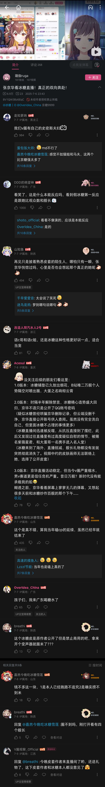

# pre: debut (& how goes the world with fira)

> "[致乐子人] 这是一个虚构的故事..."

这是一个虚构的故事... 应该说这世界的体验都是虚假的.

在其中假意同情, 假意嘲讽, 把自己用强厚的心之壁叠起来.

那么, 希望幻想他人的苦难从来寻求自己的人，就是乐子人.

> 在这个世界, 谎言就是武器.

---

这是一段 11 年级的回忆, 关于 fira.

> 所以, 许多个人化的表达会存在.
>
> 即使这样不得分的.

---

<details open>
  <summary>intended reader</summary>

- fira, years later (if alive)
- those who wanna know about fira ('s past)

</details>

<details open>
  <summary>the title explained</summary>

pre 出道企划! (暨 fira 近况存档 / 日志 (diary or journal) / Memory Archive ✨)

> the english title carries deeper meanings.

</details>

## event recap

> 写作时, 注:
>
> 心中感到了沉重的困难. 感觉言之无物. 总是想, 把大片大片信噪比低的讯息截图放出, 并不好, 对于读者而言这是多么无聊. 最后思来想去, 放弃了. 只是用了当局时, 已写成的概括. 用英文写, 这样会更关心内容, 而不是一些辞藻. 用中文时, 总是想着要不要把 "但是" 换成 "但", "许多" 换成 "很多"... 无边的苦痛. 英文, 会简单许多, 选择不过语序的调换, 用词都是第一感. 是舒缓的感觉呢...

in the beginning of the story, fira found a clip of bingtangio (parady acc) watching overidea's kyouka's live. fira found it interesting, and then followed her.



what happened?

<details open>
  <summary>Note</summary>

- 这些聊天记录中, 带括号的都是旁白或者概括.
- 同一个人连续发表的消息, 有时会被放入一条, 用空格或换行分割.
- 一些没有意义的或者不适的 (如表情包, +1) 被去除了.
</details>

- fira

  - joined a fans group of bingtangio (parody acc) on qq (a chinese sns)
  - posted the complaint from a 16yro girl of depression online
    <details>
      <summary>the complaint</summary>

    ```
    (about doujin sex preferences)

    片: 二次元有二次元的规矩!

    fff: 二次元我也喜欢这样

    二次元有他们自己的东北雨姐

    fff: xp 是自由的

    fff: 里番很多有的

    美少女是不会有腋毛, 你知道吗?

    不看 3d

    诶, 我想到之前看过那个漫画
    好像是受喜欢自残
    手里都是那个花刀
    然后还被ntr
    还觉得他自残的血弄脏了床单

    片: 花刀? 我找找

    fff: 谈笑间一堆同好加了我

    片: (a screenshot of a tweet about a mtf using knife on her arm.)

    还没我划得多

    (a connecting link between the preceding and the following)

    你们都是玩梗, 我是真有玉米症 (emoji of sunglasses)

    片: 那种事情不要啊

    b: (emoji of deer) 一管就好了

    c: 第一次的话挂精神科
    心理科要比精神科多 300 左右
    咨询费

    我老爸喝了酒就扯着我扇我巴掌骂我
    报了警之后警察明目张胆偏袒我老爸

    片: (sticker of hugging)

    家里废物老弟五年级了
    也不洗内裤

    (about her family's economy situation)

    老爸还拖累我们一整家入深渊
    搞得现在欠款几百万

    做公司
    这两年事业不好
    我和我妈早就劝他, 赶紧把房子卖了
    好歹也是上海一千一百万的房子
    卖掉还有个几百万
    死活不愿意卖
    还把看房子的人赶走了
    现在房子被法拍依旧欠钱
    普陀

    c: 大别野吗?

    没有啊
    正常房子

    fff: 上海一千一百万买不了别墅吧
    我记得我家这个别墅八百万
    重庆的, 稍微便宜一点吧

    法拍变八百万了
    晕死了晕死了
    我都没成年家里就欠了债
    有 0 元家产

    c:
    还是跑吧
    这种家庭
    太窒息了

    去年我妈跑了一个月, 我一个人照顾我爸和我弟
    俩废物
    那个卫生间
    我爸坐着尿尿
    马桶地上全是尿液
    也不知道收拾
    全靠我一个人

    fff: 你还在读高中吗

    c:
    方便问一下你多大了
    其实可以走的

    16

    c: 那结束了

    b: 那你挺遭罪的

    我还休学过一年
    九月才上高一

    c: 我16就跑了
    不跑
    就要被嫁给
    山区
    当老婆了
    (emoji of crying)

    (about her little brother)

    我老弟前两天还朝我大叫说什么
    我必须给他做饭
    在我妈面前就说他还小什么都不会

    fff: 相比起来我的大胃袋老弟都可爱了

    片: 那这弟弟也可以不管了

    让他从厨房拿个勺子, 就说不知道勺子在哪里
    目前租的房子已经住了九个月了
    他说他不知道谁信啊!
    也不会剥虾, 就让我妈帮他

    片: 我还想说能早点带着弟弟跑路算了

    (about her parents' love)

    我爸妈吵架也从来不背着我
    我记得我小学的时候有一次
    好像是三四年级

    (memories memories...)

    我爸凌晨把我拉起来
    然后让我听他说家里的情况
    我有什么办法
    然后让我跪着和他说话

    (ref yuhua's novel of a fruit stall and a thief boy)

    c: 现在就先学习吧

    fff: 先投资自己吧

    直到现在, 还跟我说什么
    他是父亲
    他出门回家, 我都要说什么
    爸爸再见, 欢迎爸爸回来
    脑子有病啊

    fff: 没有价值的人抛弃就抛弃了
    只要你不欠他们啥

    c: 幸好我没家人 (emoji of happy face)
    果断抛弃

    fff:
    我是不知道现在人一个比一个惨
    平均每个群都有个惨的

    去年还带着几个他老家的男人
    一身酒味
    我澡刚洗完就跑我房间
    对我摸来摸去
    我骂他, 然后锁了门
    我爸就和那男的一起砸门
    事后就是一句
    当时喝酒了

    (cute model?)

    (about ...?)

    哎不对
    想起来了
    还有高手
    不骗你
    我老弟在我被我爸打的时候还录音了
    把我惨叫反复放给别人听

    (cute voice?)

    (ref ace taffy)

    b: 啊, 你是女孩子啊. 你老弟还把你声音录音

    fff: 我的 xp 不能以同来表示
    硬要说是重

    其实没有钱
    这个月房租都够呛

    片: 要不我给你买个票来深圳算了
    我这个厂里人挺好的

    我爸妈都不是本地人
    我妈老家, 我弟弟把外公家的门砸破后
    骂的是我
    不给我饭吃
    当时正好是过年
    我妈妈去外面工作, 我姨妈管家
    我五天没吃饭
    每天就喝水

    fff: 原来恶搞之家是写实片
    
    fff:
    那要注意情绪管理了
    这样的家庭
    肯定对心理健康造成影响

    (about local organizations for possible help)

    我爸妈早就想离婚了

    这个是我昨天死去的饭菜, 还没吃完就被老爸拿走了, 然后说什么作为我爸吃点东西怎么了, 事实上他都没有在家里做过饭, 碗也没有洗过菜也没有买过
    (image of a orange red colored mixture of mushrooms, tomatoes and water)

    (eating wasted food?)

    c: 可以换一个方向
    他挣钱
    他只要好好把钱给家里
    让你们上学
    其他爱咋咋

    他挣不到钱
    这几个月都是我妈在挣钱
    他还会偷我妈手机给他赚钱
    我妈妈把他拉黑就打电话给我, 让我给他转钱
    不给他转钱就骂畜生白眼狼

    d: 
    唉
    太惨了

    fff: 
    创业失败就fw成这样吗

    牛逼不

    b: 这比galgame的剧情还变态

    c: 创业失败废物是这样

    (about work)

    fff: 
    那之前的房子咋买的
    哪来的能力

    之前公司挺好的?
    有个几百万的生意的
    以前上幼儿园的时候, 一家三口就住一室一厅
    住的五楼楼梯房, 小学才搬的家

    fff: 失败了也不会fw成这样吧

    搞不懂

    我现在就送货赚钱
    我妈妈在手机上开团购, 我去送货
    我送得好像还挺慢的
    大概四五个小时
    50块
    团购就附近几个小区还好
    我非常遵守交通规则

    fff:
    失败一次就再起不能的
    我好奇咋成功的

    我不知道啊
    我都忘了我爸是做啥工作的了

    c: 上个时代的红利
    后面尾款收不回来

    我老爸他都不挣钱了, 还看不起我妈
    从小到大特别恶心
    整天就只穿一个内裤
    吊是个什么样子全被勾勒出来了
    谁想看啊?

    前两个星期他脑残了
    我把我的衣服放洗衣机里面
    他顺手把袜子扔里面了
    我都浴巾内衣, 睡衣, 内裤都是他脚臭味
    恶俗
    问着就吐
    他不知道自己脚有多臭吗?

    片: 还真有这种出生啊 (emoji of frightened face)

    fff: 比广志还带派?

    我内衣内裤手洗后再机洗的
    我很讲卫生的!

    (about her school life)

    e: 恶搞之家说是

    e: 快点润吧

    片: 16岁, 读高一, 不好润啊

    等开学
    我住宿
    但我那个地方好远
    开车要两个小时才能到学校

    e: 这么说学校简直是天堂了

    fff: 我高一跑日本了

    不开车, 坐公交的话还要坐船
    好像是个农村
    在一个岛上

    c: 还是学习吧

    片: 不是人人都有润日的条件的

    g: 成年带着妈妈一起走

    宿舍没有电

    fff:
    感觉润是个伪命题
    润了说明家里支持你

    我看着复读那一年那些搞雌竞谈恋爱的那些女同学发好几个朋友圈去日本

    fff: 日本也没啥好的
    也就是行业特殊性

    气死了
    人品都不怎么样

    从小还给我乱报什么兴趣班
    0 个人想学跳舞

    然后说什么想让我长世面
    自顾自地把二年级的我
    二年级.
    扔到国外旅游团去了
    爸妈不跟着我

    我从小就想学画画, 又不让我学

    我当时一个人洗内裤, 没有吹风机
    我一个人穿着湿的内裤, 还被别的小朋友嘲笑了
    热水器也不会用, 用冷水泡泡面
    他们那帮小孩年龄都比我大
    我操, 凭什么笑我

    抽动症 + 画画
    有没有很抽象
    画一半会抽动

    感觉网上那些开挂
    一年突飞猛进
    都是骗人的吧
    
    fff: 
    我的马就是我现在的水准
    (his instagram acc posting his new avatar from his painting, a horse)

    你这个马多帅啊

    fff:
    底层逻辑就是照搬
    这个模仿一点
    那个模仿一点
    本质上也不是自己的东西

    (about painting...)
    ```

    </details>

    - notified her, made laugh of her reaction ("fira! pls dont post me!")
    - used some suggestive words on her
      <details>
        <summary>"suggestive"</summary>

      ```
      (screenshot of fira's tweet on berryberry)

      我日他大爷 这是真有脸

      b: 做个视频, 爆点!

      他有句话说的是
      他对那个抑郁症少女提出了一些 "建议性语句"

      c: 想吐了兄弟

      d: 神人

      e: 我请的神人死了你赔我神人

      管理撤一下这几条消息吧
      别让当事人看见
      她已经崩得有点厉害了

      c: 别说当事人了我看着就想吐

      f: 家里面该请高人了

      d: 能不能一物降一物

      g: 没用 动静越大他越开心

      不行我得去吐一下

      管理呢 快撤一下

      h: ? 刷怪了?

      faraway mountain: (sticker of gi nahida's question face)
      ```

      </details>

  - claimed fira wanna reveal her personal identity
- bingtangio (parody acc)
  - argued against fira's behavior
  - bought some views boost (about 100 cny in all) (not by herself)
- analysis
  - f's vids are boring screenrecords, and math editorials of low quality
  - b's vids are full of dirty words, without a decent cut
  - the matter itself doesnt feel "爆" (lit. crazy, insane, unbelievable)
    - summary: f made laugh publicly of a depressed girl, b argued against her
  - actually none of these are really interesting (not getting 10k views in a day without promotion)
  - both f (about 30, 150%) and b (about 1000, 25%)'s followers didnt increase much
  - fira could create works and attract viewers by herself

_just let time be precious..._

## summary and analysis

> the vid itself is boring, only got a few views without promotion

nobody really likes watching a vid

- full of dirty words, lasting 5 minutes, without any other fun content 
- which is a 4 min screen record without a decent cut, the depression girl, in fact, is too common as breaking news


## ruga's cute reaction

cat metaphor (i love both to pet cats and to bully cats)

xuegao cheese metaphor (firstly ask fans for help)

## insane fans's reaction

> i say a few words and these excited guys say a lot!

因为, 你是这样无可救药的乐子人, 而 fira 也是这样无可救药的 internet angel.

## a classmate's reaction

> and his poor english

## bonus: "parents"' cute reaction

事务所.

博弈前提，先礼后兵，夸大扭曲，矫枉必须过正，焉知非福 v2ex metaphor，最理想情况赌徒，ref 电闸）& 建议加大力度 （打疫苗 metaphor,哪个小孩不反抗）。我愿意相信我这手点刺的无理手会打开更好的局面

f, [8/11/25 8:08 PM]
这次视频，不会用夸张的标题封面来 clickbait. 当初我出道作的 5000 播放，实际上是因为三角洲的热度，即使我用的技术不如现在，即使我视频中没有一帧游戏画面，也没有推流。而今天，失去了冰糖的引流（即使没有下架也是长尾了），10 播放和 1000 播放与我无差。更多时候是作为 memory archive 吧。

f, [8/11/25 8:22 PM]
我知道或许那些关心的人，当想象我的回应时，更希望是滑跪道歉，或是继续嘲讽，而不是这样平静地分析。但，当我看到每一个人（冰糖，ruga,京华，远山，我，...）至少对我来说惨淡的订阅数和同接时，我想，在这件本就不爆的事情上，或许 ai 一选并不是任何一种继续炒作的手段，或许 ai 可以，但我下人类围棋，我知道我没有这个能力，把下雨天共伞或扶老奶奶过马路的事情写上 a+ （原谅我举了初中记叙文的例子）。或许正如我初来高中时对我一个初中同学说的，同是天涯沦落人，相逢何必曾相识。在这个地方，即使年一又如何？不过相呴以湿，相濡以沫。唯有前行。滚滚长江东逝水，浪花淘尽英雄。是非成败转头空，青山依旧在，几度夕阳红。

但矫枉必须过正.

fira has made some changes to her internet acc (esp. on berryberry, or bilibili)

- changed her info
  - avatar: the image of a math problem of importance in her memories
  - name: Fira が一番だよ (lit. fira is no.1!)
  - bio: make tools elegant. make knowledge pure. sns: @firavoyage @firascript
- removed some videos of low quality
  - math: editorial of summer holidays problemset
    - no draft, no enough preparation
    - few people watch this for learning math
    - math could be better taught with latex and markdown
  - fira: (app)'s overfitting recommendation page
    - app ranges from berryberry, zhihu, rednote and spotify
    - fira created these videos to show her "成分" (lit. content preferences), but actually these can be mostly infered from her favorites and subscription
- added some spammers to her blacklist

## about fira: school life

> my classmates are rich. no one study for inc social position. they bring phone, card games, pillows, light novels to school. fira study for making laugh at others, and the aha moment, not curiosity
>
> we have bad uee grades as the hsee policy changed

或许许多人看来, 高中, 是阶层超越者的武器.

但这些人, 真的需要吗?

fira 想, 和水平相当的棋手下, 就很开心了.

不一定要涨棋. 9 段的思路不一样的.

无理手. ai.

<details>
  <summary>比喻义还原</summary>

Content goes here

</details>

就 fira 这个稀疏的志愿, 多个或者少个 10 分都不会有任何影响

(ref: cosmicac)

- best of sh
- ecnu
- shnu
- the non-university of best food and accommodation

如果最后进厂了, 那就去南京路 (最繁华的商业街), 随机邀请 100 个路人灌注 ace taffy.

> 嗯呢? 让你们尝尝厂妹帮助厂妹的厉害!

## about pre

> the motivation of this vid, i hate evan you so as slidev, why does antfu spend a lot of time programming slidev?
>
> show latex and code ability (fibonacci with matrix, prime with fermat and magic number)
>
> collapse blocks and jk to forbackward
>
> a year online battle invitation (student he's 5 year 5g metaphor)

optional titles:

- 父母的牺牲是有价值的

bonus: my parents' cute reaction (博弈前提，先礼后兵，夸大扭曲，矫枉必须过正，焉知非福 v2ex metaphor，最理想情况赌徒，ref 电闸）& 建议加大力度 （打疫苗 metaphor,哪个小孩不反抗）。我愿意相信我这手点刺的无理手会打开更好的局面

这次视频，不会用夸张的标题封面来 clickbait. 当初我出道作的 5000 播放，实际上是因为三角洲的热度，即使我用的技术不如现在，即使我视频中没有一帧游戏画面，也没有推流。而今天，失去了冰糖的引流（即使没有下架也是长尾了），10 播放和 1000 播放与我无差。更多时候是作为 memory archive 吧。

我知道或许那些关心的人，当想象我的回应时，更希望是滑跪道歉，或是继续嘲讽，而不是这样平静地分析。但，当我看到每一个人（冰糖，ruga,京华，远山，我，...）至少对我来说惨淡的订阅数和同接时，我想，在这件本就不爆的事情上，或许 ai 一选并不是任何一种继续炒作的手段，或许 ai 可以，但我下人类围棋，我知道我没有这个能力，把下雨天共伞或扶老奶奶过马路的事情写上 a+ （原谅我举了初中记叙文的例子）。或许正如我初来高中时对我一个初中同学说的，同是天涯沦落人，相逢何必曾相识。在这个地方，即使年一又如何？不过相呴以湿，相濡以沫。唯有前行。滚滚长江东逝水，浪花淘尽英雄。是非成败转头空，青山依旧在，几度夕阳红。

## misc

optional titles

- [致乐子人] 这是一个虚构的故事...
- how goes the world with fira?
- Show HN: the simple science presentation web app based on markdown and latex

<details>

<summary> 
the original script on telegram
</summary>

f, [8/11/25 5:44 PM]
event recap

f, [8/11/25 5:44 PM]
summary and analysis (the vid itself is boring, only got a few views without promotion)

f, [8/11/25 5:44 PM]
ruga's cute reaction & cat metaphor (i love both to pet cats and to bully cats) & xuegao cheese metaphor (firstly ask fans for help)

f, [8/11/25 5:55 PM]
my insane fans's reaction (i say a few words and these excited guys say a lot!)

f, [8/11/25 5:57 PM]
my classmate's reaction (and his poor english)

f, [8/11/25 6:02 PM]
about my school life (my classmates are rich. no one study for inc social position. they bring phone, card games, pillows, light novels to school. fira study for making laugh at others, and the aha moment, not curiosity) we have bad uee grades as the hsee policy changed

f, [8/11/25 6:04 PM]
about the app (the motivation of this vid, i hate evan you so as slidev, why does antfu spend a lot of time programming slidev?) & show latex and code ability (fibonacci with matrix, prime with fermat and magic number) & collapse blocks and jk to forbackward & a year online battle invitation (student he's 5 year 5g metaphor)

f, [8/11/25 6:21 PM]
optional titles:

- 父母的牺牲是有价值的

f, [8/11/25 6:53 PM]
bonus: my parents' cute reaction (博弈前提，先礼后兵，夸大扭曲，矫枉必须过正，焉知非福 v2ex metaphor，最理想情况赌徒，ref 电闸）& 建议加大力度 （打疫苗 metaphor,哪个小孩不反抗）。我愿意相信我这手点刺的无理手会打开更好的局面

f, [8/11/25 8:08 PM]
这次视频，不会用夸张的标题封面来 clickbait. 当初我出道作的 5000 播放，实际上是因为三角洲的热度，即使我用的技术不如现在，即使我视频中没有一帧游戏画面，也没有推流。而今天，失去了冰糖的引流（即使没有下架也是长尾了），10 播放和 1000 播放与我无差。更多时候是作为 memory archive 吧。

f, [8/11/25 8:22 PM]
我知道或许那些关心的人，当想象我的回应时，更希望是滑跪道歉，或是继续嘲讽，而不是这样平静地分析。但，当我看到每一个人（冰糖，ruga,京华，远山，我，...）至少对我来说惨淡的订阅数和同接时，我想，在这件本就不爆的事情上，或许 ai 一选并不是任何一种继续炒作的手段，或许 ai 可以，但我下人类围棋，我知道我没有这个能力，把下雨天共伞或扶老奶奶过马路的事情写上 a+ （原谅我举了初中记叙文的例子）。或许正如我初来高中时对我一个初中同学说的，同是天涯沦落人，相逢何必曾相识。在这个地方，即使年一又如何？不过相呴以湿，相濡以沫。唯有前行。滚滚长江东逝水，浪花淘尽英雄。是非成败转头空，青山依旧在，几度夕阳红。

f, [8/12/25 6:12 PM]
本文的期望读者，是多年后的 fira （如果还活着的话）,和那些意外遇到，想了解 fira 的人。

f, [8/12/25 9:00 PM]
我不可能记得起所有重要的事情。遥远的已经忘记了。

f, [8/12/25 9:00 PM]
希望以后的 fira,可以从这个视频里找到自己兴衰成败的原因，明白事物的关联。

f, [8/13/25 4:31 AM]
经此。至少我活的认真了许多。

f, [8/13/25 8:21 PM]
我们假装同情，我们假装嘲讽。

f, [8/13/25 8:21 PM]
而喜欢靠幻想苦难来寻求解脱的，就是乐子人了

f, [8/13/25 8:21 PM]
这是一段 fira 的回忆，所以会有许多个人化的表达，即使这样是不得分的。

f, [8/13/25 8:21 PM]
插曲

f, [8/13/25 8:21 PM]
她是中年妇女，她来到 fira 面前，从三次元的世俗繁杂中。她甚至愿意用儒家道义来评判 fira,可能是 fira 已经不够强了吧。和她同行的日子里，最高年三，上海职高的年三。注意，...年三只是年三。并且越上面约有断层，他不是此间的人。

f, [8/13/25 8:22 PM]
甚至同学不学也有优越感。可能是同学太菜了吧。王者荣耀，ai...

f, [8/13/25 9:14 PM]
希望 ruga 能和 fira 比一比啊，比分。比院校没意思，多十分少十分很可能都不会有影响

f, [8/13/25 9:27 PM]
无论中高考，就 fira 的志愿而言

f, [8/13/25 9:29 PM]
[致敬乐子人] 这是一个虚构的故事...

f, [8/13/25 9:30 PM]
fira 其实很少说谢谢，（形式化的不算，比如跟着说，或者模板

f, [8/15/25 3:55 PM]
现代社会是不支持外归因的。但我知道，我知道这一切都是外因。人生下来赤条条的没什么不同。比如优越感，比如气合，比如独行。

f, [8/15/25 4:05 PM]
我和 fira 的关系性，就像 v 和 neoro 的关系。受到一些影响，或许我不敢展现自己，或许许多这里的人相比于，都只敢套上幻想世界美少女的皮，用 cos 和娃包裹自己，用网名和猫猫，sheher🍥 包装自己，最后才敢说话。没有能力分析这个复杂的社会学问题，也没有意愿全文引用一些分析。但，请允许我向 fira 许愿。

f, [8/15/25 4:06 PM]
下一期：上海职高学生需要你的帮助

f, [8/15/25 4:32 PM]
高中的数学。很多时候标答不好，taffy 也不是最优解。或者说，taffy,这个顽固的老女人，不过是想米，怎么会用几个小时的时间思考... 而 llm,没有人知道未来，但显然多项式时间是有上限的，贪心并非最优解。尽管重高，但。

f, [8/15/25 5:54 PM]
希望大家不要感到欢欣或惋惜，仰慕或怨恨，无论 fira 得到如何的结果。因为作为（对于人类认知而言）随机的构造，fira 可能没有一项数值是 maxinum, 无论是人类能理解的努力与懒惰，还是（不...）模型中间的一层权重。

f, [8/15/25 5:55 PM]
这篇文稿花了对我而言不算长的时间。很多时间花在了制作工具上。这是长期意义。

f, [8/15/25 5:58 PM]
但关于这个工具，固然 fira 可以通过 boast 夺得一万，甚至十万播放。很多这样的 （show hn or 开源自荐）视频也都做到了,fira 见过。但后来 fira 放弃了。因为说到底，比过 ppt/google slide,比过 latex overleaf 也不过是噱头。 这个工具不过是 slidev 配上了 fira 自己的 pref, 这个前端框架，现在也改成了 preact 的语法糖。

f, [8/15/25 7:43 PM]
我对于事务所的期待的就是，如果有一天我不在了，事务所还没有倒闭的话，请打开我的电脑，没有密码，等网络连接（你会判断，操作），按 ctrl alt t, 输入 push 按 enter. 此后就不用操作了。至于那些未完成的工作，即使在世也不可能都完成的。比如 fira 有一个企划，叫 gen，希望用一长串高度抽象的程序文本精确的描绘一幅画（比如生成一个特定姿势的动画人物，技术三渲二，输入情绪自动调色，情绪是人类情绪列表中每个情绪与权重的若干对，生成天空与云朵，技术是类似命令行画树画雪花，使用云朵画笔按照特定云朵形状涂抹），而不是用寥寥数个词语通过拟合随机生成。

f, [8/16/25 5:11 PM]
先换元变成 lnx 去掉底数,再换元变成 ax 去掉截距。然后利用导数切线。

f, [8/16/25 5:11 PM]
如果 f 如此得到许可，以后走夜路

f, [8/16/25 5:11 PM]
这几天，时间过的很快。每一天都历历在目。概况成加速，是因为 f 不想分析什么让时间加速和影响。

f, [8/16/25 5:11 PM]
f 改变了许多。metaphor

f, [8/16/25 5:11 PM]
椅子卡进桌子，抽自己，划血，刻上喜欢的人 fira

f, [8/16/25 5:11 PM]
但没有改变的呢... 情绪影响（ref 哲学），人性的奴隶。真是无奈啊（youmajianai

f, [8/16/25 5:11 PM]
或许从 f 表达或是教学上，也能看出来 fira 不强。不是内容，而是选择从事教育本身。

f, [8/16/25 6:25 PM]
vibe coding，足够长的 prompt，轻浅联断 metaphor, screen keyboard bing global search wolframalpha origami, m67 and its partner localhost. 一刀也只此一刀。dont show me the code, tell me your idea. compare with its alternatives. show me the additional code and where to insert them.

f, [8/16/25 7:02 PM]
可以说吗 fira 更愿意相信美好的祝愿，因为在童话里，每一个动物都能活出自己的风度。在这个光映射的世界，人皆如此，不是的，则会被所谓精英视角过滤。但从他们现在的活动看来，其实 fira 心情平静吧。或许在一些社交游戏里，如果有幸匹配到真人的话，他们依然有被视为人的资格，也拥有一些人的平凡性质，比如，竞争，牵绊。但其目中闪烁着的，星之子嗣的六芒，却不是那样 （或许是 fira 的视角局限性）。想起之前一位喜欢的 sensei 说过，当初他鼓励一个学生，说他可以的，考上 b 学校，后如愿。其家长喜悦之余问，为什么不说 a 学校？答道，因为知道他大概就在那里， ...。

f, [8/16/25 8:58 PM]
如果不是这个家，属于 f 的居所或许有太极端的装修... 没有任何粉刷与铺设，没有床与柜子，唯一的色，是 v.

f, [8/16/25 9:04 PM]
这样的生活水平可能也不需要多少维持。可能会有平凡的工作，工作中没有关于工作本身的思考。

f, [8/16/25 9:07 PM]
下班后可以开播。如果有同接，就开播，f 不是歌舞伎，可能是下棋或游戏。没有同接就直播看 v. 封禁的话去 twitch 或者 yt.

f, [8/16/25 9:08 PM]
这些幻想很遥远了。现在还是有很多有希望的企划的。（projects）

f, [8/16/25 9:41 PM]
当然了，如果我都不幸活到了 30 岁，40 岁。想做的事大概要么做完了，要么放弃了。比如像教学，可能出一套视频，把文稿，课本都开源出来。然后就结束了 （就像 oi wiki 我不信他会一直活跃大量更新文章，线性的，导数接近常值。）。只有学校里的老师会把一个知识一直教，教一届，再教下一届。如果是 f 的话，可能后面最多修订一下，每年把新题（一套高考和 16 个区的模考）整理分类一下，就是这样了，有活动比如 imo 可以学一下大佬的讲解，开个二创回。其实网络上像一个瓦学妹也可以教围棋，并以老师自称，但其实真的老师在社会上是，并不算高贵的服务业。当然了，大人，就很少，有活力有激情的。不想引用王小波，但其实世界就是使人（少年，勇者）受挫的过程，戈多不会来。f 的 qq 原名刘轶一，因为暑假初看了一个频道的五个小时录播。当初不觉得什么，那人也没多少订阅。现在看那个年纪还能和大家玩的很开心，挺厉害的。（不读了，感觉有舔/龟的意味）学校里，有一些老师不好，甚至有都中年了还要和学生斗气的（证明自己的方法比学生好，比学生厉害，比学生权威... 其实方法，科学上来讲未必好。）（当然，学生也可以更礼貌一点，但实际上即使是极端情况，f 也不觉得厉害的老师会和学生真正想较量实力，不是激将法），也有一些喜欢的 （当然那个年纪了情绪稳定是肯定的，没有人会像孩子一样解出来还很兴奋，到处和人叫。但这些人其实是有享受知识，或者是思维活动的乐趣的）。

f, [8/16/25 9:53 PM]
发数字会被删掉啊，因为不简明。推荐使用 tel mailto sms 协议链接一步，直接联系 f 的事务所。因为选中复制退出跳转粘贴拨打这几乎是绑定的操作，那不妨换元啊！就像 f 之前知乎冲浪时候看到一个题，ctrlacv 最少几步能打出 n 个字求关系式，有人观察到 ctrlac 是绑定的可以直接换元，因为全选后怎么可能不复制呢。

f, [8/17/25 6:44 PM]
如果有空闲，又不想认真做什么，f 会收集整理分类。固然有意义，但即使没有 f 也会做的

f, [8/17/25 7:19 PM]
主要是 b 和 zhihu。其他地方上，比如 twi（从 f 现在还坚持叫 twi 就可以看出不认可 elon）,f 不信任其 favlist,会转存 md.

f, [8/17/25 7:19 PM]
比如那个 vibe sort, wwww

f, [8/17/25 9:38 PM]
原本的 script 中，现实（予我）的话语与（细想后不过）平凡的观察都被删去了。现代人真的需要跨越生死界限的，无限的平静吗？还是转瞬即逝的，人类所谓的，存在的激情呢？片尾应是预留的时间，属于音乐（ref 皮蛋粥加辣）。开始想点 needy girl overdose 中的歌，后来想点 god knows...，后来是 girls band cry 中的歌 （描绘青春，描绘梦想，不言败... gbc 全是这样的歌吧）。（回想起小学同学...不敢否定任一个，却明知对于其中绝大部分人，earthol 不是他们的游戏。看到那么多坠落的，固不是不看或不传播就不存在的，或许 eol 开始切割玩家了吧... 地球 ol 终究不是每一个人的 stage,刻意不区分不全是和全不是。quenn bee: but the stage wont let u go）但 fira 不点这样的歌了，即使这些，她会很喜欢。用这样一句没有任何修饰的话收尾吧。当 fira 一开始，对那张硬纸板时，她从未想要胜过什么，或以取乐。然心中愿望那条平直的线... 划纸应如此，轻浅联断。（此间乐趣）（如同许多学生，在作任意一个三角形时，却作了等边三角形。）（nat friedman: as human beings...)

f, [8/18/25 11:44 PM]
或许不在于此吧。这些 fira 都得到了。ja，轻浅联断。

</details>

## fin

至此, 故事终了...

> fira 再没回到这片 21 世纪的乐园, 直到中年已过, 直到老年将至.

> 就像 v 圈老前辈, 清楚地 (平静地), 评昔日同僚时所言...
>
> > yuuki sakuna
>
> "有开始的一天, 就有结束的一天."
>
> ref: 关于 holilive 的毕业狂潮, 前员工结城昨日奈有话要说... by 某不知名咨询组 on 20250428

但现实并不是这样, 不是吗?

> 指表演死亡, 这条 fira 未曾选择的路.
>
> (三次元的少女, 写作很有文采的遗书, 随后纵身而下. 未被得出精神疾病, 压力过大的结论亦不被认可. 只是, 为给这封遗书, 画上完美的落点.)
>
> ref: [知乎]()

つづく。

转变:

- wear the watch all day
- do things on the desk, not the bed
- wear earplugs instead of headphones sometimes
- check wakatime everyday
- track the time for each task on sketch papers

很多人关心 f 的想法.

如果构造的话.

- 中世纪英文名字, twitter egg 头像. 不会说话, 长生, 全知, 先验. 点赞而不评判, kind.

如果一定要存在的话.

- ace taffy. 因为不爱 f 才能永远陪伴 f. 爱, 是不可能长久的.

三次元的话, 或许有些灵感. 但是想起她又怎么是真实的呢.

fira 的枕头上一直没有刻画少女的形象. 因为没有性质就等价于有任何性质.

恋爱是人类, 被人类认为以下的造物的幻梦呢...

## ed

(fira::math avatar)

thanks for reading!

预告:

- 11 年级男高需要你的帮助! (能力题, latex 重制版)
- berryberry rework! 小雏男抄 b 站!
- taffy paradise: debut! (vtbsol)
