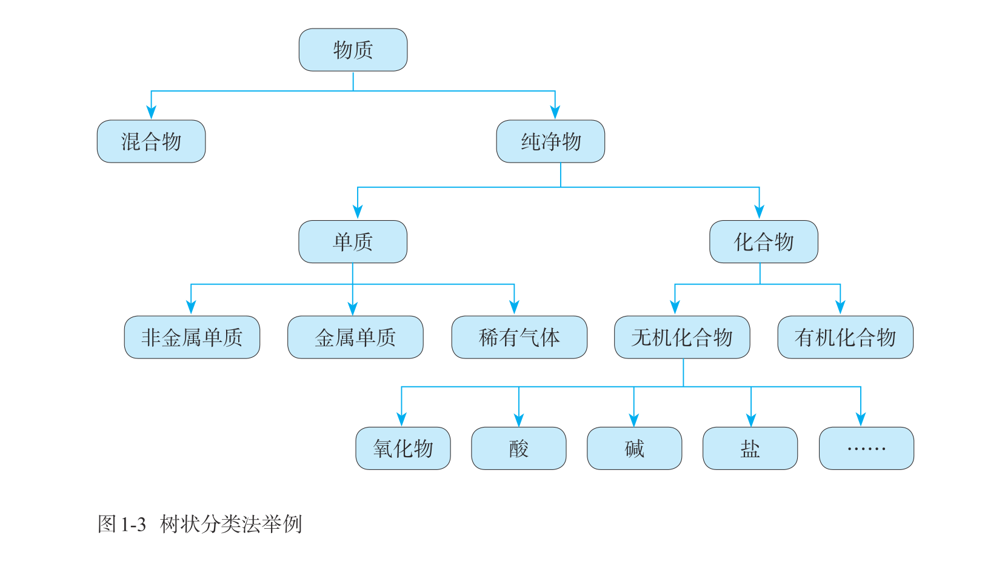
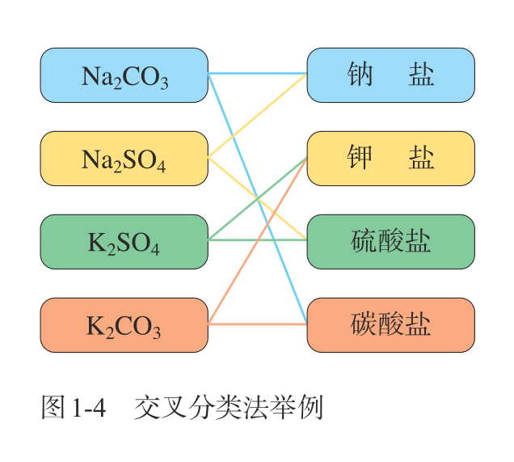
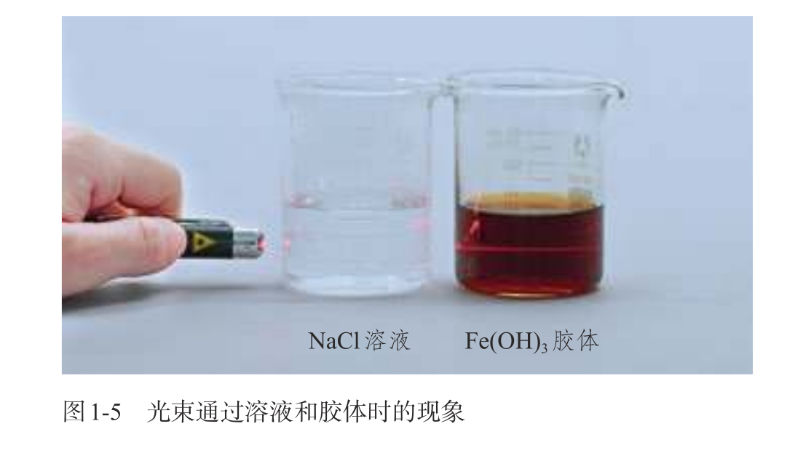

## chapter 1

> 欢迎学习高中化学. 我们将进一步探究化学的美妙.

### you will learn

- 如何认识物质
  - 分类法
  - 分散系
- 如何计量物质
  - 物质的量
  - 摩尔质量
  - 气体摩尔体积
- 如何研究物质
  - 制备
  - 分离和提纯
  - 检验
  - 配置一定物质的量浓度的溶液

### 物质的分类

#### 树形分类

化学家将性质相近的物质分类在一起.

- 物质
  - 混合物
  - 纯净物
    - 单质
      - 非金属单质
      - 金属单质
    - 化合物
      - 无机化合物
        - 氧化物
          - 酸性氧化物
          - 碱性氧化物
          - 其他氧化物
        - 酸
        - 碱
        - 盐
        - ...
      - 有机化合物

混合物和纯净物, 通过物理变化相互转化. 单质和化合物, 通过化学变化相互转化.

这种分类方法称为树形分类法. (物质如树干, 引出混合物, 纯净物等树枝...)



#### 交叉分类

有时, 分类会出现重叠.

- 酸
  - 是否含氧
    - 含氧酸
    - 无氧酸
  - 有几个氢原子
    - 一元酸
    - 二元酸
    - ...
  - ...

比如硫酸, 既是含氧酸, 又是二元酸.

一种物质可以进入多个分类, 这种分类方法称为交叉 (标签) 分类法.

交叉分类还有许多标准, 如

- 聚集状态 (固体 / 液体 / 气体)
- 导电性
- 溶解性



#### 分类的意义

物质的分类, 可以用于推测物质的性质.

> $\ce{CO2 + Ca(OH)2 == CaCO3 \downarrow + H2O}$
> 
> $\ce{SO2 + Ca(OH)2 == ?}$

观察反应物和生成物的分类, 可以发现规律:

```
酸性氧化物 + 碱 == 盐 + 水
```

于是可以推测

$\ce{SO2 + Ca(OH)2 == CaSO3 \downarrow + H2O}$

分类表明性质, 性质决定用途.


### 分散系

#### 概念

溶液、乳浊液和悬浊液, 都是由一种物质分散到另一种物质中形成的混合物. 我们将其统称为分散系. 

- `分散系` 一种（或多种）物质以粒子形式分散到另一种（或多种）物质中所形成的混合物

被分散成粒子的物质, 称为分散质. 另一种物质叫做分散剂.

如溶液中，溶质是分散质，溶剂是分散剂.

#### 分类

分散系, 根据分散质粒子的直径, 分为溶液, 浊液和胶体. 浊液, 包括悬浊液和乳浊液.

- `溶液` 小于 1 nm
- `浊液` 大于 100 nm
- `胶体` 1~100 nm

我们将重点介绍胶体.

#### 胶体

胶体，根据分散剂的聚集状态，可分为液溶胶、气溶胶和固溶胶

- 胶体
  - 液溶胶, 如Fe(OH)3 胶体
  - 气溶胶, 如云、雾
  - 固溶胶, 如有色玻璃

#### 丁达尔效应

胶体和溶液, 用肉眼难以区分.



但当我们对溶液和胶体分别打光, 胶体内会形成一条明亮的 "通路", 溶液则不会. 

这条明亮的 "通路" 是由于胶体粒子对光线散射形成的, 称为丁达尔效应. 

丁达尔效应是胶体独有的物理性质.

丁达尔效应在日常生活中随处可见, 例如林中树叶缝隙间的 "天光", 电影放映机到银幕间的光柱.


资料卡片中, 解释了胶体粒子对光线散射的原因.


### 物质的转化


